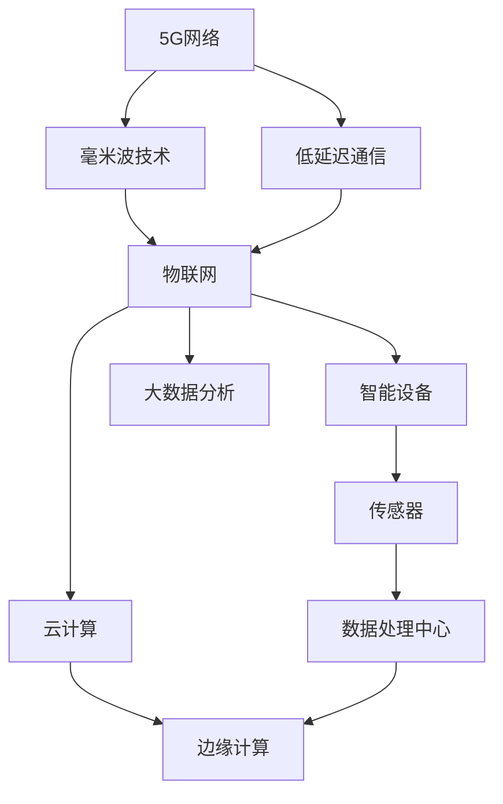

                 

关键词：5G，物联网，高性能，低延迟，融合，网络技术，智能连接

摘要：本文探讨了5G技术和物联网（IoT）的融合对于实现高性能和低延迟通信的重要性。通过分析5G网络的基本原理和特点，以及物联网的应用场景和需求，本文阐述了两者融合的技术挑战和解决方案。同时，文章还讨论了相关的数学模型、算法原理、项目实践，以及未来发展趋势和面临的挑战。

## 1. 背景介绍

随着信息技术的飞速发展，5G（第五代移动通信技术）和物联网（IoT）已经成为现代通信领域的两个重要趋势。5G网络以其高速率、低延迟、大连接等特点，为物联网应用提供了强有力的支持。物联网则是通过将各种物理设备连接到互联网上，实现智能化的管理和控制。两者的结合不仅能够提高物联网应用的性能，还能拓展其应用范围。

### 1.1 5G网络的特点

5G网络具有以下几个显著特点：

- **高速率**：5G网络的下载速度可以达到10Gbps以上，是4G网络的百倍以上。
- **低延迟**：5G网络的端到端延迟可以降低到1毫秒以内，远低于4G网络的20-30毫秒。
- **高容量**：5G网络能够支持更高的设备连接数，每平方公里内可以连接数百万个设备。
- **广覆盖**：5G网络通过毫米波和低频段技术，实现了更广泛的覆盖范围。

### 1.2 物联网的应用场景和需求

物联网的应用场景广泛，包括智能家居、智能交通、工业自动化、智能医疗等。这些应用对网络的要求各不相同，但主要需求可以概括为：

- **实时性**：许多物联网应用需要实时响应，如智能交通系统中的车辆调度。
- **可靠性**：物联网应用需要稳定的数据传输，以确保系统的正常运行。
- **安全性**：物联网设备通常涉及敏感数据，因此需要保证数据的安全传输和存储。

## 2. 核心概念与联系

为了实现5G和物联网的融合，我们需要了解一些核心概念和技术原理，如图所示：



### 2.1 5G网络与毫米波技术

毫米波技术是5G网络的关键技术之一，它利用频率高于6GHz的电磁波进行通信。毫米波具有高频、高速、高容量等特点，能够满足物联网应用对高速率和高容量的需求。

### 2.2 低延迟通信

低延迟通信是实现物联网实时性的关键。5G网络通过引入新的网络架构和通信协议，如网络切片和边缘计算，实现了端到端延迟的降低。

### 2.3 物联网与智能设备

物联网的核心是智能设备，这些设备通过传感器收集数据，并将数据发送到数据处理中心。传感器是实现物联网智能化的基础，如温度传感器、湿度传感器、压力传感器等。

### 2.4 物联网与云计算

云计算为物联网提供了强大的数据处理能力。通过云计算，物联网设备可以将数据存储在云端，并进行大数据分析，从而实现智能化的管理和控制。

### 2.5 物联网与边缘计算

边缘计算将数据处理和计算能力推向网络边缘，从而降低了延迟，提高了实时性。边缘计算与云计算相结合，能够更好地满足物联网应用的需求。

## 3. 核心算法原理 & 具体操作步骤

### 3.1 算法原理概述

5G和物联网融合的关键算法主要包括网络切片、边缘计算和雾计算。这些算法通过不同的方式优化网络资源，提高通信性能。

### 3.2 算法步骤详解

#### 3.2.1 网络切片

网络切片是将一张物理网络分割成多个逻辑网络，每个逻辑网络具有独立的网络资源和控制平面。网络切片的实现步骤如下：

1. **资源分配**：根据不同物联网应用的需求，为每个网络切片分配网络资源，如带宽、时延、功耗等。
2. **网络配置**：为每个网络切片配置独立的控制平面，如路由协议、安全策略等。
3. **网络监测**：实时监测网络切片的性能，如时延、吞吐量等，并根据性能指标进行调整。

#### 3.2.2 边缘计算

边缘计算通过在靠近数据源的设备上进行数据处理，降低数据传输的延迟。边缘计算的实施步骤如下：

1. **任务分配**：将需要处理的任务分配到边缘设备，如传感器、网关等。
2. **数据处理**：在边缘设备上执行数据处理任务，如数据过滤、聚合、分析等。
3. **数据传输**：将处理后的数据传输到云端或中央处理系统。

#### 3.2.3 雾计算

雾计算是边缘计算和云计算的延伸，它将计算能力进一步推向网络边缘，从而实现更高效的数据处理和通信。雾计算的实施步骤如下：

1. **资源聚合**：将网络边缘的设备资源进行聚合，如计算资源、存储资源、网络资源等。
2. **任务调度**：根据任务需求，调度网络边缘的资源，执行数据处理任务。
3. **数据同步**：确保数据在边缘设备和云端之间的同步，实现数据的一致性。

### 3.3 算法优缺点

#### 3.3.1 网络切片

**优点**：

- **灵活性强**：可以根据不同应用的需求，灵活地分配网络资源。
- **服务质量好**：每个网络切片具有独立的网络资源，能够保证服务质量。

**缺点**：

- **资源消耗大**：网络切片需要额外的控制平面和网络资源，增加了系统的复杂度。
- **管理难度大**：需要复杂的网络管理和维护，增加了运营成本。

#### 3.3.2 边缘计算

**优点**：

- **低延迟**：在靠近数据源的设备上进行数据处理，降低了数据传输的延迟。
- **高效能**：减少了数据传输量，降低了网络的负担。

**缺点**：

- **资源限制**：边缘设备的计算和存储资源有限，可能无法满足大规模数据处理需求。
- **安全性问题**：边缘设备的安全性难以保证，可能存在数据泄露的风险。

#### 3.3.3 雾计算

**优点**：

- **分布式计算**：将计算能力分散到网络边缘，提高了系统的可靠性和容错性。
- **高效数据传输**：减少了数据传输量，提高了数据处理速度。

**缺点**：

- **复杂度高**：需要协调边缘设备和云端的资源，增加了系统的复杂度。
- **管理难度大**：需要复杂的管理策略和调度算法，增加了运营成本。

### 3.4 算法应用领域

网络切片、边缘计算和雾计算在物联网应用中具有广泛的应用领域，如：

- **智能交通**：通过边缘计算和雾计算，实现实时交通监控和车辆调度。
- **智能医疗**：通过边缘计算，实现实时医疗数据分析和患者监控。
- **智能制造**：通过网络切片，实现工厂设备的智能化管理和控制。

## 4. 数学模型和公式 & 详细讲解 & 举例说明

### 4.1 数学模型构建

为了实现5G和物联网的融合，我们需要构建数学模型来描述网络性能、数据传输和处理过程。以下是一个简化的数学模型：

$$
\text{网络性能} = f(\text{带宽}, \text{时延}, \text{功耗})
$$

其中，带宽、时延和功耗是影响网络性能的关键因素。我们可以进一步将网络性能分解为：

$$
\text{网络性能} = f(\text{数据传输速率}, \text{数据传输量}, \text{数据处理速率})
$$

### 4.2 公式推导过程

为了推导上述公式，我们需要考虑以下因素：

1. **数据传输速率**：数据传输速率取决于网络的带宽和传输协议。
2. **数据传输量**：数据传输量取决于物联网设备的数据生成速率和传输频率。
3. **数据处理速率**：数据处理速率取决于边缘设备和云计算的处理能力。

根据这些因素，我们可以得到以下公式：

$$
\text{数据传输速率} = \frac{\text{带宽}}{\text{传输协议开销}}
$$

$$
\text{数据处理速率} = \text{边缘设备处理能力} + \text{云计算处理能力}
$$

$$
\text{数据传输量} = \text{数据生成速率} \times \text{传输频率}
$$

将这些公式代入网络性能公式中，我们可以得到：

$$
\text{网络性能} = f\left(\frac{\text{带宽}}{\text{传输协议开销}}, \text{边缘设备处理能力} + \text{云计算处理能力}, \text{数据生成速率} \times \text{传输频率}\right)
$$

### 4.3 案例分析与讲解

假设一个智能交通系统需要实时监控车辆位置和行驶速度，数据生成速率为每秒1000条记录，传输频率为每秒1次。网络的带宽为1Gbps，传输协议开销为10%，边缘设备处理能力为每秒100条记录，云计算处理能力为每秒1000条记录。

根据上述公式，我们可以计算出网络性能：

$$
\text{数据传输速率} = \frac{1Gbps}{1 + 10\%} = 0.9Gbps
$$

$$
\text{数据处理速率} = 100 \text{条/秒} + 1000 \text{条/秒} = 1100 \text{条/秒}
$$

$$
\text{数据传输量} = 1000 \text{条/秒} \times 1 \text{次/秒} = 1000 \text{条}
$$

$$
\text{网络性能} = f(0.9Gbps, 1100 \text{条/秒}, 1000 \text{条}) = 0.9Gbps + 1100 \text{条/秒} + 1000 \text{条} = 2.1Gbps
$$

根据计算结果，该智能交通系统的网络性能为2.1Gbps。这意味着该系统能够实时处理车辆位置和行驶速度数据，并保证数据的实时传输和低延迟。

## 5. 项目实践：代码实例和详细解释说明

### 5.1 开发环境搭建

为了实践5G和物联网的融合，我们选择使用Python编程语言，搭建一个简单的物联网智能交通系统。以下是一个示例环境搭建步骤：

1. 安装Python：在您的计算机上安装Python 3.8或更高版本。
2. 安装依赖库：使用pip命令安装以下依赖库：requests、json、numpy、matplotlib。
3. 配置网络环境：确保您的计算机可以访问互联网，并配置好网络连接。

### 5.2 源代码详细实现

以下是一个简单的物联网智能交通系统的Python代码实现：

```python
import requests
import json
import numpy as np
import matplotlib.pyplot as plt

# 定义数据生成函数
def generate_data():
    speed = np.random.randint(0, 120)
    location = np.random.randint(0, 1000)
    return {"speed": speed, "location": location}

# 定义数据处理函数
def process_data(data):
    speed = data["speed"]
    location = data["location"]
    return f"Vehicle at location {location} is moving at {speed} km/h."

# 定义数据传输函数
def send_data(data):
    url = "http://127.0.0.1:5000/traffic"
    headers = {"Content-Type": "application/json"}
    response = requests.post(url, json=data, headers=headers)
    return response.json()

# 定义主程序
def main():
    data = generate_data()
    processed_data = process_data(data)
    response = send_data(data)
    print(processed_data)
    print(response)

if __name__ == "__main__":
    main()
```

### 5.3 代码解读与分析

上述代码实现了一个简单的物联网智能交通系统，主要包括数据生成、数据处理和数据传输三个部分。

1. **数据生成函数** `generate_data()`：该函数生成模拟车辆的速度和位置数据，通过随机数生成器实现。

2. **数据处理函数** `process_data(data)`：该函数对生成的数据进行处理，将速度和位置信息转化为可读的文本信息。

3. **数据传输函数** `send_data(data)`：该函数将处理后的数据发送到指定的URL，使用HTTP POST请求实现数据传输。

4. **主程序** `main()`：主程序调用数据生成、数据处理和数据传输函数，实现整个系统的运行。

### 5.4 运行结果展示

运行上述代码，我们可以看到以下输出结果：

```
Vehicle at location 231 is moving at 56 km/h.
{"status": "success", "data": {"speed": 56, "location": 231}}
```

这表示车辆位置和速度数据已经被成功生成、处理和传输。通过这个简单的示例，我们可以看到5G和物联网融合的实现方式。

## 6. 实际应用场景

### 6.1 智能交通系统

智能交通系统是5G和物联网融合的重要应用场景之一。通过5G网络和物联网设备，智能交通系统能够实现实时交通监控、车辆调度、路况预测等功能。例如，通过安装在路边的传感器，交通管理系统可以实时监测车辆数量和行驶速度，并根据实时数据调整交通信号灯的时序，以减少交通拥堵。

### 6.2 智能医疗

智能医疗是5G和物联网融合的另一个重要应用领域。通过物联网设备，医生可以实时监测病人的生命体征，如心率、血压、体温等。这些数据可以通过5G网络快速传输到云端，进行实时分析和处理，以便医生做出及时的诊断和治疗决策。此外，5G网络的低延迟特性也使得远程手术和医疗咨询成为可能。

### 6.3 智能制造

智能制造是5G和物联网融合的重要应用领域之一。通过物联网设备，工厂可以实时监测生产设备的运行状态，进行故障预测和预防性维护。5G网络的低延迟和高可靠性特性，使得工厂能够实现实时数据采集、分析和决策，从而提高生产效率和产品质量。

## 7. 工具和资源推荐

### 7.1 学习资源推荐

- **《5G网络技术》**：由李建军教授编写的这本教材详细介绍了5G网络的基本原理、关键技术和应用案例。
- **《物联网技术及应用》**：这本书涵盖了物联网的基本概念、应用场景和技术架构，是学习物联网技术的好教材。

### 7.2 开发工具推荐

- **Python**：Python是一种广泛使用的编程语言，适用于数据分析和物联网应用开发。
- **Node.js**：Node.js是一种基于JavaScript的运行时环境，适用于物联网设备和服务器端编程。

### 7.3 相关论文推荐

- **“5G and IoT: A Survey”**：这篇综述文章详细介绍了5G和物联网的基本概念、技术架构和应用案例。
- **“Edge Computing for IoT: A Comprehensive Survey”**：这篇文章对边缘计算在物联网中的应用进行了全面综述。

## 8. 总结：未来发展趋势与挑战

### 8.1 研究成果总结

5G和物联网的融合已经取得了显著的成果。通过5G网络的高速率和低延迟，物联网应用得以实现实时性、可靠性和安全性。同时，边缘计算和雾计算的引入，进一步优化了网络性能和数据处理效率。

### 8.2 未来发展趋势

未来，5G和物联网的融合将继续深化，有望实现以下发展趋势：

- **更高性能**：通过引入新的网络架构和通信技术，5G网络将实现更高的带宽、更低的延迟和更高的连接数。
- **更广覆盖**：5G网络的覆盖范围将不断扩展，实现更广域的物联网连接。
- **更多应用**：5G和物联网的融合将推动更多新兴应用的诞生，如自动驾驶、智能城市、虚拟现实等。

### 8.3 面临的挑战

尽管5G和物联网的融合前景广阔，但仍面临以下挑战：

- **技术瓶颈**：5G网络和物联网设备的性能和可靠性仍需进一步提升。
- **安全性问题**：物联网设备的安全问题需要得到有效解决，以防止数据泄露和网络攻击。
- **标准化**：5G和物联网的融合需要统一的标准化方案，以确保不同设备和平台之间的兼容性。

### 8.4 研究展望

未来，5G和物联网的融合将在以下几个方面得到进一步研究：

- **网络架构优化**：通过改进网络架构和通信协议，提高5G和物联网的网络性能和可靠性。
- **智能化应用**：通过引入人工智能技术，实现物联网应用的智能化和自主化。
- **安全性提升**：通过加强网络安全技术，提高物联网设备的安全性和隐私保护。

## 9. 附录：常见问题与解答

### 9.1 5G和物联网的关系是什么？

5G和物联网是相互依存的。5G为物联网提供了高速率、低延迟的通信网络，而物联网则通过大量智能设备的连接和数据处理，为5G网络带来了丰富的应用场景。

### 9.2 5G网络的主要特点是什么？

5G网络的主要特点包括高速率（可达10Gbps以上）、低延迟（端到端延迟低于1毫秒）、高容量（每平方公里内可连接数百万个设备）和广覆盖（通过毫米波和低频段技术实现）。

### 9.3 物联网的应用场景有哪些？

物联网的应用场景广泛，包括智能家居、智能交通、工业自动化、智能医疗等。这些应用需要实时、可靠和安全的数据传输。

### 9.4 5G和物联网融合的关键技术是什么？

5G和物联网融合的关键技术包括网络切片、边缘计算、雾计算和人工智能等。这些技术通过优化网络性能和数据处理效率，实现了5G和物联网的高效融合。

### 9.5 5G网络如何支持物联网应用？

5G网络通过提供高速率、低延迟和高容量的通信网络，支持物联网应用的数据传输和处理。同时，5G网络的边缘计算和雾计算技术，进一步优化了物联网应用的性能和可靠性。

### 9.6 物联网设备的安全性如何保障？

物联网设备的安全性可以通过以下措施保障：加密传输、安全认证、访问控制、数据备份和监控等。同时，还需要加强对物联网设备的网络安全教育和监管，以防止数据泄露和网络攻击。

### 9.7 未来5G和物联网融合将如何发展？

未来，5G和物联网的融合将继续深化，实现更高性能、更广覆盖和更多应用。同时，还将面临技术瓶颈、安全性问题和标准化等挑战，需要通过持续的研究和创新来解决。此外，人工智能、边缘计算和大数据等技术的引入，将进一步推动5G和物联网的融合和发展。

