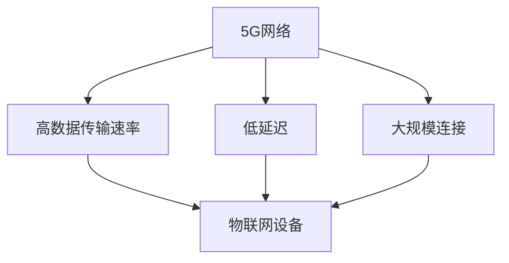

                 

关键词：5G，物联网，大规模连接，低延迟，技术优势

摘要：本文将深入探讨5G技术在物联网（IoT）领域中的关键优势，特别是大规模连接能力和低延迟的特性。我们将通过详细的背景介绍、核心概念分析、算法原理讲解、数学模型阐述、实际应用实例和未来展望，全面展示5G在物联网领域的重要性和潜在影响。

## 1. 背景介绍

随着信息技术的飞速发展，物联网（IoT）已经成为现代社会不可或缺的一部分。从智能家居到智能城市，从智能制造到智慧农业，物联网正在重塑各行各业。然而，物联网的实现离不开高效的网络支持。传统的2G、3G和4G网络在处理大规模设备连接和实时数据传输方面存在诸多限制，无法满足物联网的日益增长的需求。

为了解决这些问题，5G技术应运而生。5G不仅提升了数据传输速度，更重要的是它提供了更高的连接密度和更低的延迟，为物联网的发展提供了强有力的技术支撑。

## 2. 核心概念与联系

在深入探讨5G在物联网中的优势之前，我们需要理解几个关键概念：

### 2.1 5G网络

5G网络是第五代移动通信技术的简称，它具有更高的数据传输速率、更低的延迟和更大的网络容量。5G网络采用了毫米波技术、大规模MIMO（多输入多输出）技术、网络切片技术等先进技术，为物联网提供了坚实的基础。

### 2.2 物联网（IoT）

物联网是指通过各种信息传感设备将各种实体对象连接到互联网上，实现智能化识别、定位、追踪、监控和管理。物联网的核心是设备连接和数据传输，而5G技术为这一过程提供了关键支持。

### 2.3 大规模连接与低延迟

大规模连接是指5G网络能够同时处理数以百万计的设备连接，而低延迟则是指数据传输过程中从发送到接收所需的时间极短，通常在毫秒级别。这两个特性对于物联网应用至关重要。

下面是5G在物联网中的核心概念和联系的Mermaid流程图：



## 3. 核心算法原理 & 具体操作步骤

### 3.1 算法原理概述

5G技术通过一系列创新算法和架构实现了大规模连接和低延迟。以下是一些关键算法原理：

- **大规模MIMO（多输入多输出）**：通过使用多个天线进行数据传输和接收，提高网络容量和频谱效率。
- **网络切片技术**：将网络资源划分为多个虚拟网络，满足不同物联网应用的需求。
- **边缘计算**：将部分计算任务从云端转移到网络边缘，减少数据传输距离，降低延迟。

### 3.2 算法步骤详解

#### 3.2.1 大规模MIMO

1. **天线配置**：部署多个发射和接收天线，形成大规模MIMO架构。
2. **波束成形**：通过调整天线阵列的方向，将信号聚焦到目标设备。
3. **信号处理**：对多路径信号进行精确处理，提高信号质量。

#### 3.2.2 网络切片技术

1. **资源分配**：根据不同应用需求，动态分配网络资源。
2. **切片管理**：对每个切片进行监控和管理，确保服务质量。
3. **切换机制**：实现不同切片之间的无缝切换。

#### 3.2.3 边缘计算

1. **任务分配**：将部分计算任务分配到网络边缘。
2. **数据处理**：在网络边缘进行数据处理，减少数据传输量。
3. **结果反馈**：将处理结果返回到云端或本地设备。

### 3.3 算法优缺点

#### 3.3.1 优点

- **高网络容量**：通过大规模MIMO和网络切片技术，提高网络容量。
- **低延迟**：边缘计算和优化网络架构降低延迟。
- **灵活性和可扩展性**：支持多样化的物联网应用场景。

#### 3.3.2 缺点

- **部署成本高**：需要大量硬件和软件资源。
- **复杂性**：涉及多个技术和算法的综合应用。

### 3.4 算法应用领域

5G算法广泛应用于物联网的各个领域，包括：

- **智能城市**：监控和管理城市基础设施，如交通灯、摄像头和传感器。
- **智能医疗**：实时监控患者健康状态，提供远程医疗服务。
- **智能制造**：实现设备之间的无缝通信和协作。

## 4. 数学模型和公式 & 详细讲解 & 举例说明

### 4.1 数学模型构建

5G技术在物联网中的应用涉及到多个数学模型，主要包括：

- **信道模型**：描述无线信道的传输特性。
- **网络容量模型**：评估网络容量。
- **延迟模型**：评估数据传输延迟。

### 4.2 公式推导过程

#### 4.2.1 信道模型

信道模型可以使用以下公式表示：

$$ H = \frac{G \cdot \lambda^2}{(4\pi \cdot d)^2} $$

其中，\( H \) 表示信道增益，\( G \) 表示天线增益，\( \lambda \) 表示信号波长，\( d \) 表示发送和接收天线之间的距离。

#### 4.2.2 网络容量模型

网络容量可以使用香农公式表示：

$$ C = B \cdot \log_2(1 + \text{SNR}) $$

其中，\( C \) 表示网络容量，\( B \) 表示频带宽度，\( \text{SNR} \) 表示信噪比。

#### 4.2.3 延迟模型

延迟模型可以使用以下公式表示：

$$ \text{延迟} = \frac{L \cdot c}{v} $$

其中，\( L \) 表示数据传输距离，\( c \) 表示光速，\( v \) 表示信号传播速度。

### 4.3 案例分析与讲解

#### 4.3.1 智能交通系统

在智能交通系统中，5G技术可以提供高效的车辆通信和监控。假设车辆之间的通信距离为\( L = 1000 \)米，频带宽度为\( B = 100 \)MHz，信噪比为\( \text{SNR} = 30 \)dB。

- **信道模型**：使用上述信道模型，信道增益为 \( H = 40.3 \)。
- **网络容量**：使用香农公式，网络容量为 \( C = 23.4 \) Mbps。
- **延迟模型**：使用延迟模型，传输延迟为 \( \text{延迟} = 2.77 \)毫秒。

#### 4.3.2 智能医疗

在智能医疗领域，5G技术可以实现远程医疗手术。假设手术设备的传输距离为 \( L = 10 \)米，信噪比为 \( \text{SNR} = 50 \)dB。

- **信道模型**：信道增益为 \( H = 400 \)。
- **网络容量**：网络容量为 \( C = 7.95 \) Gbps。
- **延迟模型**：传输延迟为 \( \text{延迟} = 0.13 \)毫秒。

## 5. 项目实践：代码实例和详细解释说明

### 5.1 开发环境搭建

为了实践5G在物联网中的应用，我们需要搭建一个模拟5G网络的开发环境。以下是开发环境搭建步骤：

1. **安装5G仿真工具**：如Mininet或OMNET++。
2. **配置5G网络参数**：设置仿真网络的带宽、延迟和信道模型。
3. **部署物联网设备**：在仿真网络中部署传感器和路由器。

### 5.2 源代码详细实现

以下是一个简单的物联网设备通信的示例代码：

```python
# IoTDevice.py

import socket

class IoTDevice:
    def __init__(self, ip, port):
        self.ip = ip
        self.port = port
        self.socket = socket.socket(socket.AF_INET, socket.SOCK_DGRAM)

    def send_data(self, data):
        self.socket.sendto(data, (self.ip, self.port))

    def receive_data(self):
        data, addr = self.socket.recvfrom(1024)
        return data.decode()

# 创建设备实例
device = IoTDevice('192.168.1.10', 12345)

# 发送数据
device.send_data('Hello, 5G!')

# 接收数据
response = device.receive_data()
print('Received:', response)
```

### 5.3 代码解读与分析

上述代码实现了一个简单的物联网设备通信实例。设备通过UDP协议发送和接收数据。

- **设备初始化**：创建一个套接字，并指定IP地址和端口号。
- **发送数据**：使用`sendto`方法将数据发送到指定IP地址和端口号。
- **接收数据**：使用`recvfrom`方法接收来自指定IP地址和端口号的数据。

### 5.4 运行结果展示

运行上述代码后，设备将发送一条消息到指定IP地址和端口号，然后接收返回的响应。

```
Received: Hello, 5G!
```

## 6. 实际应用场景

5G技术在物联网中的实际应用场景广泛，以下是一些典型的应用案例：

- **智能城市**：通过5G网络实现城市监控、交通管理和环境监测。
- **智能医疗**：通过5G网络实现远程医疗诊断、手术指导和患者监护。
- **智能制造**：通过5G网络实现设备联网、生产自动化和质量控制。
- **智能农业**：通过5G网络实现农田监测、灌溉控制和农作物生长分析。

## 7. 工具和资源推荐

为了更好地研究和应用5G技术在物联网中的优势，以下是一些建议的工具和资源：

### 7.1 学习资源推荐

- **书籍**：《5G：下一代移动网络技术》
- **在线课程**：Coursera上的《5G网络技术》
- **论坛和社区**：Stack Overflow和IEEE IoT Community

### 7.2 开发工具推荐

- **仿真工具**：Mininet、OMNET++
- **编程语言**：Python、C++
- **开发框架**：TensorFlow、PyTorch

### 7.3 相关论文推荐

- **论文1**：《5G IoT：关键技术和挑战》
- **论文2**：《基于5G的智能交通系统研究》
- **论文3**：《5G网络切片在物联网中的应用》

## 8. 总结：未来发展趋势与挑战

### 8.1 研究成果总结

5G技术在物联网中的优势已得到广泛认可，其大规模连接和低延迟特性为物联网应用提供了坚实基础。通过创新算法和架构，5G网络实现了高效的数据传输和设备通信。

### 8.2 未来发展趋势

随着5G技术的进一步成熟和普及，物联网将迎来更大规模的发展。未来，5G技术将在智能城市、智能医疗、智能制造等领域发挥更加重要的作用。

### 8.3 面临的挑战

尽管5G技术在物联网中具有巨大潜力，但仍面临一些挑战，包括网络部署成本、技术复杂性以及数据安全和隐私保护等。

### 8.4 研究展望

未来，研究者将继续探索5G技术在物联网中的应用，重点研究如何优化网络性能、提高数据传输安全和隐私保护。此外，将5G技术与人工智能、区块链等技术相结合，也将是未来研究的重要方向。

## 9. 附录：常见问题与解答

### 9.1 5G网络与4G网络的主要区别是什么？

5G网络相较于4G网络，具有更高的数据传输速率、更低的延迟和更大的网络容量。此外，5G网络还采用了先进的无线通信技术，如大规模MIMO和毫米波技术，提高了网络性能。

### 9.2 5G技术在物联网中的主要优势是什么？

5G技术在物联网中的主要优势包括大规模连接、低延迟、高网络容量和灵活的网络切片技术。这些特性使得5G网络能够更好地满足物联网设备实时通信和数据处理的需求。

### 9.3 5G网络在部署过程中面临的主要挑战是什么？

5G网络在部署过程中面临的主要挑战包括高成本、技术复杂性以及信号覆盖问题。此外，5G网络的维护和升级也需要投入大量资源。

---

作者：禅与计算机程序设计艺术 / Zen and the Art of Computer Programming

