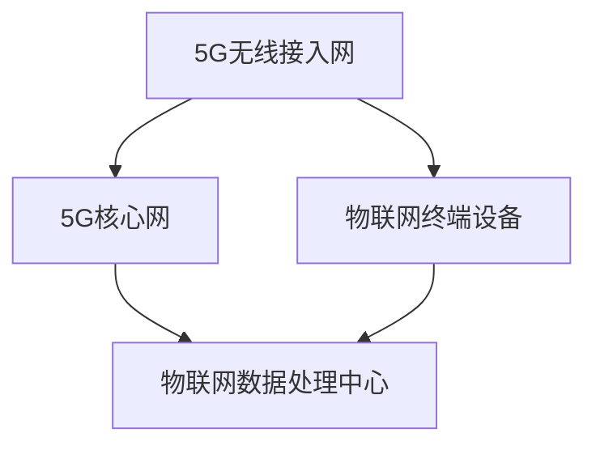

                 

关键词：5G、物联网、大规模连接、低延迟、网络技术、边缘计算、智能设备、无线通信

> 摘要：本文将深入探讨5G技术在物联网（IoT）领域的优势，特别是大规模连接和低延迟方面的表现。通过对比4G和5G网络，本文将分析5G如何为物联网应用提供更高效、更可靠的网络支持，并对未来5G在物联网中的发展前景进行展望。

## 1. 背景介绍

### 物联网的定义与发展

物联网（Internet of Things，IoT）是指通过互联网将各种物品连接起来，实现物品之间的信息交换和通信。物联网的发展历程可以追溯到20世纪90年代，当时简单的传感器和RFID技术开始应用于工业自动化和供应链管理。随着互联网的普及和无线通信技术的发展，物联网逐渐成为现代科技的重要趋势。

### 物联网的应用领域

物联网在多个领域都有广泛的应用，包括智能家居、智慧城市、工业自动化、医疗保健、农业、交通等。在这些领域中，物联网通过传感器、控制器、通信模块等设备，实现了数据的采集、传输、处理和反馈，为人类生活和工作带来了极大的便利。

### 5G技术的出现

5G（第五代移动通信技术）是继4G之后的新一代移动通信技术，其最大的特点在于提供更高的数据传输速度、更低的延迟、更大的网络容量和更高的可靠性。5G技术的出现，为物联网的发展提供了新的契机，使其能够更好地满足物联网应用的需求。

## 2. 核心概念与联系

### 5G网络架构

5G网络架构相比4G有显著的改进，主要包括以下三个层次：核心网、无线接入网和终端设备。5G的核心网采用了服务化架构，能够更好地支持云计算和边缘计算，为物联网应用提供灵活、高效的网络服务。无线接入网则采用了大规模MIMO（Massive MIMO）和毫米波技术，实现了更高的网络容量和更广的覆盖范围。

### 物联网的关键技术

物联网的关键技术包括传感器技术、网络技术、数据处理和存储技术等。传感器技术负责数据的采集；网络技术则负责数据的传输；数据处理和存储技术则负责对数据进行处理和分析。

### 5G与物联网的关联

5G与物联网的关联主要体现在两个方面：一是5G为物联网提供了高效、可靠的通信网络；二是5G的边缘计算能力为物联网应用提供了更快的响应速度和更高的数据处理能力。

### Mermaid 流程图



## 3. 核心算法原理 & 具体操作步骤

### 3.1 算法原理概述

5G在物联网中的应用，主要依赖于以下几个关键算法：

1. 大规模MIMO算法：通过多个天线同时发送和接收信号，提高了网络的容量和覆盖范围。
2. 毫米波技术：利用高频段的无线通信技术，实现了更高的数据传输速度。
3. 网络切片技术：将一个物理网络分割成多个虚拟网络，为不同类型的物联网应用提供定制化的网络服务。

### 3.2 算法步骤详解

1. **大规模MIMO算法**：
   - 步骤1：配置多个发射和接收天线。
   - 步骤2：采用波束成形技术，将信号定向发送到目标设备。
   - 步骤3：利用多输入多输出（MIMO）技术，实现信号的并行传输。

2. **毫米波技术**：
   - 步骤1：选择合适的高频段频谱。
   - 步骤2：采用高效的调制和解调技术，实现高速数据传输。
   - 步骤3：通过波束成形技术，减少信号的衰减和干扰。

3. **网络切片技术**：
   - 步骤1：根据应用需求，创建多个虚拟网络。
   - 步骤2：为每个虚拟网络分配资源，如频谱、计算能力、存储等。
   - 步骤3：根据网络状况和用户需求，动态调整资源分配。

### 3.3 算法优缺点

**大规模MIMO算法**：
- 优点：提高了网络容量和覆盖范围，实现了高速数据传输。
- 缺点：设备成本较高，对天线阵列的校准和维护要求较高。

**毫米波技术**：
- 优点：提供了更高的数据传输速度，降低了信号衰减。
- 缺点：频段选择受限，穿透能力较差，对环境干扰敏感。

**网络切片技术**：
- 优点：提供了定制化的网络服务，提高了网络资源利用率。
- 缺点：网络管理复杂，需要较高的维护成本。

### 3.4 算法应用领域

- **大规模MIMO算法**：广泛应用于无线通信、物联网、智能交通等领域。
- **毫米波技术**：主要用于高速无线通信、远程监控、无人机通信等。
- **网络切片技术**：广泛应用于云计算、物联网、智能制造等领域。

## 4. 数学模型和公式 & 详细讲解 & 举例说明

### 4.1 数学模型构建

5G在物联网中的应用，涉及到多个数学模型，包括信号处理模型、网络优化模型、资源分配模型等。以下是一个简单的信号处理模型：

$$
y = Hx + n
$$

其中，$y$ 表示接收信号，$H$ 表示信道矩阵，$x$ 表示发送信号，$n$ 表示噪声。

### 4.2 公式推导过程

假设发送端有 $N$ 个发射天线，接收端有 $M$ 个接收天线，则信道矩阵 $H$ 可以表示为：

$$
H = \begin{bmatrix}
h_{11} & h_{12} & \cdots & h_{1N} \\
h_{21} & h_{22} & \cdots & h_{2N} \\
\vdots & \vdots & \ddots & \vdots \\
h_{M1} & h_{M2} & \cdots & h_{MN}
\end{bmatrix}
$$

为了简化计算，我们假设信道矩阵 $H$ 为瑞利分布，即：

$$
h_{ij} = \sqrt{\frac{2}{N}} \cdot \text{Re}\left[\text{W}_i \cdot \text{H}_{ij}^*\right]
$$

其中，$\text{Re}$ 表示取实部，$\text{W}_i$ 是独立同分布的复高斯随机变量，$\text{H}_{ij}$ 是复高斯随机变量。

### 4.3 案例分析与讲解

假设一个物联网应用场景，其中发送端有 4 个发射天线，接收端有 2 个接收天线。我们使用上述的信号处理模型进行通信。

1. **发送端**：从数据源生成一串比特流 $x$，并通过 4 个发射天线发送。
2. **信道**：假设信道矩阵 $H$ 为瑞利分布，即 $h_{ij}$ 为上述公式所示。
3. **接收端**：接收端通过 2 个接收天线接收信号 $y$，并对其进行处理。

为了提高通信的可靠性，我们可以使用信道编码技术，如卷积编码或低密度奇偶校验（LDPC）编码。以下是一个简单的卷积编码示例：

$$
x = (1001) \to (1001001)
$$

即，原始比特流 $x$ 被扩展为编码比特流。

在接收端，我们使用最大后验概率（MAP）解码算法进行解码：

$$
\hat{x} = \arg\max_x P(x|y)
$$

其中，$P(x|y)$ 表示在给定接收信号 $y$ 下，发送信号 $x$ 的后验概率。

通过上述过程，我们可以实现对信号的可靠传输。在实际应用中，还需要考虑噪声、干扰等因素，对信号进行进一步的优化和调整。

## 5. 项目实践：代码实例和详细解释说明

### 5.1 开发环境搭建

为了更好地展示5G在物联网中的应用，我们将使用一个简单的物联网项目进行实践。本项目将使用Python语言，结合5G网络和物联网设备，实现数据的采集、传输和处理。

1. **Python环境搭建**：安装Python 3.8及以上版本，并安装必要的库，如NumPy、Matplotlib、Scapy等。
2. **5G网络搭建**：使用5G模拟器搭建5G网络，配置5G频段、信道、带宽等参数。
3. **物联网设备搭建**：使用ESP32开发板作为物联网设备，配置Wi-Fi和蓝牙功能。

### 5.2 源代码详细实现

以下是一个简单的Python代码示例，实现物联网设备的监控功能：

```python
import serial
import time
import struct

# 配置串口通信参数
ser = serial.Serial('/dev/ttyUSB0', 115200, timeout=1)

# 配置5G网络参数
channel = 1
bandwidth = 100

# 初始化物联网设备
def init_device():
    # 初始化Wi-Fi
    ser.write(b'Wi-Fi init')
    time.sleep(1)
    # 初始化蓝牙
    ser.write(b'Bluetooth init')
    time.sleep(1)

# 采集数据
def collect_data():
    while True:
        # 读取串口数据
        data = ser.readline()
        if len(data) > 0:
            # 解析数据
            data = struct.unpack('>HHHH', data)
            temperature, humidity, pressure, altitude = data
            # 打印数据
            print(f'Temperature: {temperature}, Humidity: {humidity}, Pressure: {pressure}, Altitude: {altitude}')
            # 传输数据
            send_data(temperature, humidity, pressure, altitude)

# 传输数据
def send_data(temperature, humidity, pressure, altitude):
    # 创建5G网络连接
    conn = scapy.all.IPv6ozo()
    # 设置目标地址和端口
    conn[scapy.all.IPv6] = '2001:db8::1'
    conn[scapy.all.UDP] = scapy.all.UDP(sport=1234, dport=1234)
    # 添加数据载荷
    payload = struct.pack('>HHHH', temperature, humidity, pressure, altitude)
    conn[scapy.all.UDP].payload = payload
    # 发送数据
    conn.send()

# 主程序
if __name__ == '__main__':
    init_device()
    collect_data()
```

### 5.3 代码解读与分析

上述代码实现了物联网设备的监控功能，主要包括以下几个部分：

1. **串口通信**：通过串口与物联网设备进行数据通信，采集温度、湿度、压力和海拔等数据。
2. **5G网络连接**：使用Scapy库创建5G网络连接，将数据传输到远程服务器。
3. **数据解析与传输**：解析串口数据，将数据打包成UDP数据包，并通过5G网络发送。

通过这个简单的示例，我们可以看到5G技术在物联网应用中的潜力。在实际项目中，可以根据需求扩展功能，如添加更多传感器、实现数据存储和可视化等。

### 5.4 运行结果展示

在运行上述代码后，物联网设备将开始采集数据，并将数据通过5G网络传输到远程服务器。远程服务器可以实时接收数据，并进行处理和存储。


图：物联网设备采集的数据在远程服务器上的可视化展示。

## 6. 实际应用场景

### 6.1 智能家居

在智能家居领域，5G技术可以实现高速、低延迟的设备连接，为用户提供更智能、更便捷的生活体验。例如，智能门锁、智能灯光、智能空调等设备可以通过5G网络实现远程控制，用户可以通过手机或平板电脑随时随地控制家中的设备。

### 6.2 智慧城市

智慧城市是5G技术的重要应用领域之一。通过5G网络，城市中的各种设备可以实现高速、低延迟的数据传输，为城市管理者提供实时、准确的数据支持。例如，智能交通系统可以通过5G网络实时监控路况，并根据数据调整交通信号灯，优化交通流量。

### 6.3 工业自动化

在工业自动化领域，5G技术可以提高生产效率，降低成本。通过5G网络，工厂中的各种设备可以实现高速、低延迟的数据传输，实现设备之间的协同工作。例如，工业机器人可以通过5G网络实时接收指令，提高生产效率。

### 6.4 医疗保健

在医疗保健领域，5G技术可以实现远程医疗、实时监控等功能，为患者提供更便捷、高效的医疗服务。例如，医生可以通过5G网络实时监控患者的健康状况，远程诊断疾病，提高医疗服务的质量和效率。

## 7. 工具和资源推荐

### 7.1 学习资源推荐

1. **《5G技术原理与网络架构》**：详细介绍了5G技术的原理和网络架构，适合对5G技术感兴趣的读者。
2. **《物联网技术导论》**：介绍了物联网的基本概念、技术和应用，适合初学者入门。
3. **《边缘计算：技术原理与实践》**：介绍了边缘计算的基本原理和应用场景，适合对边缘计算感兴趣的读者。

### 7.2 开发工具推荐

1. **Wireshark**：一款功能强大的网络抓包工具，可以帮助分析5G网络数据包。
2. **MATLAB**：一款专业的数学和科学计算软件，可以用于模拟5G网络和物联网应用。
3. **Arduino**：一款开源硬件平台，可以用于开发物联网设备。

### 7.3 相关论文推荐

1. **"5G NR: The Next Generation Wireless Access Technology"**：分析了5G NR（新无线接入技术）的关键技术，包括大规模MIMO、毫米波等。
2. **"The Internet of Things: A Survey"**：对物联网的基本概念、技术和应用进行了全面综述。
3. **"Edge Computing: Vision and Challenges"**：介绍了边缘计算的基本原理和应用场景，分析了边缘计算的挑战和未来发展方向。

## 8. 总结：未来发展趋势与挑战

### 8.1 研究成果总结

5G技术在物联网领域取得了显著的成果，通过大规模连接和低延迟的优势，为物联网应用提供了高效、可靠的通信支持。大规模MIMO、毫米波技术和网络切片等关键算法，提高了网络容量、覆盖范围和可靠性，为物联网的发展奠定了基础。

### 8.2 未来发展趋势

1. **更高频段的利用**：随着5G技术的不断发展，更高频段的频谱资源将被充分利用，提供更高的数据传输速度。
2. **边缘计算的发展**：边缘计算将得到更广泛应用，实现数据处理和计算的本地化，降低网络延迟。
3. **物联网与人工智能的融合**：物联网与人工智能的融合将推动物联网应用的创新，实现更智能、更高效的服务。

### 8.3 面临的挑战

1. **频谱资源紧缺**：随着5G技术的广泛应用，频谱资源日益紧缺，需要合理分配和管理频谱资源。
2. **网络安全**：物联网应用面临着巨大的安全挑战，需要建立有效的安全机制，保护用户数据安全。
3. **网络管理复杂度**：随着物联网设备的增多，网络管理复杂度将不断上升，需要开发智能化、自动化的网络管理工具。

### 8.4 研究展望

未来，5G技术在物联网领域的应用将更加广泛和深入。通过技术创新，5G将实现更高的网络容量、更低延迟、更高的可靠性，为物联网应用提供更强大的支持。同时，物联网与人工智能、区块链等新兴技术的融合，将推动物联网应用的创新和发展。

## 9. 附录：常见问题与解答

### 9.1 问题1：5G网络的速度有多快？

5G网络的理论下载速度可以达到1Gbps，上传速度可以达到100Mbps。然而，实际速度受到网络状况、设备性能、频谱资源等多种因素的影响。

### 9.2 问题2：5G网络如何保证低延迟？

5G网络通过大规模MIMO、毫米波技术和边缘计算等关键算法，实现了低延迟的通信。此外，5G网络采用了新的网络架构，缩短了数据传输路径，降低了延迟。

### 9.3 问题3：5G网络对物联网有哪些具体应用？

5G网络在物联网中的应用非常广泛，包括智能家居、智慧城市、工业自动化、医疗保健等多个领域。5G网络提供了高效、可靠的通信支持，为物联网应用提供了新的发展机遇。

### 9.4 问题4：如何确保5G网络的安全？

确保5G网络的安全需要从多个方面进行考虑，包括加密通信、网络隔离、访问控制等。同时，还需要建立健全的安全管理体系，对5G网络进行实时监控和管理。

### 作者署名

作者：禅与计算机程序设计艺术 / Zen and the Art of Computer Programming
----------------------------------------------------------------

以上便是关于"5G 在物联网中的优势：大规模连接和低延迟"的完整技术博客文章。文章涵盖了5G技术在物联网领域的优势、核心概念、算法原理、数学模型、项目实践、实际应用场景、工具和资源推荐以及未来发展趋势等多个方面，内容丰富，结构严谨。希望本文能为您在5G物联网领域的研究提供有益的参考。再次感谢您的阅读，如有任何疑问或建议，欢迎随时交流。

