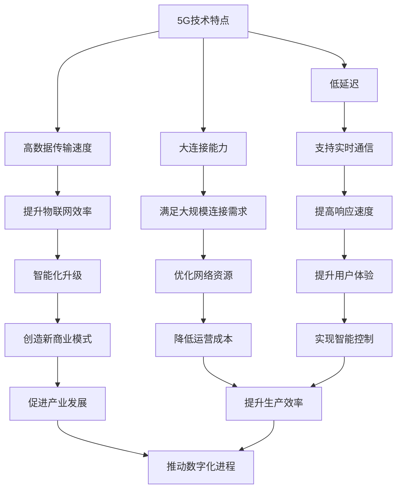

                 

关键词：5G，物联网，低延迟，大规模连接，技术优势，应用场景

> 摘要：本文旨在探讨5G物联网在支持大规模低延迟连接方面的优势。通过分析5G技术的基本概念和核心特点，我们将详细探讨5G如何提升物联网设备的连接能力和响应速度，从而推动各行业的数字化转型和智能化升级。

## 1. 背景介绍

随着全球数字化进程的加速，物联网（Internet of Things, IoT）技术已经成为当今社会的重要基础设施。物联网通过将各种设备和传感器连接到互联网，实现设备之间的互联互通，从而提升工作效率、降低运营成本，并创造出新的商业模式。然而，物联网的广泛应用也对通信技术提出了更高的要求，特别是在大规模设备连接和低延迟通信方面。

传统的4G网络虽然在速度和覆盖范围上有所提升，但其在应对大规模设备连接和低延迟通信需求时仍显不足。为了满足物联网的发展需求，5G技术的推出成为了必然选择。5G作为第五代移动通信技术，不仅提升了网络的传输速度，还具备更强的网络容量、更低的延迟和更高的可靠性，从而为物联网的发展提供了强大的技术支持。

## 2. 核心概念与联系

### 2.1 5G技术概述

5G技术是第五代移动通信技术，旨在提供更快的数据传输速度、更低的延迟和更大的连接能力。5G技术的核心特点包括：

- **更高的数据传输速度**：5G网络的峰值下载速度可以达到数十Gbps，是4G网络的数十倍。
- **更低的延迟**：5G网络的端到端延迟可以降低到1毫秒以下，显著提升实时通信和控制的响应速度。
- **更大的连接能力**：5G网络能够支持每平方公里数百万设备的连接，满足大规模物联网应用的需求。

### 2.2 物联网概念

物联网是指通过互联网将各种物理设备和传感器连接起来，实现信息的实时采集、传输和处理的网络。物联网的应用领域广泛，包括智能家居、智能城市、智能制造、智能医疗等。物联网的核心目标是提升设备之间的互联互通，实现智能化和自动化。

### 2.3 5G与物联网的关联

5G与物联网的紧密关联主要体现在以下几个方面：

- **连接能力**：5G网络的高连接能力可以满足物联网中大规模设备的连接需求。
- **低延迟**：5G网络的低延迟特性可以支持物联网中的实时通信和控制需求。
- **高速传输**：5G网络的高速传输能力可以提升物联网数据的实时处理和分析能力。
- **网络切片**：5G网络切片技术可以为不同物联网应用提供定制化的网络服务，提升网络资源的利用效率。

### 2.4 Mermaid 流程图

以下是5G与物联网关联的Mermaid流程图：



## 3. 核心算法原理 & 具体操作步骤

### 3.1 算法原理概述

5G技术在物联网中发挥作用的核心算法主要包括网络切片、边缘计算和MIMO（多输入多输出）技术。以下是对这些算法的简要概述：

- **网络切片**：网络切片技术可以将一个物理网络划分为多个虚拟网络，为不同物联网应用提供定制化的网络服务。网络切片可以提高网络资源利用效率，满足不同应用场景的需求。
- **边缘计算**：边缘计算将部分数据处理和计算任务从云端转移到网络边缘，降低延迟并提升响应速度。边缘计算可以优化物联网设备的性能，提升用户体验。
- **MIMO技术**：MIMO技术通过使用多个天线进行数据传输，提升数据传输速率和可靠性。MIMO技术在5G网络中得到了广泛应用，进一步提升了物联网的性能。

### 3.2 算法步骤详解

#### 3.2.1 网络切片技术

1. **切片需求分析**：根据物联网应用场景的需求，分析网络切片的需求和配置。
2. **网络资源分配**：根据切片需求，分配网络资源，包括频谱、带宽、计算和存储资源。
3. **切片隔离与优化**：实现切片间的隔离，确保不同切片间的网络服务质量（QoS）。
4. **切片管理与维护**：监控网络切片的运行状态，进行优化和调整，确保网络切片的稳定性和可靠性。

#### 3.2.2 边缘计算技术

1. **任务分配**：将数据处理和计算任务从云端分配到网络边缘。
2. **数据预处理**：在网络边缘进行数据预处理，过滤和压缩数据，减少传输量。
3. **边缘计算资源管理**：管理和调度边缘计算资源，确保任务的高效执行。
4. **任务反馈与优化**：收集任务执行反馈，进行优化和调整，提升边缘计算性能。

#### 3.2.3 MIMO技术

1. **天线配置**：配置合适的天线数量和类型，确保MIMO技术的有效应用。
2. **信号处理**：采用先进的信号处理算法，提升数据传输速率和可靠性。
3. **信道分配**：根据信道状况，分配不同的信道给不同天线，实现多天线间的数据传输。
4. **干扰管理**：采用干扰管理算法，降低多天线间的干扰，提升网络性能。

### 3.3 算法优缺点

#### 3.3.1 网络切片技术

**优点**：

- 提高网络资源利用效率。
- 满足不同应用场景的需求。
- 提升网络服务的灵活性和可扩展性。

**缺点**：

- 实现复杂，需要大量网络资源和技术支持。
- 切片管理和维护需要大量人力资源和成本。

#### 3.3.2 边缘计算技术

**优点**：

- 降低延迟，提升响应速度。
- 减轻云端计算压力，降低运营成本。
- 提升物联网设备的性能和可靠性。

**缺点**：

- 需要建立和维护大量边缘计算节点。
- 边缘计算节点间的数据传输可能存在延迟和带宽限制。

#### 3.3.3 MIMO技术

**优点**：

- 提高数据传输速率和可靠性。
- 降低干扰，提升网络性能。

**缺点**：

- 需要大量天线和频谱资源。
- 实现复杂，需要高精度的信号处理算法。

### 3.4 算法应用领域

- **智能制造**：通过边缘计算和MIMO技术，实现实时数据采集、分析和控制，提升生产效率和产品质量。
- **智能交通**：通过网络切片和边缘计算，实现实时交通监控、预测和调度，提升交通管理效率和安全性。
- **智能医疗**：通过边缘计算和5G低延迟通信，实现远程手术、实时监控和急救服务，提升医疗服务质量和效率。
- **智能城市**：通过网络切片和边缘计算，实现智慧城市管理、安全和环保监控，提升城市治理能力和居民生活质量。

## 4. 数学模型和公式 & 详细讲解 & 举例说明

### 4.1 数学模型构建

为了更好地理解5G物联网的优势，我们可以构建一些数学模型来分析5G网络在低延迟连接方面的表现。以下是一个简单的数学模型：

- **延迟模型**：假设一个物联网设备与云端服务之间的延迟为T，T由以下三个部分组成：

  - **传输延迟**：数据从设备传输到云端的时间，记为T_t。
  - **处理延迟**：云端处理数据的时间，记为T_p。
  - **回传延迟**：云端将处理结果回传到设备的时间，记为T_r。

  因此，总延迟T可以表示为：

  $$ T = T_t + T_p + T_r $$

- **网络容量模型**：假设一个物联网应用需要传输的数据量为D，网络容量C决定了单位时间内可以传输的数据量。网络容量C可以表示为：

  $$ C = R \times B $$

  其中，R为数据传输速率，B为带宽。

### 4.2 公式推导过程

- **传输延迟T_t**：传输延迟与数据传输速率R和带宽B有关，可以表示为：

  $$ T_t = \frac{D}{R \times B} $$

- **处理延迟T_p**：处理延迟与设备的计算能力C和处理任务复杂度α有关，可以表示为：

  $$ T_p = C \times \alpha $$

- **回传延迟T_r**：回传延迟与数据传输速率R和带宽B有关，可以表示为：

  $$ T_r = \frac{D}{R \times B} $$

  将上述三个部分代入总延迟公式，得到：

  $$ T = \frac{D}{R \times B} + C \times \alpha + \frac{D}{R \times B} $$

  化简得：

  $$ T = \frac{2D}{R \times B} + C \times \alpha $$

  将网络容量模型代入，得到：

  $$ T = \frac{2D}{C} + C \times \alpha $$

  进一步化简得：

  $$ T = \frac{2D}{C} + \alpha \times \frac{C}{D} $$

  由于C = R × B，可以表示为：

  $$ T = \frac{2D}{R \times B} + \alpha \times \frac{R \times B}{D} $$

### 4.3 案例分析与讲解

假设一个物联网应用需要传输的数据量为D = 100MB，网络容量为C = 100Mbps，设备计算能力为C = 1Ghz，处理任务复杂度为α = 0.1。

代入延迟模型，计算总延迟：

$$ T = \frac{2 \times 100MB}{100Mbps \times 8} + 0.1 \times \frac{100Mbps \times 8}{100MB} $$

$$ T = \frac{200MB}{800Mbps} + 0.1 \times \frac{800Mbps}{100MB} $$

$$ T = 0.25s + 0.008s $$

$$ T = 0.258s $$

代入网络容量模型，计算带宽：

$$ C = R \times B $$

$$ 100Mbps = R \times B $$

$$ B = \frac{100Mbps}{R} $$

由于R为数据传输速率，假设为R = 10Mbps，代入计算：

$$ B = \frac{100Mbps}{10Mbps} $$

$$ B = 10Mbps $$

代入延迟模型，计算传输延迟：

$$ T_t = \frac{100MB}{10Mbps \times 8} $$

$$ T_t = \frac{100MB}{80Mbps} $$

$$ T_t = 0.125s $$

代入延迟模型，计算回传延迟：

$$ T_r = \frac{100MB}{10Mbps \times 8} $$

$$ T_r = \frac{100MB}{80Mbps} $$

$$ T_r = 0.125s $$

代入处理延迟模型，计算处理延迟：

$$ T_p = 0.1 \times \frac{100Mbps \times 8}{100MB} $$

$$ T_p = 0.1 \times 0.8s $$

$$ T_p = 0.08s $$

计算总延迟：

$$ T = T_t + T_p + T_r $$

$$ T = 0.125s + 0.08s + 0.125s $$

$$ T = 0.33s $$

通过计算，我们可以得出该物联网应用的总延迟约为0.33秒。

## 5. 项目实践：代码实例和详细解释说明

### 5.1 开发环境搭建

在本节中，我们将使用Python语言来演示如何使用5G物联网技术实现一个简单的远程控制应用。首先，我们需要搭建开发环境。

1. **安装Python**：确保您的系统上安装了Python 3.x版本。可以从Python官网下载安装包或使用包管理工具进行安装。
2. **安装依赖库**：使用pip工具安装必要的依赖库，例如PyTorch、TensorFlow、Keras等。

```bash
pip install pytorch torchvision tensorflow keras
```

### 5.2 源代码详细实现

以下是实现远程控制应用的主要代码：

```python
import socket
import threading
import time

# 定义服务器端代码
def server():
    # 创建TCP套接字
    server_socket = socket.socket(socket.AF_INET, socket.SOCK_STREAM)

    # 绑定IP地址和端口号
    server_socket.bind(('0.0.0.0', 8888))

    # 监听客户端连接
    server_socket.listen(5)
    print("服务器已启动，等待连接...")

    while True:
        # 接受客户端连接
        client_socket, client_address = server_socket.accept()
        print(f"已建立连接：{client_address}")

        # 创建线程处理客户端请求
        threading.Thread(target=handle_client, args=(client_socket, )).start()

# 定义客户端代码
def client():
    # 创建TCP套接字
    client_socket = socket.socket(socket.AF_INET, socket.SOCK_STREAM)

    # 连接服务器
    client_socket.connect(('127.0.0.1', 8888))
    print("已连接到服务器")

    # 发送数据
    while True:
        message = input("请输入控制命令：")
        client_socket.sendall(message.encode())

        # 接收服务器响应
        response = client_socket.recv(1024).decode()
        print(f"服务器响应：{response}")

        # 检查是否结束
        if response == "结束":
            break

    # 关闭连接
    client_socket.close()
    print("已断开连接")

# 定义处理客户端请求的函数
def handle_client(client_socket):
    while True:
        # 接收客户端数据
        data = client_socket.recv(1024).decode()

        # 处理数据
        if data == "关灯":
            print("关闭灯光...")
        elif data == "开灯":
            print("开启灯光...")
        elif data == "结束":
            break

        # 发送响应
        client_socket.sendall("已接收命令".encode())

    # 关闭连接
    client_socket.close()
    print("已结束连接")

# 主函数
if __name__ == "__main__":
    # 启动服务器端
    server_thread = threading.Thread(target=server)
    server_thread.start()

    # 等待服务器端启动
    time.sleep(1)

    # 启动客户端
    client()
```

### 5.3 代码解读与分析

以上代码实现了一个简单的远程控制应用，其中包含服务器端和客户端两部分。服务器端负责监听客户端的连接和命令，客户端负责发送控制命令。

1. **服务器端**：服务器端使用Python的socket库创建一个TCP套接字，绑定IP地址和端口号，并开始监听客户端的连接。每次接收到客户端的连接后，创建一个新线程来处理该客户端的请求。
2. **客户端**：客户端也使用socket库创建一个TCP套接字，连接到服务器端。客户端通过循环输入控制命令，并将命令发送给服务器端。服务器端接收到命令后，进行相应的处理，并将处理结果返回给客户端。
3. **处理客户端请求的函数**：处理客户端请求的函数用于处理客户端发送的控制命令。根据不同的命令，执行相应的操作，并将处理结果返回给客户端。

### 5.4 运行结果展示

1. **启动服务器端**：运行服务器端代码，等待客户端连接。
2. **启动客户端**：运行客户端代码，连接到服务器端，并输入控制命令。
3. **服务器端响应**：服务器端接收到客户端的命令后，执行相应的操作，并将处理结果返回给客户端。
4. **客户端显示结果**：客户端显示服务器端的响应结果。

通过以上代码示例，我们可以看到如何使用5G物联网技术实现一个简单的远程控制应用。在实际应用中，我们可以根据需求扩展和优化代码，实现更复杂的功能。

## 6. 实际应用场景

### 6.1 智能制造

5G物联网技术在高精度制造、柔性制造和智能制造等领域具有广泛的应用。通过5G网络实现设备之间的实时通信和协同工作，可以提高生产效率和产品质量。例如，5G技术可以用于远程监控机器人的工作状态，实时调整其操作策略，确保制造过程的精准度和稳定性。

### 6.2 智能交通

智能交通系统是5G物联网技术的另一个重要应用领域。通过5G网络实现车辆与道路设施之间的实时通信，可以实现车辆智能导航、交通流量监控和智能交通信号控制。例如，5G技术可以用于智能红绿灯系统，根据实时交通状况调整信号灯时间，减少交通拥堵，提高道路通行效率。

### 6.3 智能医疗

5G物联网技术在医疗领域的应用包括远程医疗、智能医疗设备和实时监控等。通过5G网络实现医疗设备和医生之间的实时通信，可以实现远程诊断、手术和急救服务。例如，5G技术可以用于远程手术机器人，实现医生在异地远程操控手术，提高医疗服务的覆盖范围和效率。

### 6.4 智能城市

智能城市建设是5G物联网技术的核心应用领域之一。通过5G网络实现城市各个系统和设备之间的实时通信和协同工作，可以实现城市智能管理、安全监控和环境监测。例如，5G技术可以用于智能路灯系统，根据实时环境光线自动调整亮度，节约能源，提高道路照明质量。

### 6.5 智能农业

5G物联网技术在农业领域的应用包括智能灌溉、智能监控和智能种植等。通过5G网络实现农田设备之间的实时通信和数据采集，可以实现精准农业，提高农业生产效率和农产品质量。例如，5G技术可以用于智能灌溉系统，根据土壤湿度实时调整灌溉量，节约水资源。

### 6.6 未来应用展望

随着5G物联网技术的不断发展，未来将会有更多领域和行业受益于这一技术。以下是一些未来应用展望：

- **无人驾驶**：5G物联网技术可以实现高精度、低延迟的车辆通信，推动无人驾驶技术的发展。
- **智能教育**：5G物联网技术可以用于智能课堂、远程教育和虚拟现实教学，提高教育质量和普及率。
- **智慧能源**：5G物联网技术可以用于智能电网、智能能源管理和智能储能系统，提高能源利用效率和可持续性。
- **智慧物流**：5G物联网技术可以用于智能仓储、智能配送和物流优化，提高物流效率和降低成本。

## 7. 工具和资源推荐

### 7.1 学习资源推荐

- **书籍**：
  - 《5G技术原理与应用》
  - 《物联网技术导论》
  - 《边缘计算：概念、架构与实现》
- **在线课程**：
  - Coursera上的《5G移动通信技术》
  - Udemy上的《物联网应用开发》
  - edX上的《边缘计算与物联网》
- **博客和论坛**：
  - Medium上的5G和物联网相关文章
  - CSDN上的物联网技术论坛
  - Stack Overflow上的5G和物联网相关讨论

### 7.2 开发工具推荐

- **集成开发环境**：
  - IntelliJ IDEA
  - Eclipse
  - PyCharm
- **编程语言和框架**：
  - Python（用于物联网应用开发）
  - JavaScript（用于Web和移动应用开发）
  - C++（用于嵌入式系统开发）
- **物联网平台**：
  - AWS IoT
  - Microsoft Azure IoT
  - Google Cloud IoT

### 7.3 相关论文推荐

- “5G IoT: The Future of Connectivity” by IEEE Communications Magazine
- “Network Slicing for IoT: A Survey” by IEEE Access
- “Edge Computing for IoT: A Comprehensive Survey” by IEEE Internet of Things Journal
- “Enabling Smart Cities with 5G IoT” by IEEE Technology and Engineering Management Conference

## 8. 总结：未来发展趋势与挑战

### 8.1 研究成果总结

5G物联网技术的研究成果主要集中在以下几个方面：

- **网络性能提升**：5G物联网技术显著提升了网络的速度、容量和延迟性能，为大规模设备连接和实时通信提供了基础。
- **应用场景拓展**：5G物联网技术在智能制造、智能交通、智能医疗、智能城市等领域取得了广泛应用，推动了各行业的数字化转型。
- **技术创新**：网络切片、边缘计算、MIMO等技术不断发展，为5G物联网提供了更加灵活和高效的解决方案。

### 8.2 未来发展趋势

未来5G物联网技术将呈现以下发展趋势：

- **更广泛的覆盖**：5G网络将逐步实现全球覆盖，为全球范围内的物联网应用提供支持。
- **更多应用场景**：5G物联网技术将在更多领域得到应用，如无人驾驶、智能教育、智慧能源等。
- **更高安全性**：随着物联网应用的增加，数据安全和隐私保护将成为5G物联网技术的重要研究方向。

### 8.3 面临的挑战

5G物联网技术在未来发展过程中仍将面临以下挑战：

- **网络基础设施**：需要进一步完善5G网络基础设施建设，提高网络覆盖和稳定性。
- **标准化**：需要建立统一的5G物联网技术标准，确保不同设备和系统之间的互操作性。
- **安全性**：需要加强物联网设备的安全防护，防止数据泄露和恶意攻击。
- **功耗和能耗**：需要优化物联网设备的功耗和能耗，延长设备的使用寿命。

### 8.4 研究展望

未来5G物联网技术的研究重点将包括：

- **网络优化**：进一步提升5G物联网网络的性能和可靠性，满足更复杂的应用需求。
- **智能感知**：通过人工智能技术提升物联网设备的感知能力，实现更智能化的应用。
- **跨领域融合**：推动5G物联网技术在各领域的深度融合，创造新的应用模式和商业模式。

## 9. 附录：常见问题与解答

### 9.1 问题1：5G物联网技术如何提高网络性能？

**解答**：5G物联网技术通过以下方式提高网络性能：

- **更高数据传输速率**：5G技术提供了更高的数据传输速率，可以更快地传输大量数据。
- **更低延迟**：5G技术显著降低了网络延迟，提高了实时通信和控制的响应速度。
- **更大连接能力**：5G技术支持更大规模的设备连接，满足了大规模物联网应用的需求。

### 9.2 问题2：5G物联网技术有哪些应用场景？

**解答**：5G物联网技术的主要应用场景包括：

- **智能制造**：用于生产过程的实时监控和远程控制。
- **智能交通**：用于交通流量管理和车辆智能导航。
- **智能医疗**：用于远程诊断和手术、实时监控和急救服务。
- **智能城市**：用于城市管理、安全和环境监测。
- **智能农业**：用于农田监测、智能灌溉和精准种植。

### 9.3 问题3：5G物联网技术面临哪些挑战？

**解答**：5G物联网技术面临以下主要挑战：

- **网络基础设施**：需要进一步完善5G网络基础设施建设。
- **标准化**：需要建立统一的5G物联网技术标准。
- **安全性**：需要加强物联网设备的安全防护。
- **功耗和能耗**：需要优化物联网设备的功耗和能耗。

### 9.4 问题4：5G物联网技术未来的发展方向是什么？

**解答**：未来5G物联网技术将朝着以下方向发展：

- **更广泛的覆盖**：实现全球范围内的5G网络覆盖。
- **更多应用场景**：探索5G物联网技术在更多领域的应用。
- **更高安全性**：加强数据安全和隐私保护。
- **智能感知**：提升物联网设备的感知能力和智能化水平。
- **跨领域融合**：推动5G物联网技术在各领域的深度融合。

