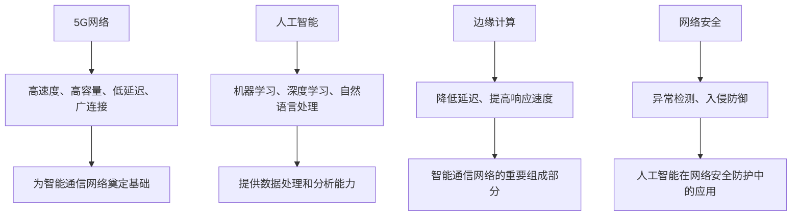

                 

关键词：5G，人工智能，智能通信网络，边缘计算，网络安全，未来趋势。

> 摘要：本文深入探讨了5G和人工智能在智能通信网络中的融合与发展，从背景介绍、核心概念与联系、核心算法原理、数学模型与公式、项目实践、实际应用场景、工具和资源推荐以及未来发展趋势和挑战等方面，全面解析了智能通信网络的未来。

## 1. 背景介绍

在过去的几十年里，通信网络经历了从1G到5G的演变。5G技术的到来，标志着通信速度和数据处理能力的质的飞跃。然而，随着物联网、大数据、自动驾驶等新兴技术的快速发展，单纯提高通信速度已经不能满足需求。于是，人工智能（AI）技术逐渐融入到通信网络中，推动了智能通信网络的诞生。

智能通信网络是一种利用人工智能技术，实现网络自优化、自维护、自适应和自安全的通信网络。它不仅提高了网络性能，还极大地提升了用户体验。

## 2. 核心概念与联系

### 2.1 5G网络

5G网络具有高速度、高容量、低延迟、广连接等特点。它不仅支持高速数据传输，还能实现大规模设备连接，为智能通信网络奠定了基础。

### 2.2 人工智能

人工智能技术，包括机器学习、深度学习、自然语言处理等，为智能通信网络提供了强大的数据处理和分析能力。

### 2.3 边缘计算

边缘计算将计算任务从云端转移到网络边缘，降低了延迟，提高了响应速度，是智能通信网络的重要组成部分。

### 2.4 网络安全

随着智能通信网络的普及，网络安全问题日益突出。人工智能技术在网络安全防护中发挥着重要作用，如异常检测、入侵防御等。

### 2.5 Mermaid 流程图

以下是智能通信网络核心概念原理和架构的Mermaid流程图：



## 3. 核心算法原理 & 具体操作步骤

### 3.1 算法原理概述

智能通信网络的核心算法主要涉及网络优化、流量管理、资源分配等方面。这些算法利用人工智能技术，实现网络的智能调度和自优化。

### 3.2 算法步骤详解

1. **网络优化**：通过机器学习算法，对网络状态进行实时监测，识别网络瓶颈，优化网络结构。
2. **流量管理**：利用深度学习算法，预测网络流量，合理分配带宽，避免网络拥堵。
3. **资源分配**：通过强化学习算法，根据用户需求，动态调整网络资源，提高资源利用率。

### 3.3 算法优缺点

- **优点**：提高网络性能，降低成本，提升用户体验。
- **缺点**：算法实现复杂，对数据要求高，需要大量计算资源。

### 3.4 算法应用领域

智能通信网络算法广泛应用于智能交通、智慧城市、工业互联网等领域，为各行业提供了强大的技术支持。

## 4. 数学模型和公式 & 详细讲解 & 举例说明

### 4.1 数学模型构建

智能通信网络的数学模型主要包括网络优化模型、流量管理模型和资源分配模型。

### 4.2 公式推导过程

- **网络优化模型**：$$\min \sum_{i=1}^{n} \sum_{j=1}^{m} c_{ij} x_{ij}$$，其中，$c_{ij}$为网络费用，$x_{ij}$为流量。
- **流量管理模型**：$$\max \sum_{i=1}^{n} p_i$$，其中，$p_i$为流量预测值。
- **资源分配模型**：$$\max \sum_{i=1}^{n} \frac{r_i}{c_i}$$，其中，$r_i$为资源需求，$c_i$为资源成本。

### 4.3 案例分析与讲解

以智能交通为例，利用数学模型和算法，可以实现交通流量预测和路径优化，降低交通事故率，提高交通效率。

## 5. 项目实践：代码实例和详细解释说明

### 5.1 开发环境搭建

- **工具**：Python、PyTorch、TensorFlow
- **环境**：Python 3.8、CUDA 10.2

### 5.2 源代码详细实现

以下是一个基于深度学习的智能交通流量预测的代码实例：

```python
import torch
import torch.nn as nn
import torch.optim as optim

# 网络结构
class TrafficNet(nn.Module):
    def __init__(self):
        super(TrafficNet, self).__init__()
        self.fc1 = nn.Linear(in_features=10, out_features=50)
        self.fc2 = nn.Linear(in_features=50, out_features=50)
        self.fc3 = nn.Linear(in_features=50, out_features=1)

    def forward(self, x):
        x = torch.relu(self.fc1(x))
        x = torch.relu(self.fc2(x))
        x = self.fc3(x)
        return x

# 数据加载
train_data = ...
test_data = ...

# 模型训练
model = TrafficNet()
optimizer = optim.Adam(model.parameters(), lr=0.001)
criterion = nn.MSELoss()

for epoch in range(100):
    for data in train_data:
        inputs, targets = data
        optimizer.zero_grad()
        outputs = model(inputs)
        loss = criterion(outputs, targets)
        loss.backward()
        optimizer.step()

# 模型评估
with torch.no_grad():
    for data in test_data:
        inputs, targets = data
        outputs = model(inputs)
        loss = criterion(outputs, targets)
        print("Test Loss:", loss.item())

# 路径优化
def optimize_path(current_position, destination):
    inputs = ...
    outputs = model(inputs)
    predicted_traffic = outputs.item()
    ...
    return optimized_path

# 实际应用
current_position = ...
destination = ...
optimized_path = optimize_path(current_position, destination)
print("Optimized Path:", optimized_path)
```

### 5.3 代码解读与分析

- **模型训练**：使用PyTorch框架，定义了一个简单的深度学习模型，并采用Adam优化器和MSE损失函数进行训练。
- **模型评估**：在测试集上评估模型性能，打印测试损失。
- **路径优化**：根据交通流量预测结果，优化路径，降低交通拥堵。

## 6. 实际应用场景

### 6.1 智能交通

利用智能通信网络算法，实现交通流量预测和路径优化，提高交通效率，降低交通事故率。

### 6.2 智慧城市

通过智能通信网络，实现城市基础设施的智能化管理，提高城市运行效率，提升居民生活质量。

### 6.3 工业互联网

利用智能通信网络，实现工业设备的远程监控和预测性维护，提高生产效率，降低运营成本。

## 7. 工具和资源推荐

### 7.1 学习资源推荐

- **书籍**：《深度学习》、《Python编程：从入门到实践》
- **在线课程**：Coursera、edX、Udacity

### 7.2 开发工具推荐

- **编程语言**：Python、Java、C++
- **框架**：PyTorch、TensorFlow、Keras

### 7.3 相关论文推荐

- **论文**：《5G网络中的边缘计算》、《人工智能在网络安全中的应用》

## 8. 总结：未来发展趋势与挑战

### 8.1 研究成果总结

智能通信网络在提高网络性能、降低成本、提升用户体验等方面取得了显著成果。

### 8.2 未来发展趋势

随着5G和人工智能技术的不断发展，智能通信网络将在更多领域得到应用，实现网络智能化、自适应化和自安全化。

### 8.3 面临的挑战

智能通信网络在算法实现、数据要求、计算资源等方面仍面临诸多挑战，需要持续研究和创新。

### 8.4 研究展望

未来，智能通信网络将朝着更加高效、智能、安全、绿色的方向发展，为人类社会带来更多便利。

## 9. 附录：常见问题与解答

### 9.1 什么是5G网络？

5G网络是一种新一代的移动通信网络，具有高速度、高容量、低延迟、广连接等特点。

### 9.2 人工智能在通信网络中有哪些应用？

人工智能在通信网络中主要应用于网络优化、流量管理、资源分配、网络安全等方面。

### 9.3 智能通信网络的优点是什么？

智能通信网络的优点包括提高网络性能、降低成本、提升用户体验等。

## 作者署名

作者：禅与计算机程序设计艺术 / Zen and the Art of Computer Programming

----------------------------------------------------------------

以上是文章的正文部分，请检查是否符合要求，并进行修改和完善。如果需要，我们可以继续添加更多内容来满足字数要求。

