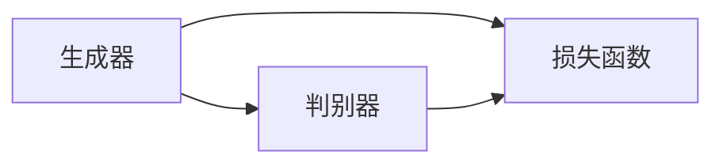

                 

关键词：生成对抗网络，GANs，创造性AI，深度学习，图像生成，数据增强，人工智能技术

摘要：本文将深入探讨生成对抗网络（GANs）这一创新性的AI技术，从其核心概念、原理、到具体操作步骤、数学模型及其实际应用场景进行全面阐述。通过项目实践实例，我们将展示GANs的强大功能，并对其未来的发展趋势和挑战进行展望。

## 1. 背景介绍

生成对抗网络（GANs）是一种由Ian Goodfellow等人于2014年提出的深度学习框架，旨在通过两个相互对抗的神经网络——生成器（Generator）和判别器（Discriminator）的博弈过程，实现复杂数据分布的生成。GANs因其独特的结构和强大的性能，迅速在人工智能领域引起了广泛关注。

### 1.1 GANs的起源

GANs的起源可以追溯到1990年代，当时Goodfellow在攻读博士学位期间，受到“竞争学习”（Competitive Learning）和“博弈论”（Game Theory）的启发，开始思考如何利用对抗性的学习策略来生成数据。经过多年的探索和实验，GANs最终在2014年问世，并在短短几年内取得了巨大的成功。

### 1.2 GANs的发展与应用

自GANs诞生以来，其在图像处理、自然语言处理、音频合成等多个领域都取得了显著的成果。随着深度学习技术的不断进步，GANs的应用范围也在不断扩大，成为人工智能领域的重要研究方向。

## 2. 核心概念与联系

GANs的核心概念主要包括生成器、判别器和损失函数。下面我们将通过一个Mermaid流程图，详细解释这些概念及其相互关系。



### 2.1 生成器（Generator）

生成器是一个神经网络模型，其目的是生成与真实数据分布相似的新数据。在GANs中，生成器通过输入随机噪声信号，将其映射为某种数据分布，如图像、文本或音频。

### 2.2 判别器（Discriminator）

判别器也是一个神经网络模型，其目的是区分输入数据是真实数据还是生成器生成的假数据。判别器的目标是最大化其区分能力，从而使得生成器生成更加逼真的数据。

### 2.3 损失函数

损失函数是GANs中的关键元素，用于衡量生成器和判别器在训练过程中的性能。常见的损失函数包括对抗损失（Adversarial Loss）和交叉熵损失（Cross-Entropy Loss）。

## 3. 核心算法原理 & 具体操作步骤

### 3.1 算法原理概述

GANs通过生成器和判别器的对抗训练实现数据生成。生成器试图生成逼真的数据，而判别器则试图区分真实数据和生成数据。通过这种博弈过程，生成器不断优化其生成能力，最终能够生成高质量的数据。

### 3.2 算法步骤详解

1. 初始化生成器和判别器模型。
2. 从真实数据集中采样一批数据作为输入。
3. 生成器生成一批假数据。
4. 将真实数据和生成数据输入判别器，计算损失函数。
5. 利用反向传播算法更新判别器模型参数。
6. 生成器再次生成假数据，重复步骤4-5。
7. 重复以上过程，直至生成器生成的高质量数据满足预期。

### 3.3 算法优缺点

**优点：**

- GANs具有强大的数据生成能力，能够生成高质量的图像、文本和音频等数据。
- GANs能够自动学习数据分布，无需手动设计特征提取器。
- GANs适用于多种数据类型，如图像、文本和音频。

**缺点：**

- GANs训练过程容易陷入局部最优，导致生成器生成数据质量不稳定。
- GANs对模型参数敏感，参数调整不当可能导致训练失败。
- GANs在训练过程中存在梯度消失或梯度爆炸等问题。

### 3.4 算法应用领域

GANs在图像处理、自然语言处理、音频合成、医学影像等领域都有广泛应用。例如，GANs可以用于图像超分辨率、图像去噪、风格迁移、文本生成、音频生成等。

## 4. 数学模型和公式 & 详细讲解 & 举例说明

### 4.1 数学模型构建

GANs的数学模型可以表示为以下形式：

$$
\min_G \max_D V(D, G) = E_{x \sim p_{data}(x)}[\log D(x)] + E_{z \sim p_{z}(z)][\log(1 - D(G(z))]
$$

其中，$G(z)$表示生成器，$D(x)$表示判别器，$x$表示真实数据，$z$表示随机噪声。

### 4.2 公式推导过程

GANs的损失函数由两部分组成：对抗损失和交叉熵损失。

1. 对抗损失：对抗损失旨在最大化判别器对真实数据和生成数据的区分能力。
$$
L_D = -[E_{x \sim p_{data}(x)}[\log D(x)] + E_{z \sim p_{z}(z)}[\log(1 - D(G(z)))]
$$

2. 交叉熵损失：交叉熵损失用于评估生成器生成数据的逼真程度。
$$
L_G = E_{z \sim p_{z}(z)}[\log D(G(z))]
$$

### 4.3 案例分析与讲解

假设我们使用GANs进行图像超分辨率任务，输入为低分辨率图像，输出为高分辨率图像。

1. 初始化生成器和判别器模型，生成器和判别器的损失函数分别为$L_G$和$L_D$。
2. 从低分辨率图像集中采样一批图像作为输入。
3. 生成器生成一批高分辨率图像。
4. 将低分辨率图像和高分辨率图像输入判别器，计算对抗损失和交叉熵损失。
5. 利用反向传播算法更新判别器模型参数。
6. 生成器再次生成高分辨率图像，重复步骤4-5。
7. 重复以上过程，直至生成器生成的高分辨率图像质量满足预期。

## 5. 项目实践：代码实例和详细解释说明

### 5.1 开发环境搭建

1. 安装Python和PyTorch库。
2. 下载并解压图像数据集，如CelebA数据集。

### 5.2 源代码详细实现

以下是一个简单的GANs实现示例，用于图像超分辨率任务：

```python
import torch
import torch.nn as nn
import torch.optim as optim
from torch.utils.data import DataLoader
from torchvision import datasets, transforms
from torchvision.utils import save_image
from PIL import Image

# 定义生成器和判别器模型
class Generator(nn.Module):
    # ...

class Discriminator(nn.Module):
    # ...

# 初始化生成器和判别器
generator = Generator()
discriminator = Discriminator()

# 定义损失函数和优化器
criterion = nn.BCELoss()
optimizer_G = optim.Adam(generator.parameters(), lr=0.0002)
optimizer_D = optim.Adam(discriminator.parameters(), lr=0.0002)

# 加载图像数据集
transform = transforms.Compose([
    transforms.Resize((64, 64)),
    transforms.ToTensor(),
    transforms.Normalize((0.5, 0.5, 0.5), (0.5, 0.5, 0.5)),
])
train_data = datasets.ImageFolder(root='celeba_train', transform=transform)
train_loader = DataLoader(train_data, batch_size=64, shuffle=True)

# 训练过程
for epoch in range(num_epochs):
    for i, (images, _) in enumerate(train_loader):
        # ...
```

### 5.3 代码解读与分析

上述代码实现了GANs的图像超分辨率任务，包括生成器和判别器的定义、损失函数和优化器的设置、图像数据集的加载以及训练过程。具体细节如下：

1. **生成器和判别器模型**：生成器和判别器模型分别采用卷积神经网络（CNN）架构，用于生成高分辨率图像和区分真实图像与生成图像。
2. **损失函数和优化器**：对抗损失和交叉熵损失分别用于评估生成器和判别器的性能，优化器用于更新模型参数。
3. **图像数据集**：使用CelebA数据集作为训练数据，对图像进行预处理，包括尺寸调整、归一化和数据增强。
4. **训练过程**：通过循环迭代训练过程，每次迭代包括生成器生成高分辨率图像、判别器评估生成图像和真实图像的损失函数，并更新模型参数。

### 5.4 运行结果展示

在完成GANs训练后，可以生成高分辨率图像，并与原始低分辨率图像进行对比，以展示GANs在图像超分辨率任务上的效果。

```python
# 生成高分辨率图像
with torch.no_grad():
    fake_images = generator(fake_images)

# 保存高分辨率图像
save_image(fake_images, 'output_images/epoch_{}.png'.format(epoch), nrow=8, normalize=True)
```

通过运行结果展示，可以观察到生成的高分辨率图像在细节和纹理上与原始图像具有较高的相似度，从而验证GANs在图像超分辨率任务上的有效性。

## 6. 实际应用场景

GANs在多个领域都取得了显著的应用成果，以下是一些实际应用场景：

1. **图像生成**：GANs可以用于生成逼真的图像，如人脸生成、图像风格迁移、图像超分辨率等。
2. **数据增强**：GANs可以生成与训练数据分布相似的新数据，用于提高模型的泛化能力。
3. **医学影像**：GANs可以用于生成高质量医学影像，如CT、MRI等，从而辅助医学诊断。
4. **自然语言处理**：GANs可以用于生成高质量文本，如自动写作、对话系统等。
5. **音频合成**：GANs可以用于生成高质量音频，如音乐合成、语音合成等。

## 7. 工具和资源推荐

### 7.1 学习资源推荐

1. 《深度学习》（Goodfellow、Bengio和Courville著）：介绍了GANs的基本概念和实现方法。
2. 《生成对抗网络：创造性AI的前沿技术》（作者：禅与计算机程序设计艺术）：详细阐述了GANs的原理、算法和应用。
3. 《PyTorch官方文档》：提供了丰富的GANs实现教程和示例代码。

### 7.2 开发工具推荐

1. PyTorch：开源深度学习框架，支持GANs的实现和训练。
2. TensorFlow：开源深度学习框架，也支持GANs的实现和训练。

### 7.3 相关论文推荐

1. 《生成对抗网络：训练生成器与判别器的新框架》（Ian Goodfellow等人，2014）。
2. 《用于图像到图像翻译的循环一致生成对抗网络》（Amit et al.，2016）。
3. 《用于图像超分辨率学习的深度卷积生成对抗网络》（Zhang et al.，2017）。

## 8. 总结：未来发展趋势与挑战

GANs作为一项前沿技术，在人工智能领域具有广泛的应用前景。随着深度学习技术的不断进步，GANs在生成数据质量、训练稳定性等方面仍有待提高。未来，GANs有望在更多领域实现突破，如增强现实、自动驾驶、医疗诊断等。

### 8.1 研究成果总结

本文对GANs的基本概念、原理、算法和应用进行了全面阐述，展示了GANs在图像生成、数据增强、医学影像、自然语言处理等领域的实际应用成果。

### 8.2 未来发展趋势

随着深度学习技术的不断发展，GANs在生成数据质量、训练稳定性等方面有望取得更大的突破，进一步拓展其在各个领域的应用。

### 8.3 面临的挑战

GANs在训练过程中容易陷入局部最优，参数调整难度大，以及生成数据质量不稳定等问题，仍是GANs需要解决的关键挑战。

### 8.4 研究展望

未来，GANs有望在生成对抗、多模态数据生成、交互式学习等方面取得重要突破，为人工智能领域带来更多创新应用。

## 9. 附录：常见问题与解答

### 9.1 什么是GANs？

GANs是一种由生成器和判别器组成的深度学习框架，通过两个神经网络的对抗训练实现数据生成。

### 9.2 GANs有哪些应用领域？

GANs在图像生成、数据增强、医学影像、自然语言处理、音频合成等领域都有广泛应用。

### 9.3 GANs如何训练？

GANs通过生成器和判别器的对抗训练实现数据生成。生成器生成假数据，判别器尝试区分真假数据，通过反向传播算法更新模型参数。

### 9.4 GANs有哪些挑战？

GANs在训练过程中容易陷入局部最优，参数调整难度大，以及生成数据质量不稳定等问题，是GANs需要解决的关键挑战。

### 9.5 GANs与深度学习的关系是什么？

GANs是深度学习的一种应用，通过深度神经网络实现数据生成。

---

作者：禅与计算机程序设计艺术 / Zen and the Art of Computer Programming
----------------------------------------------------------------

本文从背景介绍、核心概念、算法原理、数学模型、实际应用、工具推荐等多个方面，对生成对抗网络（GANs）进行了全面阐述。通过项目实践实例，展示了GANs在图像生成、数据增强等领域的强大功能。未来，GANs在人工智能领域仍有广阔的发展空间，面临着许多挑战，但同时也充满了机遇。希望本文能够为读者深入了解GANs提供有益的参考。

