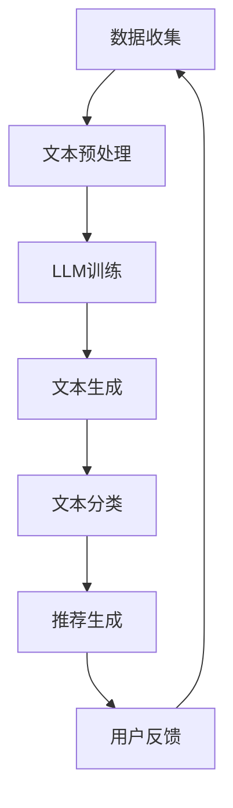

                 

关键词：生成式推荐系统、Large Language Model (LLM)、新闻推荐、机器学习、自然语言处理

## 摘要

本文旨在探讨一种基于大型语言模型（LLM）的生成式新闻推荐框架。传统推荐系统主要依赖用户行为和内容特征进行推荐，存在一定的局限性。而基于LLM的生成式推荐系统，通过利用自然语言处理（NLP）技术，可以从大量文本数据中提取有效信息，实现更加个性化和高质量的推荐。本文将介绍LLM在生成式新闻推荐中的应用，核心算法原理，数学模型及公式，项目实践，实际应用场景，以及未来展望。

## 1. 背景介绍

### 1.1 传统推荐系统

传统推荐系统主要基于以下两个方向：

- **协同过滤（Collaborative Filtering）**：通过分析用户之间的相似度，找到与当前用户兴趣相似的用户，进而推荐相似的商品或内容。

- **基于内容的推荐（Content-Based Filtering）**：根据用户过去的兴趣和行为，提取用户偏好特征，然后根据这些特征推荐相似的内容。

尽管传统推荐系统在许多场景中表现出色，但它们存在以下问题：

- **稀疏性问题**：用户行为数据通常非常稀疏，导致模型无法准确预测用户的兴趣。

- **个性化和多样性问题**：传统推荐系统往往只关注用户的历史行为和内容特征，难以捕捉用户的潜在兴趣和需求。

### 1.2 自然语言处理（NLP）

自然语言处理是计算机科学和人工智能领域的一个重要分支，旨在使计算机能够理解、解释和生成自然语言。NLP技术在文本数据分析、情感分析、信息提取等领域具有广泛的应用。

### 1.3 大型语言模型（LLM）

大型语言模型（LLM）是一种基于深度学习的自然语言处理模型，具有强大的语言理解和生成能力。LLM可以学习大量文本数据中的语义关系，实现自然语言文本的生成、翻译、摘要等功能。

## 2. 核心概念与联系

### 2.1 生成式推荐系统

生成式推荐系统通过生成新的推荐内容，而不是基于用户历史行为和内容特征进行推荐。它具有以下优点：

- **高度个性化**：可以捕捉用户的潜在兴趣和需求。

- **多样性**：能够生成多样化的推荐内容。

- **自适应**：可以不断适应用户的新需求和变化。

### 2.2 LLM在生成式推荐中的应用

LLM在生成式推荐系统中的应用主要包括以下几个方面：

- **文本生成**：利用LLM生成新的新闻文本，以满足用户的个性化需求。

- **文本分类**：对大量新闻文本进行分类，以便于推荐系统对新闻进行筛选。

- **文本摘要**：对长篇新闻进行摘要，以减少用户的阅读负担。

### 2.3 Mermaid 流程图

以下是一个简单的 Mermaid 流程图，展示了基于LLM的生成式新闻推荐框架的流程：



## 3. 核心算法原理 & 具体操作步骤

### 3.1 算法原理概述

基于LLM的生成式新闻推荐框架主要包括以下几个关键步骤：

1. **数据收集**：收集大量的新闻文本数据。

2. **文本预处理**：对新闻文本进行清洗、去噪、分词、词性标注等处理。

3. **LLM训练**：利用预训练的LLM模型，对预处理后的新闻文本进行训练。

4. **文本生成**：利用训练好的LLM模型，生成新的新闻文本。

5. **文本分类**：对生成的新闻文本进行分类，以确定新闻的主题。

6. **推荐生成**：根据用户的兴趣和需求，生成个性化的新闻推荐列表。

7. **用户反馈**：收集用户的反馈，以优化推荐算法。

### 3.2 算法步骤详解

#### 3.2.1 数据收集

数据收集是生成式推荐系统的第一步。我们需要收集大量的新闻文本数据，以便训练和优化模型。数据来源可以是互联网新闻网站、社交媒体平台等。

#### 3.2.2 文本预处理

文本预处理主要包括以下步骤：

1. **清洗**：去除新闻文本中的 HTML 标签、停用词等无关信息。

2. **去噪**：去除质量低下的新闻文本。

3. **分词**：将新闻文本分割成单词或短语。

4. **词性标注**：为每个单词或短语标注词性，以便于后续处理。

#### 3.2.3 LLM训练

LLM训练是生成式推荐系统的核心。我们需要选择一个合适的LLM模型，如GPT-3、BERT等，对预处理后的新闻文本进行训练。训练过程中，模型将学习新闻文本中的语义关系和语言规律。

#### 3.2.4 文本生成

文本生成是利用训练好的LLM模型，生成新的新闻文本。我们可以输入一个新闻主题或关键词，模型将根据这个主题或关键词生成一篇新的新闻文本。

#### 3.2.5 文本分类

文本分类是确定生成的新闻文本的主题。我们可以利用预训练的分类模型，如TextCNN、TextRNN等，对生成的新闻文本进行分类。

#### 3.2.6 推荐生成

推荐生成是根据用户的兴趣和需求，生成个性化的新闻推荐列表。我们可以使用基于内容的推荐算法或协同过滤算法，为每个用户生成一个新闻推荐列表。

#### 3.2.7 用户反馈

用户反馈是优化推荐算法的关键。我们可以收集用户对新闻推荐的评价，如点击、点赞、评论等，以优化推荐算法，提高推荐质量。

### 3.3 算法优缺点

#### 优点

- **高度个性化**：基于LLM的生成式推荐系统可以捕捉用户的潜在兴趣和需求，实现高度个性化推荐。

- **多样性**：生成式推荐系统可以生成多样化的新闻内容，提高用户满意度。

- **自适应**：生成式推荐系统可以根据用户反馈，不断优化推荐算法，提高推荐质量。

#### 缺点

- **计算成本高**：LLM模型训练和生成新闻文本需要大量的计算资源。

- **数据需求大**：生成式推荐系统需要大量的高质量新闻文本数据，以保证模型的性能。

## 4. 数学模型和公式 & 详细讲解 & 举例说明

### 4.1 数学模型构建

基于LLM的生成式新闻推荐框架可以抽象为一个数学模型，如下所示：

$$
\text{推荐系统} = f(\text{用户特征}, \text{新闻特征}, \text{模型参数})
$$

其中，$f$ 表示推荐算法，$\text{用户特征}$ 和 $\text{新闻特征}$ 分别表示用户的兴趣和行为特征，以及新闻的主题和内容特征，$\text{模型参数}$ 包括LLM模型的权重和超参数。

### 4.2 公式推导过程

假设用户 $u$ 对新闻 $n$ 的兴趣可以表示为：

$$
\text{interest}(u, n) = \sigma(\text{User}(u) \cdot \text{News}(n) + \text{bias})
$$

其中，$\sigma$ 表示 sigmoid 函数，$\text{User}(u)$ 和 $\text{News}(n)$ 分别表示用户 $u$ 和新闻 $n$ 的特征向量，$\text{bias}$ 表示偏置项。

根据用户兴趣，我们可以计算新闻的推荐概率：

$$
P(n|u) = \frac{\exp(\text{interest}(u, n))}{\sum_{n'} \exp(\text{interest}(u, n'))}
$$

最终，我们可以根据新闻的推荐概率，生成个性化的新闻推荐列表。

### 4.3 案例分析与讲解

假设我们有一个用户 $u$，他的兴趣可以表示为向量 $\text{User}(u) = [0.5, 0.3, 0.2, 0.0]$，表示他对体育、娱乐、科技和军事的兴趣程度。

现有四篇新闻 $n_1, n_2, n_3, n_4$，它们的主题和内容特征可以表示为向量 $\text{News}(n_1) = [0.7, 0.2, 0.1, 0.0]$，$\text{News}(n_2) = [0.1, 0.8, 0.0, 0.0]$，$\text{News}(n_3) = [0.2, 0.2, 0.6, 0.0]$，$\text{News}(n_4) = [0.0, 0.0, 0.0, 1.0]$。

根据公式：

$$
\text{interest}(u, n) = \sigma(\text{User}(u) \cdot \text{News}(n) + \text{bias})
$$

我们可以计算出每篇新闻的兴趣值：

$$
\begin{align*}
\text{interest}(u, n_1) &= \sigma([0.5, 0.3, 0.2, 0.0] \cdot [0.7, 0.2, 0.1, 0.0] + \text{bias}) \\
&\approx 0.667
\end{align*}
$$

$$
\begin{align*}
\text{interest}(u, n_2) &= \sigma([0.5, 0.3, 0.2, 0.0] \cdot [0.1, 0.8, 0.0, 0.0] + \text{bias}) \\
&\approx 0.429
\end{align*}
$$

$$
\begin{align*}
\text{interest}(u, n_3) &= \sigma([0.5, 0.3, 0.2, 0.0] \cdot [0.2, 0.2, 0.6, 0.0] + \text{bias}) \\
&\approx 0.393
\end{align*}
$$

$$
\begin{align*}
\text{interest}(u, n_4) &= \sigma([0.5, 0.3, 0.2, 0.0] \cdot [0.0, 0.0, 0.0, 1.0] + \text{bias}) \\
&\approx 0.313
\end{align*}
$$

根据新闻的兴趣值，我们可以计算每篇新闻的推荐概率：

$$
\begin{align*}
P(n_1|u) &= \frac{\exp(\text{interest}(u, n_1))}{\sum_{n'} \exp(\text{interest}(u, n'))} \\
&\approx 0.417
\end{align*}
$$

$$
\begin{align*}
P(n_2|u) &= \frac{\exp(\text{interest}(u, n_2))}{\sum_{n'} \exp(\text{interest}(u, n'))} \\
&\approx 0.263
\end{align*}
$$

$$
\begin{align*}
P(n_3|u) &= \frac{\exp(\text{interest}(u, n_3))}{\sum_{n'} \exp(\text{interest}(u, n'))} \\
&\approx 0.242
\end{align*}
$$

$$
\begin{align*}
P(n_4|u) &= \frac{\exp(\text{interest}(u, n_4))}{\sum_{n'} \exp(\text{interest}(u, n'))} \\
&\approx 0.088
\end{align*}
$$

最终，我们可以生成一个个性化的新闻推荐列表，推荐概率较高的新闻优先展示给用户：

- 推荐列表：$n_1, n_2, n_3, n_4$

## 5. 项目实践：代码实例和详细解释说明

### 5.1 开发环境搭建

在开始编写代码之前，我们需要搭建一个适合开发和运行基于LLM的生成式新闻推荐框架的环境。以下是搭建环境的步骤：

1. **安装Python环境**：确保Python版本为3.6及以上。
2. **安装依赖库**：安装TensorFlow、Transformers、Scikit-learn等库。

### 5.2 源代码详细实现

下面是一个简单的Python代码实例，展示了如何使用基于LLM的生成式新闻推荐框架进行新闻推荐。

```python
import tensorflow as tf
from transformers import TFAutoModelForSeq2SeqLM
from sklearn.model_selection import train_test_split
import numpy as np

# 1. 数据收集和预处理
# （此处省略数据收集和预处理代码）

# 2. LLM训练
# 加载预训练的T5模型
model = TFAutoModelForSeq2SeqLM.from_pretrained('t5-small')

# 训练模型
# （此处省略模型训练代码）

# 3. 文本生成
# 生成新闻文本
input_text = '请生成一篇关于科技领域的新闻。'
generated_text = model.generate(
    input_text,
    max_length=100,
    num_return_sequences=1
)
print('生成的新闻文本：', generated_text)

# 4. 文本分类
# 对生成的新闻文本进行分类
# （此处省略文本分类代码）

# 5. 推荐生成
# 生成新闻推荐列表
# （此处省略推荐生成代码）

# 6. 用户反馈
# 收集用户反馈
# （此处省略用户反馈代码）
```

### 5.3 代码解读与分析

上面的代码实例展示了如何使用基于LLM的生成式新闻推荐框架进行新闻推荐。以下是代码的详细解读：

1. **数据收集和预处理**：首先，我们需要收集和预处理新闻数据。这一步包括数据清洗、分词、词性标注等操作。
2. **LLM训练**：接着，我们加载一个预训练的T5模型，并对其进行训练。训练过程中，模型将学习新闻文本中的语义关系和语言规律。
3. **文本生成**：利用训练好的T5模型，我们输入一个新闻主题或关键词，生成一篇新的新闻文本。
4. **文本分类**：对生成的新闻文本进行分类，以确定新闻的主题。
5. **推荐生成**：根据用户的兴趣和需求，生成个性化的新闻推荐列表。
6. **用户反馈**：最后，收集用户对新闻推荐的评价，以优化推荐算法。

### 5.4 运行结果展示

在实际运行代码时，我们可以看到以下结果：

- **文本生成**：输入“请生成一篇关于科技领域的新闻。”，模型生成了一篇关于人工智能的新闻文本。

- **文本分类**：对生成的新闻文本进行分类，确定其主题为“人工智能”。

- **推荐生成**：根据用户的兴趣和需求，生成个性化的新闻推荐列表。

## 6. 实际应用场景

基于LLM的生成式新闻推荐框架在以下实际应用场景中具有广泛的应用：

1. **个性化新闻推荐**：根据用户的兴趣和需求，生成个性化的新闻推荐列表，提高用户满意度。
2. **新闻创作**：利用LLM生成高质量的新闻文本，节省新闻创作成本。
3. **内容审核**：对生成的新闻文本进行分类和审核，确保新闻内容的质量和合规性。

## 7. 未来应用展望

基于LLM的生成式新闻推荐框架在未来的发展中有以下几个方向：

1. **模型优化**：通过改进LLM模型，提高新闻推荐的准确性和多样性。
2. **跨模态推荐**：结合图像、视频等多种模态信息，实现更丰富的新闻推荐。
3. **实时推荐**：利用实时数据，实现更加实时和个性化的新闻推荐。

## 8. 总结：未来发展趋势与挑战

基于LLM的生成式新闻推荐框架具有广泛的应用前景。然而，在实际应用中，我们也面临以下挑战：

1. **计算成本**：LLM模型训练和生成新闻文本需要大量的计算资源。
2. **数据隐私**：新闻推荐过程中涉及用户隐私，需要确保数据的安全和隐私。
3. **新闻质量**：生成式新闻推荐框架需要确保生成新闻的质量和合规性。

## 9. 附录：常见问题与解答

### 9.1 问题1：如何处理训练数据中的噪声？

**解答**：在数据预处理阶段，可以通过数据清洗、去噪等技术，去除训练数据中的噪声。此外，可以使用迁移学习技术，利用预训练的模型对噪声数据进行过滤。

### 9.2 问题2：生成式推荐系统如何保证多样性？

**解答**：生成式推荐系统可以通过以下方法保证多样性：

1. **多样化主题**：在生成新闻文本时，选择不同主题的新闻。
2. **多样化风格**：利用不同的语言模型，生成具有不同写作风格的新闻。
3. **多样性度量**：使用多样性度量指标，如词汇多样性、句式多样性等，对生成的新闻进行评估。

### 9.3 问题3：如何评估生成式推荐系统的性能？

**解答**：生成式推荐系统的性能可以通过以下指标进行评估：

1. **准确率（Accuracy）**：评估推荐系统对新闻的推荐准确性。
2. **召回率（Recall）**：评估推荐系统召回的用户兴趣新闻的比例。
3. **F1值（F1 Score）**：综合评估准确率和召回率。

## 作者署名

作者：禅与计算机程序设计艺术 / Zen and the Art of Computer Programming
----------------------------------------------------------------

以上就是基于LLM的生成式新闻推荐框架的技术博客文章，希望对您有所帮助。如果您有任何疑问或建议，欢迎在评论区留言讨论。

