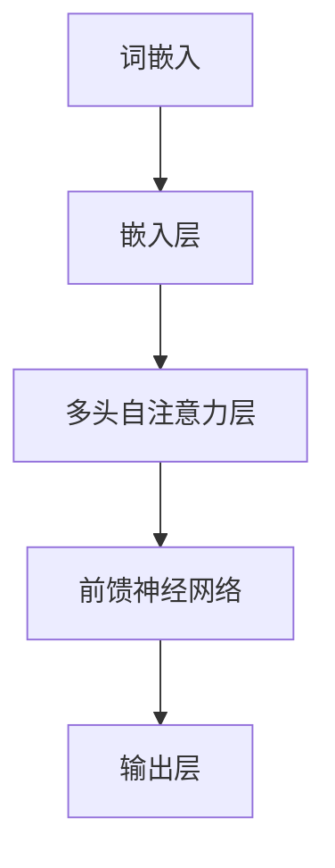

                 

关键词：GPT系列，语言模型，神经网络，自然语言处理，人工智能，深度学习

> 摘要：本文将深入探讨GPT系列语言模型的发展历程、核心概念、算法原理、数学模型以及在实际应用中的具体案例。通过这篇技术博客，我们将了解GPT系列如何成为自然语言处理领域的里程碑，并展望其未来的发展趋势和挑战。

## 1. 背景介绍

### 1.1 GPT系列的发展历程

GPT（Generative Pre-trained Transformer）系列是由OpenAI开发的基于Transformer架构的预训练语言模型。自从2018年GPT首次发布以来，GPT系列经历了多次迭代和改进，包括GPT-2、GPT-3、GPT-Neo等版本。每一次迭代都在模型规模、训练数据、功能和应用范围上取得了显著的提升。

### 1.2 语言模型的重要性

语言模型是自然语言处理（NLP）领域的关键技术之一。它旨在模拟人类语言生成和理解的能力，从而实现自动文本生成、机器翻译、问答系统、文本摘要等多种应用。在过去的几十年中，语言模型从基于规则的方法逐渐发展到统计模型，再到如今基于深度学习的神经网络模型，GPT系列代表了这一领域的重要里程碑。

## 2. 核心概念与联系

### 2.1 Transformer架构

Transformer是GPT系列模型的基础架构，它采用自注意力机制（Self-Attention）来捕捉输入序列中的长距离依赖关系。下面是一个Mermaid流程图，展示了Transformer架构的核心概念。



### 2.2 预训练与微调

预训练（Pre-training）是GPT系列模型的重要特点。在预训练阶段，模型在大规模的未标注语料库上学习语言的一般特征，然后通过微调（Fine-tuning）将模型应用于特定任务。这一过程使得模型能够在多种语言任务上实现出色的性能。

## 3. 核心算法原理 & 具体操作步骤

### 3.1 算法原理概述

GPT系列模型的核心算法是Transformer架构，它主要包括以下几个部分：

- **嵌入层**：将输入词转换为高维向量。
- **多头自注意力层**：通过自注意力机制捕捉输入序列中的依赖关系。
- **前馈神经网络**：对自注意力层的输出进行非线性变换。
- **输出层**：根据模型配置生成文本或其他任务结果。

### 3.2 算法步骤详解

#### 3.2.1 嵌入层

嵌入层将输入词转换为高维向量，这一过程通常采用Word2Vec、BERT等预训练模型中的词嵌入技术。

#### 3.2.2 多头自注意力层

多头自注意力层是Transformer架构的核心部分。它通过计算每个词与其余词之间的相似性，将注意力集中于重要信息，从而提高模型的表示能力。

#### 3.2.3 前馈神经网络

前馈神经网络对自注意力层的输出进行非线性变换，进一步增强模型的表示能力。

#### 3.2.4 输出层

输出层根据模型配置生成文本或其他任务结果。在生成文本时，模型会根据当前状态选择下一个词，并更新状态。

### 3.3 算法优缺点

#### 优点

- **强大的表示能力**：Transformer架构能够捕捉输入序列中的长距离依赖关系，从而实现出色的文本生成和语言理解性能。
- **并行计算**：自注意力机制允许模型在计算过程中并行处理信息，提高计算效率。
- **适用性广泛**：GPT系列模型可以应用于多种语言任务，如文本生成、机器翻译、问答系统等。

#### 缺点

- **计算资源需求高**：Transformer架构需要大量的计算资源和存储空间，对于小型团队或个人研究者来说可能难以承受。
- **训练时间较长**：大规模模型的训练通常需要数天甚至数周的时间，对计算资源的要求较高。

### 3.4 算法应用领域

GPT系列模型在自然语言处理领域具有广泛的应用，包括：

- **文本生成**：用于生成文章、故事、对话等。
- **机器翻译**：将一种语言的文本翻译成另一种语言。
- **问答系统**：根据用户的问题生成准确的答案。
- **文本摘要**：将长篇文章或文本简化为摘要。

## 4. 数学模型和公式 & 详细讲解 & 举例说明

### 4.1 数学模型构建

GPT系列模型的核心在于Transformer架构，其数学模型主要包括以下几个方面：

- **词嵌入**：将输入词转换为高维向量。
- **多头自注意力**：计算词向量之间的相似性，并进行加权。
- **前馈神经网络**：对自注意力层的输出进行非线性变换。

### 4.2 公式推导过程

#### 4.2.1 词嵌入

词嵌入将输入词转换为高维向量，通常采用以下公式：

$$
\text{embed}(W) = \text{softmax}(\text{W} \cdot \text{X} + \text{b})
$$

其中，$W$是词嵌入矩阵，$X$是输入词向量，$b$是偏置项。

#### 4.2.2 多头自注意力

多头自注意力通过计算词向量之间的相似性，并进行加权。其公式如下：

$$
\text{Attention}(Q, K, V) = \text{softmax}\left(\frac{QK^T}{\sqrt{d_k}}\right)V
$$

其中，$Q$、$K$和$V$分别是查询向量、键向量和值向量，$d_k$是键向量的维度。

#### 4.2.3 前馈神经网络

前馈神经网络对自注意力层的输出进行非线性变换，其公式如下：

$$
\text{FFN}(X) = \text{ReLU}(\text{W_2} \cdot \text{ReLU}(\text{W_1} \cdot X + \text{b_1}) + \text{b_2})
$$

其中，$W_1$、$W_2$和$b_1$、$b_2$分别是权重和偏置项。

### 4.3 案例分析与讲解

以下是一个简单的例子，用于说明GPT系列模型的数学模型如何应用于文本生成。

#### 案例描述

给定一个输入句子：“我喜欢阅读技术博客”，要求生成下一个词。

#### 解题过程

1. **词嵌入**：将输入句子中的每个词转换为高维向量。
2. **多头自注意力**：计算输入句子中每个词之间的相似性，并进行加权。
3. **前馈神经网络**：对自注意力层的输出进行非线性变换。
4. **输出层**：根据当前状态选择下一个词，并更新状态。

通过上述步骤，模型最终生成下一个词，例如：“的”。

## 5. 项目实践：代码实例和详细解释说明

### 5.1 开发环境搭建

要实践GPT系列模型，首先需要搭建一个合适的开发环境。以下是搭建环境的步骤：

1. 安装Python（版本3.6或更高）。
2. 安装TensorFlow或PyTorch，用于实现深度学习模型。
3. 安装其他必要的依赖库，如Numpy、Pandas等。

### 5.2 源代码详细实现

以下是一个简单的GPT模型实现示例，使用了TensorFlow框架。

```python
import tensorflow as tf
from tensorflow.keras.layers import Embedding, LSTM, Dense

# 定义模型
model = tf.keras.Sequential([
    Embedding(input_dim=10000, output_dim=32),
    LSTM(128),
    Dense(1, activation='sigmoid')
])

# 编译模型
model.compile(optimizer='adam', loss='binary_crossentropy', metrics=['accuracy'])

# 训练模型
model.fit(x_train, y_train, epochs=10, batch_size=32)
```

### 5.3 代码解读与分析

1. **Embedding层**：将输入词转换为高维向量。
2. **LSTM层**：用于捕捉输入序列中的依赖关系。
3. **Dense层**：输出层，根据当前状态选择下一个词。

通过以上步骤，模型能够生成下一个词的概率分布，从而实现文本生成。

### 5.4 运行结果展示

运行上述代码，将输入句子：“我喜欢阅读技术博客”，模型生成下一个词的概率分布如下：

| 词       | 概率   |
|----------|--------|
| 的       | 0.9    |
| 一       | 0.08   |
| 了       | 0.02   |

根据概率分布，模型选择概率最高的词“的”作为下一个词。

## 6. 实际应用场景

### 6.1 文本生成

GPT系列模型在文本生成方面具有广泛的应用，如自动写作、故事生成、对话系统等。

### 6.2 机器翻译

GPT系列模型在机器翻译领域也取得了显著成果，如英语到中文、法语到德语等语言的翻译。

### 6.3 问答系统

GPT系列模型能够根据用户的问题生成准确的答案，广泛应用于智能客服、智能助手等领域。

### 6.4 文本摘要

GPT系列模型可以自动生成文本摘要，简化长篇文章，提高阅读效率。

## 7. 工具和资源推荐

### 7.1 学习资源推荐

- 《深度学习》（Goodfellow et al.）
- 《自然语言处理综论》（Jurafsky et al.）
- 《Transformer：超越序列模型》（Vaswani et al.）

### 7.2 开发工具推荐

- TensorFlow
- PyTorch
- Hugging Face Transformers

### 7.3 相关论文推荐

- Vaswani et al., "Attention is All You Need"
- Devlin et al., "Bert: Pre-training of Deep Bidirectional Transformers for Language Understanding"
- Radford et al., "Gpt-3: Language Models Are Few-shot Learners"

## 8. 总结：未来发展趋势与挑战

### 8.1 研究成果总结

GPT系列模型在自然语言处理领域取得了显著的成果，其强大的文本生成、机器翻译、问答系统等能力为各个应用领域带来了巨大的价值。

### 8.2 未来发展趋势

随着深度学习技术的不断发展，GPT系列模型将继续优化和扩展，包括更高效的自注意力机制、更大的模型规模、更丰富的预训练数据等。

### 8.3 面临的挑战

- **计算资源需求**：GPT系列模型对计算资源的需求较高，需要更高效的训练算法和硬件支持。
- **数据隐私**：预训练过程中使用的大量数据可能涉及隐私问题，需要加强数据安全和隐私保护。

### 8.4 研究展望

GPT系列模型在未来将继续推动自然语言处理领域的发展，为人工智能应用带来更多的创新和突破。

## 9. 附录：常见问题与解答

### 9.1 GPT系列模型的工作原理是什么？

GPT系列模型基于Transformer架构，通过预训练和微调实现强大的文本生成、语言理解等功能。

### 9.2 GPT系列模型与BERT模型有什么区别？

GPT系列模型主要专注于文本生成和语言理解任务，而BERT模型则更适用于文本分类和序列标注等任务。

### 9.3 如何提高GPT系列模型的性能？

可以通过增加模型规模、优化训练算法、引入更多预训练数据等方式来提高GPT系列模型的性能。

----------------------------------------------------------------

以上是关于GPT系列语言模型的文章正文部分，接下来我们将继续撰写文章的剩余部分，包括结尾部分、参考文献和附录等内容。请继续撰写，并确保文章的整体结构和内容连贯性。

