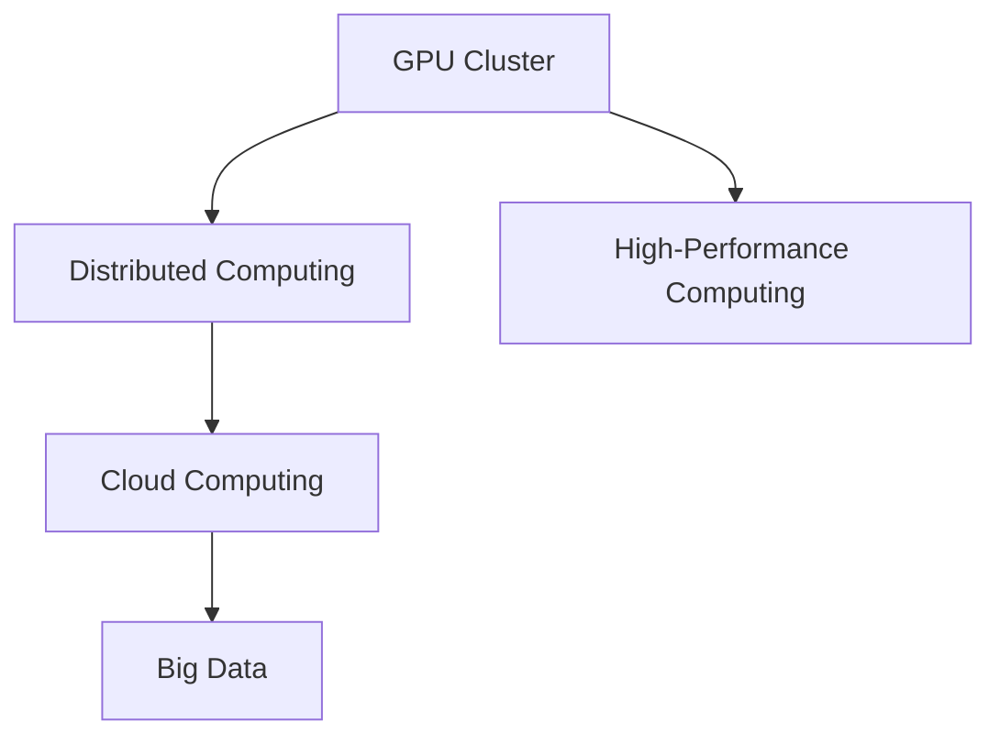

                 

# GPU 集群和分布式计算

> 关键词：GPU 集群, 分布式计算, 高性能计算, 深度学习, 大数据, 数据中心, 云计算, 大规模并行

## 1. 背景介绍

### 1.1 问题由来
随着深度学习和大数据技术的迅猛发展，许多任务需要处理的数据量呈指数级增长。这些数据往往具有超高的复杂度，如大规模文本数据、高维图像和视频数据等。传统的单核 CPU 和单 GPU 硬件已经难以满足需求，需要借助分布式计算技术来实现高效的数据处理和计算。

分布式计算技术旨在通过将大规模计算任务分布到多台计算机或计算节点上，实现并行计算，从而提升计算效率和处理能力。GPU 集群作为分布式计算的重要组成部分，在大数据处理、深度学习、高性能计算等领域中发挥着举足轻重的作用。

### 1.2 问题核心关键点
GPU 集群和分布式计算的核心在于如何高效地利用多台计算机或计算节点的计算能力，并行处理大规模数据和计算任务。关键点包括：

- **任务划分与调度**：如何将大规模任务划分为多个子任务，并将其分配给不同的计算节点进行处理。
- **数据通信与同步**：如何在不同计算节点之间高效地传输数据，确保各节点协同工作。
- **并行计算与负载均衡**：如何利用多台计算节点实现并行计算，避免某些节点过载，保持负载均衡。
- **容错与故障恢复**：如何在系统出现故障时，确保计算任务能够继续执行，数据不丢失。

## 2. 核心概念与联系

### 2.1 核心概念概述

为更好地理解 GPU 集群和分布式计算，本节将介绍几个密切相关的核心概念：

- **GPU 集群（GPU Cluster）**：由多台配备独立 GPU 的计算机或计算节点组成的高性能计算集群。每个节点拥有独立计算资源，可以并行执行计算任务。
- **分布式计算（Distributed Computing）**：将一个大规模计算任务分解为多个子任务，并行分配给多台计算节点进行处理，最终将各节点的计算结果汇总得到最终结果的技术。
- **高性能计算（High-Performance Computing, HPC）**：使用专门设计的硬件和算法，提高计算效率，用于处理复杂和大规模计算任务的技术。
- **云计算（Cloud Computing）**：通过互联网提供按需自助的计算资源和服务，用于大规模数据处理和计算。
- **大数据（Big Data）**：指数据量超出传统数据处理工具和设备的能力范围的大规模数据集，需要分布式计算技术进行处理。

这些核心概念之间的逻辑关系可以通过以下 Mermaid 流程图来展示：



这个流程图展示了大规模计算任务的处理流程：

1. GPU 集群提供了计算资源，用于高性能计算。
2. 分布式计算技术将计算任务分解，分配到不同节点进行并行计算。
3. 云计算提供计算资源和服务的按需使用，进一步拓展计算能力。
4. 大数据处理依赖于分布式计算技术，处理超大规模数据集。

## 3. 核心算法原理 & 具体操作步骤
### 3.1 算法原理概述

GPU 集群和分布式计算的算法原理基于多台计算机或计算节点的协同工作，实现并行计算。核心算法包括以下几个关键点：

- **任务划分**：将一个大规模计算任务划分为多个子任务，通常以数据块或计算节点为单位。
- **任务调度**：根据任务划分结果，将子任务分配给不同的计算节点进行处理。
- **数据传输**：通过高速网络通信，将数据从源节点传输到目标节点。
- **并行计算**：利用多台计算节点并行执行计算任务，加速计算过程。
- **负载均衡**：通过动态调整任务分配策略，确保各节点的计算负载均衡。
- **结果汇总**：将各节点的计算结果汇总，得到最终输出。

### 3.2 算法步骤详解

GPU 集群和分布式计算的具体步骤包括：

**Step 1: 任务划分**
- 将大规模计算任务划分为多个子任务。根据数据分布、计算需求等因素，合理划分任务。

**Step 2: 任务调度**
- 根据任务划分结果，确定各子任务的计算节点。
- 任务调度算法可根据负载均衡、计算速度等因素进行优化。

**Step 3: 数据传输**
- 使用高速网络通信协议，如 TCP/IP、MPI（Message Passing Interface）等，将数据从源节点传输到目标节点。
- 采用数据压缩、分布式存储等技术，减少传输时间和资源消耗。

**Step 4: 并行计算**
- 利用多台计算节点并行执行计算任务。
- 节点间通过共享内存、消息传递等方式，实现数据和计算结果的同步。

**Step 5: 负载均衡**
- 动态调整任务分配策略，确保各节点的计算负载均衡。
- 采用负载均衡算法，如 Round-Robin、Least Load、Consensus，根据节点负载情况合理分配任务。

**Step 6: 结果汇总**
- 将各节点的计算结果汇总，得到最终输出。
- 使用数据合并、结果归并等技术，确保数据一致性和正确性。

### 3.3 算法优缺点

GPU 集群和分布式计算的算法具有以下优点：

- 并行计算：大幅提升计算效率，适用于处理大规模数据和复杂计算任务。
- 负载均衡：充分利用计算资源，避免单节点过载，保持系统稳定。
- 容错能力：通过冗余备份和故障恢复机制，确保计算任务的持续执行。

同时，该算法也存在一些缺点：

- 通信开销：数据传输和节点间通信可能会占用大量带宽和计算资源。
- 同步问题：节点间的通信和数据同步可能导致性能瓶颈。
- 资源管理：多台节点的资源管理复杂，需要高效调度算法。

### 3.4 算法应用领域

GPU 集群和分布式计算在多个领域中得到了广泛应用，例如：

- 大规模数据分析：用于处理大数据集，如 MapReduce、Spark。
- 深度学习模型训练：加速深度学习模型的训练过程，如 TensorFlow、PyTorch。
- 高性能科学研究：用于科学计算、模拟等，如 computational fluid dynamics。
- 云存储和云计算：用于云服务器的部署和管理，如 AWS、Google Cloud。
- 工业自动化：用于智能制造、物联网等，如工业控制、智能监控。

这些应用领域覆盖了计算和数据处理的各个方面，展示了 GPU 集群和分布式计算的强大能力。

## 4. 数学模型和公式 & 详细讲解 & 举例说明

### 4.1 数学模型构建

假设我们有一个大规模计算任务 $T$，任务规模为 $M$，划分为 $N$ 个子任务 $T_1, T_2, \ldots, T_N$，每个子任务需要的计算量为 $C_i$，每个节点拥有 $C$ 的计算能力，则任务划分和调度过程可以表示为：

$$
T = \bigcup_{i=1}^{N} T_i, \quad \text{且} \quad T_i \cap T_j = \emptyset, \quad \forall i \neq j
$$

$$
\sum_{i=1}^{N} C_i = M
$$

任务调度过程可以表示为将每个子任务分配给不同的节点 $j$，任务调度函数 $S$ 定义为：

$$
S: \{1, 2, \ldots, N\} \rightarrow \{1, 2, \ldots, J\}
$$

其中 $J$ 为节点总数。任务调度算法需要最小化计算时间，即：

$$
\min_{S} \sum_{i=1}^{N} t_i
$$

其中 $t_i$ 为节点 $j_{S(i)}$ 处理子任务 $T_i$ 的时间。

### 4.2 公式推导过程

以下我们以 MapReduce 为例，推导分布式计算的时间复杂度。

MapReduce 是一种常用的分布式计算模型，包括 Map 和 Reduce 两个阶段。Map 阶段将输入数据 $D$ 划分为多个数据块 $D_1, D_2, \ldots, D_M$，每个数据块 $D_m$ 由 $N_m$ 个节点并行处理。Reduce 阶段将 Map 阶段的结果 $R_1, R_2, \ldots, R_M$ 合并为最终的输出结果 $O$。

Map 阶段的时间复杂度为 $O(N_m \times C_{D_m})$，Reduce 阶段的时间复杂度为 $O(N \times C_O)$，其中 $C_O$ 为最终输出的大小。

整个 MapReduce 的时间复杂度为：

$$
T_{MapReduce} = \max(T_{Map}, T_{Reduce})
$$

假设 $C_D = C_R = C_O = C$，则：

$$
T_{MapReduce} = \max\left(\sum_{m=1}^{M} N_m \times C, \sum_{m=1}^{M} N_m \times C\right) = O(M \times N \times C)
$$

### 4.3 案例分析与讲解

以下是一个 MapReduce 的简单示例，用于计算一个文本文件 $D$ 中每个单词的出现次数：

- **Map 阶段**：将文本文件 $D$ 划分为多个数据块 $D_1, D_2, \ldots, D_M$，每个数据块由 $N$ 个节点并行处理。每个节点对本地数据块进行处理，将单词和出现次数记录在 $KV$ 对中。
- **Shuffle 阶段**：将 Map 阶段的结果 $R_1, R_2, \ldots, R_M$ 根据单词进行排序和分组，每个单词的数据块只传递给一个 Reduce 节点。
- **Reduce 阶段**：对每个单词，将来自所有节点的 $KV$ 对进行汇总，计算出现次数，并将结果写入最终输出文件 $O$。

## 5. 项目实践：代码实例和详细解释说明

### 5.1 开发环境搭建

在进行 GPU 集群和分布式计算的实践前，我们需要准备好开发环境。以下是使用 Python 和 PyTorch 进行分布式计算的环境配置流程：

1. 安装 PyTorch：使用 pip 命令安装 PyTorch，如：

   ```
   pip install torch torchvision torchaudio torchtext
   ```

2. 安装 PyTorch Distributed：使用 pip 命令安装 PyTorch Distributed，如：

   ```
   pip install torch-distributed torchvision-distributed torchaudio-distributed torchtext-distributed
   ```

3. 安装 CUDA 和 cuDNN：确保本地计算机安装了 CUDA 和 cuDNN 库，并配置环境变量。

4. 安装 Horovod：Horovod 是一个开源的分布式训练框架，支持 TensorFlow、PyTorch 等深度学习框架。使用 pip 命令安装 Horovod，如：

   ```
   pip install horovod
   ```

5. 配置 Horovod：根据不同的深度学习框架，配置 Horovod 的运行环境，如：

   ```
   horovodrun -np 8 python train.py --batch-size 32 --dataset fashion_mnist
   ```

完成上述步骤后，即可在 Horovod 中进行分布式计算的实践。

### 5.2 源代码详细实现

下面我们以一个简单的图像分类任务为例，给出使用 PyTorch 和 Horovod 进行分布式训练的 Python 代码实现。

首先，定义一个简单的图像分类器模型：

```python
import torch.nn as nn

class Net(nn.Module):
    def __init__(self):
        super(Net, self).__init__()
        self.conv1 = nn.Conv2d(1, 10, kernel_size=5)
        self.conv2 = nn.Conv2d(10, 20, kernel_size=5)
        self.fc1 = nn.Linear(320, 50)
        self.fc2 = nn.Linear(50, 10)

    def forward(self, x):
        x = nn.functional.relu(nn.functional.max_pool2d(self.conv1(x), 2))
        x = nn.functional.relu(nn.functional.max_pool2d(self.conv2(x), 2))
        x = x.view(-1, 320)
        x = nn.functional.relu(self.fc1(x))
        x = self.fc2(x)
        return nn.functional.log_softmax(x, dim=1)
```

然后，定义一个分布式训练函数：

```python
import torch
import torch.distributed as dist

def train(params, epochs=10):
    device = 'cuda:0' if torch.cuda.is_available() else 'cpu'

    model = Net().to(device)
    criterion = nn.NLLLoss().to(device)
    optimizer = torch.optim.SGD(model.parameters(), lr=0.01, momentum=0.5)

    for epoch in range(epochs):
        for i, (inputs, labels) in enumerate(train_loader):
            inputs, labels = inputs.to(device), labels.to(device)

            optimizer.zero_grad()
            outputs = model(inputs)
            loss = criterion(outputs, labels)
            loss.backward()
            optimizer.step()

            if i % 100 == 0:
                print(f'Epoch {epoch+1}, batch {i}, loss: {loss.item()}')
```

最后，使用 Horovod 进行分布式训练：

```python
import horovod.torch as hvd
import torch

hvd.init()

train(hvd.rank(), epochs=10)
```

以上就是使用 PyTorch 和 Horovod 进行分布式训练的完整代码实现。可以看到，使用 Horovod 可以很容易地实现多节点训练，加速模型训练过程。

### 5.3 代码解读与分析

让我们再详细解读一下关键代码的实现细节：

**Net 类**：
- 定义了一个简单的卷积神经网络模型，用于图像分类任务。
- 包含两个卷积层和两个全连接层。

**train 函数**：
- 定义了训练函数，用于训练模型。
- 在每个 batch 中，将输入和标签数据传输到指定的计算节点上，进行前向传播和反向传播。
- 使用 Horovod 中的 `hvd.rank()` 获取当前节点的排名，以避免在分布式环境中重复训练数据。

**Horovod 调用**：
- 使用 Horovod 的 `hvd.init()` 初始化分布式训练环境。
- 使用 `hvd.rank()` 获取当前节点的排名，用于处理数据和输出结果。

## 6. 实际应用场景

### 6.1 大数据处理

在大数据处理领域，GPU 集群和分布式计算技术可以显著提升数据处理效率。例如，Hadoop、Spark 等分布式计算框架可以处理海量数据，进行数据清洗、预处理和分析。

在实际应用中，可以将大规模数据集划分为多个数据块，并行分配给多个计算节点进行并行处理。这样可以大幅缩短数据处理时间，加速数据分析过程。

### 6.2 深度学习模型训练

深度学习模型训练需要大量计算资源和时间，GPU 集群和分布式计算技术可以加速训练过程。例如，TensorFlow、PyTorch 等深度学习框架都支持分布式训练。

在实际应用中，可以将大规模数据集和模型参数分布在多个计算节点上进行并行训练，利用多个节点的计算能力，加快模型训练速度。

### 6.3 科学计算与模拟

科学计算和模拟需要高计算能力和高性能计算资源，GPU 集群和分布式计算技术可以满足计算需求。例如，计算机流体力学、气象预报、金融建模等领域，都依赖于大规模计算资源。

在实际应用中，可以将计算任务划分为多个子任务，并行分配给多个计算节点进行并行计算。这样可以大幅缩短计算时间，提升计算效率。

### 6.4 云存储和云计算

云存储和云计算需要大量计算资源和服务，GPU 集群和分布式计算技术可以提供按需自助的计算资源和服务。例如，AWS、Google Cloud 等云平台都支持 GPU 集群和分布式计算。

在实际应用中，可以将大规模计算任务分配给云平台提供的计算节点，利用云平台的计算资源和服务，进行高性能计算和数据分析。

### 6.5 工业自动化

工业自动化需要高效的数据处理和计算能力，GPU 集群和分布式计算技术可以提供强大的计算能力。例如，智能制造、工业控制、智能监控等领域，都依赖于高效的数据处理和计算。

在实际应用中，可以将大规模数据集和计算任务分配给工业自动化系统中的多个计算节点，进行并行计算和数据处理。这样可以大幅提升系统响应速度和效率，优化工业自动化过程。

## 7. 工具和资源推荐

### 7.1 学习资源推荐

为了帮助开发者系统掌握 GPU 集群和分布式计算的理论基础和实践技巧，这里推荐一些优质的学习资源：

1. **《分布式系统概论》**：一本系统介绍分布式计算原理和实践的书籍，适合初学者入门。
2. **《深度学习分布式计算》**：一本介绍深度学习分布式计算的书籍，涵盖了 TensorFlow、PyTorch 等框架的分布式训练技术。
3. **Google Cloud 官方文档**：Google Cloud 提供的官方文档，包含详细的 GPU 集群和分布式计算使用指南。
4. **Horovod 官方文档**：Horovod 提供的官方文档，包含详细的分布式训练和使用指南。
5. **AWS 官方文档**：AWS 提供的官方文档，包含详细的 GPU 集群和分布式计算使用指南。

通过对这些资源的学习实践，相信你一定能够快速掌握 GPU 集群和分布式计算的精髓，并用于解决实际的计算问题。

### 7.2 开发工具推荐

高效的开发离不开优秀的工具支持。以下是几款用于 GPU 集群和分布式计算开发的常用工具：

1. **TensorFlow**：由 Google 开发的开源深度学习框架，支持分布式计算和 GPU 加速。
2. **PyTorch**：由 Facebook 开发的开源深度学习框架，支持分布式计算和 GPU 加速。
3. **Horovod**：一个开源的分布式训练框架，支持 TensorFlow、PyTorch 等深度学习框架。
4. **HorovodRunner**：一个分布式训练工具，可以轻松配置和运行分布式训练任务。
5. **TorchDistX**：一个深度学习分布式训练框架，支持 PyTorch 和 TensorFlow 等框架。

合理利用这些工具，可以显著提升 GPU 集群和分布式计算的开发效率，加快创新迭代的步伐。

### 7.3 相关论文推荐

GPU 集群和分布式计算的发展源于学界的持续研究。以下是几篇奠基性的相关论文，推荐阅读：

1. **MapReduce: Simplified Data Processing on Large Clusters**：Google 发表的 MapReduce 论文，提出了一种分布式计算模型，用于处理大规模数据集。
2. **Scalable Distributed Machine Learning with TensorFlow**：Google 发表的 TensorFlow 论文，介绍了 TensorFlow 的分布式计算和 GPU 加速技术。
3. **PyTorch Distributed**：Facebook 发表的 PyTorch Distributed 论文，介绍了 PyTorch 的分布式计算和 GPU 加速技术。
4. **Horovod: Distributed Training for Deep Learning**：一段详细介绍 Horovod 的论文，介绍了 Horovod 的分布式训练和 GPU 加速技术。

这些论文代表了大规模计算任务的处理流程和发展脉络。通过学习这些前沿成果，可以帮助研究者把握学科前进方向，激发更多的创新灵感。

## 8. 总结：未来发展趋势与挑战

### 8.1 总结

本文对 GPU 集群和分布式计算方法进行了全面系统的介绍。首先阐述了 GPU 集群和分布式计算的研究背景和意义，明确了分布式计算在提升计算效率和处理能力方面的重要价值。其次，从原理到实践，详细讲解了分布式计算的数学原理和关键步骤，给出了分布式计算任务开发的完整代码实例。同时，本文还广泛探讨了分布式计算方法在大数据处理、深度学习、科学计算等多个领域的应用前景，展示了分布式计算技术的强大能力。最后，本文精选了分布式计算技术的各类学习资源，力求为读者提供全方位的技术指引。

通过本文的系统梳理，可以看到，GPU 集群和分布式计算技术正在成为计算和数据处理的重要范式，极大地提升了计算效率和处理能力。未来，伴随深度学习和大数据技术的持续发展，分布式计算技术也将迎来新的突破，为更多的应用场景提供有力支持。

### 8.2 未来发展趋势

展望未来，GPU 集群和分布式计算技术将呈现以下几个发展趋势：

1. **云计算普及**：云计算技术的普及将进一步推动 GPU 集群和分布式计算的应用。各大云平台提供的 GPU 计算资源和服务将变得更加便捷和高效。
2. **边缘计算兴起**：随着物联网和移动计算设备的普及，边缘计算将成为一个重要的计算范式。GPU 集群和分布式计算技术将更好地支持边缘计算。
3. **分布式机器学习兴起**：随着深度学习模型的复杂性增加，分布式机器学习技术将得到广泛应用。GPU 集群和分布式计算技术将更好地支持分布式机器学习。
4. **数据中心智能化**：未来数据中心将更加智能化，通过 GPU 集群和分布式计算技术实现高效的数据处理和计算。
5. **自动优化算法发展**：分布式计算的自动优化算法将得到广泛应用，进一步提升计算效率和资源利用率。

这些趋势凸显了 GPU 集群和分布式计算技术的广阔前景。这些方向的探索发展，将进一步提升计算效率和处理能力，推动计算技术的进步。

### 8.3 面临的挑战

尽管 GPU 集群和分布式计算技术已经取得了瞩目成就，但在迈向更加智能化、普适化应用的过程中，它仍面临着诸多挑战：

1. **资源管理复杂**：多台节点的资源管理复杂，需要高效调度算法。如何优化资源管理，提高计算效率，是一个重要挑战。
2. **通信开销大**：节点间的通信和数据传输占用大量带宽和计算资源，如何降低通信开销，提高通信效率，是一个重要挑战。
3. **数据一致性问题**：节点间的通信和数据同步可能导致数据不一致，如何保证数据一致性和正确性，是一个重要挑战。
4. **扩展性问题**：大规模分布式系统扩展性较差，如何构建可扩展、易维护的分布式系统，是一个重要挑战。
5. **容错性和可靠性**：分布式系统需要高容错性和可靠性，如何设计冗余备份和故障恢复机制，是一个重要挑战。

### 8.4 研究展望

面对 GPU 集群和分布式计算技术所面临的挑战，未来的研究需要在以下几个方面寻求新的突破：

1. **分布式深度学习算法优化**：优化深度学习模型的分布式训练算法，提升计算效率和资源利用率。
2. **分布式系统设计**：设计高效、可扩展、易维护的分布式系统，提升系统的稳定性和可靠性。
3. **数据一致性保障**：保障节点间的通信和数据同步，确保数据一致性和正确性。
4. **资源管理优化**：优化分布式系统的资源管理，提高计算效率和资源利用率。
5. **自动优化算法研究**：研究自动优化算法，提升计算效率和系统性能。

这些研究方向的探索，必将引领 GPU 集群和分布式计算技术迈向更高的台阶，为构建高效、智能的计算系统提供有力支持。面向未来，GPU 集群和分布式计算技术还需要与其他人工智能技术进行更深入的融合，如知识表示、因果推理、强化学习等，多路径协同发力，共同推动计算技术的进步。

## 9. 附录：常见问题与解答

**Q1: 什么是 GPU 集群？**

A: GPU 集群是由多台配备独立 GPU 的计算机或计算节点组成的高性能计算集群，用于大规模并行计算。

**Q2: GPU 集群和分布式计算有什么区别？**

A: GPU 集群是一种由多台配备独立 GPU 的计算机或计算节点组成的高性能计算集群，用于大规模并行计算。而分布式计算是一种将大规模计算任务分解为多个子任务，并行分配给多台计算节点进行处理的技术。GPU 集群通常用于分布式计算中，提供计算资源和计算能力。

**Q3: 如何优化分布式计算的资源管理？**

A: 优化分布式计算的资源管理可以采用以下几个策略：
1. 使用高效的分布式调度算法，如 Round-Robin、Least Load、Consensus，根据节点负载情况合理分配任务。
2. 采用资源池技术，将计算资源集中管理，动态分配任务。
3. 使用数据压缩、分布式存储等技术，减少数据传输和存储的开销。

**Q4: 如何提高分布式计算的通信效率？**

A: 提高分布式计算的通信效率可以采用以下几个策略：
1. 使用高效的通信协议，如 TCP/IP、MPI 等。
2. 采用数据压缩、分布式存储等技术，减少数据传输的开销。
3. 使用节点间的数据同步技术，如内存共享、消息传递等。

**Q5: 如何保障分布式计算的数据一致性？**

A: 保障分布式计算的数据一致性可以采用以下几个策略：
1. 使用同步机制，如 barrier、锁、乐观锁等，确保节点间的同步。
2. 采用数据一致性协议，如 Paxos、Raft 等，确保数据的正确性和一致性。
3. 使用分布式数据库和事务管理技术，确保数据的一致性和正确性。

以上这些资源和技术的推荐，将帮助开发者系统掌握 GPU 集群和分布式计算的原理和实践，推动计算技术的进步。

---

作者：禅与计算机程序设计艺术 / Zen and the Art of Computer Programming

