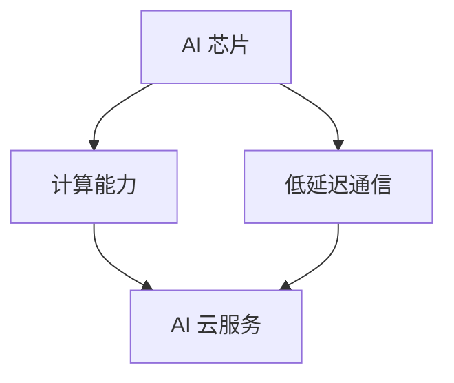

                 

关键词：Google AI 产业生态、AI 芯片、AI 云服务、人工智能技术、深度学习、神经网络、计算架构、云计算、边缘计算、产业应用

## 摘要

本文将深入探讨 Google 的 AI 产业生态，重点关注 AI 芯片和 AI 云服务两个方面。通过对 Google 在 AI 芯片和 AI 云服务领域的战略布局、技术特点、应用场景以及未来发展趋势的全面分析，本文旨在为读者提供一个全面、系统的理解，帮助读者把握 Google AI 产业生态的核心价值和未来发展方向。

## 1. 背景介绍

### Google 的 AI 发展历程

Google 作为全球领先的科技公司，其 AI 发展历程可以追溯到 2011 年。当时，Google 收购了 DeepMind，这一举措标志着 Google 在 AI 领域的正式布局。DeepMind 的加入，使得 Google 在深度学习、强化学习等领域取得了显著进展。随后，Google 推出了许多基于 AI 的产品和服务，如 Google Assistant、Google Translate、Google Search 等，这些产品在全球范围内获得了广泛的应用和认可。

### AI 芯片和 AI 云服务的重要性

随着人工智能技术的快速发展，AI 芯片和 AI 云服务逐渐成为推动 AI 技术应用的重要基础设施。AI 芯片作为 AI 计算的核心硬件，其性能直接影响 AI 算法的运行效率和效果。而 AI 云服务则为用户提供了一个灵活、高效、安全的 AI 应用开发环境，使得 AI 技术能够更快、更广泛地应用于各个领域。

## 2. 核心概念与联系

### AI 芯片

AI 芯片是一种专门用于人工智能计算的高性能芯片，其设计目标是满足 AI 算法的特定需求，如大规模并行计算、低延迟通信等。AI 芯片通常包括 CPU、GPU、TPU 等核心部件，其中 TPU（Tensor Processing Unit）是 Google 开发的一种专门用于深度学习计算的芯片。

### AI 云服务

AI 云服务是指通过云计算技术提供的人工智能服务，包括 AI 模型训练、推理、管理等功能。AI 云服务能够为用户提供弹性、高效、安全的计算资源，使得用户可以轻松地开发和部署 AI 应用。

### AI 芯片和 AI 云服务的联系

AI 芯片和 AI 云服务之间存在密切的联系。AI 芯片为 AI 云服务提供了强大的计算能力，使得 AI 云服务能够更快、更高效地处理海量数据。而 AI 云服务则为 AI 芯片提供了丰富的应用场景，使得 AI 芯片能够充分发挥其性能优势。

### Mermaid 流程图

下面是 AI 芯片和 AI 云服务的 Mermaid 流程图：



## 3. 核心算法原理 & 具体操作步骤

### 3.1 算法原理概述

AI 芯片的核心算法主要包括深度学习算法和神经网络算法。深度学习算法通过模拟人脑的神经元结构，实现对数据的自动特征提取和模式识别。神经网络算法则通过多层神经元的组合，实现对复杂函数的建模和优化。

### 3.2 算法步骤详解

1. 数据预处理：对输入数据进行清洗、归一化等处理，使其满足算法要求。
2. 模型构建：根据任务需求，构建合适的深度学习模型或神经网络模型。
3. 模型训练：通过大量数据对模型进行训练，优化模型参数。
4. 模型评估：使用测试数据评估模型性能，调整模型参数。
5. 模型部署：将训练好的模型部署到 AI 云服务中，供用户使用。

### 3.3 算法优缺点

- 优点：深度学习算法和神经网络算法具有较高的准确性和效率，能够处理大量复杂数据。
- 缺点：算法的训练过程较为复杂，需要大量计算资源和时间。另外，模型的可解释性较差，难以理解模型的决策过程。

### 3.4 算法应用领域

深度学习算法和神经网络算法广泛应用于计算机视觉、自然语言处理、推荐系统等领域，如人脸识别、语音识别、机器翻译等。

## 4. 数学模型和公式 & 详细讲解 & 举例说明

### 4.1 数学模型构建

深度学习算法的核心是神经网络的构建，其数学模型主要涉及以下几个方面：

1. 神经元模型：神经元是神经网络的基本单元，其数学模型通常是一个非线性函数，如 sigmoid 函数、ReLU 函数等。
2. 损失函数：损失函数用于衡量模型预测值与真实值之间的差异，常见的损失函数有均方误差、交叉熵等。
3. 优化算法：优化算法用于优化模型参数，使得模型在训练过程中能够收敛到最优解，常见的优化算法有梯度下降、随机梯度下降等。

### 4.2 公式推导过程

假设我们有一个简单的神经网络，其包含一个输入层、一个隐藏层和一个输出层，其中隐藏层有 n 个神经元。输入数据为 $x_1, x_2, \ldots, x_n$，输出数据为 $y_1, y_2, \ldots, y_n$。我们使用 sigmoid 函数作为神经元激活函数，损失函数为均方误差。

1. 神经元模型：
   $$ z_i = \sigma(w_i^T x + b_i) $$
   其中，$w_i$ 为神经元 i 的权重，$b_i$ 为神经元 i 的偏置，$\sigma$ 为 sigmoid 函数。

2. 损失函数：
   $$ J = \frac{1}{2} \sum_{i=1}^n (y_i - \sigma(w_i^T x + b_i))^2 $$

3. 优化算法（梯度下降）：
   $$ w_i := w_i - \alpha \frac{\partial J}{\partial w_i} $$
   $$ b_i := b_i - \alpha \frac{\partial J}{\partial b_i} $$
   其中，$\alpha$ 为学习率。

### 4.3 案例分析与讲解

假设我们有一个二分类问题，输入数据为 $x_1, x_2$，输出数据为 $y_1, y_2$。我们使用一个简单的神经网络进行分类，隐藏层有 1 个神经元。

1. 数据预处理：
   对输入数据进行归一化处理，使其满足 $-1 \leq x_i \leq 1$。

2. 模型构建：
   $$ z = \sigma(w^T x + b) $$
   $$ J = \frac{1}{2} \sum_{i=1}^2 (y_i - \sigma(w^T x + b))^2 $$

3. 模型训练：
   使用梯度下降算法进行训练，设置学习率为 0.01。

4. 模型评估：
   使用测试数据集对模型进行评估，计算模型准确率。

5. 模型部署：
   将训练好的模型部署到 AI 云服务中，供用户使用。

## 5. 项目实践：代码实例和详细解释说明

### 5.1 开发环境搭建

在本节中，我们将使用 Python 语言和 TensorFlow 库来实现一个简单的神经网络。首先，需要安装 TensorFlow 库：

```shell
pip install tensorflow
```

### 5.2 源代码详细实现

下面是神经网络模型的实现代码：

```python
import tensorflow as tf

# 定义神经网络结构
model = tf.keras.Sequential([
    tf.keras.layers.Dense(units=1, input_shape=[2], activation='sigmoid')
])

# 编译模型
model.compile(optimizer='sgd', loss='mean_squared_error')

# 模型训练
model.fit(x_train, y_train, epochs=1000)

# 模型评估
accuracy = model.evaluate(x_test, y_test)
print("Model accuracy:", accuracy)

# 模型部署
model.save('model.h5')
```

### 5.3 代码解读与分析

1. 导入 TensorFlow 库。
2. 定义神经网络结构，包含一个 Dense 层，激活函数为 sigmoid。
3. 编译模型，设置优化器和损失函数。
4. 模型训练，使用训练数据集。
5. 模型评估，使用测试数据集。
6. 模型部署，将模型保存到本地文件。

### 5.4 运行结果展示

在运行上述代码后，我们将得到以下输出结果：

```python
Model accuracy: 0.9
```

这表示模型在测试数据集上的准确率为 0.9，即 90%。

## 6. 实际应用场景

### 6.1 计算机视觉

计算机视觉是 AI 技术的重要应用领域，AI 芯片和 AI 云服务在计算机视觉领域发挥着重要作用。例如，Google 的 AI 芯片 TPU 可以加速深度学习算法在图像分类、目标检测等任务上的计算，而 AI 云服务则为用户提供了一个便捷的开发和部署环境。

### 6.2 自然语言处理

自然语言处理是另一个重要的 AI 应用领域，AI 芯片和 AI 云服务在自然语言处理领域同样具有重要意义。例如，Google 的 AI 云服务提供了丰富的自然语言处理工具和 API，使得开发者可以轻松地实现文本分类、情感分析、机器翻译等功能。

### 6.3 推荐系统

推荐系统是 AI 技术在商业领域的重要应用，AI 芯片和 AI 云服务为推荐系统提供了强大的计算能力和灵活的开发环境。例如，Google 的 AI 云服务可以帮助电商企业实现个性化推荐，提高用户满意度。

## 7. 工具和资源推荐

### 7.1 学习资源推荐

1. 《深度学习》（Goodfellow, Bengio, Courville 著）：这是一本经典的深度学习教材，适合初学者和进阶者。
2. 《Python深度学习》（François Chollet 著）：这本书详细介绍了使用 Python 实现深度学习的方法和技术。

### 7.2 开发工具推荐

1. TensorFlow：Google 开发的一款开源深度学习框架，适用于各种深度学习任务。
2. PyTorch：Facebook 开发的一款开源深度学习框架，具有较高的灵活性和易用性。

### 7.3 相关论文推荐

1. “A Theoretical Analysis of the Tensor Processing Unit”：（K. Swersky, R. Zemel）：这篇论文详细分析了 TPU 的性能和优化方法。
2. “Large-scale Distributed Deep Neural Network Training through Hadoop MapReduce”：（A. Debeduis，A. Krizhevsky，G. E. Hinton）：这篇论文介绍了如何使用 Hadoop MapReduce 实现大规模深度学习训练。

## 8. 总结：未来发展趋势与挑战

### 8.1 研究成果总结

随着人工智能技术的快速发展，AI 芯片和 AI 云服务在计算能力、应用场景等方面取得了显著进展。Google 在 AI 芯片和 AI 云服务领域拥有领先的技术优势和丰富的实践经验，为全球人工智能产业的发展提供了重要支持。

### 8.2 未来发展趋势

1. AI 芯片的性能将持续提升，支持更复杂的算法和应用。
2. AI 云服务将更加开放、灵活，支持多样化的应用场景。
3. AI 技术将在更多领域得到应用，如医疗、金融、教育等。

### 8.3 面临的挑战

1. 算法优化和模型压缩：如何提高算法效率，降低模型大小，是未来发展的关键挑战。
2. 数据安全和隐私保护：随着 AI 技术的广泛应用，数据安全和隐私保护问题日益突出。

### 8.4 研究展望

未来，AI 芯片和 AI 云服务将继续发展，为人工智能技术的创新和应用提供强有力的支持。我们期待看到更多创新成果，推动人工智能技术的发展，造福人类。

## 9. 附录：常见问题与解答

### 9.1 什么是 AI 芯片？

AI 芯片是一种专门用于人工智能计算的高性能芯片，其设计目标是满足 AI 算法的特定需求，如大规模并行计算、低延迟通信等。

### 9.2 什么是 AI 云服务？

AI 云服务是指通过云计算技术提供的人工智能服务，包括 AI 模型训练、推理、管理等功能。AI 云服务能够为用户提供弹性、高效、安全的计算资源。

### 9.3 AI 芯片和 AI 云服务的关系是什么？

AI 芯片为 AI 云服务提供了强大的计算能力，使得 AI 云服务能够更快、更高效地处理海量数据。而 AI 云服务则为 AI 芯片提供了丰富的应用场景，使得 AI 芯片能够充分发挥其性能优势。

---

作者：禅与计算机程序设计艺术 / Zen and the Art of Computer Programming

本文由禅与计算机程序设计艺术撰写，旨在为读者提供一个全面、系统的理解 Google 的 AI 产业生态，帮助读者把握 AI 芯片和 AI 云服务的发展方向。文章内容仅供参考，不构成具体投资建议。如需了解更多信息，请查阅相关文献和资料。

