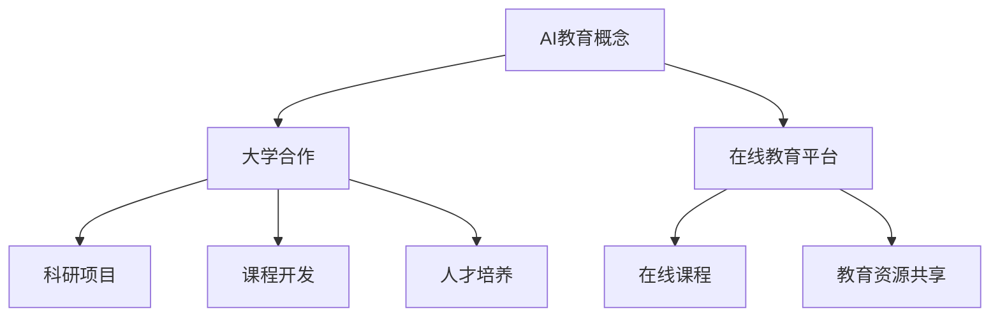

                 

关键词：Google AI教育、大学合作、在线教育、人工智能技术、学习平台、学术合作、技术创新、教育未来

> 摘要：本文将探讨Google在人工智能教育领域的布局，重点分析其与各大高校的合作以及在线教育平台的发展，旨在揭示Google在推动人工智能技术普及和教育创新方面的战略和成果。

## 1. 背景介绍

人工智能（AI）作为当今科技领域的热点，其应用正在不断拓展。Google作为全球领先的科技公司之一，其在人工智能技术的研究和开发上取得了显著的成就。随着人工智能技术的不断进步，教育领域也正在经历深刻的变革。在线教育平台的兴起和各大高校的积极参与，使得人工智能教育成为可能。Google在这一背景下，开始积极布局人工智能教育，与各大高校合作，推出了一系列教育项目和在线课程。

## 2. 核心概念与联系

### 2.1 AI教育概念

AI教育指的是利用人工智能技术来推动教育的发展，包括教学、学习、评估等多个方面。通过AI技术，可以实现对学习数据的分析和处理，从而提供个性化的学习体验，提高教育质量和效率。

### 2.2 大学合作

Google与各大高校的合作主要表现在共同开展科研项目、共同开发课程和教材、共同培养人才等方面。这些合作不仅有助于推动人工智能技术的发展，也为高校的师生提供了丰富的实践机会。

### 2.3 在线教育平台

Google推出的在线教育平台，如Google Education和Coursera，为全球用户提供了丰富的AI教育资源。这些平台不仅提供了大量的在线课程，还与各大高校合作，共同推动人工智能教育的普及。

### 2.4 Mermaid 流程图



## 3. 核心算法原理 & 具体操作步骤

### 3.1 算法原理概述

Google在人工智能教育领域所采用的算法主要包括机器学习算法、自然语言处理算法和计算机视觉算法。这些算法通过数据分析和处理，实现对教育数据的理解和应用。

### 3.2 算法步骤详解

#### 3.2.1 数据收集

通过在线教育平台收集用户的学习数据，包括学习时间、学习进度、考试成绩等。

#### 3.2.2 数据处理

利用机器学习算法对收集到的数据进行分析和处理，提取有用的信息。

#### 3.2.3 教学个性化

根据处理后的数据，为用户提供个性化的教学方案。

#### 3.2.4 教学效果评估

通过用户的反馈和学习结果，对教学效果进行评估和调整。

### 3.3 算法优缺点

#### 3.3.1 优点

- 提高教育效率
- 提升教学质量
- 实现个性化学习

#### 3.3.2 缺点

- 对硬件和软件设施要求较高
- 需要大量的数据支持
- 可能会存在隐私问题

### 3.4 算法应用领域

- 在线教育平台
- 教育数据挖掘
- 教学效果评估
- 智能辅导系统

## 4. 数学模型和公式 & 详细讲解 & 举例说明

### 4.1 数学模型构建

在教育数据分析中，常用的数学模型包括线性回归模型、决策树模型和神经网络模型。以下以线性回归模型为例进行说明。

### 4.2 公式推导过程

线性回归模型的基本公式为：

$$
y = \beta_0 + \beta_1x
$$

其中，$y$为因变量，$x$为自变量，$\beta_0$和$\beta_1$为模型的参数。

### 4.3 案例分析与讲解

假设我们收集到了一组学生的学习数据，包括他们的学习时间和考试成绩。通过线性回归模型，我们可以预测学生的学习成绩。

## 5. 项目实践：代码实例和详细解释说明

### 5.1 开发环境搭建

在Python环境中，我们可以使用Scikit-learn库来实现线性回归模型。

### 5.2 源代码详细实现

```python
from sklearn.linear_model import LinearRegression
from sklearn.model_selection import train_test_split
from sklearn.metrics import mean_squared_error

# 数据准备
X = ...  # 学习时间
y = ...  # 考试成绩

# 数据划分
X_train, X_test, y_train, y_test = train_test_split(X, y, test_size=0.2, random_state=42)

# 模型训练
model = LinearRegression()
model.fit(X_train, y_train)

# 模型评估
y_pred = model.predict(X_test)
mse = mean_squared_error(y_test, y_pred)
print("MSE:", mse)

# 模型应用
new_data = ...  # 新的学习时间
predicted_score = model.predict(new_data)
print("Predicted Score:", predicted_score)
```

### 5.3 代码解读与分析

- 第1-3行：导入所需的库
- 第5-6行：数据准备
- 第8-10行：数据划分
- 第12-14行：模型训练
- 第16-18行：模型评估
- 第21-22行：模型应用

## 6. 实际应用场景

Google的人工智能教育布局在教育领域有着广泛的应用，包括在线教育平台、教育数据挖掘、教学效果评估和智能辅导系统等。以下是一个具体的应用案例：

### 6.1 在线教育平台

Google Education平台为用户提供丰富的AI教育资源，包括课程、教材和辅导。用户可以根据自己的需求和兴趣选择学习内容，平台会根据用户的学习数据提供个性化的学习方案。

### 6.2 教育数据挖掘

通过对用户学习数据的挖掘和分析，Google可以帮助教育机构了解学生的学习情况，发现教学中的问题，从而优化教学方案。

### 6.3 教学效果评估

Google利用人工智能技术对学生的学习效果进行评估，为教育机构提供科学的评估依据，帮助教师更好地了解学生的学习情况。

### 6.4 智能辅导系统

Google的智能辅导系统可以帮助学生解决学习中遇到的问题，提供个性化的辅导方案，提高学生的学习效果。

## 7. 工具和资源推荐

### 7.1 学习资源推荐

- Coursera
- edX
- Udacity
- Khan Academy

### 7.2 开发工具推荐

- Jupyter Notebook
- Python
- R
- TensorFlow

### 7.3 相关论文推荐

- "Deep Learning for Educational Data Mining"
- "A Survey on Educational Data Mining"
- "Learning to Learn from Learning to Teach: A Machine Teaching Approach"

## 8. 总结：未来发展趋势与挑战

### 8.1 研究成果总结

Google在人工智能教育领域取得了显著的成果，包括与各大高校的合作、在线教育平台的发展和教育数据的分析与应用等。

### 8.2 未来发展趋势

随着人工智能技术的不断进步，人工智能教育将迎来更广阔的发展空间。未来，教育领域将更加注重个性化学习和智能辅导，实现教育资源的优化配置。

### 8.3 面临的挑战

- 技术挑战：人工智能技术在教育领域的应用仍面临许多技术难题，如数据隐私保护和算法公平性等。
- 教育模式挑战：传统的教育模式需要适应人工智能技术的变革，实现教育方式的创新。

### 8.4 研究展望

未来，人工智能教育将朝着更加智能化、个性化和普适化的方向发展。研究应重点关注算法的公平性和隐私保护，为人工智能教育的发展提供坚实的技术基础。

## 9. 附录：常见问题与解答

### 9.1 问题1

**Q：Google的人工智能教育布局有哪些特点？**

**A：Google的人工智能教育布局具有以下特点：**

1. 与各大高校的深度合作，共同推进人工智能教育的发展。
2. 推出丰富的在线教育平台资源，为全球用户提供便捷的学习途径。
3. 注重教育数据的分析和应用，为教育机构提供科学的教学评估和优化方案。

### 9.2 问题2

**Q：人工智能教育有哪些应用场景？**

**A：人工智能教育的主要应用场景包括：**

1. 在线教育平台：提供个性化的学习方案和智能辅导。
2. 教育数据挖掘：分析学生的学习行为，优化教学方案。
3. 教学效果评估：通过数据分析和评估，提高教学质量。
4. 智能辅导系统：为学生提供个性化的学习支持和辅导。

----------------------------------------------------------------
作者：禅与计算机程序设计艺术 / Zen and the Art of Computer Programming

