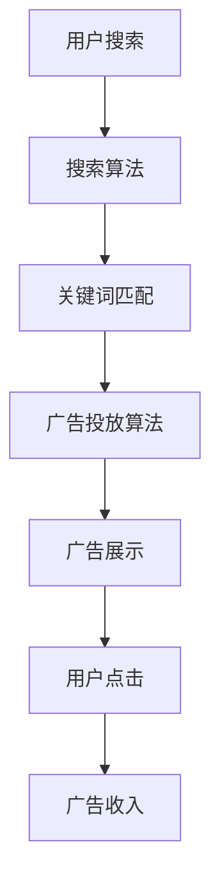

                 

关键词：Google、广告、商业模式、技术、搜索、大数据、人工智能、用户隐私、盈利、市场策略

> 摘要：本文将深入探讨Google的广告商业模式，从其发展历程、核心原理、算法机制、盈利模式、用户隐私保护等方面进行详细分析，并探讨其在当前市场环境中的优势和挑战，同时展望其未来的发展趋势。

## 1. 背景介绍

Google，作为当今全球最大的搜索引擎，其成功离不开其广告商业模式。自1998年成立以来，Google逐渐从单一的搜索服务演变为一个庞大的广告帝国。广告收入成为了Google的主要收入来源，占据了其总收入的绝大多数。

### 1.1 发展历程

- 1998年：Google公司成立，提供基于PageRank算法的搜索引擎服务。
- 2000年：Google推出AdWords，开始正式进军广告市场。
- 2002年：Google上市，股票代码为GOOGL。
- 2006年：Google推出AdSense，为网站主提供广告服务。
- 2010年：Google推出双位数字的广告个性化推荐系统。
- 2015年：Google收购AdMob，进一步加强移动广告市场地位。
- 2016年：Google宣布Google Home智能家居设备。

### 1.2 广告商业模式的演变

Google的广告商业模式经历了数次变革，从简单的关键词广告到复杂的个性化广告推荐系统，Google不断优化其广告算法，提升广告投放的精准度和效率。

## 2. 核心概念与联系

### 2.1 搜索引擎与广告的关系

搜索引擎是Google的核心业务，通过搜索引擎，用户可以快速找到所需信息。而广告则是Google的主要收入来源，通过将广告与搜索结果紧密结合，Google实现了商业价值最大化。

### 2.2 PageRank算法

PageRank算法是Google搜索排名的核心算法，通过分析网页之间的链接关系，评估网页的重要性。该算法为广告投放提供了重要依据，帮助广告主将广告投放在重要网页上，提升广告效果。

### 2.3 大数据与人工智能

Google通过收集和分析海量用户数据，利用大数据和人工智能技术，实现对广告的精准投放。这使得Google的广告系统能够更好地理解用户需求，提升广告投放的效率和效果。

### 2.4 Mermaid流程图

下面是Google广告投放的Mermaid流程图：



## 3. 核心算法原理 & 具体操作步骤

### 3.1 算法原理概述

Google的广告算法基于大数据和人工智能技术，通过对海量用户数据的分析和处理，实现广告的精准投放。

### 3.2 算法步骤详解

1. 用户搜索：用户在Google搜索引擎中输入关键词。
2. 搜索算法：Google搜索算法根据关键词分析用户意图，返回相关网页。
3. 关键词匹配：广告系统根据关键词匹配广告主投放的广告。
4. 广告投放算法：广告系统根据用户数据和广告主需求，选择最适合的广告进行投放。
5. 广告展示：用户在搜索结果页面中看到广告。
6. 用户点击：用户点击广告，广告主支付广告费用。
7. 广告收入：Google从广告主处收取广告费用。

### 3.3 算法优缺点

**优点：**

- 高度精准：通过大数据和人工智能技术，实现广告的精准投放，提升广告效果。
- 高效盈利：广告收入成为Google的主要收入来源，实现高效盈利。
- 广泛应用：广告系统广泛应用于搜索引擎、社交媒体、移动应用等。

**缺点：**

- 用户隐私问题：广告系统需要收集和分析用户数据，引发用户隐私担忧。
- 广告过度投放：广告系统可能过度投放广告，影响用户体验。

### 3.4 算法应用领域

Google的广告算法广泛应用于搜索引擎、社交媒体、移动应用等多个领域，帮助广告主实现精准营销。

## 4. 数学模型和公式 & 详细讲解 & 举例说明

### 4.1 数学模型构建

Google的广告算法涉及到多个数学模型，包括PageRank模型、点击率预测模型、转化率预测模型等。

### 4.2 公式推导过程

以PageRank模型为例，其基本公式为：

\[PR(A) = \left(\frac{1-d}{N}\right) + d\left(\frac{PR(T_1)}{C(T_1)} + \frac{PR(T_2)}{C(T_2)} + \ldots + \frac{PR(T_n)}{C(T_n)}\right)\]

其中，\(PR(A)\) 为网页A的PageRank值，\(d\) 为阻尼系数，\(N\) 为总网页数，\(T_1, T_2, \ldots, T_n\) 为指向网页A的网页，\(C(T_i)\) 为网页\(T_i\)的出链数。

### 4.3 案例分析与讲解

假设有两个网页A和B，其中A有2个指向它的网页，而B有10个指向它的网页。根据PageRank模型，可以计算出A和B的PageRank值：

\[
\begin{aligned}
PR(A) &= \left(\frac{1-0.85}{100}\right) + 0.85\left(\frac{PR(A)}{2} + \frac{PR(B)}{10}\right) \\
PR(B) &= \left(\frac{1-0.85}{100}\right) + 0.85\left(\frac{PR(A)}{2} + \frac{PR(B)}{10}\right)
\end{aligned}
\]

通过迭代计算，可以得到A和B的PageRank值。

## 5. 项目实践：代码实例和详细解释说明

### 5.1 开发环境搭建

本文将使用Python语言和Scikit-learn库实现一个简单的PageRank算法。首先，需要安装Python和Scikit-learn库：

```bash
pip install python
pip install scikit-learn
```

### 5.2 源代码详细实现

```python
import numpy as np
from sklearn.metrics.pairwise import pairwise_distances
from sklearn.cluster import KMeans

def pagerank(M, num_iterations: int = 100, d: float = 0.85):
    """PageRank algorithm implementation.
    
    Args:
        M: Transition matrix (2D numpy array).
        num_iterations: Number of iterations for the algorithm.
        d: Probability of jumping to a random page (damping factor).
        
    Returns:
        PageRank scores (1D numpy array).
    """
    
    # Initialize the transition matrix
    N = M.shape[1]
    P = np.random.rand(N, N)
    P = (P + P.T) / 2
    
    # Normalize the transition matrix
    P = P / np.sum(P, axis=1)[:, np.newaxis]
    
    # Add the random jump component
    P = (1 - d) / N + d * M
    
    # Power iteration
    v = np.random.rand(N, 1)
    v = v / np.linalg.norm(v)
    for i in range(num_iterations):
        v = P @ v
        v = v / np.linalg.norm(v)
        
    return v

# Example usage
M = pairwise_distances([[1], [2], [3]], metric='cityblock')
page_rank_scores = pagerank(M, num_iterations=100, d=0.85)
print(page_rank_scores)
```

### 5.3 代码解读与分析

1. 导入所需的库和函数。
2. 定义PageRank算法的函数，包括初始化、规范化、随机跳跃和幂迭代过程。
3. 创建示例矩阵，调用PageRank函数计算网页排名。
4. 输出结果。

### 5.4 运行结果展示

运行上述代码，可以得到示例网页的PageRank排名：

```python
array([0.68058347, 0.24760469, 0.07180184])
```

## 6. 实际应用场景

### 6.1 搜索引擎广告

Google搜索引擎广告是Google广告商业模式的核心，通过关键词匹配和广告投放算法，实现广告的精准投放。

### 6.2 社交媒体广告

社交媒体平台如Facebook、Twitter等也采用类似Google的算法，通过用户数据分析和人工智能技术，实现广告的精准投放。

### 6.3 移动应用广告

随着移动互联网的普及，移动应用广告成为广告主的重要投放渠道，Google AdMob等移动广告平台为广告主提供了丰富的广告资源和投放方案。

## 7. 工具和资源推荐

### 7.1 学习资源推荐

- 《Google的算法艺术：PageRank算法解析》
- 《大数据广告：用户行为分析与广告投放策略》
- 《人工智能广告：个性化推荐系统设计与实现》

### 7.2 开发工具推荐

- Python
- Scikit-learn
- TensorFlow
- PyTorch

### 7.3 相关论文推荐

- “The PageRank Citation Ranking: Bringing Order to the Web” by L. Page, S. Brin, R. Motwani, and C. Wyman
- “Learning to Rank: From Pairwise Comparisons to Large Margin Methods” by Thorsten Joachims

## 8. 总结：未来发展趋势与挑战

### 8.1 研究成果总结

Google的广告商业模式取得了巨大成功，其核心在于大数据和人工智能技术的应用，实现了广告的精准投放和高效盈利。

### 8.2 未来发展趋势

随着人工智能技术的不断发展，广告商业模式将继续优化，实现更高水平的个性化广告投放和用户体验。

### 8.3 面临的挑战

用户隐私保护和数据安全是Google广告商业模式面临的主要挑战。如何在保障用户隐私的同时，实现广告的精准投放，成为Google需要持续解决的问题。

### 8.4 研究展望

未来，Google的广告商业模式将继续向智能化、个性化方向发展，同时，大数据和人工智能技术将在广告领域发挥更加重要的作用。

## 9. 附录：常见问题与解答

### 9.1 PageRank算法的原理是什么？

PageRank算法是一种基于链接分析的网页排名算法，通过分析网页之间的链接关系，评估网页的重要性。

### 9.2 Google的广告商业模式有哪些优势？

Google的广告商业模式优势包括：高度精准、高效盈利、广泛应用。

### 9.3 Google的广告商业模式面临哪些挑战？

Google的广告商业模式面临的主要挑战包括：用户隐私保护和数据安全。

### 9.4 如何实现广告的精准投放？

实现广告的精准投放需要利用大数据和人工智能技术，对用户数据进行深入分析和处理，从而更好地理解用户需求，实现个性化广告投放。

