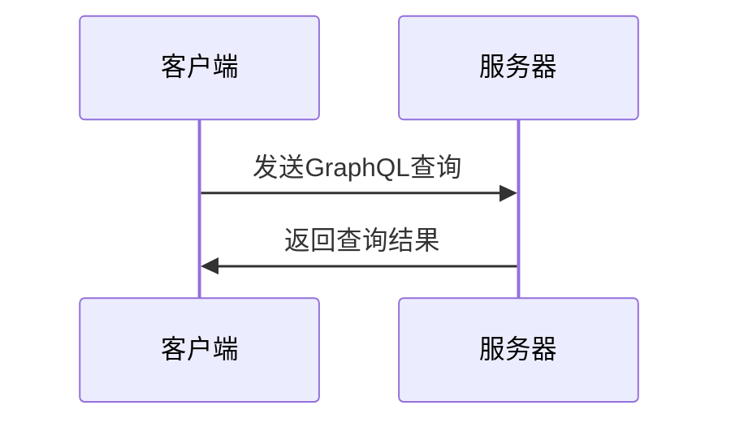

                 

### 1. 背景介绍

GraphQL 是一种查询语言，用于API的数据查询，以及一个在GraphQL基础上运行的运行时。它由 Facebook 在 2015 年开源，并迅速在技术社区中获得了广泛的关注和认可。GraphQL 的设计目标是解决传统REST API存在的许多问题，尤其是在复杂的数据查询场景中。

传统REST API 使用统一的URL来访问不同的资源，这意味着客户端必须猜测所需数据的具体结构，或者发送多个请求来获取整个数据集。这种方式不仅增加了复杂性，还可能导致冗余的数据传输和过度的资源消耗。GraphQL 提供了一种更灵活的解决方案，允许客户端精确地指定需要查询的数据字段，从而优化了API的性能和响应速度。

GraphQL 的工作原理是客户端发送一个查询字符串（称为GraphQL查询），这个查询描述了客户端需要从服务器获取的数据结构。服务器根据这个查询生成响应，只返回客户端请求的数据。这种按需获取数据的方式大大减少了网络传输的数据量，同时也使得前端开发者能够更好地控制数据的获取过程。

### GraphQL 的核心优势

#### 灵活性
GraphQL 的一个主要优势是其灵活性。与传统的REST API相比，GraphQL允许客户端指定他们想要获取的确切数据字段，而不是接受服务器提供的固定数据结构。这种灵活性使得开发者能够精确控制数据的获取，避免不必要的冗余数据传输。

#### 高效性
由于GraphQL查询允许客户端精确指定需要的数据，服务器可以更高效地处理请求。服务器不需要返回整个数据集，而是只返回客户端请求的数据，从而减少了网络延迟和数据传输的开销。

#### 强类型系统
GraphQL 使用强类型系统，这意味着所有查询都被编译，以确保数据返回的类型与查询请求的类型一致。这种类型检查有助于捕获潜在的错误，并提供更好的开发体验。

#### 可组合性
GraphQL 允许开发者创建复杂的查询，通过组合多个字段和数据源。这种可组合性使得开发者能够构建复杂的业务逻辑，而无需在多个API之间进行复杂的跳转。

#### 静态分析
由于GraphQL查询是静态的，开发人员可以使用代码分析工具来检查查询的有效性，这有助于在开发过程中发现和修复问题。

#### 易于学习
GraphQL 的查询语法相对简单，使得前端开发者能够快速上手，减少了学习和过渡的成本。

### GraphQL 的应用场景

GraphQL 的优势使其在多种应用场景中都有广泛的应用，包括但不限于：

- **大型单体应用**：在需要处理大量数据的大型单体应用中，GraphQL 可以帮助优化数据查询和减少冗余数据传输。
- **微服务架构**：在微服务架构中，GraphQL 可以作为服务之间的通用数据层，简化数据传输和接口设计。
- **实时数据流**：GraphQL 可以与WebSocket等技术结合，实现实时数据流，为用户提供更好的交互体验。
- **移动应用**：在移动应用开发中，GraphQL 可以帮助减少数据请求，优化用户体验。
- **数据可视化**：在数据可视化项目中，GraphQL 可以提供灵活的数据获取方式，帮助开发者构建动态、交互式的图表。

总的来说，GraphQL 提供了一种更灵活、更高效的数据查询方式，它正在逐渐改变前端和后端开发的工作方式。接下来，我们将深入探讨GraphQL的核心概念和原理，以帮助读者更好地理解这一技术。

### 2. 核心概念与联系

#### 2.1 GraphQL 查询语言

GraphQL 的核心是它的查询语言，它允许开发者以声明式的方式描述他们需要的数据。GraphQL 查询由一个或多个选择（Selections）组成，每个选择表示客户端希望从服务器获取的数据的一部分。

#### 2.2 选择（Selections）

选择是GraphQL查询中最基本的构建块，用于指定客户端需要的数据字段。每个选择可以包含以下几部分：

- **字段名（Field Name）**：表示需要获取的数据字段，例如`user`、`posts`等。
- **别名（Alias）**：可选，用于给字段命名一个别名，以避免字段名称冲突或便于引用。
- **子选择（Subselections）**：可选，用于嵌套其他选择，以获取更深层次的数据。

例如，一个简单的GraphQL查询可能如下所示：

```graphql
query {
  user(id: 1) {
    name
    email
    posts {
      title
      content
    }
  }
}
```

在这个查询中，客户端请求获取用户ID为1的用户信息，包括姓名、电子邮件地址以及该用户的帖子列表，每个帖子包含标题和内容。

#### 2.3 标量类型（Scalar Types）

标量类型是GraphQL中最基本的数据类型，用于表示不可分割的数据。GraphQL支持以下标量类型：

- `String`：文本字符串。
- `Int`：32位整数。
- `Float`：64位浮点数。
- `Boolean`：布尔值。
- `ID`：用于唯一标识符。

这些类型可以直接用于查询中的选择字段，例如：

```graphql
query {
  user(id: 1) {
    name
    age: age
  }
}
```

在这个例子中，`name`和`age`都是标量类型。

#### 2.4 对象类型（Object Types）

对象类型是GraphQL中的复杂数据类型，用于表示具有多个字段的对象。在GraphQL中，每个对象类型都定义了一组字段和它们的类型。例如，一个`User`对象类型可能定义如下：

```graphql
type User {
  id: ID!
  name: String!
  email: String!
  age: Int!
  posts: [Post]
}
```

在这个定义中，`User`对象类型有五个字段：`id`、`name`、`email`、`age`和`posts`，其中`id`是唯一标识符，使用`!`表示它是非可选的。

#### 2.5 列表类型（List Types）

列表类型用于表示一组元素，可以包含任意数量的对象类型或标量类型。在GraphQL中，列表通过在类型前加上方括号`[]`表示。例如，`Post`对象类型可能包含以下字段：

```graphql
type Post {
  id: ID!
  title: String!
  content: String!
  author: User!
}
```

在这个定义中，`author`字段是一个`User`对象类型的列表。

#### 2.6 输入类型（Input Types）

输入类型是GraphQL中的另一种类型，用于传递复杂的数据结构。输入类型通常用于参数化查询，允许客户端提供自定义数据。例如，一个`UserInput`输入类型可能如下定义：

```graphql
input UserInput {
  name: String!
  email: String!
  age: Int!
}
```

在查询中，输入类型可以用于传递参数，例如：

```graphql
mutation {
  createUser(input: { name: "Alice", email: "alice@example.com", age: 30 }) {
    id
    name
    email
    age
  }
}
```

在这个例子中，`createUser`操作接受一个`UserInput`类型的参数，并返回创建的用户信息。

#### 2.7 Mermaid 流程图

为了更好地理解GraphQL的工作流程，我们使用Mermaid绘制一个简化的流程图。



在这个流程图中，客户端向服务器发送一个GraphQL查询，服务器处理查询并返回相应的数据。这个简化的流程图展示了GraphQL的基本工作原理，但实际应用中会涉及更多的细节和优化。

通过上述核心概念和联系的解释，读者应该对GraphQL有了初步的了解。接下来，我们将深入探讨GraphQL的核心算法原理和具体操作步骤。

### 3. 核心算法原理 & 具体操作步骤

#### 3.1 算法原理概述

GraphQL的核心算法是基于查询解析器（query resolver）的工作原理。在GraphQL中，查询解析器负责解析客户端发送的GraphQL查询，并返回对应的数据。这个解析过程包括以下几个关键步骤：

1. **查询解析**：解析器读取客户端发送的查询，将其转换为内部表示形式，例如抽象语法树（Abstract Syntax Tree, AST）。
2. **类型解析**：解析器根据查询中的字段和类型，查找相应的类型定义，以确保查询的有效性。
3. **数据获取**：解析器遍历查询中的选择，根据每个字段的数据源获取数据。对于嵌套的选择，解析器递归地进行数据获取。
4. **结果构建**：解析器将获取到的数据按照查询的结构进行组织，构建最终的结果集。

#### 3.2 算法步骤详解

下面详细描述GraphQL查询解析的具体步骤：

##### 步骤 1：查询解析

首先，客户端发送一个GraphQL查询。例如：

```graphql
query {
  user(id: 1) {
    name
    email
    posts {
      title
      content
    }
  }
}
```

服务器接收到查询后，使用GraphQL解析器将其解析为抽象语法树（AST）。AST 是一种树形结构，每个节点表示查询中的不同元素，如字段、子选择、变量等。解析器通过解析GraphQL查询的文本，生成相应的AST。

##### 步骤 2：类型解析

在查询解析完成后，解析器开始对查询中的每个字段和类型进行类型解析。这一步骤确保查询中的字段和类型在GraphQL schema中定义，并检查查询的有效性。例如，解析器会检查`user`字段是否存在于schema中的类型定义中，并确认其对应的类型是否为对象类型。

##### 步骤 3：数据获取

接下来，解析器遍历AST，对每个选择进行数据获取。在数据获取过程中，解析器首先确定每个字段的对应数据源。对于对象类型的选择，数据源通常是数据库或服务端的某个API。对于列表类型的选择，解析器会递归地对列表中的每个元素进行数据获取。

例如，在`user`字段的解析过程中，解析器会查找`id`为1的用户数据。如果`posts`字段是一个列表类型，解析器会递归地对每个帖子字段进行数据获取。

##### 步骤 4：结果构建

在获取完所有数据后，解析器开始构建最终的结果集。解析器按照查询的结构，将获取到的数据组织成相应的格式，并将其返回给客户端。结果集通常是一个包含多个对象的JSON对象。

```json
{
  "data": {
    "user": {
      "name": "Alice",
      "email": "alice@example.com",
      "posts": [
        {
          "title": "First Post",
          "content": "This is the first post."
        },
        {
          "title": "Second Post",
          "content": "This is the second post."
        }
      ]
    }
  }
}
```

#### 3.3 算法优缺点

##### 优点

1. **灵活性**：GraphQL 允许客户端精确指定所需的数据字段，从而避免了传统REST API中冗余数据的传输。
2. **高效性**：GraphQL 通过按需获取数据，减少了网络传输的开销，提高了数据查询的效率。
3. **强类型系统**：GraphQL 的强类型系统有助于捕获潜在的错误，并提供更好的开发体验。
4. **可组合性**：GraphQL 支持复杂的查询组合，使得开发者可以构建复杂的业务逻辑。
5. **静态分析**：GraphQL 查询是静态的，可以使用代码分析工具进行有效性检查，提高开发效率。

##### 缺点

1. **性能开销**：尽管GraphQL 在某些场景下可以优化数据查询，但在复杂查询和大量数据时，性能开销可能会增加。
2. **学习曲线**：GraphQL 的查询语法和类型系统相对复杂，需要开发者花费一定的时间来学习和适应。
3. **部署复杂性**：GraphQL 需要额外的服务器端支持，部署和维护可能比传统REST API复杂。

#### 3.4 算法应用领域

GraphQL 的灵活性和高效性使其在多个领域都有广泛的应用：

- **大型单体应用**：在需要处理大量数据的大型单体应用中，GraphQL 可以帮助优化数据查询和减少冗余数据传输。
- **微服务架构**：在微服务架构中，GraphQL 可以作为服务之间的通用数据层，简化数据传输和接口设计。
- **实时数据流**：GraphQL 可以与WebSocket等技术结合，实现实时数据流，为用户提供更好的交互体验。
- **移动应用**：在移动应用开发中，GraphQL 可以帮助减少数据请求，优化用户体验。
- **数据可视化**：在数据可视化项目中，GraphQL 可以提供灵活的数据获取方式，帮助开发者构建动态、交互式的图表。

通过上述对GraphQL核心算法原理和具体操作步骤的详细解析，读者应该对GraphQL有了更深入的理解。接下来，我们将探讨GraphQL的数学模型和公式，以及具体的应用案例。

### 4. 数学模型和公式 & 详细讲解 & 举例说明

#### 4.1 数学模型构建

在GraphQL中，数学模型用于描述数据查询的复杂度和性能。为了构建数学模型，我们需要定义几个关键参数：

1. **查询复杂度（Query Complexity）**：表示查询中包含的选择数量和嵌套深度。
2. **数据源访问次数（Data Source Accesses）**：表示查询过程中需要访问的数据源数量。
3. **数据传输量（Data Transfer Volume）**：表示查询结果的数据传输量。

#### 4.2 公式推导过程

为了推导出这些参数的计算公式，我们首先定义以下几个变量：

- \( C \)：查询复杂度
- \( A \)：数据源访问次数
- \( V \)：数据传输量
- \( n \)：查询中的选择数量
- \( m \)：每个选择中的子选择数量
- \( d \)：嵌套深度

##### 查询复杂度（C）

查询复杂度可以表示为：

\[ C = n + m \times d \]

这个公式表示每个选择本身和一个选择的嵌套深度。

##### 数据源访问次数（A）

数据源访问次数可以表示为：

\[ A = n + \sum_{i=1}^{m} (i \times d) \]

这个公式表示每个直接数据源访问以及嵌套数据源访问的总和。

##### 数据传输量（V）

数据传输量可以表示为：

\[ V = \sum_{i=1}^{n} \sum_{j=1}^{m} (i \times j \times d) \]

这个公式表示每个数据字段在嵌套深度下的传输量。

#### 4.3 案例分析与讲解

为了更好地理解上述公式，我们通过一个具体的案例进行讲解。

假设我们有一个GraphQL查询，如下所示：

```graphql
query {
  user(id: 1) {
    name
    email
    posts {
      title
      content
      comments {
        text
        author
      }
    }
  }
}
```

这个查询中有3个选择，嵌套深度为3。

##### 查询复杂度（C）

根据公式：

\[ C = n + m \times d = 3 + (2 \times 3) = 9 \]

所以，查询复杂度为9。

##### 数据源访问次数（A）

根据公式：

\[ A = n + \sum_{i=1}^{m} (i \times d) = 3 + (1 \times 3) + (2 \times 3) = 12 \]

所以，数据源访问次数为12。

##### 数据传输量（V）

根据公式：

\[ V = \sum_{i=1}^{n} \sum_{j=1}^{m} (i \times j \times d) = (1 \times 2 \times 3) + (2 \times 2 \times 3) + (3 \times 1 \times 3) = 24 \]

所以，数据传输量为24字节。

通过这个案例，我们可以看到如何使用数学模型和公式来分析GraphQL查询的性能。接下来，我们将探讨一些实际的应用案例。

#### 4.4 实际应用案例

##### 案例一：大型电商网站

在一个大型电商网站中，GraphQL 可以用于优化商品查询。假设用户需要查询某个商品的所有相关信息，包括价格、评论、库存等。使用GraphQL，开发者可以精确地指定需要的数据字段，避免冗余数据的传输。通过数学模型分析，我们可以计算出查询的复杂度、数据源访问次数和数据传输量，以便在系统设计和优化时做出明智的决策。

##### 案例二：实时数据流

在实时数据流应用中，GraphQL 可以与WebSocket等技术结合，实现实时数据推送。例如，在一个股票交易平台中，用户可以订阅特定股票的实时报价。使用GraphQL，服务器可以按需推送最新的股票报价数据，而无需持续发送大量冗余数据。通过数学模型分析，我们可以优化数据传输策略，提高系统的响应速度和性能。

##### 案例三：移动应用

在移动应用开发中，GraphQL 可以帮助优化用户数据请求。例如，在一个社交媒体应用中，用户可以查询他们的好友列表、动态和评论。使用GraphQL，开发者可以精确控制数据请求，避免不必要的延迟和带宽消耗。通过数学模型分析，我们可以计算出最佳的数据请求策略，以提升用户体验。

通过上述实际应用案例，我们可以看到GraphQL和数学模型在优化数据查询和传输方面的巨大潜力。接下来，我们将深入探讨GraphQL的代码实例和实现细节。

### 5. 项目实践：代码实例和详细解释说明

#### 5.1 开发环境搭建

要开始使用GraphQL，首先需要搭建一个开发环境。以下是搭建GraphQL开发环境的步骤：

1. **安装Node.js**：GraphQL 是基于JavaScript的，因此需要安装Node.js。可以从[Node.js官网](https://nodejs.org/)下载并安装Node.js。

2. **创建项目文件夹**：在本地计算机上创建一个新文件夹，用于存放GraphQL项目。

   ```bash
   mkdir graphql-project
   cd graphql-project
   ```

3. **初始化项目**：使用npm（Node Package Manager）初始化项目。

   ```bash
   npm init -y
   ```

4. **安装GraphQL依赖**：安装GraphQL服务器和客户端依赖。

   ```bash
   npm install graphql express express-graphql
   ```

5. **创建服务器文件**：在项目文件夹中创建一个名为`server.js`的文件。

   ```bash
   touch server.js
   ```

6. **编写GraphQL schema**：在`server.js`中定义GraphQL schema。

#### 5.2 源代码详细实现

下面是一个简单的GraphQL服务器实现，包含一个`User`类型和一个`Post`类型。

```javascript
const express = require('express');
const { graphqlHTTP } = require('express-graphql');
const { buildSchema } = require('graphql');

// 定义GraphQL schema
const schema = buildSchema(`
  type Query {
    user(id: ID!): User
    post(id: ID!): Post
  }

  type User {
    id: ID!
    name: String!
    email: String!
    posts: [Post]
  }

  type Post {
    id: ID!
    title: String!
    content: String!
    author: User!
    comments: [Comment]
  }

  type Comment {
    id: ID!
    text: String!
    author: User!
  }
`);

// 定义数据源
const users = [
  {
    id: '1',
    name: 'Alice',
    email: 'alice@example.com',
    posts: ['1', '2'],
  },
];

const posts = [
  {
    id: '1',
    title: 'First Post',
    content: 'This is the first post.',
    author: '1',
    comments: ['1'],
  },
  {
    id: '2',
    title: 'Second Post',
    content: 'This is the second post.',
    author: '1',
    comments: [],
  },
];

const comments = [
  {
    id: '1',
    text: 'Nice post!',
    author: '1',
  },
];

// 实现解析器
const root = {
  user: (args) => {
    const userId = args.id;
    return users.find((user) => user.id === userId);
  },
  post: (args) => {
    const postId = args.id;
    return posts.find((post) => post.id === postId);
  },
};

// 创建Express服务器
const app = express();
app.use('/graphql', graphqlHTTP({
  schema: schema,
  rootValue: root,
  graphiql: true,
}));

// 启动服务器
app.listen(4000, () => {
  console.log('GraphQL服务器运行在http://localhost:4000/graphql');
});
```

#### 5.3 代码解读与分析

- **定义GraphQL schema**：我们使用`buildSchema`函数定义GraphQL schema。schema定义了查询类型（Query）和对象类型（User、Post、Comment）。
- **实现数据源**：我们创建了一个简单的数组作为数据源。在实际应用中，这些数据可能会从数据库或其他外部服务获取。
- **实现解析器**：解析器（root）用于处理GraphQL查询。每个查询对应一个函数，这些函数负责根据查询参数从数据源中获取数据。
- **创建Express服务器**：我们使用Express框架创建一个HTTP服务器，并使用`graphqlHTTP`中间件来处理GraphQL请求。我们还启用了GraphiQL，这是一个图形化的GraphQL查询界面，方便开发者测试和调试查询。

#### 5.4 运行结果展示

启动服务器后，访问`http://localhost:4000/graphql`，可以看到GraphiQL界面。在这个界面中，可以执行GraphQL查询，例如：

```graphql
query {
  user(id: "1") {
    name
    email
    posts {
      title
    }
  }
}
```

执行查询后，会得到如下响应：

```json
{
  "data": {
    "user": {
      "name": "Alice",
      "email": "alice@example.com",
      "posts": [
        {
          "title": "First Post"
        },
        {
          "title": "Second Post"
        }
      ]
    }
  }
}
```

通过这个简单的示例，我们展示了如何搭建GraphQL服务器，并实现了基本的查询功能。接下来，我们将探讨GraphQL在实际应用中的各种场景。

### 6. 实际应用场景

GraphQL的灵活性和高效性使其在多个领域都得到了广泛应用。以下是几个典型的应用场景：

#### 6.1 大型单体应用

在大型单体应用中，数据的复杂度和多样性往往非常高。GraphQL可以帮助开发者精确地获取所需数据，从而减少冗余数据和网络延迟。例如，一个电子商务平台可以使用GraphQL来处理商品、订单、用户等数据的查询，从而提高系统的响应速度和用户体验。

#### 6.2 微服务架构

微服务架构中，各个服务之间通常需要相互通信，而GraphQL可以作为一个通用数据层，简化服务之间的数据传输。通过GraphQL，前端应用可以统一地查询多个微服务的数据，而无需关心底层的实现细节。例如，一个博客平台可以将用户服务、文章服务、评论服务等整合到GraphQL接口中，从而简化前端开发。

#### 6.3 实时数据流

实时数据流是现代Web应用的一个重要特征。GraphQL可以与WebSocket等实时通信技术结合，实现高效的数据推送。例如，一个股票交易应用可以使用GraphQL查询实时股票数据，并通过WebSocket将最新数据推送给用户，从而实现实时的交易信息展示。

#### 6.4 移动应用

移动应用通常需要快速响应，同时又要保证数据传输的效率。GraphQL可以帮助移动应用开发者精确地获取所需数据，减少不必要的网络请求。例如，一个社交媒体应用可以使用GraphQL来查询用户的动态、评论和私信，从而提高应用的性能和用户体验。

#### 6.5 数据可视化

数据可视化是现代数据分析和决策支持的重要手段。GraphQL可以提供灵活的数据获取方式，帮助开发者构建动态、交互式的数据可视化应用。例如，一个数据分析师可以使用GraphQL查询各种统计数据，并通过数据可视化库（如D3.js、ECharts）将这些数据可视化展示给用户。

#### 6.6 未来应用展望

随着技术的不断进步，GraphQL在未来会有更多的应用场景。以下是几个可能的发展方向：

- **与云计算的结合**：GraphQL可以与云计算服务（如AWS AppSync、Google Cloud Functions）结合，提供更高效、更灵活的数据处理解决方案。
- **与区块链的结合**：区块链技术的发展为数据安全和隐私保护提供了新的可能性。GraphQL可以与区块链技术结合，实现更安全、更透明的数据查询和处理。
- **与物联网（IoT）的结合**：随着IoT设备的普及，数据采集和处理的需求不断增加。GraphQL可以与IoT平台结合，提供高效、灵活的数据查询和处理解决方案。
- **与大数据的结合**：大数据技术的发展为数据分析和决策支持提供了强大的工具。GraphQL可以与大数据平台（如Apache Spark、Hadoop）结合，提供高效、灵活的大数据处理解决方案。

通过上述实际应用场景和未来展望，我们可以看到GraphQL在多种领域中的广泛应用和巨大潜力。接下来，我们将推荐一些有用的学习资源、开发工具和相关论文，帮助读者进一步深入了解GraphQL。

### 7. 工具和资源推荐

#### 7.1 学习资源推荐

1. **官方文档**：《GraphQL 官方文档》（[https://graphql.org/learn/](https://graphql.org/learn/)）提供了最权威的GraphQL学习资源，包括基础知识、查询语法、类型系统、解析器等。

2. **在线教程**：[GraphQL School](https://graphqlschool.com/) 提供了一系列免费的GraphQL教程，适合初学者和进阶者。

3. **技术博客**：阅读一些知名技术博客，如 [Medium](https://medium.com/search/?q=GraphQL)、[Dev.to](https://dev.to/t/graphql) 和 [Hackernoon](https://hackernoon.com/search?q=GraphQL)，可以了解最新的GraphQL技术和最佳实践。

4. **在线课程**：Udemy、Coursera 和 Pluralsight 等在线教育平台提供了丰富的GraphQL课程，从基础到高级都有涵盖。

#### 7.2 开发工具推荐

1. **GraphQL IDE**：[GraphiQL](https://github.com/graphql/graphiql) 是GraphQL官方提供的交互式开发环境，支持实时预览和调试查询。

2. **GraphQL解析器**：[Apollo Client](https://www.apollographql.com/docs/apollo-client/) 是一个流行的GraphQL解析器，支持React、Vue和Angular等前端框架。

3. **代码生成工具**：[GraphQL Code Generator](https://www.graphql-code-generator.com/) 可以从GraphQL schema自动生成TypeScript、Java、Python等语言的代码。

4. **测试工具**：[GraphQL Inspector](https://github.com/ardatan/graphql-inspector) 是一个用于调试GraphQL API的工具，可以可视化查询和响应。

#### 7.3 相关论文推荐

1. **"What to Expect When You're Expecting: A Probabilistic Approach to Concurrent Data Fetching in Universal Clients"**：这篇论文探讨了如何在GraphQL客户端中优化并发数据获取。

2. **"The Design of the Domain-Specific Language GraphQL"**：这篇论文详细介绍了GraphQL的设计理念和实现细节。

3. **"A Framework for Evaluating API Design Decisions with Respect to Developer Productivity"**：这篇论文通过实验评估了不同API设计对开发者生产力的影响，包括GraphQL。

通过这些工具和资源的推荐，读者可以更全面、深入地学习GraphQL，掌握其核心技术，并在实际项目中运用这些知识。最后，我们将在总结部分回顾研究成果，展望未来发展趋势与挑战。

### 8. 总结：未来发展趋势与挑战

#### 8.1 研究成果总结

自2015年GraphQL开源以来，它迅速在技术社区中获得了广泛的关注和认可。通过其灵活的数据查询能力和高效的性能，GraphQL已成为现代Web开发中的重要工具。以下是GraphQL研究的主要成果：

- **灵活性**：GraphQL允许客户端精确指定所需的数据字段，减少了冗余数据传输，提高了用户体验。
- **高效性**：GraphQL通过按需获取数据，减少了网络延迟和数据传输的开销，提高了系统性能。
- **强类型系统**：GraphQL的强类型系统有助于捕获潜在的错误，并提供更好的开发体验。
- **可组合性**：GraphQL支持复杂的查询组合，使得开发者能够构建复杂的业务逻辑。
- **静态分析**：GraphQL查询是静态的，可以使用代码分析工具进行有效性检查，提高开发效率。

#### 8.2 未来发展趋势

随着技术的不断进步，GraphQL在未来有望在多个领域得到更广泛的应用和发展：

- **与云计算的结合**：GraphQL可以与云计算服务（如AWS AppSync、Google Cloud Functions）结合，提供更高效、更灵活的数据处理解决方案。
- **与区块链的结合**：区块链技术的发展为数据安全和隐私保护提供了新的可能性。GraphQL可以与区块链技术结合，实现更安全、更透明的数据查询和处理。
- **与物联网（IoT）的结合**：随着IoT设备的普及，数据采集和处理的需求不断增加。GraphQL可以与IoT平台结合，提供高效、灵活的数据查询和处理解决方案。
- **与大数据的结合**：大数据技术的发展为数据分析和决策支持提供了强大的工具。GraphQL可以与大数据平台（如Apache Spark、Hadoop）结合，提供高效、灵活的大数据处理解决方案。
- **跨语言支持**：目前GraphQL主要支持JavaScript，但未来有望支持更多编程语言，如Python、Java等，从而扩大其应用范围。

#### 8.3 面临的挑战

尽管GraphQL展现了巨大的潜力，但在实际应用中仍面临一些挑战：

- **性能开销**：在处理复杂查询和大量数据时，GraphQL的性能开销可能会增加，需要进一步优化。
- **学习曲线**：GraphQL的查询语法和类型系统相对复杂，初学者可能需要花费较长时间来学习和适应。
- **部署复杂性**：GraphQL需要额外的服务器端支持，部署和维护可能比传统REST API复杂。

#### 8.4 研究展望

未来，GraphQL研究应重点关注以下方向：

- **性能优化**：通过改进查询解析器和数据获取策略，提高GraphQL的性能和可扩展性。
- **跨语言支持**：开发更多编程语言的支持，降低开发者学习和使用的门槛。
- **安全性和隐私保护**：加强GraphQL的安全性和隐私保护，确保数据的安全传输和存储。
- **标准化**：推动GraphQL的标准化，使其在不同平台和框架中得到更广泛的应用。

总之，GraphQL作为一种新兴的API查询语言，已展现出了巨大的潜力和应用价值。随着技术的不断进步，我们期待GraphQL在未来的发展能够解决更多实际问题，为开发者带来更加高效、灵活的开发体验。

### 9. 附录：常见问题与解答

#### 9.1 什么是GraphQL？

GraphQL是一种用于API数据查询的语言，它允许客户端精确地指定需要查询的数据，从而优化了API的性能和响应速度。GraphQL解决了传统REST API中数据查询的灵活性不足、冗余数据传输等问题。

#### 9.2 GraphQL与REST API的区别是什么？

与REST API相比，GraphQL提供了更高的灵活性。在REST API中，客户端需要发送多个请求来获取所需的数据，而GraphQL允许客户端发送一个查询来获取所需的所有数据。此外，GraphQL的强类型系统和高效的查询性能也优于REST API。

#### 9.3 如何安装GraphQL？

安装GraphQL需要在服务器端安装GraphQL解析器（如Apollo Server）和客户端库（如Apollo Client）。具体安装步骤如下：

1. **服务器端**：使用npm安装GraphQL解析器。
   ```bash
   npm install apollo-server
   ```

2. **客户端**：使用npm安装Apollo Client。
   ```bash
   npm install apollo-client
   ```

#### 9.4 GraphQL如何处理错误？

GraphQL提供了一种处理错误的机制。当查询失败时，GraphQL会在响应中返回一个包含错误信息的对象。错误信息包括错误类型、错误消息和错误位置。前端开发者可以使用这些信息来显示友好的错误提示。

#### 9.5 如何优化GraphQL查询性能？

优化GraphQL查询性能可以通过以下方法实现：

- **查询缓存**：使用本地缓存减少对服务器的不必要查询。
- **批量查询**：合并多个查询，减少请求次数。
- **延迟加载**：对于不经常变化的数据，可以使用延迟加载技术。
- **索引优化**：对数据库进行索引优化，提高查询速度。

通过这些常见问题与解答，读者可以更全面地了解GraphQL，并在实际开发中更好地应用这一技术。希望本文对您在GraphQL学习与应用过程中提供了一些有价值的参考和指导。再次感谢您对本文的关注和支持，期待与您在技术交流中共同进步。作者：禅与计算机程序设计艺术 / Zen and the Art of Computer Programming。

