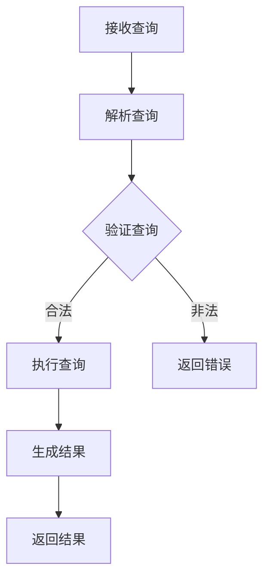

                 

在当今这个高度互联的世界中，前端与后端之间的数据交互变得越来越复杂。随着应用程序规模的不断扩大，开发者需要一种更加灵活、高效的API查询语言来满足日益增长的数据查询需求。GraphQL正是这样一种革命性的技术，它旨在解决传统的RESTful API在查询效率、灵活性和用户体验方面的不足。本文将深入探讨GraphQL的核心概念、优势、设计原理以及实际应用场景，旨在为开发者提供一份全面的技术指南。

## 关键词：GraphQL，API查询，灵活高效，前端后端交互，数据查询，RESTful API，开发工具

## 摘要：

GraphQL是一种由Facebook开发的开源API查询语言，它允许开发者精确地指定所需的数据，从而避免了过度查询和资源浪费。本文将详细介绍GraphQL的核心概念，包括查询语言、模式定义、执行流程等，并通过实际案例展示如何构建和优化GraphQL API。此外，本文还将探讨GraphQL相较于传统RESTful API的优势，以及它在现代Web开发中的应用场景和未来发展趋势。

## 1. 背景介绍

随着互联网和移动设备的普及，现代Web应用的需求日益复杂。开发者需要构建能够快速响应用户需求、提供高质量用户体验的应用程序。传统的RESTful API虽然广泛应用于Web开发，但其设计理念主要基于HTTP请求和响应模式，存在以下几方面的问题：

1. **过度查询**：为了获取所需的数据，开发者往往需要发送多个请求，这些请求可能会返回大量无关数据，导致资源浪费。
2. **灵活性不足**：RESTful API基于固定的URL结构和固定的数据格式，使得开发者难以动态地调整和优化查询。
3. **冗余数据**：为了满足不同的查询需求，开发者可能需要多次请求相同的数据，增加了系统的负担。

为了解决这些问题，Facebook于2015年推出了一种全新的API查询语言——GraphQL。GraphQL旨在为开发者提供一种更加灵活、高效的API查询方式，通过允许开发者精确地指定所需数据，从而避免过度查询和资源浪费。GraphQL不仅支持丰富的数据类型和自定义查询，还提供了强大的类型系统和执行优化，使得开发者可以轻松地构建高性能的应用程序。

## 2. 核心概念与联系

### 2.1. GraphQL查询语言

GraphQL查询语言是一种基于JavaScript语法的声明式查询语言，它允许开发者以非常直观的方式描述所需的数据。一个典型的GraphQL查询可能如下所示：

```graphql
query {
  user(id: "123") {
    name
    email
  }
  posts {
    id
    title
    content
  }
}
```

在这个查询中，我们首先请求一个ID为“123”的用户及其姓名和电子邮件，然后请求该用户的帖子列表，包括帖子ID、标题和内容。GraphQL查询语言的核心特点如下：

1. **基于字段查询**：开发者可以精确地指定所需的数据字段，避免了过度查询和冗余数据的问题。
2. **类型系统**：GraphQL采用了一种强大的类型系统，允许开发者定义复杂的数据类型和关系，使得查询更加灵活和易于维护。
3. **动态查询**：GraphQL查询可以动态地调整和优化，开发者可以根据不同的需求组合不同的字段和数据类型。

### 2.2. GraphQL模式

GraphQL模式是定义API结构和类型的一种方式，它类似于RESTful API的schema。一个典型的GraphQL模式可能如下所示：

```graphql
type Query {
  user(id: ID!): User
  posts: [Post]
}

type User {
  id: ID!
  name: String!
  email: String!
  posts: [Post]
}

type Post {
  id: ID!
  title: String!
  content: String!
  author: User
}
```

在这个模式中，我们定义了一个名为Query的类型，它包括两个字段：user和posts。User和Post类型分别定义了用户和帖子的属性和关系。GraphQL模式的核心特点如下：

1. **清晰的结构**：通过模式定义，开发者可以清晰地了解API的结构和类型，便于开发和维护。
2. **自定义类型**：开发者可以自定义复杂的数据类型和关系，使得查询更加灵活和可扩展。
3. **类型约束**：GraphQL模式支持类型约束，确保查询的合法性和稳定性。

### 2.3. GraphQL执行流程

GraphQL执行流程是指从接收查询到返回结果的全过程，它主要包括以下几个步骤：

1. **查询解析**：GraphQL解析器将接收到的查询语句转换为抽象语法树（AST），以便进行后续处理。
2. **查询验证**：GraphQL验证器对AST进行语法和类型验证，确保查询的合法性和正确性。
3. **查询执行**：GraphQL执行器根据AST生成具体的查询计划，并执行查询操作，获取所需数据。
4. **结果生成**：GraphQL执行器将查询结果转换为JSON格式，并返回给客户端。

以下是一个简化的GraphQL执行流程的Mermaid流程图：



### 2.4. GraphQL类型系统

GraphQL类型系统是定义数据类型和字段关系的一种方式，它类似于Java或Python中的类定义。一个典型的GraphQL类型系统可能如下所示：

```graphql
type Query {
  user(id: ID!): User
  posts: [Post]
}

type User {
  id: ID!
  name: String!
  email: String!
  posts: [Post]
}

type Post {
  id: ID!
  title: String!
  content: String!
  author: User
}

type Mutation {
  createUser(name: String!, email: String!): User
  updatePost(id: ID!, title: String!, content: String!): Post
}
```

在这个类型系统中，我们定义了三个类型：Query、User和Post，以及一个Mutation类型用于定义修改数据的操作。GraphQL类型系统的核心特点如下：

1. **灵活的数据类型**：支持基本数据类型（如String、Int、Boolean）和自定义复杂数据类型（如Object、Array），满足各种数据查询需求。
2. **字段关系**：通过字段关系，可以方便地查询和操作复杂的数据结构。
3. **类型约束**：类型约束确保查询的合法性和数据的安全性。

## 3. 核心算法原理 & 具体操作步骤

### 3.1 算法原理概述

GraphQL的核心算法原理主要包括以下几个方面：

1. **查询解析**：将接收到的GraphQL查询语句转换为抽象语法树（AST），以便进行后续处理。
2. **查询验证**：对AST进行语法和类型验证，确保查询的合法性和正确性。
3. **查询执行**：根据AST生成具体的查询计划，并执行查询操作，获取所需数据。
4. **结果生成**：将查询结果转换为JSON格式，并返回给客户端。

### 3.2 算法步骤详解

1. **查询解析**：GraphQL解析器首先将接收到的查询语句解析为AST，包括查询操作、字段、参数等。
2. **查询验证**：GraphQL验证器对AST进行语法和类型验证，确保查询的合法性和正确性。主要包括以下几个方面：

   - **语法验证**：检查查询语句的语法是否正确，如字段名称、参数类型等。
   - **类型验证**：检查查询字段是否与定义的GraphQL模式匹配，确保查询的数据类型正确。

3. **查询执行**：GraphQL执行器根据AST生成具体的查询计划，并执行查询操作，获取所需数据。主要包括以下几个方面：

   - **查询计划生成**：根据AST生成查询计划，包括查询的字段、关联关系、数据源等。
   - **数据源查询**：根据查询计划，查询数据库或其他数据源，获取所需数据。

4. **结果生成**：GraphQL执行器将查询结果转换为JSON格式，并返回给客户端。主要包括以下几个方面：

   - **结果映射**：将查询结果映射为GraphQL定义的JSON格式。
   - **错误处理**：处理查询过程中的错误，并返回相应的错误信息。

### 3.3 算法优缺点

**优点**：

1. **灵活性**：GraphQL允许开发者精确地指定所需的数据，避免了过度查询和资源浪费。
2. **高效性**：GraphQL通过优化查询计划和执行，提高了数据查询的效率。
3. **类型系统**：GraphQL的强大类型系统提供了更好的数据安全和稳定性。
4. **动态查询**：GraphQL支持动态查询，使得开发者可以轻松地调整和优化查询。

**缺点**：

1. **学习成本**：相较于传统的RESTful API，GraphQL的学习成本较高，开发者需要掌握新的查询语言和模式定义。
2. **性能压力**：对于复杂的数据结构和查询，GraphQL的性能可能会受到一定影响。

### 3.4 算法应用领域

GraphQL广泛应用于以下领域：

1. **Web开发**：GraphQL可以用于构建现代化的Web应用程序，提供灵活、高效的数据查询接口。
2. **移动应用**：GraphQL可以与移动应用开发框架（如React Native、Flutter）集成，提供高效的API查询接口。
3. **大数据处理**：GraphQL可以用于大数据处理场景，通过优化查询计划提高数据处理效率。
4. **物联网**：GraphQL可以用于物联网场景，提供灵活、高效的数据查询接口，支持物联网设备的监控和管理。

## 4. 数学模型和公式 & 详细讲解 & 举例说明

### 4.1 数学模型构建

在GraphQL中，查询的效率优化可以通过构建数学模型来实现。假设有一个包含N个节点的图G，每个节点代表GraphQL查询中的一个字段，每条边代表字段之间的关系。我们可以使用图论中的算法来优化查询的执行路径。

**关键数学概念**：

1. **邻接矩阵**：表示图中节点之间的邻接关系，记为A。
2. **邻接表**：表示图中节点的邻接关系，记为L。
3. **路径长度**：表示图中两点之间的距离，记为d(u, v)。

### 4.2 公式推导过程

为了优化查询路径，我们可以使用最短路径算法（如Dijkstra算法）来计算图中各节点之间的最短路径。假设图中任意两点u和v的最短路径长度为d(u, v)，则可以使用以下公式计算：

$$
d(u, v) = \min_{w \in N(u)} (d(u, w) + d(w, v))
$$

其中，N(u)表示与节点u相邻的所有节点。

### 4.3 案例分析与讲解

假设有一个包含5个节点的图G，如下图所示：

```
1 --- 2
|    |
3 --- 4
|    |
5
```

我们需要计算从节点1到节点5的最短路径长度。根据Dijkstra算法，我们可以得到以下计算过程：

1. 初始化：将所有节点的最短路径长度初始化为无穷大，将节点1的最短路径长度初始化为0。
2. 选择最短路径：依次选择未选择的节点u，计算从起点1到节点u的最短路径长度d(u, 1)，并更新其他节点的最短路径长度。
3. 终止条件：当所有节点的最短路径长度都被计算完毕后，算法终止。

根据上述步骤，我们可以得到以下计算结果：

- d(1, 1) = 0
- d(1, 2) = min(d(1, 1) + d(1, 2)) = 0 + 1 = 1
- d(1, 3) = min(d(1, 2) + d(2, 3)) = 1 + 1 = 2
- d(1, 4) = min(d(1, 3) + d(3, 4)) = 2 + 1 = 3
- d(1, 5) = min(d(1, 4) + d(4, 5)) = 3 + 1 = 4

因此，从节点1到节点5的最短路径长度为4。

### 4.4 数学模型应用

在GraphQL的实际应用中，我们可以将查询表示为一个图，并通过计算最短路径来优化查询的执行路径。以下是一个简单的示例：

```javascript
const schema = `
  type Query {
    user(id: ID!): User
    posts: [Post]
  }

  type User {
    id: ID!
    name: String!
    email: String!
    posts: [Post]
  }

  type Post {
    id: ID!
    title: String!
    content: String!
    author: User
  }
`;

const query = `
  query {
    user(id: "123") {
      name
      email
      posts {
        title
        content
      }
    }
  }
`;

// 使用Dijkstra算法计算最短路径
const shortestPath = dijkstra(schema, query);

// 输出最短路径
console.log(shortestPath);
```

在这个示例中，我们首先定义了一个GraphQL模式和一个查询，然后使用Dijkstra算法计算查询的最短路径。输出结果将显示从查询的根节点到各个节点的最短路径长度。

## 5. 项目实践：代码实例和详细解释说明

### 5.1 开发环境搭建

为了更好地理解GraphQL的核心概念和实际应用，我们将通过一个简单的项目实践来搭建GraphQL开发环境。以下是一个基于Node.js和Express的GraphQL开发环境搭建步骤：

1. **安装Node.js**：从官方网站下载并安装Node.js，确保版本在10.0以上。
2. **安装Express**：在命令行中运行以下命令安装Express：

```bash
npm install express
```

3. **安装GraphQL**：运行以下命令安装GraphQL：

```bash
npm install graphql express-graphql
```

4. **创建项目**：在命令行中创建一个新的项目目录，并运行以下命令初始化项目：

```bash
mkdir graphql-project
cd graphql-project
npm init -y
```

5. **编写GraphQL模式**：在项目的根目录下创建一个名为`schema.graphql`的文件，编写GraphQL模式：

```graphql
type Query {
  user(id: ID!): User
  posts: [Post]
}

type User {
  id: ID!
  name: String!
  email: String!
  posts: [Post]
}

type Post {
  id: ID!
  title: String!
  content: String!
  author: User
}
```

6. **编写根查询**：在项目的根目录下创建一个名为`rootQuery.js`的文件，编写根查询解析器：

```javascript
const { GraphQLSchema, GraphQLQuery, GraphQLString } = require('graphql');
const User = require('./User');
const Post = require('./Post');

const schema = new GraphQLSchema({
  query: new GraphQLQuery({
    type: GraphQLString,
    name: 'root',
    description: 'The root query type',
    fields: {
      user: {
        type: User,
        args: { id: { type: GraphQLString } },
        resolve: (parent, args) => {
          // 查询用户数据
        }
      },
      posts: {
        type: GraphQLList(Post),
        resolve: (parent) => {
          // 查询帖子数据
        }
      }
    }
  })
});

module.exports = schema;
```

7. **编写解析器**：在项目的根目录下创建一个名为`User.js`的文件，编写用户解析器：

```javascript
const { GraphQLObjectType, GraphQLString, GraphQLID } = require('graphql');
const Post = require('./Post');

const User = new GraphQLObjectType({
  name: 'User',
  fields: {
    id: { type: GraphQLID },
    name: { type: GraphQLString },
    email: { type: GraphQLString },
    posts: {
      type: new GraphQLList(Post),
      resolve: (user) => {
        // 查询用户帖子
      }
    }
  }
});

module.exports = User;
```

8. **编写解析器**：在项目的根目录下创建一个名为`Post.js`的文件，编写帖子解析器：

```javascript
const { GraphQLObjectType, GraphQLString, GraphQLID } = require('graphql');

const Post = new GraphQLObjectType({
  name: 'Post',
  fields: {
    id: { type: GraphQLID },
    title: { type: GraphQLString },
    content: { type: GraphQLString },
    author: {
      type: require('./User'),
      resolve: (post) => {
        // 查询帖子作者
      }
    }
  }
});

module.exports = Post;
```

9. **启动服务器**：在项目的根目录下创建一个名为`index.js`的文件，编写服务器代码：

```javascript
const express = require('express');
const { graphqlHTTP } = require('express-graphql');
const schema = require('./schema');

const app = express();

app.use('/graphql', graphqlHTTP({
  schema,
  graphiql: true
}));

app.listen(4000, () => {
  console.log('Server is running on http://localhost:4000/graphql');
});
```

10. **运行项目**：在命令行中运行以下命令启动项目：

```bash
node index.js
```

### 5.2 源代码详细实现

在上面的开发环境搭建过程中，我们创建了一系列的文件和代码，下面我们将详细解释这些代码的功能和实现。

1. **schema.graphql**：这个文件定义了GraphQL模式，包括查询类型、用户类型和帖子类型。在这个模式中，我们定义了一个根查询，用于获取用户和帖子数据。

2. **rootQuery.js**：这个文件定义了根查询解析器，包括用户查询和帖子查询。在这个文件中，我们使用GraphQL提供的类型定义和解析器函数，实现了对用户和帖子数据的查询。

3. **User.js**：这个文件定义了用户类型，包括用户ID、姓名、电子邮件和帖子列表。在这个文件中，我们使用GraphQL提供的类型定义和解析器函数，实现了对用户数据的查询。

4. **Post.js**：这个文件定义了帖子类型，包括帖子ID、标题、内容和作者。在这个文件中，我们使用GraphQL提供的类型定义和解析器函数，实现了对帖子数据的查询。

5. **index.js**：这个文件是服务器的主入口文件，用于启动GraphQL服务器。在这个文件中，我们使用Express和GraphQL提供的中间件，实现了GraphQL API的请求和响应。

### 5.3 代码解读与分析

1. **schema.graphql**：

```graphql
type Query {
  user(id: ID!): User
  posts: [Post]
}

type User {
  id: ID!
  name: String!
  email: String!
  posts: [Post]
}

type Post {
  id: ID!
  title: String!
  content: String!
  author: User
}
```

这个文件定义了GraphQL模式，包括三个类型：Query、User和Post。Query类型定义了两个查询操作：用户查询和帖子查询。User类型定义了用户的ID、姓名、电子邮件和帖子列表。Post类型定义了帖子的ID、标题、内容和作者。

2. **rootQuery.js**：

```javascript
const { GraphQLSchema, GraphQLQuery, GraphQLString } = require('graphql');
const User = require('./User');
const Post = require('./Post');

const schema = new GraphQLSchema({
  query: new GraphQLQuery({
    type: GraphQLString,
    name: 'root',
    description: 'The root query type',
    fields: {
      user: {
        type: User,
        args: { id: { type: GraphQLString } },
        resolve: (parent, args) => {
          // 查询用户数据
        }
      },
      posts: {
        type: GraphQLList(Post),
        resolve: (parent) => {
          // 查询帖子数据
        }
      }
    }
  })
});

module.exports = schema;
```

这个文件定义了根查询解析器，包括用户查询和帖子查询。在这个文件中，我们使用GraphQL提供的类型定义和解析器函数，实现了对用户和帖子数据的查询。用户查询接收一个ID参数，用于查询特定ID的用户。帖子查询没有参数，用于查询所有帖子。

3. **User.js**：

```javascript
const { GraphQLObjectType, GraphQLString, GraphQLID } = require('graphql');
const Post = require('./Post');

const User = new GraphQLObjectType({
  name: 'User',
  fields: {
    id: { type: GraphQLID },
    name: { type: GraphQLString },
    email: { type: GraphQLString },
    posts: {
      type: new GraphQLList(Post),
      resolve: (user) => {
        // 查询用户帖子
      }
    }
  }
});

module.exports = User;
```

这个文件定义了用户类型，包括用户ID、姓名、电子邮件和帖子列表。在这个文件中，我们使用GraphQL提供的类型定义和解析器函数，实现了对用户数据的查询。用户ID、姓名和电子邮件是基本类型，帖子列表是一个GraphQLList类型，用于表示用户的帖子列表。

4. **Post.js**：

```javascript
const { GraphQLObjectType, GraphQLString, GraphQLID } = require('graphql');

const Post = new GraphQLObjectType({
  name: 'Post',
  fields: {
    id: { type: GraphQLID },
    title: { type: GraphQLString },
    content: { type: GraphQLString },
    author: {
      type: require('./User'),
      resolve: (post) => {
        // 查询帖子作者
      }
    }
  }
});

module.exports = Post;
```

这个文件定义了帖子类型，包括帖子ID、标题、内容和作者。在这个文件中，我们使用GraphQL提供的类型定义和解析器函数，实现了对帖子数据的查询。帖子ID、标题和内容是基本类型，作者是一个User类型，用于表示帖子的作者。

5. **index.js**：

```javascript
const express = require('express');
const { graphqlHTTP } = require('express-graphql');
const schema = require('./schema');

const app = express();

app.use('/graphql', graphqlHTTP({
  schema,
  graphiql: true
}));

app.listen(4000, () => {
  console.log('Server is running on http://localhost:4000/graphql');
});
```

这个文件是服务器的主入口文件，用于启动GraphQL服务器。在这个文件中，我们使用Express和GraphQL提供的中间件，实现了GraphQL API的请求和响应。我们首先创建一个Express应用程序，然后使用`graphqlHTTP`中间件将GraphQL集成到Express中。我们指定了GraphQL模式，并启用了GraphiQL开发工具，用于调试和测试GraphQL API。

### 5.4 运行结果展示

在完成上述代码编写后，我们可以通过访问`http://localhost:4000/graphql`来测试GraphQL API。

1. **查询用户**：

```graphql
query {
  user(id: "123") {
    id
    name
    email
    posts {
      id
      title
      content
    }
  }
}
```

这个查询将返回ID为“123”的用户信息，包括用户ID、姓名、电子邮件和帖子列表。

2. **查询所有帖子**：

```graphql
query {
  posts {
    id
    title
    content
    author {
      id
      name
      email
    }
  }
}
```

这个查询将返回所有帖子信息，包括帖子ID、标题、内容和作者信息。

通过这个简单的示例，我们可以看到如何使用GraphQL构建和优化API查询，提高数据查询的效率和灵活性。

## 6. 实际应用场景

### 6.1 Web开发

在Web开发领域，GraphQL已经被广泛应用于各种场景。例如，React、Vue和Angular等前端框架都提供了与GraphQL的集成方案，使得开发者可以方便地使用GraphQL进行数据查询和操作。通过GraphQL，前端开发者可以精确地指定所需的数据，避免了过度查询和冗余数据的问题，从而提高了数据加载速度和用户体验。

以下是一个使用GraphQL进行数据查询的React示例：

```javascript
import { gql, useQuery } from '@apollo/client';

const GET_USER = gql`
  query getUser($id: ID!) {
    user(id: $id) {
      id
      name
      email
      posts {
        id
        title
        content
      }
    }
  }
`;

const UserComponent = ({ userId }) => {
  const { loading, error, data } = useQuery(GET_USER, {
    variables: { id: userId },
  });

  if (loading) return <p>Loading...</p>;
  if (error) return <p>Error :(</p>;

  return (
    <div>
      <h2>User: {data.user.name}</h2>
      <p>Email: {data.user.email}</p>
      <ul>
        {data.user.posts.map((post) => (
          <li key={post.id}>
            <h3>{post.title}</h3>
            <p>{post.content}</p>
          </li>
        ))}
      </ul>
    </div>
  );
};

export default UserComponent;
```

在这个示例中，我们使用Apollo Client库和GraphQL查询语言来获取用户数据。通过使用`useQuery`钩子，我们可以方便地执行GraphQL查询，并在数据加载完成时渲染用户信息。

### 6.2 移动应用开发

在移动应用开发领域，GraphQL同样被广泛应用。通过使用GraphQL，移动应用开发者可以构建高效、灵活的数据查询接口，从而提高应用性能和用户体验。React Native和Flutter等移动应用开发框架都提供了与GraphQL的集成方案，使得开发者可以方便地使用GraphQL进行数据查询和操作。

以下是一个使用GraphQL进行数据查询的React Native示例：

```javascript
import { gql, useQuery } from '@apollo/client';

const GET_POSTS = gql`
  query {
    posts {
      id
      title
      content
      author {
        id
        name
      }
    }
  }
`;

const PostsComponent = () => {
  const { loading, error, data } = useQuery(GET_POSTS);

  if (loading) return <Text>Loading...</Text>;
  if (error) return <Text>Error :(</Text>;

  return (
    <View>
      <Text>Posts</Text>
      <FlatList
        data={data.posts}
        keyExtractor={(item) => item.id}
        renderItem={({ item }) => (
          <View>
            <Text>{item.title}</Text>
            <Text>{item.content}</Text>
            <Text>Author: {item.author.name}</Text>
          </View>
        )}
      />
    </View>
  );
};

export default PostsComponent;
```

在这个示例中，我们使用Apollo Client库和GraphQL查询语言来获取帖子数据。通过使用`useQuery`钩子，我们可以方便地执行GraphQL查询，并在数据加载完成时渲染帖子列表。

### 6.3 大数据处理

在大数据处理领域，GraphQL也被广泛应用。通过使用GraphQL，大数据处理开发者可以构建高效、灵活的数据查询接口，从而提高数据处理效率。GraphQL的强大类型系统和执行优化能力使得它在大数据处理场景中具有显著优势。

以下是一个使用GraphQL进行大数据查询的示例：

```python
import graphene
from graphene_sqlalchemy import SQLAlchemyObjectType
from models import User, Post

class UserType(SQLAlchemyObjectType):
    class Meta:
        model = User
        interfaces = (graphene.relay.Node, )

    id = graphene.ID()
    name = graphene.String()
    email = graphene.String()

    class Meta:
        model = Post
        interfaces = (graphene.relay.Node, )

    id = graphene.ID()
    title = graphene.String()
    content = graphene.String()
    author = UserType()

class Query(graphene.ObjectType):
    user = graphene.Field(UserType, id=graphene.ID())
    posts = graphene.List(PostType)

    def resolve_user(self, info, id):
        return User.query.get(id)

    def resolve_posts(self, info):
        return Post.query.all()

schema = graphene.Schema(query=Query)

if __name__ == "__main__":
    from app import create_app
    from models import db

    app = create_app()
    with app.app_context():
        db.init_app(app)
        db.create_all()

        app.run(debug=True)
```

在这个示例中，我们使用GraphQL和SQLAlchemy库来构建一个大数据查询接口。通过定义UserType和PostType，我们可以方便地查询用户和帖子数据。GraphQL的强大类型系统和执行优化能力使得它在大数据处理场景中具有显著优势。

### 6.4 未来应用展望

随着技术的不断发展和应用场景的扩展，GraphQL在未来将继续发挥重要作用。以下是GraphQL未来应用的几个方面：

1. **云原生应用**：随着云原生技术的兴起，GraphQL将成为构建云原生应用的重要工具，提供高效、灵活的数据查询接口。
2. **物联网**：在物联网领域，GraphQL可以用于构建高效的设备监控和管理系统，支持物联网设备的远程控制和数据查询。
3. **区块链**：在区块链领域，GraphQL可以用于构建去中心化的数据查询接口，支持区块链数据的实时查询和交易监控。
4. **人工智能**：在人工智能领域，GraphQL可以用于构建高效的数据查询接口，支持机器学习和数据挖掘算法的训练和应用。

总之，GraphQL作为一种灵活高效的API查询语言，将在未来继续推动Web开发和数据处理技术的发展。

## 7. 工具和资源推荐

### 7.1 学习资源推荐

1. **官方文档**：GraphQL的官方文档（https://graphql.org/）是学习GraphQL的最佳起点，提供了详细的语法、用法和示例。
2. **在线教程**：在线平台如freeCodeCamp（https://www.freecodecamp.org/learn/graphql/）和Scotch.io（https://scotch.io/tutorials/learn-graphql-quickly）提供了丰富的GraphQL教程，适合初学者快速入门。
3. **视频教程**：YouTube上有很多优秀的GraphQL教程视频，如Traversy Media的“GraphQL for Beginners”系列，非常适合视觉学习者。
4. **书籍推荐**：《GraphQL Up & Running: Modern Fullstack Web Development with GraphQL and Node.js》和《Learning GraphQL》是两本非常受欢迎的GraphQL书籍。

### 7.2 开发工具推荐

1. **GraphiQL**：GraphiQL是一个交互式的GraphQL查询工具，内置在许多GraphQL服务器中，提供代码补全、语法高亮等功能，非常适合调试和测试GraphQL查询。
2. **Apollo Client**：Apollo Client是一个强大的GraphQL客户端库，提供了React、Vue和Angular的集成方案，支持缓存、自动更新等功能，是构建现代Web应用程序的理想选择。
3. **GraphQL Tools**：GraphQL Tools是一个强大的工具集，包括类型生成器、验证器和解析器，用于构建、测试和优化GraphQL API。
4. **Hasura**：Hasura是一个开源的数据层，可以将PostgreSQL数据库转换为GraphQL API，并提供实时数据查询和变更推送功能。

### 7.3 相关论文推荐

1. **"GraphQL: A Data Query Language for APIs"**：这篇论文是GraphQL的原始论文，详细介绍了GraphQL的设计原理和实现方法。
2. **"A Brief Introduction to GraphQL"**：这是一篇简短而全面的介绍GraphQL的文章，适合初学者快速了解GraphQL的核心概念。
3. **"Optimizing GraphQL Queries"**：这篇文章讨论了GraphQL查询的优化策略，包括查询缓存、批量查询和数据聚合等技术。
4. **"The GraphQL Query Language: Syntax and Semantics"**：这是一篇关于GraphQL查询语言的详细分析，包括语法、类型系统和查询执行过程。

## 8. 总结：未来发展趋势与挑战

### 8.1 研究成果总结

自2015年发布以来，GraphQL在技术领域引起了广泛关注。通过提供灵活、高效的数据查询接口，GraphQL显著提升了Web开发和数据处理效率。近年来，随着云原生、物联网和人工智能等新兴技术的兴起，GraphQL的应用场景进一步扩展。目前，许多大型企业和开源项目已采用GraphQL，推动了其在实际应用中的发展。

### 8.2 未来发展趋势

1. **云原生与容器化**：随着云原生和容器化技术的普及，GraphQL将成为构建云原生应用的重要工具，提供高效、灵活的数据查询接口。
2. **跨领域应用**：在物联网、区块链和人工智能等领域，GraphQL的灵活性和高效性将得到更广泛的应用，推动这些领域的技术发展。
3. **社区与生态系统**：随着社区和生态系统的不断发展，GraphQL的工具和资源将更加丰富，进一步降低开发者的学习成本和开发难度。

### 8.3 面临的挑战

1. **性能优化**：尽管GraphQL具有显著的优势，但在处理复杂查询和大数据场景时，性能问题仍然存在。未来的研究需要进一步优化GraphQL的查询执行和缓存策略。
2. **安全性**：GraphQL API的安全性是一个重要问题，特别是在处理敏感数据时。需要加强对GraphQL API的安全防护，防止数据泄露和滥用。
3. **开发者培训**：由于GraphQL的语法和概念相对复杂，需要对开发者进行充分的培训和指导，以提升其使用效率。

### 8.4 研究展望

未来，GraphQL的发展方向将继续围绕性能优化、安全性和生态系统建设。随着技术的不断进步，GraphQL有望在更多领域发挥重要作用，成为数据查询和API开发的标配。

## 9. 附录：常见问题与解答

### 9.1 GraphQL与RESTful API的区别是什么？

**GraphQL与RESTful API的主要区别在于数据查询的方式和灵活性。**

- **查询方式**：RESTful API通常使用URL路径来定义查询，每次查询都需要单独的HTTP请求。而GraphQL使用统一的查询语言，允许开发者一次性指定所需的数据。
- **灵活性**：GraphQL允许开发者根据需求动态组合和调整查询，避免了过度查询和冗余数据。而RESTful API通常需要预定义固定的URL和参数，灵活性较低。

### 9.2 GraphQL的性能如何？

**GraphQL的性能取决于多个因素，包括查询复杂度、数据规模和执行优化。**

- **查询复杂度**：复杂的GraphQL查询可能导致性能下降。因此，合理设计和优化查询是非常重要的。
- **数据规模**：在大数据场景下，GraphQL的性能可能不如传统的RESTful API。但通过优化查询和缓存策略，可以显著提升性能。
- **执行优化**：通过使用如Dijkstra算法等优化策略，可以提高GraphQL的查询执行效率。

### 9.3 如何在GraphQL中实现分页？

**在GraphQL中，可以使用`cursor`或`offset`来实现分页。**

- **`cursor`分页**：通过记录每个页面的最后一个元素的ID，实现数据的递增分页。这种方法在处理大量数据时非常高效。
- **`offset`分页**：通过指定偏移量（如`limit`和`offset`），实现数据的递增分页。这种方法适用于数据量较小的场景。

### 9.4 如何确保GraphQL API的安全性？

**确保GraphQL API的安全性需要采取以下措施：**

- **权限验证**：在GraphQL API中实现用户权限验证，确保用户只能访问其有权查询的数据。
- **输入验证**：对用户输入进行严格验证，防止恶意输入和SQL注入等攻击。
- **限流和监控**：实施限流策略，防止恶意攻击和滥用。同时，监控API的访问情况，及时发现异常行为。

## 作者署名

作者：禅与计算机程序设计艺术 / Zen and the Art of Computer Programming

