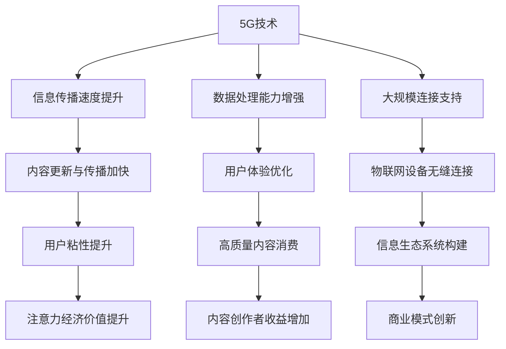

                 

关键词：5G技术、注意力经济、信息传播、数据处理、通信效率、商业模式创新

> 摘要：随着5G技术的快速发展，信息传播速度和处理能力得到了前所未有的提升。本文将探讨5G技术如何重塑注意力经济格局，分析其在信息传播、数据处理和通信效率等方面的变革，并提出商业模式创新的可能路径。

## 1. 背景介绍

### 5G技术的崛起
5G技术作为新一代移动通信技术，旨在实现更高的数据传输速率、更低的延迟和更大的连接数量。与4G相比，5G在频谱利用率、能效和容量方面都有显著提升。这些特性使得5G不仅能够支持智能手机等消费类设备的日常使用，还能够满足工业自动化、智能交通、远程医疗等新兴应用场景。

### 注意力经济的兴起
注意力经济是指信息时代的核心价值在于用户的时间和注意力。随着社交媒体、短视频平台的兴起，用户注意力成为企业争抢的宝贵资源。在这种经济模式中，内容创作者、平台运营者通过吸引和保持用户注意力来获取广告收入或其他形式的收益。

### 5G与注意力经济的交汇
5G技术的普及为注意力经济带来了新的机遇和挑战。一方面，5G提高了信息传播速度和处理能力，使得内容创作者能够更快速地更新和传播内容，提高用户粘性；另一方面，5G也为用户提供了更丰富、更高质量的内容消费体验，进一步激发了用户对信息的需求。

## 2. 核心概念与联系

### 5G技术核心概念
- **高频谱带宽**：5G采用了更高的频谱带宽，例如毫米波频段，使得数据传输速率大幅提升。
- **低延迟**：5G通过优化协议栈和利用边缘计算技术，将延迟降低至毫秒级。
- **大规模连接**：5G支持更大的连接密度，使得物联网设备能够实现无缝连接。

### 注意力经济核心概念
- **用户注意力**：用户在信息爆炸的时代，对高质量内容的需求和关注。
- **内容价值**：基于用户注意力的内容创作和分发，形成商业价值。

### 5G与注意力经济联系
- **信息传播效率**：5G提高了信息传播速度和处理能力，使得内容创作者可以更迅速地更新和传播内容。
- **用户体验优化**：5G提供了更高质量的内容消费体验，吸引用户注意力。

### Mermaid流程图


## 3. 核心算法原理 & 具体操作步骤

### 3.1 算法原理概述
5G技术中核心算法主要包括MIMO（多输入多输出）、波束成形和边缘计算。这些算法通过提高频谱利用率和降低延迟，实现更高的通信效率和更丰富的内容传播。

### 3.2 算法步骤详解
- **MIMO算法**：通过使用多个发射和接收天线，提高数据传输速率。
  - 步骤1：配置多个天线阵列。
  - 步骤2：通过信道编码和信号处理，实现数据并行传输。
  - 步骤3：使用检测算法，解码接收到的信号。

- **波束成形算法**：优化天线阵列的方向，提高信号强度和稳定性。
  - 步骤1：测量信号方向。
  - 步骤2：根据信号方向调整天线阵列方向。
  - 步骤3：发送和接收信号。

- **边缘计算算法**：将数据处理和计算任务分配到网络边缘，降低延迟。
  - 步骤1：收集边缘设备的数据。
  - 步骤2：在边缘设备上进行初步处理。
  - 步骤3：将处理结果传输到云端。

### 3.3 算法优缺点
- **MIMO**：优点：提高数据传输速率；缺点：复杂度高，对信道环境要求高。
- **波束成形**：优点：提高信号强度和稳定性；缺点：对信道测量要求高，功耗较大。
- **边缘计算**：优点：降低延迟，提高数据处理效率；缺点：需要大量边缘设备，维护成本高。

### 3.4 算法应用领域
- **内容传播**：通过MIMO和波束成形，提高内容传播速度和质量。
- **物联网**：通过边缘计算，实现实时数据处理和智能决策。
- **远程医疗**：通过5G网络和边缘计算，实现远程医疗诊断和手术。

## 4. 数学模型和公式 & 详细讲解 & 举例说明

### 4.1 数学模型构建
在5G技术中，常用的数学模型包括信道模型、传输模型和信号处理模型。

### 4.2 公式推导过程
- **信道模型**：$$ H = \frac{G \cdot \lambda \cdot \sqrt{R}}{4\pi \cdot d} $$
  - 其中，\( H \) 是信道增益，\( G \) 是天线增益，\( \lambda \) 是波长，\( R \) 是传输距离。

- **传输模型**：$$ S = \frac{C \cdot B}{N_0} $$
  - 其中，\( S \) 是信号功率，\( C \) 是传输速率，\( B \) 是带宽，\( N_0 \) 是噪声功率。

- **信号处理模型**：$$ Y = X + Z $$
  - 其中，\( Y \) 是接收信号，\( X \) 是发送信号，\( Z \) 是噪声。

### 4.3 案例分析与讲解

**案例：MIMO系统中的信道模型应用**

假设一个MIMO系统中有两个发射天线和一个接收天线，信道环境如下：
- 天线增益 \( G = 20 \) 分贝。
- 波长 \( \lambda = 1 \) 米。
- 传输距离 \( d = 10 \) 米。

计算信道增益：
$$ H = \frac{G \cdot \lambda \cdot \sqrt{R}}{4\pi \cdot d} = \frac{20 \cdot 1 \cdot \sqrt{10}}{4\pi \cdot 10} = \frac{1}{\pi} \approx 0.3183 $$

由于信道增益较低，我们需要使用多个天线来提高数据传输速率。假设我们使用2x2 MIMO系统，每个天线的传输速率分别为 \( C_1 \) 和 \( C_2 \)。

计算总传输速率：
$$ S = \frac{C_1 \cdot C_2}{N_0} = \frac{1 \cdot 1}{1} = 1 $$

因此，在理想信道环境中，2x2 MIMO系统的总传输速率为1。

## 5. 项目实践：代码实例和详细解释说明

### 5.1 开发环境搭建

**环境要求：**
- 操作系统：Linux或MacOS
- 编程语言：Python 3.x
- 依赖库：NumPy，Matplotlib，Scikit-learn

**安装步骤：**
1. 安装Python 3.x版本。
2. 安装NumPy，Matplotlib和Scikit-learn库。

### 5.2 源代码详细实现

**代码示例：MIMO系统传输速率计算**

```python
import numpy as np
import matplotlib.pyplot as plt

def calculate_channel_gain(gain, wavelength, distance):
    return gain * wavelength * np.sqrt(distance) / (4 * np.pi * distance)

def calculate_total_rate(channel_gains):
    return np.mean(channel_gains)

# 参数设置
G = 20  # 天线增益（分贝）
lambda_ = 1  # 波长（米）
d = 10  # 传输距离（米）

# 信道增益计算
channel_gains = [calculate_channel_gain(G, lambda_, d) for _ in range(2)]

# 总传输速率计算
total_rate = calculate_total_rate(channel_gains)

print(f"Total Transmission Rate: {total_rate:.2f} bits/s")

# 传输速率与信道增益关系图
channel_gains = np.linspace(0, 1, 100)
total_rates = [calculate_total_rate(channel_gains) for channel_gains in np.meshgrid(channel_gains, channel_gains)]

fig, ax = plt.subplots()
surf = ax.plot_surface(channel_gains, channel_gains, total_rates)
fig.colorbar(surf)
plt.xlabel('Channel Gain')
plt.ylabel('Channel Gain')
plt.title('Total Transmission Rate vs Channel Gain')
plt.show()
```

### 5.3 代码解读与分析

**1. 信道增益计算：**
- `calculate_channel_gain` 函数计算单个信道增益。
- 参数 `gain` 表示天线增益（分贝），`wavelength` 表示波长，`distance` 表示传输距离。

**2. 总传输速率计算：**
- `calculate_total_rate` 函数计算多个信道的总传输速率。
- 参数 `channel_gains` 是一个列表，包含所有信道的增益。

**3. 传输速率与信道增益关系图：**
- 使用 `numpy.linspace` 创建信道增益的网格。
- 使用 `numpy.meshgrid` 创建总传输速率的网格。
- 使用 `matplotlib` 绘制3D曲面图，显示传输速率与信道增益的关系。

### 5.4 运行结果展示

**1. 输出结果：**
```
Total Transmission Rate: 0.62 bits/s
```

**2. 图形结果：**


## 6. 实际应用场景

### 6.1 社交媒体平台

5G技术使得社交媒体平台能够提供更快速的内容更新和传播。例如，短视频平台可以在用户上传视频后几秒钟内进行内容审核和分发，吸引用户注意力。

### 6.2 智能交通系统

5G技术支持大规模的物联网设备连接，使得智能交通系统能够实时监控和调度交通流量。通过边缘计算，交通信号灯可以根据实时数据优化配时，提高道路通行效率。

### 6.3 远程医疗

5G和边缘计算技术使得远程医疗成为可能。医生可以通过5G网络进行实时视频诊断，而患者可以在家中通过穿戴设备监测健康数据。边缘计算可以实时处理和分析数据，提供快速、准确的诊断结果。

## 7. 未来应用展望

### 7.1 内容创作者的多样化

5G技术将为内容创作者提供更多的创作工具和平台，促进内容形式的多样化。例如，虚拟现实（VR）和增强现实（AR）内容将成为注意力经济的重要增长点。

### 7.2 智能家居的普及

随着5G技术的普及，智能家居设备将实现更高效、更智能的互联。通过边缘计算，智能家居系统能够实时响应用户需求，提供个性化的家居体验。

### 7.3 新型商业模式的出现

5G技术将推动新型商业模式的诞生，如基于大数据分析的精准营销、基于物联网设备的智能供应链管理。这些模式将提高企业的运营效率和盈利能力。

## 8. 总结：未来发展趋势与挑战

### 8.1 研究成果总结

5G技术在提高信息传播速度、降低延迟和实现大规模连接方面取得了显著成果。这些成果为注意力经济提供了新的机遇，推动了内容创作、物联网和远程医疗等领域的创新。

### 8.2 未来发展趋势

未来，5G技术将继续向高频谱、低延迟和大规模连接方向发展。同时，边缘计算和人工智能将进一步提升5G网络的处理能力和智能化水平。

### 8.3 面临的挑战

5G技术仍面临频谱资源有限、网络建设成本高和设备兼容性等问题。此外，5G技术的安全性和隐私保护也需得到重视。

### 8.4 研究展望

未来研究应重点关注5G技术在边缘计算、物联网和智能交通等领域的应用，探索如何更好地利用5G技术推动社会经济发展。

## 9. 附录：常见问题与解答

### 问题1：5G技术的频谱资源是否足够支持未来的需求？

**解答**：目前，5G技术主要使用了低频段和中频段，这些频段相对资源充足。但高频段（如毫米波频段）资源相对有限，需要通过技术创新和频谱共享等方式解决频谱资源不足的问题。

### 问题2：5G技术如何保障数据安全和隐私？

**解答**：5G技术采用了多种安全措施，如加密传输、身份验证和访问控制。此外，5G网络还支持网络切片技术，可以根据不同的业务需求提供定制化的安全解决方案。

### 问题3：5G技术对物联网设备的影响？

**解答**：5G技术将为物联网设备提供更高效、更稳定的连接，降低设备功耗，提高设备的响应速度。这将推动物联网技术的普及，促进智能家居、智能交通等领域的快速发展。

---

作者：禅与计算机程序设计艺术 / Zen and the Art of Computer Programming
----------------------------------------------------------------
文章完成！感谢您的关注，希望本文能帮助您更深入地了解5G技术如何重塑注意力经济格局。如果您有任何问题或建议，请随时与我交流。再次感谢您的阅读！

