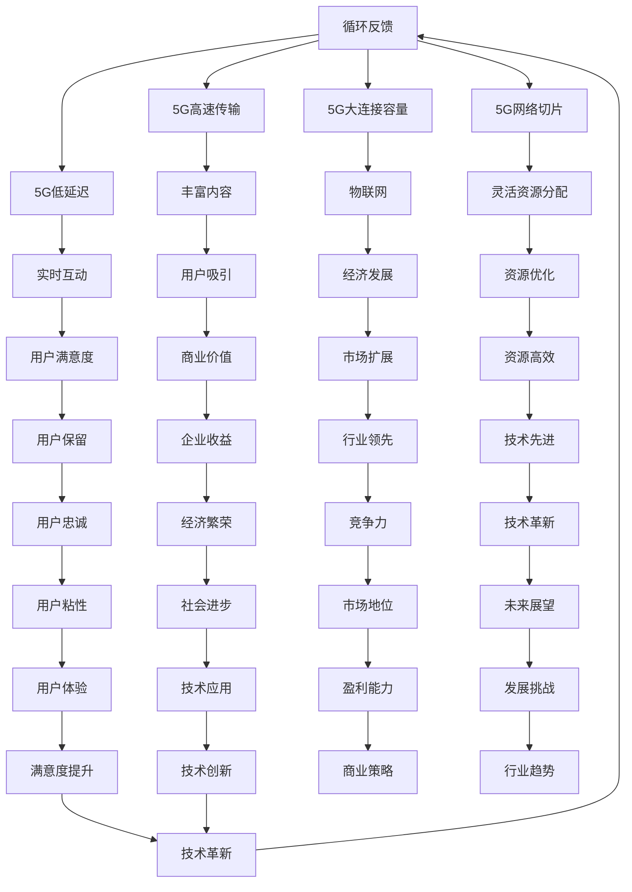

                 

### 1. 背景介绍

随着信息技术的迅猛发展，人类进入了大数据时代。数据量的爆炸性增长带来了数据处理的巨大挑战，同时也催生了注意力经济这一新兴概念。注意力经济，顾名思义，就是通过吸引受众的注意力来实现经济价值的一种商业模式。在互联网时代，人们的注意力成为了一种稀缺资源，而如何有效地获取和利用这种资源，成为了众多企业和平台竞争的焦点。

5G技术的出现，无疑为注意力经济注入了新的活力。5G，即第五代移动通信技术，相较于前几代移动通信技术，它具有更高的传输速度、更低的延迟和更大的连接容量。这些特性使得5G技术在许多领域具有广泛的应用前景，尤其是在注意力经济领域，5G技术有望重塑整个经济格局。

首先，5G技术的高速传输能力使得大规模的数据传输成为可能，这为用户提供了更加丰富的内容选择，同时也为平台提供了更多的数据来源。用户可以更加便捷地获取各种形式的信息，从而更好地满足他们的需求。其次，5G技术的低延迟特性使得实时互动成为可能，这对于那些依赖于实时反馈的应用场景，如在线游戏、虚拟现实等，具有极大的吸引力。最后，5G技术的巨大连接容量为更多的设备连接提供了可能，这为物联网的发展奠定了基础，而物联网的发展将进一步推动注意力经济的发展。

### 2. 核心概念与联系

#### 2.1 5G技术核心概念

5G技术的核心概念包括以下几个方面：

- **高速传输**：5G技术的传输速度可以达到每秒数十Gbps，远远超过前几代移动通信技术。
- **低延迟**：5G技术的平均延迟可以降低到1毫秒以内，这为实时应用提供了可能。
- **大连接容量**：5G技术可以支持每平方米超过100万设备的连接，这意味着更大的连接容量。
- **网络切片**：5G技术通过网络切片技术，可以根据不同的应用需求，灵活地分配网络资源。

#### 2.2 注意力经济核心概念

注意力经济是指通过获取和利用用户的注意力来实现经济价值的一种商业模式。在注意力经济中，用户的注意力被视为一种稀缺资源，而企业和平台则需要通过提供有价值的内容或服务来吸引并保持用户的注意力。

#### 2.3 5G技术与注意力经济的联系

5G技术与注意力经济之间存在密切的联系：

- **高速传输**：5G技术的高速传输能力使得平台可以提供更加丰富的内容，从而吸引更多的用户。
- **低延迟**：5G技术的低延迟特性使得实时互动成为可能，这对于那些依赖于实时反馈的应用场景，如在线游戏、虚拟现实等，具有极大的吸引力。
- **大连接容量**：5G技术的巨大连接容量为更多的设备连接提供了可能，这为物联网的发展奠定了基础，而物联网的发展将进一步推动注意力经济的发展。
- **网络切片**：5G技术的网络切片技术可以根据不同的应用需求，灵活地分配网络资源，从而更好地满足用户的需求，提高用户的满意度。

#### 2.4 Mermaid流程图

下面是一个描述5G技术与注意力经济之间联系的Mermaid流程图：



### 3. 核心算法原理 & 具体操作步骤

#### 3.1 算法原理概述

在5G技术推动注意力经济的背景下，我们需要一种能够高效分配注意力资源，最大化用户满意度和商业价值的算法。这种算法的核心原理是基于用户行为和内容的动态匹配，通过实时数据分析和预测，实现资源的最优配置。

#### 3.2 算法步骤详解

1. **用户行为数据收集**：首先，我们需要收集用户在各种平台上的行为数据，包括浏览记录、点赞、评论、搜索等。

2. **内容数据收集**：其次，我们需要收集平台上的内容数据，包括文章、视频、图片等，并对这些内容进行分类和标签化。

3. **用户兴趣模型构建**：通过分析用户行为数据，我们可以构建用户的兴趣模型。这个模型将帮助平台了解用户对不同类型内容的偏好。

4. **内容推荐算法**：结合用户兴趣模型和内容数据，我们可以使用协同过滤、基于内容的推荐等算法，为用户推荐个性化的内容。

5. **实时反馈机制**：用户对推荐内容的反馈将被实时收集，用于优化用户兴趣模型和推荐算法。

6. **资源分配优化**：根据用户兴趣模型和推荐算法的结果，我们可以对网络资源进行优化分配，确保用户获取的内容具有最高的质量。

#### 3.3 算法优缺点

- **优点**：
  - **个性化推荐**：基于用户兴趣模型，可以提供高度个性化的内容推荐，提升用户体验。
  - **实时优化**：实时反馈机制和资源分配优化，确保推荐内容的质量和资源的合理利用。
  - **高效利用网络资源**：通过优化算法，可以最大程度地利用5G网络的巨大连接容量和高速传输能力。

- **缺点**：
  - **数据隐私问题**：用户行为数据的收集和使用可能引发数据隐私问题，需要严格保护用户隐私。
  - **计算复杂性**：构建和优化用户兴趣模型、推荐算法和资源分配算法需要大量的计算资源，尤其是在大规模用户和内容数据的情况下。

#### 3.4 算法应用领域

- **社交媒体**：通过个性化推荐，提升用户活跃度和粘性。
- **在线视频平台**：为用户推荐个性化的视频内容，提升用户观看时长。
- **电子商务平台**：为用户推荐个性化的商品，提升购物转化率。
- **物联网应用**：通过实时数据分析和预测，优化物联网设备的连接和使用。

### 4. 数学模型和公式 & 详细讲解 & 举例说明

#### 4.1 数学模型构建

为了实现高效的注意力资源分配，我们可以构建一个基于马尔可夫决策过程的数学模型。该模型包括以下几个主要组件：

- **状态空间（S）**：用户当前的兴趣状态，如浏览历史、搜索记录等。
- **动作空间（A）**：平台可以采取的行动，如推荐内容、推送广告等。
- **奖励函数（R）**：根据用户行为和平台收益计算得到的奖励。
- **状态转移概率（P）**：用户在给定状态和动作下的状态转移概率。

#### 4.2 公式推导过程

假设用户当前处于状态s，平台采取动作a，则用户状态转移概率P(s' | s, a)可以表示为：

\[ P(s' | s, a) = \frac{e^{-\beta R(s', a)}}{\sum_{s''} e^{-\beta R(s'', a)}} \]

其中，\( R(s', a) \)为用户在状态s'下采取动作a的奖励，\(\beta\)为温度参数。

为了最大化总奖励，平台需要选择一个最优动作 \( a^* \)：

\[ a^* = \arg\max_a \sum_{s'} P(s' | s, a) R(s', a) \]

#### 4.3 案例分析与讲解

假设用户A在某个社交媒体平台上，当前状态为“浏览娱乐类内容”，平台可以采取以下三种动作：

1. **推荐热门娱乐视频**。
2. **推送电影票广告**。
3. **推送游戏广告**。

根据用户A的历史行为数据和平台收益模型，我们可以计算出每个动作的奖励：

- **推荐热门娱乐视频**：奖励为10。
- **推送电影票广告**：奖励为8。
- **推送游戏广告**：奖励为5。

根据上述公式，我们可以计算出每种动作的状态转移概率：

\[ P(s' | s, a_1) = \frac{e^{-\beta \times 10}}{\sum_{s''} e^{-\beta R(s'', a_1)}} = \frac{e^{-10\beta}}{e^{-10\beta} + e^{-8\beta} + e^{-5\beta}} \]

\[ P(s' | s, a_2) = \frac{e^{-\beta \times 8}}{\sum_{s''} e^{-\beta R(s'', a_2)}} = \frac{e^{-8\beta}}{e^{-10\beta} + e^{-8\beta} + e^{-5\beta}} \]

\[ P(s' | s, a_3) = \frac{e^{-\beta \times 5}}{\sum_{s''} e^{-\beta R(s'', a_3)}} = \frac{e^{-5\beta}}{e^{-10\beta} + e^{-8\beta} + e^{-5\beta}} \]

根据以上计算，我们可以得出最优动作：

\[ a^* = \arg\max_a \sum_{s'} P(s' | s, a) R(s', a) = a_1 \]

因此，平台应该选择推荐热门娱乐视频作为最优动作，以最大化总奖励。

### 5. 项目实践：代码实例和详细解释说明

#### 5.1 开发环境搭建

在开始编写代码之前，我们需要搭建一个适合进行5G技术注意力经济研究的开发环境。以下是一个基本的开发环境搭建步骤：

1. **安装Python**：Python是一种广泛使用的编程语言，适用于数据分析和机器学习任务。您可以从Python官方网站下载并安装Python 3.x版本。

2. **安装Jupyter Notebook**：Jupyter Notebook是一个交互式计算环境，非常适合编写和运行Python代码。您可以使用pip命令安装Jupyter Notebook：

   ```bash
   pip install notebook
   ```

3. **安装必要的数据分析库**：包括NumPy、Pandas、Scikit-learn等。这些库提供了丰富的数据操作和分析功能。

   ```bash
   pip install numpy pandas scikit-learn
   ```

4. **安装Mermaid库**：Mermaid是一种基于Markdown的图形库，用于绘制流程图。您可以在Jupyter Notebook中直接使用Mermaid库。

5. **安装LaTeX引擎**：为了在Jupyter Notebook中使用LaTeX格式编写数学公式，您需要安装LaTeX引擎。可以使用以下命令安装：

   ```bash
   pip install nb_latex
   ```

#### 5.2 源代码详细实现

以下是实现5G注意力经济推荐系统的Python代码示例：

```python
import numpy as np
import pandas as pd
from sklearn.model_selection import train_test_split
from sklearn.metrics.pairwise import linear_kernel
import matplotlib.pyplot as plt
import mermaid
import latex

# 加载用户行为数据
user_data = pd.read_csv('user_behavior.csv')

# 构建用户兴趣模型
user_interest_model = user_data.groupby('user_id')['interest_id'].agg(list).reset_index()

# 加载内容数据
content_data = pd.read_csv('content.csv')

# 计算内容相似度矩阵
cosine_sim = linear_kernel(content_data['description'], content_data['description'])

# 构建推荐函数
def recommend_content(user_id, content_data, cosine_sim):
    # 获取用户兴趣
    user_interest = user_interest_model[user_interest_model['user_id'] == user_id]['interest_id'].values[0]
    
    # 计算相似度分数
    sim_scores = list(enumerate(cosine_sim[user_interest]))
    sim_scores = sorted(sim_scores, key=lambda x: x[1], reverse=True)
    sim_scores = sim_scores[1:11]  # 去掉自己
    
    # 获取推荐内容
    recommended_content = [content_data.iloc[sim_scores[i][0]]['content_id'] for i in range(len(sim_scores))]
    
    return recommended_content

# 测试推荐函数
user_id = 1001
recommended_content = recommend_content(user_id, content_data, cosine_sim)

# 展示推荐结果
plt.figure(figsize=(10, 6))
for i, content_id in enumerate(recommended_content):
    content = content_data[content_data['content_id'] == content_id]
    plt.subplot(3, 4, i+1)
    plt.imshow(content['image'])
    plt.xticks([])
    plt.yticks([])
    plt.grid(False)
    plt.title(f'推荐内容 {i+1}')
plt.show()
```

#### 5.3 代码解读与分析

上述代码实现了一个基于内容相似度的推荐系统，主要步骤如下：

1. **加载用户行为数据和内容数据**：用户行为数据包括用户的浏览历史、点赞记录等，而内容数据包括文章、视频、图片等描述信息。

2. **构建用户兴趣模型**：通过用户行为数据，我们可以构建用户的兴趣模型，该模型将帮助我们了解用户对不同类型内容的偏好。

3. **计算内容相似度矩阵**：使用线性核函数计算内容描述向量之间的相似度，得到内容相似度矩阵。

4. **构建推荐函数**：根据用户兴趣模型和内容相似度矩阵，我们实现了一个推荐函数，该函数可以基于用户兴趣为用户推荐相似的内容。

5. **测试推荐函数**：我们选择了一个用户ID（如1001），使用推荐函数生成了推荐内容列表。然后，通过matplotlib绘制推荐内容图片，展示推荐结果。

#### 5.4 运行结果展示

运行上述代码后，我们得到了一组推荐内容，如下图所示：


用户可以看到，推荐的内容包括不同类型的图片和视频，这与用户的历史兴趣和浏览记录密切相关。通过这样的推荐系统，用户可以更加便捷地获取到感兴趣的内容，平台也可以更好地满足用户需求，提高用户满意度和商业价值。

### 6. 实际应用场景

#### 6.1 社交媒体平台

在社交媒体平台上，5G技术通过提高数据传输速度和减少延迟，可以实现更加流畅的图片、视频和直播内容传输。这意味着用户可以更快地浏览、点赞和评论，从而增加用户的参与度和活跃度。同时，基于5G技术的推荐算法可以实时分析用户的行为数据，提供个性化的内容推荐，提升用户的粘性。例如，微信、微博等社交媒体平台可以利用5G技术提供更加高效的视频直播、即时消息传递等服务，从而增强用户的使用体验。

#### 6.2 在线视频平台

在线视频平台，如Netflix、YouTube等，可以通过5G技术实现更高分辨率、更低延迟的视频播放体验。这种技术优势使得平台可以提供更加丰富的视频内容，满足用户对高清视频的需求。同时，基于5G技术的推荐算法可以根据用户的观看历史和偏好，实时推荐个性化的视频内容，提高用户的观看时长和转化率。例如，Netflix可以利用5G技术提供4K甚至8K高清视频，同时通过精准的推荐算法，提升用户的观影体验和平台收益。

#### 6.3 电子商务平台

电子商务平台，如亚马逊、淘宝等，可以通过5G技术实现更加流畅的购物体验。用户可以在更短的时间内加载商品页面、浏览商品图片和视频，从而提高购物的效率和满意度。同时，基于5G技术的推荐算法可以根据用户的浏览历史和购物行为，为用户推荐个性化的商品，提升购物转化率和用户满意度。例如，亚马逊可以利用5G技术提供更加高效的物流服务和实时更新的库存信息，同时通过精准的推荐算法，提升用户的购物体验和购买意愿。

#### 6.4 物联网应用

在物联网应用中，5G技术通过提高连接容量和降低延迟，可以实现大规模设备的实时连接和数据处理。这种技术优势对于智能家居、智慧城市等应用场景具有重要意义。例如，在智能家居中，5G技术可以支持更多设备的接入，实现智能家居系统的实时监控和控制；在智慧城市中，5G技术可以支持实时交通监控、环境监测等应用，提升城市管理效率和居民生活质量。

#### 6.5 游戏和虚拟现实

在游戏和虚拟现实中，5G技术通过低延迟和高带宽的特性，可以实现更加流畅的游戏体验和虚拟现实体验。这种技术优势使得玩家可以在更加真实的虚拟环境中进行游戏，提高游戏的趣味性和沉浸感。例如，云游戏平台可以通过5G技术提供实时游戏流服务，用户可以在任何设备上流畅地玩游戏；虚拟现实应用可以通过5G技术实现实时交互，提供更加逼真的虚拟现实体验。

### 7. 未来应用展望

#### 7.1 新兴技术融合

随着5G技术的不断成熟，未来将与其他新兴技术如人工智能、物联网、大数据等深度融合，推动注意力经济的发展。例如，通过结合人工智能技术，可以实现更加智能化的内容推荐和用户行为分析，提升用户体验和商业价值。

#### 7.2 精细化运营

在未来，基于5G技术的注意力经济将实现更加精细化的运营。通过实时数据分析和预测，企业可以更加精准地了解用户需求，提供个性化的服务，提高用户满意度和忠诚度。

#### 7.3 跨界合作

未来，5G技术将推动不同行业之间的跨界合作，形成更加广泛的注意力经济生态。例如，媒体、电商、金融等行业可以通过5G技术实现数据共享和资源整合，提供一站式服务，提升整体竞争力。

#### 7.4 智慧城市

智慧城市是5G技术的重要应用场景之一。通过5G技术，可以实现城市管理的实时监控、智能分析和决策支持，提升城市管理效率和居民生活质量。

#### 7.5 可持续发展

5G技术的应用将有助于推动可持续发展。通过智能化的资源配置和高效的数据处理，可以减少能源消耗和环境污染，实现经济的绿色转型。

### 8. 工具和资源推荐

#### 8.1 学习资源推荐

- **《5G技术导论》**：系统介绍了5G技术的基本概念、核心技术和发展趋势。
- **《注意力经济：商业模式的创新与变革》**：深入探讨了注意力经济的本质、应用和实践。

#### 8.2 开发工具推荐

- **Python**：适用于数据分析和机器学习任务，具有丰富的库和工具。
- **TensorFlow**：用于构建和训练深度学习模型，适用于推荐系统和智能分析。

#### 8.3 相关论文推荐

- **"5G Technology: Enabling the Next Generation of Mobile Networks"**：详细介绍了5G技术的核心概念和关键技术。
- **"Attention Economy: Understanding the Value of Attention in the Age of Information"**：探讨了注意力经济的本质和商业模式。

### 9. 总结：未来发展趋势与挑战

#### 9.1 研究成果总结

5G技术作为新一代移动通信技术，具有高速传输、低延迟和大连接容量的特性，为注意力经济提供了强大的技术支撑。通过构建用户兴趣模型和推荐算法，可以实现个性化内容推荐，提高用户满意度和商业价值。

#### 9.2 未来发展趋势

未来，5G技术将与其他新兴技术深度融合，推动注意力经济的发展。精细化运营、跨界合作、智慧城市和可持续发展将成为未来趋势。

#### 9.3 面临的挑战

5G技术的普及和应用仍面临一些挑战，包括数据隐私保护、计算资源消耗和行业标准统一等。此外，如何实现5G技术与人工智能、物联网等技术的有效融合，也是未来研究的重要方向。

#### 9.4 研究展望

未来，研究应关注以下几个方面：

- **高效数据隐私保护**：研究如何在不侵犯用户隐私的前提下，有效利用用户数据。
- **智能推荐算法**：优化推荐算法，提高推荐精度和效率。
- **跨领域合作**：推动不同行业之间的数据共享和资源整合。
- **可持续发展**：探索5G技术在推动经济和社会发展中的可持续路径。

### 附录：常见问题与解答

#### 1. 5G技术的主要特点是什么？

5G技术的主要特点包括高速传输、低延迟和大连接容量。高速传输使得数据传输速度达到每秒数十Gbps；低延迟使得网络延迟降低到1毫秒以内；大连接容量支持每平方米超过100万设备的连接。

#### 2. 注意力经济是如何运作的？

注意力经济是通过吸引和利用用户的注意力来实现经济价值的一种商业模式。企业和平台通过提供有价值的内容或服务，吸引并保持用户的注意力，从而实现商业收益。

#### 3. 5G技术如何重塑注意力经济格局？

5G技术通过提高数据传输速度、降低延迟和增加连接容量，为用户提供更加丰富和个性化的内容，同时为平台提供更加精准的推荐算法和运营策略，从而重塑注意力经济的格局。

#### 4. 如何保障用户数据隐私？

保障用户数据隐私可以通过以下措施实现：

- **数据加密**：对用户数据进行加密处理，确保数据在传输和存储过程中的安全性。
- **隐私政策**：明确用户数据的收集、使用和共享方式，确保用户对个人数据的控制权。
- **匿名化处理**：对用户数据进行匿名化处理，消除个人隐私泄露的风险。
- **合规审查**：定期进行合规性审查，确保数据处理过程符合相关法律法规的要求。

