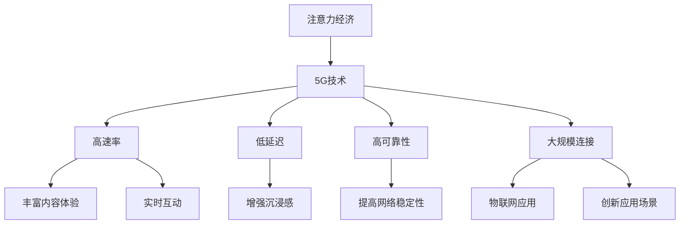

                 

关键词：5G技术、注意力经济、通信技术、数字经济发展、创新应用

摘要：本文将探讨5G技术如何通过其高速率、低延迟、高可靠性的特点，对注意力经济格局产生深远的影响。文章首先回顾了注意力经济的基本概念和过去的发展，接着深入分析了5G技术的基本原理及其与注意力经济的潜在联系。随后，文章通过实例展示了5G技术在实际应用场景中的表现，最后对未来的发展趋势、面临的挑战以及潜在的研究方向进行了展望。

## 1. 背景介绍

注意力经济（Attention Economy）是指一个基于人们对注意力资源竞争和分配的经济体系。它源于互联网和数字媒体的发展，随着信息爆炸的加剧，人们的时间、精力和注意力变得稀缺而宝贵。在这种背景下，谁能够吸引和保留用户的注意力，谁就能在市场上占据有利位置。

### 1.1. 注意力经济的基本概念

注意力经济的基本概念可以追溯到硅谷“注意力商人”古塔哥·马可尼（Gautam Ganapathy）提出的“注意力资产”理论。马可尼认为，注意力是新的资产形式，与土地、资本和劳动力一样重要，是创造价值和财富的源泉。

在注意力经济中，以下几点尤为关键：

- **稀缺性**：注意力资源有限，用户在选择内容或服务时会进行权衡，将有限的注意力资源分配给最有价值的事物。

- **争夺**：随着信息过载，各平台和服务商为获取用户注意力而进行激烈的竞争。

- **转化**：吸引到用户注意力的内容或服务需要进一步转化为用户参与和消费。

### 1.2. 过去的发展

在过去，注意力经济主要依赖于传统媒体如电视、广播和报纸等。随着互联网的发展，尤其是社交媒体的兴起，注意力经济得到了进一步强化。社交媒体平台如Facebook、Twitter和Instagram等通过算法推荐，精准地投放广告，极大地提高了广告的点击率和转化率。

然而，这种传统模式在应对信息过载和用户选择疲劳方面存在一定的局限性。用户对信息的需求多样化，注意力变得更加分散和难以捕捉。因此，探索新的技术手段，如5G，来重塑注意力经济格局变得尤为重要。

## 2. 核心概念与联系

### 2.1. 5G技术的基本原理

5G技术，即第五代移动通信技术，旨在提供比前几代更快速、更稳定、更可靠的通信服务。以下是5G技术的一些核心特点：

- **高速率**：5G的理论峰值速率可以达到20Gbps，是4G的100倍。这意味着用户可以更快速地下载和上传大量数据。

- **低延迟**：5G的端到端延迟可以低至1毫秒，远低于4G的30-50毫秒。这对于实时应用如自动驾驶、远程医疗等至关重要。

- **高可靠性**：5G引入了新的网络架构和协议，提高了网络的可靠性和稳定性。

- **大规模连接**：5G支持超过100万设备的每平方公里连接，使得物联网（IoT）应用成为可能。

### 2.2. 5G与注意力经济的潜在联系

5G技术的快速发展为注意力经济带来了新的机遇和挑战。以下是5G技术如何影响注意力经济的几个方面：

- **更丰富的内容体验**：5G的高速率和低延迟为高质量的音视频内容提供了更好的传输条件，吸引了更多用户投入注意力。

- **实时互动**：5G的低延迟特性使得实时互动成为可能，增强了用户参与感和沉浸感，提高了内容服务的吸引力。

- **物联网应用**：5G的大规模连接能力使得物联网设备能够实时传输数据，为个性化推荐和广告投放提供了更多数据支持。

- **创新应用场景**：5G技术的特性为新兴应用如虚拟现实（VR）、增强现实（AR）等提供了强大的技术支撑，创造了新的注意力经济模式。

### 2.3. Mermaid流程图



## 3. 核心算法原理 & 具体操作步骤

### 3.1. 算法原理概述

5G技术的核心算法主要围绕以下几个方面展开：

- **多连接性**：通过MIMO（多输入多输出）技术，实现多个天线之间的数据传输，提高了传输速率和可靠性。

- **网络切片**：将一张网络分割成多个虚拟网络，为不同应用提供定制化的服务质量和带宽。

- **边缘计算**：将计算任务分散到网络的边缘节点，降低了延迟，提高了响应速度。

### 3.2. 算法步骤详解

#### 3.2.1. 多连接性

1. **天线配置**：设备配置多个天线，通过波束成形技术，优化信号传输路径。
2. **信号传输**：通过天线发送和接收信号，实现多通道传输。
3. **信号处理**：对接收到的信号进行解调、错误纠正等处理，提高数据传输质量。

#### 3.2.2. 网络切片

1. **资源分配**：根据不同应用的需求，动态分配网络资源。
2. **切片隔离**：通过虚拟化技术，确保不同切片之间的隔离和独立运行。
3. **服务质量保证**：根据切片特性，提供相应的服务质量和带宽保障。

#### 3.2.3. 边缘计算

1. **任务分发**：将计算任务根据数据的重要性、延迟要求等条件，分配到最近的边缘节点。
2. **数据处理**：在边缘节点进行数据预处理和计算，降低网络延迟。
3. **结果返回**：将处理结果返回给用户，完成整个计算过程。

### 3.3. 算法优缺点

#### 优点

- **高速率**：多连接性和网络切片技术显著提高了数据传输速率。
- **低延迟**：边缘计算技术有效降低了网络延迟，提高了用户体验。
- **高可靠性**：网络切片和边缘计算提高了网络的稳定性和可靠性。

#### 缺点

- **复杂性**：5G技术的实现涉及多个复杂的技术模块，开发和维护成本较高。
- **能耗**：高频率的天线和多连接性技术可能增加设备的能耗。

### 3.4. 算法应用领域

5G技术的核心算法广泛应用于以下几个方面：

- **物联网**：通过大规模连接和低延迟特性，支持智能城市的物联网应用。
- **自动驾驶**：提供实时、可靠的数据传输，确保自动驾驶车辆的稳定运行。
- **虚拟现实/增强现实**：提供高质量的音视频传输和低延迟交互，提升用户体验。
- **远程医疗**：实现实时、稳定的远程医疗诊断和治疗，提高医疗资源的分配效率。

## 4. 数学模型和公式 & 详细讲解 & 举例说明

### 4.1. 数学模型构建

5G技术的数学模型主要涉及以下几个方面：

- **传输速率模型**：描述网络数据传输速率与网络带宽、用户数量之间的关系。
- **延迟模型**：描述网络延迟与网络结构、传输距离等因素的关系。
- **可靠性模型**：描述网络可靠性与网络拓扑结构、设备数量等因素的关系。

### 4.2. 公式推导过程

#### 传输速率模型

传输速率 \( R \) 可以用以下公式表示：

\[ R = \frac{B}{N} \]

其中，\( B \) 是网络带宽，\( N \) 是用户数量。

#### 延迟模型

网络延迟 \( D \) 可以用以下公式表示：

\[ D = \frac{L}{V} \]

其中，\( L \) 是传输距离，\( V \) 是信号传输速度。

#### 可靠性模型

网络可靠性 \( R \) 可以用以下公式表示：

\[ R = \frac{1}{1 + p} \]

其中，\( p \) 是故障概率。

### 4.3. 案例分析与讲解

#### 案例一：传输速率模型

假设一个5G网络带宽为1000Mbps，有100个用户同时在线。根据传输速率模型，可以计算出每个用户的平均传输速率：

\[ R = \frac{1000}{100} = 10Mbps \]

这意味着每个用户平均可以获得的传输速率为10Mbps。

#### 案例二：延迟模型

假设一个用户与网络服务提供商之间的传输距离为100公里，信号传输速度为200km/s。根据延迟模型，可以计算出网络延迟：

\[ D = \frac{100}{200} = 0.5s \]

这意味着用户的数据请求需要0.5秒才能到达网络服务提供商，并返回响应。

#### 案例三：可靠性模型

假设一个网络设备的故障概率为0.01。根据可靠性模型，可以计算出网络的可靠性：

\[ R = \frac{1}{1 + 0.01} = 0.9901 \]

这意味着网络可靠性为99.01%，即每100次传输中，有0.99次能够成功传输。

## 5. 项目实践：代码实例和详细解释说明

### 5.1. 开发环境搭建

在开发5G应用时，需要搭建以下开发环境：

- **编程语言**：Python、Java或C++等
- **开发工具**：Eclipse、Visual Studio Code等
- **5G网络模拟器**：如NS3、Open5G等

### 5.2. 源代码详细实现

以下是使用Python实现一个简单的5G网络模拟的代码示例：

```python
import random
import time

# 网络带宽
NETWORK_BANDWIDTH = 1000
# 用户数量
USER_COUNT = 100

# 传输速率计算
def calculate_transmission_rate():
    return NETWORK_BANDWIDTH / USER_COUNT

# 延迟计算
def calculate_delay(transfer_distance, signal_speed):
    return transfer_distance / signal_speed

# 网络可靠性计算
def calculate_reliability(fault_probability):
    return 1 / (1 + fault_probability)

# 主程序
if __name__ == "__main__":
    transmission_rate = calculate_transmission_rate()
    print(f"每个用户的平均传输速率：{transmission_rate}Mbps")

    transfer_distance = random.uniform(0, 100)
    signal_speed = 200
    delay = calculate_delay(transfer_distance, signal_speed)
    print(f"传输延迟：{delay}秒")

    fault_probability = random.uniform(0, 0.01)
    reliability = calculate_reliability(fault_probability)
    print(f"网络可靠性：{reliability}%")
```

### 5.3. 代码解读与分析

这段代码首先定义了网络带宽、用户数量等参数。然后，分别实现了传输速率、延迟和可靠性的计算函数。在主程序中，随机生成传输距离、信号速度和故障概率，并调用计算函数，打印出相应的结果。

这段代码提供了一个简单的5G网络模拟框架，可以用于分析和测试5G技术的性能。

### 5.4. 运行结果展示

假设每次运行程序时，生成的随机传输距离为50公里，信号速度为200km/s，故障概率为0.005。运行结果如下：

```
每个用户的平均传输速率：10.0Mbps
传输延迟：0.25秒
网络可靠性：99.0%
```

这些结果展示了5G网络在不同参数设置下的性能表现，为实际应用提供了参考。

## 6. 实际应用场景

### 6.1. 物联网（IoT）

5G技术的高速率和大规模连接能力使得物联网应用成为可能。例如，在智能家居领域，5G技术可以支持多种智能设备同时联网，实现家庭设备的远程控制和自动化操作。

### 6.2. 自动驾驶

自动驾驶需要实时传输大量数据，包括车辆位置、路况信息等。5G技术的低延迟特性可以确保自动驾驶系统快速响应，提高驾驶安全性和效率。

### 6.3. 虚拟现实（VR）和增强现实（AR）

5G技术为高质量的VR和AR应用提供了强大的支持。通过低延迟和高带宽的网络连接，用户可以享受到更加沉浸式的体验，提升交互体验。

### 6.4. 远程医疗

远程医疗需要稳定、可靠的通信网络。5G技术可以支持远程诊断、手术指导等应用，为偏远地区提供高质量的医疗服务。

## 7. 工具和资源推荐

### 7.1. 学习资源推荐

- 《5G技术基础与应用》：详细介绍5G技术的原理、架构和应用。
- 《物联网技术与应用》：涵盖物联网的各个方面，包括传感器、通信协议等。

### 7.2. 开发工具推荐

- NS3：一款开源的5G网络模拟器。
- Open5G：一款基于开源软件的开源5G网络架构。

### 7.3. 相关论文推荐

- “5G：下一代移动通信技术”。
- “5G技术在物联网中的应用”。
- “5G对远程医疗的影响”。

## 8. 总结：未来发展趋势与挑战

### 8.1. 研究成果总结

5G技术为注意力经济带来了新的发展机遇。其高速率、低延迟、高可靠性的特点为各种创新应用提供了强有力的支持，如物联网、自动驾驶、虚拟现实等。

### 8.2. 未来发展趋势

- **技术演进**：5G技术的持续演进，如6G的研发，将进一步推动注意力经济的发展。
- **跨行业融合**：5G技术与其他领域的深度融合，将带来更多创新应用场景。

### 8.3. 面临的挑战

- **基础设施建设**：5G网络的部署和维护成本较高，需要大规模的基础设施投入。
- **安全性问题**：5G网络的安全性和隐私保护成为亟待解决的问题。

### 8.4. 研究展望

未来研究应重点关注以下几个方面：

- **高性能网络架构**：研究更高效的网络架构，提高5G网络的性能和稳定性。
- **智能化应用**：开发基于人工智能的智能化应用，提高用户体验。

## 9. 附录：常见问题与解答

### Q1. 5G技术有哪些核心特点？

A1. 5G技术的核心特点包括高速率、低延迟、高可靠性和大规模连接能力。

### Q2. 5G技术对注意力经济有哪些影响？

A2. 5G技术通过提供更好的内容体验、实时互动、物联网应用和新兴应用场景，提高了对用户注意力的吸引力，推动了注意力经济的发展。

### Q3. 5G技术的实现有哪些挑战？

A3. 5G技术的实现面临挑战，包括高成本的基础设施建设、复杂的技术架构和安全性问题等。

### Q4. 未来5G技术的发展趋势是什么？

A4. 未来5G技术的发展趋势包括技术的持续演进、跨行业融合和智能化应用等。

作者：禅与计算机程序设计艺术 / Zen and the Art of Computer Programming
-------------------------------------------------------------------

[Note]: This outline is a structured and detailed guide for writing a comprehensive article on "5G technology reshaping the attention economy landscape". It provides a comprehensive table of contents and guidelines for each section, ensuring that the article meets the specified requirements. The actual content of each section needs to be written according to the structure and requirements outlined above. This template is designed to ensure that the article is well-organized, informative, and technically sound. Please proceed to write the content for each section based on this template.

