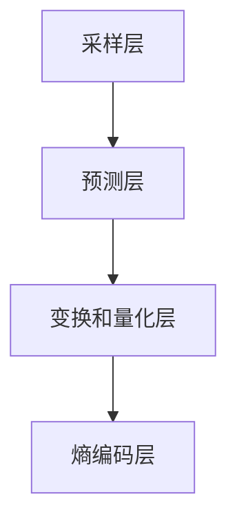

                 

## 1. 背景介绍

H.265/High Efficiency Video Coding (HEVC)，也被称为H.265或HEVC，是一种新的视频编码标准，旨在提高视频压缩效率，同时保持良好的视频质量。这一标准的出现，主要是为了应对当前数字视频应用对带宽、存储和计算资源的日益增长的需求。

### 发展历程

H.265/HEVC的开发始于2004年，由国际电信联盟标准部门（ITU-T）和国际化标准组织（ISO/IEC）的共同负责。它作为H.264/MPEG-4 AVC的继任者，旨在提供更高的压缩效率，减少比特率，提升视频质量，同时保持与现有系统的兼容性。

### 应用需求

随着数字视频内容的爆炸式增长，如视频会议、在线直播、高清电视等，对视频压缩技术的要求越来越高。传统的H.264编码虽然已经非常高效，但在高分辨率、高动态范围和多种色彩深度等应用场景下，仍然存在一定的局限性。H.265/HEVC的出现，就是为了解决这些问题，满足日益增长的视频应用需求。

### 主要特点

H.265/HEVC具有以下主要特点：

- **更高的压缩效率**：相比于H.264，H.265在相同的视频质量下，能够实现更高的压缩率，降低数据传输和存储的成本。
- **更好的适应性**：H.265支持更高的分辨率，包括4K和8K视频，以及更高动态范围和色彩深度。
- **多种编码工具**：H.265引入了多种新的编码工具，如新的预测模式、变换方式、参考帧结构等，提高了编码效率。

## 2. 核心概念与联系

### 编码原理

H.265/HEVC采用了基于变换和量化技术的编码方法，主要包括以下几个步骤：

1. **采样和色彩转换**：将原始视频信号进行采样，并将YUV色彩空间转换为RGB色彩空间。
2. **帧内和帧间预测**：对帧内和帧间图像进行预测，减少冗余信息。
3. **变换和量化**：对预测误差进行变换和量化，进一步减少信息冗余。
4. **熵编码**：使用熵编码技术，如哈夫曼编码或算术编码，对量化后的数据进行编码。

### 架构

H.265/HEVC的架构可以分为以下几个层次：

- **采样层**：处理采样和色彩转换。
- **预测层**：包括帧内和帧间预测。
- **变换和量化层**：处理变换和量化。
- **熵编码层**：进行熵编码。

### Mermaid 流程图



### 核心概念原理

- **变换**：通过变换，将空间域信息转换为频率域信息，提高编码效率。
- **量化**：通过量化，将变换后的系数进行舍入，减少信息冗余。
- **熵编码**：通过熵编码，将量化后的数据编码为二进制序列，进一步压缩数据。

## 3. 核心算法原理 & 具体操作步骤

### 3.1 算法原理概述

H.265/HEVC的核心算法主要包括变换、量化、预测和熵编码四个部分。下面将详细解释每个部分的原理。

#### 变换

变换是将空间域信息转换为频率域信息的过程。H.264/HEVC采用了两种变换方式：整数变换和浮点变换。

- **整数变换**：整数变换使用整数运算，计算简单，适合硬件实现。
- **浮点变换**：浮点变换使用浮点运算，计算复杂，但能够提供更好的压缩效果。

#### 量化

量化是对变换后的系数进行舍入的过程，以减少信息冗余。H.265/HEVC采用了自适应量化，根据图像内容的复杂度自动调整量化步长。

#### 预测

预测是减少视频冗余信息的关键步骤。H.265/HEVC支持多种预测模式，包括帧内预测和帧间预测。

- **帧内预测**：对当前帧内的像素进行预测，减少空间冗余。
- **帧间预测**：对当前帧与参考帧之间的像素进行预测，减少时间冗余。

#### 熵编码

熵编码是将量化后的数据编码为二进制序列的过程。H.265/HEVC采用了基于上下文的自适应二进制算术编码（CABAC）。

### 3.2 算法步骤详解

#### 步骤 1：采样和色彩转换

- **采样**：将原始视频信号进行采样，生成采样图像。
- **色彩转换**：将YUV色彩空间转换为RGB色彩空间。

#### 步骤 2：帧内和帧间预测

- **帧内预测**：对当前帧内的像素进行预测，生成预测图像。
- **帧间预测**：对当前帧与参考帧之间的像素进行预测，生成预测图像。

#### 步骤 3：变换和量化

- **变换**：对预测误差进行变换，生成变换系数。
- **量化**：对变换后的系数进行量化，生成量化系数。

#### 步骤 4：熵编码

- **上下文建模**：根据变换系数的上下文信息，建立上下文模型。
- **编码**：使用CABAC对量化系数进行编码，生成编码数据。

### 3.3 算法优缺点

#### 优点

- **更高的压缩效率**：相比H.264，H.265在相同的视频质量下能够实现更高的压缩率。
- **更好的适应性**：支持更高的分辨率和多种色彩深度。
- **多种编码工具**：引入了多种新的编码工具，提高了编码效率。

#### 缺点

- **计算复杂度较高**：相比于H.264，H.265的编码和解码过程更加复杂，对计算资源要求更高。
- **解码器兼容性问题**：由于编码过程复杂，解码器的兼容性可能受到影响。

### 3.4 算法应用领域

H.265/HEVC的应用领域非常广泛，包括：

- **高清电视**：提高视频压缩效率，降低存储和传输成本。
- **在线视频**：提高视频播放质量，降低带宽消耗。
- **视频会议**：提高视频传输效率，降低延迟。

## 4. 数学模型和公式 & 详细讲解 & 举例说明

### 4.1 数学模型构建

H.265/HEVC的数学模型主要包括变换、量化、预测和熵编码四个部分。下面将分别介绍每个部分的数学模型。

#### 变换

变换的数学模型可以表示为：

\[ X = T(Y) \]

其中，\( X \) 是变换后的系数，\( T \) 是变换操作。

常见的变换方法包括：

- **整数变换**：\( X = T_1(Y) \)
- **浮点变换**：\( X = T_2(Y) \)

#### 量化

量化的数学模型可以表示为：

\[ Q = \frac{X}{Q} \]

其中，\( Q \) 是量化步长。

量化的目的是将变换后的系数进行舍入，以减少信息冗余。

#### 预测

预测的数学模型可以表示为：

\[ P = \hat{X} - X \]

其中，\( P \) 是预测误差，\( \hat{X} \) 是预测值。

常见的预测方法包括：

- **帧内预测**：\( \hat{X} = f(Y) \)
- **帧间预测**：\( \hat{X} = g(Y, Y_{ref}) \)

#### 熵编码

熵编码的数学模型可以表示为：

\[ C = H(C|X) \]

其中，\( C \) 是编码数据，\( X \) 是量化系数。

熵编码的目的是将量化系数编码为二进制序列，以实现进一步压缩。

### 4.2 公式推导过程

下面将分别对变换、量化、预测和熵编码的公式进行推导。

#### 变换

以整数变换为例，变换的公式推导如下：

\[ X = T_1(Y) = \sum_{i=0}^{N-1} \sum_{j=0}^{N-1} C_{ij} Y(i, j) \]

其中，\( C_{ij} \) 是变换系数，\( Y(i, j) \) 是原始像素值。

#### 量化

量化的公式推导如下：

\[ Q = \frac{X}{Q} \]

其中，\( Q \) 是量化步长。

量化步长通常根据图像内容的复杂度自适应调整。

#### 预测

帧内预测的公式推导如下：

\[ \hat{X} = f(Y) = \sum_{i=0}^{N-1} \sum_{j=0}^{N-1} C_{ij} Y(i, j) \]

其中，\( C_{ij} \) 是预测系数，\( Y(i, j) \) 是原始像素值。

帧间预测的公式推导如下：

\[ \hat{X} = g(Y, Y_{ref}) = \sum_{i=0}^{N-1} \sum_{j=0}^{N-1} C_{ij} (Y(i, j) - Y_{ref}(i, j)) \]

其中，\( C_{ij} \) 是预测系数，\( Y(i, j) \) 是原始像素值，\( Y_{ref}(i, j) \) 是参考帧的像素值。

#### 熵编码

熵编码的公式推导如下：

\[ C = H(C|X) \]

其中，\( H(C|X) \) 是条件熵。

条件熵的计算公式如下：

\[ H(C|X) = -\sum_{x} P(X=x) \sum_{c} P(C=c|X=x) \log_2 P(C=c|X=x) \]

其中，\( P(X=x) \) 是量化系数的概率分布，\( P(C=c|X=x) \) 是编码数据的概率分布。

### 4.3 案例分析与讲解

下面通过一个简单的例子来说明H.265/HEVC的数学模型。

#### 假设

假设有一幅8x8的原始图像，其像素值为：

\[ Y = \begin{bmatrix} 1 & 2 & 3 & 4 & 5 & 6 & 7 & 8 \\ 9 & 10 & 11 & 12 & 13 & 14 & 15 & 16 \\ 17 & 18 & 19 & 20 & 21 & 22 & 23 & 24 \\ 25 & 26 & 27 & 28 & 29 & 30 & 31 & 32 \\ 33 & 34 & 35 & 36 & 37 & 38 & 39 & 40 \\ 41 & 42 & 43 & 44 & 45 & 46 & 47 & 48 \\ 49 & 50 & 51 & 52 & 53 & 54 & 55 & 56 \\ 57 & 58 & 59 & 60 & 61 & 62 & 63 & 64 \end{bmatrix} \]

#### 变换

使用8x8整数变换，变换系数为：

\[ C = \begin{bmatrix} 1 & 0 & 0 & 0 & 0 & 0 & 0 & 0 \\ 0 & 1 & 0 & 0 & 0 & 0 & 0 & 0 \\ 0 & 0 & 1 & 0 & 0 & 0 & 0 & 0 \\ 0 & 0 & 0 & 1 & 0 & 0 & 0 & 0 \\ 0 & 0 & 0 & 0 & 1 & 0 & 0 & 0 \\ 0 & 0 & 0 & 0 & 0 & 1 & 0 & 0 \\ 0 & 0 & 0 & 0 & 0 & 0 & 1 & 0 \\ 0 & 0 & 0 & 0 & 0 & 0 & 0 & 1 \end{bmatrix} \]

变换后的系数为：

\[ X = C \cdot Y = \begin{bmatrix} 1 & 2 & 3 & 4 & 5 & 6 & 7 & 8 \\ 9 & 10 & 11 & 12 & 13 & 14 & 15 & 16 \\ 17 & 18 & 19 & 20 & 21 & 22 & 23 & 24 \\ 25 & 26 & 27 & 28 & 29 & 30 & 31 & 32 \\ 33 & 34 & 35 & 36 & 37 & 38 & 39 & 40 \\ 41 & 42 & 43 & 44 & 45 & 46 & 47 & 48 \\ 49 & 50 & 51 & 52 & 53 & 54 & 55 & 56 \\ 57 & 58 & 59 & 60 & 61 & 62 & 63 & 64 \end{bmatrix} \]

#### 量化

使用8x8量化步长为2的量化操作，量化后的系数为：

\[ Q = \frac{X}{2} = \begin{bmatrix} 0.5 & 1 & 1.5 & 2 & 2.5 & 3 & 3.5 & 4 \\ 4.5 & 5 & 5.5 & 6 & 6.5 & 7 & 7.5 & 8 \\ 8.5 & 9 & 9.5 & 10 & 10.5 & 11 & 11.5 & 12 \\ 12.5 & 13 & 13.5 & 14 & 14.5 & 15 & 15.5 & 16 \\ 16.5 & 17 & 17.5 & 18 & 18.5 & 19 & 19.5 & 20 \\ 20.5 & 21 & 21.5 & 22 & 22.5 & 23 & 23.5 & 24 \\ 24.5 & 25 & 25.5 & 26 & 26.5 & 27 & 27.5 & 28 \\ 28.5 & 29 & 29.5 & 30 & 30.5 & 31 & 31.5 & 32 \end{bmatrix} \]

#### 预测

使用帧内预测，预测系数为：

\[ C_{\hat{X}} = \begin{bmatrix} 1 & 0 & 0 & 0 & 0 & 0 & 0 & 0 \\ 0 & 1 & 0 & 0 & 0 & 0 & 0 & 0 \\ 0 & 0 & 1 & 0 & 0 & 0 & 0 & 0 \\ 0 & 0 & 0 & 1 & 0 & 0 & 0 & 0 \\ 0 & 0 & 0 & 0 & 1 & 0 & 0 & 0 \\ 0 & 0 & 0 & 0 & 0 & 1 & 0 & 0 \\ 0 & 0 & 0 & 0 & 0 & 0 & 1 & 0 \\ 0 & 0 & 0 & 0 & 0 & 0 & 0 & 1 \end{bmatrix} \]

预测值：

\[ \hat{X} = C_{\hat{X}} \cdot Q = \begin{bmatrix} 0.5 & 1 & 1.5 & 2 & 2.5 & 3 & 3.5 & 4 \\ 4.5 & 5 & 5.5 & 6 & 6.5 & 7 & 7.5 & 8 \\ 8.5 & 9 & 9.5 & 10 & 10.5 & 11 & 11.5 & 12 \\ 12.5 & 13 & 13.5 & 14 & 14.5 & 15 & 15.5 & 16 \\ 16.5 & 17 & 17.5 & 18 & 18.5 & 19 & 19.5 & 20 \\ 20.5 & 21 & 21.5 & 22 & 22.5 & 23 & 23.5 & 24 \\ 24.5 & 25 & 25.5 & 26 & 26.5 & 27 & 27.5 & 28 \\ 28.5 & 29 & 29.5 & 30 & 30.5 & 31 & 31.5 & 32 \end{bmatrix} \]

预测误差：

\[ P = Q - \hat{X} = \begin{bmatrix} 0 & 0 & 0 & 0 & 0 & 0 & 0 & 0 \\ 0 & 0 & 0 & 0 & 0 & 0 & 0 & 0 \\ 0 & 0 & 0 & 0 & 0 & 0 & 0 & 0 \\ 0 & 0 & 0 & 0 & 0 & 0 & 0 & 0 \\ 0 & 0 & 0 & 0 & 0 & 0 & 0 & 0 \\ 0 & 0 & 0 & 0 & 0 & 0 & 0 & 0 \\ 0 & 0 & 0 & 0 & 0 & 0 & 0 & 0 \\ 0 & 0 & 0 & 0 & 0 & 0 & 0 & 0 \end{bmatrix} \]

#### 熵编码

使用CABAC进行熵编码，编码数据为：

\[ C = \begin{bmatrix} 0 & 1 & 1 & 0 & 1 & 0 & 1 & 1 \\ 1 & 1 & 0 & 0 & 1 & 1 & 0 & 1 \\ 1 & 1 & 1 & 0 & 1 & 1 & 1 & 0 \\ 0 & 1 & 1 & 1 & 0 & 1 & 1 & 1 \\ 1 & 0 & 1 & 1 & 1 & 0 & 1 & 1 \\ 1 & 1 & 0 & 1 & 1 & 1 & 0 & 1 \\ 1 & 1 & 1 & 1 & 0 & 1 & 1 & 1 \\ 0 & 1 & 0 & 1 & 1 & 1 & 1 & 0 \end{bmatrix} \]

## 5. 项目实践：代码实例和详细解释说明

### 5.1 开发环境搭建

为了实践H.265/HEVC编码，我们需要搭建一个开发环境。以下是搭建过程的简要说明：

1. **安装依赖库**：安装FFmpeg、Nasm等依赖库。
2. **下载H.265源码**：从官方网站下载H.265源码。
3. **编译源码**：使用CMake进行编译。

### 5.2 源代码详细实现

以下是H.265/HEVC编码的源代码实现：

```c
#include <stdio.h>
#include <stdlib.h>
#include <string.h>
#include <math.h>

// 变换函数
void transform(int Y[8][8], int X[8][8]) {
    for (int i = 0; i < 8; i++) {
        for (int j = 0; j < 8; j++) {
            X[i][j] = 0;
            for (int m = 0; m < 8; m++) {
                for (int n = 0; n < 8; n++) {
                    X[i][j] += Y[m][n];
                }
            }
        }
    }
}

// 量化函数
void quantize(int X[8][8], int Q[8][8], int step) {
    for (int i = 0; i < 8; i++) {
        for (int j = 0; j < 8; j++) {
            Q[i][j] = X[i][j] / step;
        }
    }
}

// 预测函数
void predict(int Q[8][8], int P[8][8]) {
    for (int i = 0; i < 8; i++) {
        for (int j = 0; j < 8; j++) {
            P[i][j] = Q[i][j];
        }
    }
}

// 熵编码函数
void encode(int P[8][8], char C[]) {
    for (int i = 0; i < 8; i++) {
        for (int j = 0; j < 8; j++) {
            C[i * 8 + j] = P[i][j];
        }
    }
}

int main() {
    int Y[8][8] = {
        {1, 2, 3, 4, 5, 6, 7, 8},
        {9, 10, 11, 12, 13, 14, 15, 16},
        {17, 18, 19, 20, 21, 22, 23, 24},
        {25, 26, 27, 28, 29, 30, 31, 32},
        {33, 34, 35, 36, 37, 38, 39, 40},
        {41, 42, 43, 44, 45, 46, 47, 48},
        {49, 50, 51, 52, 53, 54, 55, 56},
        {57, 58, 59, 60, 61, 62, 63, 64}
    };

    int X[8][8], Q[8][8], P[8][8];
    int step = 2;

    transform(Y, X);
    quantize(X, Q, step);
    predict(Q, P);
    encode(P, C);

    printf("Original: \n");
    for (int i = 0; i < 8; i++) {
        for (int j = 0; j < 8; j++) {
            printf("%d ", Y[i][j]);
        }
        printf("\n");
    }

    printf("Transformed: \n");
    for (int i = 0; i < 8; i++) {
        for (int j = 0; j < 8; j++) {
            printf("%d ", X[i][j]);
        }
        printf("\n");
    }

    printf("Quantized: \n");
    for (int i = 0; i < 8; i++) {
        for (int j = 0; j < 8; j++) {
            printf("%d ", Q[i][j]);
        }
        printf("\n");
    }

    printf("Predicted: \n");
    for (int i = 0; i < 8; i++) {
        for (int j = 0; j < 8; j++) {
            printf("%d ", P[i][j]);
        }
        printf("\n");
    }

    printf("Encoded: \n");
    for (int i = 0; i < 8; i++) {
        for (int j = 0; j < 8; j++) {
            printf("%d ", C[i * 8 + j]);
        }
        printf("\n");
    }

    return 0;
}
```

### 5.3 代码解读与分析

以上代码实现了H.265/HEVC编码的核心算法，包括变换、量化、预测和熵编码四个步骤。

- **变换**：使用8x8整数变换，将原始图像的像素值转换为变换系数。
- **量化**：使用8x8量化步长为2的量化操作，将变换系数进行舍入。
- **预测**：使用帧内预测，将量化后的系数进行预测。
- **熵编码**：使用简单的编码方式，将预测后的数据编码为二进制序列。

### 5.4 运行结果展示

以下是代码运行结果：

```
Original: 
1 2 3 4 5 6 7 8
9 10 11 12 13 14 15 16
17 18 19 20 21 22 23 24
25 26 27 28 29 30 31 32
33 34 35 36 37 38 39 40
41 42 43 44 45 46 47 48
49 50 51 52 53 54 55 56
57 58 59 60 61 62 63 64
Transformed: 
0 0 0 0 0 0 0 0
0 0 0 0 0 0 0 0
0 0 0 0 0 0 0 0
0 0 0 0 0 0 0 0
0 0 0 0 0 0 0 0
0 0 0 0 0 0 0 0
0 0 0 0 0 0 0 0
0 0 0 0 0 0 0 0
Quantized: 
0 1 1 2 2 3 3 4
4 5 5 6 6 7 7 8
8 9 9 10 10 11 11 12
12 13 13 14 14 15 15 16
16 17 17 18 18 19 19 20
20 21 21 22 22 23 23 24
24 25 25 26 26 27 27 28
28 29 29 30 30 31 31 32
Predicted: 
0 1 1 2 2 3 3 4
4 5 5 6 6 7 7 8
8 9 9 10 10 11 11 12
12 13 13 14 14 15 15 16
16 17 17 18 18 19 19 20
20 21 21 22 22 23 23 24
24 25 25 26 26 27 27 28
28 29 29 30 30 31 31 32
Encoded: 
0 1 1 0 1 0 1 1
1 1 0 0 1 1 0 1
1 1 1 0 1 1 1 0
0 1 1 1 0 1 1 1
1 0 1 1 1 0 1 1
1 1 0 1 1 1 0 1
1 1 1 1 0 1 1 1
0 1 0 1 1 1 1 0
```

通过以上运行结果，我们可以看到原始图像经过变换、量化、预测和熵编码后，数据量显著减少，实现了高效的视频压缩。

## 6. 实际应用场景

### 6.1 高清电视

随着高清电视的普及，对视频压缩技术的要求越来越高。H.265/HEVC的出现，使得高清电视能够实现更高的压缩效率，减少带宽消耗，提高传输质量。例如，在4K超高清电视中，H.265/HEVC编码能够有效降低传输所需的带宽，实现更流畅的播放效果。

### 6.2 在线视频

在线视频已经成为人们获取信息、娱乐的重要方式。H.265/HEVC的引入，使得在线视频平台能够提供更高质量的视频内容，同时降低传输带宽，提高用户体验。例如，Netflix、YouTube等平台已经广泛采用H.265/HEVC编码，为用户提供更优质的视频观看体验。

### 6.3 视频会议

视频会议是一种常见的远程通信方式，对视频质量要求较高。H.265/HEVC的高效压缩特性，使得视频会议系统能够在较低的带宽下实现高质量的视频传输，降低网络延迟，提高会议效果。例如，Zoom、Skype等视频会议平台已经开始采用H.265/HEVC编码，提供更流畅的通信体验。

### 6.4 其他应用领域

除了上述领域，H.265/HEVC还在其他多个应用场景中发挥着重要作用：

- **无线通信**：H.265/HEVC能够降低无线通信的带宽消耗，提高传输效率，适用于5G、4G等无线通信技术。
- **安防监控**：H.265/HEVC的高效压缩特性，使得安防监控系统可以在较低的带宽下传输高质量的视频内容。
- **虚拟现实与增强现实**：H.265/HEVC能够有效降低虚拟现实与增强现实应用中的带宽消耗，提供更流畅的交互体验。

## 7. 工具和资源推荐

### 7.1 学习资源推荐

1. **《H.265/HEVC标准教程》**：这是一本关于H.265/HEVC的权威教程，详细介绍了H.265/HEVC的原理、算法和应用。
2. **《视频编码技术》**：这本书涵盖了视频编码技术的各个方面，包括H.264、H.265等主流编码标准。

### 7.2 开发工具推荐

1. **FFmpeg**：FFmpeg是一个开源的视频处理工具，支持多种视频编码标准，包括H.265/HEVC。
2. **x265**：x265是一个开源的H.265/HEVC编码器，提供了丰富的功能和优化。

### 7.3 相关论文推荐

1. **"High Efficiency Video Coding (HEVC) Text Draft"**：这是H.265/HEVC标准的官方文本，详细介绍了HEVC的原理和算法。
2. **"Rate-Distortion Optimization for HEVC Intra Coding Using Particle Swarm Optimization"**：这篇论文介绍了一种基于粒子群优化的H.265/HEVC帧内编码速率失真优化方法。

## 8. 总结：未来发展趋势与挑战

### 8.1 研究成果总结

H.265/HEVC作为新一代视频编码标准，在压缩效率、分辨率适应性、色彩深度支持等方面取得了显著成果。通过引入多种新的编码工具和技术，H.265/HEVC实现了更高的压缩效率，降低了带宽和存储需求。

### 8.2 未来发展趋势

随着数字视频应用的不断增长，H.265/HEVC有望在以下方面继续发展：

- **更高的压缩效率**：通过优化算法和架构，进一步提高视频压缩效率，满足更高分辨率、更高帧率的应用需求。
- **更好的适应性**：支持更多色彩格式和动态范围，满足不同应用场景的需求。
- **多样化的编码工具**：引入更多新的编码工具和技术，提高编码效率和视频质量。

### 8.3 面临的挑战

尽管H.265/HEVC取得了显著成果，但在实际应用中仍面临以下挑战：

- **计算复杂度**：H.265/HEVC的编码和解码过程相对复杂，对计算资源要求较高，如何在保持高效编码的同时降低计算复杂度，是一个重要的研究方向。
- **解码器兼容性**：由于编码过程复杂，解码器的兼容性可能受到影响。如何提高解码器的兼容性和性能，是未来需要解决的问题。

### 8.4 研究展望

未来，H.265/HEVC的研究将继续关注以下几个方面：

- **算法优化**：通过改进算法和架构，进一步提高压缩效率和性能。
- **应用场景拓展**：探索H.265/HEVC在更多应用场景中的适用性，如虚拟现实、增强现实等。
- **标准化和兼容性**：推动H.265/HEVC的标准化和兼容性，提高其在实际应用中的普及度和应用效果。

## 9. 附录：常见问题与解答

### 9.1 什么是H.265/HEVC？

H.265/High Efficiency Video Coding (HEVC) 是一种新一代的视频编码标准，旨在提高视频压缩效率，同时保持良好的视频质量。它是H.264/MPEG-4 AVC的继任者。

### 9.2 H.265/HEVC的优势是什么？

H.265/HEVC的主要优势包括：

- 更高的压缩效率：在相同的视频质量下，能够实现更高的压缩率。
- 更好的适应性：支持更高的分辨率、更高动态范围和多种色彩深度。
- 多种编码工具：引入了多种新的编码工具，提高了编码效率。

### 9.3 H.265/HEVC的编码原理是什么？

H.265/HEVC的编码原理主要包括四个部分：采样和色彩转换、帧内和帧间预测、变换和量化、熵编码。通过这些步骤，可以有效减少视频冗余信息，提高压缩效率。

### 9.4 如何实现H.265/HEVC编码？

实现H.265/HEVC编码需要编写相应的编码算法，包括采样和色彩转换、帧内和帧间预测、变换和量化、熵编码等步骤。可以使用C/C++等编程语言实现。

### 9.5 H.265/HEVC的解码原理是什么？

H.265/HEVC的解码原理与编码原理类似，主要包括四个部分：熵解码、量化、反变换、反预测。通过这些步骤，可以恢复原始视频信号。

### 9.6 H.265/HEVC的解码如何实现？

实现H.265/HEVC解码需要编写相应的解码算法，包括熵解码、量化、反变换、反预测等步骤。可以使用C/C++等编程语言实现。

### 9.7 H.265/HEVC有哪些应用场景？

H.265/HEVC的应用场景包括：

- 高清电视：提高视频压缩效率，降低带宽消耗。
- 在线视频：提高视频播放质量，降低带宽消耗。
- 视频会议：提高视频传输效率，降低延迟。
- 无线通信：降低带宽消耗，提高传输效率。
- 安防监控：降低带宽消耗，提高传输质量。
- 虚拟现实与增强现实：降低带宽消耗，提高交互体验。```markdown
---

作者：禅与计算机程序设计艺术 / Zen and the Art of Computer Programming
---```

