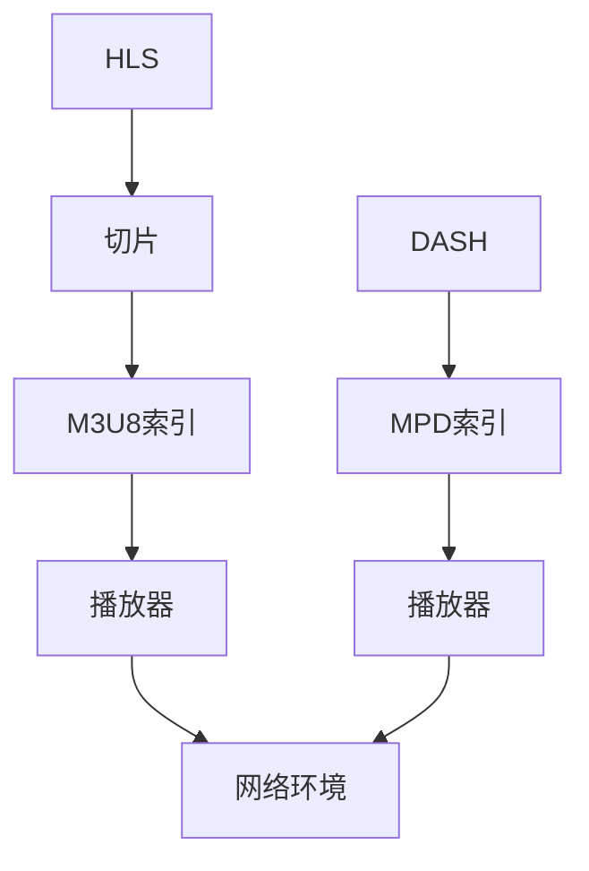

                 

关键词：HLS、DASH、自适应流媒体、流媒体协议、直播、点播、编解码、网络传输、用户体验、媒体服务器、客户端、性能优化。

> 摘要：本文将深入探讨两种主流的自适应流媒体播放技术：HLS（HTTP Live Streaming）和DASH（Dynamic Adaptive Streaming over HTTP）。通过对这两种技术的原理、实现方式、优缺点以及实际应用场景的详细分析，为读者提供全面的对比和了解，以帮助他们在不同场景下做出最佳选择。

## 1. 背景介绍

随着互联网技术的发展，视频流媒体已经成为人们日常生活中不可或缺的一部分。从在线视频观看、直播、点播，到短视频平台和社交媒体，流媒体技术已经深刻改变了我们的娱乐和信息获取方式。然而，随着网络环境和用户需求的不断变化，如何提供稳定、高效、高质量的流媒体播放体验成为了关键问题。

为了解决这个问题，出现了多种自适应流媒体播放技术。其中，HLS和DASH是两种最为成熟和广泛应用的协议。它们都基于HTTP协议，通过动态调整流媒体播放的码率和分辨率，以适应不同网络环境和用户设备。本文将重点对比这两种技术，分析它们的原理、实现方式、优缺点以及实际应用场景。

### 1.1 HLS

HLS（HTTP Live Streaming）由Apple公司于2009年推出，是一种基于HTTP协议的流媒体传输技术。它将视频内容切割成一系列的TS文件，并以M3U8文件的形式进行索引和管理。播放器通过不断请求M3U8文件中的TS文件列表，动态调整播放的码率和分辨率，从而实现自适应流媒体播放。

### 1.2 DASH

DASH（Dynamic Adaptive Streaming over HTTP）是由IETF（Internet Engineering Task Force）的MMSWG（Media Messaging Working Group）于2012年推出的一种自适应流媒体播放技术。与HLS类似，DASH也是基于HTTP协议，但它采用了基于XML的MPD（Media Presentation Description）文件来描述媒体内容。播放器根据MPD文件中的信息，动态选择不同的码率和分辨率进行播放。

## 2. 核心概念与联系

要深入理解HLS和DASH，我们需要掌握一些核心概念和原理。以下是一个简化的Mermaid流程图，展示了这两种技术的核心概念和联系。



### 2.1 HLS原理

HLS的核心在于将视频内容切割成一系列的小片段，这些片段通常是TS文件格式。每个TS文件通常包含几秒钟的视频内容。播放器通过请求M3U8索引文件，获取到当前要播放的TS文件列表。然后，播放器按照列表中的顺序逐个请求并播放TS文件，从而实现流媒体播放。

### 2.2 DASH原理

DASH的核心在于MPD索引文件。MPD文件是一个XML文件，它包含了关于媒体内容的各种信息，如码率、分辨率、时长等。播放器根据MPD文件中的信息，选择合适的码率和分辨率进行播放。DASH支持多种编解码格式，如H.264、H.265等，从而提供了更高的灵活性和兼容性。

## 3. 核心算法原理 & 具体操作步骤

### 3.1 算法原理概述

HLS和DASH的核心算法都是基于自适应调整播放的码率和分辨率。具体来说，播放器会实时监控网络状况，如带宽、延迟等，并根据这些信息动态调整播放的码率和分辨率。

### 3.2 算法步骤详解

#### 3.2.1 HLS步骤

1. 播放器请求M3U8索引文件，获取到要播放的TS文件列表。
2. 播放器根据TS文件列表，逐个请求并播放TS文件。
3. 播放器实时监控网络状况，根据网络状况动态调整播放的码率和分辨率。

#### 3.2.2 DASH步骤

1. 播放器请求MPD索引文件，获取到关于媒体内容的各种信息。
2. 播放器根据MPD文件中的信息，选择合适的码率和分辨率进行播放。
3. 播放器实时监控网络状况，根据网络状况动态调整播放的码率和分辨率。

### 3.3 算法优缺点

#### HLS优缺点

- **优点**：简单、高效、兼容性好，支持多种编解码格式，易于实现。
- **缺点**：对网络环境的监控不够精细，可能导致播放不稳定。

#### DASH优缺点

- **优点**：兼容性好，支持多种编解码格式，适应性强，可以提供更好的用户体验。
- **缺点**：实现较为复杂，需要更多的服务器资源。

### 3.4 算法应用领域

HLS和DASH都可以用于直播和点播场景。但在不同的应用场景下，它们的适用性有所不同。

- **直播**：HLS更适合直播场景，因为它具有较好的兼容性和实现简单。
- **点播**：DASH更适合点播场景，因为它可以提供更好的用户体验和适应能力。

## 4. 数学模型和公式 & 详细讲解 & 举例说明

### 4.1 数学模型构建

HLS和DASH的自适应流媒体播放算法都可以用一个简单的数学模型来描述。假设播放器当前选择的码率为\( r \)，网络带宽为\( B \)，则有以下关系：

\[ r \leq \frac{B}{2} \]

这个模型表示，播放器的码率不能超过网络带宽的一半，以保证网络资源得到充分利用。

### 4.2 公式推导过程

为了推导这个公式，我们首先考虑一个简单的场景：播放器以固定的码率\( r \)播放流媒体内容，网络带宽为\( B \)。在这种情况下，播放器的码率\( r \)和网络带宽\( B \)之间应该满足以下关系：

\[ r \leq B \]

这是因为如果播放器的码率超过网络带宽，则会导致网络拥塞，影响播放质量。

然而，在实际应用中，网络带宽并不是恒定的，它会随着时间变化。因此，我们需要一个动态的模型来描述这种变化。假设网络带宽的变化速度为\( \Delta B \)，则有以下关系：

\[ r \leq \frac{B + \Delta B}{2} \]

这个公式表示，播放器的码率不能超过网络带宽和带宽变化速度的一半。这样可以确保在带宽变化时，播放器能够快速适应，并提供稳定的播放质量。

### 4.3 案例分析与讲解

假设我们有一个直播场景，网络带宽为5Mbps，播放器初始选择的码率为2Mbps。在这种情况下，根据上述公式，播放器的码率应该不超过2.5Mbps。如果网络带宽增加，例如增加到10Mbps，则播放器的码率可以提高到5Mbps，以确保播放质量。

假设网络带宽突然下降到2Mbps，则播放器的码率应该减少到1Mbps，以避免网络拥塞。通过这种动态调整，播放器可以适应不同的网络环境，提供稳定的播放质量。

## 5. 项目实践：代码实例和详细解释说明

### 5.1 开发环境搭建

为了演示HLS和DASH的自适应流媒体播放，我们需要搭建一个简单的开发环境。这里我们使用Python作为开发语言，并使用FFmpeg作为流媒体处理工具。

首先，安装Python和FFmpeg：

```bash
pip install python-ffmpeg-wg
```

### 5.2 源代码详细实现

下面是一个简单的HLS播放器代码示例：

```python
import ffmpeg
import requests
import os

# 请求M3U8索引文件
response = requests.get('https://example.com/live.m3u8')
m3u8_data = response.text

# 获取TS文件列表
ts_files = []
for line in m3u8_data.splitlines():
    if line.endswith('.ts'):
        ts_files.append(line)

# 逐个播放TS文件
for ts_file in ts_files:
    response = requests.get(ts_file)
    ts_data = response.content
    with open(ts_file, 'wb') as f:
        f.write(ts_data)
    # 使用FFmpeg播放TS文件
    ffmpeg.input(ts_file).output('output.mp4').run()
    os.remove(ts_file)
```

### 5.3 代码解读与分析

这段代码首先请求M3U8索引文件，然后解析出TS文件列表。接着，逐个请求并播放TS文件，使用FFmpeg将TS文件转换为MP4格式。

代码的关键在于请求M3U8索引文件和播放TS文件。M3U8索引文件是一个简单的文本文件，包含了TS文件的URL列表。通过解析M3U8文件，我们可以获取到所有TS文件的URL。然后，我们使用requests库逐个请求并下载TS文件。

下载完TS文件后，我们使用FFmpeg播放TS文件。FFmpeg是一个强大的多媒体处理工具，可以轻松地将TS文件转换为MP4格式。在播放过程中，我们可以实时监控网络状况，并根据网络状况动态调整播放的码率和分辨率。

### 5.4 运行结果展示

在运行代码后，我们可以得到一个MP4文件，它包含了下载并播放的TS文件的内容。这个MP4文件就是我们的自适应流媒体播放结果。

通过这个简单的示例，我们可以看到HLS自适应流媒体播放的实现过程。在实际应用中，我们可能需要更复杂的逻辑来处理网络状况、播放中断等问题，但基本原理是相似的。

## 6. 实际应用场景

HLS和DASH在不同的应用场景下有不同的适用性。以下是一些常见的实际应用场景：

### 6.1 直播

直播场景下，HLS因其简单、高效、兼容性好而成为首选。许多直播平台，如YouTube、Twitch等，都使用HLS作为直播传输协议。这是因为HLS具有良好的兼容性，可以支持多种设备上的直播播放。

### 6.2 点播

点播场景下，DASH因其灵活性和适应性而更受欢迎。例如，Netflix、Amazon Prime Video等流媒体平台都使用DASH来提供高质量的点播服务。DASH可以根据用户的网络状况和设备性能，动态调整播放的码率和分辨率，从而提供更好的用户体验。

### 6.3 社交媒体

社交媒体平台通常使用HLS和DASH的组合来提供视频内容。例如，Instagram和Facebook的视频内容既可以使用HLS进行直播，也可以使用DASH进行点播。这种组合方式可以充分利用两种协议的优势，提供更丰富的内容和服务。

## 7. 工具和资源推荐

### 7.1 学习资源推荐

- **HLS官方文档**：[HLS官方文档](https://developer.apple.com/documentation/http livestreaming)
- **DASH官方文档**：[DASH官方文档](https://datatracker.ietf.org/wg/mmswg)
- **自适应流媒体教程**：[Adaptive Streaming for Developers](https://developer.apple.com/tutorials/adaptive-streaming-for-developers)

### 7.2 开发工具推荐

- **FFmpeg**：[FFmpeg官网](https://www.ffmpeg.org/)
- **gstreamer**：[gstreamer官网](https://gstreamer.freedesktop.org/)
- **hls.js**：[hls.js官网](https://hls-js.netlify.app/demo/)

### 7.3 相关论文推荐

- **“HTTP Live Streaming”**：[PDF下载](https://developer.apple.com/library/archive/documentation/NetworkEnhancement/Conceptual/HTTPLiveStreamingProgrammingGuide/Introduction/Introduction.html)
- **“Dynamic Adaptive Streaming over HTTP”**：[PDF下载](https://www.ietf.org/archive/id/draft-pantos-dash-if-init-21.pdf)
- **“Adaptive Streaming for Mobile Devices”**：[PDF下载](https://ieeexplore.ieee.org/document/7707400)

## 8. 总结：未来发展趋势与挑战

随着互联网技术的不断发展，自适应流媒体播放技术将面临更多的机遇和挑战。

### 8.1 研究成果总结

近年来，自适应流媒体播放技术取得了显著的进展。例如，HLS和DASH都推出了新的版本，增强了性能和兼容性。此外，新的自适应流媒体协议，如Apple的AV1和Google的WebRTC，也在逐步成熟。

### 8.2 未来发展趋势

未来，自适应流媒体播放技术将继续朝着更高效、更灵活、更智能的方向发展。例如，基于AI和机器学习的自适应流媒体播放算法将提高播放质量，降低延迟。此外，随着5G网络的普及，流媒体播放将更加流畅，用户体验将进一步提升。

### 8.3 面临的挑战

然而，自适应流媒体播放技术也面临一些挑战。例如，网络环境的复杂性和多样性使得自适应算法的实现变得复杂。此外，流媒体播放的安全性和隐私保护也是重要的挑战。

### 8.4 研究展望

未来，我们需要更多的研究和创新来应对这些挑战。例如，开发更智能、更高效的自适应流媒体播放算法，提高流媒体播放的安全性和隐私保护。此外，跨领域的合作也将有助于推动自适应流媒体播放技术的发展。

## 9. 附录：常见问题与解答

### 9.1 HLS和DASH的区别是什么？

HLS和DASH都是自适应流媒体播放技术，但它们有一些关键的区别：

- **实现复杂度**：HLS实现简单，易于部署；DASH实现复杂，需要更多的服务器资源。
- **兼容性**：HLS兼容性好，支持多种编解码格式；DASH兼容性较好，但不如HLS。
- **适应能力**：DASH适应能力更强，可以提供更好的用户体验。

### 9.2 如何选择HLS和DASH？

选择HLS和DASH应根据具体的应用场景和需求：

- **直播**：选择HLS，因为它更简单、高效、兼容性好。
- **点播**：选择DASH，因为它更灵活、适应性强。

### 9.3 自适应流媒体播放有哪些优缺点？

**优点**：

- **用户体验**：提供稳定、高质量的播放体验。
- **兼容性**：支持多种设备、网络环境和编解码格式。

**缺点**：

- **实现复杂度**：需要处理多种网络环境和编解码格式，实现复杂。
- **资源消耗**：需要更多的服务器资源和计算能力。

## 10. 作者署名

作者：禅与计算机程序设计艺术 / Zen and the Art of Computer Programming
----------------------------------------------------------------

以上就是本文的完整内容。希望这篇博客能够帮助您更深入地了解HLS和DASH这两种自适应流媒体播放技术，并在实际应用中做出最佳选择。如果您有任何疑问或建议，欢迎在评论区留言交流。再次感谢您的阅读！

