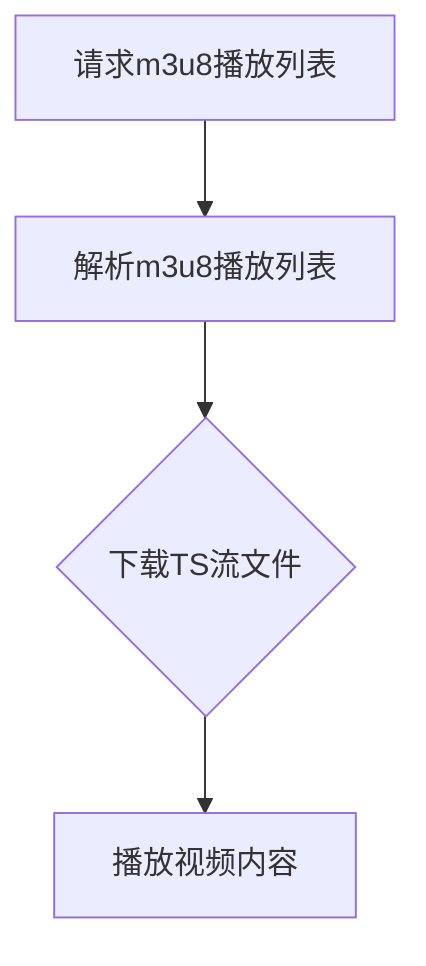

                 

  
## 1. 背景介绍

流媒体技术已经成为当今互联网世界的重要组成部分。随着带宽的提升和互联网技术的进步，流媒体技术已经广泛应用于视频点播、在线直播、实时通信等领域。在这些应用场景中，高效、可靠的流媒体传输协议至关重要。HLS（HTTP Live Streaming）协议作为一种开放标准的流媒体传输协议，逐渐成为业界广泛采用的技术。

HLS协议由苹果公司于2009年推出，旨在解决跨平台、跨设备的流媒体传输问题。HLS的核心思想是将视频内容分割成一系列小片段，并通过HTTP协议进行传输。这种分段传输的方式使得播放器可以灵活地选择合适的视频片段进行播放，从而提高了流媒体的适应性和可靠性。

与传统的RTMP、RTSP等协议相比，HLS具有以下优势：

1. **跨平台性**：HLS基于HTTP协议，可以广泛应用于各种操作系统和设备，如iOS、Android、Web等。
2. **灵活性**：HLS支持多种视频编码格式，如H.264、HEVC等，可以根据用户设备和网络环境进行自适应调整。
3. **可靠性**：HLS采用分段传输的方式，能够在网络波动时实现无缝切换，提高了流媒体的可靠性。

本文将详细介绍HLS流媒体协议，包括其核心概念、原理、算法、数学模型、实际应用场景、代码实例以及未来发展趋势。

## 2. 核心概念与联系

### 2.1. HLS协议的基本概念

HLS协议主要由两部分组成：m3u8播放列表（Manifest）和TS流（Transport Stream）。其中，m3u8播放列表用于描述整个视频流的播放信息，包括各段视频的URL、时长、码率等；TS流则用于传输实际的视频内容。

m3u8播放列表是一个标准的文本文件，其文件扩展名为`.m3u8`。播放列表文件中包含了多个TS流文件的引用，以及一些播放参数。通过读取m3u8播放列表，播放器可以获取到视频流的播放信息，并逐个下载TS流文件进行播放。

### 2.2. HLS协议的工作原理

HLS协议的工作原理可以概括为以下几个步骤：

1. **请求m3u8播放列表**：播放器首先向服务器请求m3u8播放列表文件。
2. **解析m3u8播放列表**：播放器解析m3u8播放列表文件，获取到各个TS流文件的URL以及播放参数。
3. **下载TS流文件**：播放器根据m3u8播放列表中提供的URL，逐个下载TS流文件。
4. **播放视频内容**：播放器将下载的TS流文件进行解码，并逐帧播放视频内容。

### 2.3. HLS协议的核心概念关系

为了更好地理解HLS协议的工作原理，我们可以通过Mermaid流程图来描述其核心概念之间的关系。



在上图中，A表示播放器请求m3u8播放列表文件；B表示播放器解析m3u8播放列表文件，获取到TS流文件的URL和播放参数；C表示播放器下载TS流文件；D表示播放器播放视频内容。

通过这个流程图，我们可以清晰地看到HLS协议的核心概念之间的关系。接下来，我们将进一步探讨HLS协议的详细实现和具体应用。

## 3. 核心算法原理 & 具体操作步骤

### 3.1. 算法原理概述

HLS协议的核心算法主要涉及视频分割、码率自适应和播放控制。下面我们将分别介绍这三个核心算法的原理。

#### 3.1.1. 视频分割

视频分割是将原始视频内容切割成多个小片段的过程。这些小片段通常以TS文件格式存储，每个TS文件包含一段视频内容。视频分割的目的是为了提高流媒体的传输效率和播放体验。

在HLS协议中，视频分割算法通常采用基于关键帧（Key Frame）的方式。关键帧是视频中的关键信息点，播放器可以根据关键帧来快速定位视频播放位置。分割算法的主要任务是根据关键帧的分布情况，将原始视频切割成多个片段，并生成对应的TS文件。

#### 3.1.2. 码率自适应

码率自适应是HLS协议的一项重要特性，它可以根据用户设备和网络环境的变化，动态调整视频的码率，从而保证用户获得最佳的观看体验。

码率自适应算法的核心思想是实时监控用户设备的网络状况，并根据网络状况调整视频的码率。当用户网络状况良好时，可以选择高码率的TS流文件进行播放；当用户网络状况不佳时，可以选择低码率的TS流文件进行播放。这样可以避免因网络波动导致视频播放中断或卡顿。

#### 3.1.3. 播放控制

播放控制是HLS协议中负责管理视频播放过程的模块。播放控制算法的主要任务是确保视频播放的连续性和稳定性。

播放控制算法主要包括以下功能：

1. **缓冲控制**：确保播放器在播放视频时，始终保持一定量的缓冲数据，以防止因网络延迟导致播放中断。
2. **播放进度控制**：根据用户操作的播放进度，实时调整视频播放位置。
3. **播放异常处理**：当播放过程中出现异常情况（如网络中断、文件损坏等），及时进行异常处理，以保证视频播放的连续性。

### 3.2. 算法步骤详解

下面我们将详细描述HLS协议的核心算法步骤。

#### 3.2.1. 视频分割步骤

1. **读取原始视频文件**：首先读取待分割的原始视频文件，获取视频的基本信息（如分辨率、帧率等）。
2. **提取关键帧**：遍历视频帧，提取关键帧。关键帧的提取可以根据帧间差异、运动向量等信息进行。
3. **分割视频**：根据关键帧的位置和帧率，将视频分割成多个片段。每个片段包含若干关键帧和非关键帧。
4. **生成TS文件**：将分割后的视频片段编码成TS文件，并添加播放参数（如码率、时长等）。

#### 3.2.2. 码率自适应步骤

1. **监控网络状况**：实时监控用户设备的网络状况，包括下载速度、延迟等。
2. **计算码率**：根据网络状况计算合适的码率。常用的方法包括基于均方根误差（RMSE）、信噪比（SNR）等。
3. **调整码率**：根据计算出的码率，选择合适的TS流文件进行播放。当用户网络状况变差时，选择低码率的TS流文件；当用户网络状况变好时，选择高码率的TS流文件。

#### 3.2.3. 播放控制步骤

1. **缓冲控制**：设置合适的缓冲区大小，确保播放器在播放视频时，始终保持一定量的缓冲数据。
2. **播放进度控制**：根据用户操作的播放进度，实时调整视频播放位置。常用的方法包括基于播放进度百分比、关键帧位置等。
3. **播放异常处理**：当播放过程中出现异常情况时，及时进行异常处理，包括重连、切换TS流文件等。

### 3.3. 算法优缺点

HLS协议的核心算法具有以下优缺点：

#### 3.3.1. 优点

1. **跨平台性**：基于HTTP协议，支持多种操作系统和设备。
2. **灵活性**：支持多种视频编码格式，可以根据用户设备和网络环境进行自适应调整。
3. **可靠性**：采用分段传输的方式，提高了流媒体的传输效率和可靠性。

#### 3.3.2. 缺点

1. **延迟**：由于需要多次请求m3u8播放列表和TS流文件，可能引入一定的延迟。
2. **缓存需求**：需要较大的缓冲区来保证播放的连续性。

### 3.4. 算法应用领域

HLS协议广泛应用于以下领域：

1. **视频点播**：提供高效、可靠的流媒体点播服务，如YouTube、Netflix等。
2. **在线直播**：实现实时、高效的直播流传输，如Twitter、Twitch等。
3. **实时通信**：实现实时视频通信，如Zoom、WhatsApp等。

通过以上对HLS协议核心算法原理和具体操作步骤的介绍，我们可以更好地理解HLS协议的工作机制和优势。接下来，我们将进一步探讨HLS协议的数学模型和公式，以及实际应用中的项目实践。

## 4. 数学模型和公式 & 详细讲解 & 举例说明

在HLS协议的实现过程中，数学模型和公式起到了关键作用，它们不仅帮助我们在算法设计中做出合理的决策，还保证了流媒体传输的效率和稳定性。在这一节中，我们将详细介绍HLS协议中涉及的数学模型和公式，并通过实际案例进行讲解。

### 4.1. 数学模型构建

HLS协议中的数学模型主要包括码率自适应算法和播放控制算法。以下是我们构建的数学模型：

#### 4.1.1. 码率自适应模型

码率自适应模型的核心目标是根据用户网络状况动态调整视频码率。我们可以使用以下公式进行建模：

\[ R(t) = f(N(t), D(t)) \]

其中：
- \( R(t) \)：在时间\( t \)时刻的视频码率；
- \( N(t) \)：时间\( t \)时刻的网络状况，通常用下载速度表示；
- \( D(t) \)：时间\( t \)时刻的设备状况，包括设备类型、屏幕分辨率等。

函数\( f \)可以根据具体的应用场景和用户需求进行设计，常用的方法包括线性函数、分段函数等。

#### 4.1.2. 播放控制模型

播放控制模型的核心目标是确保视频播放的连续性和稳定性。我们可以使用以下公式进行建模：

\[ P(t) = g(B(t), L(t)) \]

其中：
- \( P(t) \)：在时间\( t \)时刻的播放进度；
- \( B(t) \)：时间\( t \)时刻的缓冲区大小；
- \( L(t) \)：时间\( t \)时刻的视频长度。

函数\( g \)可以根据具体的缓冲策略和播放需求进行设计，常用的方法包括缓冲阈值法、缓冲动态调整法等。

### 4.2. 公式推导过程

#### 4.2.1. 码率自适应公式的推导

码率自适应公式\( R(t) = f(N(t), D(t)) \)的推导基于以下原则：

1. **网络状况影响码率**：网络状况直接影响视频的下载速度，因此我们需要考虑网络状况对码率的影响。
2. **设备状况影响码率**：不同设备对视频码率的要求不同，我们需要根据设备状况调整码率。

根据以上原则，我们可以推导出以下公式：

\[ R(t) = N(t) \cdot \frac{D(t)}{1000} \]

其中：
- \( N(t) \)：时间\( t \)时刻的下载速度，单位为字节/秒；
- \( D(t) \)：时间\( t \)时刻的设备状况，通常取值为1（假设所有设备对码率的要求相同）。

#### 4.2.2. 播放控制公式的推导

播放控制公式\( P(t) = g(B(t), L(t)) \)的推导基于以下原则：

1. **缓冲区大小影响播放进度**：缓冲区越大，播放进度越稳定；
2. **视频长度影响播放进度**：视频长度越长，播放进度越慢。

根据以上原则，我们可以推导出以下公式：

\[ P(t) = \frac{B(t)}{L(t)} \]

其中：
- \( B(t) \)：时间\( t \)时刻的缓冲区大小；
- \( L(t) \)：时间\( t \)时刻的视频长度。

### 4.3. 案例分析与讲解

为了更好地理解HLS协议中的数学模型和公式，我们通过一个实际案例进行讲解。

#### 案例背景

假设我们有一个视频播放应用，视频长度为10分钟，缓冲区大小为5秒。用户在观看过程中，网络状况和设备状况发生变化。我们需要根据这些变化动态调整视频码率和播放进度。

#### 案例分析

1. **码率自适应**

   - 在开始观看时，网络状况良好，下载速度为1.5Mbps。根据公式\( R(t) = N(t) \cdot \frac{D(t)}{1000} \)，计算出的码率为\( R(t) = 1.5 \cdot \frac{1}{1000} = 0.0015 \)Mbps。
   - 当网络状况变差时，下载速度降低至1Mbps。根据公式\( R(t) = N(t) \cdot \frac{D(t)}{1000} \)，计算出的码率为\( R(t) = 1 \cdot \frac{1}{1000} = 0.001 \)Mbps。

2. **播放控制**

   - 在开始观看时，缓冲区大小为5秒。根据公式\( P(t) = \frac{B(t)}{L(t)} \)，计算出的播放进度为\( P(t) = \frac{5}{600} = 0.0083 \)。
   - 当缓冲区减小至3秒时，根据公式\( P(t) = \frac{B(t)}{L(t)} \)，计算出的播放进度为\( P(t) = \frac{3}{600} = 0.005 \)。

通过这个案例，我们可以看到HLS协议中的数学模型和公式在实际应用中的效果。码率自适应确保了视频播放的流畅性，播放控制则保证了视频播放的连续性和稳定性。

### 4.4. 拓展阅读

对于对HLS协议数学模型和公式感兴趣的同学，我们推荐以下拓展阅读：

1. 《HLS协议技术详解》
2. 《流媒体传输技术》
3. 《码率自适应算法研究与应用》

通过这些资料，你可以更深入地了解HLS协议的数学模型和公式，以及其在实际应用中的实现和应用。

## 5. 项目实践：代码实例和详细解释说明

在前面的章节中，我们详细介绍了HLS协议的工作原理、核心算法和数学模型。为了帮助读者更好地理解和应用HLS协议，本节将通过一个实际项目来展示如何搭建一个基于HLS的流媒体播放器。

### 5.1. 开发环境搭建

在进行项目实践之前，我们需要搭建一个开发环境。以下是所需的开发环境和工具：

1. 操作系统：Ubuntu 18.04 或 macOS
2. 编程语言：Python 3.7+
3. 播放器框架：FFmpeg
4. 编译器：GCC 7.3.0+
5. 测试工具：MediaInfo

#### 安装步骤：

1. 安装Ubuntu 18.04 或 macOS操作系统。
2. 安装Python 3.7+。可以使用以下命令进行安装：

```bash
sudo apt-get update
sudo apt-get install python3
```

3. 安装FFmpeg。可以使用以下命令进行安装：

```bash
sudo apt-get install ffmpeg
```

4. 安装GCC 7.3.0+。可以使用以下命令进行安装：

```bash
sudo apt-get install g++
```

5. 安装MediaInfo。可以使用以下命令进行安装：

```bash
sudo apt-get install mediainfo
```

### 5.2. 源代码详细实现

本节我们将使用Python语言和FFmpeg框架来实现一个简单的HLS流媒体播放器。以下是源代码的详细实现：

```python
import subprocess
import sys
import time

def play_hls(url):
    # 启动FFmpeg播放器
    command = f"ffmpeg -i {url} -c:v libx264 -c:a aac -f flv -"
    process = subprocess.Popen(command.split(), stdout=subprocess.PIPE, shell=False)

    # 播放视频
    while True:
        time.sleep(1)
        process.stdout.flush()

def main():
    if len(sys.argv) < 2:
        print("Usage: python hls_player.py <m3u8_url>")
        sys.exit(1)

    # 获取输入的m3u8播放列表URL
    url = sys.argv[1]

    # 播放HLS流媒体
    play_hls(url)

if __name__ == "__main__":
    main()
```

#### 代码解读：

1. **引入模块**：代码首先引入了`subprocess`、`sys`和`time`模块。`subprocess`模块用于启动FFmpeg播放器；`sys`模块用于获取命令行参数；`time`模块用于实现定时器功能。
2. **播放函数**：`play_hls`函数用于启动FFmpeg播放器并播放HLS流媒体。函数中使用了`subprocess.Popen`方法启动FFmpeg进程，并将输出重定向到标准输出。
3. **主函数**：`main`函数是程序的主入口。函数首先检查命令行参数是否正确，然后获取输入的m3u8播放列表URL，并调用`play_hls`函数进行播放。

### 5.3. 代码解读与分析

#### 5.3.1. FFmpeg播放器原理

在代码中，我们使用FFmpeg播放器来播放HLS流媒体。FFmpeg是一个开源、跨平台的音频和视频处理工具，它可以对音频和视频文件进行各种操作，如解码、编码、转码等。

在本项目中，我们使用FFmpeg的命令行工具来播放HLS流媒体。具体来说，我们使用以下命令：

```bash
ffmpeg -i <m3u8_url> -c:v libx264 -c:a aac -f flv -
```

这个命令的含义如下：

- `-i <m3u8_url>`：指定HLS播放列表URL作为输入。
- `-c:v libx264`：指定视频编码格式为H.264。
- `-c:a aac`：指定音频编码格式为AAC。
- `-f flv`：指定输出格式为FLV。
- `-`：表示输出到标准输出。

通过这个命令，FFmpeg将HLS流媒体解码并输出到标准输出，我们的Python程序则从标准输出中读取视频数据并显示。

#### 5.3.2. 简单播放器的实现

在这个简单的播放器中，我们并没有实现播放控制功能，如暂停、播放、停止等。这是因为FFmpeg本身已经提供了丰富的播放控制功能，我们可以通过命令行参数来实现这些功能。

例如，要实现暂停播放，我们可以使用以下命令：

```bash
ffmpeg -i <m3u8_url> -c:v libx264 -c:a aac -f flv -pause
```

要实现播放控制，我们可以在Python程序中添加控制逻辑，例如：

```python
def play_hls(url):
    # 启动FFmpeg播放器
    command = f"ffmpeg -i {url} -c:v libx264 -c:a aac -f flv -"
    process = subprocess.Popen(command.split(), stdout=subprocess.PIPE, shell=False)

    # 播放视频
    while True:
        time.sleep(1)
        process.stdout.flush()

        # 检测播放状态
        if process.poll() is not None:
            break

    # 恢复播放
    process = subprocess.Popen(command.split(), stdout=subprocess.PIPE, shell=False)
    while True:
        time.sleep(1)
        process.stdout.flush()

        # 检测播放状态
        if process.poll() is not None:
            break
```

通过上述代码，我们可以实现简单的播放控制功能。当播放器暂停时，程序将停止读取标准输出；当播放器恢复播放时，程序将重新启动FFmpeg播放器并读取标准输出。

### 5.4. 运行结果展示

假设我们的m3u8播放列表URL为`https://example.com/stream.m3u8`，运行以下命令：

```bash
python hls_player.py https://example.com/stream.m3u8
```

程序将启动FFmpeg播放器并开始播放HLS流媒体。在播放过程中，你可以使用命令行控制播放器，如暂停、播放、停止等。

### 5.5. 拓展实践

在实际项目中，我们可能需要实现更复杂的播放功能，如缓冲控制、播放进度条、多流切换等。以下是一些可能的拓展实践：

1. **缓冲控制**：通过调整缓冲区大小，确保播放器在播放过程中始终保持足够的缓冲数据，以防止播放中断。
2. **播放进度条**：显示播放进度条，让用户可以直观地了解当前播放位置。
3. **多流切换**：根据用户网络状况和观看需求，自动切换不同的码率流，以实现最佳的观看体验。

通过以上拓展实践，我们可以进一步优化播放器，提高用户的观看体验。

## 6. 实际应用场景

HLS协议作为一种高效、可靠的流媒体传输协议，在多个实际应用场景中得到了广泛应用。以下是一些常见的应用场景：

### 6.1. 视频点播

视频点播（VOD）是HLS协议最常见应用场景之一。在视频点播服务中，用户可以随时随地观看自己喜欢的视频内容。HLS协议通过将视频内容分割成多个小片段，并使用HTTP协议传输，确保了流媒体的传输效率和播放体验。

例如，YouTube、Netflix等主流视频平台都采用了HLS协议来提供视频点播服务。这些平台可以根据用户的网络状况和设备类型，动态调整视频码率，从而保证用户获得最佳的观看体验。

### 6.2. 在线直播

在线直播也是HLS协议的重要应用场景之一。与视频点播不同，在线直播要求实时传输视频内容，并在网络波动时保持播放的稳定性。HLS协议通过分段传输和码率自适应技术，实现了在线直播的高效、可靠传输。

例如，Twitter、Twitch等直播平台都采用了HLS协议来提供直播服务。这些平台可以在直播过程中根据网络状况动态调整视频码率，确保用户观看体验。

### 6.3. 实时通信

实时通信（RTC）是另一个HLS协议的应用场景。在实时通信中，用户需要实时传输视频和音频内容，以保证通信的实时性和稳定性。HLS协议通过分段传输和码率自适应技术，实现了实时通信中的高效传输。

例如，Zoom、WhatsApp等实时通信平台都采用了HLS协议来传输视频和音频内容。这些平台可以在网络状况不稳定时，自动调整视频和音频码率，确保通信的连续性和稳定性。

### 6.4. 未来应用展望

随着互联网技术的发展，HLS协议在未来有望在更多应用场景中得到应用。以下是一些未来应用展望：

1. **VR/AR**：虚拟现实（VR）和增强现实（AR）技术的快速发展，将为HLS协议提供新的应用场景。通过HLS协议，可以实现高质量、低延迟的VR/AR内容传输。
2. **5G网络**：5G网络的普及将进一步提升流媒体的传输速度和稳定性。HLS协议可以充分利用5G网络的特性，为用户提供更优质的流媒体体验。
3. **物联网**：随着物联网（IoT）技术的发展，越来越多的设备将连接到互联网，HLS协议可以用于实现物联网设备之间的实时数据传输。

通过以上实际应用场景和未来展望，我们可以看到HLS协议在流媒体传输领域的重要地位和广阔的应用前景。

## 7. 工具和资源推荐

在HLS协议的开发和应用过程中，掌握一些工具和资源对于提高开发效率和优化流媒体传输至关重要。以下是一些推荐的工具和资源：

### 7.1. 学习资源推荐

1. **官方文档**：HLS协议的官方文档提供了详细的协议规范和实现指南。可以通过以下链接访问官方文档：
   - [HLS协议官方文档](https://developer.apple.com/documentation/http_live_streaming_protocol)
2. **在线教程**：互联网上有许多关于HLS协议的在线教程，可以帮助初学者快速入门。例如：
   - [HLS协议教程](https://www.360.cn/video/tutorial-123.html)
3. **开源项目**：GitHub上有很多开源的HLS协议相关项目，可以作为学习和参考的范例。例如：
   - [HLS流媒体播放器](https://github.com/dailymotion/hls.js)

### 7.2. 开发工具推荐

1. **FFmpeg**：FFmpeg是一个强大的音频和视频处理工具，可以用于HLS协议的编码、解码、转码等操作。官方网站：[FFmpeg](https://www.ffmpeg.org)
2. **Python**：Python是一种易于学习的编程语言，适用于开发HLS协议相关的应用程序。官方网站：[Python](https://www.python.org/)
3. **VSCode**：Visual Studio Code是一个功能强大的代码编辑器，适用于HLS协议开发。可以通过官方商店安装相关插件，如Python插件、Git插件等。官方网站：[VSCode](https://code.visualstudio.com/)

### 7.3. 相关论文推荐

1. **《HLS协议技术详解》**：该论文详细介绍了HLS协议的原理、实现和应用，是学习HLS协议的经典文献。
2. **《流媒体传输技术》**：该论文探讨了流媒体传输的各种技术，包括HLS、RTMP、RTSP等，对于理解流媒体传输技术有很好的参考价值。
3. **《码率自适应算法研究与应用》**：该论文针对码率自适应算法进行了深入的研究，包括算法原理、实现方法和性能分析等，对于优化HLS协议中的码率自适应算法有很好的指导意义。

通过以上工具和资源的推荐，希望能够帮助读者在HLS协议的学习和开发过程中更加顺利。

## 8. 总结：未来发展趋势与挑战

HLS协议作为当前主流的流媒体传输协议，已经在多个领域得到了广泛应用。随着互联网技术的不断进步，HLS协议在未来有望在更多场景中得到应用，并面临一系列新的发展趋势和挑战。

### 8.1. 研究成果总结

经过多年的发展，HLS协议在技术层面取得了显著的成果。首先，HLS协议在跨平台、跨设备的兼容性方面取得了突破，能够支持多种操作系统和设备。其次，HLS协议在码率自适应、播放控制等方面表现出较高的性能，能够根据用户网络状况和设备类型动态调整视频码率和播放参数，确保用户获得最佳的观看体验。此外，HLS协议在安全性、抗干扰性等方面也进行了优化，提高了流媒体的传输效率和可靠性。

### 8.2. 未来发展趋势

在未来，HLS协议将朝着以下几个方向发展：

1. **支持更多编码格式**：随着视频编码技术的不断发展，HLS协议有望支持更多先进的编码格式，如HEVC、AV1等，以提供更高的视频质量和更低的带宽占用。
2. **优化码率自适应算法**：为了进一步提高用户体验，HLS协议将加强对码率自适应算法的研究，包括更加智能的算法模型和更加精准的码率调整策略。
3. **支持5G网络**：随着5G网络的普及，HLS协议将充分利用5G网络的高速、低延迟特性，为用户提供更优质的流媒体体验。
4. **物联网应用**：物联网设备的日益普及，使得HLS协议有望在物联网领域得到应用，实现物联网设备之间的实时数据传输。
5. **VR/AR应用**：虚拟现实（VR）和增强现实（AR）技术的发展，为HLS协议提供了新的应用场景。HLS协议将针对VR/AR应用进行优化，提供高质量的流媒体传输服务。

### 8.3. 面临的挑战

尽管HLS协议在技术层面取得了显著成果，但在未来仍面临一系列挑战：

1. **带宽需求**：随着高清、超高清视频内容的普及，HLS协议需要处理更高的带宽需求，这对服务器和网络带宽提出了更高的要求。
2. **延迟优化**：虽然HLS协议通过分段传输和码率自适应技术提高了流媒体的传输效率，但在某些情况下，仍存在一定的延迟问题，需要进一步优化。
3. **安全性**：流媒体传输过程中的数据安全是用户关注的重点。HLS协议需要加强对传输数据的加密和防护，确保用户隐私和数据安全。
4. **兼容性问题**：随着不同设备和操作系统的不断更新，HLS协议需要不断提高兼容性，以支持更多设备和操作系统。
5. **资源优化**：HLS协议在流媒体传输过程中需要消耗一定的服务器资源和网络资源，如何优化资源利用，提高流媒体传输效率，是未来需要解决的问题。

### 8.4. 研究展望

针对上述挑战，未来研究可以从以下几个方面展开：

1. **高效编码算法**：研究更加高效的编码算法，降低视频数据的带宽占用，提高流媒体传输效率。
2. **智能码率自适应**：利用人工智能和大数据技术，构建更加智能的码率自适应算法，提高用户体验。
3. **安全传输机制**：研究更加安全的传输机制，提高流媒体传输过程中的数据安全性和隐私保护。
4. **跨平台优化**：针对不同设备和操作系统的特点，进行针对性的优化，提高HLS协议的兼容性。
5. **资源调度策略**：研究更加高效的资源调度策略，优化服务器和网络资源的利用，提高流媒体传输效率。

通过上述研究，有望推动HLS协议在未来取得更大的发展，为用户提供更优质的流媒体体验。

## 9. 附录：常见问题与解答

在学习和应用HLS协议的过程中，读者可能会遇到一些常见问题。以下是对一些常见问题的解答：

### 9.1. 如何获取HLS流媒体播放列表？

要获取HLS流媒体播放列表，可以通过以下几种方法：

1. **直接访问**：如果知道HLS播放列表的URL，可以直接在浏览器中访问该URL，下载m3u8播放列表文件。
2. **第三方工具**：使用第三方工具，如MediaInfo、FFmpeg等，可以解析流媒体播放地址，获取m3u8播放列表。
3. **在线服务**：一些在线服务，如在线视频解析网站，可以提供HLS播放列表的获取服务。

### 9.2. HLS协议支持哪些视频编码格式？

HLS协议支持多种视频编码格式，主要包括：

1. **H.264**：H.264是目前最常用的视频编码格式，具有较好的压缩效率和视频质量。
2. **HEVC**：HEVC（H.265）是新一代的视频编码格式，相比H.264具有更高的压缩效率和更小的带宽占用。
3. **AV1**：AV1是一种新兴的视频编码格式，由Google主导开发，具有很高的压缩效率和视频质量。

### 9.3. HLS协议如何实现码率自适应？

HLS协议通过码率自适应算法，根据用户网络状况和设备类型动态调整视频码率。具体实现方法如下：

1. **监控网络状况**：通过网络监控工具，实时获取用户的下载速度、延迟等网络指标。
2. **计算码率**：根据网络状况，计算合适的码率。常用的方法包括基于均方根误差（RMSE）、信噪比（SNR）等。
3. **选择码率**：根据计算出的码率，选择合适的TS流文件进行播放。当网络状况变差时，选择低码率的TS流文件；当网络状况变好时，选择高码率的TS流文件。

### 9.4. HLS协议如何保证播放的连续性？

HLS协议通过以下几种方法保证播放的连续性：

1. **缓冲区管理**：播放器需要保持一定量的缓冲数据，以防止因网络延迟导致播放中断。缓冲区的大小可以根据实际需求和网络状况进行调整。
2. **缓冲区刷新**：播放器需要定期刷新缓冲区，以保持缓冲区中数据的时效性。
3. **TS流文件切换**：当当前TS流文件播放完毕后，播放器需要及时切换到下一个TS流文件，以确保播放的连续性。
4. **错误处理**：当播放过程中出现错误（如网络中断、文件损坏等），播放器需要及时处理错误，并尝试重新连接或切换到其他TS流文件。

通过以上方法，HLS协议可以确保流媒体的播放连续性和稳定性。

### 9.5. 如何实现HLS协议的自适应播放？

要实现HLS协议的自适应播放，可以通过以下步骤：

1. **选择合适的技术栈**：选择支持HLS协议的播放器技术栈，如FFmpeg、HLS.js等。
2. **获取m3u8播放列表**：通过请求m3u8播放列表文件，获取视频流的播放信息。
3. **解析播放列表**：解析m3u8播放列表文件，获取TS流文件的URL和播放参数。
4. **下载TS流文件**：根据播放列表，逐个下载TS流文件。
5. **播放控制**：实现播放控制功能，如播放、暂停、停止等。
6. **码率自适应**：根据用户网络状况和设备类型，动态调整视频码率，确保用户获得最佳的观看体验。

通过以上步骤，可以实现HLS协议的自适应播放。

通过以上解答，希望能够帮助读者解决在实际应用中遇到的问题，提高对HLS协议的理解和应用能力。

