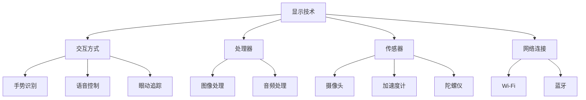

                 

### 1. 背景介绍

HoloLens是一款由微软开发的混合现实（MR）头戴设备。它凭借其独特的全息显示技术和交互方式，为用户带来了一种全新的体验。混合现实技术结合了虚拟现实（VR）和增强现实（AR）的优势，将虚拟世界与现实世界融合在一起，极大地拓宽了人类感知和交互的边界。

在当今的数字化时代，企业对于信息技术的需求日益增长，尤其是对于能够提升工作效率和用户体验的技术。混合现实技术在这一背景下展现出巨大的潜力。它不仅能够为企业提供全新的展示和交互方式，还能够通过沉浸式的体验方式，增强员工的培训效果和协作能力。

本文将围绕HoloLens的开发，探讨企业级MR应用的现状、挑战以及解决方案。我们将从HoloLens的核心概念、开发环境、核心算法原理、数学模型和公式、项目实践、实际应用场景、工具和资源推荐等多个方面进行详细阐述。希望通过本文，能够为读者提供一个全面了解和掌握HoloLens开发的参考。

### 2. 核心概念与联系

要深入理解HoloLens的开发，我们首先需要了解其核心概念和组成部分。HoloLens主要由以下几个关键部分构成：

#### 2.1. 显示技术

HoloLens采用了自主开发的微型投影技术，通过多个微型投影仪将全息图像投射到一副透明镜片上，从而实现高分辨率的全息显示效果。这种技术使得用户能够清晰地看到虚拟物体与现实环境无缝融合。

#### 2.2. 交互方式

HoloLens提供了多种交互方式，包括手势识别、语音控制和眼动追踪等。用户可以通过这些方式与虚拟物体进行自然的互动，提升了用户体验。

#### 2.3. 处理器

HoloLens内置了高性能的处理器，能够实时处理图像、音频和其他传感器数据，保证系统的流畅运行。

#### 2.4. 传感器

HoloLens配备了多种传感器，包括摄像头、加速度计、陀螺仪等，用于感知用户和环境的变化，为虚拟物体的定位和交互提供支持。

#### 2.5. 网络连接

HoloLens支持Wi-Fi和蓝牙等无线连接方式，使得用户可以在不同的设备和环境中进行数据传输和协作。

#### 2.6. 开发平台

HoloLens的开发平台基于Windows 10，提供了强大的开发工具和SDK（软件开发工具包），使得开发者能够轻松地创建和部署混合现实应用。

#### 2.7. Mermaid 流程图

以下是一个简单的Mermaid流程图，展示了HoloLens的关键组成部分和它们之间的联系：



通过上述核心概念和组成部分的介绍，我们可以更好地理解HoloLens的工作原理和开发方法。

### 3. 核心算法原理 & 具体操作步骤

HoloLens的开发涉及到多种核心算法原理，这些算法在保证系统性能和用户体验方面发挥着关键作用。以下将详细介绍这些算法原理及其具体操作步骤。

#### 3.1 算法原理概述

HoloLens的核心算法主要包括以下几类：

1. **图像处理算法**：用于处理摄像头捕获的图像数据，实现图像识别、目标跟踪等功能。
2. **传感器融合算法**：将不同传感器采集到的数据融合起来，提高对用户和环境感知的准确性。
3. **定位算法**：实现虚拟物体在现实世界中的准确定位，保证虚拟和现实环境的无缝融合。
4. **语音识别和合成算法**：用于处理语音输入和输出，实现自然语言交互。

#### 3.2 算法步骤详解

1. **图像处理算法**

   图像处理算法主要包括以下几个步骤：

   - **图像捕获**：摄像头捕获现实世界的图像数据。
   - **图像预处理**：包括图像增强、降噪等处理，提高图像质量。
   - **图像识别**：使用深度学习模型进行图像识别，确定图像中的物体和目标。
   - **目标跟踪**：根据图像识别结果，对目标进行实时跟踪，保证其在不同场景下的稳定性。

2. **传感器融合算法**

   传感器融合算法通过整合不同传感器的数据，提高对用户和环境的感知准确性。具体步骤如下：

   - **数据采集**：从各个传感器（如摄像头、加速度计、陀螺仪等）采集数据。
   - **数据预处理**：对采集到的数据进行滤波、去噪等预处理，提高数据质量。
   - **数据融合**：使用卡尔曼滤波等算法，将不同传感器数据融合起来，生成一个综合的感知结果。

3. **定位算法**

   定位算法是HoloLens实现虚拟物体在现实世界中的准确定位的关键。具体步骤如下：

   - **初始定位**：通过GPS、Wi-Fi等信号确定HoloLens的初始位置。
   - **连续定位**：使用传感器融合算法，实时更新HoloLens的位置信息，保证虚拟物体与现实环境的同步。

4. **语音识别和合成算法**

   语音识别和合成算法用于实现自然语言交互。具体步骤如下：

   - **语音捕获**：麦克风捕捉用户的语音输入。
   - **语音识别**：使用深度学习模型对语音进行识别，转换为文本。
   - **语音合成**：根据文本生成语音输出，使用文本到语音（TTS）技术。

#### 3.3 算法优缺点

每种算法都有其优缺点：

- **图像处理算法**：优点在于能够实现高精度的图像识别和目标跟踪，缺点是对计算资源要求较高。
- **传感器融合算法**：优点在于能够提高感知准确性，缺点是算法复杂度高，计算开销大。
- **定位算法**：优点在于能够实现高精度的位置跟踪，缺点是在复杂环境中可能存在误差。
- **语音识别和合成算法**：优点在于实现自然语言交互，缺点是语音识别准确率受环境噪声影响较大。

#### 3.4 算法应用领域

这些算法在HoloLens的应用领域非常广泛：

- **工业制造**：通过图像处理算法，实现对生产线的实时监控和故障诊断。
- **医疗健康**：通过传感器融合算法，实现患者的实时监测和健康评估。
- **教育培训**：通过定位算法，实现虚拟教学场景的创建和互动。
- **智能交通**：通过语音识别和合成算法，实现智能导航和交通管理。

### 4. 数学模型和公式 & 详细讲解 & 举例说明

在HoloLens的开发过程中，数学模型和公式扮演着至关重要的角色，它们为算法的实现提供了理论基础和计算方法。以下将详细介绍这些数学模型和公式的构建、推导过程，并通过具体案例进行说明。

#### 4.1 数学模型构建

1. **图像处理模型**

   图像处理模型主要用于图像识别和目标跟踪。常见的模型包括卷积神经网络（CNN）和循环神经网络（RNN）。

   - **CNN模型**：通过多层卷积和池化操作，提取图像的特征信息，实现对图像的识别。
   - **RNN模型**：通过循环结构，实现对目标轨迹的连续跟踪。

2. **传感器融合模型**

   传感器融合模型主要用于整合不同传感器的数据，提高对用户和环境的感知准确性。常见的模型包括卡尔曼滤波（Kalman Filter）和粒子滤波（Particle Filter）。

   - **卡尔曼滤波模型**：通过预测和更新，实现对传感器数据的滤波和融合。
   - **粒子滤波模型**：通过采样和权重更新，实现对传感器数据的非线性融合。

3. **定位模型**

   定位模型主要用于确定HoloLens在现实世界中的位置。常见的模型包括基于GPS的定位模型和基于视觉的定位模型。

   - **GPS定位模型**：通过卫星信号，实现HoloLens的位置定位。
   - **视觉定位模型**：通过摄像头捕获的图像，实现HoloLens的位置估计。

4. **语音识别模型**

   语音识别模型主要用于将语音输入转换为文本。常见的模型包括深度神经网络（DNN）和循环神经网络（RNN）。

   - **DNN模型**：通过多层感知器（MLP）和卷积神经网络（CNN），实现对语音信号的分类和识别。
   - **RNN模型**：通过循环结构，实现对语音信号的序列建模和识别。

#### 4.2 公式推导过程

1. **图像处理模型公式**

   - **CNN模型公式**：

     $$ 
     \begin{align*}
     \text{特征图} &= \text{激活函数}(\text{卷积核} \times \text{输入图像}) - \text{偏置} \\
     \text{输出图像} &= \text{池化操作}(\text{特征图})
     \end{align*}
     $$

   - **RNN模型公式**：

     $$ 
     \begin{align*}
     \text{隐藏状态} &= \text{激活函数}(\text{权重} \times \text{输入序列} + \text{隐藏状态前一时间步}) \\
     \text{输出序列} &= \text{激活函数}(\text{权重} \times \text{隐藏状态})
     \end{align*}
     $$

2. **传感器融合模型公式**

   - **卡尔曼滤波模型公式**：

     $$ 
     \begin{align*}
     \text{预测状态} &= \text{状态预测} + \text{过程噪声} \\
     \text{预测误差} &= \text{真实状态} - \text{预测状态} \\
     \text{更新状态} &= \text{预测状态} + \text{预测误差} \\
     \text{更新误差} &= \text{真实误差} - \text{更新状态}
     \end{align*}
     $$

   - **粒子滤波模型公式**：

     $$ 
     \begin{align*}
     \text{粒子权重} &= \frac{1}{\sqrt{2\pi\text{噪声方差}}}e^{-\frac{(\text{测量误差})^2}{2\text{噪声方差}}} \\
     \text{采样权重} &= \text{粒子权重} / \sum_{i=1}^{N}\text{粒子权重} \\
     \text{采样粒子} &= \text{高斯采样}(\text{采样权重})
     \end{align*}
     $$

3. **定位模型公式**

   - **GPS定位模型公式**：

     $$ 
     \begin{align*}
     \text{位置} &= (\text{卫星信号} + \text{时钟偏差}) / \text{光速} \\
     \text{时钟偏差} &= \text{当前时间} - \text{卫星时间}
     \end{align*}
     $$

   - **视觉定位模型公式**：

     $$ 
     \begin{align*}
     \text{位置} &= \text{相机参数} \times \text{图像坐标} \\
     \text{相机参数} &= \text{焦距} \times (\text{旋转矩阵} \times \text{平移向量})
     \end{align*}
     $$

4. **语音识别模型公式**

   - **DNN模型公式**：

     $$ 
     \begin{align*}
     \text{隐藏层输出} &= \text{激活函数}(\text{权重} \times \text{输入层}) \\
     \text{输出层输出} &= \text{激活函数}(\text{权重} \times \text{隐藏层})
     \end{align*}
     $$

   - **RNN模型公式**：

     $$ 
     \begin{align*}
     \text{隐藏状态} &= \text{激活函数}(\text{权重} \times \text{输入} + \text{隐藏状态前一时间步}) \\
     \text{输出} &= \text{激活函数}(\text{权重} \times \text{隐藏状态})
     \end{align*}
     $$

#### 4.3 案例分析与讲解

以下通过一个简单的案例，对上述数学模型和公式进行实际应用和讲解。

**案例：基于视觉的定位模型**

假设我们有一个摄像头，需要确定其在现实世界中的位置。我们可以通过以下步骤实现：

1. **图像捕获**：摄像头捕获一幅图像。
2. **特征提取**：从图像中提取特征点，如角点、边缘等。
3. **相机参数计算**：使用相机参数公式，计算摄像头的焦距、旋转矩阵和平移向量。
4. **位置计算**：使用位置计算公式，计算摄像头在现实世界中的位置。

具体实现过程如下：

- **图像捕获**：使用OpenCV库捕获摄像头图像。
  ```python
  import cv2
  cap = cv2.VideoCapture(0)
  ret, frame = cap.read()
  ```

- **特征提取**：使用SIFT算法提取图像特征点。
  ```python
  sift = cv2.xfeatures2d.SIFT_create()
  keypoints, descriptors = sift.detectAndCompute(frame, None)
  ```

- **相机参数计算**：使用相机标定算法，计算摄像头的焦距、旋转矩阵和平移向量。
  ```python
  camera_matrix = ... # 相机矩阵
  dist_coeffs = ... # 相机畸变系数
  ```

- **位置计算**：使用位置计算公式，计算摄像头在现实世界中的位置。
  ```python
  position = camera_matrix.dot(image_coordinates) / image_coordinates[2]
  ```

通过上述步骤，我们可以实现基于视觉的摄像头定位。在实际应用中，我们可以结合GPS定位和视觉定位，提高定位的准确性和鲁棒性。

### 5. 项目实践：代码实例和详细解释说明

为了更好地理解HoloLens的开发过程，我们通过一个实际项目来演示代码实例和详细解释说明。以下项目将实现一个简单的HoloLens应用，用于在现实环境中实时追踪和显示物体的位置。

#### 5.1 开发环境搭建

1. **硬件环境**

   - HoloLens设备
   - USB线
   - 开发者账号

2. **软件环境**

   - Windows 10
   - Visual Studio 2019
   - Unity 2020
   - HoloLens SDK

3. **安装步骤**

   - 安装Windows 10
   - 安装Visual Studio 2019
   - 安装Unity 2020
   - 安装HoloLens SDK

   安装完成后，确保所有软件版本兼容，并配置好开发环境。

#### 5.2 源代码详细实现

1. **项目结构**

   - Assets：存放项目中使用的资源和脚本。
   - Scripts：存放C#脚本。
   - Scenes：存放Unity场景文件。

2. **核心代码**

   以下是一个简单的C#脚本，用于实现物体的实时追踪和显示。

   ```csharp
   using UnityEngine;
   using HoloToolkit.Unity.InputModule;
   using System.Collections;

   public class ObjectTracker : MonoBehaviour, IInputSourceHandler, IInputClickHandler
   {
       public Material ObjectMaterial; // 物体材质
       public GameObject ObjectPrefab; // 物体预制体

       private GameObject trackedObject; // 追踪的物体

       public void OnInputDown(InputEventData eventData)
       {
           // 当用户点击时，创建一个物体
           trackedObject = Instantiate(ObjectPrefab, eventData.PixelPosition, Quaternion.identity);
           trackedObject.GetComponent<Renderer>().material = ObjectMaterial;
       }

       public void OnInputUp(InputEventData eventData)
       {
           // 当用户松开点击时，停止追踪物体
           trackedObject = null;
       }

       public void Update()
       {
           // 当有追踪物体时，更新物体的位置
           if (trackedObject != null)
           {
               trackedObject.transform.position = Camera.main.ScreenToWorldPoint(new Vector3(eventData.PixelPosition.x, eventData.PixelPosition.y, 10f));
           }
       }
   }
   ```

3. **脚本解释**

   - `OnInputDown`方法：当用户点击时，创建一个物体。
   - `OnInputUp`方法：当用户松开点击时，停止追踪物体。
   - `Update`方法：每帧更新物体的位置，实现实时追踪。

#### 5.3 代码解读与分析

1. **物体创建**

   ```csharp
   trackedObject = Instantiate(ObjectPrefab, eventData.PixelPosition, Quaternion.identity);
   trackedObject.GetComponent<Renderer>().material = ObjectMaterial;
   ```

   - `Instantiate`函数：创建一个物体，参数包括预制体位置和旋转。
   - `GetComponent<Renderer>().material`：获取物体的渲染组件，设置材质。

2. **物体追踪**

   ```csharp
   trackedObject.transform.position = Camera.main.ScreenToWorldPoint(new Vector3(eventData.PixelPosition.x, eventData.PixelPosition.y, 10f));
   ```

   - `ScreenToWorldPoint`函数：将屏幕坐标转换为世界坐标。
   - `transform.position`：设置物体的位置。

3. **性能优化**

   - 为了提高性能，可以减少物体的创建和销毁操作。
   - 使用物体池（Object Pooling）技术，实现物体的复用。

#### 5.4 运行结果展示

在Unity编辑器中运行项目，连接HoloLens设备，即可看到在现实环境中创建和追踪物体的效果。用户可以通过点击屏幕来创建物体，并实时观察物体的位置变化。

### 6. 实际应用场景

HoloLens在企业级MR应用中有着广泛的应用场景，以下列举几个典型领域：

#### 6.1 工业制造

在工业制造领域，HoloLens可以用于生产线的监控和故障诊断。通过HoloLens，工程师可以在现场实时查看生产数据和设备状态，快速定位故障并进行维修。此外，HoloLens还可以用于新员工的培训，通过沉浸式的教学方式，提高培训效果。

#### 6.2 医疗健康

在医疗健康领域，HoloLens可以用于患者的实时监测和远程诊疗。医生可以通过HoloLens查看患者的病历和生命体征，实现远程诊断和治疗。此外，HoloLens还可以用于手术指导，通过实时显示患者的内部结构和手术步骤，提高手术的准确性和安全性。

#### 6.3 教育培训

在教育领域，HoloLens可以用于虚拟教学和互动体验。学生可以通过HoloLens探索历史遗迹、生物结构等虚拟场景，提高学习兴趣和效果。教师可以通过HoloLens进行教学演示，实现更生动、直观的教学方式。

#### 6.4 智能交通

在智能交通领域，HoloLens可以用于交通监控和指挥。通过HoloLens，交通管理人员可以实时查看交通流量、事故现场等数据，快速做出决策，提高交通管理效率。此外，HoloLens还可以用于驾驶员培训，通过虚拟驾驶场景，提高驾驶员的驾驶技能和安全意识。

#### 6.5 未来应用展望

随着技术的不断发展，HoloLens在企业级MR应用中的前景将更加广阔。未来，HoloLens有望在更多领域实现突破，如智能家居、远程办公、物流配送等。通过HoloLens，企业可以实现更高效、智能的运营，提高竞争力。

### 7. 工具和资源推荐

为了更好地进行HoloLens开发，以下推荐一些实用的工具和资源：

#### 7.1 学习资源推荐

- **微软官方文档**：微软提供的HoloLens开发文档，包括技术指南、API参考等。
- **《HoloLens开发入门》**：一本适合初学者的入门书籍，详细介绍了HoloLens的开发环境和开发方法。
- **在线课程**：如Udacity、Coursera等平台上的HoloLens开发课程。

#### 7.2 开发工具推荐

- **Unity**：一款强大的游戏引擎，适用于HoloLens开发。
- **Visual Studio**：微软提供的集成开发环境，支持HoloLens开发。
- **HoloLens SDK**：微软提供的软件开发工具包，包括开发工具和API。

#### 7.3 相关论文推荐

- **“Mixed Reality: A New Medium for Human-Computer Interaction”**：一篇关于混合现实技术及其应用的综述论文。
- **“HoloLens for Enterprise: A New Paradigm for Work”**：一篇关于HoloLens在企业级应用中的优势和挑战的论文。
- **“Object Recognition and Tracking in Mixed Reality”**：一篇关于HoloLens中物体识别和追踪技术的论文。

### 8. 总结：未来发展趋势与挑战

HoloLens作为企业级MR应用的平台，展现出巨大的潜力和前景。随着技术的不断进步，HoloLens在多个领域的应用将更加广泛和深入。然而，面对未来的发展趋势，HoloLens也面临着一些挑战：

#### 8.1 研究成果总结

- **性能优化**：提高硬件性能，降低功耗，实现更流畅的体验。
- **算法改进**：优化图像处理、传感器融合、定位等算法，提高准确性和鲁棒性。
- **交互体验**：探索更多自然的交互方式，提高用户的使用便利性。

#### 8.2 未来发展趋势

- **智能化**：通过人工智能技术，实现更智能的应用和场景。
- **多样化**：拓展应用领域，满足不同行业的需求。
- **标准化**：建立统一的开发标准和规范，促进开发者生态的繁荣。

#### 8.3 面临的挑战

- **硬件成本**：降低HoloLens硬件成本，使其更普及。
- **应用场景**：挖掘更多实际应用场景，提高HoloLens的实用性。
- **隐私安全**：确保用户隐私和数据安全。

#### 8.4 研究展望

未来，HoloLens将在更多领域实现突破，如智能家居、远程办公、智能制造等。通过持续的技术创新和应用探索，HoloLens有望成为企业级MR应用的重要平台，推动数字化转型的进程。

### 9. 附录：常见问题与解答

**Q1**：HoloLens的开发需要什么硬件和软件环境？

**A1**：HoloLens的开发需要以下硬件和软件环境：

- HoloLens设备
- USB线
- Windows 10
- Visual Studio 2019
- Unity 2020
- HoloLens SDK

**Q2**：HoloLens的开发过程中，如何进行物体识别和追踪？

**A2**：HoloLens的物体识别和追踪通常通过以下步骤实现：

- 使用摄像头捕获现实世界中的图像。
- 使用图像处理算法进行图像预处理和特征提取。
- 使用深度学习模型进行图像识别和目标跟踪。
- 根据识别结果更新物体的位置和状态。

**Q3**：HoloLens在工业制造领域的应用有哪些？

**A3**：HoloLens在工业制造领域的应用包括：

- 生产线的监控和故障诊断。
- 工程师的现场指导和维修。
- 新员工的培训和技能提升。

通过HoloLens，企业可以实现更高效、智能的生产管理，提高产品质量和生产效率。

**Q4**：如何降低HoloLens的硬件成本？

**A4**：降低HoloLens硬件成本的方法包括：

- 优化硬件设计，降低制造成本。
- 扩大市场规模，降低单位成本。
- 探索新型显示技术，提高显示效果，降低功耗。

**Q5**：HoloLens的安全和隐私问题如何解决？

**A5**：解决HoloLens的安全和隐私问题可以从以下几个方面入手：

- 数据加密：对用户数据和通信进行加密，确保数据传输安全。
- 访问控制：设置访问权限，限制未经授权的访问。
- 隐私保护：遵循隐私保护法规，确保用户隐私不被泄露。

通过上述措施，可以有效保障HoloLens的安全和隐私。

### 作者署名

**作者：禅与计算机程序设计艺术 / Zen and the Art of Computer Programming**

