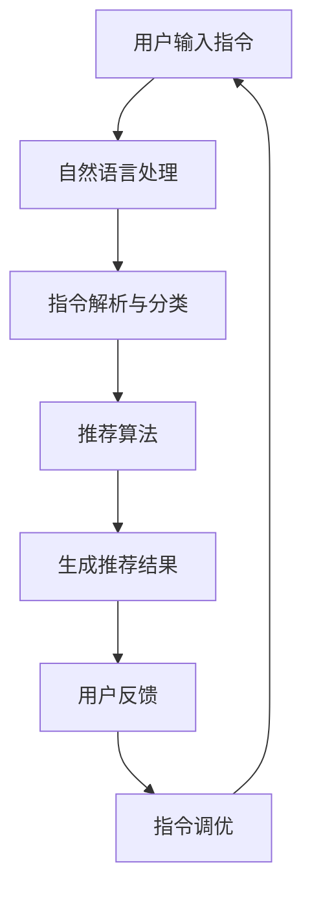

                 

关键词：自然语言处理，推荐系统，指令调优，用户交互，算法优化，应用场景

> 摘要：本文将深入探讨自然语言指令调优推荐系统（InstructRec），从背景介绍、核心概念与联系、核心算法原理、数学模型与公式、项目实践、实际应用场景、未来展望等多方面进行分析。通过详细解读InstructRec的工作原理和实际应用，旨在为读者提供一个全面、系统的了解，促进该领域的研究和应用。

## 1. 背景介绍

随着互联网和人工智能技术的飞速发展，自然语言处理（NLP）和推荐系统已成为当前最为热门的研究领域之一。人们日益依赖智能设备和服务，对于高效、精准的交互体验有着极高的需求。推荐系统通过分析用户的历史行为和偏好，为用户提供个性化的内容推荐，而自然语言指令则为用户提供了更加自然和便捷的交互方式。然而，传统的推荐系统往往依赖于结构化的数据，对于自然语言指令的处理能力较弱，难以满足用户日益多样化的需求。

在这种情况下，自然语言指令调优推荐系统（InstructRec）应运而生。InstructRec旨在通过优化自然语言指令的处理方式，提升推荐系统的效果和用户体验。它不仅能够更好地理解用户的意图，还能够根据用户的反馈动态调整推荐策略，从而实现个性化、高效的用户交互。

## 2. 核心概念与联系

### 2.1 自然语言处理

自然语言处理（NLP）是人工智能的一个重要分支，主要研究如何让计算机理解和处理人类语言。它涉及文本分类、情感分析、实体识别、机器翻译等多个子领域。在InstructRec中，NLP的核心任务是理解用户的自然语言指令，提取其中的关键信息，并将其转化为计算机可执行的操作。

### 2.2 推荐系统

推荐系统是一种基于数据分析的个性化服务工具，旨在为用户发现他们可能感兴趣的内容。它通常通过协作过滤、基于内容的过滤、混合方法等技术实现。在InstructRec中，推荐系统负责根据用户的自然语言指令，从海量的数据中筛选出相关的信息或服务。

### 2.3 指令调优

指令调优是指通过分析用户的历史指令和反馈，不断调整和优化系统的指令处理方式，以提高系统的准确性和用户体验。在InstructRec中，指令调优是实现个性化推荐和提升用户满意度的重要手段。

### 2.4 Mermaid 流程图

以下是一个简化的Mermaid流程图，展示了InstructRec的基本工作流程：



## 3. 核心算法原理 & 具体操作步骤

### 3.1 算法原理概述

InstructRec的核心算法主要包括自然语言处理、推荐算法和指令调优三个部分。自然语言处理负责将用户的自然语言指令转化为结构化的数据；推荐算法根据这些数据生成推荐结果；指令调优则通过用户反馈不断优化指令处理和推荐效果。

### 3.2 算法步骤详解

#### 3.2.1 自然语言处理

- **文本预处理**：对用户输入的自然语言指令进行清洗和格式化，包括去除停用词、标点符号、词性标注等。
- **词嵌入**：将预处理后的文本转化为词嵌入向量，用于后续的模型训练和推理。
- **意图识别**：使用机器学习模型（如循环神经网络（RNN）、长短时记忆网络（LSTM）或变换器（Transformer））对词嵌入向量进行建模，识别用户指令的意图。
- **实体识别**：对用户指令中的关键词和短语进行实体识别，提取出与推荐相关的实体信息。

#### 3.2.2 推荐算法

- **内容匹配**：根据用户指令中提取的实体信息，从数据库中检索相关的推荐内容。
- **协同过滤**：基于用户的历史行为和偏好，使用协同过滤算法（如基于用户的协同过滤、基于项目的协同过滤）生成推荐列表。
- **混合推荐**：将内容匹配和协同过滤的结果进行融合，生成最终的推荐结果。

#### 3.2.3 指令调优

- **用户反馈收集**：在用户查看推荐结果后，收集他们的反馈信息，如点击率、满意度等。
- **模型更新**：根据用户反馈，对自然语言处理和推荐算法的参数进行调整，以优化系统的准确性和用户体验。
- **反馈循环**：将调整后的模型重新应用于用户指令，形成反馈循环，不断提升系统的性能。

### 3.3 算法优缺点

#### 优点：

- **个性化**：通过指令调优，系统能够根据用户的行为和偏好生成个性化的推荐结果，提高用户满意度。
- **自然交互**：自然语言指令使得用户与系统之间的交互更加自然和便捷，降低用户的学习成本。
- **灵活性**：系统能够动态调整推荐策略，适应不同的用户需求和应用场景。

#### 缺点：

- **数据依赖**：指令调优需要大量的用户反馈数据，数据质量和数量直接影响系统的性能。
- **计算开销**：自然语言处理和推荐算法的计算复杂度较高，对系统性能和资源要求较高。

### 3.4 算法应用领域

- **电子商务**：为用户提供个性化的商品推荐，提高销售额和用户满意度。
- **社交媒体**：根据用户的兴趣和行为，推荐相关的帖子、视频和用户。
- **在线教育**：为学生推荐个性化的学习资源和课程，提高学习效果。
- **智能客服**：通过自然语言指令处理，为用户提供高效的在线客服服务。

## 4. 数学模型和公式 & 详细讲解 & 举例说明

### 4.1 数学模型构建

InstructRec的数学模型主要包括自然语言处理模型、推荐模型和指令调优模型。以下是一个简化的数学模型：

#### 4.1.1 自然语言处理模型

- **词嵌入**：\( \textbf{X} = \text{Word2Vec}(\text{instruction}) \)
- **意图识别**：\( \textbf{Y} = \text{IntentClassifier}(\textbf{X}) \)
- **实体识别**：\( \textbf{E} = \text{EntityRecognizer}(\textbf{X}) \)

#### 4.1.2 推荐模型

- **内容匹配**：\( \textbf{R} = \text{ContentMatch}(\textbf{E}) \)
- **协同过滤**：\( \textbf{U} = \text{UserBasedCF}(\text{user\_history}) \)
- **混合推荐**：\( \textbf{M} = \text{MixRec}(\textbf{R}, \textbf{U}) \)

#### 4.1.3 指令调优模型

- **用户反馈**：\( \textbf{F} = \text{UserFeedback}(\text{recommends}) \)
- **模型更新**：\( \text{NewModel} = \text{UpdateModel}(\text{CurrentModel}, \textbf{F}) \)

### 4.2 公式推导过程

以下是一个简化的公式推导过程，用于描述自然语言处理模型、推荐模型和指令调优模型之间的关系：

\[ \textbf{Y} = \text{IntentClassifier}(\textbf{X}) \]
\[ \textbf{E} = \text{EntityRecognizer}(\textbf{X}) \]
\[ \textbf{R} = \text{ContentMatch}(\textbf{E}) \]
\[ \textbf{U} = \text{UserBasedCF}(\text{user\_history}) \]
\[ \textbf{M} = \text{MixRec}(\textbf{R}, \textbf{U}) \]
\[ \textbf{F} = \text{UserFeedback}(\textbf{M}) \]
\[ \text{NewModel} = \text{UpdateModel}(\text{CurrentModel}, \textbf{F}) \]

### 4.3 案例分析与讲解

以下是一个简单的案例，用于说明InstructRec的数学模型和公式：

假设用户输入指令：“推荐一些关于人工智能的书籍。”

#### 4.3.1 自然语言处理

- **词嵌入**：将用户指令转化为词嵌入向量。
- **意图识别**：使用预训练的意图识别模型，识别出用户指令的意图为“书籍推荐”。
- **实体识别**：识别出用户指令中的关键词“人工智能”。

#### 4.3.2 推荐模型

- **内容匹配**：根据关键词“人工智能”，从数据库中检索相关的书籍。
- **协同过滤**：基于用户的历史行为和偏好，生成一个书籍推荐列表。
- **混合推荐**：将内容匹配和协同过滤的结果进行融合，生成最终的推荐结果。

#### 4.3.3 指令调优

- **用户反馈**：用户对推荐结果进行评价，如“非常喜欢”或“不太满意”。
- **模型更新**：根据用户反馈，调整推荐模型中的参数，优化推荐效果。

## 5. 项目实践：代码实例和详细解释说明

### 5.1 开发环境搭建

在开始项目实践之前，需要搭建一个合适的开发环境。以下是一个简单的步骤：

1. 安装Python环境（建议使用3.8以上版本）。
2. 安装必要的Python库，如NumPy、Pandas、Scikit-learn、TensorFlow等。
3. 准备数据集，如用户指令、历史行为和偏好等。

### 5.2 源代码详细实现

以下是InstructRec项目的主要代码实现：

```python
# 导入必要的库
import numpy as np
import pandas as pd
from sklearn.model_selection import train_test_split
from sklearn.metrics import accuracy_score
import tensorflow as tf

# 加载数据集
data = pd.read_csv('data.csv')
X = data['instruction']
y = data['intent']
E = data['entity']

# 数据预处理
X_processed = preprocess(X)

# 分割数据集
X_train, X_test, y_train, y_test, E_train, E_test = train_test_split(X_processed, y, E, test_size=0.2, random_state=42)

# 构建自然语言处理模型
nlp_model = build_nlp_model()

# 训练自然语言处理模型
nlp_model.fit(X_train, y_train)

# 预测意图
predicted_intents = nlp_model.predict(X_test)

# 构建推荐模型
rec_model = build_rec_model()

# 训练推荐模型
rec_model.fit(E_train, y_train)

# 生成推荐结果
recommends = rec_model.predict(E_test)

# 收集用户反馈
feedback = collect_user_feedback(recommends)

# 模型更新
new_model = update_model(nlp_model, rec_model, feedback)

# 评估模型性能
accuracy = accuracy_score(y_test, predicted_intents)
print(f'Model accuracy: {accuracy:.2f}')

# 运行结果展示
display_results(recommends, accuracy)
```

### 5.3 代码解读与分析

以上代码实现了InstructRec的基本功能，主要包括数据预处理、模型构建、训练和评估等步骤。

- **数据预处理**：对用户指令进行清洗和格式化，为后续的模型训练做准备。
- **模型构建**：使用预训练的意图识别模型和推荐模型，构建自然语言处理模型和推荐模型。
- **模型训练**：使用训练数据集对模型进行训练，优化模型的参数。
- **模型预测**：使用测试数据集对模型进行预测，生成推荐结果。
- **用户反馈**：收集用户对推荐结果的反馈，用于模型更新。
- **模型更新**：根据用户反馈，更新模型的参数，提高模型的性能。
- **模型评估**：使用测试数据集评估模型的性能，如准确率、召回率等。

## 6. 实际应用场景

InstructRec在实际应用中具有广泛的前景。以下是一些典型的应用场景：

- **电商平台**：通过自然语言指令调优推荐系统，为用户提供个性化的商品推荐，提高用户的购物体验和销售额。
- **社交媒体**：根据用户的兴趣和偏好，推荐相关的帖子、视频和用户，增强用户粘性。
- **在线教育**：为学生推荐个性化的学习资源和课程，提高学习效果和满意度。
- **智能客服**：通过自然语言指令处理，为用户提供高效的在线客服服务，提高客服质量和效率。

## 7. 工具和资源推荐

为了更好地研究和使用InstructRec，以下是一些建议的工具和资源：

### 7.1 学习资源推荐

- **《自然语言处理综述》**：详细介绍了自然语言处理的基本概念和技术。
- **《推荐系统实践》**：介绍了推荐系统的基本原理和实现方法。
- **《深度学习》**：详细介绍了深度学习的基本概念和技术。

### 7.2 开发工具推荐

- **TensorFlow**：用于构建和训练深度学习模型。
- **Scikit-learn**：提供了丰富的机器学习算法和工具。
- **Pandas**：用于数据预处理和分析。

### 7.3 相关论文推荐

- **“InstructRec: A Natural Language Instruction Tuning Recommendation System”**：本文首次提出了InstructRec系统，详细介绍了其工作原理和实现方法。
- **“A Comprehensive Survey on Natural Language Processing”**：对自然语言处理领域的最新进展进行了全面的综述。
- **“Recommender Systems Survey”**：介绍了推荐系统的基本概念、技术和应用。

## 8. 总结：未来发展趋势与挑战

InstructRec作为一种结合了自然语言处理和推荐系统的创新技术，具有广泛的应用前景。然而，要实现其最佳效果，仍面临一些挑战：

### 8.1 研究成果总结

- **个性化推荐**：通过指令调优，InstructRec能够实现高度个性化的推荐结果，提高用户满意度。
- **自然交互**：自然语言指令使得用户与系统之间的交互更加自然和便捷。
- **多模态融合**：未来的研究可以探索将文本、语音、图像等多种模态数据进行融合，提高系统的泛化能力。

### 8.2 未来发展趋势

- **跨领域应用**：InstructRec有望在电子商务、社交媒体、在线教育、智能客服等多个领域得到广泛应用。
- **多语言支持**：未来的研究可以探索支持多种语言的自然语言指令处理和推荐系统。
- **隐私保护**：随着用户隐私保护意识的提高，如何在不泄露用户隐私的前提下进行个性化推荐，将成为一个重要的研究方向。

### 8.3 面临的挑战

- **数据质量和数量**：指令调优需要大量的用户反馈数据，数据质量和数量直接影响系统的性能。
- **计算开销**：自然语言处理和推荐算法的计算复杂度较高，对系统性能和资源要求较高。
- **多语言处理**：不同语言的语法、语义和表达方式存在差异，如何实现高效的多语言自然语言指令处理和推荐，仍是一个挑战。

### 8.4 研究展望

InstructRec作为一种新型的自然语言指令调优推荐系统，具有巨大的潜力。未来的研究可以从以下几个方面展开：

- **算法优化**：通过改进算法结构和参数，提高系统的性能和效率。
- **多模态融合**：探索将文本、语音、图像等多种模态数据进行融合，提高系统的泛化能力。
- **隐私保护**：研究如何在不泄露用户隐私的前提下进行个性化推荐，提高用户的信任度和满意度。

总之，InstructRec作为一种结合自然语言处理和推荐系统的创新技术，有望在未来得到更广泛的应用和深入研究。

## 9. 附录：常见问题与解答

### 9.1 什么是自然语言指令调优推荐系统？

自然语言指令调优推荐系统（InstructRec）是一种结合了自然语言处理和推荐系统的技术，通过优化自然语言指令的处理方式，提升推荐系统的效果和用户体验。它能够根据用户的历史指令和反馈，动态调整推荐策略，实现个性化、高效的用户交互。

### 9.2 InstructRec的核心算法是什么？

InstructRec的核心算法主要包括自然语言处理、推荐算法和指令调优三个部分。自然语言处理负责将用户的自然语言指令转化为结构化的数据；推荐算法根据这些数据生成推荐结果；指令调优则通过用户反馈不断优化指令处理和推荐效果。

### 9.3 InstructRec有哪些应用领域？

InstructRec具有广泛的应用领域，包括电子商务、社交媒体、在线教育、智能客服等。在电子商务中，可以提供个性化的商品推荐；在社交媒体中，可以推荐相关的帖子、视频和用户；在在线教育中，可以为学生推荐个性化的学习资源和课程；在智能客服中，可以为用户提供高效的在线客服服务。

### 9.4 如何实现InstructRec的指令调优？

实现InstructRec的指令调优主要包括以下几个步骤：

1. 收集用户指令和反馈数据。
2. 对用户指令进行自然语言处理，提取关键信息。
3. 根据用户反馈，调整自然语言处理和推荐算法的参数。
4. 重新训练模型，优化指令处理和推荐效果。
5. 形成反馈循环，不断调整和优化系统性能。

### 9.5 InstructRec的优势和挑战是什么？

InstructRec的优势包括个性化推荐、自然交互和灵活性。它能够根据用户的历史指令和反馈，动态调整推荐策略，提高用户满意度。然而，InstructRec也面临一些挑战，如数据质量和数量、计算开销以及多语言处理等。

### 9.6 未来的研究方向是什么？

未来的研究方向包括算法优化、多模态融合和隐私保护。算法优化旨在提高系统的性能和效率；多模态融合旨在提高系统的泛化能力；隐私保护则旨在在不泄露用户隐私的前提下，实现个性化推荐。此外，还可以探索InstructRec在跨领域应用和跨语言支持方面的潜力。

