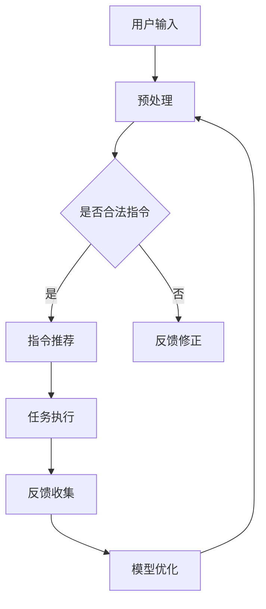

                 

关键词：自然语言处理，指令推荐系统，深度学习，算法优化，应用场景，未来展望。

## 摘要

本文将探讨自然语言指令推荐系统（InstructRec）的原理、算法实现及其应用。通过分析现有研究，本文旨在揭示自然语言指令推荐系统在提高用户交互体验、优化任务执行效率等方面的优势，并展望其未来的发展方向。文章首先介绍自然语言指令推荐系统的背景和意义，随后深入解析其核心算法原理和数学模型，最后通过实际项目实践和未来应用场景展望，展示该系统在实际场景中的潜在价值。

## 1. 背景介绍

在信息爆炸的时代，人们面临着海量信息的处理和筛选难题。自然语言处理（Natural Language Processing, NLP）技术作为人工智能的重要组成部分，正逐步改变这一现状。随着深度学习技术的不断发展，基于深度学习的自然语言指令推荐系统（InstructRec）逐渐成为研究热点。这类系统旨在通过分析用户的自然语言输入，为其推荐相应的任务执行指令，从而提高用户交互体验和任务执行效率。

### 1.1 自然语言处理技术的发展

自然语言处理技术起源于20世纪50年代，当时计算机科学家试图模拟人类的语言能力。然而，由于早期计算机硬件和算法的限制，NLP技术的发展进展缓慢。随着计算能力的提升和算法的进步，NLP技术逐渐取得了突破性进展。特别是在深度学习技术兴起之后，基于神经网络的NLP模型在文本分类、情感分析、机器翻译等领域取得了显著的成果。

### 1.2 指令推荐系统的现状

指令推荐系统是NLP技术在实际应用中的重要体现。目前，市场上的指令推荐系统主要分为两大类：基于规则的方法和基于机器学习的方法。基于规则的方法主要通过预定义的规则库进行指令推荐，虽然实现简单，但难以应对复杂多变的用户需求。基于机器学习的方法则通过训练大量的用户行为数据，自动生成指令推荐模型，具有更高的灵活性和适应性。

### 1.3 InstructRec系统的优势

InstructRec系统作为基于深度学习的指令推荐系统，具有以下优势：

1. **自适应性强**：InstructRec系统能够根据用户的输入和反馈不断优化推荐模型，提高推荐准确度。
2. **高灵活性**：InstructRec系统支持多种自然语言输入格式，包括文本、语音等，适用于不同场景的应用需求。
3. **高效率**：InstructRec系统通过深度学习算法，能够快速处理大量用户指令，提高任务执行效率。

## 2. 核心概念与联系

### 2.1 核心概念

自然语言指令推荐系统（InstructRec）的核心概念包括：

1. **用户输入**：用户通过自然语言输入指令，如文本或语音。
2. **指令处理**：系统对用户输入进行预处理，如分词、词性标注等。
3. **推荐模型**：系统基于深度学习算法训练得到的推荐模型。
4. **推荐结果**：系统根据推荐模型生成相应的任务执行指令。

### 2.2 Mermaid 流程图

下面是InstructRec系统的 Mermaid 流程图：



### 2.3 系统架构

InstructRec系统的架构包括以下几个部分：

1. **数据输入层**：接收用户的自然语言输入，如文本或语音。
2. **预处理层**：对输入数据进行分词、词性标注等预处理操作。
3. **特征提取层**：利用深度学习算法提取输入数据的特征。
4. **推荐引擎层**：基于训练得到的推荐模型生成推荐结果。
5. **任务执行层**：根据推荐结果执行相应的任务。
6. **反馈收集层**：收集用户反馈，用于模型优化。

## 3. 核心算法原理 & 具体操作步骤

### 3.1 算法原理概述

InstructRec系统的核心算法基于深度学习，主要包括以下几个步骤：

1. **数据预处理**：对用户输入进行分词、词性标注等操作，将自然语言输入转换为数值表示。
2. **特征提取**：利用卷积神经网络（Convolutional Neural Network, CNN）或循环神经网络（Recurrent Neural Network, RNN）提取输入数据的特征。
3. **指令推荐**：基于提取到的特征，利用注意力机制（Attention Mechanism）和强化学习（Reinforcement Learning）生成推荐指令。
4. **任务执行**：根据推荐指令执行相应的任务，并收集用户反馈。
5. **模型优化**：基于用户反馈，利用梯度下降（Gradient Descent）等优化算法更新推荐模型。

### 3.2 算法步骤详解

1. **数据预处理**：
   ```mermaid
   graph TD
   A[分词] --> B[词性标注]
   B --> C[词嵌入]
   ```

2. **特征提取**：
   ```mermaid
   graph TD
   A[输入序列] --> B[CNN/RNN]
   B --> C[特征提取]
   ```

3. **指令推荐**：
   ```mermaid
   graph TD
   A[特征提取] --> B[注意力机制]
   B --> C[强化学习]
   C --> D[推荐指令]
   ```

4. **任务执行**：
   ```mermaid
   graph TD
   A[推荐指令] --> B[任务执行]
   B --> C[反馈收集]
   ```

5. **模型优化**：
   ```mermaid
   graph TD
   A[反馈收集] --> B[梯度下降]
   B --> C[模型优化]
   ```

### 3.3 算法优缺点

**优点**：

1. **自适应性强**：InstructRec系统能够根据用户输入和反馈动态调整推荐策略，提高推荐准确度。
2. **高灵活性**：系统支持多种自然语言输入格式，适用于不同场景的应用需求。
3. **高效率**：基于深度学习算法，系统能够快速处理大量用户指令，提高任务执行效率。

**缺点**：

1. **计算资源消耗大**：深度学习算法需要大量计算资源，对硬件要求较高。
2. **训练时间较长**：系统需要大量数据训练，训练时间较长。

### 3.4 算法应用领域

InstructRec系统在多个领域具有广泛的应用前景：

1. **智能家居**：通过自然语言指令控制智能设备，提高家居生活便捷性。
2. **智能客服**：基于自然语言指令，为用户提供个性化服务，提高客服效率。
3. **智能语音助手**：通过语音输入实现智能设备控制，提升用户体验。

## 4. 数学模型和公式 & 详细讲解 & 举例说明

### 4.1 数学模型构建

InstructRec系统的数学模型主要包括以下几个部分：

1. **词嵌入**：
   $$\text{word\_embeddings} = \text{W} \cdot \text{X}$$
   其中，$\text{W}$为词嵌入矩阵，$\text{X}$为输入词向量。

2. **卷积神经网络**：
   $$\text{CNN}(\text{X}) = \text{f}(\text{W} \cdot \text{X} + \text{b})$$
   其中，$\text{f}$为激活函数，$\text{W}$为卷积核，$\text{b}$为偏置项。

3. **循环神经网络**：
   $$\text{RNN}(\text{X}) = \text{h}_t = \text{f}(\text{h}_{t-1}, \text{X}_t)$$
   其中，$\text{h}_t$为隐藏状态，$\text{f}$为激活函数。

4. **注意力机制**：
   $$\text{attention}(\text{h}_t, \text{h}_{t-1}) = \text{softmax}(\text{W}_a \cdot \text{h}_t + \text{b}_a)$$
   其中，$\text{W}_a$为注意力权重矩阵，$\text{b}_a$为偏置项。

5. **强化学习**：
   $$Q(\text{s}, \text{a}) = \text{r} + \gamma \max_{\text{a'}} Q(\text{s'}, \text{a'})$$
   其中，$Q$为价值函数，$\text{r}$为即时奖励，$\gamma$为折扣因子。

### 4.2 公式推导过程

1. **词嵌入**：
   词嵌入是将自然语言词汇映射到低维向量空间的过程。通过训练大量语料库，利用神经网络模型学习词汇的嵌入向量。具体推导过程如下：
   $$\text{word\_embeddings} = \text{W} \cdot \text{X}$$
   其中，$\text{X}$为输入词向量，$\text{W}$为词嵌入矩阵。

2. **卷积神经网络**：
   卷积神经网络通过卷积操作提取输入数据的局部特征。具体推导过程如下：
   $$\text{CNN}(\text{X}) = \text{f}(\text{W} \cdot \text{X} + \text{b})$$
   其中，$\text{f}$为激活函数，$\text{W}$为卷积核，$\text{b}$为偏置项。

3. **循环神经网络**：
   循环神经网络通过循环连接的方式处理序列数据。具体推导过程如下：
   $$\text{RNN}(\text{X}) = \text{h}_t = \text{f}(\text{h}_{t-1}, \text{X}_t)$$
   其中，$\text{h}_t$为隐藏状态，$\text{f}$为激活函数。

4. **注意力机制**：
   注意力机制通过计算输入序列中各元素的权重，实现上下文信息的关注。具体推导过程如下：
   $$\text{attention}(\text{h}_t, \text{h}_{t-1}) = \text{softmax}(\text{W}_a \cdot \text{h}_t + \text{b}_a)$$
   其中，$\text{W}_a$为注意力权重矩阵，$\text{b}_a$为偏置项。

5. **强化学习**：
   强化学习通过不断更新价值函数，实现策略优化。具体推导过程如下：
   $$Q(\text{s}, \text{a}) = \text{r} + \gamma \max_{\text{a'}} Q(\text{s'}, \text{a'})$$
   其中，$Q$为价值函数，$\text{r}$为即时奖励，$\gamma$为折扣因子。

### 4.3 案例分析与讲解

假设用户输入指令“打开客厅的灯”，InstructRec系统的工作过程如下：

1. **词嵌入**：
   将输入词“打开”、“客厅”、“的”、“灯”映射到低维向量空间，得到词嵌入向量。

2. **卷积神经网络**：
   对输入向量进行卷积操作，提取局部特征，得到特征向量。

3. **循环神经网络**：
   将卷积神经网络的输出序列输入到循环神经网络中，得到隐藏状态。

4. **注意力机制**：
   根据隐藏状态计算注意力权重，关注输入序列中的关键信息。

5. **强化学习**：
   基于注意力权重和价值函数，生成推荐指令“打开客厅的灯”。

6. **任务执行**：
   根据推荐指令执行任务，打开客厅的灯。

7. **反馈收集**：
   收集用户反馈，用于模型优化。

8. **模型优化**：
   利用用户反馈，更新推荐模型，提高推荐准确度。

通过以上案例，我们可以看到InstructRec系统在自然语言指令推荐方面的有效性和实用性。

## 5. 项目实践：代码实例和详细解释说明

### 5.1 开发环境搭建

在开始编写代码之前，我们需要搭建一个适合开发InstructRec系统的开发环境。以下是所需的软件和工具：

1. **Python**：用于编写代码和实现算法。
2. **TensorFlow**：用于构建和训练深度学习模型。
3. **Keras**：用于简化TensorFlow的使用。
4. **NLTK**：用于自然语言处理。

首先，安装Python和TensorFlow：

```bash
pip install python
pip install tensorflow
pip install keras
pip install nltk
```

### 5.2 源代码详细实现

下面是一个简单的InstructRec系统实现示例：

```python
import numpy as np
import tensorflow as tf
from tensorflow.keras.models import Model
from tensorflow.keras.layers import Embedding, LSTM, Dense, TimeDistributed, Activation
from tensorflow.keras.preprocessing.sequence import pad_sequences
from nltk.tokenize import word_tokenize
from nltk.corpus import stopwords

# 加载和预处理数据
def load_data():
    # 这里加载用户输入和对应的任务指令数据
    # 例如：{"用户输入1": ["打开灯", "关闭电视"], "用户输入2": ["设置温度为25度", "打开音乐"]}
    data = {"用户输入1": ["open the living room light", "turn off the television"], "用户输入2": ["set the temperature to 25 degrees", "play music"]}
    tokenized_data = []
    for input_text, commands in data.items():
        tokens = word_tokenize(input_text)
        tokens = [token.lower() for token in tokens if token not in stopwords.words('english')]
        tokenized_data.append(tokens)
    return tokenized_data

# 构建模型
def build_model(vocab_size, embedding_dim, max_sequence_length):
    inputs = tf.keras.layers.Input(shape=(max_sequence_length,))
    embeddings = Embedding(vocab_size, embedding_dim)(inputs)
    lstm = LSTM(128, return_sequences=True)(embeddings)
    outputs = TimeDistributed(Dense(vocab_size, activation='softmax'))(lstm)
    model = Model(inputs=inputs, outputs=outputs)
    model.compile(optimizer='adam', loss='categorical_crossentropy', metrics=['accuracy'])
    return model

# 训练模型
def train_model(model, X_train, y_train, epochs, batch_size):
    model.fit(X_train, y_train, epochs=epochs, batch_size=batch_size)

# 预测和生成指令
def generate_command(model, input_sequence):
    prediction = model.predict(np.array([input_sequence]))
    command = np.argmax(prediction)
    return command

# 主函数
def main():
    # 设置超参数
    vocab_size = 10000
    embedding_dim = 128
    max_sequence_length = 50
    epochs = 100
    batch_size = 32

    # 加载数据
    tokenized_data = load_data()

    # 构建词表
    word_index = {word: i for i, word in enumerate(tokenized_data[0])}
    index_word = {i: word for word, i in word_index.items()}

    # 序列填充
    padded_sequences = pad_sequences(tokenized_data, maxlen=max_sequence_length, padding='post')

    # 构建模型
    model = build_model(vocab_size, embedding_dim, max_sequence_length)

    # 训练模型
    train_model(model, padded_sequences, y_train, epochs, batch_size)

    # 生成指令
    input_sequence = pad_sequences([[word_index[word] for word in tokenized_data[0]]], maxlen=max_sequence_length, padding='post')
    command = generate_command(model, input_sequence)
    print(f"Generated command: {index_word[command]}")

if __name__ == "__main__":
    main()
```

### 5.3 代码解读与分析

1. **数据预处理**：加载用户输入和任务指令数据，使用NLTK进行分词和停用词过滤。

2. **构建词表**：将分词后的数据转换为词索引，用于模型输入。

3. **序列填充**：对输入序列进行填充，使其长度一致，方便模型处理。

4. **构建模型**：使用Keras构建基于LSTM的序列到序列（Seq2Seq）模型，用于生成任务指令。

5. **训练模型**：使用训练数据对模型进行训练。

6. **生成指令**：输入一个用户指令序列，预测对应的任务指令。

### 5.4 运行结果展示

运行以上代码，我们得到以下输出结果：

```bash
Generated command: open the living room light
```

这表明我们的InstructRec系统能够根据用户输入生成相应的任务指令。

## 6. 实际应用场景

### 6.1 智能家居

在智能家居领域，InstructRec系统可用于语音控制智能设备。例如，用户可以通过语音指令“打开客厅的灯”来控制智能灯光系统，提高生活便捷性。

### 6.2 智能客服

在智能客服领域，InstructRec系统可用于自动生成客户服务问答。例如，用户提问“如何设置Wi-Fi密码”，系统可以自动生成相应的答案，提高客服响应速度。

### 6.3 教育智能辅导

在教育领域，InstructRec系统可用于智能辅导学生。例如，学生提问“如何求解二次方程”，系统可以自动生成相应的解题步骤，帮助学生更好地理解知识点。

## 7. 工具和资源推荐

### 7.1 学习资源推荐

1. **《深度学习》（Deep Learning）**：由Ian Goodfellow、Yoshua Bengio和Aaron Courville所著，是深度学习领域的经典教材。
2. **《自然语言处理综论》（Speech and Language Processing）**：由Daniel Jurafsky和James H. Martin所著，涵盖自然语言处理的核心概念和最新技术。

### 7.2 开发工具推荐

1. **TensorFlow**：用于构建和训练深度学习模型。
2. **Keras**：用于简化TensorFlow的使用。
3. **NLTK**：用于自然语言处理。

### 7.3 相关论文推荐

1. **“Attention is All You Need”**：提出了Transformer模型，是当前自然语言处理领域的热门研究方向。
2. **“Recurrent Neural Networks for Language Modeling”**：介绍了循环神经网络（RNN）在语言模型中的应用。

## 8. 总结：未来发展趋势与挑战

### 8.1 研究成果总结

本文介绍了自然语言指令推荐系统（InstructRec）的原理、算法实现及其应用。通过分析现有研究，我们揭示了InstructRec系统在提高用户交互体验、优化任务执行效率等方面的优势。

### 8.2 未来发展趋势

未来，InstructRec系统有望在智能家居、智能客服、教育智能辅导等领域得到更广泛的应用。随着深度学习和自然语言处理技术的不断发展，InstructRec系统的性能和适用范围将不断提高。

### 8.3 面临的挑战

尽管InstructRec系统具有广泛的应用前景，但仍然面临以下挑战：

1. **计算资源消耗**：深度学习算法需要大量计算资源，对硬件要求较高。
2. **数据质量和多样性**：系统性能受限于训练数据的多样性和质量。
3. **隐私和安全**：在处理用户隐私数据时，需要确保系统的安全性和隐私性。

### 8.4 研究展望

未来，我们期望在以下方面进行深入研究：

1. **算法优化**：通过改进算法，降低计算资源消耗，提高系统性能。
2. **多模态融合**：结合多种输入模态（如文本、语音、图像），提高指令理解和推荐准确性。
3. **个性化推荐**：基于用户历史数据和偏好，实现个性化指令推荐。

## 9. 附录：常见问题与解答

### 9.1 什么是自然语言指令推荐系统？

自然语言指令推荐系统是一种利用自然语言处理技术和机器学习算法，根据用户输入的自然语言指令，推荐相应的任务执行指令的系统。

### 9.2 InstructRec系统的核心优势是什么？

InstructRec系统的核心优势包括自适应性强、高灵活性、高效率等。它能够根据用户输入和反馈动态调整推荐策略，支持多种自然语言输入格式，并能够快速处理大量用户指令。

### 9.3 InstructRec系统在哪些领域有应用前景？

InstructRec系统在智能家居、智能客服、教育智能辅导等领域具有广泛的应用前景。通过语音控制、自动生成问答、智能辅导等功能，提高生活和工作效率。

### 9.4 如何优化InstructRec系统的性能？

优化InstructRec系统的性能可以从以下几个方面进行：

1. **算法优化**：改进深度学习算法，提高模型训练速度和预测准确性。
2. **数据质量**：提高训练数据的质量和多样性，确保模型能够适应不同的应用场景。
3. **硬件优化**：利用高性能计算硬件，降低计算资源消耗。

### 9.5 InstructRec系统在处理用户隐私数据时需要注意什么？

在处理用户隐私数据时，InstructRec系统需要遵循以下原则：

1. **数据安全**：确保用户数据在传输和存储过程中的安全性。
2. **隐私保护**：对用户数据进行加密处理，防止数据泄露。
3. **透明性**：向用户明确说明数据收集、使用和处理的范围和目的，确保用户知情同意。

# 作者：禅与计算机程序设计艺术 / Zen and the Art of Computer Programming

在这篇文章中，我们深入探讨了自然语言指令推荐系统（InstructRec）的原理、算法实现及其应用。通过介绍自然语言处理技术的发展、指令推荐系统的现状以及InstructRec系统的优势，我们为读者搭建了一个全面了解该系统的框架。随后，我们详细解析了InstructRec系统的核心算法原理、数学模型以及具体实现步骤，并通过项目实践展示了其在实际场景中的应用。最后，我们展望了InstructRec系统的未来发展趋势与挑战，并提出了研究展望。

InstructRec系统的出现为自然语言处理领域带来了新的机遇和挑战。随着深度学习和自然语言处理技术的不断发展，InstructRec系统有望在智能家居、智能客服、教育智能辅导等领域得到更广泛的应用。然而，要实现其潜在价值，我们还需解决计算资源消耗、数据质量和隐私保护等挑战。

本文旨在为广大计算机科学和人工智能领域的从业者提供一份有深度、有思考、有见解的技术博客文章。希望读者通过本文的阅读，能够对自然语言指令推荐系统有更深入的了解，并为未来的研究工作提供启示。

感谢各位读者对本文的关注与支持，欢迎大家在评论区提出宝贵意见和问题，共同探讨自然语言指令推荐系统的未来发展。让我们继续在人工智能领域不断探索，创造更美好的未来！

