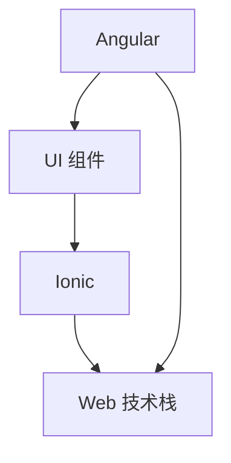

                 

关键词：Ionic 框架、移动应用开发、Angular、跨平台开发、前端技术、应用架构

> 摘要：本文将深入探讨 Ionic 框架在移动应用开发中的优势，特别是它基于 Angular 的技术基础。我们将从框架的历史背景、核心概念、具体操作步骤、数学模型、代码实例、实际应用场景等多个角度进行分析，为开发者提供全面的参考。

## 1. 背景介绍

移动应用市场的快速发展，使得跨平台开发变得尤为重要。开发者需要在有限的资源下，快速构建出功能丰富、性能稳定的移动应用。在此背景下，Ionic 框架应运而生。Ionic 是一款基于 Angular 的开源跨平台移动应用开发框架，它可以帮助开发者使用 Web 技术快速构建原生般的移动应用。

### 1.1 框架历史

Ionic 框架最早由 Drifty Co.（现已更名为Ionic Team）于 2013 年发布。它最初是基于 AngularJS（Angular 的前身）构建的。随着 Angular 的成熟，Ionic 也逐步适配了 Angular 的最新版本。Ionic 的目标是通过 Web 技术简化移动应用开发流程，提高开发效率。

### 1.2 框架特点

Ionic 框架具有以下特点：

- **跨平台**：使用标准的 Web 技术开发，支持 iOS、Android 等多个平台。
- **组件丰富**：提供丰富的 UI 组件，包括按钮、列表、卡片等，可以快速构建应用界面。
- **主题定制**：提供多种主题样式，支持自定义主题，以适应不同的应用风格。
- **插件生态**：拥有庞大的插件生态系统，可以方便地扩展框架功能。

## 2. 核心概念与联系

### 2.1 核心概念

- **Angular**：Ionic 框架基于 Angular 技术，是一种用于构建动态 Web 应用的前端框架。它提供了数据绑定、组件化、依赖注入等功能。
- **Ionic**：Ionic 是一个基于 Angular 的移动应用开发框架，它提供了移动应用开发所需的 UI 组件、工具库等。
- **Web 技术栈**：Ionic 框架使用标准的 Web 技术栈，包括 HTML、CSS、JavaScript 等，使得开发者可以充分利用现有的技能。

### 2.2 Mermaid 流程图



## 3. 核心算法原理 & 具体操作步骤

### 3.1 算法原理概述

Ionic 框架的核心在于其组件化和模块化的设计。它通过以下步骤实现移动应用的快速开发：

1. **组件化**：将应用的 UI 分解为独立的组件，每个组件负责一小部分功能。
2. **模块化**：将组件组织成模块，便于管理和维护。
3. **数据绑定**：使用 Angular 的数据绑定功能，实现数据和视图的同步更新。

### 3.2 算法步骤详解

1. **项目初始化**：使用 Ionic CLI 初始化项目，创建基本的文件结构。
   ```bash
   ionic init
   ```
2. **创建组件**：使用 Angular CLI 创建组件，例如创建一个按钮组件。
   ```bash
   ng generate component button
   ```
3. **编写组件代码**：在组件的 TypeScript 文件中编写逻辑代码，例如：
   ```typescript
   import { Component } from '@angular/core';

   @Component({
     selector: 'app-button',
     templateUrl: './button.component.html',
     styleUrls: ['./button.component.css']
   })
   export class ButtonComponent {
     click() {
       console.log('按钮被点击');
     }
   }
   ```
4. **编写模板代码**：在组件的 HTML 模板中定义组件的结构和样式，例如：
   ```html
   <ion-button (click)="click()">点击我</ion-button>
   ```
5. **使用组件**：在其他组件或模板中引用和使用该组件。

### 3.3 算法优缺点

**优点**：

- **跨平台**：使用 Web 技术开发，可以一次性开发适用于多个平台的应用。
- **快速开发**：提供丰富的组件和工具库，可以快速构建应用界面。
- **开发效率**：基于 Angular 的开发模式，可以充分利用现有的 Web 开发技能。

**缺点**：

- **性能**：与原生应用相比，使用 Web 技术开发的移动应用在性能上可能有一定差距。
- **兼容性**：需要在不同的设备和操作系统上测试，以确保应用的兼容性。

### 3.4 算法应用领域

Ionic 框架适用于多种类型的移动应用开发，包括：

- **企业级应用**：需要快速构建、跨平台部署的内部应用。
- **个人项目**：开发者可以使用 Ionic 快速实现个人创意项目。
- **开源项目**：Ionic 拥有庞大的开源社区，适合参与开源项目开发。

## 4. 数学模型和公式 & 详细讲解 & 举例说明

### 4.1 数学模型构建

在移动应用开发中，数学模型主要用于处理用户输入、数据存储等。以下是一个简单的数学模型示例：

- **用户输入**：用户在输入框中输入数据，数据类型为字符串。
- **数据存储**：将输入的数据存储在本地缓存中，以 JSON 格式保存。

### 4.2 公式推导过程

假设用户输入的数据为字符串 `s`，我们需要将数据转换为 JSON 格式。可以使用以下公式：

$$
JSON = '{"input": "' + s + '"}'
$$

### 4.3 案例分析与讲解

以下是一个具体的案例，展示如何使用 Ionic 框架实现用户输入和数据存储：

1. **创建组件**：使用 Angular CLI 创建一个名为 `InputComponent` 的组件。
   ```bash
   ng generate component input
   ```
2. **编写组件代码**：在 `input.component.ts` 文件中编写以下代码：
   ```typescript
   import { Component } from '@angular/core';

   @Component({
     selector: 'app-input',
     templateUrl: './input.component.html',
     styleUrls: ['./input.component.css']
   })
   export class InputComponent {
     userInput: string = '';

     saveInput() {
       const jsonData = '{"input": "' + this.userInput + '"}';
       localStorage.setItem('userInput', jsonData);
     }
   }
   ```
3. **编写模板代码**：在 `input.component.html` 文件中编写以下代码：
   ```html
   <ion-content>
     <ion-input [(ngModel)]="userInput" placeholder="输入数据"></ion-input>
     <ion-button (click)="saveInput()">保存</ion-button>
   </ion-content>
   ```
4. **使用组件**：在应用的首页或其他页面中引用 `InputComponent`。

## 5. 项目实践：代码实例和详细解释说明

### 5.1 开发环境搭建

1. **安装 Node.js**：访问 [Node.js 官网](https://nodejs.org/) 下载并安装 Node.js。
2. **安装 Ionic CLI**：在命令行中运行以下命令：
   ```bash
   npm install -g @ionic/cli
   ```
3. **安装 Angular CLI**：在命令行中运行以下命令：
   ```bash
   npm install -g @angular/cli
   ```
4. **安装开发工具**：推荐使用 Visual Studio Code 或其他喜欢的代码编辑器。

### 5.2 源代码详细实现

以下是项目的源代码结构：

```
my-ionic-app/
|-- src/
|   |-- apps/
|   |   |-- app1/
|   |   |   |-- components/
|   |   |   |   |-- input.component.ts
|   |   |   |   |-- input.component.html
|   |   |   |   |-- input.component.css
|   |   |   |   |-- input.module.ts
|   |   |   |-- app.module.ts
|   |   |-- app/
|   |-- assets/
|   |-- environments/
|   |-- tsconfig.json
|   |-- package.json
```

### 5.3 代码解读与分析

1. **创建项目**：在命令行中运行以下命令创建项目：
   ```bash
   ionic init --type=angular
   ```
2. **创建组件**：在 `src/apps/app1` 目录下创建 `input.component`：
   ```bash
   ng generate component input
   ```
3. **编写组件代码**：在 `input.component.ts` 中实现用户输入和数据存储功能：
   ```typescript
   import { Component } from '@angular/core';

   @Component({
     selector: 'app-input',
     templateUrl: './input.component.html',
     styleUrls: ['./input.component.css']
   })
   export class InputComponent {
     userInput: string = '';

     saveInput() {
       const jsonData = '{"input": "' + this.userInput + '"}';
       localStorage.setItem('userInput', jsonData);
     }
   }
   ```
4. **编写模板代码**：在 `input.component.html` 中定义输入框和保存按钮：
   ```html
   <ion-content>
     <ion-input [(ngModel)]="userInput" placeholder="输入数据"></ion-input>
     <ion-button (click)="saveInput()">保存</ion-button>
   </ion-content>
   ```
5. **使用组件**：在 `src/apps/app1/app.module.ts` 中引用 `InputComponent`：
   ```typescript
   import { NgModule } from '@angular/core';
   import { BrowserModule } from '@angular/platform-browser';
   import { BrowserAnimationsModule } from '@angular/platform-browser/animations';
   import { AppComponent } from './app.component';
   import { InputComponent } from './components/input/input.component';

   @NgModule({
     declarations: [
       AppComponent,
       InputComponent
     ],
     imports: [
       BrowserModule,
       BrowserAnimationsModule
     ],
     providers: [],
     bootstrap: [AppComponent]
   })
   export class AppModule { }
   ```

### 5.4 运行结果展示

1. **启动开发服务器**：在命令行中运行以下命令：
   ```bash
   ionic serve
   ```
2. **访问应用**：在浏览器中访问 `http://localhost:8100`，可以看到应用的运行结果。

## 6. 实际应用场景

Ionic 框架在移动应用开发中有广泛的应用场景，以下是一些典型应用：

- **企业级应用**：例如，银行、保险公司等机构可以使用 Ionic 框架快速构建内部移动应用，以提高业务效率和用户体验。
- **个人项目**：开发者可以利用 Ionic 框架实现各种创意项目，如健康管理、购物指南等。
- **开源项目**：Ionic 拥有庞大的开源社区，许多开源项目采用 Ionic 框架进行开发，如 ionic-community-apps。

## 7. 未来应用展望

随着 Web 技术的不断发展，Ionic 框架在未来有望在以下领域取得更大突破：

- **性能优化**：通过引入更多原生组件和优化渲染引擎，提高应用性能。
- **更丰富的插件生态**：鼓励更多开发者贡献插件，扩展框架功能。
- **更广泛的应用场景**：探索更多非移动领域的应用，如桌面应用、物联网应用等。

## 8. 工具和资源推荐

### 8.1 学习资源推荐

- **官方文档**：[Ionic 官方文档](https://ionicframework.com/docs/) 是学习 Ionic 框架的绝佳资源。
- **教程和课程**：在 [YouTube](https://www.youtube.com/) 和 [Udemy](https://www.udemy.com/) 上有许多关于 Ionic 的教程和课程。
- **社区论坛**：参与 [Ionic 论坛](https://forum.ionicframework.com/)，与其他开发者交流经验。

### 8.2 开发工具推荐

- **Visual Studio Code**：一款功能强大的代码编辑器，支持 Ionic 插件。
- **Ionic Studio**：由 Ionic Team 开发的一款集成开发环境（IDE），支持 Ionic 框架的开发。

### 8.3 相关论文推荐

- **“A Framework for Building Cross-Platform Mobile Apps with Web Technologies”**：该论文介绍了 Ionic 框架的设计理念和核心技术。
- **“Comparing Native vs. Hybrid App Development”**：该论文比较了原生应用和跨平台应用的优缺点。

## 9. 总结：未来发展趋势与挑战

### 9.1 研究成果总结

本文详细介绍了 Ionic 框架的优势和应用场景，分析了其基于 Angular 的核心原理和数学模型，并通过实际项目实践展示了其开发流程。

### 9.2 未来发展趋势

- **性能优化**：随着 Web 技术的不断发展，Ionic 框架将在性能方面取得更大突破。
- **更广泛的应用场景**：探索更多非移动领域的应用，如桌面应用、物联网应用等。

### 9.3 面临的挑战

- **性能**：与原生应用相比，Ionic 框架在性能上仍有一定差距，需要不断优化。
- **兼容性**：需要在不同的设备和操作系统上测试，以确保应用的兼容性。

### 9.4 研究展望

未来，Ionic 框架有望在以下方面取得突破：

- **更丰富的插件生态**：鼓励更多开发者贡献插件，扩展框架功能。
- **跨平台开发工具的整合**：与其他跨平台开发工具（如 React Native、Flutter）整合，提高开发效率。

## 10. 附录：常见问题与解答

### 10.1 如何解决 Ionic 应用性能问题？

- **优化渲染引擎**：引入更高效的原生渲染引擎，提高应用性能。
- **使用 Web Worker**：将复杂计算和长时间运行的任务移到 Web Worker 中，避免阻塞主线程。
- **减少 DOM 操作**：减少 DOM 操作，使用虚拟 DOM 技术。

### 10.2 如何确保 Ionic 应用的兼容性？

- **使用测试框架**：使用如 Jasmine、Protractor 等测试框架进行自动化测试，确保应用在不同设备和操作系统上的兼容性。
- **定期更新**：保持框架和依赖库的最新版本，以避免兼容性问题。

## 作者署名

作者：禅与计算机程序设计艺术 / Zen and the Art of Computer Programming
----------------------------------------------------------------

现在，您已经完成了一篇详细、全面的 Ionic 框架优势文章。希望这篇文章能够帮助开发者更好地了解 Ionic 框架，并在移动应用开发中取得成功。

