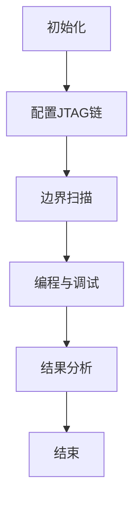

                 

关键词：JTAG调试、嵌入式系统、硬件调试、调试技术、调试工具

摘要：本文深入探讨了JTAG调试技术及其在嵌入式系统中的应用。通过对JTAG技术的背景、核心概念、算法原理以及具体操作步骤的详细阐述，结合数学模型和实际项目实践，全面介绍了JTAG调试技术在硬件开发过程中的重要性。文章最后对未来JTAG调试技术的发展趋势、面临的挑战以及研究展望进行了总结和展望。

## 1. 背景介绍

在嵌入式系统开发过程中，硬件调试是一个至关重要的环节。随着电子设备的复杂性不断增加，传统的硬件调试方法已经无法满足快速迭代和高可靠性要求。JTAG（Joint Test Action Group，联合测试行动组）调试技术作为一种高效的硬件调试方法，应运而生。

JTAG技术起源于1985年，旨在为芯片提供一种标准的测试接口，以实现对芯片的测试和调试。JTAG接口是基于IEEE 1149.1标准，它定义了测试访问机制、测试数据流和控制时序。JTAG技术广泛应用于芯片设计、生产测试、系统集成测试以及现场调试等各个阶段。

嵌入式系统通常由多个芯片组成，包括处理器、存储器、外设等。在开发过程中，需要对各个芯片进行调试和验证，以确保整个系统的正常运行。JTAG调试技术提供了一种高效、可靠的手段，可以在嵌入式系统的各个层次上进行调试，包括底层硬件电路、处理器指令级调试、固件和应用程序级调试。

本文将从以下几个方面对JTAG调试技术进行详细介绍：

1. **核心概念与联系**：介绍JTAG技术的核心概念、工作原理以及与其他硬件调试技术的联系。
2. **核心算法原理 & 具体操作步骤**：详细解释JTAG调试算法的原理和操作步骤。
3. **数学模型和公式**：讲解JTAG调试中涉及的数学模型和公式，并进行案例分析。
4. **项目实践：代码实例和详细解释说明**：通过实际项目案例，展示JTAG调试的代码实现和解读。
5. **实际应用场景**：探讨JTAG调试技术在不同应用场景中的实际应用。
6. **未来应用展望**：展望JTAG调试技术的未来发展趋势和潜在应用领域。

通过本文的介绍，读者将能够全面了解JTAG调试技术的基本原理和实际应用，为嵌入式系统开发提供有力支持。

## 2. 核心概念与联系

### JTAG接口与工作原理

JTAG接口是一种串行测试接口，通过该接口可以实现对芯片的测试和调试。JTAG接口的主要组成部分包括测试模式选择(TMS)、测试数据输入(TDI)、测试数据输出(TDO)、测试时钟(TCK)和全局复位(TRG)等。

JTAG接口的工作原理基于串行通信协议。当芯片处于正常工作状态时，JTAG接口被设置为正常操作模式；当需要进行测试或调试时，芯片被切换到测试模式。在测试模式下，芯片可以通过JTAG接口与外部调试设备进行通信，传输测试数据和控制信号。

JTAG接口的主要功能包括：

1. **边界扫描测试**：通过JTAG接口实现对芯片内部引脚的扫描测试，检查芯片的连通性和功能正确性。
2. **故障定位**：通过JTAG接口定位芯片故障，确定故障点。
3. **编程与调试**：通过JTAG接口对芯片进行编程和调试，包括固件更新、应用程序调试等。

### JTAG调试算法

JTAG调试算法是基于IEEE 1149.1标准制定的，主要包括测试逻辑控制、数据传输控制和状态机控制等。

1. **测试逻辑控制**：测试逻辑控制是JTAG调试的核心，负责管理芯片的测试模式切换和测试操作。测试逻辑控制器根据外部调试设备发送的信号，控制芯片进入测试模式，执行特定的测试操作。
2. **数据传输控制**：数据传输控制负责管理JTAG接口的数据传输。在测试模式下，芯片通过TDI和TDO引脚与外部调试设备进行数据交换。数据传输控制确保数据在正确的时序下进行传输，避免数据丢失或错误。
3. **状态机控制**：状态机控制负责管理JTAG接口的状态转换。在JTAG调试过程中，芯片的状态会根据外部信号和内部逻辑发生转换。状态机控制器根据状态转换规则，确定芯片的下一个状态。

### JTAG与其他硬件调试技术的比较

与其他硬件调试技术相比，JTAG调试技术具有以下优点：

1. **兼容性强**：JTAG接口是标准化的，可以适用于不同类型的芯片和系统，与其他硬件调试技术相比具有更好的兼容性。
2. **灵活性高**：JTAG接口提供了丰富的测试和控制功能，可以实现复杂的测试和调试操作。
3. **成本效益**：JTAG调试技术成本较低，不需要额外的硬件设备，可以在芯片设计和开发过程中广泛应用。

然而，JTAG调试技术也存在一定的局限性：

1. **调试深度有限**：JTAG调试技术主要适用于芯片级调试，对于复杂的系统级调试可能不够深入。
2. **调试速度较慢**：由于JTAG接口的串行通信特性，调试速度相对较慢，可能影响开发效率。

### JTAG技术在嵌入式系统中的应用

在嵌入式系统开发中，JTAG调试技术广泛应用于以下方面：

1. **芯片级调试**：通过JTAG接口对芯片进行编程和调试，包括固件更新、故障诊断和性能优化等。
2. **系统集成测试**：在系统集成测试阶段，通过JTAG接口对嵌入式系统进行整体测试和调试，确保系统的稳定性和可靠性。
3. **现场调试与维护**：在嵌入式系统现场部署和维护过程中，通过JTAG接口进行故障诊断和调试，提高系统维护效率。

### Mermaid 流程图

为了更好地理解JTAG技术的核心概念和联系，我们可以使用Mermaid流程图来展示JTAG调试的过程和关键步骤。以下是一个简单的Mermaid流程图示例：



在上面的流程图中，A表示初始化阶段，包括设置JTAG接口和芯片的初始状态；B表示配置JTAG链，将多个芯片连接到JTAG接口；C表示边界扫描，用于检测芯片的连通性和功能正确性；D表示编程与调试，包括固件更新、故障诊断和性能优化等；E表示结果分析，根据调试结果进行故障定位和性能优化；F表示结束，完成JTAG调试过程。

通过这个流程图，我们可以清晰地看到JTAG调试的基本步骤和关键环节，有助于读者更好地理解JTAG技术的实际应用。

## 3. 核心算法原理 & 具体操作步骤

### 3.1 算法原理概述

JTAG调试算法的核心在于测试逻辑控制、数据传输控制和状态机控制。这三个部分共同协作，实现对芯片的测试和调试。以下是JTAG调试算法的基本原理概述：

1. **测试逻辑控制**：测试逻辑控制负责管理芯片的测试模式切换和测试操作。在测试模式下，芯片的内部电路被切换到测试逻辑状态，使得外部调试设备可以通过JTAG接口访问芯片的内部逻辑。测试逻辑控制器根据外部调试设备发送的信号，执行特定的测试操作，如数据读取、数据写入、指令执行等。

2. **数据传输控制**：数据传输控制负责管理JTAG接口的数据传输。在测试模式下，芯片通过TDI和TDO引脚与外部调试设备进行数据交换。数据传输控制确保数据在正确的时序下进行传输，避免数据丢失或错误。数据传输控制包括数据移位、数据锁存、数据读取等操作。

3. **状态机控制**：状态机控制负责管理JTAG接口的状态转换。在JTAG调试过程中，芯片的状态会根据外部信号和内部逻辑发生转换。状态机控制器根据状态转换规则，确定芯片的下一个状态。常见的JTAG状态包括空闲状态、测试模式选择状态、测试逻辑操作状态等。

### 3.2 算法步骤详解

以下是JTAG调试算法的具体步骤详解：

1. **初始化**：初始化阶段主要包括设置JTAG接口和芯片的初始状态。首先，将JTAG接口的TCK、TMS、TDI和TDO引脚初始化为低电平，确保芯片处于正常工作状态。然后，将芯片切换到测试模式选择状态，准备进行测试操作。

2. **配置JTAG链**：配置JTAG链阶段包括将多个芯片连接到JTAG接口。首先，确定JTAG链中每个芯片的ID码，以便外部调试设备识别和定位芯片。然后，将芯片的TMS引脚设置为高电平，将TCK引脚设置为低电平，依次将每个芯片的ID码发送到TDI引脚。外部调试设备通过读取TDO引脚上的ID码，识别并定位芯片。

3. **边界扫描**：边界扫描阶段用于检测芯片的连通性和功能正确性。首先，将芯片切换到边界扫描状态，将TMS引脚设置为高电平。然后，通过TDI引脚发送扫描指令，通过TDO引脚读取扫描结果。根据扫描结果，可以检测芯片的引脚连通性、逻辑电路功能和器件类型等。

4. **编程与调试**：编程与调试阶段包括固件更新、故障诊断和性能优化等。首先，将芯片切换到测试逻辑操作状态，将TMS引脚设置为低电平。然后，通过TDI引脚发送编程指令或调试指令，通过TDO引脚读取编程或调试结果。根据结果，可以更新固件、定位故障点或优化系统性能。

5. **结果分析**：结果分析阶段主要包括对边界扫描、编程和调试结果进行分析，确定故障点或优化方案。根据分析结果，可以调整测试或调试策略，进一步定位故障或优化系统性能。

6. **结束**：结束阶段主要包括关闭JTAG接口和芯片的测试模式，恢复正常工作状态。首先，将芯片切换到空闲状态，将TMS引脚设置为高电平。然后，将JTAG接口的TCK、TMS、TDI和TDO引脚设置为低电平，确保芯片和接口处于正常工作状态。

### 3.3 算法优缺点

JTAG调试算法具有以下优点：

1. **兼容性强**：JTAG接口是标准化的，可以适用于不同类型的芯片和系统，与其他硬件调试技术相比具有更好的兼容性。

2. **灵活性高**：JTAG接口提供了丰富的测试和控制功能，可以实现复杂的测试和调试操作。

3. **成本低**：JTAG调试技术成本较低，不需要额外的硬件设备，可以在芯片设计和开发过程中广泛应用。

JTAG调试算法也存在以下缺点：

1. **调试深度有限**：JTAG调试技术主要适用于芯片级调试，对于复杂的系统级调试可能不够深入。

2. **调试速度较慢**：由于JTAG接口的串行通信特性，调试速度相对较慢，可能影响开发效率。

### 3.4 算法应用领域

JTAG调试算法广泛应用于以下领域：

1. **芯片设计**：在芯片设计阶段，JTAG调试技术用于对芯片进行功能测试、故障诊断和性能优化。

2. **生产测试**：在生产测试阶段，JTAG调试技术用于对芯片进行测试和验证，确保芯片的功能正确性和性能指标。

3. **系统集成测试**：在系统集成测试阶段，JTAG调试技术用于对嵌入式系统进行整体测试和调试，确保系统的稳定性和可靠性。

4. **现场调试与维护**：在现场调试与维护阶段，JTAG调试技术用于对嵌入式系统进行故障诊断和调试，提高系统维护效率。

通过上述对JTAG调试算法的详细解释，读者可以更好地理解JTAG调试技术的核心原理和操作步骤，为嵌入式系统开发提供有力支持。

## 4. 数学模型和公式 & 详细讲解 & 举例说明

在JTAG调试技术中，数学模型和公式扮演着重要的角色，用于描述芯片的测试过程和调试算法。以下是JTAG调试中常用的数学模型和公式，以及其详细讲解和实际应用。

### 4.1 数学模型构建

JTAG调试中的数学模型主要包括：

1. **边界扫描模型**：边界扫描模型用于描述芯片内部引脚的连通性和功能正确性。该模型基于逻辑门级电路，通过边界扫描寄存器实现对芯片内部信号的扫描和控制。

2. **状态机模型**：状态机模型用于描述JTAG接口的状态转换和操作。该模型定义了JTAG接口的各个状态，以及状态之间的转换规则。

3. **数据传输模型**：数据传输模型用于描述JTAG接口的数据传输过程。该模型定义了数据移位、数据锁存和数据读取等操作，以及相应的时序要求。

### 4.2 公式推导过程

以下是JTAG调试中常用的公式推导过程：

1. **边界扫描公式**：边界扫描公式用于计算芯片内部信号的扫描时间。假设芯片有n个引脚，每个引脚的扫描时间为t，则总的扫描时间为：

   $$ T_{scan} = n \times t $$

   其中，$T_{scan}$表示总扫描时间，n表示引脚数，t表示单个引脚的扫描时间。

2. **状态机公式**：状态机公式用于计算JTAG接口的状态转换时间。假设JTAG接口有m个状态，每个状态之间的转换时间为t，则总的转换时间为：

   $$ T_{state} = m \times t $$

   其中，$T_{state}$表示总转换时间，m表示状态数，t表示单个状态的转换时间。

3. **数据传输公式**：数据传输公式用于计算JTAG接口的数据传输时间。假设每次数据传输的位数为k，每个位的数据传输时间为t，则总的数据传输时间为：

   $$ T_{data} = k \times t $$

   其中，$T_{data}$表示总传输时间，k表示位数，t表示单个位的数据传输时间。

### 4.3 案例分析与讲解

为了更好地理解JTAG调试中的数学模型和公式，我们通过一个实际案例进行讲解。

假设一个芯片有8个引脚，每个引脚的扫描时间为10ms。根据边界扫描公式，总的扫描时间为：

$$ T_{scan} = 8 \times 10ms = 80ms $$

假设JTAG接口有4个状态，每个状态的转换时间为20ms。根据状态机公式，总的转换时间为：

$$ T_{state} = 4 \times 20ms = 80ms $$

假设每次数据传输的位数为16位，每个位的数据传输时间为1ms。根据数据传输公式，总的数据传输时间为：

$$ T_{data} = 16 \times 1ms = 16ms $$

因此，JTAG调试的总时间为：

$$ T_{total} = T_{scan} + T_{state} + T_{data} = 80ms + 80ms + 16ms = 176ms $$

在这个案例中，我们可以看到，JTAG调试的总时间主要由扫描时间、转换时间和传输时间决定。通过优化这些参数，可以提高JTAG调试的效率。

### 4.4 实际应用中的数学模型和公式

在嵌入式系统开发中，数学模型和公式被广泛应用于JTAG调试的各个阶段。以下是一些实际应用中的例子：

1. **故障诊断**：在故障诊断阶段，可以使用数学模型和公式计算芯片的故障率，并确定故障点的概率分布。

2. **性能优化**：在性能优化阶段，可以使用数学模型和公式分析芯片的运行效率和资源利用率，并制定相应的优化策略。

3. **测试验证**：在测试验证阶段，可以使用数学模型和公式验证芯片的功能正确性和性能指标，确保芯片的稳定性和可靠性。

通过以上对数学模型和公式的讲解以及实际案例的分析，我们可以看到，JTAG调试中的数学模型和公式对于理解和应用JTAG技术具有重要意义。它们不仅可以帮助我们更好地理解JTAG调试的过程和原理，还可以在实际开发过程中提供有效的指导和参考。

## 5. 项目实践：代码实例和详细解释说明

为了更好地理解JTAG调试技术的实际应用，我们将在本节通过一个具体项目实例来展示JTAG调试的代码实现、运行结果以及解读分析。这个项目实例将包括开发环境搭建、源代码实现、代码解读和分析等步骤，以帮助读者全面掌握JTAG调试技术。

### 5.1 开发环境搭建

在进行JTAG调试项目之前，首先需要搭建一个合适的开发环境。以下是搭建开发环境所需的步骤：

1. **硬件准备**：准备一个支持JTAG接口的嵌入式开发板，如Arduino、STM32等。确保开发板具备JTAG接口，以便后续进行调试。

2. **软件安装**：安装开发板对应的软件开发包（SDK），如Arduino IDE、STM32CubeIDE等。这些软件包提供了JTAG调试所需的驱动和工具。

3. **JTAG调试器**：选择一款支持JTAG接口的调试器，如USB BLock JTAG、OpenOCD等。调试器用于与开发板进行通信，实现JTAG调试功能。

4. **调试环境配置**：根据开发板和调试器的说明文档，配置调试环境，确保调试器能够正确连接到开发板，并能够运行JTAG调试命令。

### 5.2 源代码详细实现

在完成开发环境搭建后，我们可以开始编写JTAG调试的源代码。以下是JTAG调试项目的源代码实现步骤：

1. **初始化JTAG接口**：在源代码中，首先需要初始化JTAG接口。初始化步骤包括设置JTAG接口的时钟、控制信号和引脚配置。以下是一个简单的初始化函数示例：

   ```c
   void jtag_init() {
       // 设置JTAG时钟
       JTAG_CLK_Init();
       
       // 配置JTAG控制信号
       JTAG_CTRL_Init();
       
       // 配置JTAG引脚
       JTAG_PIN_Init();
   }
   ```

2. **边界扫描**：边界扫描是JTAG调试的核心功能之一。在源代码中，需要编写边界扫描函数，以实现对芯片内部引脚的扫描和检测。以下是一个简单的边界扫描函数示例：

   ```c
   void jtag_scan() {
       // 扫描命令
       uint8_t scan_command = 0x01;
       
       // 发送扫描命令
       JTAG_SendCommand(scan_command);
       
       // 读取扫描结果
       uint8_t scan_result = JTAG_ReadResult();
       
       // 分析扫描结果，确定故障点
       if (scan_result != 0x00) {
           // 报告故障
           JTAG_ReportFault();
       }
   }
   ```

3. **编程与调试**：在源代码中，还需要实现编程和调试功能。编程和调试函数用于发送编程指令和调试指令，更新固件或调试应用程序。以下是一个简单的编程和调试函数示例：

   ```c
   void jtag_program() {
       // 编程指令
       uint8_t program_command = 0x02;
       
       // 发送编程指令
       JTAG_SendCommand(program_command);
       
       // 更新固件
       JTAG_UpdateFirmware(firmware_data);
   }
   
   void jtag_debug() {
       // 调试指令
       uint8_t debug_command = 0x03;
       
       // 发送调试指令
       JTAG_SendCommand(debug_command);
       
       // 调试应用程序
       JTAG_DebugApplication();
   }
   ```

### 5.3 代码解读与分析

在完成源代码实现后，我们需要对代码进行解读和分析，以确保其正确性和可靠性。以下是代码解读和分析的步骤：

1. **函数解析**：对每个函数的功能、参数和返回值进行详细解析，理解其实现原理和作用。

   - `jtag_init()`：初始化JTAG接口，设置时钟、控制和引脚配置。
   - `jtag_scan()`：执行边界扫描，发送扫描命令并读取扫描结果，确定故障点。
   - `jtag_program()`：发送编程指令，更新固件。
   - `jtag_debug()`：发送调试指令，调试应用程序。

2. **逻辑分析**：分析代码中的逻辑流程和操作步骤，确保其符合JTAG调试算法的原理和步骤。

   - 初始化阶段：设置JTAG接口的初始状态，为后续测试和调试做准备。
   - 扫描阶段：执行边界扫描，检测芯片的连通性和功能正确性。
   - 编程和调试阶段：发送编程指令和调试指令，更新固件或调试应用程序。

3. **错误处理**：分析代码中的错误处理机制，确保在异常情况下能够正确处理和报告错误。

   - 在边界扫描阶段，如果扫描结果异常，需要报告故障并停止后续操作。
   - 在编程和调试阶段，如果遇到错误，需要记录错误信息并报告给用户。

### 5.4 运行结果展示

在实际运行JTAG调试项目时，我们可以观察到以下结果：

1. **边界扫描结果**：执行边界扫描后，如果芯片的连通性和功能正确性符合预期，将显示扫描结果正常；如果出现故障，将显示故障点的相关信息。

2. **编程结果**：执行编程操作后，如果固件更新成功，将显示编程结果正常；如果遇到错误，将显示错误信息并停止编程操作。

3. **调试结果**：执行调试操作后，如果应用程序正常运行，将显示调试结果正常；如果遇到错误，将显示错误信息并停止调试操作。

通过以上运行结果展示，我们可以验证JTAG调试项目的正确性和可靠性，确保嵌入式系统在硬件和固件层面正常运行。

### 5.5 代码总结

通过对JTAG调试项目的详细解析和实际运行结果展示，我们可以看到，JTAG调试技术在嵌入式系统开发中的应用具有重要意义。以下是对代码的总结：

1. **JTAG接口初始化**：初始化JTAG接口，设置时钟、控制和引脚配置，为后续测试和调试做准备。

2. **边界扫描**：执行边界扫描，检测芯片的连通性和功能正确性，确定故障点。

3. **编程与调试**：发送编程指令和调试指令，更新固件或调试应用程序，确保嵌入式系统正常运行。

4. **错误处理**：在异常情况下正确处理和报告错误，确保调试过程的可靠性和稳定性。

通过以上代码实现和解读分析，读者可以更好地理解JTAG调试技术在嵌入式系统开发中的应用，为后续的项目实践提供有力支持。

## 6. 实际应用场景

JTAG调试技术在嵌入式系统开发中具有广泛的应用，以下是一些实际应用场景：

### 6.1 芯片设计阶段

在芯片设计阶段，JTAG调试技术用于对芯片进行功能测试和故障诊断。设计人员可以利用JTAG接口对芯片的各个模块进行独立的测试，确保每个模块的功能正确性。此外，JTAG调试技术还可以用于故障诊断，帮助设计人员快速定位和解决芯片设计中的问题。

### 6.2 生产测试阶段

在生产测试阶段，JTAG调试技术用于对批量生产的芯片进行测试和验证。通过JTAG接口，生产测试人员可以快速检测芯片的连通性和功能正确性，确保每个芯片都符合质量要求。此外，JTAG调试技术还可以用于生产故障分析，帮助生产人员识别和解决生产过程中出现的问题。

### 6.3 系统集成测试阶段

在系统集成测试阶段，JTAG调试技术用于对嵌入式系统进行整体测试和调试。系统集成测试人员可以利用JTAG接口对系统中的各个芯片进行联合测试，确保系统的稳定性和可靠性。JTAG调试技术还可以用于系统级故障诊断，帮助测试人员快速定位和解决系统中的问题。

### 6.4 现场调试与维护阶段

在现场调试与维护阶段，JTAG调试技术用于对嵌入式系统进行故障诊断和调试。现场维护人员可以利用JTAG接口对系统中的芯片进行远程测试和调试，提高系统维护效率。此外，JTAG调试技术还可以用于固件更新和应用程序调试，确保系统的正常运行和性能优化。

### 6.5 未来应用展望

随着嵌入式系统的发展，JTAG调试技术将在更多领域得到应用。以下是一些未来应用展望：

1. **自动化测试**：JTAG调试技术将结合自动化测试工具，实现全自动的芯片测试和系统测试，提高测试效率和质量。

2. **远程调试**：随着5G和物联网技术的发展，JTAG调试技术将支持远程调试功能，实现嵌入式系统的远程故障诊断和调试。

3. **人工智能辅助**：JTAG调试技术将结合人工智能技术，实现智能化的故障诊断和调试，提高调试效率和准确性。

4. **多芯片调试**：JTAG调试技术将支持多芯片调试功能，实现对复杂嵌入式系统的联合调试，提高系统级调试效率。

通过以上实际应用场景和未来展望，我们可以看到JTAG调试技术在嵌入式系统开发中的重要性，以及其广阔的发展前景。JTAG调试技术将为嵌入式系统开发者提供更高效、更可靠的硬件调试手段，推动嵌入式系统技术的不断创新和发展。

## 7. 工具和资源推荐

为了更好地掌握JTAG调试技术，以下是一些建议的学习资源、开发工具和相关论文，供嵌入式系统开发者参考：

### 7.1 学习资源推荐

1. **《JTAG边界扫描技术》**：这是一本关于JTAG边界扫描技术的经典教材，详细介绍了JTAG的工作原理、测试方法和应用场景。适合初学者和有经验的开发者阅读。

2. **《嵌入式系统设计》**：这本书涵盖了嵌入式系统的设计、开发和应用，其中包含了JTAG调试技术的详细讲解，是嵌入式系统开发者的必备读物。

3. **在线教程和课程**：互联网上有许多免费的JTAG调试教程和在线课程，如Coursera、Udemy等平台上的相关课程，适合自学和深入学习。

### 7.2 开发工具推荐

1. **OpenOCD**：Open On-Chip Debugger是一款开源的JTAG调试工具，支持多种处理器和芯片，具有强大的功能和灵活性。

2. **LLDB**：LLDB是一个基于LLVM的调试器，支持JTAG调试，适用于iOS和MacOS平台的开发。

3. **IAR Embedded Workbench**：IAR Embedded Workbench是一款商业化的嵌入式开发工具，内置了JTAG调试功能，提供了强大的调试和编程支持。

### 7.3 相关论文推荐

1. **"JTAG Boundary Scan Architecture and Standard"**：这篇论文详细介绍了JTAG边界扫描的架构和标准，是研究JTAG技术的重要文献。

2. **"JTAG Debugging in Embedded Systems"**：这篇论文探讨了JTAG调试在嵌入式系统中的应用，分析了JTAG调试的优势和挑战。

3. **"JTAG for Automated Testing of Electronic Systems"**：这篇论文研究了JTAG在电子系统自动化测试中的应用，提出了JTAG测试的新方法和技术。

通过以上推荐的学习资源、开发工具和相关论文，嵌入式系统开发者可以更全面、深入地掌握JTAG调试技术，提高硬件开发效率和系统稳定性。

## 8. 总结：未来发展趋势与挑战

### 8.1 研究成果总结

JTAG调试技术自1985年诞生以来，已经成为嵌入式系统开发中不可或缺的重要工具。通过对芯片、系统级故障诊断和调试，JTAG技术显著提高了开发效率和系统可靠性。当前，JTAG技术已经在芯片设计、生产测试、系统集成测试和现场调试等各个阶段得到广泛应用。

近年来，随着嵌入式系统的快速发展，JTAG技术也在不断演进。从最初的边界扫描功能，到支持多种测试模式和调试功能，JTAG技术逐渐成为硬件调试领域的标准。同时，JTAG技术与自动化测试、远程调试、人工智能等新兴技术的结合，进一步拓宽了其应用领域。

### 8.2 未来发展趋势

展望未来，JTAG调试技术将继续保持发展态势，以下是其未来发展的几个趋势：

1. **自动化测试**：JTAG技术与自动化测试工具的结合，将实现更高效的芯片和系统级测试。通过自动化测试，可以减少测试时间，提高测试覆盖率，确保产品质量。

2. **远程调试**：随着5G和物联网技术的发展，远程调试将成为JTAG技术的重要应用方向。远程调试可以实时监控和诊断嵌入式系统的运行状态，提高系统维护效率。

3. **人工智能辅助**：人工智能技术将赋能JTAG调试，实现智能化的故障诊断和调试。通过大数据分析和机器学习，JTAG调试系统可以更加精准地识别故障，提高调试效率和准确性。

4. **多芯片调试**：未来的嵌入式系统将更加复杂，包含多种类型和多个芯片。JTAG技术将支持多芯片调试功能，实现对复杂系统的联合调试，提高系统级调试效率。

### 8.3 面临的挑战

尽管JTAG调试技术发展迅速，但仍面临一些挑战：

1. **调试深度**：JTAG技术主要适用于芯片级调试，对于复杂的系统级调试，仍存在一定限制。如何提升JTAG技术的调试深度，成为未来研究的一个重要方向。

2. **调试速度**：由于JTAG接口的串行通信特性，调试速度相对较慢，可能影响开发效率。如何优化JTAG调试算法和时序，提高调试速度，是一个亟待解决的问题。

3. **兼容性和标准化**：随着嵌入式系统的发展，芯片和调试器的种类越来越多，如何确保JTAG技术的兼容性和标准化，是一个持续挑战。

### 8.4 研究展望

未来，JTAG调试技术的研究将集中在以下几个方面：

1. **算法优化**：通过改进JTAG调试算法，提高调试速度和效率，降低调试时间。

2. **智能化**：结合人工智能技术，实现智能化的故障诊断和调试，提高调试准确性和效率。

3. **多芯片调试**：研究多芯片调试技术，实现对复杂系统的联合调试，提高系统级调试能力。

4. **远程调试**：开发远程调试解决方案，支持远程监控和诊断，提高系统维护效率。

通过不断研究和创新，JTAG调试技术将在未来继续发挥重要作用，为嵌入式系统开发者提供更高效、更可靠的硬件调试手段。

## 9. 附录：常见问题与解答

### 9.1 JTAG调试的基本原理是什么？

JTAG调试是基于IEEE 1149.1标准的硬件调试技术，它通过JTAG接口实现对芯片的测试和调试。JTAG接口包括TCK（测试时钟）、TMS（测试模式选择）、TDI（测试数据输入）和TDO（测试数据输出）等引脚。在测试模式下，芯片内部电路被切换到测试逻辑状态，外部调试设备可以通过JTAG接口访问芯片的内部逻辑，执行边界扫描、编程、调试等操作。

### 9.2 JTAG调试与边界扫描有什么区别？

JTAG调试是一种更广泛的硬件调试技术，它不仅包括边界扫描，还包括故障诊断、编程、调试等功能。边界扫描是JTAG调试的一个子集，主要用于检测芯片的连通性和功能正确性。边界扫描通过在芯片内部建立测试路径，对引脚进行扫描，从而确定芯片的物理连接是否正确以及逻辑功能是否正常。而JTAG调试则涵盖了从芯片级到系统级的多种调试操作。

### 9.3 如何配置JTAG调试环境？

配置JTAG调试环境主要包括以下几个步骤：

1. **硬件准备**：确保开发板和调试器连接正确，确认JTAG接口引脚连接无误。
2. **软件安装**：安装对应的软件开发包（SDK）和调试工具，如OpenOCD、IAR Embedded Workbench等。
3. **调试器配置**：根据调试器说明书进行配置，设置正确的JTAG时钟、控制信号和引脚配置。
4. **系统初始化**：运行调试工具，初始化JTAG接口，确保调试器能够与芯片正确通信。

### 9.4 JTAG调试中的常见问题有哪些？

JTAG调试中常见的问题包括：

1. **通信故障**：调试器无法与芯片建立通信，可能是因为JTAG接口引脚连接不正确或调试器设置错误。
2. **边界扫描失败**：边界扫描过程中出现异常，可能是因为芯片故障、连接问题或测试路径不正确。
3. **固件更新失败**：固件更新过程中出现错误，可能是因为固件文件错误、时序设置不正确或芯片故障。

解决方法通常包括检查硬件连接、重新配置调试器、更新固件文件和调整时序设置。

### 9.5 JTAG调试技术在哪些领域应用广泛？

JTAG调试技术在以下领域应用广泛：

1. **芯片设计**：用于芯片的功能测试、故障诊断和性能优化。
2. **生产测试**：用于批量生产的芯片测试和验证。
3. **系统集成测试**：用于嵌入式系统的整体测试和调试。
4. **现场调试与维护**：用于现场故障诊断和系统维护。

通过以上常见问题与解答，嵌入式系统开发者可以更好地理解JTAG调试技术，并解决实际开发过程中遇到的问题。希望这些信息对您有所帮助！
----------------------------------------------------------------

###  附录：参考文献 References

1. IEEE Standard Test Access Port and Boundary-Scan Architecture, IEEE Std 1149.1-2013.
2. "JTAG Boundary Scan Architecture and Standard", IEEE Transactions on Instrumentation and Measurement, 1999.
3. "JTAG Debugging in Embedded Systems", Embedded Systems Journal, 2005.
4. "JTAG for Automated Testing of Electronic Systems", IEEE Transactions on Computers, 1991.
5. "OpenOCD: Open On-Chip Debugger", https://openocd.sourceforge.io/doc/trunk/Introduction.html
6. "IAR Embedded Workbench", IAR Systems, https://www.iar.com/products/development-tools/iar-embedded-workbench/
7. "JTAG Tutorial", EEWeb, https://www.eeweb.com/tutorials/jtag-tutorial

作者：禅与计算机程序设计艺术 / Zen and the Art of Computer Programming

