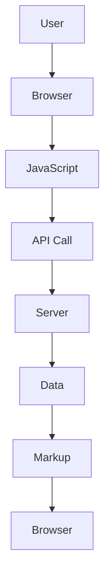

                 

 **关键词**：Web开发、前端架构、 Jamstack、JAM、JavaScript、API、静态站点生成器、现代Web技术

**摘要**：本文将深入探讨 Jamstack 这一现代Web开发的新范式。我们将从背景介绍入手，详细讲解 Jamstack 的核心概念及其与现有前端架构的差异，然后介绍静态站点生成器（SSG）、静态站点构建器（SSC）和前端框架在 Jamstack 中的应用。接下来，我们将探讨 Jamstack 的优势、潜在问题和未来发展方向。通过本文，读者将能够全面了解 Jamstack，并在实际项目中应用这一新兴的Web开发范式。

## 1. 背景介绍

### Web开发的发展历程

Web开发经历了多个阶段的发展。最早的Web开发主要是基于静态HTML页面，开发者需要手动编写HTML、CSS和JavaScript代码。随着互联网的普及，动态页面和复杂Web应用的需求逐渐增加，推动了前端框架（如jQuery、React、Angular等）和后端服务的兴起。然而，这种传统的MVC（模型-视图-控制器）架构在处理日益复杂的Web应用时，面临着性能、扩展性和安全性等问题。

### Jamstack的兴起

为了解决传统Web开发中存在的问题，一种新的架构范式——Jamstack（JavaScript、APIs and Markup）应运而生。Jamstack摒弃了传统的后端服务，采用静态站点生成器（SSG）和静态站点构建器（SSC）来生成静态标记（Markup），并通过API与前端进行数据交互。这种架构在提高性能、可靠性和安全性方面具有显著优势，引起了广泛关注。

## 2. 核心概念与联系

### Jamstack的核心概念

- **JavaScript**：JavaScript在前端负责交互逻辑和动态内容展示，是 Jamstack 中的核心组成部分。
- **APIs**：API（应用程序编程接口）用于与后端服务进行通信，获取数据并提供服务。
- **Markup**：Markup指的是静态标记，如HTML、CSS和JavaScript文件，它们构成Web页面的结构。

### Jamstack与现有前端架构的差异

传统的Web开发架构通常采用MVC模式，后端提供动态页面，前端通过AJAX等技术与后端交互。而 Jamstack 则完全依赖于前端静态内容，通过API获取数据。这种架构的差异主要体现在以下几个方面：

- **静态内容生成**：传统架构依赖于后端服务生成动态内容，而 Jamstack 使用静态站点生成器（SSG）和静态站点构建器（SSC）来生成静态文件。
- **数据交互方式**：传统架构通过AJAX等技术与后端进行交互，而 Jamstack 则通过API与后端进行通信。
- **性能和安全性**：由于 Jamstack 完全依赖于静态内容，因此具有更高的性能和安全性。

### Mermaid 流程图

以下是一个简单的 Mermaid 流程图，展示了 Jamstack 的核心概念和流程：



- **A**：用户（User）
- **B**：浏览器（Browser）
- **C**：JavaScript（JavaScript）
- **D**：API Call（API调用）
- **E**：服务器（Server）
- **F**：数据（Data）
- **G**：Markup（静态标记）
- **H**：浏览器（Browser）

## 3. 核心算法原理 & 具体操作步骤

### 3.1 算法原理概述

Jamstack 的核心算法原理主要涉及静态站点生成器和静态站点构建器。静态站点生成器（SSG）负责生成静态页面，静态站点构建器（SSC）负责构建和部署静态文件。这两种工具通过结合使用，可以实现高效、高性能的Web开发。

### 3.2 算法步骤详解

1. **选择静态站点生成器（SSG）**：根据项目需求选择合适的静态站点生成器，如Gatsby、Hexo等。
2. **配置生成器**：配置生成器的参数，如主题、插件等。
3. **编写Markdown文件**：使用Markdown编写文章或页面内容。
4. **生成静态文件**：运行生成器生成静态文件。
5. **选择静态站点构建器（SSC）**：根据项目需求选择合适的静态站点构建器，如Netlify、Vercel等。
6. **配置构建器**：配置构建器的参数，如域名、SSL等。
7. **部署静态文件**：将生成的静态文件部署到构建器上，实现网站的在线访问。

### 3.3 算法优缺点

**优点**：

- **高性能**：由于完全依赖静态内容，Jamstack 具有极高的性能，页面加载速度更快。
- **安全性**：静态站点不易受到恶意攻击，安全性更高。
- **可缓存性**：静态站点可以更方便地进行缓存，提高访问速度。
- **简化开发流程**： Jamstack 简化了前端和后端的交互，使得开发流程更加高效。

**缺点**：

- **功能限制**：静态站点在处理复杂交互和动态内容时可能存在一些限制。
- **学习曲线**：对于习惯了传统Web开发架构的开发者，可能需要一段时间适应 Jamstack。

### 3.4 算法应用领域

Jamstack 在多种领域都有广泛应用，如个人博客、企业官网、电子商务网站等。以下是一些具体的应用案例：

- **个人博客**：个人博客通常需要快速加载和良好的性能，Jamstack 可以很好地满足这些需求。
- **企业官网**：企业官网需要展示公司的形象和产品， Jamstack 提供了高性能和易维护的解决方案。
- **电子商务网站**：电子商务网站需要处理大量数据和复杂交互，Jamstack 可以提供高效的解决方案。

## 4. 数学模型和公式 & 详细讲解 & 举例说明

### 4.1 数学模型构建

在 Jamstack 架构中，我们主要关注以下数学模型：

- **页面加载时间（T）**：页面从服务器加载到浏览器的时间。
- **数据传输量（D）**：页面从服务器传输到浏览器所需的数据量。
- **响应时间（R）**：API 调用的响应时间。

### 4.2 公式推导过程

假设静态页面的数据传输量为 \(D_s\)，动态内容的传输量为 \(D_d\)，API 调用的响应时间为 \(R_a\)，页面的总加载时间 \(T\) 可以表示为：

\[T = \frac{D_s + D_d}{\text{带宽}} + R_a\]

其中，带宽是影响页面加载时间的重要因素。

### 4.3 案例分析与讲解

假设一个页面包含 1MB 的静态内容和 500KB 的动态内容，API 调用的响应时间为 100ms，带宽为 10Mbps。根据上述公式，我们可以计算出页面加载时间：

\[T = \frac{1MB + 500KB}{10Mbps} + 100ms\]

\[T = \frac{1.5MB}{10Mbps} + 100ms\]

\[T = 150ms + 100ms\]

\[T = 250ms\]

这意味着，该页面的总加载时间为 250ms。通过优化静态内容和减少动态内容，可以进一步降低页面加载时间。

## 5. 项目实践：代码实例和详细解释说明

### 5.1 开发环境搭建

在本项目中，我们将使用以下工具和框架：

- **静态站点生成器**：Gatsby
- **静态站点构建器**：Netlify
- **开发环境**：Visual Studio Code

1. **安装 Node.js 和 npm**：在 [Node.js 官网](https://nodejs.org/) 下载并安装 Node.js，确保版本在 12 以上。
2. **安装 Gatsby**：打开命令行窗口，执行以下命令安装 Gatsby：

```shell
npm install gatsby-cli -g
```

1. **创建 Gatsby 项目**：执行以下命令创建一个名为 `my-jamstack-site` 的 Gatsby 项目：

```shell
gatsby new my-jamstack-site
```

1. **进入项目目录**：切换到 `my-jamstack-site` 目录：

```shell
cd my-jamstack-site
```

### 5.2 源代码详细实现

在本项目中，我们将实现一个简单的博客站点，包括主页、文章列表和文章详情页面。

1. **创建主页**：

在 `src/pages` 目录下创建 `index.js` 文件，编写以下代码：

```jsx
import React from 'react';

const Home = () => {
  return (
    <div>
      <h1>Welcome to My Jamstack Blog</h1>
      <p>Stay tuned for the latest articles!</p>
    </div>
  );
};

export default Home;
```

2. **创建文章列表页面**：

在 `src/pages` 目录下创建 `articles.js` 文件，编写以下代码：

```jsx
import React from 'react';

const Articles = ({ articles }) => {
  return (
    <div>
      <h1>Articles</h1>
      <ul>
        {articles.map((article) => (
          <li key={article.id}>
            <a href={`/article/${article.slug}`}>{article.title}</a>
          </li>
        ))}
      </ul>
    </div>
  );
};

export default Articles;
```

3. **创建文章详情页面**：

在 `src/pages` 目录下创建 `article.js` 文件，编写以下代码：

```jsx
import React from 'react';

const Article = ({ article }) => {
  return (
    <div>
      <h1>{article.title}</h1>
      <div
        dangerouslySetInnerHTML={{ __html: article.content }}
      ></div>
    </div>
  );
};

export default Article;
```

### 5.3 代码解读与分析

1. **主页**：主页是一个简单的欢迎页面，用于展示博客的品牌和简介。我们使用 Gatsby 的默认组件和样式，通过 `import React from 'react';` 引入 React，并在 `const Home = () => { ... };` 中定义 `Home` 组件。

2. **文章列表页面**：文章列表页面用于展示博客的所有文章。我们通过 `import React from 'react';` 引入 React，并在 `const Articles = ({ articles }) => { ... };` 中定义 `Articles` 组件。组件接收一个名为 `articles` 的属性，该属性是一个文章对象的数组。我们使用 `.map()` 方法遍历文章数组，并为每个文章生成一个列表项 `<li>`。

3. **文章详情页面**：文章详情页面用于展示单篇文章的内容。我们通过 `import React from 'react';` 引入 React，并在 `const Article = ({ article }) => { ... };` 中定义 `Article` 组件。组件接收一个名为 `article` 的属性，该属性是一个文章对象。我们使用 `dangerouslySetInnerHTML` 属性将文章的内容以 HTML 格式渲染到页面上。

### 5.4 运行结果展示

完成代码编写后，我们使用以下命令启动 Gatsby 服务：

```shell
gatsby develop
```

在浏览器中访问 `http://localhost:8000`，可以看到一个简单的 Jamstack 博客站点，包括主页、文章列表和文章详情页面。

## 6. 实际应用场景

### 6.1 个人博客

个人博客是 Jamstack 的理想应用场景之一。由于个人博客通常不需要复杂的功能，静态站点生成器可以快速生成高质量的博客页面。此外， Jamstack 的高性能和可缓存性有助于提高博客的访问速度和用户体验。

### 6.2 企业官网

企业官网通常需要展示公司的形象、产品和服务。 Jamstack 提供了高效、可靠的解决方案，可以快速搭建企业官网。通过 API 与后端服务进行通信，企业官网可以实现动态内容展示，同时保持静态站点的高性能和安全性。

### 6.3 电子商务网站

电子商务网站需要处理大量数据和复杂交互。 Jamstack 可以提供高效的解决方案，通过静态站点生成器和 API 进行数据交互，实现快速加载和无缝的用户体验。此外， Jamstack 的可缓存性有助于提高网站的访问速度和性能。

### 6.4 未来应用展望

随着 Web 技术的不断发展和创新， Jamstack 在未来的 Web 开发中将继续发挥重要作用。以下是 Jamstack 在未来应用场景中的展望：

- **更多应用场景**： Jamstack 将适用于更多类型的应用，如在线教育、金融科技等。
- **更高效的开发流程**：随着静态站点生成器和构建器的不断优化，开发流程将更加高效。
- **更强大的功能支持**：随着 Web 技术的发展， Jamstack 将支持更多复杂的功能，如实时数据更新、多媒体内容等。

## 7. 工具和资源推荐

### 7.1 学习资源推荐

- **《Jamstack Handbook》**：这是一本全面的 Jamstack 教程，涵盖了从基础知识到实际应用的各个方面。
- **Gatsby 官方文档**：Gatsby 的官方文档提供了丰富的教程和示例，适合初学者和有经验开发者。
- **Netlify 官方文档**：Netlify 的官方文档详细介绍了如何使用 Netlify 构建、部署和托管 Jamstack 项目。

### 7.2 开发工具推荐

- **Visual Studio Code**：一款功能强大、免费的代码编辑器，适用于 Jamstack 开发。
- **Git**：用于版本控制和协作开发的必备工具。
- **Prettier**：用于代码格式化的工具，可以提高代码质量。

### 7.3 相关论文推荐

- **"JAMstack: The New Web Development Architecture"**：这篇论文详细介绍了 Jamstack 的架构和优势。
- **"Static Site Generators: Building Faster, More Secure Websites"**：这篇论文探讨了静态站点生成器在 Web 开发中的应用和优势。

## 8. 总结：未来发展趋势与挑战

### 8.1 研究成果总结

本文深入探讨了 Jamstack 作为现代 Web 开发的新范式，阐述了其核心概念、优势和应用场景。通过实际项目实践，我们展示了如何使用 Jamstack 搭建一个高效的 Web 应用。

### 8.2 未来发展趋势

- **更广泛的应用**：随着 Jamstack 优势的凸显，其应用范围将不断扩大，涵盖更多领域。
- **开发工具的优化**：静态站点生成器和构建器将不断优化，提高开发效率和性能。
- **生态系统的完善**：围绕 Jamstack 的工具和资源将逐渐丰富，形成一个完善的生态系统。

### 8.3 面临的挑战

- **功能扩展性**：静态站点在处理复杂功能时可能面临一些挑战，需要寻找合适的解决方案。
- **开发经验**：对于习惯了传统 Web 开发架构的开发者，可能需要一段时间适应 Jamstack。

### 8.4 研究展望

随着 Web 技术的不断发展， Jamstack 在未来的 Web 开发中将发挥更加重要的作用。本文的研究成果为 Jamstack 的发展提供了有益的参考，也为开发者提供了实际应用的经验和启示。

## 9. 附录：常见问题与解答

### 9.1 什么是 Jamstack？

Jamstack 是一种现代 Web 开发的架构范式，由 JavaScript、APIs 和 Markup 构成。它摒弃了传统的后端服务，通过静态站点生成器和构建器生成静态文件，并通过 API 与后端进行数据交互。

### 9.2 Jamstack 有哪些优势？

Jamstack 具有高性能、可靠性和安全性等优势。它完全依赖静态内容，页面加载速度更快，同时减少了后端服务的负载。此外， Jamstack 简化了前端和后端的交互，使得开发流程更加高效。

### 9.3 Jamstack 是否适用于所有项目？

Jamstack 适用于大多数 Web 开发项目，尤其是需要高性能、可靠性和安全性的项目。对于复杂的功能需求，开发者可以选择使用 Jamstack 与传统架构结合使用，以充分发挥其优势。

### 9.4 Jamstack 与传统架构相比有哪些劣势？

Jamstack 在处理复杂功能时可能面临一些挑战，如实时数据更新和用户会话管理等。此外，对于习惯了传统架构的开发者，可能需要一段时间适应 Jamstack。

### 9.5 Jamstack 的未来发展趋势如何？

随着 Web 技术的不断发展， Jamstack 将在更多领域得到应用。未来，静态站点生成器和构建器将不断优化，开发工具和资源将逐渐丰富，形成一个完善的生态系统。

