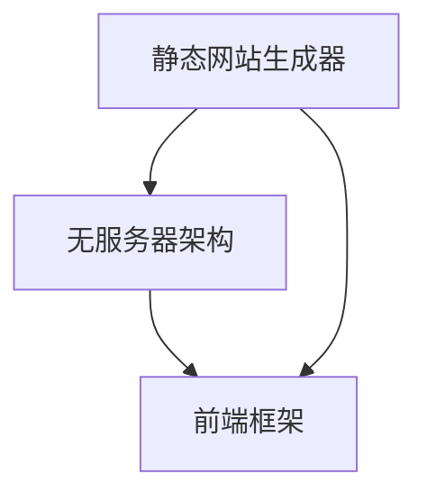

                 

关键词：Jamstack、现代Web开发、前端性能、可维护性、安全性

> 摘要：随着互联网技术的快速发展，Web开发正面临着巨大的变革。本文将深入探讨Jamstack这一现代Web开发的新范式，解析其核心概念、架构、优势以及应用场景，帮助开发者更好地理解和应用这一新兴技术。

## 1. 背景介绍

Web开发的历史可以追溯到20世纪90年代，当时基于HTML、CSS和JavaScript的静态网页成为了主流。然而，随着互联网的迅速发展，用户对交互体验和动态内容的需求日益增长，传统的客户端-服务器（Client-Server）架构逐渐暴露出许多问题，如性能瓶颈、可维护性差和安全性不足等。

为了解决这些问题，开发者们开始探索新的Web开发范式。静态网站生成器（Static Site Generators，SSG）和前端框架如React、Vue和Angular等逐渐兴起。这些新技术带来了更好的性能、可维护性和安全性。然而，它们仍然依赖于传统的服务器和数据库架构，存在着一定程度的性能和扩展性问题。

在这样的背景下，Jamstack应运而生。Jamstack是一种全新的Web开发架构，它结合了静态网站生成器、无服务器架构（Serverless）和前端框架，旨在解决传统Web开发面临的种种挑战。

## 2. 核心概念与联系

### 2.1 核心概念

#### 静态网站生成器（SSG）

静态网站生成器是一种工具，它可以从源数据中生成静态网页。这些静态网页可以直接部署到Web服务器上，无需服务器端处理。常见的静态网站生成器包括Jekyll、Hexo、Hugo等。

#### 无服务器架构（Serverless）

无服务器架构是一种云计算模型，它允许开发者运行应用程序而无需管理服务器。无服务器架构由云服务提供商管理，开发者只需专注于编写代码。常见的无服务器平台包括AWS Lambda、Google Cloud Functions、Azure Functions等。

#### 前端框架

前端框架是一种用于构建动态Web应用程序的工具，它提供了结构化和组件化的开发方式。常见的前端框架包括React、Vue和Angular等。

### 2.2 架构联系

Jamstack的架构由三个核心组件组成：静态网站生成器、无服务器架构和前端框架。这些组件之间相互协作，形成一个高效、可扩展的Web开发体系。

#### 静态网站生成器

静态网站生成器负责将源数据转换成静态网页，这些静态网页可以直接部署到Web服务器上。静态网页具有快速加载、无需服务器端处理和易于缓存等优势。

#### 无服务器架构

无服务器架构提供了动态内容的处理能力，开发者可以将无服务器函数部署到云平台上，以处理用户请求。无服务器架构具有弹性扩展、低延迟和高可用性等优点。

#### 前端框架

前端框架用于构建动态用户界面，它可以通过JavaScript动态更新页面内容。前端框架提供了组件化、模块化和响应式设计等功能，为开发者带来了更好的开发体验。

### 2.3 Mermaid 流程图

以下是一个简单的Mermaid流程图，展示了Jamstack的架构和组件之间的联系。



## 3. 核心算法原理 & 具体操作步骤

### 3.1 算法原理概述

Jamstack的核心算法原理在于将Web开发分为三个独立的部分：静态内容、动态内容和前端渲染。这种分而治之的方法有助于提高开发效率、性能和可维护性。

1. **静态内容**：使用静态网站生成器生成静态网页，这些网页可以直接部署到Web服务器上。

2. **动态内容**：使用无服务器架构处理动态请求，开发者可以编写无服务器函数以处理这些请求。

3. **前端渲染**：使用前端框架构建动态用户界面，前端框架可以通过JavaScript动态更新页面内容。

### 3.2 算法步骤详解

1. **静态内容生成**：
   - 开发者编写Markdown或HTML等源文件。
   - 使用静态网站生成器生成静态网页。
   - 将生成的静态网页部署到Web服务器上。

2. **动态内容处理**：
   - 开发者编写无服务器函数，如AWS Lambda函数。
   - 将无服务器函数部署到云平台。
   - 配置API网关或自定义域名以接收用户请求。

3. **前端渲染**：
   - 开发者使用前端框架构建用户界面。
   - 部署前端框架代码到Web服务器上。
   - 使用JavaScript动态更新页面内容。

### 3.3 算法优缺点

**优点**：

1. **高性能**：静态内容可以直接部署到Web服务器上，无需服务器端处理，从而提高了页面加载速度。

2. **高可维护性**：静态内容和动态内容分离，有助于代码的模块化和组件化，降低了维护难度。

3. **高安全性**：静态内容和无服务器架构减少了攻击面，降低了安全风险。

4. **弹性扩展**：无服务器架构可以根据请求量自动扩展，提高了系统的可靠性。

**缺点**：

1. **动态内容限制**：由于依赖于无服务器架构，动态内容的处理能力和性能可能受到限制。

2. **开发成本**：初期可能需要购买云服务器或云函数服务，增加了开发成本。

### 3.4 算法应用领域

1. **个人博客**：静态网站生成器非常适合构建个人博客，它具有快速加载和良好的搜索引擎优化（SEO）性能。

2. **企业网站**：企业网站可以使用Jamstack架构，以实现高性能、高可维护性和良好的用户体验。

3. **电子商务**：虽然Jamstack不太适合大型电子商务网站，但可以用于构建小型电子商务平台，以满足性能和可维护性的需求。

## 4. 数学模型和公式 & 详细讲解 & 举例说明

### 4.1 数学模型构建

在Jamstack架构中，可以构建以下数学模型：

1. **静态内容模型**：

   - 资源大小（R）：静态网页的大小（以字节为单位）。
   - 加载时间（T）：用户首次看到内容所需的时间（以秒为单位）。
   - 加速比（A）：静态内容加载时间与动态内容加载时间的比值。

   数学公式：A = T_dynamic / T_static

2. **动态内容模型**：

   - 函数执行时间（E）：无服务器函数的执行时间（以秒为单位）。
   - 函数调用次数（C）：在一段时间内函数的调用次数。
   - 平均响应时间（R）：函数的平均响应时间。

   数学公式：R = E / C

### 4.2 公式推导过程

为了推导出静态内容和动态内容的加速比，我们可以使用以下步骤：

1. **静态内容加速比**：

   - 假设静态网页的加载时间为T_static = 1秒。
   - 假设动态网页的加载时间为T_dynamic = 3秒。
   - 静态内容加速比为A = T_dynamic / T_static = 3 / 1 = 3。

2. **动态内容加速比**：

   - 假设无服务器函数的执行时间为E = 1秒。
   - 假设函数调用次数为C = 10次。
   - 动态内容平均响应时间为R = E / C = 1 / 10 = 0.1秒。

### 4.3 案例分析与讲解

假设一个博客网站使用Jamstack架构，静态网页大小为500KB，动态网页大小为200KB。静态网页的加载时间为2秒，动态网页的加载时间为4秒。

1. **静态内容加速比**：

   - 资源大小：R_static = 500KB
   - 加载时间：T_static = 2秒
   - 加速比：A_static = T_dynamic / T_static = 4 / 2 = 2

   因此，静态内容加速比为2，意味着静态网页的加载时间是动态网页的一半。

2. **动态内容加速比**：

   - 函数执行时间：E = 1秒
   - 函数调用次数：C = 10次
   - 平均响应时间：R = E / C = 1 / 10 = 0.1秒

   因此，动态内容平均响应时间为0.1秒，这意味着无服务器函数可以在短时间内处理大量请求。

## 5. 项目实践：代码实例和详细解释说明

### 5.1 开发环境搭建

1. **安装Node.js**：前往Node.js官网下载并安装Node.js。
2. **安装静态网站生成器**：以Hugo为例，在命令行中运行`npm install hugo`。
3. **安装前端框架**：以React为例，在命令行中运行`npm install create-react-app`。
4. **安装无服务器架构工具**：以AWS Lambda为例，在命令行中运行`npm install aws-sdk`。

### 5.2 源代码详细实现

1. **静态网站生成器**：使用Hugo生成静态网页。

   ```bash
   hugo new site my-site
   cd my-site
   hugo new post/my-first-post.md
   ```

2. **前端框架**：使用React创建前端框架。

   ```bash
   npx create-react-app my-app
   cd my-app
   npm run start
   ```

3. **无服务器架构**：使用AWS Lambda处理动态请求。

   ```bash
   npm install aws-lambda
   ```

### 5.3 代码解读与分析

1. **静态网站生成器**：

   - `post/my-first-post.md`：Markdown文件，包含博客文章内容。
   - `config.toml`：配置文件，设置网站的基本信息。

2. **前端框架**：

   - `src/App.js`：React应用程序的入口文件。
   - `src/index.css`：CSS文件，用于样式设计。

3. **无服务器架构**：

   - `index.js`：无服务器函数的入口文件。
   - `package.json`：包含无服务器函数的依赖和配置信息。

### 5.4 运行结果展示

1. **静态网站生成器**：

   - 在浏览器中访问`http://localhost:1313/`，查看生成的博客网站。

2. **前端框架**：

   - 在浏览器中访问`http://localhost:3000/`，查看React应用程序。

3. **无服务器架构**：

   - 在AWS Lambda控制台中查看无服务器函数的运行日志。

## 6. 实际应用场景

### 6.1 个人博客

个人博客是Jamstack的典型应用场景。静态网站生成器可以帮助开发者快速生成博客文章，而React等前端框架可以提供丰富的交互体验。

### 6.2 企业网站

企业网站也可以采用Jamstack架构，以实现高性能、高可维护性和良好的用户体验。静态内容可以部署到Web服务器上，而动态内容可以由无服务器架构处理。

### 6.3 电子商务

虽然大型电子商务网站通常不采用Jamstack架构，但可以用于构建小型电子商务平台，以满足性能和可维护性的需求。

## 7. 工具和资源推荐

### 7.1 学习资源推荐

1. 《静态网站生成器：原理与应用》
2. 《无服务器架构：原理与实践》
3. 《React实战：从入门到精通》

### 7.2 开发工具推荐

1. Hugo：静态网站生成器
2. AWS Lambda：无服务器架构
3. React：前端框架

### 7.3 相关论文推荐

1. "Static Site Generators: A Survey"
2. "Serverless Architectures: A Modern Approach to Building Web Applications"
3. "The Future of Web Development: Serverless and Jamstack"

## 8. 总结：未来发展趋势与挑战

### 8.1 研究成果总结

本文介绍了Jamstack这一现代Web开发的新范式，分析了其核心概念、架构、优势和应用场景。通过静态网站生成器、无服务器架构和前端框架的协同工作，Jamstack为开发者带来了高性能、高可维护性和良好的用户体验。

### 8.2 未来发展趋势

1. **性能优化**：随着5G和边缘计算的普及，Jamstack的性能将进一步优化，满足更多场景的需求。
2. **安全性增强**：开发者将更加注重安全性，采用更先进的加密技术和安全协议。
3. **生态建设**：随着Jamstack的流行，相关工具和资源的生态系统将不断完善。

### 8.3 面临的挑战

1. **动态内容限制**：无服务器架构的性能和功能可能受到限制，需要寻找更高效的解决方案。
2. **开发成本**：初期购买云服务器或云函数服务可能会增加开发成本。

### 8.4 研究展望

未来，Jamstack有望在更多领域得到应用，如物联网、区块链和虚拟现实等。通过不断优化和扩展，Jamstack将引领Web开发的未来。

## 9. 附录：常见问题与解答

### 9.1 什么是Jamstack？

Jamstack是一种现代Web开发范式，结合了静态网站生成器、无服务器架构和前端框架，以提高性能、可维护性和安全性。

### 9.2 Jamstack的优势是什么？

Jamstack的优势包括高性能、高可维护性、高安全性和弹性扩展等。

### 9.3 Jamstack适合哪些场景？

Jamstack适合个人博客、企业网站和小型电子商务平台等场景，尤其适合对性能和可维护性有较高要求的应用。

### 9.4 如何学习Jamstack？

可以通过阅读相关书籍、在线教程和参加技术社区活动来学习Jamstack。常用的学习资源包括《静态网站生成器：原理与应用》、《无服务器架构：原理与实践》和《React实战：从入门到精通》等。

作者：禅与计算机程序设计艺术 / Zen and the Art of Computer Programming
----------------------------------------------------------------


