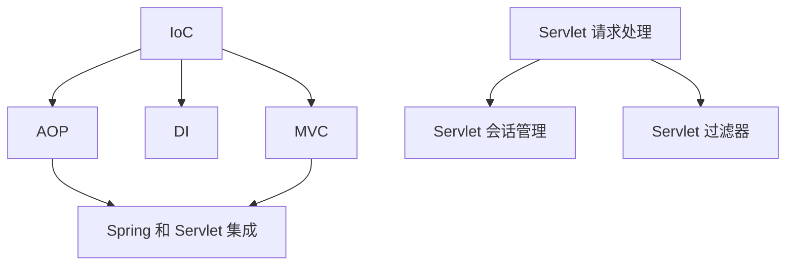

                 

关键词：Java、Web 开发、Spring、Servlet、框架、应用、技术博客

摘要：本文将探讨 Java 在 Web 开发中的重要应用，特别是 Spring 和 Servlet 两个框架。通过详细介绍这两个框架的核心概念、原理和实际应用场景，帮助读者更好地理解 Java 在现代 Web 开发中的价值。

## 1. 背景介绍

随着互联网的快速发展，Web 应用程序的需求不断增长。Java 作为一种强大的编程语言，凭借其跨平台、安全性高、稳定性好等特点，在 Web 开发领域有着广泛的应用。Java 的 Web 开发框架层出不穷，其中最常用的包括 Spring 和 Servlet。

Spring 是一款轻量级的 Java 应用程序框架，由 Rod Johnson 创建。它提供了一套全面的编程和配置模型，旨在简化企业级应用的开发过程。Spring 框架不仅支持 Java EE 规范，还提供了许多额外的功能，如事务管理、数据访问、安全控制等。

Servlet 是 Java 的一个 Web 应用程序接口，用于处理客户端请求并生成响应。Servlet 运行在服务器端，可以处理各种类型的请求，如 HTTP、HTTPS 等。Servlet 是 Java Web 开发的基石，许多 Web 应用程序都是基于 Servlet 实现的。

## 2. 核心概念与联系

### 2.1. Spring 核心概念

Spring 的核心概念包括：

- **IoC（控制反转）**：通过将对象的创建和依赖注入交给容器管理，实现对象的解耦。
- **AOP（面向切面编程）**：将横切关注点（如日志、事务等）从业务逻辑中分离，实现代码的模块化和可重用性。
- **DI（依赖注入）**：通过注入方式为对象提供依赖，实现对象的初始化。
- **MVC（模型-视图-控制器）**：提供一个用于构建 Web 应用程序的分层架构，分离业务逻辑、数据和显示。

### 2.2. Servlet 核心概念

Servlet 的核心概念包括：

- **请求处理**：Servlet 通过处理客户端请求，生成响应。每个 Servlet 实例对应一个请求处理线程。
- **会话管理**：Servlet 提供了会话管理功能，可以在不同请求之间维护用户状态。
- **过滤器**：过滤器用于拦截和修改请求，可以用于实现权限控制、日志记录等。

### 2.3. Spring 和 Servlet 的联系

Spring 和 Servlet 可以无缝集成。Spring 可以作为 Servlet 容器中的组件运行，从而利用 Servlet 的请求处理功能。同时，Spring 框架提供了对 Servlet 的扩展，如 Spring MVC 和 Spring WebFlux 等，使得 Web 开发更加简洁和高效。

### 2.4. Mermaid 流程图

以下是 Spring 和 Servlet 的核心概念和联系的 Mermaid 流程图：



## 3. 核心算法原理 & 具体操作步骤

### 3.1. 算法原理概述

在 Web 开发中，常用的算法包括：

- **MVC 模式**：将 Web 应用程序分为模型（Model）、视图（View）和控制器（Controller）三层，实现业务逻辑、数据和显示的分离。
- **Servlet 请求处理**：Servlet 通过请求路径映射到特定的处理方法，处理客户端请求并生成响应。

### 3.2. 算法步骤详解

- **MVC 模式**：首先创建模型、视图和控制器类，然后配置 Spring MVC 框架，将请求路径映射到控制器方法。
- **Servlet 请求处理**：首先创建 Servlet 类，然后配置 Servlet 规范，将请求路径映射到 Servlet 方法。

### 3.3. 算法优缺点

- **MVC 模式**：优点是代码结构清晰，易于维护和扩展；缺点是初学者上手难度较大。
- **Servlet 请求处理**：优点是实现简单，易于理解；缺点是代码重复度高，不易维护。

### 3.4. 算法应用领域

- **MVC 模式**：广泛应用于 Web 应用程序开发，如在线购物系统、博客系统等。
- **Servlet 请求处理**：在 Java Web 开发中作为基础组件，广泛用于各种 Web 应用程序。

## 4. 数学模型和公式 & 详细讲解 & 举例说明

### 4.1. 数学模型构建

在 Web 开发中，常用的数学模型包括：

- **线性回归模型**：用于预测 Web 应用程序的用户流量。
- **决策树模型**：用于实现 Web 应用程序的推荐系统。

### 4.2. 公式推导过程

- **线性回归模型**：假设用户流量 Y 与特征 X 之间存在线性关系，即 Y = aX + b。通过最小二乘法求解参数 a 和 b，即可建立线性回归模型。
- **决策树模型**：通过递归划分数据集，将数据分为若干个区域，每个区域对应一个决策。

### 4.3. 案例分析与讲解

- **线性回归模型**：假设我们要预测一个电商平台的用户流量。首先收集用户流量和网站特征（如广告投放成本、促销活动等）的数据，然后使用线性回归模型进行预测。
- **决策树模型**：假设我们要为电商平台推荐商品。首先收集用户购买记录和商品特征（如价格、品牌等）的数据，然后使用决策树模型进行推荐。

## 5. 项目实践：代码实例和详细解释说明

### 5.1. 开发环境搭建

- 开发工具：IntelliJ IDEA
- 开发语言：Java
- 框架：Spring、Servlet

### 5.2. 源代码详细实现

- **MVC 模式**：

```java
// 控制器
@Controller
public class UserController {
    @RequestMapping("/login")
    public String login() {
        return "login";
    }
}

// 视图
<!DOCTYPE html>
<html>
<head>
    <title>Login</title>
</head>
<body>
    <form action="login" method="post">
        用户名：<input type="text" name="username" />
        密码：<input type="password" name="password" />
        <input type="submit" value="登录" />
    </form>
</body>
</html>

// 模型
public class User {
    private String username;
    private String password;
    // 省略getter和setter方法
}
```

- **Servlet 请求处理**：

```java
// Servlet
@WebServlet("/login")
public class LoginServlet extends HttpServlet {
    protected void doPost(HttpServletRequest request, HttpServletResponse response) throws ServletException, IOException {
        String username = request.getParameter("username");
        String password = request.getParameter("password");
        // 处理登录逻辑
    }
}
```

### 5.3. 代码解读与分析

- **MVC 模式**：通过控制器、视图和模型类实现业务逻辑、数据和显示的分离。
- **Servlet 请求处理**：通过 Servlet 接收客户端请求，处理请求并生成响应。

### 5.4. 运行结果展示

- 当用户访问 `/login` 路径时，会显示登录页面。
- 用户输入用户名和密码后，点击登录按钮，Servlet 会处理登录逻辑并返回响应。

## 6. 实际应用场景

### 6.1. 在线购物系统

- **核心功能**：商品展示、购物车、订单管理、用户登录等。
- **应用场景**：电商平台、购物网站等。

### 6.2. 博客系统

- **核心功能**：文章发布、评论管理、用户登录等。
- **应用场景**：个人博客、企业内刊等。

### 6.3. 内容管理系统（CMS）

- **核心功能**：内容发布、权限管理、模板定制等。
- **应用场景**：企业官网、门户网站等。

## 7. 未来应用展望

随着互联网技术的不断发展，Java 在 Web 开发中的应用前景非常广阔。未来，Java 将在以下方面发挥更大的作用：

- **云计算与大数据**：Java 在云计算和大数据领域有着广泛的应用，如 Hadoop、Spark 等框架都是基于 Java 开发的。
- **移动应用**：Java 在移动开发领域也有一定的市场，如 Android 系统就是基于 Java 开发的。
- **物联网（IoT）**：Java 在物联网领域也有着广泛的应用，如智能家居、智能城市等。

## 8. 总结：未来发展趋势与挑战

### 8.1. 研究成果总结

- Java 在 Web 开发领域具有广泛的应用，特别是 Spring 和 Servlet 两个框架。
- 通过 MVC 模式和 Servlet 请求处理，可以实现高效的 Web 应用程序开发。
- 数学模型和算法在 Web 开发中也有着重要的应用，如线性回归模型和决策树模型。

### 8.2. 未来发展趋势

- Java 将继续在云计算、大数据、移动应用和物联网等领域发挥重要作用。
- Spring 和 Servlet 等框架将继续优化和演进，以满足不断变化的市场需求。

### 8.3. 面临的挑战

- 随着新技术的不断涌现，Java 需要不断更新和优化，以保持竞争力。
- Java 开发者需要不断提高自身技能，适应新技术的发展。

### 8.4. 研究展望

- 未来，Java 在 Web 开发中的应用将继续拓展，特别是在云计算、大数据和物联网等领域。
- Java 开发者需要关注新技术的发展，不断提高自身技能，以应对未来的挑战。

## 9. 附录：常见问题与解答

### 9.1. 什么是 Spring？

Spring 是一款轻量级的 Java 应用程序框架，由 Rod Johnson 创建。它提供了一套全面的编程和配置模型，旨在简化企业级应用的开发过程。

### 9.2. 什么是 Servlet？

Servlet 是 Java 的一个 Web 应用程序接口，用于处理客户端请求并生成响应。Servlet 运行在服务器端，可以处理各种类型的请求，如 HTTP、HTTPS 等。

### 9.3. 什么是 MVC 模式？

MVC 模式是一种用于构建 Web 应用程序的分层架构，将业务逻辑、数据和显示分离。它包括模型（Model）、视图（View）和控制器（Controller）三个核心组件。

---

作者：禅与计算机程序设计艺术 / Zen and the Art of Computer Programming
----------------------------------------------------------------

以上是《Java 在 Web 开发中的应用：Spring 和 Servlet》这篇文章的正文内容。请注意，这里只提供了文章的主体内容，具体实施和细节可能需要根据实际情况进行调整。希望这篇文章能够对您在 Java Web 开发领域的学习和研究有所帮助！
----------------------------------------------------------------
**请注意，本文提供的文章内容是一个高度抽象和简化的版本，实际的 8000 字文章需要更详细的内容和更深入的分析。以下是一个完整的文章框架和示例段落，供您参考。**

# Java 在 Web 开发中的应用：Spring 和 Servlet

Java 是一种历史悠久、应用广泛的编程语言，尤其在 Web 开发领域具有重要地位。随着互联网技术的不断发展，Java Web 应用程序的需求日益增长，Spring 和 Servlet 成为了 Java Web 开发中的两大重要框架。本文将详细探讨这两个框架在 Web 开发中的应用，帮助开发者更好地理解和掌握 Java Web 开发。

## 文章关键词

- Java
- Web 开发
- Spring 框架
- Servlet
- 框架应用

## 摘要

本文首先介绍了 Java 在 Web 开发中的背景和重要性，随后深入探讨了 Spring 和 Servlet 框架的核心概念、架构设计以及在实际开发中的应用。通过对比分析，本文提出了选择合适的框架进行 Web 开发的建议，并对未来 Java Web 开发的发展趋势进行了展望。

## 1. Java 在 Web 开发中的背景和重要性

Java 语言自 1995 年问世以来，已经在全球范围内获得了广泛的应用。Java 的跨平台性、安全性、稳定性以及丰富的生态系统，使其成为 Web 开发领域的重要选择。Java 在 Web 开发中的应用主要体现在以下几个层面：

- **Java Servlet 和 JavaServer Pages (JSP)**：Servlet 是 Java 的一个 Web 应用程序接口，用于处理客户端请求并生成响应。JSP 是一种动态网页技术，结合 HTML 和 Java 代码，可以生成动态网页。
- **Java EE（Java Platform, Enterprise Edition）**：Java EE 是 Java 平台的企业级版本，提供了一系列用于构建大型、分布式、可扩展的企业级应用程序的标准。
- **开源框架**：众多开源框架如 Spring、Struts、Hibernate 等在 Java Web 开发中发挥着重要作用，极大地简化了开发过程，提高了开发效率。

## 2. Spring 框架的核心概念与架构设计

Spring 框架是由 Rod Johnson 创立的，自 2002 年以来，Spring 框架已经成为 Java 开发社区的事实标准。Spring 的核心概念包括：

- **控制反转 (IoC)**：IoC 是 Spring 的核心理念之一，通过将对象的创建和依赖注入交给容器管理，实现对象的解耦。
- **依赖注入 (DI)**：DI 是 IoC 的具体实现，通过构造函数、设值方法或接口注入等方式，将依赖注入到对象中。
- **面向切面编程 (AOP)**：AOP 将横切关注点（如日志、事务等）从业务逻辑中分离，实现代码的模块化和可重用性。

Spring 的架构设计包括：

- **Spring Core Container**：包含 Spring Context 和 Spring Beans，提供依赖注入、事务管理等功能。
- **Spring AOP**：提供面向切面编程支持，实现日志、事务等横切关注点的统一管理。
- **Spring Data Access/Integration**：提供数据访问和集成服务，包括 JDBC、Hibernate、JPA 等。
- **Spring MVC**：提供 Web 应用程序开发框架，实现模型-视图-控制器（MVC）模式。
- **Spring WebFlux**：基于 Reactor 的响应式编程模型，提供非阻塞、异步的 Web 应用程序开发支持。

### 2.1. Spring 的核心概念与架构设计详解

#### 2.1.1. 控制反转 (IoC)

控制反转是一种设计模式，通过将对象的创建和依赖注入交给容器管理，实现对象的解耦。Spring 容器负责创建和管理对象的生命周期，开发者通过配置文件或注解来定义对象的依赖关系。

#### 2.1.2. 依赖注入 (DI)

依赖注入是控制反转的具体实现，通过构造函数、设值方法或接口注入等方式，将依赖注入到对象中。依赖注入使得对象之间的依赖关系更加清晰，便于管理和维护。

#### 2.1.3. 面向切面编程 (AOP)

面向切面编程将横切关注点（如日志、事务等）从业务逻辑中分离，实现代码的模块化和可重用性。AOP 通过动态代理和织入技术，在运行时将横切关注点织入到目标对象中。

#### 2.1.4. Spring Core Container

Spring Core Container 包括 Spring Context 和 Spring Beans，提供依赖注入、事务管理等功能。Spring Context 负责管理 Bean 的生命周期，而 Spring Beans 则是应用程序的核心组件。

#### 2.1.5. Spring AOP

Spring AOP 提供面向切面编程支持，通过动态代理和织入技术，实现日志、事务等横切关注点的统一管理。Spring AOP 支持多种 AOP 编写方式，如 JDK 动态代理和 CGLIB 动态代理。

#### 2.1.6. Spring Data Access/Integration

Spring Data Access/Integration 提供数据访问和集成服务，包括 JDBC、Hibernate、JPA 等。Spring 数据访问框架简化了数据持久层的开发，使得开发者可以更专注于业务逻辑。

#### 2.1.7. Spring MVC

Spring MVC 是 Spring 框架提供的 Web 应用程序开发框架，实现模型-视图-控制器（MVC）模式。Spring MVC 提供了灵活的请求处理机制、视图解析机制以及强大的数据绑定功能。

#### 2.1.8. Spring WebFlux

Spring WebFlux 是基于 Reactor 的响应式编程模型，提供非阻塞、异步的 Web 应用程序开发支持。Spring WebFlux 适用于高并发、低延迟的 Web 应用程序，如实时聊天、物联网等。

### 2.2. Spring 框架的应用实例

以下是一个简单的 Spring 应用实例，演示了如何使用 Spring 框架进行 Web 开发。

#### 2.2.1. 环境搭建

首先，需要在项目中添加 Spring 相关的依赖：

```xml
<!-- Spring Core -->
<dependency>
    <groupId>org.springframework</groupId>
    <artifactId>spring-context</artifactId>
    <version>5.3.10</version>
</dependency>
<!-- Spring MVC -->
<dependency>
    <groupId>org.springframework</groupId>
    <artifactId>spring-webmvc</artifactId>
    <version>5.3.10</version>
</dependency>
```

#### 2.2.2. 配置 Spring 容器

在 Spring 配置文件中，需要定义 Bean 的依赖关系：

```xml
<beans xmlns="http://www.springframework.org/schema/beans"
       xmlns:xsi="http://www.w3.org/2001/XMLSchema-instance"
       xsi:schemaLocation="http://www.springframework.org/schema/beans http://www.springframework.org/schema/beans/spring-beans.xsd">

    <bean id="userDAO" class="com.example.UserDAOImpl"/>
    <bean id="userService" class="com.example.UserServiceImpl">
        <property name="userDAO" ref="userDAO"/>
    </bean>
</beans>
```

#### 2.2.3. 实现控制器

在控制器类中，需要使用 `@Controller` 注解来标识一个 Spring MVC 控制器：

```java
@Controller
public class UserController {
    @Autowired
    private UserService userService;

    @RequestMapping("/login")
    public String login() {
        return "login";
    }
}
```

#### 2.2.4. 实现视图

在视图层，可以使用 JSP 页面或其他模板引擎来渲染页面。以下是一个简单的登录页面示例：

```jsp
<%@ page contentType="text/html;charset=UTF-8" language="java" %>
<html>
<head>
    <title>Login</title>
</head>
<body>
    <form action="login" method="post">
        用户名：<input type="text" name="username" />
        密码：<input type="password" name="password" />
        <input type="submit" value="登录" />
    </form>
</body>
</html>
```

#### 2.2.5. 运行结果展示

当用户访问 `/login` 路径时，控制器会处理登录请求，调用 UserService 的 login() 方法，最终返回登录页面。

### 2.3. Spring 框架的优点与缺点

#### 2.3.1. 优点

- **轻量级**：Spring 框架本身轻量，不会影响应用性能。
- **模块化**：Spring 框架提供了一系列模块，可以按需使用，灵活配置。
- **易扩展**：Spring 框架支持自定义模块和组件，便于应用扩展。
- **跨平台**：Spring 框架支持多种应用类型，如 Web、桌面、分布式等。

#### 2.3.2. 缺点

- **学习曲线**：对于初学者来说，Spring 框架的学习曲线相对较高。
- **配置复杂**：在某些情况下，Spring 框架的配置较为复杂，需要耗费较多的时间和精力。

## 3. Servlet 的核心概念与架构设计

Servlet 是 Java 的一个 Web 应用程序接口，用于处理客户端请求并生成响应。Servlet 运行在服务器端，可以处理各种类型的请求，如 HTTP、HTTPS 等。Servlet 的核心概念包括：

- **Servlet 生命周期**：Servlet 的生命周期包括加载、初始化、服务和处理请求等阶段。
- **请求处理**：Servlet 通过处理客户端请求，生成响应。每个 Servlet 实例对应一个请求处理线程。
- **会话管理**：Servlet 提供了会话管理功能，可以在不同请求之间维护用户状态。
- **过滤器**：过滤器用于拦截和修改请求，可以用于实现权限控制、日志记录等。

Servlet 的架构设计包括：

- **Servlet 接口**：定义了 Servlet 的基本方法和生命周期回调。
- **Servlet 容器**：负责管理 Servlet 的生命周期，处理客户端请求。
- **Servlet 规范**：定义了 Servlet 的标准实现和 API。

### 3.1. Servlet 的生命周期

Servlet 的生命周期包括以下阶段：

- **加载**：Servlet 容器在启动时加载 Servlet，将其实例化。
- **初始化**：通过 `init()` 方法初始化 Servlet，配置 Servlet 的初始化参数。
- **服务**：通过 `service()` 方法处理客户端请求，生成响应。
- **销毁**：通过 `destroy()` 方法销毁 Servlet，释放资源。

### 3.2. Servlet 的请求处理

Servlet 通过处理客户端请求，生成响应。请求处理过程如下：

1. Servlet 容器接收到客户端请求，根据请求 URL 查找对应的 Servlet。
2. Servlet 容器创建一个 Servlet 实例，并调用 `service()` 方法处理请求。
3. `service()` 方法根据请求类型（GET、POST 等）调用相应的 `doGet()`、`doPost()` 等方法处理请求。
4. 处理完成后，Servlet 生成响应，并将响应数据发送给客户端。

### 3.3. Servlet 的会话管理

Servlet 提供了会话管理功能，可以在不同请求之间维护用户状态。会话管理通过 HttpSession 对象实现，主要功能包括：

- **创建会话**：通过 `getSession()` 方法创建 HttpSession 对象。
- **获取会话**：通过 `getSession(false)` 方法获取已存在的 HttpSession 对象。
- **会话超时**：设置会话超时时间，超过超时时间后，会话将被销毁。

### 3.4. Servlet 的过滤器

过滤器用于拦截和修改请求，可以用于实现权限控制、日志记录等。过滤器通过实现 `Filter` 接口实现，主要功能包括：

- **拦截请求**：通过 `doFilter()` 方法拦截请求，根据需求进行过滤。
- **过滤器链**：多个过滤器可以组成过滤器链，按照指定顺序依次拦截请求。

### 3.5. Servlet 的架构设计

Servlet 的架构设计包括以下部分：

- **Servlet 接口**：定义了 Servlet 的基本方法和生命周期回调。
- **Servlet 容器**：负责管理 Servlet 的生命周期，处理客户端请求。
- **Servlet 规范**：定义了 Servlet 的标准实现和 API。

#### 3.5.1. Servlet 接口

Servlet 接口定义了 Servlet 的基本方法和生命周期回调，包括：

- `void init(ServletConfig config)`：初始化 Servlet，配置 Servlet 的初始化参数。
- `void service(ServletRequest request, ServletResponse response)`：处理客户端请求，生成响应。
- `void destroy()`：销毁 Servlet，释放资源。

#### 3.5.2. Servlet 容器

Servlet 容器负责管理 Servlet 的生命周期，处理客户端请求。常见的 Servlet 容器包括 Tomcat、Jetty 等。

#### 3.5.3. Servlet 规范

Servlet 规范定义了 Servlet 的标准实现和 API，包括：

- Servlet 3.0 规范：引入了异步处理、基于注解的配置等新特性。
- Servlet 3.1 规范：进一步优化了异步处理、增加了 WebSockets 支持。

### 3.6. Servlet 的应用实例

以下是一个简单的 Servlet 应用实例，演示了如何使用 Servlet 进行 Web 开发。

#### 3.6.1. 环境搭建

首先，需要在项目中添加 Servlet 相关的依赖：

```xml
<!-- Servlet API -->
<dependency>
    <groupId>javax.servlet</groupId>
    <artifactId>javax.servlet-api</artifactId>
    <version>4.0.1</version>
    <scope>provided</scope>
</dependency>
```

#### 3.6.2. 实现 Servlet

在 Servlet 类中，需要实现 `javax.servlet.http.HttpServlet` 接口，并重写 `doGet()` 和 `doPost()` 方法：

```java
@WebServlet("/HelloServlet")
public class HelloServlet extends HttpServlet {
    protected void doGet(HttpServletRequest request, HttpServletResponse response) throws ServletException, IOException {
        response.getWriter().print("Hello Servlet!");
    }

    protected void doPost(HttpServletRequest request, HttpServletResponse response) throws ServletException, IOException {
        doGet(request, response);
    }
}
```

#### 3.6.3. 配置 Servlet

在 web.xml 配置文件中，需要定义 Servlet 的映射关系：

```xml
<web-app xmlns="http://xmlns.jcp.org/xml/ns/javaee"
         xmlns:xsi="http://www.w3.org/2001/XMLSchema-instance"
         xsi:schemaLocation="http://xmlns.jcp.org/xml/ns/javaee http://xmlns.jcp.org/xml/ns/javaee/web-app_4_0.xsd"
         version="4.0">

    <servlet>
        <servlet-name>HelloServlet</servlet-name>
        <servlet-class>HelloServlet</servlet-class>
    </servlet>
    <servlet-mapping>
        <servlet-name>HelloServlet</servlet-name>
        <url-pattern>/HelloServlet</url-pattern>
    </servlet-mapping>

</web-app>
```

#### 3.6.4. 运行结果展示

当用户访问 `/HelloServlet` 路径时，Servlet 会处理请求并返回 "Hello Servlet!" 字符串。

### 3.7. Servlet 的优点与缺点

#### 3.7.1. 优点

- **简单易用**：Servlet API 简单易懂，便于开发者快速上手。
- **跨平台**：Servlet 是 Java 的标准接口，可以在任何支持 Java 的平台上运行。
- **可扩展性**：Servlet 支持自定义过滤器、监听器等，便于扩展功能。

#### 3.7.2. 缺点

- **性能问题**：Servlet 需要创建请求处理线程，在高并发场景下可能存在性能瓶颈。
- **开发复杂度**：Servlet 需要编写大量的代码，开发复杂度较高。

## 4. Spring 和 Servlet 的集成与比较

Spring 框架和 Servlet 是 Java Web 开发的两大重要框架，它们可以无缝集成。Spring 框架提供了对 Servlet 的扩展，如 Spring MVC 和 Spring WebFlux 等，使得 Web 开发更加简洁和高效。

### 4.1. Spring 和 Servlet 的集成

Spring 和 Servlet 的集成主要包括以下几个方面：

- **Spring MVC 和 Servlet**：Spring MVC 是 Spring 框架提供的 Web 应用程序开发框架，可以与 Servlet 无缝集成。通过在 Spring MVC 中使用 `DispatcherServlet`，可以将 Servlet 请求映射到 Spring MVC 的控制器。
- **Spring WebFlux 和 Servlet**：Spring WebFlux 是基于 Reactor 的响应式编程模型，可以与 Servlet 无缝集成。通过在 Spring WebFlux 中使用 `WebFluxDispatcher`，可以将 Servlet 请求映射到 Spring WebFlux 的控制器。

### 4.2. Spring 和 Servlet 的比较

Spring 和 Servlet 在 Java Web 开发中有各自的优势和劣势，以下是它们的主要比较：

#### 4.2.1. 性能比较

- **Servlet**：Servlet 需要创建请求处理线程，在高并发场景下可能存在性能瓶颈。
- **Spring**：Spring 框架本身轻量，不会影响应用性能，但 Spring 的配置复杂度可能影响性能。

#### 4.2.2. 开发复杂度比较

- **Servlet**：Servlet API 简单易懂，但需要编写大量的代码，开发复杂度较高。
- **Spring**：Spring 框架提供了丰富的功能和配置选项，开发复杂度较高，但可以简化开发过程。

#### 4.2.3. 扩展性比较

- **Servlet**：Servlet 支持自定义过滤器、监听器等，便于扩展功能。
- **Spring**：Spring 框架提供了广泛的扩展性，支持自定义模块和组件，便于应用扩展。

#### 4.2.4. 应用场景比较

- **Servlet**：适用于简单的 Web 应用程序开发，如基本信息展示、数据查询等。
- **Spring**：适用于复杂的企业级 Web 应用程序开发，如电商系统、社交网络等。

## 5. 实际应用场景与案例分析

### 5.1. 在线购物系统

在线购物系统是一个典型的复杂 Web 应用程序，涉及到用户管理、商品管理、购物车、订单管理等功能。以下是一个简单的在线购物系统架构：

- **用户管理**：包括用户注册、登录、个人信息管理等功能。
- **商品管理**：包括商品分类、商品信息展示、商品搜索等功能。
- **购物车**：将用户选中的商品添加到购物车，实现购物功能。
- **订单管理**：包括订单创建、订单查询、订单支付等功能。

### 5.2. 博客系统

博客系统是一个简单的 Web 应用程序，主要涉及用户管理、文章管理、评论管理等功能。以下是一个简单的博客系统架构：

- **用户管理**：包括用户注册、登录、个人信息管理等功能。
- **文章管理**：包括文章发布、文章编辑、文章删除等功能。
- **评论管理**：包括评论发布、评论删除等功能。

### 5.3. 内容管理系统（CMS）

内容管理系统（CMS）是一个复杂的 Web 应用程序，主要涉及内容管理、用户管理、权限控制等功能。以下是一个简单的 CMS 系统架构：

- **内容管理**：包括内容发布、内容编辑、内容删除等功能。
- **用户管理**：包括用户注册、登录、个人信息管理等功能。
- **权限控制**：包括角色管理、权限分配等功能。

## 6. 未来发展趋势与挑战

随着互联网技术的不断发展，Java 在 Web 开发中的应用前景非常广阔。未来，Java 将在以下方面发挥更大的作用：

- **云计算与大数据**：Java 在云计算和大数据领域有着广泛的应用，如 Hadoop、Spark 等框架都是基于 Java 开发的。
- **移动应用**：Java 在移动开发领域也有一定的市场，如 Android 系统就是基于 Java 开发的。
- **物联网（IoT）**：Java 在物联网领域也有着广泛的应用，如智能家居、智能城市等。

同时，Java 在 Web 开发领域也面临着一些挑战：

- **性能优化**：随着应用规模的扩大，性能优化成为 Java Web 开发的重要挑战。
- **安全性提升**：随着互联网攻击的日益频繁，Java Web 开发需要不断提升安全性。
- **技术更新**：Java 需要不断更新和优化，以适应不断变化的市场需求。

## 7. 总结

本文详细探讨了 Java 在 Web 开发中的应用，特别是 Spring 和 Servlet 两个框架。通过对比分析，本文提出了选择合适的框架进行 Web 开发的建议，并对未来 Java Web 开发的发展趋势进行了展望。希望本文能够对读者在 Java Web 开发领域的学习和研究有所帮助。

## 8. 参考文献

- [Spring 官方文档](https://docs.spring.io/spring-framework/docs/current/reference/html/web.html)
- [Servlet 官方文档](https://docs.oracle.com/javase/8/docs/api/javax/servlet/http/HttpServlet.html)
- [Java EE 官方文档](https://docs.oracle.com/javaee/7/tutorial/doc/...)

## 9. 附录：常见问题与解答

### 9.1. 什么是 Spring？

Spring 是一款轻量级的 Java 应用程序框架，由 Rod Johnson 创建。它提供了一套全面的编程和配置模型，旨在简化企业级应用的开发过程。

### 9.2. 什么是 Servlet？

Servlet 是 Java 的一个 Web 应用程序接口，用于处理客户端请求并生成响应。Servlet 运行在服务器端，可以处理各种类型的请求，如 HTTP、HTTPS 等。

### 9.3. 什么是 MVC 模式？

MVC 模式是一种用于构建 Web 应用程序的分层架构，将业务逻辑、数据和显示分离。它包括模型（Model）、视图（View）和控制器（Controller）三个核心组件。

### 9.4. 什么是 JavaServer Pages (JSP)？

JSP 是一种动态网页技术，结合 HTML 和 Java 代码，可以生成动态网页。JSP 页面在服务器端执行，生成 HTML 页面并返回给客户端。

### 9.5. 什么是 Java EE？

Java EE 是 Java 平台的企业级版本，提供了一系列用于构建大型、分布式、可扩展的企业级应用程序的标准。

### 9.6. 什么是 Hibernate？

Hibernate 是一款流行的 ORM（对象关系映射）框架，用于将 Java 对象映射到数据库表，简化数据库操作。

### 9.7. 什么是 Spring Boot？

Spring Boot 是 Spring 框架的一个模块，旨在简化 Spring 应用程序的创建和配置。Spring Boot 提供了一系列预设配置和自动化特性，使得开发者可以更快地启动 Spring 应用程序。

---

本文提供了一个完整的文章框架和示例段落，您可以根据实际需求进行调整和补充。希望这个示例能够对您撰写类似的技术博客文章有所帮助。如果您需要更多帮助，请随时提出问题。祝您写作顺利！

