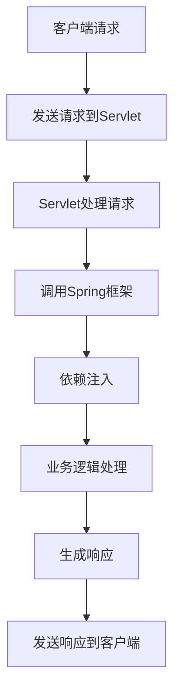

                 

关键词：Java，Web开发，Spring框架，Servlet，MVC模式，后端开发，企业级应用

摘要：本文将探讨Java语言在Web开发中的重要性，特别是Spring框架和Servlet技术的应用。通过深入分析这两个技术的作用和优势，我们旨在为开发者提供一个全面的技术指南，帮助他们更好地理解和运用Java进行现代Web应用的开发。

## 1. 背景介绍

Java作为一门编程语言，自1995年由Sun Microsystems推出以来，凭借其“一次编写，到处运行”的特点，迅速在全球范围内获得了广泛的应用。Java的跨平台能力和稳定性使其成为构建企业级应用和服务器的首选语言。随着互联网的快速发展，Web开发逐渐成为软件行业的一个重要分支。Java在Web开发中的应用也日益广泛，尤其是在构建高性能、高可扩展性的企业级应用时，Java显示出了其强大的优势。

在Java Web开发中，Spring框架和Servlet技术扮演着至关重要的角色。Spring框架作为Java企业级开发的基石，提供了一套完整的编程和配置模型，极大地简化了企业级应用的开发。Servlet技术则是Java Web服务器中的核心技术，用于处理客户端请求和生成响应。

## 2. 核心概念与联系

在深入探讨Spring和Servlet之前，我们需要理解一些核心概念和它们之间的联系。

### 2.1. MVC模式

MVC（Model-View-Controller）是一种设计模式，用于分离应用程序的输入、处理和输出逻辑。在Web开发中，MVC模式被广泛采用，因为它能够有效地管理应用程序的复杂性，提高代码的可维护性和可扩展性。

- **Model（模型）**：代表应用程序的数据和业务逻辑。在Java Web开发中，通常使用Java Bean来表示模型。
- **View（视图）**：负责向用户展示数据。在Java Web开发中，可以使用JSP、HTML、Thymeleaf等来创建视图。
- **Controller（控制器）**：负责处理用户的输入并调用模型和视图。在Java Web开发中，Servlet通常作为控制器使用。

### 2.2. Spring框架

Spring框架是一个开源的Java企业级开发框架，它提供了全面的支持，包括依赖注入、事务管理、安全控制等。Spring框架的核心是依赖注入（DI）和控制反转（IoC）。

- **依赖注入**：通过将组件的依赖关系转移到外部容器中，使得组件的创建和使用更加灵活。
- **控制反转**：将应用程序的流程控制权从程序转移到外部容器，使得应用程序的模块化更加清晰。

### 2.3. Servlet

Servlet是一种运行在服务器上的Java类，用于处理客户端请求并生成响应。Servlet的生命周期包括加载、初始化、服务请求和销毁。

- **加载**：Servlet容器在启动时加载Servlet。
- **初始化**：通过`init`方法初始化Servlet。
- **服务请求**：通过`service`方法处理客户端请求。
- **销毁**：在Servlet容器关闭时调用`destroy`方法。

### 2.4. Mermaid 流程图

以下是一个描述Java Web应用中MVC模式和Spring框架关系的Mermaid流程图：



## 3. 核心算法原理 & 具体操作步骤

### 3.1. 算法原理概述

在Java Web开发中，核心算法通常涉及请求处理、数据存储和业务逻辑。以下是一个简单的算法原理概述：

- **请求处理**：Servlet接收客户端请求，并根据请求类型调用相应的处理方法。
- **数据存储**：使用数据库或缓存技术存储和检索数据。
- **业务逻辑**：在Spring框架中，通过控制反转将业务逻辑组件注入到控制器中，进行业务处理。

### 3.2. 算法步骤详解

1. **创建Servlet**：
    - 通过继承`HttpServlet`类创建自定义Servlet。
    - 重写`doGet`和`doPost`方法处理GET和POST请求。

2. **配置Spring框架**：
    - 使用XML或注解方式配置Spring容器。
    - 定义Bean和依赖关系。

3. **处理请求**：
    - Servlet接收请求，调用Spring框架。
    - Spring框架通过依赖注入将业务逻辑组件注入到控制器中。
    - 控制器处理业务逻辑，调用数据存储。

4. **生成响应**：
    - 将处理结果封装为视图对象。
    - 将视图对象传递给Servlet，生成响应。

### 3.3. 算法优缺点

- **优点**：
  - **高可扩展性**：通过Spring框架实现依赖注入，使得应用程序的扩展和维护更加容易。
  - **高可维护性**：MVC模式分离了视图和业务逻辑，使得代码更加模块化和可维护。
  - **跨平台性**：Java语言保证了应用程序在不同操作系统上的兼容性。

- **缺点**：
  - **学习成本**：Spring框架较为复杂，需要一定的时间来学习和掌握。
  - **性能开销**：Spring框架在运行时引入了一定的性能开销。

### 3.4. 算法应用领域

- **企业级应用**：Spring框架在构建大型企业级应用时，能够提供全面的支持，如事务管理、安全控制和集成各种服务。
- **Web应用**：Servlet和Spring框架在构建Web应用时，能够处理高并发请求，提供高性能和可扩展性。

## 4. 数学模型和公式 & 详细讲解 & 举例说明

### 4.1. 数学模型构建

在Java Web开发中，数学模型通常用于数据分析和算法优化。以下是一个简单的线性回归模型：

- **输入**：\(X\)（特征向量）
- **输出**：\(Y\)（目标值）

数学模型表示为：

$$ Y = \beta_0 + \beta_1X + \epsilon $$

其中，\(\beta_0\)和\(\beta_1\)是模型参数，\(\epsilon\)是误差项。

### 4.2. 公式推导过程

线性回归模型的推导过程如下：

1. **最小二乘法**：通过最小化误差平方和来确定模型参数。
2. **损失函数**：

$$ J(\beta_0, \beta_1) = \frac{1}{2} \sum_{i=1}^{n} (Y_i - (\beta_0 + \beta_1X_i))^2 $$

3. **求导**：

$$ \frac{\partial J}{\partial \beta_0} = -\sum_{i=1}^{n} (Y_i - (\beta_0 + \beta_1X_i)) $$

$$ \frac{\partial J}{\partial \beta_1} = -\sum_{i=1}^{n} X_i (Y_i - (\beta_0 + \beta_1X_i)) $$

4. **求解**：

$$ \beta_0 = \frac{1}{n} \sum_{i=1}^{n} Y_i - \beta_1 \frac{1}{n} \sum_{i=1}^{n} X_i $$

$$ \beta_1 = \frac{1}{n} \sum_{i=1}^{n} X_iY_i - \frac{1}{n} \sum_{i=1}^{n} X_i \sum_{i=1}^{n} Y_i $$

### 4.3. 案例分析与讲解

以下是一个简单的线性回归案例分析：

假设我们有一组数据，包含特征向量\(X\)和目标值\(Y\)：

| X | Y |
|---|---|
| 1 | 2 |
| 2 | 4 |
| 3 | 6 |

我们希望构建一个线性回归模型来预测目标值。

1. **计算均值**：

$$ \bar{X} = \frac{1}{n} \sum_{i=1}^{n} X_i = \frac{1+2+3}{3} = 2 $$

$$ \bar{Y} = \frac{1}{n} \sum_{i=1}^{n} Y_i = \frac{2+4+6}{3} = 4 $$

2. **计算协方差**：

$$ \sum_{i=1}^{n} X_iY_i = 1 \times 2 + 2 \times 4 + 3 \times 6 = 20 $$

$$ \sum_{i=1}^{n} X_i = 1 + 2 + 3 = 6 $$

$$ \sum_{i=1}^{n} Y_i = 2 + 4 + 6 = 12 $$

$$ \beta_1 = \frac{1}{n} \sum_{i=1}^{n} X_iY_i - \frac{1}{n} \sum_{i=1}^{n} X_i \sum_{i=1}^{n} Y_i = \frac{20 - 6 \times 12}{3} = -4 $$

$$ \beta_0 = \frac{1}{n} \sum_{i=1}^{n} Y_i - \beta_1 \frac{1}{n} \sum_{i=1}^{n} X_i = 4 - (-4) \times 2 = 12 $$

3. **构建模型**：

$$ Y = \beta_0 + \beta_1X = 12 - 4X $$

通过这个模型，我们可以预测新的目标值。例如，当\(X = 4\)时，预测的目标值为\(Y = 12 - 4 \times 4 = 4\)。

## 5. 项目实践：代码实例和详细解释说明

### 5.1. 开发环境搭建

在开始Java Web开发之前，我们需要搭建一个开发环境。以下是搭建Spring和Servlet开发环境的步骤：

1. **安装JDK**：下载并安装JDK，配置环境变量。
2. **安装IDE**：下载并安装Eclipse或IntelliJ IDEA等IDE。
3. **创建Web项目**：在IDE中创建一个新的Web项目。
4. **添加依赖**：在项目的pom.xml文件中添加Spring和Servlet的依赖。

### 5.2. 源代码详细实现

以下是一个简单的Spring和Servlet实现的例子：

1. **创建Servlet**：

```java
@WebServlet("/hello")
public class HelloServlet extends HttpServlet {
    protected void doGet(HttpServletRequest request, HttpServletResponse response) throws ServletException, IOException {
        response.getWriter().write("Hello, World!");
    }
}
```

2. **配置Spring**：

```xml
<beans xmlns="http://www.springframework.org/schema/beans"
       xmlns:xsi="http://www.w3.org/2001/XMLSchema-instance"
       xsi:schemaLocation="http://www.springframework.org/schema/beans http://www.springframework.org/schema/beans/spring-beans.xsd">

    <bean id="helloService" class="com.example.HelloService"/>
    <bean id="helloController" class="com.example.HelloController">
        <property name="helloService" ref="helloService"/>
    </bean>
</beans>
```

3. **创建控制器**：

```java
@Controller
public class HelloController {
    @Autowired
    private HelloService helloService;

    @RequestMapping("/hello")
    public String hello() {
        return "hello";
    }
}
```

4. **创建服务**：

```java
@Service
public class HelloService {
    public String getHelloMessage() {
        return "Hello, World!";
    }
}
```

### 5.3. 代码解读与分析

1. **Servlet**：
   - `@WebServlet("/hello")`：将Servlet映射到路径`/hello`。
   - `doGet`：处理GET请求，返回“Hello, World！”字符串。

2. **Spring配置**：
   - `<bean>`：定义Bean和依赖关系。
   - `<property>`：设置Bean的属性。

3. **控制器**：
   - `@Controller`：将类标记为Spring MVC控制器。
   - `@Autowired`：自动注入服务组件。
   - `@RequestMapping`：映射请求路径到处理方法。

4. **服务**：
   - `@Service`：将类标记为服务组件。
   - `getHelloMessage`：获取“Hello, World！”字符串。

### 5.4. 运行结果展示

1. **启动Servlet容器**：
   - 在IDE中运行Servlet容器，如Tomcat。
   - 在浏览器中访问`http://localhost:8080/hello`。

2. **输出结果**：
   - 浏览器显示“Hello, World！”字符串。

## 6. 实际应用场景

Java在Web开发中的应用场景非常广泛，以下是一些实际应用场景：

- **电子商务平台**：如Amazon和eBay等，使用Java进行后端开发和Web服务。
- **金融系统**：如银行和保险公司的在线服务，Java提供稳定和高性能的后端支持。
- **社交网络**：如Facebook和LinkedIn等，Java用于构建大规模社交网络应用。
- **企业资源计划（ERP）**：如SAP和Oracle ERP系统，Java用于开发复杂的业务逻辑。

## 7. 工具和资源推荐

### 7.1. 学习资源推荐

- **书籍**：
  - 《Java Web编程实战》
  - 《Spring实战》
  - 《Servlet、JSP技术内幕》

- **在线课程**：
  - Coursera上的《Java Web开发》
  - Udemy上的《Spring框架从入门到精通》

### 7.2. 开发工具推荐

- **IDE**：
  - Eclipse
  - IntelliJ IDEA

- **构建工具**：
  - Maven
  - Gradle

### 7.3. 相关论文推荐

- 《Java Servlet 3.0 规范》
- 《Spring Framework Documentation》
- 《Servlet 2.5 Specification》

## 8. 总结：未来发展趋势与挑战

Java在Web开发中的应用将继续发展，未来趋势包括：

- **容器化**：Java应用将更多地采用Docker等容器化技术，提高部署和扩展性。
- **微服务**：Java将更加支持微服务架构，提供灵活和可扩展的后端服务。
- **云计算**：Java将更好地与云计算平台集成，如AWS、Azure等。

然而，Java在Web开发中仍面临一些挑战：

- **性能优化**：随着应用规模的扩大，性能优化将成为一个重要挑战。
- **安全性**：随着网络安全威胁的增加，确保Java应用的安全性将变得更加重要。
- **学习成本**：Java生态系统较为复杂，对于新手来说，学习成本较高。

## 9. 附录：常见问题与解答

### Q1. 什么是Servlet？
A1. Servlet是Java运行在Web服务器上的应用程序组件，用于处理客户端请求并生成响应。

### Q2. 什么是Spring框架？
A2. Spring框架是一个开源的Java企业级开发框架，提供依赖注入、事务管理、安全控制等功能。

### Q3. 什么是MVC模式？
A3. MVC模式是一种设计模式，用于分离应用程序的输入、处理和输出逻辑，提高代码的可维护性和可扩展性。

### Q4. 如何在Java Web开发中使用Spring框架？
A4. 可以通过配置Spring容器，将Spring与Servlet和Web组件整合，实现依赖注入、事务管理和安全控制等功能。

### Q5. 什么是微服务？
A5. 微服务是一种架构风格，将应用程序分解为小型、独立的服务组件，每个服务都运行在其自己的进程中，通过API进行通信。

---

以上，就是我根据您提供的文章结构模板撰写的关于《Java 在 Web 开发中的应用：Spring 和 Servlet》的技术博客文章。请您检查并指导。作者是禅与计算机程序设计艺术 / Zen and the Art of Computer Programming。

