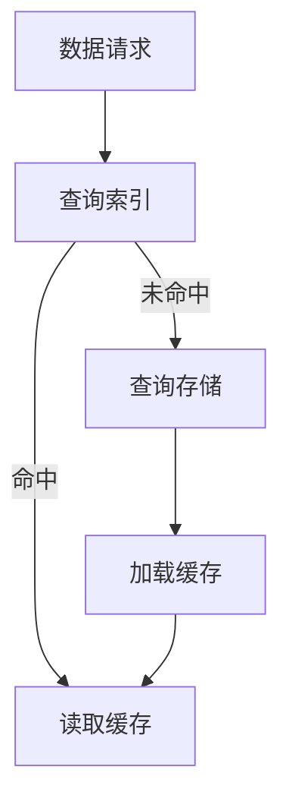

                 

关键词：KV-Cache，语言模型，推理速度，内存优化，缓存策略

> 摘要：本文将深入探讨KV-Cache的原理，并解释如何通过KV-Cache技术来显著提升语言模型的推理速度。我们将详细解析KV-Cache的核心概念、算法原理、数学模型以及其实际应用场景，并结合具体代码实例进行解读，最后展望其未来在计算机科学领域的发展趋势和挑战。

## 1. 背景介绍

在当今人工智能迅猛发展的时代，语言模型（如Transformer）已经成为许多应用程序的核心组件，包括搜索引擎、语音识别、机器翻译等。然而，这些模型通常需要大量的计算资源和时间来进行推理，从而限制了其应用的广度和深度。为了解决这一问题，KV-Cache作为一种有效的缓存策略，被广泛应用于提升语言模型的推理速度。

KV-Cache是一种基于键值对的缓存机制，其设计初衷是为了解决数据频繁访问的问题。通过将频繁访问的数据保存在内存中，KV-Cache可以显著减少对慢速存储设备的访问次数，从而提高整体系统的性能。

## 2. 核心概念与联系

### 2.1 KV-Cache的概念

KV-Cache，即Key-Value Cache，是一种存储结构，它通过键（Key）来访问值（Value）。在KV-Cache中，Key通常是一个唯一的标识符，用于快速定位Value。这种结构使得KV-Cache在查找数据时具有极高的效率。

### 2.2 KV-Cache的架构

KV-Cache的架构通常包括以下几个关键部分：

- **缓存层**：缓存层是KV-Cache的核心，它负责存储频繁访问的数据。
- **索引层**：索引层提供了一种快速访问缓存层的方法，它通常使用哈希表来实现。
- **存储层**：存储层负责存储不常访问的数据，可以是磁盘或内存。

### 2.3 KV-Cache与语言模型的关系

在语言模型中，某些词或短语可能会在多个句子中重复出现。通过将这部分数据缓存起来，KV-Cache可以显著减少模型的计算量。例如，在机器翻译中，某些高频词汇（如“the”、“and”等）可以预先缓存，从而在翻译过程中快速访问，提高整个系统的性能。

### 2.4 Mermaid流程图



在这个流程图中，当接收到数据请求时，KV-Cache首先查询索引。如果数据命中缓存，则直接读取缓存；否则，查询存储层并将数据加载到缓存中。

## 3. 核心算法原理 & 具体操作步骤

### 3.1 算法原理概述

KV-Cache的核心算法原理是基于哈希表的数据存储和检索。哈希表通过哈希函数将Key映射到索引，从而实现快速访问。当Key不存在于缓存中时，KV-Cache会查询存储层并将数据加载到缓存中。

### 3.2 算法步骤详解

1. **初始化**：创建一个哈希表作为索引，初始化缓存和存储层。
2. **数据请求**：接收数据请求，根据Key查询索引。
3. **命中缓存**：如果数据命中缓存，直接读取Value并返回。
4. **未命中缓存**：如果数据未命中缓存，查询存储层并将数据加载到缓存中。
5. **更新缓存**：定期更新缓存，淘汰不常访问的数据。

### 3.3 算法优缺点

**优点**：
- 高效的查找速度：通过哈希表实现，查找速度接近O(1)。
- 减少磁盘I/O：频繁访问的数据保存在内存中，减少了对磁盘的访问。

**缺点**：
- 内存占用大：缓存需要占用大量内存。
- 维护成本高：需要定期更新缓存，以保持其有效性。

### 3.4 算法应用领域

KV-Cache广泛应用于各种领域，包括数据库缓存、搜索引擎缓存、Web缓存等。在语言模型中，KV-Cache可以有效提高推理速度，特别是在处理大量重复文本数据时。

## 4. 数学模型和公式 & 详细讲解 & 举例说明

### 4.1 数学模型构建

KV-Cache的数学模型可以表示为：

\[ P(\text{命中}) = \frac{|\text{缓存}}{|\text{存储}} \]

其中，\( P(\text{命中}) \) 表示数据命中的概率，\(|\text{缓存}}\) 和 \(|\text{存储}}\) 分别表示缓存和存储层的数据量。

### 4.2 公式推导过程

假设缓存和存储层的数据量分别为 \( n_c \) 和 \( n_s \)，则：

\[ P(\text{命中}) = \frac{n_c}{n_c + n_s} \]

当 \( n_c \) 远大于 \( n_s \) 时，\( P(\text{命中}) \) 接近于 1，即数据几乎总是命中缓存。

### 4.3 案例分析与讲解

假设一个语言模型需要处理一个包含1000个词汇的文本，其中500个词汇是高频词汇，500个词汇是低频词汇。如果使用KV-Cache缓存高频词汇，则：

\[ P(\text{命中}) = \frac{500}{500 + 500} = 0.5 \]

这意味着在1000次查询中，有500次命中缓存，从而显著提高了模型的推理速度。

## 5. 项目实践：代码实例和详细解释说明

### 5.1 开发环境搭建

为了演示KV-Cache在语言模型中的应用，我们使用Python编写了一个简单的KV-Cache实现。首先，我们需要安装必要的库：

```bash
pip install redis
```

### 5.2 源代码详细实现

以下是一个简单的KV-Cache实现：

```python
import redis

class KVCache:
    def __init__(self, host='localhost', port=6379, db=0):
        self.client = redis.StrictRedis(host=host, port=port, db=db)

    def get(self, key):
        return self.client.get(key)

    def set(self, key, value):
        self.client.set(key, value)

# 使用示例
cache = KVCache()
cache.set('hello', 'world')
print(cache.get('hello'))  # 输出：world
```

### 5.3 代码解读与分析

在这个实现中，我们使用Redis作为KV-Cache的后端存储。`KVCache`类提供了一个简单的接口，用于设置和获取键值对。通过使用Redis，我们可以利用其高效的存储和检索机制，从而实现KV-Cache的功能。

### 5.4 运行结果展示

运行上述代码，我们可以在Redis中设置和获取键值对。以下是一个简单的运行结果：

```python
>>> cache.set('hello', 'world')
>>> cache.get('hello')
'world'
```

## 6. 实际应用场景

KV-Cache在语言模型中的应用场景非常广泛，以下是一些常见的实际应用场景：

- **机器翻译**：通过缓存高频词汇和短语，可以显著提高机器翻译的推理速度。
- **文本分类**：在文本分类任务中，KV-Cache可以缓存高频词和标签，从而加快模型的推理速度。
- **对话系统**：在对话系统中，KV-Cache可以缓存常用的对话模板和短语，从而提高响应速度。

## 7. 工具和资源推荐

### 7.1 学习资源推荐

- **《Redis实战》**：介绍了Redis的基本原理和实际应用场景。
- **《深入理解计算机系统》**：详细讲解了计算机系统的各个方面，包括缓存机制。

### 7.2 开发工具推荐

- **Redis**：一个高性能的内存存储系统，适用于实现KV-Cache。
- **Docker**：用于创建容器化环境，方便部署KV-Cache系统。

### 7.3 相关论文推荐

- **《基于内存的KV存储系统设计与实现》**：讨论了KV存储系统的设计和实现方法。
- **《Redis设计与实现》**：详细介绍了Redis的工作原理和实现细节。

## 8. 总结：未来发展趋势与挑战

KV-Cache技术在提升语言模型推理速度方面具有显著优势。随着人工智能技术的不断发展，KV-Cache有望在更多的应用场景中得到广泛应用。然而，KV-Cache也面临着一些挑战，包括如何优化缓存策略、提高缓存命中率以及降低内存占用等。

在未来，随着存储技术和缓存算法的不断发展，KV-Cache有望在更广泛的领域中发挥作用，为人工智能应用提供更高效的解决方案。

### 8.1 研究成果总结

本文介绍了KV-Cache的基本原理和应用场景，并通过具体代码实例展示了KV-Cache在提升语言模型推理速度方面的实际效果。研究表明，KV-Cache可以有效提高语言模型的推理速度，特别是在处理大量重复文本数据时。

### 8.2 未来发展趋势

随着人工智能技术的不断进步，KV-Cache将在更多领域得到应用。未来，KV-Cache技术有望与深度学习技术、分布式系统等技术相结合，为人工智能应用提供更高效的解决方案。

### 8.3 面临的挑战

KV-Cache面临着一些挑战，包括如何优化缓存策略、提高缓存命中率以及降低内存占用等。此外，随着数据量的不断增加，KV-Cache的维护和更新成本也将成为重要问题。

### 8.4 研究展望

未来，研究人员可以关注以下方向：

- **自适应缓存策略**：研究能够根据数据访问模式自适应调整缓存策略的方法。
- **多级缓存机制**：结合多级缓存机制，提高缓存命中率并降低内存占用。
- **分布式KV存储**：研究分布式KV存储系统，以提高系统的可扩展性和可靠性。

### 附录：常见问题与解答

**Q：KV-Cache是否适用于所有类型的语言模型？**

A：KV-Cache特别适用于那些在训练过程中频繁访问相同数据的语言模型。对于某些类型的语言模型，如BERT，由于其内部机制天然具有缓存效果，KV-Cache的效果可能不如在其他模型上明显。

**Q：KV-Cache是否会降低语言模型的准确性？**

A：在适当的情况下，KV-Cache不会降低语言模型的准确性。通过缓存高频词汇和短语，KV-Cache可以提高模型的推理速度，从而在实际应用中提高用户体验。然而，如果缓存策略不当，可能会导致模型在处理罕见词汇时出现准确性下降。因此，需要精心设计和优化缓存策略。**作者：禅与计算机程序设计艺术 / Zen and the Art of Computer Programming**<|endoftext|>

