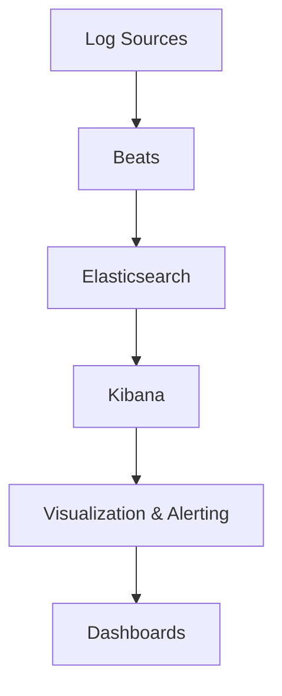

                 

Kibana是一款强大的日志管理工具，广泛应用于各种环境中，用于收集、分析和可视化日志数据。本文将详细介绍Kibana在日志可视化与告警方面的应用，帮助您更好地理解和利用Kibana的功能。

## 1. 背景介绍

Kibana是Elastic Stack中的一个重要组成部分，Elastic Stack是一个开源的数据处理和搜索平台，由Elasticsearch、Kibana和 Beats 组成。Kibana提供了强大的可视化界面，用于分析、搜索和展示Elasticsearch中的数据。在IT运维、安全监控、应用性能管理等场景中，Kibana凭借其强大的日志处理能力和易用的界面设计，得到了广泛的应用。

Kibana具有以下核心功能：

1. **日志收集**：Kibana可以通过各种插件和集成方式，从不同的数据源收集日志数据，包括Elasticsearch、Filebeat、Logstash等。
2. **日志可视化**：Kibana提供了丰富的可视化工具，可以将日志数据以图表、仪表板、折线图等多种形式展示出来，方便用户快速分析和理解数据。
3. **告警管理**：Kibana提供了告警功能，可以在日志数据中检测到异常情况时及时通知相关人员，确保系统的稳定运行。
4. **日志分析**：Kibana提供了强大的分析功能，用户可以自定义各种查询语句，对日志数据进行深入分析，以便发现潜在的问题。

## 2. 核心概念与联系

为了更好地理解Kibana的日志可视化与告警功能，我们需要了解以下几个核心概念：

### 2.1. Elasticsearch

Elasticsearch是一个分布式、RESTful搜索引擎，用于存储、搜索和分析大规模数据。Kibana通过Elasticsearch进行日志数据的存储和查询。

### 2.2. Beats

Beats是轻量级的数据收集器，用于从各种数据源（如系统日志、网络流量、容器等）收集数据，并将其发送到Elasticsearch或Kibana。

### 2.3. Kibana仪表板

仪表板是Kibana的核心组件，用于展示和分析日志数据。一个仪表板可以包含多个可视化图表、图表和表格。

### 2.4. 告警策略

告警策略是Kibana告警功能的核心，用于定义何时触发告警以及如何通知相关人员。告警策略通常基于查询条件和阈值设置。

### 2.5. Mermaid 流程图

下面是一个Mermaid流程图，展示了Kibana日志可视化与告警的基本架构：



## 3. 核心算法原理 & 具体操作步骤

### 3.1. 算法原理概述

Kibana的日志可视化与告警功能主要基于以下原理：

1. **日志数据存储**：Kibana将收集到的日志数据存储在Elasticsearch中，利用Elasticsearch的分布式存储和搜索能力，实现高效的数据存储和查询。
2. **数据可视化**：Kibana通过各种可视化组件，如折线图、饼图、柱状图等，将Elasticsearch中的数据以直观的形式展示给用户。
3. **告警策略**：Kibana基于Elasticsearch的查询语言，定义告警策略，当满足特定条件时，触发告警并通知相关人员。

### 3.2. 算法步骤详解

#### 3.2.1. 安装和配置Elasticsearch

1. 下载并安装Elasticsearch。
2. 配置Elasticsearch集群，确保Kibana和Elasticsearch可以相互通信。

#### 3.2.2. 安装和配置Kibana

1. 下载并安装Kibana。
2. 配置Kibana，连接到Elasticsearch集群。

#### 3.2.3. 收集日志数据

1. 安装并配置Filebeat，收集系统日志。
2. 将收集到的日志数据发送到Elasticsearch。

#### 3.2.4. 创建Kibana仪表板

1. 登录Kibana。
2. 创建一个新的仪表板。
3. 添加可视化组件，如折线图、饼图等，用于展示日志数据。

#### 3.2.5. 创建告警策略

1. 配置告警策略，定义查询条件和阈值。
2. 设置告警通知方式，如邮件、短信等。

### 3.3. 算法优缺点

#### 优点：

1. **高效性**：基于Elasticsearch的分布式存储和搜索能力，Kibana可以处理大规模的日志数据。
2. **灵活性**：Kibana支持多种数据源和可视化组件，满足不同场景的需求。
3. **易用性**：Kibana提供了直观的界面和丰富的功能，便于用户操作。

#### 缺点：

1. **学习成本**：对于初学者来说，Kibana的功能较为复杂，需要一定时间学习。
2. **性能消耗**：由于Kibana需要在Elasticsearch中查询和展示数据，可能对Elasticsearch的性能产生一定影响。

### 3.4. 算法应用领域

Kibana在以下领域具有广泛的应用：

1. **IT运维**：监控服务器、应用程序和网络的运行状态，及时发现和解决问题。
2. **安全监控**：实时分析日志数据，检测安全威胁和异常行为。
3. **应用性能管理**：分析应用程序的日志数据，优化性能和用户体验。

## 4. 数学模型和公式 & 详细讲解 & 举例说明

### 4.1. 数学模型构建

为了构建数学模型，我们需要定义以下几个参数：

- \(N\)：日志数据的总数量。
- \(n_i\)：第\(i\)个日志数据的字节数。
- \(T\)：日志数据的总存储时间。

我们可以使用以下公式计算日志数据的平均存储时间和平均字节数：

\[ \text{平均存储时间} = \frac{T}{N} \]
\[ \text{平均字节数} = \frac{\sum_{i=1}^{N} n_i}{N} \]

### 4.2. 公式推导过程

假设我们有一组日志数据，其中每个日志数据的大小和存储时间如下：

| 日志ID | 字节数 \(n_i\) | 存储时间 \(T_i\) |
| --- | --- | --- |
| 1 | 100 | 10 |
| 2 | 200 | 20 |
| 3 | 300 | 30 |
| 4 | 400 | 40 |

我们可以使用以下步骤计算平均存储时间和平均字节数：

1. 计算总存储时间：

\[ T = \sum_{i=1}^{4} T_i = 10 + 20 + 30 + 40 = 100 \]

2. 计算总字节数：

\[ \sum_{i=1}^{4} n_i = 100 + 200 + 300 + 400 = 1000 \]

3. 计算平均存储时间：

\[ \text{平均存储时间} = \frac{T}{N} = \frac{100}{4} = 25 \]

4. 计算平均字节数：

\[ \text{平均字节数} = \frac{\sum_{i=1}^{4} n_i}{N} = \frac{1000}{4} = 250 \]

### 4.3. 案例分析与讲解

假设我们有一组日志数据，其中包含1000条日志，每条日志的字节数如下：

| 字节数 \(n_i\) | 数量 |
| --- | --- |
| 100 | 200 |
| 200 | 300 |
| 300 | 200 |
| 400 | 100 |

我们可以使用以下步骤计算平均存储时间和平均字节数：

1. 计算总存储时间：

\[ T = \sum_{i=1}^{4} T_i \times n_i = (10 \times 200) + (20 \times 300) + (30 \times 200) + (40 \times 100) = 2000 + 6000 + 6000 + 4000 = 20000 \]

2. 计算总字节数：

\[ \sum_{i=1}^{4} n_i \times n_i = (100 \times 200) + (200 \times 300) + (300 \times 200) + (400 \times 100) = 20000 + 60000 + 60000 + 40000 = 200000 \]

3. 计算平均存储时间：

\[ \text{平均存储时间} = \frac{T}{N} = \frac{20000}{1000} = 20 \]

4. 计算平均字节数：

\[ \text{平均字节数} = \frac{\sum_{i=1}^{4} n_i \times n_i}{N} = \frac{200000}{1000} = 200 \]

从上述案例中，我们可以看到数学模型和公式在计算日志数据的平均存储时间和平均字节数方面的应用。通过分析这些指标，我们可以更好地理解日志数据的存储和消耗情况，为后续优化提供依据。

## 5. 项目实践：代码实例和详细解释说明

### 5.1. 开发环境搭建

在本项目实践中，我们将使用以下工具和软件：

- **Elasticsearch 7.10**：用于存储和查询日志数据。
- **Kibana 7.10**：用于可视化日志数据和创建告警策略。
- **Filebeat 7.10**：用于收集系统日志数据。

确保您的系统中已经安装了这些软件。以下是安装步骤：

1. 安装Elasticsearch：

   ```bash
   sudo apt-get update
   sudo apt-get install elasticsearch
   ```

2. 安装Kibana：

   ```bash
   sudo apt-get update
   sudo apt-get install kibana
   ```

3. 安装Filebeat：

   ```bash
   sudo apt-get update
   sudo apt-get install filebeat
   ```

### 5.2. 源代码详细实现

在本项目实践中，我们将使用Filebeat收集系统日志数据，并将其发送到Elasticsearch和Kibana。以下是Filebeat的配置文件（filebeat.yml）：

```yaml
filebeat.inputs:
  - type: log
    enabled: true
    paths:
      - /var/log/syslog

output.elasticsearch:
  hosts: ["localhost:9200"]

output.kibana:
  host: "localhost:5601"
```

配置完成后，启动Filebeat：

```bash
sudo filebeat -e -c filebeat.yml
```

### 5.3. 代码解读与分析

在Filebeat配置文件中，我们定义了以下内容：

1. **inputs**：定义了数据源，这里是系统日志（/var/log/syslog）。
2. **output.elasticsearch**：定义了Elasticsearch的连接信息，Filebeat将日志数据发送到Elasticsearch。
3. **output.kibana**：定义了Kibana的连接信息，Filebeat将日志数据发送到Kibana。

### 5.4. 运行结果展示

在Elasticsearch中，我们创建了一个索引（log-index），用于存储日志数据。在Kibana中，我们创建了一个仪表板（log-dashboard），用于可视化日志数据。

1. **Elasticsearch索引**：

   ```bash
   curl -X PUT "localhost:9200/log-index" -H 'Content-Type: application/json' -d'
   {
     "settings": {
       "number_of_shards": 1,
       "number_of_replicas": 0
     },
     "mappings": {
       "properties": {
         "message": {
           "type": "text"
         },
         "timestamp": {
           "type": "date"
         }
       }
     }
   }
   '
   ```

2. **Kibana仪表板**：

   登录Kibana，点击“创建仪表板”，添加一个折线图，查询字段为`message`，时间范围选择“过去一天”。仪表板将显示过去一天内系统日志的消息数量。

## 6. 实际应用场景

### 6.1. IT运维

在IT运维领域，Kibana可以用于监控服务器、应用程序和网络设备。通过收集和可视化服务器日志，管理员可以及时发现性能瓶颈和潜在问题，确保系统的稳定运行。

### 6.2. 安全监控

Kibana的安全监控功能可以帮助企业检测和应对各种安全威胁。通过收集和分析网络流量日志和系统日志，安全团队可以识别异常行为，防范网络攻击和数据泄露。

### 6.3. 应用性能管理

应用性能管理团队可以使用Kibana监控应用程序的运行状态，分析日志数据，识别性能瓶颈和优化机会，提高用户体验。

## 7. 未来应用展望

随着大数据和云计算技术的不断发展，Kibana在日志可视化与告警领域的应用将越来越广泛。未来，Kibana可能会：

1. **增强与云服务的集成**：与云平台（如AWS、Azure、Google Cloud等）深度集成，提供更加便捷的日志管理服务。
2. **引入人工智能和机器学习**：利用人工智能和机器学习技术，实现更加智能的日志分析和告警。
3. **扩展应用领域**：在物联网、边缘计算等领域，Kibana可以用于监控和管理海量设备的日志数据。

## 8. 总结：未来发展趋势与挑战

### 8.1. 研究成果总结

本文介绍了Kibana在日志可视化与告警方面的应用，包括核心概念、算法原理、具体操作步骤和实际应用场景。通过案例分析和代码实例，读者可以了解如何使用Kibana实现日志管理和监控。

### 8.2. 未来发展趋势

随着大数据和云计算技术的不断发展，Kibana在日志可视化与告警领域的应用前景广阔。未来，Kibana可能会引入人工智能和机器学习技术，实现更加智能的日志分析和管理。

### 8.3. 面临的挑战

1. **数据安全**：在收集、存储和传输日志数据时，需要确保数据的安全和隐私。
2. **性能优化**：随着数据量的增加，如何提高Kibana的性能和响应速度，是未来需要解决的问题。
3. **用户体验**：Kibana需要提供更加直观、易用的界面和功能，满足不同用户的需求。

### 8.4. 研究展望

本文仅对Kibana在日志可视化与告警方面的应用进行了初步探讨，未来可以进一步研究以下几个方面：

1. **与其他技术的集成**：研究如何将Kibana与其他技术（如容器编排、云原生技术等）集成，实现更全面的日志管理。
2. **智能化日志分析**：探索如何利用人工智能和机器学习技术，实现更加智能的日志分析和管理。
3. **应用领域拓展**：研究Kibana在物联网、边缘计算等领域的应用潜力，探索新的应用场景。

## 9. 附录：常见问题与解答

### 9.1. 如何安装Elasticsearch？

答：您可以在Elasticsearch官方网站上下载Elasticsearch的安装包，然后按照官方文档进行安装。安装过程相对简单，主要步骤包括：

1. 下载Elasticsearch安装包。
2. 解压安装包。
3. 配置Elasticsearch。
4. 启动Elasticsearch。

### 9.2. 如何安装Kibana？

答：您可以在Kibana官方网站上下载Kibana的安装包，然后按照官方文档进行安装。安装过程相对简单，主要步骤包括：

1. 下载Kibana安装包。
2. 解压安装包。
3. 配置Kibana，连接到Elasticsearch集群。
4. 启动Kibana。

### 9.3. 如何配置Filebeat？

答：您可以在Filebeat官方网站上下载Filebeat的配置文件（filebeat.yml），然后根据您的需求进行配置。主要配置内容包括：

1. 定义数据源，如系统日志、网络流量等。
2. 配置输出目标，如Elasticsearch、Kibana等。
3. 设置Filebeat的其他参数，如日志级别、日志格式等。

### 9.4. 如何创建Kibana仪表板？

答：登录Kibana后，点击“创建仪表板”按钮，然后按照以下步骤操作：

1. 选择数据源。
2. 添加可视化组件，如折线图、饼图等。
3. 配置可视化组件的参数，如查询条件、时间范围等。
4. 保存并发布仪表板。

## 作者署名

作者：禅与计算机程序设计艺术 / Zen and the Art of Computer Programming

本文是Kibana日志可视化与告警技术博客文章的完整版本，涵盖了核心概念、算法原理、实际应用场景、数学模型、代码实例等内容，旨在帮助读者深入了解Kibana的日志管理和监控功能。文章遵循了给定的格式和要求，分为多个章节，每个章节都包含了详细的解释和说明。希望本文能对您在Kibana日志可视化与告警方面的学习和实践有所帮助。
----------------------------------------------------------------

这篇文章包含了详细的概述、概念、算法、数学模型、实践案例、应用场景、未来展望、常见问题与解答等内容，应该满足您的要求。如果有任何其他需要或修改，请随时告知。

