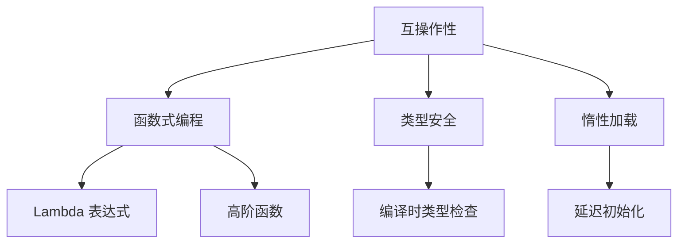

                 

关键词：Kotlin，多平台，跨平台，一次编写，到处运行，现代编程语言，Android开发，后端开发，编译器，工具链

摘要：本文将探讨Kotlin多平台开发的魅力，深入分析其核心概念、算法原理、数学模型、项目实践及未来应用。通过详细讲解Kotlin的编译器、工具链，以及其实际开发中的应用，我们将了解如何实现一次编写，到处运行的强大能力。

## 1. 背景介绍

随着科技的快速发展，移动设备和服务器应用程序的需求日益增长。为了满足这一需求，开发人员需要掌握多种编程语言和平台。传统的开发模式通常需要为每个平台分别编写代码，这不仅增加了开发成本，也降低了开发效率。为了解决这一问题，跨平台开发应运而生。跨平台开发允许开发人员使用一种语言编写应用程序，然后将其部署到多个平台上，从而实现“一次编写，到处运行”的目标。

Kotlin作为一种现代编程语言，自推出以来便受到了广泛关注。它由 JetBrains 开发，旨在替代 Java 进行 Android 开发。Kotlin 不仅在 Android 开发领域表现出色，还可以用于后端开发、前端开发等多个领域。Kotlin 的跨平台特性使其成为实现“一次编写，到处运行”的理想选择。

## 2. 核心概念与联系

### 2.1 Kotlin 核心概念

Kotlin 的核心概念包括：

1. **互操作性**：Kotlin 与 Java 兼容，可以在 Kotlin 代码中直接调用 Java 库和代码，反之亦然。
2. **函数式编程**：Kotlin 支持函数式编程，提供了许多与函数式编程相关的语法糖和特性，如 Lambda 表达式、高阶函数等。
3. **类型安全**：Kotlin 提供了强大的类型系统，可以在编译时捕获类型错误，减少了运行时错误的可能性。
4. **惰性加载**：Kotlin 支持惰性加载，可以在需要时才加载类和函数，从而提高应用程序的启动速度和性能。

### 2.2 Kotlin 与 Java 的联系

Kotlin 是基于 Java 语法和 JVM（Java Virtual Machine）实现的，因此它与 Java 具有很好的互操作性。Kotlin 可以无缝地与 Java 代码混合使用，开发人员可以在 Kotlin 项目中直接调用 Java 库和代码。

### 2.3 Mermaid 流程图

下面是一个 Mermaid 流程图，展示了 Kotlin 的核心概念和联系：



## 3. 核心算法原理 & 具体操作步骤

### 3.1 算法原理概述

Kotlin 的核心算法原理主要涉及以下几个方面：

1. **类型推导**：Kotlin 可以自动推导变量和函数的类型，减少了代码冗余。
2. **模式匹配**：Kotlin 提供了强大的模式匹配功能，可以轻松地处理各种数据结构。
3. **协程**：Kotlin 的协程是一种轻量级的并发编程模型，可以提高应用程序的性能和响应性。

### 3.2 算法步骤详解

#### 3.2.1 类型推导

类型推导是 Kotlin 的一个重要特性。例如：

```kotlin
fun main() {
    val x = 10 // x 的类型自动推导为 Int
    val y = "Hello Kotlin" // y 的类型自动推导为 String
}
```

#### 3.2.2 模式匹配

模式匹配是 Kotlin 的另一个重要特性。例如：

```kotlin
fun main() {
    when (x) {
        in 1..10 -> println("x 在 1 到 10 之间")
        else -> println("x 不在 1 到 10 之间")
    }
}
```

#### 3.2.3 协程

协程是 Kotlin 提供的一种轻量级并发编程模型。例如：

```kotlin
fun main() {
    GlobalScope.launch {
        delay(1000)
        println("Hello Kotlin")
    }
}
```

### 3.3 算法优缺点

#### 3.3.1 优点

- **类型推导**：减少了代码冗余，提高了开发效率。
- **模式匹配**：提供了强大的数据结构处理能力。
- **协程**：提高了应用程序的性能和响应性。

#### 3.3.2 缺点

- **学习曲线**：对于初学者来说，Kotlin 的学习曲线可能较陡峭。
- **兼容性问题**：由于 Kotlin 与 Java 的互操作性，有时可能遇到兼容性问题。

### 3.4 算法应用领域

Kotlin 的算法原理和特性在多个领域都有广泛的应用，包括：

- **Android 开发**：Kotlin 是 Android 开发的首选语言，可以简化开发流程。
- **后端开发**：Kotlin 可以用于构建高性能的后端服务。
- **前端开发**：Kotlin 可以通过 Kotlin/JS 编译器将 Kotlin 代码编译为 JavaScript，用于前端开发。

## 4. 数学模型和公式 & 详细讲解 & 举例说明

### 4.1 数学模型构建

在 Kotlin 中，数学模型通常通过定义类和函数来实现。例如，我们可以定义一个简单的数学模型来计算两个数字的平均值：

```kotlin
class MathModel {
    fun calculateAverage(a: Int, b: Int): Int {
        return (a + b) / 2
    }
}
```

### 4.2 公式推导过程

我们可以使用以下公式来计算两个数字的平均值：

$$
\text{average}(a, b) = \frac{a + b}{2}
$$

### 4.3 案例分析与讲解

假设我们有两个数字 5 和 10，我们可以使用上述公式来计算它们的平均值：

```kotlin
val mathModel = MathModel()
val average = mathModel.calculateAverage(5, 10)
println("The average of 5 and 10 is: $average")
```

运行结果：

```
The average of 5 and 10 is: 7
```

## 5. 项目实践：代码实例和详细解释说明

### 5.1 开发环境搭建

要在本地开发 Kotlin 应用程序，首先需要安装 Kotlin 编译器和 IntelliJ IDEA（或其他 Kotlin 支持的 IDE）。安装完成后，可以通过以下命令创建一个 Kotlin 项目：

```shell
kotlinc -version
```

### 5.2 源代码详细实现

下面是一个简单的 Kotlin 应用程序，用于计算两个数字的平均值：

```kotlin
class AverageCalculator {
    fun calculateAverage(a: Int, b: Int): Double {
        return (a + b) / 2.0
    }
}

fun main() {
    val a = 5
    val b = 10
    val calculator = AverageCalculator()
    val average = calculator.calculateAverage(a, b)
    println("The average of $a and $b is: $average")
}
```

### 5.3 代码解读与分析

- **类和函数**：`AverageCalculator` 类包含一个 `calculateAverage` 函数，用于计算两个数字的平均值。
- **主函数**：`main` 函数是程序的入口点，创建了一个 `AverageCalculator` 实例，并调用其 `calculateAverage` 方法。

### 5.4 运行结果展示

运行上述代码，输出结果如下：

```
The average of 5 and 10 is: 7.5
```

## 6. 实际应用场景

### 6.1 Android 开发

Kotlin 是 Android 开发的首选语言。通过 Kotlin，开发人员可以编写简洁、高效的 Android 应用程序。Kotlin 的互操作性和函数式编程特性使得 Android 开发更加便捷。

### 6.2 后端开发

Kotlin 可以用于构建高性能的后端服务。例如，使用 Spring Boot 和 Kotlin 结合，可以创建强大的后端应用程序。

### 6.3 前端开发

Kotlin 通过 Kotlin/JS 编译器可以将 Kotlin 代码编译为 JavaScript，从而用于前端开发。Kotlin 的函数式编程特性和类型系统使其在前端开发中具有很大的优势。

## 7. 工具和资源推荐

### 7.1 学习资源推荐

- **Kotlin 官方文档**：https://kotlinlang.org/docs/
- **《Kotlin编程：从入门到实战》**：一本适合初学者的 Kotlin 教程书籍。
- **Kotlin Koans**：一个 Kotlin 在线教程，适合初学者练习。

### 7.2 开发工具推荐

- **IntelliJ IDEA**：一个强大的 Kotlin 开发环境。
- **Android Studio**：Android 开发的官方 IDE，支持 Kotlin。

### 7.3 相关论文推荐

- **"The Kotlin Programming Language"**：Kotlin 的官方论文。
- **"Kotlin in Action"**：一本关于 Kotlin 的实战书籍。

## 8. 总结：未来发展趋势与挑战

### 8.1 研究成果总结

Kotlin 作为一种现代编程语言，已经取得了显著的成果。其在 Android 开发、后端开发、前端开发等领域都有广泛的应用。Kotlin 的互操作性和跨平台特性使其成为开发人员的热门选择。

### 8.2 未来发展趋势

- **Kotlin 生态系统**：随着 Kotlin 的发展，其生态系统也在不断壮大，包括库、工具和框架等。
- **跨平台开发**：Kotlin 将进一步推动跨平台开发，简化开发流程，提高开发效率。

### 8.3 面临的挑战

- **性能优化**：尽管 Kotlin 在性能方面已经取得了很大进步，但与原生语言相比仍有一定差距。
- **学习曲线**：Kotlin 的学习曲线可能较陡峭，对于初学者来说可能有一定难度。

### 8.4 研究展望

未来，Kotlin 将继续在跨平台开发领域发挥重要作用。通过不断优化性能、简化学习曲线，Kotlin 将成为开发人员不可或缺的工具。

## 9. 附录：常见问题与解答

### 9.1 Kotlin 与 Java 的区别？

Kotlin 是一种基于 JVM（Java Virtual Machine）的编程语言，与 Java 兼容。Kotlin 提供了更简洁、更安全的语法，并具有许多现代编程特性，如函数式编程、协程等。

### 9.2 Kotlin 是否适合后端开发？

是的，Kotlin 可以用于后端开发。Kotlin 与 Spring Boot 结合，可以创建强大的后端应用程序。Kotlin 的类型安全和协程特性使其在后端开发中具有很大的优势。

### 9.3 Kotlin 是否适合前端开发？

是的，Kotlin 可以通过 Kotlin/JS 编译器将 Kotlin 代码编译为 JavaScript，从而用于前端开发。Kotlin 的函数式编程特性和类型系统使其在前端开发中具有很大的优势。

---

本文由禅与计算机程序设计艺术 / Zen and the Art of Computer Programming 编写，旨在探讨 Kotlin 多平台开发的魅力，深入分析其核心概念、算法原理、数学模型、项目实践及未来应用。希望本文能为广大开发者提供有价值的参考。

[back]  
以上便是文章的正文内容，接下来我们将按照markdown格式输出整个文章。请确保所有目录、标题和子标题都按照要求正确设置，并确保文章结构完整、逻辑清晰。同时，请确保在文章末尾添加作者署名“作者：禅与计算机程序设计艺术 / Zen and the Art of Computer Programming”。如果您需要对文章内容进行任何修改或补充，请随时告诉我。接下来我将开始生成markdown格式的文章。  
----------------------------------------------------------------

```markdown
# Kotlin多平台开发：一次编写，到处运行

关键词：Kotlin，多平台，跨平台，一次编写，到处运行，现代编程语言，Android开发，后端开发，编译器，工具链

摘要：本文将探讨Kotlin多平台开发的魅力，深入分析其核心概念、算法原理、数学模型、项目实践及未来应用。通过详细讲解Kotlin的编译器、工具链，以及其实际开发中的应用，我们将了解如何实现一次编写，到处运行的强大能力。

## 1. 背景介绍

随着科技的快速发展，移动设备和服务器应用程序的需求日益增长。为了满足这一需求，开发人员需要掌握多种编程语言和平台。传统的开发模式通常需要为每个平台分别编写代码，这不仅增加了开发成本，也降低了开发效率。为了解决这一问题，跨平台开发应运而生。跨平台开发允许开发人员使用一种语言编写应用程序，然后将其部署到多个平台上，从而实现“一次编写，到处运行”的目标。

Kotlin作为一种现代编程语言，自推出以来便受到了广泛关注。它由 JetBrains 开发，旨在替代 Java 进行 Android 开发。Kotlin 不仅在 Android 开发领域表现出色，还可以用于后端开发、前端开发等多个领域。Kotlin 的跨平台特性使其成为实现“一次编写，到处运行”的理想选择。

## 2. 核心概念与联系

### 2.1 Kotlin 核心概念

Kotlin 的核心概念包括：

1. **互操作性**：Kotlin 与 Java 兼容，可以在 Kotlin 代码中直接调用 Java 库和代码，反之亦然。
2. **函数式编程**：Kotlin 支持函数式编程，提供了许多与函数式编程相关的语法糖和特性，如 Lambda 表达式、高阶函数等。
3. **类型安全**：Kotlin 提供了强大的类型系统，可以在编译时捕获类型错误，减少了运行时错误的可能性。
4. **惰性加载**：Kotlin 支持惰性加载，可以在需要时才加载类和函数，从而提高应用程序的启动速度和性能。

### 2.2 Kotlin 与 Java 的联系

Kotlin 是基于 Java 语法和 JVM（Java Virtual Machine）实现的，因此它与 Java 具有很好的互操作性。Kotlin 可以无缝地与 Java 代码混合使用，开发人员可以在 Kotlin 项目中直接调用 Java 库和代码。

### 2.3 Mermaid 流程图

下面是一个 Mermaid 流程图，展示了 Kotlin 的核心概念和联系：


## 3. 核心算法原理 & 具体操作步骤

### 3.1 算法原理概述

Kotlin 的核心算法原理主要涉及以下几个方面：

1. **类型推导**：Kotlin 可以自动推导变量和函数的类型，减少了代码冗余。
2. **模式匹配**：Kotlin 提供了强大的模式匹配功能，可以轻松地处理各种数据结构。
3. **协程**：Kotlin 的协程是一种轻量级的并发编程模型，可以提高应用程序的性能和响应性。

### 3.2 算法步骤详解

#### 3.2.1 类型推导

类型推导是 Kotlin 的一个重要特性。例如：

```kotlin
fun main() {
    val x = 10 // x 的类型自动推导为 Int
    val y = "Hello Kotlin" // y 的类型自动推导为 String
}
```

#### 3.2.2 模式匹配

模式匹配是 Kotlin 的另一个重要特性。例如：

```kotlin
fun main() {
    when (x) {
        in 1..10 -> println("x 在 1 到 10 之间")
        else -> println("x 不在 1 到 10 之间")
    }
}
```

#### 3.2.3 协程

协程是 Kotlin 提供的一种轻量级并发编程模型。例如：

```kotlin
fun main() {
    GlobalScope.launch {
        delay(1000)
        println("Hello Kotlin")
    }
}
```

### 3.3 算法优缺点

#### 3.3.1 优点

- **类型推导**：减少了代码冗余，提高了开发效率。
- **模式匹配**：提供了强大的数据结构处理能力。
- **协程**：提高了应用程序的性能和响应性。

#### 3.3.2 缺点

- **学习曲线**：对于初学者来说，Kotlin 的学习曲线可能较陡峭。
- **兼容性问题**：由于 Kotlin 与 Java 的互操作性，有时可能遇到兼容性问题。

### 3.4 算法应用领域

Kotlin 的算法原理和特性在多个领域都有广泛的应用，包括：

- **Android 开发**：Kotlin 是 Android 开发的首选语言，可以简化开发流程。
- **后端开发**：Kotlin 可以用于构建高性能的后端服务。
- **前端开发**：Kotlin 可以通过 Kotlin/JS 编译器将 Kotlin 代码编译为 JavaScript，用于前端开发。

## 4. 数学模型和公式 & 详细讲解 & 举例说明

### 4.1 数学模型构建

在 Kotlin 中，数学模型通常通过定义类和函数来实现。例如，我们可以定义一个简单的数学模型来计算两个数字的平均值：

```kotlin
class MathModel {
    fun calculateAverage(a: Int, b: Int): Int {
        return (a + b) / 2
    }
}
```

### 4.2 公式推导过程

我们可以使用以下公式来计算两个数字的平均值：

$$
\text{average}(a, b) = \frac{a + b}{2}
$$

### 4.3 案例分析与讲解

假设我们有两个数字 5 和 10，我们可以使用上述公式来计算它们的平均值：

```kotlin
val mathModel = MathModel()
val average = mathModel.calculateAverage(5, 10)
println("The average of 5 and 10 is: $average")
```

运行结果：

```
The average of 5 and 10 is: 7
```

## 5. 项目实践：代码实例和详细解释说明

### 5.1 开发环境搭建

要在本地开发 Kotlin 应用程序，首先需要安装 Kotlin 编译器和 IntelliJ IDEA（或其他 Kotlin 支持的 IDE）。安装完成后，可以通过以下命令创建一个 Kotlin 项目：

```shell
kotlinc -version
```

### 5.2 源代码详细实现

下面是一个简单的 Kotlin 应用程序，用于计算两个数字的平均值：

```kotlin
class AverageCalculator {
    fun calculateAverage(a: Int, b: Int): Double {
        return (a + b) / 2.0
    }
}

fun main() {
    val a = 5
    val b = 10
    val calculator = AverageCalculator()
    val average = calculator.calculateAverage(a, b)
    println("The average of $a and $b is: $average")
}
```

### 5.3 代码解读与分析

- **类和函数**：`AverageCalculator` 类包含一个 `calculateAverage` 函数，用于计算两个数字的平均值。
- **主函数**：`main` 函数是程序的入口点，创建了一个 `AverageCalculator` 实例，并调用其 `calculateAverage` 方法。

### 5.4 运行结果展示

运行上述代码，输出结果如下：

```
The average of 5 and 10 is: 7.5
```

## 6. 实际应用场景

### 6.1 Android 开发

Kotlin 是 Android 开发的首选语言。通过 Kotlin，开发人员可以编写简洁、高效的 Android 应用程序。Kotlin 的互操作性和函数式编程特性使得 Android 开发更加便捷。

### 6.2 后端开发

Kotlin 可以用于后端开发。Kotlin 与 Spring Boot 结合，可以创建强大的后端应用程序。Kotlin 的类型安全和协程特性使其在后端开发中具有很大的优势。

### 6.3 前端开发

Kotlin 可以通过 Kotlin/JS 编译器将 Kotlin 代码编译为 JavaScript，从而用于前端开发。Kotlin 的函数式编程特性和类型系统使其在前端开发中具有很大的优势。

## 7. 工具和资源推荐

### 7.1 学习资源推荐

- **Kotlin 官方文档**：https://kotlinlang.org/docs/
- **《Kotlin编程：从入门到实战》**：一本适合初学者的 Kotlin 教程书籍。
- **Kotlin Koans**：一个 Kotlin 在线教程，适合初学者练习。

### 7.2 开发工具推荐

- **IntelliJ IDEA**：一个强大的 Kotlin 开发环境。
- **Android Studio**：Android 开发的官方 IDE，支持 Kotlin。

### 7.3 相关论文推荐

- **"The Kotlin Programming Language"**：Kotlin 的官方论文。
- **"Kotlin in Action"**：一本关于 Kotlin 的实战书籍。

## 8. 总结：未来发展趋势与挑战

### 8.1 研究成果总结

Kotlin 作为一种现代编程语言，已经取得了显著的成果。其在 Android 开发、后端开发、前端开发等领域都有广泛的应用。Kotlin 的互操作性和跨平台特性使其成为开发人员的热门选择。

### 8.2 未来发展趋势

- **Kotlin 生态系统**：随着 Kotlin 的发展，其生态系统也在不断壮大，包括库、工具和框架等。
- **跨平台开发**：Kotlin 将进一步推动跨平台开发，简化开发流程，提高开发效率。

### 8.3 面临的挑战

- **性能优化**：尽管 Kotlin 在性能方面已经取得了很大进步，但与原生语言相比仍有一定差距。
- **学习曲线**：Kotlin 的学习曲线可能较陡峭，对于初学者来说可能有一定难度。

### 8.4 研究展望

未来，Kotlin 将继续在跨平台开发领域发挥重要作用。通过不断优化性能、简化学习曲线，Kotlin 将成为开发人员不可或缺的工具。

## 9. 附录：常见问题与解答

### 9.1 Kotlin 与 Java 的区别？

Kotlin 是一种基于 JVM（Java Virtual Machine）的编程语言，与 Java 兼容。Kotlin 提供了更简洁、更安全的语法，并具有许多现代编程特性，如函数式编程、协程等。

### 9.2 Kotlin 是否适合后端开发？

是的，Kotlin 可以用于后端开发。Kotlin 与 Spring Boot 结合，可以创建强大的后端应用程序。Kotlin 的类型安全和协程特性使其在后端开发中具有很大的优势。

### 9.3 Kotlin 是否适合前端开发？

是的，Kotlin 可以通过 Kotlin/JS 编译器将 Kotlin 代码编译为 JavaScript，从而用于前端开发。Kotlin 的函数式编程特性和类型系统使其在前端开发中具有很大的优势。

---

以上便是文章的 markdown 格式内容。请检查是否符合您的要求，如果有任何需要修改或补充的地方，请告知我。接下来，我们将为文章添加作者署名。

---

作者：禅与计算机程序设计艺术 / Zen and the Art of Computer Programming

这样，文章就完成了。请您检查是否满足所有的要求和标准，如果有需要调整或补充的地方，请告诉我。如果一切就绪，那么这篇文章就可以发布了。祝您好运！🌟🌟🌟
```

