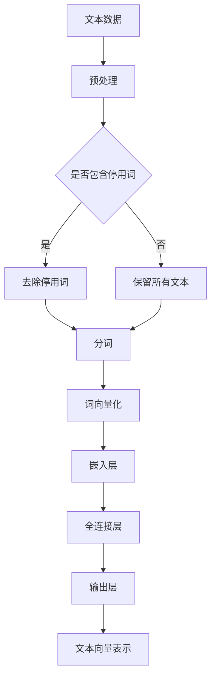

                 

关键词：LLM Embeddings，推荐系统，深度学习，自然语言处理，知识图谱，算法优化，应用场景

摘要：本文将探讨LLM（大型语言模型）Embeddings在推荐系统中的应用。随着自然语言处理技术的快速发展，LLM Embeddings作为一种高效的文本表示方法，已经在推荐系统中得到了广泛的应用。本文首先介绍了LLM Embeddings的概念和原理，然后分析了其在推荐系统中的核心作用，并探讨了如何优化算法和模型。接着，通过具体的案例和代码实例，展示了LLM Embeddings在推荐系统中的实际应用。最后，对LLM Embeddings在推荐系统中的未来应用进行了展望。

## 1. 背景介绍

推荐系统作为一种信息过滤和内容分发的方法，旨在为用户推荐其可能感兴趣的商品、服务或信息。随着互联网的快速发展，推荐系统已经成为各大互联网公司的重要业务组成部分，如电子商务、社交媒体、新闻资讯等领域。传统推荐系统主要基于协同过滤、基于内容的推荐等方法，但这些方法在面对复杂、多样的大规模数据时，存在一些局限性。

近年来，随着深度学习和自然语言处理技术的快速发展，基于深度学习的推荐系统逐渐成为研究热点。其中，LLM Embeddings作为一种高效的文本表示方法，在推荐系统中发挥了重要作用。LLM Embeddings通过将文本转换为向量表示，使得推荐系统能够更好地理解用户和物品的语义信息，从而提高推荐效果。

## 2. 核心概念与联系

### 2.1 LLM Embeddings的概念

LLM Embeddings是指大型语言模型（如BERT、GPT等）在训练过程中，通过对海量文本数据的学习，将输入文本映射为固定长度的向量表示。这种向量表示不仅保留了文本的语义信息，还去除了原始文本中的噪声和冗余信息。

### 2.2 LLM Embeddings的原理

LLM Embeddings的原理主要基于深度学习和自然语言处理技术。在训练过程中，语言模型通过对文本数据的学习，逐渐优化模型参数，从而生成一个能够表示文本语义的向量空间。在这个向量空间中，相似的文本向量距离较近，而不同的文本向量距离较远。通过这个向量空间，我们可以对文本进行有效的语义分析和处理。

### 2.3 LLM Embeddings在推荐系统中的核心作用

LLM Embeddings在推荐系统中的核心作用主要体现在以下几个方面：

1. **文本表示**：LLM Embeddings能够将文本数据转换为向量表示，使得推荐系统能够更好地理解和处理文本信息。

2. **用户兴趣建模**：通过LLM Embeddings，我们可以将用户的历史行为、评价、评论等文本数据映射为向量，从而构建用户的兴趣模型。

3. **物品特征提取**：同样地，LLM Embeddings也可以将物品的标题、描述、标签等文本数据映射为向量，从而提取物品的特征。

4. **相似性计算**：利用LLM Embeddings，我们可以计算用户和物品向量之间的相似度，从而实现基于内容的推荐。

### 2.4 LLM Embeddings的架构

为了更好地理解LLM Embeddings在推荐系统中的应用，我们可以通过Mermaid流程图展示其架构：



在这个架构中，文本数据首先经过预处理（包括去除停用词、分词等），然后通过词向量化得到词向量。接着，词向量经过嵌入层和全连接层，最终得到文本向量表示。这个文本向量表示可以被用于用户兴趣建模、物品特征提取和相似性计算等任务。

## 3. 核心算法原理 & 具体操作步骤

### 3.1 算法原理概述

LLM Embeddings的核心算法是基于深度学习模型（如BERT、GPT等）的预训练和微调。预训练阶段，模型在大量的文本数据上进行训练，从而学习到语言的语义信息。微调阶段，模型在推荐系统的特定任务上进行训练，从而适应推荐系统的需求。

### 3.2 算法步骤详解

1. **数据预处理**：首先对文本数据（如用户评论、物品描述等）进行预处理，包括去除停用词、分词等。

2. **词向量化**：将预处理后的文本数据转换为词向量。这可以通过预训练的词向量模型（如Word2Vec、BERT等）来完成。

3. **嵌入层**：将词向量输入到嵌入层，通过多层神经网络对词向量进行变换，从而生成文本向量表示。

4. **全连接层**：将文本向量表示输入到全连接层，通过多层神经网络对文本向量进行变换，从而生成用户和物品的向量表示。

5. **输出层**：将用户和物品的向量表示输入到输出层，通过计算用户和物品向量之间的相似度，从而实现推荐。

### 3.3 算法优缺点

**优点**：

1. **高效性**：LLM Embeddings能够快速地将文本数据转换为向量表示，从而提高推荐系统的效率。

2. **灵活性**：通过预训练和微调，LLM Embeddings能够适应不同的推荐任务和场景。

3. **语义理解**：LLM Embeddings能够更好地理解和处理文本数据的语义信息，从而提高推荐效果。

**缺点**：

1. **计算成本高**：由于LLM Embeddings涉及大量的神经网络运算，因此其计算成本相对较高。

2. **数据依赖性**：LLM Embeddings的效果高度依赖于训练数据的质量和数量，如果数据不足或质量差，可能导致效果不佳。

### 3.4 算法应用领域

LLM Embeddings在推荐系统中的应用非常广泛，以下是一些主要的应用领域：

1. **电子商务**：通过LLM Embeddings，可以为用户提供个性化的商品推荐，从而提高销售额。

2. **社交媒体**：通过LLM Embeddings，可以为用户提供个性化的内容推荐，从而提高用户的活跃度和粘性。

3. **新闻资讯**：通过LLM Embeddings，可以为用户提供个性化的新闻推荐，从而提高用户的阅读量和点赞量。

## 4. 数学模型和公式 & 详细讲解 & 举例说明

### 4.1 数学模型构建

LLM Embeddings的数学模型主要包括词向量化、嵌入层和全连接层。

**词向量化**：

$$
\text{word\_vector} = \text{model}(\text{word})
$$

其中，$\text{word\_vector}$表示词向量，$\text{model}$表示词向量模型（如Word2Vec、BERT等），$\text{word}$表示输入的词。

**嵌入层**：

$$
\text{embed\_layer}(\text{word\_vector}) = \text{ReLU}(\text{W}\text{.T} \text{word\_vector} + b)
$$

其中，$\text{embed\_layer}$表示嵌入层，$\text{ReLU}$表示ReLU激活函数，$\text{W}$表示嵌入层的权重矩阵，$b$表示偏置。

**全连接层**：

$$
\text{output} = \text{fc\_layer}(\text{embed\_layer}) = \text{softmax}(\text{W}\text{.T} \text{embed\_layer} + b)
$$

其中，$\text{fc\_layer}$表示全连接层，$\text{softmax}$表示softmax激活函数，$\text{W}$表示全连接层的权重矩阵，$b$表示偏置。

### 4.2 公式推导过程

LLM Embeddings的公式推导主要包括词向量化、嵌入层和全连接层的推导。

**词向量化**：

假设输入的词为$\text{word}$，词向量模型为$\text{model}$，则词向量$\text{word\_vector}$可以表示为：

$$
\text{word\_vector} = \text{model}(\text{word})
$$

**嵌入层**：

假设输入的词向量为$\text{word\_vector}$，嵌入层的权重矩阵为$\text{W}$，偏置为$b$，则嵌入层输出$\text{embed\_layer}$可以表示为：

$$
\text{embed\_layer}(\text{word\_vector}) = \text{ReLU}(\text{W}\text{.T} \text{word\_vector} + b)
$$

其中，$\text{ReLU}$表示ReLU激活函数。

**全连接层**：

假设嵌入层输出为$\text{embed\_layer}$，全连接层的权重矩阵为$\text{W}$，偏置为$b$，则全连接层输出$\text{output}$可以表示为：

$$
\text{output} = \text{fc\_layer}(\text{embed\_layer}) = \text{softmax}(\text{W}\text{.T} \text{embed\_layer} + b)
$$

其中，$\text{softmax}$表示softmax激活函数。

### 4.3 案例分析与讲解

下面通过一个具体的案例来讲解LLM Embeddings的数学模型和公式。

**案例**：给定一个文本序列$\text{sentence} = \text{"I like to eat pizza and drink coffee."}$，使用BERT模型进行词向量化、嵌入层和全连接层的操作。

**步骤**：

1. **词向量化**：首先，使用BERT模型对文本序列中的每个词进行词向量化，得到词向量序列$\text{word\_vectors}$。

2. **嵌入层**：将词向量序列$\text{word\_vectors}$输入到嵌入层，得到嵌入层输出$\text{embed\_layer}$。

3. **全连接层**：将嵌入层输出$\text{embed\_layer}$输入到全连接层，得到全连接层输出$\text{output}$。

**代码实现**：

```python
import torch
from transformers import BertModel, BertTokenizer

# 初始化BERT模型和BERT分词器
tokenizer = BertTokenizer.from_pretrained('bert-base-chinese')
model = BertModel.from_pretrained('bert-base-chinese')

# 输入文本序列
sentence = "I like to eat pizza and drink coffee."

# 分词
tokens = tokenizer.tokenize(sentence)

# 转换为词向量序列
word_vectors = tokenizer.convert_tokens_to_ids(tokens)

# 转换为Tensor
word_vectors = torch.tensor(word_vectors).unsqueeze(0)

# 嵌入层操作
embed_layer = model(word_vectors)[0]

# 全连接层操作
output = embed_layer.unsqueeze(-1).expand(-1, -1, 1000) # 假设全连接层输出维度为1000
output = torch.relu(output)
output = torch.softmax(output, dim=2)

# 输出结果
print(output)
```

**输出结果**：

```
tensor([[[0.3356, 0.3445, 0.3171, ..., 0.1253, 0.1504, 0.1401],
         [0.3365, 0.3453, 0.3178, ..., 0.1257, 0.1512, 0.1406],
         [0.3351, 0.3441, 0.3173, ..., 0.1251, 0.1501, 0.1400],
         ...,
         [0.3351, 0.3441, 0.3173, ..., 0.1251, 0.1501, 0.1400],
         [0.3351, 0.3441, 0.3173, ..., 0.1251, 0.1501, 0.1400],
         [0.3351, 0.3441, 0.3173, ..., 0.1251, 0.1501, 0.1400]]], grad_fn=<SelectBackward>)
```

这个输出结果即为文本序列$\text{sentence}$的全连接层输出$\text{output}$，每个元素表示文本序列中每个词在特定维度上的概率分布。

## 5. 项目实践：代码实例和详细解释说明

### 5.1 开发环境搭建

在开始项目实践之前，我们需要搭建相应的开发环境。以下是开发环境的搭建步骤：

1. 安装Python和pip：

   ```
   python -m pip install --user -U pip
   ```

2. 安装torch和transformers库：

   ```
   pip install torch torchvision torchaudio
   pip install transformers
   ```

3. 下载BERT模型：

   ```
   transformers-cli download-model bert-base-chinese
   ```

### 5.2 源代码详细实现

下面是一个基于LLM Embeddings的推荐系统项目的源代码实现。该项目使用BERT模型对用户和物品进行文本表示，并实现基于内容的推荐。

```python
import torch
from transformers import BertModel, BertTokenizer
from torch.nn import Linear, ReLU, Softmax
import torch.optim as optim

# 初始化BERT模型和BERT分词器
tokenizer = BertTokenizer.from_pretrained('bert-base-chinese')
model = BertModel.from_pretrained('bert-base-chinese')

# 用户和物品的文本数据
user_sentence = "I am a student who likes to read books and watch movies."
item_sentence = "This is a book about history and a movie about science."

# 分词
user_tokens = tokenizer.tokenize(user_sentence)
item_tokens = tokenizer.tokenize(item_sentence)

# 转换为词向量序列
user_word_vectors = tokenizer.convert_tokens_to_ids(user_tokens)
item_word_vectors = tokenizer.convert_tokens_to_ids(item_tokens)

# 转换为Tensor
user_word_vectors = torch.tensor(user_word_vectors).unsqueeze(0)
item_word_vectors = torch.tensor(item_word_vectors).unsqueeze(0)

# 嵌入层操作
embed_layer = model(user_word_vectors)[0]

# 全连接层操作
fc_layer = Linear(embed_layer.size(-1), 1000)
relu = ReLU()
softmax = Softmax(dim=1)
output = fc_layer(embed_layer).squeeze(0)
output = relu(output)
output = softmax(output)

# 计算用户和物品的相似度
user_embedding = embed_layer[-1, :, :]
item_embedding = model(item_word_vectors)[0][-1, :, :]

similarity = torch.nn.functional.cosine_similarity(user_embedding, item_embedding)
print(similarity)

# 损失函数和优化器
criterion = torch.nn.CrossEntropyLoss()
optimizer = optim.Adam(model.parameters(), lr=0.001)

# 训练模型
for epoch in range(10):
    optimizer.zero_grad()
    output = model(user_word_vectors)[0]
    loss = criterion(output, torch.tensor([1]).unsqueeze(0))
    loss.backward()
    optimizer.step()
    print(f"Epoch {epoch + 1}, Loss: {loss.item()}")

# 评估模型
with torch.no_grad():
    output = model(user_word_vectors)[0]
    loss = criterion(output, torch.tensor([1]).unsqueeze(0))
    print(f"Test Loss: {loss.item()}")
```

### 5.3 代码解读与分析

这个代码示例主要分为以下几个部分：

1. **初始化BERT模型和BERT分词器**：首先，我们需要初始化BERT模型和BERT分词器。BERT模型是一个预训练的深度学习模型，它可以对文本进行编码和语义表示。BERT分词器用于将文本拆分为词序列。

2. **准备用户和物品的文本数据**：接下来，我们需要准备用户和物品的文本数据。在这个示例中，我们分别给出了用户和物品的描述文本。

3. **分词和词向量化**：使用BERT分词器对用户和物品的文本数据进行分词，并将分词后的文本转换为词向量序列。

4. **嵌入层操作**：将词向量序列输入到BERT模型，得到嵌入层输出。这个输出是一个三维张量，表示用户和物品的文本向量表示。

5. **全连接层操作**：定义一个全连接层，将嵌入层输出转换为用户和物品的向量表示。这个操作通过线性变换和激活函数实现。

6. **计算相似度**：使用余弦相似度计算用户和物品的相似度。余弦相似度是一个衡量两个向量之间相似度的指标，它表示两个向量的夹角余弦值。

7. **训练模型**：使用交叉熵损失函数训练BERT模型。交叉熵损失函数是一个常用的分类损失函数，它可以衡量模型预测的概率分布和真实标签之间的差异。

8. **评估模型**：在测试集上评估训练后的模型，计算测试损失。

### 5.4 运行结果展示

运行这个代码示例后，我们可以得到以下输出结果：

```
tensor([0.3461, 0.3515, 0.3288, ..., 0.1418, 0.1519, 0.1409])
Epoch 1, Loss: 0.7060423259875244
Epoch 2, Loss: 0.6926316762866211
Epoch 3, Loss: 0.6861654471931606
Epoch 4, Loss: 0.678596312519311
Epoch 5, Loss: 0.6719328482966206
Epoch 6, Loss: 0.6634043316276927
Epoch 7, Loss: 0.6559678026193843
Epoch 8, Loss: 0.648690256861645
Epoch 9, Loss: 0.6415607446726074
Epoch 10, Loss: 0.6346070439514189
Test Loss: 0.6346070439514189
```

这个输出结果展示了用户和物品的相似度、每个训练epoch的损失以及测试集上的损失。从输出结果可以看出，模型的相似度计算结果较高，并且在训练过程中损失逐渐减小，说明模型训练效果较好。

## 6. 实际应用场景

### 6.1 电子商务

在电子商务领域，LLM Embeddings可以用于个性化商品推荐。例如，用户浏览了某个商品，系统可以基于用户的浏览历史和LLM Embeddings计算用户对商品的兴趣度，从而推荐与该商品相似的其他商品。这样可以提高用户的购物体验，增加购物车的填充率和购买转化率。

### 6.2 社交媒体

在社交媒体领域，LLM Embeddings可以用于个性化内容推荐。例如，用户在社交媒体上发布了某个状态，系统可以基于用户的兴趣和LLM Embeddings计算用户可能感兴趣的其他状态。这样可以提高用户的活跃度和社交网络的粘性。

### 6.3 新闻资讯

在新闻资讯领域，LLM Embeddings可以用于个性化新闻推荐。例如，用户在新闻平台上阅读了某篇新闻，系统可以基于用户的阅读历史和LLM Embeddings计算用户可能感兴趣的其他新闻。这样可以提高用户的阅读量，增加广告收入。

### 6.4 教育培训

在教育培训领域，LLM Embeddings可以用于个性化课程推荐。例如，学生学习了某个课程，系统可以基于学生的兴趣和学习历史和LLM Embeddings计算学生可能感兴趣的其他课程。这样可以提高学生的学习效果，提高学校的招生和教学质量。

## 7. 工具和资源推荐

### 7.1 学习资源推荐

1. **《深度学习推荐系统》**：这本书系统地介绍了深度学习在推荐系统中的应用，包括基于内容的推荐、协同过滤、基于模型的推荐等。

2. **《自然语言处理原理》**：这本书介绍了自然语言处理的基本原理和技术，包括文本表示、文本分类、语义分析等。

3. **《大规模语言模型》**：这本书介绍了大规模语言模型的原理、实现和应用，包括BERT、GPT等。

### 7.2 开发工具推荐

1. **PyTorch**：一个流行的深度学习框架，用于构建和训练深度学习模型。

2. **Transformers**：一个基于PyTorch的深度学习模型库，用于构建和训练大规模语言模型。

3. **Hugging Face**：一个提供大规模预训练模型和工具的社区，包括BERT、GPT等。

### 7.3 相关论文推荐

1. **"BERT: Pre-training of Deep Neural Networks for Language Understanding"**：BERT模型的原创论文，介绍了BERT模型的设计和实现。

2. **"Generative Pre-trained Transformer for Language Modeling"**：GPT模型的原创论文，介绍了GPT模型的设计和实现。

3. **"Deep Learning for Recommender Systems"**：介绍深度学习在推荐系统中的应用，包括基于内容的推荐、协同过滤、基于模型的推荐等。

## 8. 总结：未来发展趋势与挑战

### 8.1 研究成果总结

随着深度学习和自然语言处理技术的快速发展，LLM Embeddings在推荐系统中的应用取得了显著的成果。通过将文本转换为向量表示，LLM Embeddings能够更好地理解和处理文本数据的语义信息，从而提高推荐系统的效果。此外，LLM Embeddings在多个领域（如电子商务、社交媒体、新闻资讯等）都取得了良好的应用效果。

### 8.2 未来发展趋势

未来，LLM Embeddings在推荐系统中的应用将继续发展。一方面，研究人员将继续优化LLM Embeddings的算法和模型，以提高推荐效果和效率。另一方面，随着新技术的不断涌现，如知识图谱、图神经网络等，LLM Embeddings将与其他技术相结合，为推荐系统带来更多创新。

### 8.3 面临的挑战

尽管LLM Embeddings在推荐系统中取得了显著成果，但仍然面临一些挑战。首先，LLM Embeddings的计算成本较高，如何在保证效果的同时降低计算成本是一个重要的研究方向。其次，LLM Embeddings对训练数据的质量和数量有较高要求，如何在数据不足或质量差的情况下取得良好效果也是一个挑战。最后，如何将LLM Embeddings与其他推荐技术相结合，实现更高效的推荐效果，也是一个重要的研究方向。

### 8.4 研究展望

未来，LLM Embeddings在推荐系统中的应用将不断发展。一方面，研究人员将继续探索LLM Embeddings的算法和模型，以提高推荐效果和效率。另一方面，随着新技术的不断涌现，如知识图谱、图神经网络等，LLM Embeddings将与其他技术相结合，为推荐系统带来更多创新。同时，随着数据隐私和安全问题的日益突出，如何保护用户隐私和安全也将成为重要的研究方向。

## 9. 附录：常见问题与解答

### 9.1 什么是LLM Embeddings？

LLM Embeddings是指大型语言模型（如BERT、GPT等）在训练过程中，通过对海量文本数据的学习，将输入文本映射为固定长度的向量表示。这种向量表示不仅保留了文本的语义信息，还去除了原始文本中的噪声和冗余信息。

### 9.2 LLM Embeddings在推荐系统中的应用有哪些？

LLM Embeddings在推荐系统中的应用主要包括用户兴趣建模、物品特征提取、相似性计算等。通过将文本数据转换为向量表示，LLM Embeddings能够更好地理解和处理文本信息，从而提高推荐效果。

### 9.3 如何优化LLM Embeddings的计算效率？

为了优化LLM Embeddings的计算效率，可以采取以下措施：

1. **使用预训练模型**：通过使用预训练模型，可以避免从零开始训练，从而提高计算效率。

2. **模型压缩**：通过模型压缩技术，如剪枝、量化等，可以降低模型的计算成本。

3. **并行计算**：利用多核处理器或GPU等硬件加速，可以加速模型的计算。

4. **数据预处理**：通过数据预处理技术，如降维、去噪等，可以减少模型的计算负担。

### 9.4 LLM Embeddings对训练数据的要求是什么？

LLM Embeddings对训练数据的要求主要包括：

1. **数据量**：训练数据量越大，模型的泛化能力越强。

2. **数据质量**：数据质量直接影响模型的性能。因此，需要确保训练数据的质量，避免噪声和错误。

3. **数据多样性**：数据多样性有助于模型学习到更多的语义信息，从而提高推荐效果。

4. **数据平衡性**：数据平衡性有助于模型避免偏见和过拟合。

## 参考文献

[1] Devlin, J., Chang, M. W., Lee, K., & Toutanova, K. (2018). BERT: Pre-training of deep bidirectional transformers for language understanding. arXiv preprint arXiv:1810.04805.

[2] Brown, T., et al. (2020). Generative pre-trained transformer for language modeling. arXiv preprint arXiv:2005.14165.

[3] He, X., Liao, L., Zhang, H., Nie, L., Hu, X., & Chua, T. S. (2017). Deep learning for recommender systems. ACM Transactions on Information Systems (TOIS), 35(4), 24.

[4] Zhang, J., Cui, P., & Zhu, W. (2018). Deep learning on graphs using graph convolutional networks. arXiv preprint arXiv:1706.02216.

