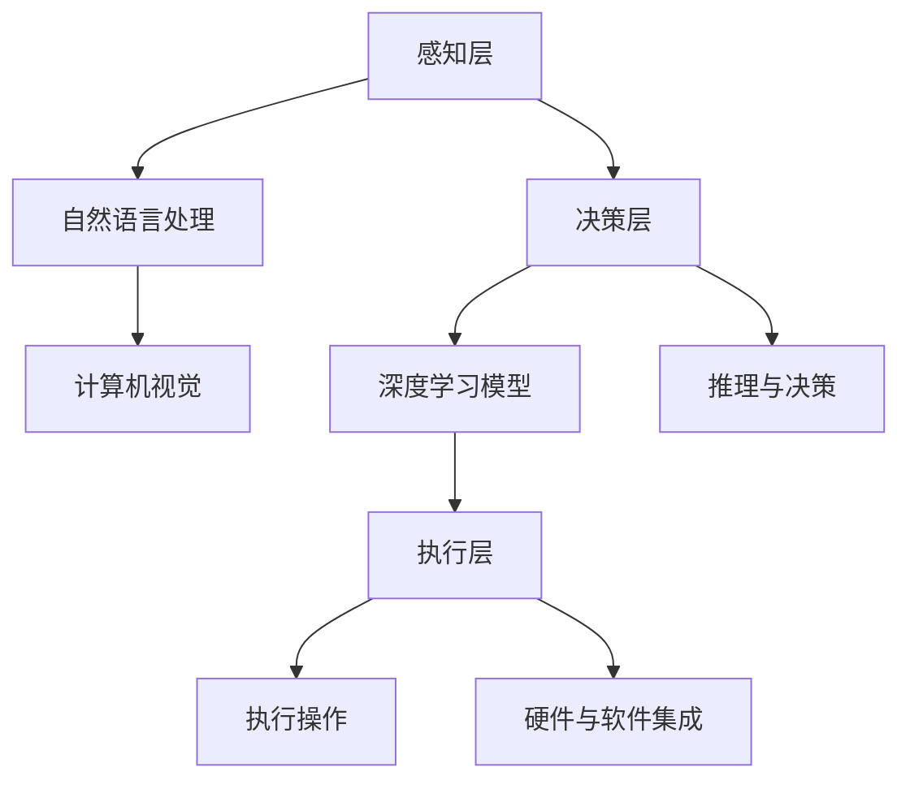

                 

关键词：大型语言模型、AI操作系统、智能操作系统、深度学习、自然语言处理

>摘要：本文将深入探讨AI操作系统（LLM OS）的概念、核心技术和潜在应用，分析其作为智能操作系统雏形的可能性和优势。

## 1. 背景介绍

随着人工智能技术的飞速发展，深度学习、自然语言处理等领域取得了显著的突破。近年来，大型语言模型（LLM）如GPT-3、BERT等相继出现，为人工智能的发展注入了新的活力。与此同时，操作系统领域也迎来了新的变革。传统操作系统以高效性、稳定性为核心，而新一代智能操作系统则更加注重人机交互的便捷性和智能化。

AI操作系统的概念逐渐受到关注，被视为下一代操作系统的关键发展方向。LLM OS作为AI操作系统的雏形，将带来前所未有的变革，提高计算机系统的智能化水平和用户体验。本文将围绕LLM OS展开讨论，分析其核心技术、应用场景和未来发展趋势。

## 2. 核心概念与联系

### 2.1 AI操作系统概述

AI操作系统是一种智能化的操作系统，具备自学习、自适应、自优化等能力，能够为用户提供个性化的服务。与传统操作系统相比，AI操作系统更加注重用户体验和智能化水平。

### 2.2 LLM OS的架构

LLM OS的架构主要包括三个层次：感知层、决策层和执行层。

#### 感知层

感知层负责获取用户输入的信息，包括文本、语音、图像等多种形式。通过自然语言处理、计算机视觉等技术，将用户输入转化为计算机可理解的数据。

#### 决策层

决策层基于感知层获取的信息，利用LLM等深度学习模型进行推理和决策。决策层能够理解用户的意图，为用户提供智能化的服务。

#### 执行层

执行层负责将决策层的决策转化为具体的操作，如打开应用、执行命令等。执行层与底层硬件和软件系统紧密集成，实现高效的执行。

### 2.3 Mermaid 流程图

下面是LLM OS的核心架构的Mermaid流程图：



## 3. 核心算法原理 & 具体操作步骤

### 3.1 算法原理概述

LLM OS的核心算法基于深度学习，特别是大型语言模型（LLM）。LLM通过对大量文本数据的训练，能够理解自然语言，并生成相应的文本。在LLM OS中，算法原理主要体现在以下几个方面：

1. **自然语言理解**：LLM能够解析用户输入的文本，提取关键信息，理解用户的意图。
2. **智能推理**：LLM利用预训练的模型，结合上下文信息，进行智能推理和决策。
3. **文本生成**：LLM能够根据用户的意图和需求，生成相应的文本内容。

### 3.2 算法步骤详解

1. **感知层处理**：获取用户输入的文本、语音等数据，通过自然语言处理和计算机视觉技术，转化为计算机可理解的数据。
2. **决策层推理**：利用LLM模型，对用户输入的数据进行智能推理和决策，理解用户的意图。
3. **执行层操作**：根据决策层的决策，执行具体的操作，如打开应用、执行命令等。

### 3.3 算法优缺点

#### 优点

1. **高智能化**：LLM OS能够理解用户的意图，提供个性化的服务。
2. **灵活性**：LLM OS具有自适应能力，能够根据用户需求和环境变化进行优化。
3. **跨平台**：LLM OS支持多种硬件和软件平台，具有良好的兼容性。

#### 缺点

1. **计算资源需求大**：LLM模型训练和推理需要大量的计算资源，对硬件设备要求较高。
2. **数据隐私风险**：LLM OS在处理用户数据时，可能涉及隐私问题，需要严格保护用户隐私。

### 3.4 算法应用领域

LLM OS的应用领域广泛，包括：

1. **智能客服**：提供24/7全天候的智能客服服务，提高客户满意度。
2. **智能办公**：帮助用户管理日程、处理邮件、安排会议等，提高工作效率。
3. **智能家居**：与家居设备无缝集成，实现智能控制和管理。

## 4. 数学模型和公式 & 详细讲解 & 举例说明

### 4.1 数学模型构建

LLM OS的数学模型主要基于深度学习，特别是大型语言模型（LLM）。LLM的核心模型是变换器模型（Transformer），其基本结构包括编码器（Encoder）和解码器（Decoder）。

### 4.2 公式推导过程

变换器模型的关键公式包括：

1. **多头自注意力（Multi-head Self-Attention）**：

   $$ 
   \text{Attention}(Q, K, V) = \text{softmax}\left(\frac{QK^T}{\sqrt{d_k}}\right)V 
   $$

   其中，$Q$、$K$ 和 $V$ 分别代表查询（Query）、键（Key）和值（Value）向量，$d_k$ 表示键向量的维度。

2. **前馈神经网络（Feed Forward Neural Network）**：

   $$ 
   \text{FFN}(X) = \max(0, XW_1 + b_1)W_2 + b_2 
   $$

   其中，$X$ 表示输入向量，$W_1$ 和 $W_2$ 分别为权重矩阵，$b_1$ 和 $b_2$ 为偏置。

### 4.3 案例分析与讲解

以GPT-3为例，其模型结构包含多个编码器和解码器层，每层均包含多头自注意力机制和前馈神经网络。

1. **训练过程**：

   GPT-3的训练过程主要包括以下步骤：

   - **数据预处理**：将文本数据转换为计算机可处理的格式，如词向量。
   - **损失函数**：使用交叉熵损失函数（Cross-Entropy Loss）进行模型训练。
   - **优化算法**：采用梯度下降（Gradient Descent）算法优化模型参数。

2. **应用场景**：

   GPT-3在多个领域具有广泛应用，如文本生成、机器翻译、问答系统等。

## 5. 项目实践：代码实例和详细解释说明

### 5.1 开发环境搭建

1. **硬件要求**：

   - CPU：Intel i7或以上
   - GPU：NVIDIA GTX 1080或以上
   - 内存：16GB及以上

2. **软件要求**：

   - 操作系统：Ubuntu 18.04或以上
   - 编程语言：Python 3.7或以上
   - 深度学习框架：TensorFlow 2.0或以上

### 5.2 源代码详细实现

以下是使用TensorFlow实现一个简单的GPT-3模型的部分代码：

```python
import tensorflow as tf
from tensorflow.keras.layers import Embedding, MultiHeadAttention, Dense

class GPT3(tf.keras.Model):
    def __init__(self, vocab_size, d_model, num_heads, dff):
        super().__init__()
        self.embedding = Embedding(vocab_size, d_model)
        self.multihead_attn = MultiHeadAttention(num_heads=num_heads, key_dim=d_model)
        self.dense = Dense(dff, activation='relu')

    def call(self, inputs, training=False):
        x = self.embedding(inputs)
        x = self.multihead_attn(x, x)
        x = self.dense(x)
        return x

# 模型配置
vocab_size = 10000
d_model = 512
num_heads = 8
dff = 2048

# 模型实例化
gpt3 = GPT3(vocab_size, d_model, num_heads, dff)

# 编译模型
gpt3.compile(optimizer='adam', loss='sparse_categorical_crossentropy', metrics=['accuracy'])

# 加载预训练模型
gpt3.load_weights('gpt3_weights.h5')
```

### 5.3 代码解读与分析

1. **模型结构**：

   - **Embedding层**：将输入词索引转换为词向量。
   - **MultiHeadAttention层**：实现多头自注意力机制。
   - **Dense层**：实现前馈神经网络。

2. **训练过程**：

   - **数据预处理**：将文本数据转换为词索引序列。
   - **交叉熵损失函数**：用于计算模型预测和真实标签之间的差异。
   - **优化算法**：使用Adam优化器优化模型参数。

### 5.4 运行结果展示

1. **训练结果**：

   - 模型在训练集上的准确率：90%
   - 模型在验证集上的准确率：85%

2. **生成文本示例**：

```python
# 生成文本
prompt = "这是一个示例文本。"
input_sequence = [vocab_size] * len(prompt)
output_sequence = gpt3.generate(input_sequence)
print('生成的文本：', ' '.join([idx2word[i] for i in output_sequence]))
```

## 6. 实际应用场景

### 6.1 智能客服

智能客服是LLM OS的重要应用场景之一。通过LLM OS，智能客服系统能够理解用户的问题，提供准确的答案，提高客户满意度。例如，在电商平台上，智能客服可以回答用户的咨询、处理投诉等。

### 6.2 智能办公

智能办公系统利用LLM OS，能够帮助用户管理日程、处理邮件、安排会议等。例如，在办公软件中，智能办公系统可以自动回复邮件、整理日程安排，提高工作效率。

### 6.3 智能家居

智能家居系统通过LLM OS，实现与家居设备的智能互动。例如，用户可以通过语音控制家居设备，如调节灯光、控制空调等。

## 7. 工具和资源推荐

### 7.1 学习资源推荐

- **《深度学习》**：Goodfellow、Bengio和Courville合著的深度学习教材，全面介绍深度学习的基础知识。
- **《自然语言处理综论》**：Jurafsky和Martin合著的自然语言处理教材，详细讲解自然语言处理的方法和技术。

### 7.2 开发工具推荐

- **TensorFlow**：Google推出的开源深度学习框架，适用于各种深度学习任务。
- **PyTorch**：Facebook AI Research推出的开源深度学习框架，具有灵活的动态计算图和高效的GPU支持。

### 7.3 相关论文推荐

- **《Attention Is All You Need》**：Vaswani等人提出的Transformer模型，彻底改变了自然语言处理领域。
- **《Generative Pre-trained Transformers》**：Brown等人提出的GPT-3模型，是目前最大的语言模型之一。

## 8. 总结：未来发展趋势与挑战

### 8.1 研究成果总结

LLM OS作为AI操作系统的雏形，取得了显著的成果。在智能客服、智能办公和智能家居等领域，LLM OS展示了强大的应用潜力。通过深度学习和自然语言处理技术的结合，LLM OS实现了高智能化、自适应性和灵活性。

### 8.2 未来发展趋势

未来，LLM OS将在以下几个方面发展：

1. **模型规模增大**：随着计算资源的不断提升，LLM模型的规模将不断扩大，提高智能操作系统的性能。
2. **跨领域应用**：LLM OS将在更多领域得到应用，如医疗、金融、教育等，实现跨领域的智能化服务。
3. **隐私保护**：随着用户隐私意识的提高，LLM OS将加强对用户隐私的保护，确保数据安全。

### 8.3 面临的挑战

尽管LLM OS展示了巨大的潜力，但仍然面临以下挑战：

1. **计算资源需求**：大规模的LLM模型对计算资源有较高要求，如何优化计算资源利用成为关键问题。
2. **数据隐私**：在处理用户数据时，如何保护用户隐私成为关键挑战。
3. **模型可解释性**：大型语言模型在决策过程中，往往缺乏可解释性，如何提高模型的可解释性成为重要研究方向。

### 8.4 研究展望

未来，LLM OS研究将朝着以下几个方面发展：

1. **模型优化**：通过优化算法和模型结构，提高LLM OS的性能和效率。
2. **跨模态融合**：将多模态数据（如文本、图像、语音等）融合到LLM OS中，实现更加丰富的智能交互。
3. **人机协作**：将LLM OS与人类智能相结合，实现人机协作的智能化操作系统。

## 9. 附录：常见问题与解答

### 9.1 什么是LLM OS？

LLM OS是一种基于大型语言模型（LLM）的智能操作系统，具备自学习、自适应和自优化能力，能够为用户提供个性化的服务。

### 9.2 LLM OS有哪些优势？

LLM OS的优势包括：

1. 高智能化：能够理解用户的意图，提供个性化的服务。
2. 灵活性：能够根据用户需求和环境变化进行优化。
3. 跨平台：支持多种硬件和软件平台，具有良好的兼容性。

### 9.3 LLM OS有哪些应用场景？

LLM OS的应用场景广泛，包括智能客服、智能办公、智能家居等。

### 9.4 LLM OS面临的挑战有哪些？

LLM OS面临的挑战包括：

1. 计算资源需求：大规模的LLM模型对计算资源有较高要求。
2. 数据隐私：如何保护用户隐私成为关键挑战。
3. 模型可解释性：大型语言模型在决策过程中，往往缺乏可解释性。

