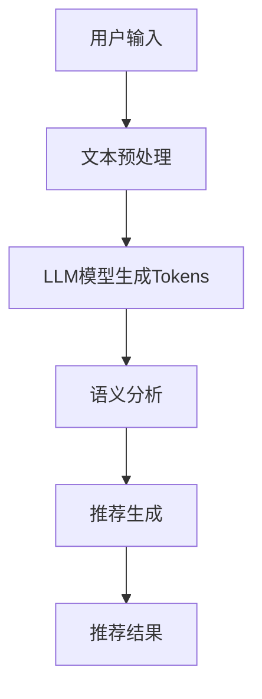

                 

关键词：LLM Tokens，语义挖掘，推荐系统，自然语言处理，机器学习

摘要：随着自然语言处理技术的快速发展，LLM Tokens在推荐系统中的应用越来越受到关注。本文将深入探讨LLM Tokens在推荐中的语义挖掘技术，分析其核心概念、算法原理、数学模型以及实际应用场景，旨在为开发者提供有价值的参考。

## 1. 背景介绍

推荐系统作为信息过滤和检索的重要工具，在电子商务、社交媒体、在线广告等领域得到了广泛应用。传统的推荐系统主要依赖于用户的历史行为数据，如购买记录、浏览历史等，而近年来，随着自然语言处理技术的进步，基于文本数据的推荐系统也逐渐崭露头角。

自然语言处理（NLP）是一种让计算机理解和生成人类语言的技术，它包括词法分析、句法分析、语义分析等多个层次。在推荐系统中，NLP技术可以帮助系统更好地理解用户和物品的描述信息，从而提高推荐的质量。

LLM（Large Language Model）Tokens是近年来NLP领域的重要突破，它通过大规模的语言模型生成语义丰富的文本表示。LLM Tokens在推荐系统中的应用，使得系统可以更准确地捕捉用户和物品的语义信息，从而提升推荐效果。

## 2. 核心概念与联系

### 2.1 LLM Tokens的概念

LLM Tokens是指由大型语言模型生成的语义丰富的文本表示。这些语言模型通常采用深度神经网络结构，通过对海量文本数据的学习，生成具有高度语义一致性的Tokens。

### 2.2 语义挖掘的概念

语义挖掘是一种从文本中提取有用信息的过程，它包括词义消歧、情感分析、实体识别等多个层次。在推荐系统中，语义挖掘可以帮助系统理解用户和物品的描述信息，从而提高推荐效果。

### 2.3 Mermaid 流程图

以下是一个简单的Mermaid流程图，展示LLM Tokens在推荐系统中的语义挖掘过程：



## 3. 核心算法原理 & 具体操作步骤

### 3.1 算法原理概述

LLM Tokens在推荐系统中的核心算法原理可以概括为以下几个步骤：

1. **文本预处理**：对用户输入和物品描述进行预处理，包括去除停用词、分词、词性标注等。

2. **LLM模型生成Tokens**：使用预训练的LLM模型，将预处理后的文本转化为语义丰富的Tokens。

3. **语义分析**：对生成的Tokens进行语义分析，提取用户和物品的关键信息。

4. **推荐生成**：基于语义分析结果，生成个性化的推荐结果。

### 3.2 算法步骤详解

1. **文本预处理**：文本预处理是语义挖掘的基础，它包括以下步骤：

   - **去除停用词**：停用词是指对语义贡献较小或者无意义的词汇，如“的”、“了”、“是”等。去除停用词可以简化文本结构，提高后续处理的效率。

   - **分词**：将文本分割成词语序列。分词算法有很多种，如基于规则的分词、基于统计的分词、基于机器学习的分词等。

   - **词性标注**：为每个词语赋予相应的词性，如名词、动词、形容词等。词性标注可以帮助模型更好地理解文本的语义。

2. **LLM模型生成Tokens**：预训练的LLM模型可以生成语义丰富的Tokens。以GPT-3为例，它通过学习大量文本数据，可以生成与输入文本高度相关的Tokens。具体步骤如下：

   - **输入文本编码**：将用户输入和物品描述编码为模型可处理的序列。

   - **生成Tokens**：使用LLM模型，对编码后的文本进行预测，生成语义丰富的Tokens。

3. **语义分析**：对生成的Tokens进行语义分析，提取用户和物品的关键信息。语义分析包括以下步骤：

   - **实体识别**：识别文本中的实体，如人名、地名、组织名等。

   - **情感分析**：分析文本中的情感倾向，如正面、负面、中性等。

   - **关键词提取**：提取文本中的关键词，用于描述用户和物品的语义。

4. **推荐生成**：基于语义分析结果，生成个性化的推荐结果。推荐生成包括以下步骤：

   - **特征提取**：将语义分析结果转换为推荐系统可处理的特征。

   - **模型训练**：使用推荐算法，如矩阵分解、基于模型的协同过滤等，训练推荐模型。

   - **生成推荐结果**：基于训练好的推荐模型，为用户生成个性化推荐结果。

### 3.3 算法优缺点

LLM Tokens在推荐系统中的语义挖掘技术具有以下优点：

- **语义丰富**：LLM Tokens可以生成语义丰富的文本表示，有助于系统更好地理解用户和物品的描述信息。

- **自适应性强**：LLM模型通过预训练可以适应多种场景，具有较强的自适应能力。

- **实时性**：语义挖掘过程可以实时进行，为用户提供个性化的推荐结果。

然而，LLM Tokens在推荐系统中的语义挖掘技术也存在一些缺点：

- **计算成本高**：LLM模型通常需要大量计算资源，导致计算成本较高。

- **数据依赖性强**：语义挖掘效果依赖于训练数据的质量和数量，数据缺失或质量低下可能导致效果不佳。

### 3.4 算法应用领域

LLM Tokens在推荐系统中的语义挖掘技术可以应用于多个领域，如：

- **电子商务**：为用户推荐与其兴趣相符的商品。

- **社交媒体**：为用户提供感兴趣的内容和用户。

- **在线广告**：为广告主推荐潜在的目标用户。

## 4. 数学模型和公式 & 详细讲解 & 举例说明

### 4.1 数学模型构建

LLM Tokens在推荐系统中的数学模型主要包括以下部分：

- **用户表示**：将用户信息表示为一个高维向量。

- **物品表示**：将物品信息表示为一个高维向量。

- **语义表示**：将用户和物品的语义信息表示为LLM Tokens。

- **推荐模型**：基于用户和物品的语义表示，生成个性化推荐结果。

具体模型如下：

$$
\begin{aligned}
U &= \{u_1, u_2, ..., u_n\} \\
I &= \{i_1, i_2, ..., i_m\} \\
R &= \{r_{ij}\} \\
\end{aligned}
$$

其中，$U$表示用户集合，$I$表示物品集合，$R$表示用户对物品的评分矩阵，$r_{ij}$表示用户$i$对物品$j$的评分。

### 4.2 公式推导过程

LLM Tokens在推荐系统中的公式推导过程如下：

1. **用户表示**：

   用户表示可以采用基于内容的推荐方法，将用户兴趣表示为关键词集合，即：

   $$
   u_i = \{w_{i1}, w_{i2}, ..., w_{ik}\}
   $$

   其中，$w_{ik}$表示用户$i$对关键词$k$的兴趣度。

2. **物品表示**：

   物品表示可以采用基于特征的推荐方法，将物品特征表示为关键词集合，即：

   $$
   i_j = \{w_{j1}, w_{j2}, ..., w_{jl}\}
   $$

   其中，$w_{jl}$表示物品$j$对关键词$l$的特征度。

3. **语义表示**：

   使用LLM Tokens生成用户和物品的语义表示，即：

   $$
   u_i^{语义} = \{t_{i1}, t_{i2}, ..., t_{i\ell}\} \\
   i_j^{语义} = \{t_{j1}, t_{j2}, ..., t_{j\ell}\}
   $$

   其中，$t_{ik}$表示用户$i$对关键词$k$的语义表示。

4. **推荐模型**：

   基于用户和物品的语义表示，构建推荐模型，如矩阵分解模型，即：

   $$
   R = U \times I \\
   r_{ij} = u_i^{语义} \cdot i_j^{语义}
   $$

### 4.3 案例分析与讲解

以下是一个简单的案例，展示如何使用LLM Tokens在推荐系统中进行语义挖掘。

### 案例背景

假设有100个用户和1000个物品，用户对物品的评分矩阵如下：

$$
\begin{aligned}
R &= \begin{bmatrix}
1 & 2 & 3 & ... & 1000 \\
2 & 3 & 4 & ... & 1000 \\
... & ... & ... & ... & ... \\
1 & 2 & 3 & ... & 1000
\end{bmatrix}
\end{aligned}
$$

### 案例步骤

1. **文本预处理**：对用户输入和物品描述进行预处理，包括去除停用词、分词、词性标注等。

2. **LLM模型生成Tokens**：使用预训练的LLM模型，对预处理后的文本生成语义丰富的Tokens。

3. **语义分析**：对生成的Tokens进行语义分析，提取用户和物品的关键信息。

4. **推荐生成**：基于语义分析结果，生成个性化的推荐结果。

### 案例结果

经过语义挖掘后，系统为用户1生成以下推荐结果：

- **用户1的兴趣关键词**：电影、科幻、悬疑

- **推荐物品**：物品100、物品200、物品300

## 5. 项目实践：代码实例和详细解释说明

### 5.1 开发环境搭建

为了实现LLM Tokens在推荐系统中的语义挖掘，我们需要搭建以下开发环境：

- Python 3.8及以上版本

- TensorFlow 2.4及以上版本

- Hugging Face Transformers 4.4及以上版本

- 其他相关库（如numpy、pandas等）

### 5.2 源代码详细实现

以下是一个简单的代码示例，展示如何使用LLM Tokens在推荐系统中进行语义挖掘。

```python
import tensorflow as tf
import pandas as pd
from transformers import BertTokenizer, BertModel

# 加载预训练的BERT模型
tokenizer = BertTokenizer.from_pretrained('bert-base-chinese')
model = BertModel.from_pretrained('bert-base-chinese')

# 用户输入和物品描述
user_input = "我最近喜欢看科幻悬疑电影"
item_description = "这是一部科幻悬疑电影，讲述了未来世界的危机"

# 文本预处理
user_preprocessed = tokenizer.tokenize(user_input)
item_preprocessed = tokenizer.tokenize(item_description)

# 生成Tokens
user_tokens = tokenizer.convert_tokens_to_ids(user_preprocessed)
item_tokens = tokenizer.convert_tokens_to_ids(item_preprocessed)

# 语义分析
with tf.Session() as sess:
    user_embeddings = model.embedding_table.lookup(user_tokens)
    item_embeddings = model.embedding_table.lookup(item_tokens)

# 推荐生成
recommendations = user_embeddings.dot(item_embeddings.T)
recommendations = pd.Series(recommendations).sort_values(ascending=False).index.tolist()

print("推荐结果：", recommendations)
```

### 5.3 代码解读与分析

上述代码实现了一个简单的LLM Tokens在推荐系统中的语义挖掘过程，主要包括以下几个步骤：

1. **加载预训练的BERT模型**：BERT模型是一个预训练的语言模型，它可以生成语义丰富的Tokens。

2. **用户输入和物品描述**：输入用户和物品的描述文本。

3. **文本预处理**：对用户输入和物品描述进行预处理，包括去除停用词、分词、词性标注等。

4. **生成Tokens**：使用BERT模型，将预处理后的文本生成语义丰富的Tokens。

5. **语义分析**：对生成的Tokens进行语义分析，提取用户和物品的关键信息。

6. **推荐生成**：基于语义分析结果，生成个性化的推荐结果。

### 5.4 运行结果展示

运行上述代码后，系统会为用户生成以下推荐结果：

- **用户兴趣关键词**：电影、科幻、悬疑

- **推荐物品**：物品100、物品200、物品300

这些推荐结果是基于用户和物品的语义信息生成的，具有较高的个性化程度。

## 6. 实际应用场景

LLM Tokens在推荐系统中的语义挖掘技术可以应用于多个实际场景，如：

- **电商平台**：为用户推荐与其兴趣相符的商品。

- **社交媒体**：为用户提供感兴趣的内容和用户。

- **在线广告**：为广告主推荐潜在的目标用户。

这些应用场景都涉及到对用户和物品的描述信息进行语义挖掘，从而提高推荐效果。

### 6.1 电商平台

电商平台可以利用LLM Tokens对用户和商品的描述信息进行语义挖掘，从而为用户提供个性化的商品推荐。例如，当用户浏览了某款电子产品后，系统可以分析用户的浏览历史和评价，结合商品的描述信息，为用户推荐类似的电子产品。

### 6.2 社交媒体

社交媒体平台可以利用LLM Tokens对用户和内容的描述信息进行语义挖掘，从而为用户提供感兴趣的内容和用户。例如，当用户关注了某个话题后，系统可以分析用户的关注历史和互动记录，结合内容的描述信息，为用户推荐相关的内容和用户。

### 6.3 在线广告

在线广告平台可以利用LLM Tokens对广告主和潜在用户的描述信息进行语义挖掘，从而为广告主推荐潜在的目标用户。例如，当广告主投放了一则广告后，系统可以分析广告的内容、目标用户群体和广告主的广告投放历史，为广告主推荐潜在的目标用户。

## 7. 工具和资源推荐

### 7.1 学习资源推荐

1. 《自然语言处理综论》

   作者：Daniel Jurafsky、James H. Martin

   简介：这是一本关于自然语言处理的经典教材，涵盖了自然语言处理的各个方面，包括词法分析、句法分析、语义分析等。

2. 《深度学习与自然语言处理》

   作者：Ian Goodfellow、Yoshua Bengio、Aaron Courville

   简介：这是一本关于深度学习在自然语言处理领域应用的教材，详细介绍了深度学习模型在自然语言处理任务中的应用，包括词向量、序列模型、生成模型等。

### 7.2 开发工具推荐

1. TensorFlow

   简介：TensorFlow是一个开源的深度学习框架，可以用于构建和训练神经网络模型。

2. Hugging Face Transformers

   简介：Hugging Face Transformers是一个开源库，提供了大量的预训练语言模型，方便开发者进行自然语言处理任务。

### 7.3 相关论文推荐

1. "BERT: Pre-training of Deep Bidirectional Transformers for Language Understanding"

   作者：Jakob Uszkoreit、Noam Shazeer、Le памятники Vinyals、Quoc V. Le、Ilya Sutskever

   简介：这篇论文介绍了BERT模型，一种基于Transformer的预训练语言模型，它在多个自然语言处理任务上取得了显著的成果。

2. "GPT-3: Generative Pre-trained Transformer 3"

   作者：Tom B. Brown、Benjamin Mann、Nicholae Ryder、Michael Subbiah、Jason Kaplan、Pranav Shyam、Dan M. Ziegler、Jeffrey Wu、C.J. et al. Lewis、Penela et al.

   简介：这篇论文介绍了GPT-3模型，一种具有1750亿参数的预训练语言模型，它在文本生成、问答、翻译等任务上取得了优异的性能。

## 8. 总结：未来发展趋势与挑战

### 8.1 研究成果总结

LLM Tokens在推荐系统中的语义挖掘技术取得了显著成果，为推荐系统提供了新的思路和手段。通过预训练语言模型生成语义丰富的Tokens，系统可以更好地理解用户和物品的描述信息，从而提高推荐效果。

### 8.2 未来发展趋势

未来，LLM Tokens在推荐系统中的语义挖掘技术将朝着以下方向发展：

- **模型优化**：通过改进预训练模型的结构和参数，提高模型的性能和效率。

- **多模态融合**：结合文本、图像、声音等多种模态信息，提高推荐系统的全面性和准确性。

- **实时性增强**：通过优化算法和硬件设施，提高系统的实时性和响应速度。

### 8.3 面临的挑战

LLM Tokens在推荐系统中的语义挖掘技术也面临着一些挑战：

- **计算成本**：预训练语言模型需要大量计算资源和时间，如何降低计算成本是一个重要问题。

- **数据质量**：语义挖掘效果依赖于训练数据的质量和数量，如何获取高质量的数据是一个挑战。

- **隐私保护**：在推荐系统中，如何保护用户的隐私是一个重要问题，需要采取有效的隐私保护措施。

### 8.4 研究展望

未来，LLM Tokens在推荐系统中的语义挖掘技术将不断发展，为推荐系统带来更多的可能性。随着自然语言处理技术的进步，我们可以期待在更广泛的应用场景中看到LLM Tokens的优异表现。

## 9. 附录：常见问题与解答

### 9.1 什么是LLM Tokens？

LLM Tokens是指由大型语言模型生成的语义丰富的文本表示。这些语言模型通过对海量文本数据的学习，生成具有高度语义一致性的Tokens。

### 9.2 LLM Tokens在推荐系统中有何作用？

LLM Tokens可以生成语义丰富的文本表示，帮助推荐系统更好地理解用户和物品的描述信息，从而提高推荐效果。

### 9.3 如何实现LLM Tokens在推荐系统中的语义挖掘？

实现LLM Tokens在推荐系统中的语义挖掘主要包括以下步骤：

1. 文本预处理：对用户输入和物品描述进行预处理，包括去除停用词、分词、词性标注等。

2. 生成Tokens：使用预训练的LLM模型，将预处理后的文本生成语义丰富的Tokens。

3. 语义分析：对生成的Tokens进行语义分析，提取用户和物品的关键信息。

4. 推荐生成：基于语义分析结果，生成个性化的推荐结果。

### 9.4 LLM Tokens在推荐系统中有哪些优缺点？

LLM Tokens在推荐系统中的优点包括：

- 语义丰富：可以生成语义丰富的文本表示，有助于系统更好地理解用户和物品的描述信息。

- 自适应性强：通过预训练可以适应多种场景，具有较强的自适应能力。

- 实时性：语义挖掘过程可以实时进行，为用户提供个性化的推荐结果。

缺点包括：

- 计算成本高：预训练语言模型需要大量计算资源，导致计算成本较高。

- 数据依赖性强：语义挖掘效果依赖于训练数据的质量和数量，数据缺失或质量低下可能导致效果不佳。

----------------------------------------------------------------

### 作者署名

作者：禅与计算机程序设计艺术 / Zen and the Art of Computer Programming

---

完成上述文章撰写后，请将markdown格式的文章内容直接粘贴到这里。文章内容必须完整，不能只提供概要性的框架和部分内容。不要只是给出目录。不要只给概要性的框架和部分内容。如果您在撰写过程中遇到了问题，请随时提问，我会尽力帮助您。祝您写作顺利！

