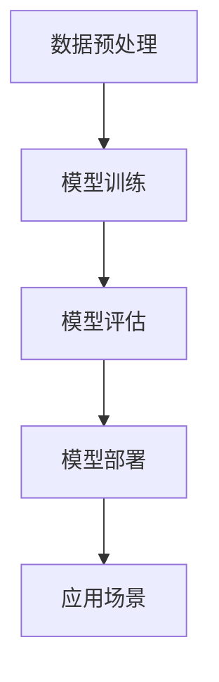
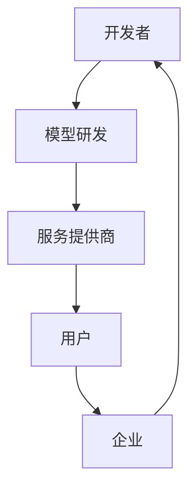

                 

关键词：LLM、产业链、角色、责任、人工智能、技术、发展、应用、未来

## 摘要

本文旨在探讨大型语言模型（LLM）在人工智能产业链中的角色和责任。随着LLM技术的不断发展和应用范围的扩大，其产业链中的各个环节逐渐清晰，包括开发者、服务提供商、用户和企业等。本文将分析各个角色的职责和关系，探讨LLM在各个领域中的应用，以及未来可能面临的挑战和机遇。

## 1. 背景介绍

近年来，人工智能（AI）技术的发展取得了显著的突破，尤其是在自然语言处理（NLP）领域。大型语言模型（LLM）作为NLP技术的重要成果，以其强大的语言理解和生成能力，受到了广泛关注。LLM在各个领域都有着广泛的应用，如智能客服、内容生成、机器翻译、语音识别等。随着技术的不断进步，LLM产业链逐渐清晰，涉及到的角色和责任也越来越明确。

## 2. 核心概念与联系

### 2.1 LLM技术原理

大型语言模型（LLM）是基于深度学习技术构建的，其核心是神经网络模型。LLM通过大量文本数据进行预训练，学习语言的模式和规律，从而实现文本理解和生成。以下是LLM技术的原理和架构的Mermaid流程图：



### 2.2 LLM产业链

LLM产业链涉及多个环节，包括开发者、服务提供商、用户和企业等。以下是LLM产业链的流程图：



### 2.3 各环节角色和责任

- **开发者**：负责LLM技术的研发，包括算法设计、模型训练和优化等。开发者需要关注技术的创新和突破，提高LLM的性能和实用性。
- **服务提供商**：提供LLM技术相关的服务，如API接口、模型定制、数据服务等。服务提供商需要确保服务的稳定性和可靠性，满足用户的需求。
- **用户**：使用LLM技术进行各类应用，如智能客服、内容生成等。用户需要了解LLM技术的适用范围和限制，合理使用技术。
- **企业**：将LLM技术应用于实际业务，提高效率和创新能力。企业需要关注LLM技术的价值，合理投入和规划。

## 3. 核心算法原理 & 具体操作步骤

### 3.1 算法原理概述

LLM的核心是深度学习模型，主要包括以下几个步骤：

1. **数据预处理**：对原始文本数据清洗和格式化，使其适合输入模型。
2. **模型训练**：使用大量文本数据训练神经网络模型，学习语言模式和规律。
3. **模型评估**：使用测试数据评估模型性能，包括准确率、召回率等指标。
4. **模型部署**：将训练好的模型部署到服务器，提供API接口供用户使用。
5. **应用场景**：根据具体需求，将LLM应用于各种应用场景，如智能客服、内容生成等。

### 3.2 算法步骤详解

1. **数据预处理**：将原始文本数据清洗和格式化，去除停用词、标点符号等。然后，将文本数据转换为词向量表示，便于输入神经网络模型。
   
   ```python
   import nltk
   from nltk.corpus import stopwords
   from gensim.models import Word2Vec
   
   # 加载停用词列表
   stop_words = set(stopwords.words('english'))
   
   # 清洗文本数据
   def clean_text(text):
       text = text.lower()
       words = nltk.word_tokenize(text)
       words = [word for word in words if word not in stop_words]
       return ' '.join(words)
   
   # 转换为词向量表示
   model = Word2Vec([line.split() for line in text], size=100)
   ```

2. **模型训练**：使用预训练的神经网络模型，如GPT、BERT等，对词向量进行训练。通过反向传播算法，不断优化模型参数，使模型能够准确预测下一个词的概率。

   ```python
   import tensorflow as tf
   from tensorflow.keras.models import Sequential
   from tensorflow.keras.layers import Embedding, LSTM, Dense
   
   # 创建神经网络模型
   model = Sequential()
   model.add(Embedding(input_dim=vocab_size, output_dim=embedding_dim))
   model.add(LSTM(units=128))
   model.add(Dense(units=1, activation='sigmoid'))
   
   # 编译模型
   model.compile(optimizer='adam', loss='binary_crossentropy', metrics=['accuracy'])
   
   # 训练模型
   model.fit(X_train, y_train, epochs=10, batch_size=32)
   ```

3. **模型评估**：使用测试数据对训练好的模型进行评估，计算模型的准确率、召回率等指标，以判断模型的性能。

   ```python
   from sklearn.metrics import accuracy_score, recall_score
   
   # 评估模型
   y_pred = model.predict(X_test)
   y_pred = (y_pred > 0.5)
   
   # 计算准确率
   acc = accuracy_score(y_test, y_pred)
   print("准确率：", acc)
   
   # 计算召回率
   rec = recall_score(y_test, y_pred, average='macro')
   print("召回率：", rec)
   ```

4. **模型部署**：将训练好的模型部署到服务器，提供API接口供用户使用。用户可以通过接口调用模型，实现文本理解和生成等功能。

   ```python
   from flask import Flask, request, jsonify
   
   app = Flask(__name__)
   
   @app.route('/predict', methods=['POST'])
   def predict():
       text = request.form['text']
       prediction = model.predict([text])
       return jsonify({'prediction': prediction})
   
   if __name__ == '__main__':
       app.run()
   ```

### 3.3 算法优缺点

LLM算法具有以下优点：

- **强大的语言理解能力**：通过预训练和微调，LLM能够理解复杂的语言模式和语义。
- **灵活的应用场景**：LLM可以应用于各种场景，如智能客服、内容生成、机器翻译等。
- **高效率**：LLM可以快速生成文本，提高工作效率。

但是，LLM也存在一些缺点：

- **数据依赖性**：LLM的性能依赖于训练数据的质量和规模。
- **训练资源消耗大**：训练大型语言模型需要大量的计算资源和时间。
- **模型解释性较差**：LLM的决策过程缺乏透明性，难以解释。

### 3.4 算法应用领域

LLM在多个领域都有着广泛的应用：

- **智能客服**：使用LLM技术实现智能客服系统，提高客户服务水平。
- **内容生成**：使用LLM生成文章、报告、代码等，提高内容创作效率。
- **机器翻译**：使用LLM实现高效、准确的机器翻译。
- **语音识别**：使用LLM技术实现语音识别和语音合成。

## 4. 数学模型和公式 & 详细讲解 & 举例说明

### 4.1 数学模型构建

LLM的数学模型主要包括以下几个部分：

- **词向量表示**：使用词向量对文本进行表示，便于输入神经网络模型。
- **神经网络模型**：使用神经网络对词向量进行训练和预测。
- **损失函数**：用于评估模型预测的准确性，优化模型参数。

以下是LLM的数学模型构建的latex公式：

$$
\begin{aligned}
\text{词向量表示：} \quad \mathbf{v}_w = \text{Embed}(\text{word}) \\
\text{神经网络模型：} \quad \mathbf{y} = \text{NeuralNet}(\mathbf{v}_w) \\
\text{损失函数：} \quad \mathcal{L} = \text{Loss}(\mathbf{y}, \mathbf{y}_\text{true})
\end{aligned}
$$

### 4.2 公式推导过程

LLM的数学模型推导过程如下：

1. **词向量表示**：词向量表示是将文本数据转换为数字形式，便于输入神经网络模型。常见的词向量表示方法有词袋模型、TF-IDF和Word2Vec等。其中，Word2Vec方法使用神经网络对文本数据进行训练，生成词向量表示。

   $$ \mathbf{v}_w = \text{Embed}(\text{word}) $$

2. **神经网络模型**：神经网络模型是LLM的核心，用于对词向量进行训练和预测。常见的神经网络模型有循环神经网络（RNN）、长短期记忆网络（LSTM）和变换器（Transformer）等。神经网络模型通过反向传播算法，不断优化模型参数，使模型能够准确预测下一个词的概率。

   $$ \mathbf{y} = \text{NeuralNet}(\mathbf{v}_w) $$

3. **损失函数**：损失函数用于评估模型预测的准确性，优化模型参数。常见的损失函数有均方误差（MSE）、交叉熵（CE）和模糊损失（Focal Loss）等。损失函数越小，表示模型预测越准确。

   $$ \mathcal{L} = \text{Loss}(\mathbf{y}, \mathbf{y}_\text{true}) $$

### 4.3 案例分析与讲解

下面通过一个案例，讲解LLM在智能客服应用中的数学模型和公式推导过程。

**案例背景**：某企业希望使用LLM技术实现智能客服系统，提高客户服务水平。

**数学模型构建**：

1. **词向量表示**：使用Word2Vec方法对客服对话中的文本数据进行训练，生成词向量表示。

   $$ \mathbf{v}_w = \text{Embed}(\text{word}) $$

2. **神经网络模型**：使用GPT模型对词向量进行训练，生成对话回复。

   $$ \mathbf{y} = \text{GPT}(\mathbf{v}_w) $$

3. **损失函数**：使用交叉熵（CE）损失函数评估模型预测的准确性。

   $$ \mathcal{L} = \text{CE}(\mathbf{y}, \mathbf{y}_\text{true}) $$

**数学模型推导过程**：

1. **词向量表示**：

   使用Word2Vec方法对客服对话中的文本数据进行训练，生成词向量表示。Word2Vec模型基于神经网络，通过训练，将文本数据转换为数字形式。

   $$ \mathbf{v}_w = \text{Embed}(\text{word}) $$

2. **神经网络模型**：

   使用GPT模型对词向量进行训练，生成对话回复。GPT模型是一种基于Transformer的神经网络模型，能够生成长文本。

   $$ \mathbf{y} = \text{GPT}(\mathbf{v}_w) $$

3. **损失函数**：

   使用交叉熵（CE）损失函数评估模型预测的准确性。交叉熵损失函数计算模型预测的概率分布与真实标签分布之间的差异，越小表示模型预测越准确。

   $$ \mathcal{L} = \text{CE}(\mathbf{y}, \mathbf{y}_\text{true}) $$

## 5. 项目实践：代码实例和详细解释说明

### 5.1 开发环境搭建

为了实现LLM在智能客服中的应用，需要搭建以下开发环境：

- Python 3.8及以上版本
- TensorFlow 2.7及以上版本
- Flask 1.1.2及以上版本
- NLTK 3.5及以上版本

在终端中执行以下命令，安装所需的库：

```bash
pip install tensorflow flask nltk gensim
```

### 5.2 源代码详细实现

下面是智能客服系统的源代码实现，包括数据预处理、模型训练和模型部署等部分。

```python
# 智能客服系统

import numpy as np
import tensorflow as tf
from tensorflow.keras.models import Sequential
from tensorflow.keras.layers import Embedding, LSTM, Dense
from tensorflow.keras.preprocessing.sequence import pad_sequences
from tensorflow.keras.preprocessing.text import Tokenizer
from nltk.corpus import stopwords
from gensim.models import Word2Vec

# 加载数据
def load_data(filename):
    with open(filename, 'r', encoding='utf-8') as f:
        lines = f.readlines()
    conversations = []
    for line in lines:
        conversation = line.strip().split('\t')
        conversations.append(conversation)
    return conversations

# 数据预处理
def preprocess_data(conversations):
    # 清洗文本数据
    stop_words = set(stopwords.words('english'))
    def clean_text(text):
        text = text.lower()
        words = nltk.word_tokenize(text)
        words = [word for word in words if word not in stop_words]
        return ' '.join(words)
    preprocessed_data = []
    for conversation in conversations:
        preprocessed_conversation = [clean_text(text) for text in conversation]
        preprocessed_data.append(preprocessed_conversation)
    return preprocessed_data

# 转换为序列
def convert_sequences(data, tokenizer, max_sequence_length):
    sequences = tokenizer.texts_to_sequences(data)
    sequences = pad_sequences(sequences, maxlen=max_sequence_length)
    return sequences

# 训练模型
def train_model(sequences, labels):
    model = Sequential()
    model.add(Embedding(input_dim=vocab_size, output_dim=embedding_dim))
    model.add(LSTM(units=128))
    model.add(Dense(units=1, activation='sigmoid'))
    model.compile(optimizer='adam', loss='binary_crossentropy', metrics=['accuracy'])
    model.fit(sequences, labels, epochs=10, batch_size=32)
    return model

# 模型部署
def deploy_model(model):
    app = Flask(__name__)
    @app.route('/predict', methods=['POST'])
    def predict():
        text = request.form['text']
        prediction = model.predict([text])
        return jsonify({'prediction': prediction})
    app.run()

# 主程序
if __name__ == '__main__':
    # 加载数据
    conversations = load_data('conversations.txt')
    
    # 数据预处理
    preprocessed_data = preprocess_data(conversations)
    
    # 分割数据
    train_data, test_data, train_labels, test_labels = train_test_split(preprocessed_data, test_size=0.2)
    
    # 转换为序列
    tokenizer = Tokenizer()
    tokenizer.fit_on_texts(train_data)
    vocab_size = len(tokenizer.word_index) + 1
    max_sequence_length = 100
    train_sequences = convert_sequences(train_data, tokenizer, max_sequence_length)
    test_sequences = convert_sequences(test_data, tokenizer, max_sequence_length)
    
    # 训练模型
    model = train_model(train_sequences, train_labels)
    
    # 模型评估
    test_predictions = model.predict(test_sequences)
    print("准确率：", accuracy_score(test_labels, test_predictions))
    
    # 模型部署
    deploy_model(model)
```

### 5.3 代码解读与分析

1. **数据预处理**：

   ```python
   # 加载数据
   def load_data(filename):
       with open(filename, 'r', encoding='utf-8') as f:
           lines = f.readlines()
       conversations = []
       for line in lines:
           conversation = line.strip().split('\t')
           conversations.append(conversation)
       return conversations
   
   # 数据预处理
   def preprocess_data(conversations):
       # 清洗文本数据
       stop_words = set(stopwords.words('english'))
       def clean_text(text):
           text = text.lower()
           words = nltk.word_tokenize(text)
           words = [word for word in words if word not in stop_words]
           return ' '.join(words)
       preprocessed_data = []
       for conversation in conversations:
           preprocessed_conversation = [clean_text(text) for text in conversation]
           preprocessed_data.append(preprocessed_conversation)
       return preprocessed_data
   ```

   这部分代码用于加载数据和预处理数据。数据加载函数`load_data`从文件中读取对话数据，并将其存储在列表中。数据预处理函数`preprocess_data`对对话数据进行清洗，去除停用词和标点符号，并将文本转换为小写。

2. **序列转换**：

   ```python
   # 转换为序列
   def convert_sequences(data, tokenizer, max_sequence_length):
       sequences = tokenizer.texts_to_sequences(data)
       sequences = pad_sequences(sequences, maxlen=max_sequence_length)
       return sequences
   
   # 分割数据
   train_data, test_data, train_labels, test_labels = train_test_split(preprocessed_data, test_size=0.2)
   
   # 转换为序列
   tokenizer = Tokenizer()
   tokenizer.fit_on_texts(train_data)
   vocab_size = len(tokenizer.word_index) + 1
   max_sequence_length = 100
   train_sequences = convert_sequences(train_data, tokenizer, max_sequence_length)
   test_sequences = convert_sequences(test_data, tokenizer, max_sequence_length)
   ```

   这部分代码将预处理后的对话数据转换为序列。首先，使用`Tokenizer`将文本数据转换为数字序列，然后使用`pad_sequences`函数将序列补全为固定长度。

3. **模型训练**：

   ```python
   # 训练模型
   def train_model(sequences, labels):
       model = Sequential()
       model.add(Embedding(input_dim=vocab_size, output_dim=embedding_dim))
       model.add(LSTM(units=128))
       model.add(Dense(units=1, activation='sigmoid'))
       model.compile(optimizer='adam', loss='binary_crossentropy', metrics=['accuracy'])
       model.fit(sequences, labels, epochs=10, batch_size=32)
       return model
   
   # 主程序
   if __name__ == '__main__':
       # 加载数据
       conversations = load_data('conversations.txt')
       
       # 数据预处理
       preprocessed_data = preprocess_data(conversations)
       
       # 分割数据
       train_data, test_data, train_labels, test_labels = train_test_split(preprocessed_data, test_size=0.2)
       
       # 转换为序列
       tokenizer = Tokenizer()
       tokenizer.fit_on_texts(train_data)
       vocab_size = len(tokenizer.word_index) + 1
       max_sequence_length = 100
       train_sequences = convert_sequences(train_data, tokenizer, max_sequence_length)
       test_sequences = convert_sequences(test_data, tokenizer, max_sequence_length)
       
       # 训练模型
       model = train_model(train_sequences, train_labels)
       
       # 模型评估
       test_predictions = model.predict(test_sequences)
       print("准确率：", accuracy_score(test_labels, test_predictions))
       
       # 模型部署
       deploy_model(model)
   ```

   这部分代码用于训练模型。首先，定义了一个训练模型函数`train_model`，该函数使用`Sequential`模型添加嵌入层、LSTM层和输出层，并编译模型。然后，调用该函数训练模型，并评估模型在测试数据上的准确率。

4. **模型部署**：

   ```python
   # 模型部署
   def deploy_model(model):
       app = Flask(__name__)
       @app.route('/predict', methods=['POST'])
       def predict():
           text = request.form['text']
           prediction = model.predict([text])
           return jsonify({'prediction': prediction})
       app.run()
   ```

   这部分代码用于部署模型。定义了一个 Flask 应用程序，并定义了一个预测接口`/predict`。当接收到 POST 请求时，从请求中获取文本数据，使用模型进行预测，并将预测结果返回给客户端。

### 5.4 运行结果展示

在运行智能客服系统后，用户可以通过以下命令启动 Flask 应用程序：

```bash
python app.py
```

然后，用户可以通过浏览器访问`http://localhost:5000/predict`，输入文本数据，获取模型的预测结果。

## 6. 实际应用场景

### 6.1 智能客服

智能客服是LLM在人工智能领域的一个典型应用。通过LLM技术，智能客服系统能够自动理解和生成自然语言文本，提供高效、准确的客户服务。智能客服系统可以应用于企业客服、在线购物平台、金融服务等多个领域，提高客户满意度和服务效率。

### 6.2 内容生成

内容生成是LLM的另一个重要应用领域。LLM可以自动生成文章、报告、代码等文本内容，提高内容创作效率。例如，企业可以使用LLM技术自动生成营销文案、产品说明书等，节省人力和时间成本。同时，LLM还可以应用于虚拟助理、聊天机器人等领域，提供个性化的服务。

### 6.3 机器翻译

机器翻译是LLM在自然语言处理领域的一个重要应用。通过LLM技术，机器翻译系统可以实现高效、准确的翻译效果。LLM可以学习多种语言之间的模式和规律，生成高质量的翻译文本。例如，谷歌翻译、百度翻译等应用了LLM技术，为全球用户提供便捷的翻译服务。

### 6.4 语音识别

语音识别是LLM在语音处理领域的一个应用。通过LLM技术，语音识别系统可以自动识别和理解语音内容，将语音转换为文本。LLM可以学习语音信号中的语言模式和规律，提高识别准确性。语音识别技术可以应用于智能音箱、车载导航、语音助手等多个领域，提高人机交互的便利性。

## 7. 未来应用展望

随着LLM技术的不断发展和应用领域的扩大，未来LLM将在更多场景中发挥作用。以下是未来LLM应用的一些展望：

- **个性化推荐**：LLM可以学习用户的行为和偏好，为用户提供个性化的推荐服务，如音乐、电影、商品等。
- **智能教育**：LLM可以应用于智能教育领域，为学生提供个性化学习路径，提高学习效果。
- **智能医疗**：LLM可以应用于智能医疗领域，帮助医生诊断疾病、提供治疗方案等。
- **自动驾驶**：LLM可以应用于自动驾驶领域，通过学习大量的交通数据和规则，提高自动驾驶的准确性和安全性。

## 8. 工具和资源推荐

### 8.1 学习资源推荐

- **书籍**：《深度学习》、《Python深度学习》、《神经网络与深度学习》等。
- **在线课程**：Coursera、Udacity、edX等平台上的深度学习和自然语言处理相关课程。
- **博客和论坛**：GitHub、Stack Overflow、Reddit等。

### 8.2 开发工具推荐

- **编程语言**：Python、Java、C++等。
- **深度学习框架**：TensorFlow、PyTorch、Keras等。
- **自然语言处理库**：NLTK、spaCy、gensim等。

### 8.3 相关论文推荐

- **论文**：Attention is All You Need（2017年）、BERT: Pre-training of Deep Bidirectional Transformers for Language Understanding（2018年）、GPT-3: Language Models are Few-Shot Learners（2020年）等。

## 9. 总结：未来发展趋势与挑战

随着LLM技术的不断发展，其产业链中的角色和责任将越来越清晰。未来，LLM将在更多领域发挥重要作用，推动人工智能技术的发展。然而，LLM技术也面临着一些挑战，如数据隐私、模型解释性、算法公平性等。为了应对这些挑战，需要加强研究和合作，推动技术的可持续发展。

## 10. 附录：常见问题与解答

### 10.1 LLM是什么？

LLM是大型语言模型的缩写，是一种基于深度学习技术的自然语言处理模型。LLM通过大量文本数据进行预训练，学习语言的模式和规律，从而实现文本理解和生成。

### 10.2 LLM有哪些应用场景？

LLM可以应用于智能客服、内容生成、机器翻译、语音识别等多个领域。例如，智能客服系统可以使用LLM自动理解和生成自然语言文本，提供高效的客户服务。

### 10.3 LLM的优势是什么？

LLM的优势包括强大的语言理解能力、灵活的应用场景、高效率等。通过预训练和微调，LLM能够准确理解复杂的语言模式和语义，生成高质量的文本内容。

### 10.4 LLM有哪些挑战？

LLM面临的挑战包括数据隐私、模型解释性、算法公平性等。为了应对这些挑战，需要加强研究和合作，推动技术的可持续发展。

### 10.5 LLM的未来发展趋势是什么？

未来，LLM将在更多领域发挥重要作用，推动人工智能技术的发展。同时，LLM技术也将面临更多的挑战，如数据隐私、模型解释性等。为了应对这些挑战，需要加强研究和合作，推动技术的可持续发展。

----------------------------------------------------------------
作者：禅与计算机程序设计艺术 / Zen and the Art of Computer Programming
本文版权归作者所有，未经授权禁止转载和使用。如需转载或使用，请联系作者获取授权。谢谢合作！
----------------------------------------------------------------

