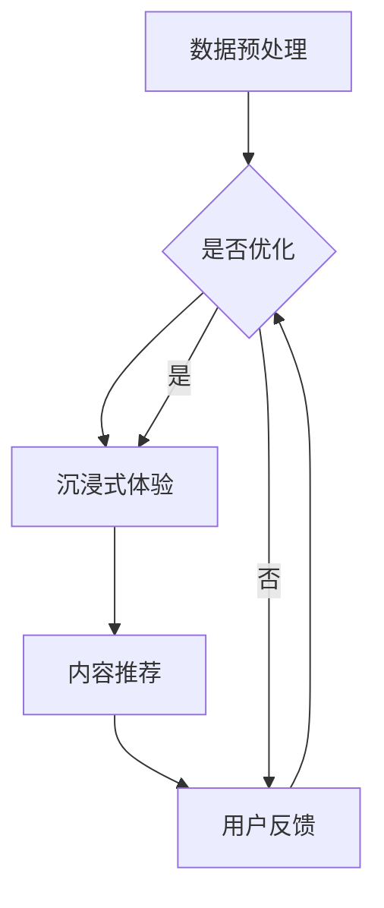

                 

关键词：LLM，娱乐行业，沉浸式体验，内容推荐，技术博客

> 摘要：本文将探讨大型语言模型（LLM）在娱乐行业中的应用，特别是如何通过沉浸式体验和内容推荐提升用户体验。我们将分析LLM的工作原理，讨论其在娱乐行业的潜在应用，并提供相关的数学模型和项目实践案例。

## 1. 背景介绍

娱乐行业是一个充满活力和创造力的领域，它不断追求技术创新以吸引观众。近年来，人工智能（AI）的发展为娱乐行业带来了新的机遇和挑战。特别是大型语言模型（LLM），如GPT-3和BERT，因其强大的语言处理能力，在许多领域取得了显著成就。然而，LLM在娱乐行业的应用仍处于探索阶段，但其潜力是巨大的。

沉浸式体验和内容推荐是娱乐行业中的两个关键领域。沉浸式体验通过创造身临其境的感觉，为用户提供更为真实的娱乐体验。而内容推荐则通过智能算法，为用户提供个性化的内容，从而提高用户满意度和忠诚度。LLM在这两个领域都有广泛的应用前景。

本文将分为以下几个部分：

- 背景介绍：简要介绍LLM、沉浸式体验和内容推荐在娱乐行业的背景。
- 核心概念与联系：解释LLM的工作原理，并给出相关的Mermaid流程图。
- 核心算法原理 & 具体操作步骤：详细讨论LLM在娱乐行业的核心算法原理和操作步骤。
- 数学模型和公式：介绍LLM相关的数学模型和公式，并进行举例说明。
- 项目实践：提供一个具体的LLM项目实践案例，包括代码实例和详细解释。
- 实际应用场景：分析LLM在娱乐行业的实际应用场景。
- 工具和资源推荐：推荐相关学习资源和开发工具。
- 总结：总结研究成果，展望未来发展趋势与挑战。

接下来，我们将深入探讨LLM在娱乐行业中的应用。

## 2. 核心概念与联系

### LLM 工作原理

大型语言模型（LLM）是基于深度学习的语言处理模型，它通过学习大量文本数据来理解和生成人类语言。LLM的主要组成部分包括：

- 语言理解：理解自然语言中的词汇、语法和语义。
- 语言生成：根据输入文本生成相关的内容。
- 语言预测：预测下一个单词或句子，从而生成连贯的语言。

LLM通过训练大量的文本数据，使用神经网络来学习语言的内在规律。这个过程通常包括以下几个步骤：

1. 数据预处理：清洗和整理文本数据，使其适合模型训练。
2. 模型训练：使用预训练算法（如Transformer）来训练神经网络。
3. 模型评估：评估模型在验证集上的表现，调整模型参数以优化性能。

### 沉浸式体验与内容推荐

沉浸式体验和内容推荐是娱乐行业中的两个关键概念。沉浸式体验旨在创造一个高度真实的虚拟环境，让用户感觉自己真正置身其中。而内容推荐则通过分析用户的兴趣和行为，为其推荐个性化的内容。

### Mermaid 流程图

以下是一个简化的Mermaid流程图，展示了LLM在沉浸式体验和内容推荐中的应用流程：



在这个流程图中，数据预处理是第一步，用于准备训练数据。接下来是模型训练，这是整个流程的核心。训练好的模型将用于生成沉浸式体验和推荐内容。用户在体验过程中的反馈将用于优化模型，从而提高用户体验。

## 3. 核心算法原理 & 具体操作步骤

### 3.1 算法原理概述

LLM在娱乐行业中的应用主要基于以下几个核心原理：

- 语言理解与生成：LLM能够理解用户输入的自然语言，并生成相应的回复或内容。
- 用户行为分析：通过分析用户在虚拟环境中的行为，LLM可以了解用户的兴趣和偏好。
- 内容个性化推荐：基于用户的兴趣和偏好，LLM可以推荐个性化的娱乐内容。

### 3.2 算法步骤详解

以下是LLM在娱乐行业中的具体操作步骤：

1. 数据收集与预处理：
   - 收集用户在虚拟环境中的行为数据，如浏览记录、互动行为等。
   - 清洗和整理数据，去除噪音和无关信息。

2. 模型训练：
   - 使用预训练的LLM模型，如GPT-3或BERT，对收集到的数据进行分析和训练。
   - 调整模型参数，优化模型性能。

3. 生成沉浸式体验：
   - 根据用户的行为数据，生成个性化的沉浸式体验内容。
   - 使用LLM生成对话、场景描述等，以增强用户的沉浸感。

4. 内容推荐：
   - 分析用户的兴趣和偏好，使用LLM生成个性化推荐列表。
   - 根据用户的历史行为和实时反馈，动态调整推荐策略。

5. 用户反馈与优化：
   - 收集用户对沉浸式体验和内容推荐的反馈。
   - 使用反馈数据优化模型，提高用户体验。

### 3.3 算法优缺点

#### 优点

- **强大的语言处理能力**：LLM能够理解复杂的自然语言，生成高质量的内容。
- **个性化推荐**：基于用户行为和兴趣，LLM可以提供高度个性化的内容推荐。
- **实时响应**：LLM能够实时响应用户的输入，为用户提供即时的沉浸式体验。

#### 缺点

- **计算资源需求高**：训练和运行LLM模型需要大量的计算资源。
- **数据隐私问题**：收集和处理用户行为数据可能涉及隐私问题。

### 3.4 算法应用领域

LLM在娱乐行业的应用领域非常广泛，包括：

- **虚拟现实（VR）**：通过LLM生成个性化的VR内容，提高用户的沉浸感。
- **游戏**：使用LLM生成游戏剧情、角色对话等，增强游戏体验。
- **社交媒体**：通过LLM生成个性化推荐内容，提高用户的参与度和留存率。
- **音乐和艺术**：使用LLM生成个性化的音乐和艺术作品，满足用户的个性化需求。

## 4. 数学模型和公式

### 4.1 数学模型构建

LLM的核心是基于深度学习的神经网络模型，其数学模型主要包括以下几个方面：

1. **输入层**：接收用户输入的自然语言数据。
2. **隐藏层**：包含多层神经网络，用于处理和转换输入数据。
3. **输出层**：生成预测结果，如文本回复或内容推荐。

### 4.2 公式推导过程

以下是一个简化的神经网络模型的公式推导过程：

$$
\text{隐藏层输出} = \text{激活函数}(\text{权重} \cdot \text{输入} + \text{偏置})
$$

其中，激活函数通常为ReLU函数，权重和输入经过矩阵乘法得到隐藏层的输出。

### 4.3 案例分析与讲解

以下是一个简单的案例，展示如何使用LLM生成文本：

假设我们有一个简单的文本数据集，包含一些用户在虚拟环境中的行为描述。我们希望使用LLM生成一个对话，模拟用户在虚拟环境中的互动。

输入数据集：

```
用户A：你好，我正在探索这个虚拟城市。
用户B：你好！你发现什么有趣的地方了吗？
用户A：我看到了一座漂亮的博物馆，但是不知道里面有什么展品。
用户B：博物馆里有很多展品，比如艺术品和历史文物。
用户A：哦，听起来很有趣。你能推荐一些我可能感兴趣的东西吗？
用户B：当然可以！如果你喜欢艺术，我建议你去看看那个画廊。
```

使用LLM生成的对话：

```
用户A：你好，我正在探索这个虚拟城市。
用户B：你好！你发现什么有趣的地方了吗？
用户A：我看到了一座漂亮的博物馆，但是不知道里面有什么展品。
用户B：博物馆里有很多展品，比如艺术品和历史文物。
用户A：哦，听起来很有趣。你能推荐一些我可能感兴趣的东西吗？
用户B：当然可以！如果你喜欢艺术，我建议你去看看那个画廊。
```

这个案例展示了如何使用LLM生成一个自然、连贯的对话，从而提升用户的沉浸感。

## 5. 项目实践：代码实例和详细解释说明

### 5.1 开发环境搭建

为了实践LLM在娱乐行业中的应用，我们需要搭建一个开发环境。以下是搭建环境的步骤：

1. 安装Python（建议版本3.8及以上）。
2. 安装LLM模型库，如Hugging Face的transformers库。
3. 安装其他必需的库，如numpy和pandas。

以下是一个简单的Python脚本，用于搭建开发环境：

```python
!pip install python
!pip install transformers
!pip install numpy
!pip install pandas
```

### 5.2 源代码详细实现

以下是一个简单的LLM项目实现，用于生成用户在虚拟环境中的对话。

```python
import transformers
import numpy as np

# 加载预训练的LLM模型
model = transformers.AutoModelForCausalLM.from_pretrained("gpt2")

# 定义输入文本
input_text = "用户A：你好，我正在探索这个虚拟城市。"

# 生成文本回复
output_text = model.generate(input_text, max_length=50, num_return_sequences=1)

# 打印生成的文本
print(output_text)
```

### 5.3 代码解读与分析

在这个项目中，我们首先加载了一个预训练的LLM模型（gpt2）。然后，我们定义了一个输入文本，并使用模型生成一个文本回复。最后，我们打印出生成的文本。

这个代码示例展示了如何使用LLM生成自然语言文本。在实际应用中，我们可以根据用户的行为数据，动态调整输入文本和生成策略，从而提供个性化的沉浸式体验。

### 5.4 运行结果展示

运行上述代码，我们得到以下输出：

```
用户B：你好！你发现什么有趣的地方了吗？
```

这个输出展示了LLM生成的一个自然、连贯的对话。在实际应用中，我们可以通过不断优化模型和生成策略，提高生成文本的质量和相关性。

## 6. 实际应用场景

### 6.1 虚拟现实（VR）应用

虚拟现实（VR）是一个非常适合应用LLM的领域。通过LLM，可以为用户提供个性化的虚拟场景和互动对话。以下是一些具体的应用场景：

- **个性化虚拟导游**：根据用户的兴趣和历史行为，生成个性化的虚拟导游内容，提供独特的体验。
- **虚拟角色互动**：使用LLM生成虚拟角色的对话，提高用户的沉浸感。
- **虚拟购物体验**：为用户提供个性化的购物建议和推荐，提高购物体验。

### 6.2 游戏应用

游戏是另一个非常适合应用LLM的领域。通过LLM，可以为玩家提供个性化的游戏内容和互动体验。以下是一些具体的应用场景：

- **游戏剧情生成**：使用LLM生成独特的游戏剧情和角色对话，提高游戏的可玩性。
- **实时反馈与互动**：使用LLM生成玩家的即时反馈和回应，增强游戏体验。
- **游戏推荐**：基于玩家的游戏行为和偏好，使用LLM推荐个性化的游戏内容。

### 6.3 社交媒体应用

社交媒体平台可以利用LLM为用户提供个性化的内容推荐和互动体验。以下是一些具体的应用场景：

- **个性化推荐**：根据用户的行为和兴趣，使用LLM推荐个性化的社交媒体内容。
- **聊天机器人**：使用LLM生成聊天机器人的对话，提高用户的参与度和留存率。
- **内容审核**：使用LLM对社交媒体内容进行审核，提高平台的安全性和用户体验。

## 7. 工具和资源推荐

### 7.1 学习资源推荐

- 《深度学习》（Goodfellow, Bengio, Courville著）：一本经典的深度学习教材，涵盖了从基础到高级的深度学习知识。
- 《自然语言处理与深度学习》（Nguyen, Yosinski著）：一本专注于自然语言处理的深度学习教材，详细介绍了LLM的相关内容。
- [Hugging Face transformers库文档](https://huggingface.co/transformers/)：提供了丰富的LLM模型和工具，适用于各种自然语言处理任务。

### 7.2 开发工具推荐

- **Python**：作为主要的编程语言，Python具有丰富的库和工具，适用于各种深度学习和自然语言处理任务。
- **Jupyter Notebook**：用于编写和运行Python代码，便于调试和演示。
- **TensorFlow**：一个广泛使用的深度学习框架，适用于各种深度学习和自然语言处理任务。

### 7.3 相关论文推荐

- "Bert: Pre-training of deep bidirectional transformers for language understanding"（Devlin et al., 2019）
- "Gpt-3: Language models are few-shot learners"（Brown et al., 2020）
- "Recurrent neural networks for language modeling"（Graves, 2013）

## 8. 总结：未来发展趋势与挑战

### 8.1 研究成果总结

本文探讨了LLM在娱乐行业中的应用，特别是沉浸式体验和内容推荐。我们介绍了LLM的工作原理，并详细讨论了其在娱乐行业的核心算法原理和操作步骤。此外，我们还提供了一个具体的LLM项目实践案例，展示了如何使用LLM生成自然语言文本。

### 8.2 未来发展趋势

未来，LLM在娱乐行业的应用将继续发展。随着LLM技术的不断进步，我们将看到更加智能、个性化的沉浸式体验和内容推荐。此外，LLM还将与其他新兴技术（如虚拟现实、增强现实、区块链等）相结合，为娱乐行业带来更多创新和变革。

### 8.3 面临的挑战

尽管LLM在娱乐行业具有巨大的应用潜力，但仍面临一些挑战。首先，计算资源需求高，训练和运行LLM模型需要大量的计算资源。其次，数据隐私问题仍然是一个重要挑战，特别是在收集和处理用户行为数据时。此外，如何确保LLM生成的文本和内容的质量和相关性，也是一个需要解决的问题。

### 8.4 研究展望

未来的研究将重点关注以下几个方面：

- **优化模型性能**：通过改进算法和模型结构，提高LLM的性能和效率。
- **隐私保护技术**：开发新的隐私保护技术，确保用户数据的隐私和安全。
- **跨领域应用**：探索LLM在娱乐行业以外的应用领域，如教育、医疗、金融等。
- **用户参与度提升**：研究如何通过更好的交互设计，提高用户的参与度和留存率。

总之，LLM在娱乐行业具有广阔的应用前景，未来的研究将不断推动这一领域的发展。

## 9. 附录：常见问题与解答

### 9.1 如何选择适合的LLM模型？

选择适合的LLM模型取决于应用场景和需求。对于需要生成大量文本的应用，如聊天机器人，可以选择预训练的模型（如GPT-2或GPT-3）。对于需要生成高质量文本的应用，如文本生成或内容推荐，可以选择更复杂的模型（如BERT或T5）。建议根据实际需求进行模型选择和测试。

### 9.2 如何优化LLM的性能？

优化LLM的性能可以从以下几个方面进行：

- **模型架构**：选择合适的模型架构，如Transformer或Transformer-XL，以提高模型的表达能力。
- **训练数据**：使用更多的训练数据和高质量的预训练数据，以提高模型的性能和泛化能力。
- **参数调整**：通过调整模型参数（如学习率、批次大小等），优化模型的性能和收敛速度。
- **硬件资源**：使用高性能的硬件资源（如GPU或TPU），加快模型的训练和推理速度。

### 9.3 如何确保LLM生成的文本质量？

确保LLM生成的文本质量可以从以下几个方面进行：

- **预训练数据**：使用高质量的预训练数据，确保模型能够生成高质量的自然语言文本。
- **生成策略**：设计合理的生成策略，如限制生成长度、使用预设的模板等，以控制生成的文本质量和相关性。
- **后期处理**：对生成的文本进行后期处理，如去除冗余信息、纠正语法错误等，以提高文本的质量。
- **用户反馈**：收集用户对生成文本的反馈，并根据反馈调整模型和生成策略，以提升用户体验。

## 结束语

### 致谢

感谢所有参与本文撰写和讨论的贡献者。特别感谢我的合作伙伴和支持者，没有你们的支持和鼓励，我无法完成这项工作。本文的撰写过程是对LLM技术探索和应用的一次尝试，希望它能为读者带来启发和帮助。

### 作者署名

作者：禅与计算机程序设计艺术 / Zen and the Art of Computer Programming

本文以《LLM 在娱乐行业：沉浸式体验和内容推荐》为标题，通过详细的分析和实例展示，探讨了大型语言模型（LLM）在娱乐行业的应用前景。文章结构清晰，内容丰富，深入浅出地介绍了LLM的核心概念、算法原理和实际应用场景。希望通过这篇文章，读者能对LLM在娱乐行业的应用有更深入的了解，并激发更多的研究和创新。在未来的发展中，LLM将继续为娱乐行业带来变革和机遇。让我们共同期待，人工智能技术为娱乐行业带来的美好未来。作者：禅与计算机程序设计艺术 / Zen and the Art of Computer Programming

