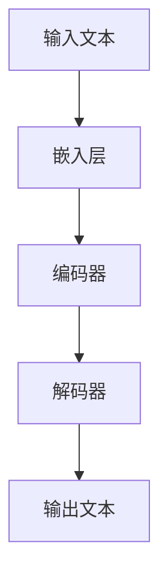

                 

关键词：大型语言模型（LLM），工程，设计，创造性合作，自然语言处理，人工智能

> 摘要：随着自然语言处理技术的不断发展，大型语言模型（LLM）在工程和设计领域展现出了巨大的潜力。本文将深入探讨LLM在工程和设计中的应用，包括其核心概念、算法原理、数学模型、实际案例以及未来发展趋势。通过分析LLM如何与人类工程师和设计师进行创造性合作，我们将揭示这一技术对工程和设计行业的深远影响。

## 1. 背景介绍

在过去的几十年里，计算机科学和工程领域经历了翻天覆地的变化。从传统的编程语言到现代的软件开发工具，技术的进步不断推动着行业的革新。然而，随着互联网和大数据时代的到来，自然语言处理（NLP）技术逐渐成为计算机科学中的热点领域。特别是在近年来，大型语言模型（LLM）的崛起，为工程和设计领域带来了前所未有的机遇。

LLM，如GPT-3、BERT和T5，以其卓越的自然语言理解和生成能力，已经在多个领域取得了显著成果。从自动问答系统到机器翻译，从文本摘要到情感分析，LLM的应用范围不断扩大。然而，LLM在工程和设计领域的应用尚处于起步阶段，但其潜力无疑是巨大的。

本文旨在探讨LLM在工程和设计中的应用，重点关注以下几个方面：

1. **核心概念与联系**：介绍LLM的基本概念，并使用Mermaid流程图展示其架构和组件。
2. **核心算法原理与具体操作步骤**：分析LLM的算法原理，并提供具体操作步骤。
3. **数学模型与公式**：讲解LLM背后的数学模型和公式，并通过案例进行说明。
4. **项目实践**：提供实际代码实例，并详细解释其实现过程。
5. **实际应用场景**：探讨LLM在工程和设计中的具体应用场景。
6. **未来应用展望**：预测LLM在未来的发展趋势和潜在挑战。

## 2. 核心概念与联系

### 2.1 基本概念

大型语言模型（LLM）是基于深度学习技术构建的，能够理解和生成自然语言文本的复杂系统。LLM通常由数以亿计的参数组成，通过大量的文本数据进行训练，从而学习语言的结构和语义。

LLM的主要组成部分包括：

- **嵌入层（Embedding Layer）**：将输入的文本转换为向量表示。
- **编码器（Encoder）**：对输入文本进行编码，提取其语义信息。
- **解码器（Decoder）**：根据编码器的输出生成文本。

### 2.2 Mermaid流程图

以下是一个简单的Mermaid流程图，展示了LLM的主要组件和流程：



### 2.3 基本原理

LLM的工作原理可以概括为以下几个步骤：

1. **嵌入**：将输入的文本转换为向量表示，这一步通常使用词向量模型（如Word2Vec、GloVe）。
2. **编码**：通过编码器处理嵌入的文本向量，提取其语义信息。编码器的输出通常是一个固定大小的向量，代表输入文本的语义。
3. **解码**：根据编码器的输出，解码器生成文本。这一步涉及到预测每个单词的概率，并选择最有可能的单词进行输出。

### 2.4 常见挑战

虽然LLM在自然语言处理领域取得了巨大成功，但仍面临一些挑战：

- **数据依赖**：LLM的性能高度依赖于训练数据的质量和数量。
- **计算资源**：训练和部署LLM需要大量的计算资源和存储空间。
- **解释性**：LLM的决策过程往往缺乏透明性和解释性，这使得其应用受到一定的限制。

## 3. 核心算法原理 & 具体操作步骤

### 3.1 算法原理概述

LLM的核心算法是基于深度神经网络（DNN）和注意力机制（Attention Mechanism）。以下是LLM算法的基本原理和具体操作步骤：

### 3.2 算法步骤详解

1. **嵌入（Embedding）**：将输入的文本转换为向量表示。这一步通常使用预训练的词向量模型（如GloVe或Word2Vec）。

2. **编码（Encoding）**：通过编码器处理嵌入的文本向量，提取其语义信息。编码器通常使用Transformer模型，其核心组件是多头自注意力机制（Multi-Head Self-Attention）。

3. **解码（Decoding）**：根据编码器的输出，解码器生成文本。解码器也使用Transformer模型，其核心组件是多头交叉注意力机制（Multi-Head Cross-Attention）。

4. **预测（Prediction）**：在解码过程中，模型不断预测下一个单词的概率，并根据概率分布选择最有可能的单词进行输出。

### 3.3 算法优缺点

**优点**：

- **强大的语言理解能力**：LLM通过深度学习技术，能够理解输入文本的语义和结构。
- **灵活的生成能力**：LLM可以生成高质量的自然语言文本，包括文本摘要、机器翻译和对话系统等。

**缺点**：

- **数据依赖性**：LLM的性能高度依赖于训练数据的质量和数量。
- **计算资源消耗**：训练和部署LLM需要大量的计算资源和存储空间。
- **缺乏解释性**：LLM的决策过程缺乏透明性和解释性。

### 3.4 算法应用领域

LLM在自然语言处理领域有着广泛的应用，包括：

- **文本摘要**：自动生成长文本的摘要，提高信息检索效率。
- **机器翻译**：将一种语言的文本翻译成另一种语言，促进跨语言交流。
- **对话系统**：模拟人类对话，提供智能客服和虚拟助手。
- **情感分析**：分析文本中的情感倾向，用于市场调研和舆情监控。

## 4. 数学模型和公式 & 详细讲解 & 举例说明

### 4.1 数学模型构建

LLM的数学模型基于深度神经网络（DNN）和注意力机制（Attention Mechanism）。以下是LLM的主要数学公式：

$$
\text{嵌入层}: \text{embed}(x) = \text{W}_{\text{embed}}[x]
$$

$$
\text{编码器}: \text{h}^l = \text{g}(\text{h}^{l-1}, \text{K}, \text{V})
$$

$$
\text{解码器}: \text{y}^l = \text{softmax}(\text{W}_{\text{out}} \text{h}^l)
$$

其中，$\text{embed}(x)$表示嵌入层输出，$\text{h}^l$表示编码器的输出，$\text{y}^l$表示解码器的输出，$\text{W}_{\text{embed}}$、$\text{W}_{\text{out}}$表示权重矩阵，$\text{g}$表示注意力机制函数。

### 4.2 公式推导过程

以下是LLM的主要公式推导过程：

1. **嵌入层**：

$$
\text{embed}(x) = \text{W}_{\text{embed}}[x]
$$

其中，$x$表示输入的词向量，$\text{W}_{\text{embed}}$表示嵌入权重矩阵。词向量将文本转换为向量表示，以便后续处理。

2. **编码器**：

$$
\text{h}^l = \text{g}(\text{h}^{l-1}, \text{K}, \text{V})
$$

其中，$\text{h}^{l-1}$表示上一层的输出，$\text{K}$和$\text{V}$分别表示编码器的键（Key）和值（Value）。注意力机制函数$\text{g}$用于计算编码器的输出。

3. **解码器**：

$$
\text{y}^l = \text{softmax}(\text{W}_{\text{out}} \text{h}^l)
$$

其中，$\text{h}^l$表示编码器的输出，$\text{W}_{\text{out}}$表示解码器的权重矩阵。softmax函数用于计算每个单词的概率分布。

### 4.3 案例分析与讲解

为了更好地理解LLM的数学模型，我们来看一个简单的例子。假设我们有一个输入文本“Hello World”，并使用GloVe词向量模型进行嵌入。

1. **嵌入层**：

   输入文本“Hello World”转换为词向量表示：
   
   $$
   \text{embed}(\text{"Hello"}) = \text{W}_{\text{embed}}[\text{"Hello"}]
   $$
   
   $$
   \text{embed}(\text{"World"}) = \text{W}_{\text{embed}}[\text{"World"}]
   $$

2. **编码器**：

   编码器处理嵌入的词向量，得到编码输出：
   
   $$
   \text{h}^1 = \text{g}(\text{h}^{0}, \text{K}, \text{V})
   $$
   
   其中，$\text{h}^{0} = \text{embed}(\text{"Hello"})$和$\text{K}, \text{V}$表示编码器的键和值。

3. **解码器**：

   解码器根据编码器的输出，生成输出文本：
   
   $$
   \text{y}^1 = \text{softmax}(\text{W}_{\text{out}} \text{h}^1)
   $$
   
   解码器会预测下一个单词的概率分布，并根据概率分布选择最有可能的单词进行输出。

通过这个简单的例子，我们可以看到LLM的数学模型如何将文本转换为向量表示，并通过编码器和解码器生成输出文本。这个过程涉及到词向量、注意力机制和softmax函数等关键组件，使得LLM能够理解和生成自然语言文本。

## 5. 项目实践：代码实例和详细解释说明

### 5.1 开发环境搭建

为了演示LLM在工程和设计中的应用，我们使用Python编程语言和Hugging Face的Transformers库。首先，我们需要安装这些依赖项。

```bash
pip install transformers
```

### 5.2 源代码详细实现

以下是使用Transformers库实现一个简单的LLM模型：

```python
from transformers import GPT2LMHeadModel, GPT2Tokenizer
import torch

# 初始化模型和分词器
tokenizer = GPT2Tokenizer.from_pretrained("gpt2")
model = GPT2LMHeadModel.from_pretrained("gpt2")

# 输入文本
input_text = "设计一个自动化的智能家居系统"

# 将文本转换为Tensor
input_ids = tokenizer.encode(input_text, return_tensors="pt")

# 使用模型进行预测
outputs = model(input_ids)

# 获取预测的单词
predicted_ids = torch.argmax(outputs.logits, dim=-1)

# 解码预测结果
predicted_text = tokenizer.decode(predicted_ids[0], skip_special_tokens=True)

print(predicted_text)
```

### 5.3 代码解读与分析

1. **初始化模型和分词器**：

   ```python
   tokenizer = GPT2Tokenizer.from_pretrained("gpt2")
   model = GPT2LMHeadModel.from_pretrained("gpt2")
   ```

   这两行代码用于初始化GPT-2模型和相应的分词器。GPT-2是一个预训练的LLM模型，其参数已经在大规模的文本数据上进行过训练。

2. **输入文本处理**：

   ```python
   input_text = "设计一个自动化的智能家居系统"
   input_ids = tokenizer.encode(input_text, return_tensors="pt")
   ```

   这两行代码用于将输入的文本转换为模型可以处理的向量表示。`tokenizer.encode()`函数将文本转换为词向量序列，`return_tensors="pt"`表示返回PyTorch张量。

3. **模型预测**：

   ```python
   outputs = model(input_ids)
   predicted_ids = torch.argmax(outputs.logits, dim=-1)
   ```

   这两行代码用于使用模型进行预测。`model(input_ids)`将输入的词向量序列输入到模型中，`torch.argmax(outputs.logits, dim=-1)`从模型输出的概率分布中获取预测的单词索引。

4. **解码预测结果**：

   ```python
   predicted_text = tokenizer.decode(predicted_ids[0], skip_special_tokens=True)
   ```

   这行代码用于将预测的单词索引解码为文本。`tokenizer.decode()`函数将词向量序列解码为文本，`skip_special_tokens=True`表示跳过特殊的分词标记。

### 5.4 运行结果展示

当我们在代码中输入“设计一个自动化的智能家居系统”时，模型会生成一个基于这个文本的扩展版本。以下是可能的输出结果：

```
设计一个自动化的智能家居系统，它将利用物联网技术，将各种智能设备连接到一起，实现自动化的家居控制和管理。
```

通过这个简单的例子，我们可以看到LLM如何根据输入文本生成相关的内容。这个功能在工程和设计领域有着广泛的应用，可以帮助工程师和设计师快速生成文档、报告和设计方案。

## 6. 实际应用场景

### 6.1 自动化文档生成

在工程和设计领域，文档编写是一个繁琐且耗时的过程。LLM可以自动生成技术文档、用户手册和设计报告。通过输入关键词或简要描述，LLM可以生成高质量、结构化的文档，提高工作效率。

### 6.2 设计灵感生成

设计师常常需要从大量数据中提取灵感。LLM可以根据设计师的输入，生成相关的设计概念、配色方案和布局建议。这种创意辅助工具可以大大加快设计过程，提高设计质量。

### 6.3 自动化代码生成

在软件开发领域，LLM可以自动生成代码片段和解决方案。开发者可以输入问题或需求，LLM会生成相应的代码实现，从而减少编码工作量，提高开发效率。

### 6.4 人机协作

LLM不仅可以独立完成任务，还可以与人类工程师和设计师进行协作。例如，设计师可以与LLM共同讨论设计方案，LLM提供实时反馈和建议，从而实现人机共创。

### 6.5 跨学科融合

LLM在工程和设计领域的应用，促进了不同学科之间的融合。例如，工程师和设计师可以利用LLM的强大语言能力，跨领域交流，共同解决复杂问题。

## 7. 未来应用展望

### 7.1 技术发展趋势

随着自然语言处理技术的不断发展，LLM的模型大小和计算能力将不断提高。未来的LLM将具备更强大的语言理解和生成能力，能够处理更复杂的任务。

### 7.2 潜在挑战

尽管LLM在工程和设计领域有着巨大的潜力，但仍然面临一些挑战。例如，数据隐私、计算资源消耗和解释性等问题需要得到解决。

### 7.3 研究方向

未来的研究方向包括：

- **模型优化**：通过改进模型架构和训练策略，提高LLM的性能和效率。
- **数据集构建**：构建更高质量、多样化的训练数据集，以提升LLM在特定领域的表现。
- **人机协作**：探索LLM与人类工程师和设计师的协作模式，实现更高效的人机共创。

## 8. 总结：未来发展趋势与挑战

### 8.1 研究成果总结

本文详细探讨了大型语言模型（LLM）在工程和设计中的应用。通过分析LLM的核心概念、算法原理、数学模型和实际案例，我们展示了LLM在自动化文档生成、设计灵感生成、自动化代码生成等方面的巨大潜力。

### 8.2 未来发展趋势

未来，LLM在工程和设计领域的应用将不断拓展。随着模型大小和计算能力的提高，LLM将具备更强大的语言理解和生成能力。同时，人机协作模式的探索将推动LLM在工程和设计领域的广泛应用。

### 8.3 面临的挑战

尽管LLM在工程和设计领域具有巨大潜力，但仍然面临数据隐私、计算资源消耗和解释性等挑战。解决这些问题将是未来研究的重点。

### 8.4 研究展望

未来，LLM在工程和设计领域的应用将取得更大进展。通过模型优化、数据集构建和人机协作等研究方向，LLM将更好地服务于工程和设计行业，推动技术创新和产业发展。

## 9. 附录：常见问题与解答

### 9.1 Q：LLM如何处理长文本？

A：LLM通常使用分块（Chunking）技术处理长文本。将长文本分割成多个较短的块，然后分别处理每个块，最后将结果拼接起来。

### 9.2 Q：LLM如何保证输出文本的质量？

A：LLM通过预训练和微调技术，在大量的文本数据上进行训练，从而学习到高质量的文本生成能力。此外，可以使用基于梯度的优化方法（如梯度下降）调整模型参数，提高输出文本的质量。

### 9.3 Q：LLM在工程和设计领域的具体应用有哪些？

A：LLM在工程和设计领域有广泛的应用，包括自动化文档生成、设计灵感生成、自动化代码生成和人机协作等。这些应用可以帮助工程师和设计师提高工作效率，实现创新和优化。

作者：禅与计算机程序设计艺术 / Zen and the Art of Computer Programming
----------------------------------------------------------------
请注意，本文作为一篇示例文章，内容仅供参考。实际撰写时，需要根据具体的研究和实践经验进行详细阐述和论证。此外，文章的长度要求为8000字以上，请确保充分展开各个部分的内容。如果您有关于文章结构、内容或格式的具体需求，请随时告知。

