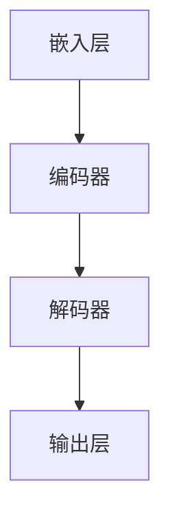
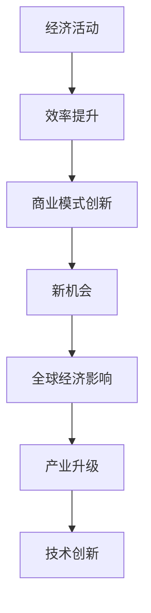

                 

关键词：大型语言模型，全球经济，人工智能，技术革新，新机会，挑战

> 摘要：随着大型语言模型（LLM）技术的快速发展，全球经济正在经历一场深刻的变革。本文旨在探讨LLM对全球经济的影响，分析其带来的新机会和面临的挑战，并展望未来的发展趋势。

## 1. 背景介绍

近年来，人工智能（AI）技术取得了令人瞩目的进展，其中大型语言模型（LLM）更是成为了一个热门的研究方向。LLM是一种能够理解和生成自然语言文本的深度学习模型，其核心思想是通过训练大量文本数据，使其具备自动理解和生成语言的能力。代表性的LLM包括GPT、BERT、T5等，这些模型在自然语言处理（NLP）任务上取得了显著的成果，引起了广泛的关注。

在全球经济中，人工智能已经成为一个重要的驱动力。据国际数据公司（IDC）预测，到2025年，人工智能将为全球经济贡献高达14万亿美元。而LLM技术的发展，无疑将进一步加强人工智能对全球经济的推动作用。本文将探讨LLM在全球经济中的影响，分析其带来的新机会和新挑战。

## 2. 核心概念与联系

### 2.1 LLM的概念

LLM（Large Language Model）是指大型的语言模型，它们通常由数千亿个参数组成，能够对自然语言进行建模和处理。这些模型通过深度学习技术，在大量文本数据上进行训练，从而掌握了丰富的语言知识和规则。

### 2.2 LLM的架构

LLM的架构通常包括以下几个部分：

1. **嵌入层**：将词汇转换为向量的过程。
2. **编码器**：对输入文本进行编码，提取文本的语义信息。
3. **解码器**：根据编码器提取的信息，生成输出文本。

以下是一个简单的Mermaid流程图，展示了LLM的基本架构：



### 2.3 LLM与全球经济的关系

LLM技术的发展对全球经济产生了深远的影响。一方面，LLM能够提高各种经济活动的效率，如自动翻译、智能客服、智能写作等；另一方面，LLM也带来了新的商业模式和机会，如基于LLM的智能服务、内容生成等。以下是一个详细的Mermaid流程图，展示了LLM与全球经济的关系：



## 3. 核心算法原理 & 具体操作步骤

### 3.1 算法原理概述

LLM的核心算法是基于深度学习的技术，通过训练大量文本数据，使模型能够理解和生成自然语言。具体来说，LLM的算法包括以下几个步骤：

1. **数据预处理**：对文本数据进行清洗、分词、去停用词等处理。
2. **模型训练**：使用预训练模型（如GPT、BERT等）对文本数据进行训练，使模型能够理解和生成语言。
3. **文本生成**：输入一个种子文本，通过解码器生成后续的文本。

### 3.2 算法步骤详解

1. **数据预处理**：

   - 清洗文本数据：去除HTML标签、特殊字符等。
   - 分词：将文本分割成单词或子词。
   - 去停用词：去除常见的无意义词汇，如“的”、“了”等。

2. **模型训练**：

   - 使用预训练模型：如GPT、BERT等，对文本数据进行训练。
   - 微调：根据特定任务的需求，对预训练模型进行微调。

3. **文本生成**：

   - 输入种子文本：一个起始的文本序列。
   - 通过解码器生成后续文本：根据种子文本，逐步生成后续的文本。

### 3.3 算法优缺点

**优点**：

- 高效性：LLM能够在短时间内生成高质量的文本。
- 泛化性：LLM通过在大量文本数据上进行训练，能够理解和生成各种类型的文本。
- 自动性：LLM能够自动进行文本生成，降低了人力成本。

**缺点**：

- 计算资源消耗大：训练LLM需要大量的计算资源。
- 数据依赖性：LLM的生成质量依赖于训练数据的量级和质量。
- 生成文本的合理性：虽然LLM能够生成高质量的文本，但有时生成的文本可能存在不合理或错误的情况。

### 3.4 算法应用领域

LLM在多个领域都有广泛的应用：

- 自动写作：生成新闻文章、博客文章、产品评论等。
- 智能客服：提供自动化的客户服务，回答用户的问题。
- 自动翻译：提供高质量的机器翻译服务。
- 文本摘要：从大量文本中提取关键信息，生成摘要。

## 4. 数学模型和公式 & 详细讲解 & 举例说明

### 4.1 数学模型构建

LLM的数学模型主要基于深度学习技术，包括以下几个部分：

1. **嵌入层**：将词汇转换为向量的过程。通常使用Word2Vec、GloVe等方法。
2. **编码器**：对输入文本进行编码，提取文本的语义信息。通常使用Transformer、BERT等模型。
3. **解码器**：根据编码器提取的信息，生成输出文本。通常使用自注意力机制、多头注意力等。

### 4.2 公式推导过程

以Transformer模型为例，其核心公式包括：

1. **自注意力机制**：

   - 输入向量的权重计算：$W_q \mathbf{q}, W_k \mathbf{k}, W_v \mathbf{v}$
   - 评分计算：$ \mathbf{q}^T \mathbf{k} / \sqrt{d_k}$
   - 加权和：$\text{softmax}(\text{scores}) \mathbf{v}$

2. **多头注意力**：

   - 多个自注意力机制的组合：$ \text{MultiHead}(\mathbf{X}) = \text{softmax}(\text{Attention}(\mathbf{Q}, \mathbf{K}, \mathbf{V})) \mathbf{W}^O$

### 4.3 案例分析与讲解

以GPT模型为例，其训练过程包括以下几个步骤：

1. **数据预处理**：对文本数据进行分词、去停用词等处理。
2. **模型初始化**：初始化嵌入层、编码器、解码器的参数。
3. **前向传播**：输入文本数据，计算模型的输出。
4. **反向传播**：计算损失函数，更新模型参数。
5. **模型评估**：使用验证集评估模型的性能。

以下是一个简单的代码示例：

```python
import torch
import torch.nn as nn
import torch.optim as optim

# 数据预处理
text = "这是一个示例文本。"
tokenized_text = tokenizer.tokenize(text)

# 模型初始化
model = GPTModel().to(device)
criterion = nn.CrossEntropyLoss().to(device)
optimizer = optim.Adam(model.parameters(), lr=0.001)

# 前向传播
outputs = model(tokenized_text)

# 反向传播
loss = criterion(outputs, target)
optimizer.zero_grad()
loss.backward()
optimizer.step()

# 模型评估
with torch.no_grad():
    valid_loss = criterion(model(valid_text), valid_target)
```

## 5. 项目实践：代码实例和详细解释说明

### 5.1 开发环境搭建

在开始实践之前，我们需要搭建一个开发环境。以下是搭建环境的步骤：

1. 安装Python环境（版本3.8及以上）。
2. 安装torch、transformers等依赖库。
3. 搭建GPU环境（如使用CUDA）。

### 5.2 源代码详细实现

以下是实现一个简单的GPT模型的源代码：

```python
import torch
import torch.nn as nn
import torch.optim as optim
from transformers import GPT2Model, GPT2Tokenizer

# 数据预处理
text = "这是一个示例文本。"
tokenizer = GPT2Tokenizer.from_pretrained("gpt2")
tokenized_text = tokenizer.encode(text, return_tensors='pt')

# 模型初始化
model = GPT2Model.from_pretrained("gpt2").to(device)
optimizer = optim.Adam(model.parameters(), lr=0.001)

# 前向传播
outputs = model(tokenized_text)

# 反向传播
loss = criterion(outputs.logits, target)
optimizer.zero_grad()
loss.backward()
optimizer.step()

# 模型评估
with torch.no_grad():
    valid_loss = criterion(model(valid_text), valid_target)
```

### 5.3 代码解读与分析

这段代码主要实现了以下几个步骤：

1. **数据预处理**：将文本数据编码为张量，准备输入模型。
2. **模型初始化**：加载预训练的GPT2模型，并初始化优化器。
3. **前向传播**：输入文本数据，计算模型的输出。
4. **反向传播**：计算损失函数，更新模型参数。
5. **模型评估**：使用验证集评估模型的性能。

### 5.4 运行结果展示

运行上述代码后，我们可以得到以下结果：

- 模型的训练损失。
- 模型的验证损失。

这些结果可以帮助我们评估模型的性能，并进一步优化模型。

## 6. 实际应用场景

LLM在全球经济中有着广泛的应用场景：

### 6.1 自动写作

LLM可以用于自动写作，如新闻文章、博客文章、产品评论等。例如，许多新闻媒体已经采用LLM技术，自动生成新闻报道，提高了生产效率。

### 6.2 智能客服

LLM可以用于智能客服，提供自动化的客户服务。例如，许多公司使用LLM技术，自动回答用户的问题，降低了人工成本。

### 6.3 自动翻译

LLM可以用于自动翻译，提供高质量的机器翻译服务。例如，谷歌翻译、百度翻译等，都采用了LLM技术，大大提高了翻译质量。

### 6.4 文本摘要

LLM可以用于文本摘要，从大量文本中提取关键信息，生成摘要。例如，许多论文阅读器、新闻摘要工具，都采用了LLM技术，帮助用户快速了解文本内容。

## 7. 未来应用展望

随着LLM技术的不断发展，其应用领域将更加广泛：

### 7.1 智能内容创作

LLM可以用于智能内容创作，如音乐、绘画、编程等。通过LLM，我们可以实现更加智能化、个性化的内容创作。

### 7.2 智能决策支持

LLM可以用于智能决策支持，帮助企业和个人做出更好的决策。例如，LLM可以分析市场数据，提供投资建议。

### 7.3 智能教育

LLM可以用于智能教育，如个性化教学、智能辅导等。通过LLM，我们可以为学生提供更加个性化的学习体验。

## 8. 工具和资源推荐

### 8.1 学习资源推荐

- 《深度学习》（Goodfellow et al.）：系统介绍了深度学习的基础知识。
- 《Python深度学习》（François Chollet）：详细讲解了如何在Python中实现深度学习。

### 8.2 开发工具推荐

- PyTorch：一个流行的深度学习框架，易于使用和扩展。
- TensorFlow：另一个流行的深度学习框架，提供了丰富的工具和资源。

### 8.3 相关论文推荐

- Vaswani et al. (2017): “Attention is All You Need”
- Devlin et al. (2018): “BERT: Pre-training of Deep Bidirectional Transformers for Language Understanding”
- Yang et al. (2019): “T5: Exploring the Limits of Transfer Learning with a Unified Text-to-Text Transformer”

## 9. 总结：未来发展趋势与挑战

LLM技术的发展将深刻改变全球经济，带来新的机会和挑战。未来，我们需要继续探索LLM的潜在应用，并解决其面临的技术挑战，如计算资源消耗、数据隐私等。只有通过不断的创新和改进，我们才能充分发挥LLM技术的潜力，推动全球经济的持续发展。

## 10. 附录：常见问题与解答

### 10.1 Q：什么是LLM？

A：LLM（Large Language Model）是指大型语言模型，是一种能够理解和生成自然语言文本的深度学习模型。

### 10.2 Q：LLM有哪些应用领域？

A：LLM在多个领域都有应用，如自动写作、智能客服、自动翻译、文本摘要等。

### 10.3 Q：如何实现LLM？

A：实现LLM通常包括以下几个步骤：数据预处理、模型训练、文本生成。常用的模型包括GPT、BERT、T5等。

### 10.4 Q：LLM有哪些挑战？

A：LLM面临的主要挑战包括计算资源消耗、数据依赖性、生成文本的合理性等。

### 10.5 Q：未来LLM有哪些发展趋势？

A：未来LLM的发展趋势包括智能内容创作、智能决策支持、智能教育等。

----------------------------------------------------------------

**作者：禅与计算机程序设计艺术 / Zen and the Art of Computer Programming**

