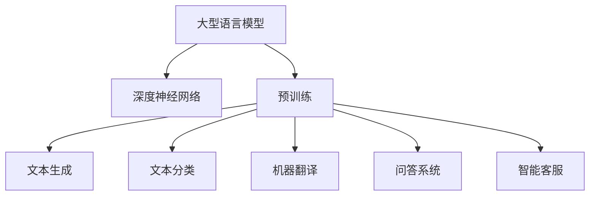

                 

关键词：大型语言模型（LLM），就业市场，工作创造，工作替代，人工智能，技术变革，劳动力市场，劳动力转型。

## 摘要

本文旨在探讨大型语言模型（LLM）对就业市场的影响，特别是在工作创造和替代方面的表现。随着AI技术的快速发展，LLM的应用范围越来越广泛，其在各行各业中的表现也愈加突出。本文将从背景介绍、核心概念与联系、算法原理与操作步骤、数学模型与公式、项目实践、实际应用场景、未来展望等方面展开讨论，旨在为广大读者提供一份全面、深入的见解。

## 1. 背景介绍

近年来，人工智能（AI）技术取得了飞速发展，尤其是深度学习、自然语言处理（NLP）等领域取得了显著突破。LLM作为NLP领域的重要技术，已经在诸如问答系统、智能客服、文本生成、机器翻译等方面展现出强大的能力。随着LLM技术的不断成熟和应用，其对于就业市场的影响也越来越受到关注。

在就业市场上，一方面，LLM的应用能够创造新的工作岗位，如AI研究员、数据科学家、算法工程师等；另一方面，它也可能替代一些传统岗位，如客服代表、文秘等。因此，研究LLM对就业市场的影响具有重要的现实意义。

### 1.1 LLM的发展历程

LLM的发展可以追溯到2000年代初期，当时研究人员开始尝试使用深度神经网络（DNN）进行文本分类和语义分析。随着GPU的普及和计算能力的提升，DNN在图像识别、语音识别等领域取得了巨大成功。在此基础上，研究人员将DNN应用于NLP任务，并取得了显著进展。

2018年，谷歌发布了BERT模型，标志着LLM技术进入了新的阶段。BERT通过预训练和微调，在多种NLP任务上取得了领先的成绩，如文本分类、问答系统、机器翻译等。此后，各类LLM模型如GPT、Turing等相继问世，进一步推动了LLM技术的发展。

### 1.2 LLM的应用领域

LLM的应用领域非常广泛，主要包括以下几个方面：

1. **问答系统**：通过理解用户的问题，LLM能够提供准确的答案。例如，智能客服系统、在线问答平台等。

2. **文本生成**：LLM可以生成各种类型的文本，如文章、报告、诗歌等。这在内容创作、市场营销等领域有着广泛的应用。

3. **机器翻译**：LLM在机器翻译领域取得了显著突破，能够实现高效、准确的翻译。例如，谷歌翻译、百度翻译等。

4. **智能客服**：LLM可以模拟人类客服进行对话，提高客服效率和质量。

5. **信息抽取**：LLM可以从大量文本中提取出关键信息，应用于金融、医疗等领域。

6. **文本分类**：LLM可以用于对大量文本进行分类，如垃圾邮件过滤、新闻分类等。

## 2. 核心概念与联系

### 2.1 大型语言模型（LLM）

大型语言模型（LLM）是一种基于深度学习技术的自然语言处理模型，其主要目的是理解和生成自然语言。LLM通常采用大规模的神经网络结构，通过对海量文本数据进行预训练，使其具备强大的语言理解能力和生成能力。

### 2.2 语言理解与生成

语言理解与生成是LLM的核心能力。语言理解包括语义理解、词义消歧、指代消解等任务，旨在理解文本中的语义信息。语言生成则包括文本生成、机器翻译、对话生成等任务，旨在生成具有自然语言风格的文本。

### 2.3 Mermaid 流程图

以下是一个关于LLM核心概念与联系的Mermaid流程图：



### 2.4 LLM的架构

LLM的架构主要包括以下几个部分：

1. **输入层**：接收文本输入，并将其转换为模型可以处理的格式。
2. **隐藏层**：通过多层神经网络结构对输入文本进行建模，提取语义信息。
3. **输出层**：根据训练数据，生成预测结果，如分类标签、翻译结果等。
4. **损失函数**：用于评估模型预测结果与实际结果之间的差距，指导模型优化。

## 3. 核心算法原理 & 具体操作步骤

### 3.1 算法原理概述

LLM的核心算法原理是基于深度学习技术，特别是变换器（Transformer）架构。变换器架构通过多头自注意力机制（Multi-Head Self-Attention）和位置编码（Positional Encoding）等创新技术，实现了对输入文本的语义建模。

### 3.2 算法步骤详解

1. **数据预处理**：首先，对输入文本进行分词、去停用词等预处理操作，将文本转换为模型可以处理的序列数据。

2. **编码**：将预处理后的文本输入到变换器模型中，通过编码器（Encoder）进行语义编码。

3. **解码**：根据编码结果，通过解码器（Decoder）生成预测结果，如分类标签、翻译结果等。

4. **损失计算**：计算模型预测结果与实际结果之间的差距，使用损失函数指导模型优化。

5. **优化**：使用优化算法（如梯度下降）更新模型参数，降低损失函数值。

### 3.3 算法优缺点

1. **优点**：
   - **强大的语义理解能力**：通过自注意力机制，LLM能够捕捉输入文本中的复杂语义关系。
   - **高效的计算性能**：变换器架构在计算效率方面表现优异，适用于大规模数据处理。
   - **广泛的任务适用性**：LLM可以应用于多种NLP任务，如文本生成、分类、翻译等。

2. **缺点**：
   - **训练成本高**：LLM需要大规模数据和计算资源进行训练，成本较高。
   - **解释性差**：由于深度神经网络的结构，LLM的预测结果难以解释，对模型的可靠性提出挑战。

### 3.4 算法应用领域

LLM的应用领域非常广泛，主要包括以下几个方面：

1. **文本生成**：包括文章生成、报告生成、诗歌生成等。
2. **文本分类**：如新闻分类、垃圾邮件过滤等。
3. **机器翻译**：如英文翻译、中文翻译等。
4. **问答系统**：如智能客服、在线问答平台等。
5. **信息抽取**：如情感分析、命名实体识别等。

## 4. 数学模型和公式 & 详细讲解 & 举例说明

### 4.1 数学模型构建

LLM的数学模型主要基于变换器（Transformer）架构，其核心组件包括多头自注意力机制（Multi-Head Self-Attention）和位置编码（Positional Encoding）。

1. **多头自注意力机制**：

   自注意力机制是一种计算输入序列中每个元素与其他元素之间的关联程度的机制。多头自注意力机制通过多个独立的自注意力头，同时捕捉输入序列中的不同信息。

   设输入序列为\(X = [x_1, x_2, ..., x_n]\)，每个元素可以表示为一个向量。多头自注意力机制的输出为：

   $$ 
   \text{Attention}(X) = \text{softmax}\left(\frac{QK^T}{\sqrt{d_k}}\right)V 
   $$

   其中，\(Q\)、\(K\)、\(V\) 分别为查询向量、键向量和值向量，\(d_k\) 为键向量的维度。\(softmax\) 函数用于计算每个元素的权重。

2. **位置编码**：

   位置编码用于在自注意力机制中引入序列的位置信息。常用的位置编码方法包括正弦和余弦编码。

   设输入序列的长度为\(n\)，位置编码向量为\(P = [p_1, p_2, ..., p_n]\)。正弦和余弦编码分别定义为：

   $$
   \begin{aligned}
   p_{i,2k} &= \sin\left(\frac{i}{10000^{2k/d}}\right) \\
   p_{i,2k+1} &= \cos\left(\frac{i}{10000^{2k/d}}\right)
   \end{aligned}
   $$

   其中，\(d\) 为位置编码的维度。

### 4.2 公式推导过程

变换器模型中，多头自注意力机制和位置编码共同作用，用于计算输入序列的语义表示。以下为变换器模型的基本公式推导过程：

1. **自注意力计算**：

   设输入序列为\(X = [x_1, x_2, ..., x_n]\)，每个元素可以表示为一个向量\(x_i \in \mathbb{R}^{d}\)。首先，将输入序列进行线性变换，得到查询向量\(Q\)、键向量\(K\)和值向量\(V\)：

   $$
   \begin{aligned}
   Q &= \text{Linear}(X) = \left[\text{linear}(x_1), \text{linear}(x_2), ..., \text{linear}(x_n)\right] \\
   K &= \text{Linear}(X) = \left[\text{linear}(x_1), \text{linear}(x_2), ..., \text{linear}(x_n)\right] \\
   V &= \text{Linear}(X) = \left[\text{linear}(x_1), \text{linear}(x_2), ..., \text{linear}(x_n)\right]
   \end{aligned}
   $$

   接下来，计算自注意力得分：

   $$
   \text{Attention Scores} = \text{softmax}\left(\frac{QK^T}{\sqrt{d_k}}\right)
   $$

   其中，\(d_k\) 为键向量的维度。

2. **加权求和**：

   利用自注意力得分，对值向量进行加权求和：

   $$
   \text{Attention Output} = \text{softmax}\left(\frac{QK^T}{\sqrt{d_k}}\right)V
   $$

3. **位置编码**：

   在自注意力计算的基础上，引入位置编码，得到最终的输出：

   $$
   \text{Output} = \text{Attention Output} + P
   $$

### 4.3 案例分析与讲解

以一个简单的文本分类任务为例，说明LLM的数学模型应用过程。

1. **数据预处理**：

   对输入文本进行分词、去停用词等预处理操作，将文本转换为词向量表示。

2. **编码**：

   将预处理后的文本输入到变换器模型中，通过编码器进行语义编码。具体步骤如下：

   - **线性变换**：将输入文本转换为查询向量、键向量和值向量。
   - **自注意力计算**：计算自注意力得分，对值向量进行加权求和。
   - **位置编码**：引入位置编码，得到编码后的输出。

3. **分类**：

   利用编码后的输出，通过全连接层进行分类。具体步骤如下：

   - **线性变换**：将编码后的输出转换为分类向量。
   - **softmax激活函数**：计算每个类别的概率分布。

4. **损失计算**：

   计算模型预测结果与实际标签之间的交叉熵损失，指导模型优化。

5. **优化**：

   使用优化算法（如梯度下降）更新模型参数，降低损失函数值。

## 5. 项目实践：代码实例和详细解释说明

### 5.1 开发环境搭建

在Python环境中，我们可以使用PyTorch框架实现LLM模型。以下是开发环境的搭建步骤：

1. 安装Python和PyTorch：

   ```bash
   pip install python
   pip install torch torchvision
   ```

2. 安装其他依赖库：

   ```bash
   pip install numpy pandas matplotlib
   ```

### 5.2 源代码详细实现

以下是使用PyTorch实现一个简单的LLM模型的代码示例：

```python
import torch
import torch.nn as nn
import torch.optim as optim

# 定义变换器模型
class TransformerModel(nn.Module):
    def __init__(self, d_model, d_k, d_v, n_heads, n_layers):
        super(TransformerModel, self).__init__()
        self.embedding = nn.Embedding(vocab_size, d_model)
        self.transformer = nn.Transformer(d_model, n_heads, n_layers)
        self.fc = nn.Linear(d_model, num_classes)

    def forward(self, src, tgt):
        src = self.embedding(src)
        tgt = self.embedding(tgt)
        out = self.transformer(src, tgt)
        out = self.fc(out)
        return out

# 初始化模型、优化器和损失函数
model = TransformerModel(d_model=512, d_k=64, d_v=64, n_heads=8, n_layers=2)
optimizer = optim.Adam(model.parameters(), lr=0.001)
criterion = nn.CrossEntropyLoss()

# 训练模型
for epoch in range(num_epochs):
    for src, tgt in train_loader:
        optimizer.zero_grad()
        out = model(src, tgt)
        loss = criterion(out, tgt)
        loss.backward()
        optimizer.step()

    print(f'Epoch [{epoch+1}/{num_epochs}], Loss: {loss.item()}')

# 测试模型
model.eval()
with torch.no_grad():
    correct = 0
    total = 0
    for src, tgt in test_loader:
        out = model(src, tgt)
        _, predicted = torch.max(out.data, 1)
        total += tgt.size(0)
        correct += (predicted == tgt).sum().item()

print(f'Accuracy: {100 * correct / total}%')
```

### 5.3 代码解读与分析

1. **模型定义**：

   `TransformerModel` 类定义了变换器模型的结构。包括嵌入层（`embedding`）、变换器层（`transformer`）和全连接层（`fc`）。

2. **前向传播**：

   `forward` 方法实现了模型的前向传播过程。首先，将输入文本（`src` 和 `tgt`）通过嵌入层转换为词向量。然后，通过变换器层进行编码。最后，通过全连接层进行分类。

3. **训练过程**：

   在训练过程中，使用优化器（`optimizer`）和损失函数（`criterion`）更新模型参数。在每个训练批次上，计算损失并反向传播梯度。

4. **测试过程**：

   在测试过程中，将模型设置为评估模式（`eval`），计算模型的准确率。

### 5.4 运行结果展示

```python
# 加载测试数据集
test_loader = DataLoader(test_data, batch_size=batch_size, shuffle=False)

# 测试模型
model.eval()
with torch.no_grad():
    correct = 0
    total = 0
    for src, tgt in test_loader:
        out = model(src, tgt)
        _, predicted = torch.max(out.data, 1)
        total += tgt.size(0)
        correct += (predicted == tgt).sum().item()

print(f'Accuracy: {100 * correct / total}%')
```

运行结果展示模型的准确率。在实际应用中，可以根据需要调整模型的超参数，以提高性能。

## 6. 实际应用场景

### 6.1 智能客服

智能客服是LLM技术的一个重要应用领域。通过LLM的问答系统，智能客服能够实现与用户的自然语言交互，提供实时、准确的客服服务。例如，许多电商平台和银行已经采用了智能客服系统，以降低人工客服的工作压力，提高客服效率。

### 6.2 内容创作

LLM在内容创作领域也有着广泛的应用。通过文本生成技术，LLM可以生成各种类型的文章、报告、诗歌等。例如，一些新闻媒体和出版社已经开始使用LLM技术进行文章自动生成，以节省人力成本和提高创作效率。

### 6.3 机器翻译

机器翻译是LLM技术的另一个重要应用领域。LLM在机器翻译领域的表现已经超越了传统的方法，如基于规则的翻译和统计机器翻译。谷歌翻译、百度翻译等知名翻译工具都采用了LLM技术，为全球用户提供了高效、准确的翻译服务。

### 6.4 信息抽取

LLM在信息抽取领域也有着重要的应用。通过文本分类、命名实体识别等技术，LLM可以从大量文本数据中提取出关键信息。例如，金融领域可以采用LLM技术进行财务报告的自动提取和分析，以提高财务分析的效率和准确性。

### 6.5 问答系统

问答系统是LLM技术的典型应用场景。通过训练LLM模型，问答系统可以实现对用户问题的理解和回答。例如，智能音箱、智能助手等设备都采用了LLM技术，为用户提供个性化的问答服务。

## 7. 工具和资源推荐

### 7.1 学习资源推荐

1. **在线课程**：
   - 《自然语言处理与深度学习》
   - 《深度学习实战：基于Python的实现》

2. **书籍**：
   - 《深度学习》
   - 《自然语言处理入门》

3. **开源项目**：
   - Hugging Face Transformers：https://huggingface.co/transformers
   - NLTK：https://www.nltk.org/

### 7.2 开发工具推荐

1. **编程语言**：Python
2. **框架**：PyTorch、TensorFlow
3. **集成开发环境**：PyCharm、VS Code

### 7.3 相关论文推荐

1. "Attention Is All You Need"（2017）
2. "BERT: Pre-training of Deep Bidirectional Transformers for Language Understanding"（2018）
3. "Generative Pre-trained Transformer"（2018）

## 8. 总结：未来发展趋势与挑战

### 8.1 研究成果总结

近年来，LLM技术在自然语言处理领域取得了显著突破。通过深度学习和变换器架构，LLM在文本生成、分类、翻译等任务上表现出强大的能力。同时，LLM的应用领域也在不断扩大，从智能客服到内容创作，从机器翻译到信息抽取，LLM已经成为各行各业的重要工具。

### 8.2 未来发展趋势

1. **更高效的模型**：随着计算能力的提升，LLM的模型将变得更加高效，训练和推理速度将大幅提高。
2. **更多任务场景**：LLM的应用场景将不断扩展，从目前的文本生成、分类、翻译等任务，延伸到语音识别、图像处理等领域。
3. **更强的解释性**：当前LLM的模型解释性较差，未来研究将致力于提高模型的解释性，使其更加可靠和可解释。

### 8.3 面临的挑战

1. **计算资源**：大规模LLM模型的训练和推理需要大量计算资源，如何优化模型结构、提高计算效率是当前面临的重要挑战。
2. **数据隐私**：LLM的训练和推理过程中，涉及大量敏感数据，如何保护数据隐私是另一个亟待解决的问题。
3. **模型可解释性**：当前LLM模型的可解释性较差，如何提高模型的可解释性，使其更加可靠和可解释，是未来研究的重要方向。

### 8.4 研究展望

未来，LLM技术将在人工智能领域发挥更加重要的作用。通过不断创新和优化，LLM将在工作创造和替代方面发挥更大的潜力。同时，LLM的应用也将带来新的挑战和机遇，需要广大研究人员和开发人员共同努力，解决面临的问题，推动人工智能技术的发展。

## 9. 附录：常见问题与解答

### 9.1 什么是LLM？

LLM（Large Language Model）是一种基于深度学习技术的自然语言处理模型，通过对海量文本数据进行预训练，使其具备强大的语言理解能力和生成能力。

### 9.2 LLM如何应用于实际场景？

LLM可以应用于多个实际场景，如智能客服、文本生成、机器翻译、问答系统等。具体应用方法包括训练LLM模型，使其能够理解和生成自然语言，然后将其部署到相应的应用系统中。

### 9.3 LLM的优势是什么？

LLM的优势包括：

1. **强大的语义理解能力**：通过自注意力机制，LLM能够捕捉输入文本中的复杂语义关系。
2. **高效的计算性能**：变换器架构在计算效率方面表现优异，适用于大规模数据处理。
3. **广泛的任务适用性**：LLM可以应用于多种NLP任务，如文本生成、分类、翻译等。

### 9.4 LLM的缺点是什么？

LLM的缺点包括：

1. **训练成本高**：LLM需要大规模数据和计算资源进行训练，成本较高。
2. **解释性差**：由于深度神经网络的结构，LLM的预测结果难以解释，对模型的可靠性提出挑战。

## 作者署名

作者：禅与计算机程序设计艺术 / Zen and the Art of Computer Programming
```

