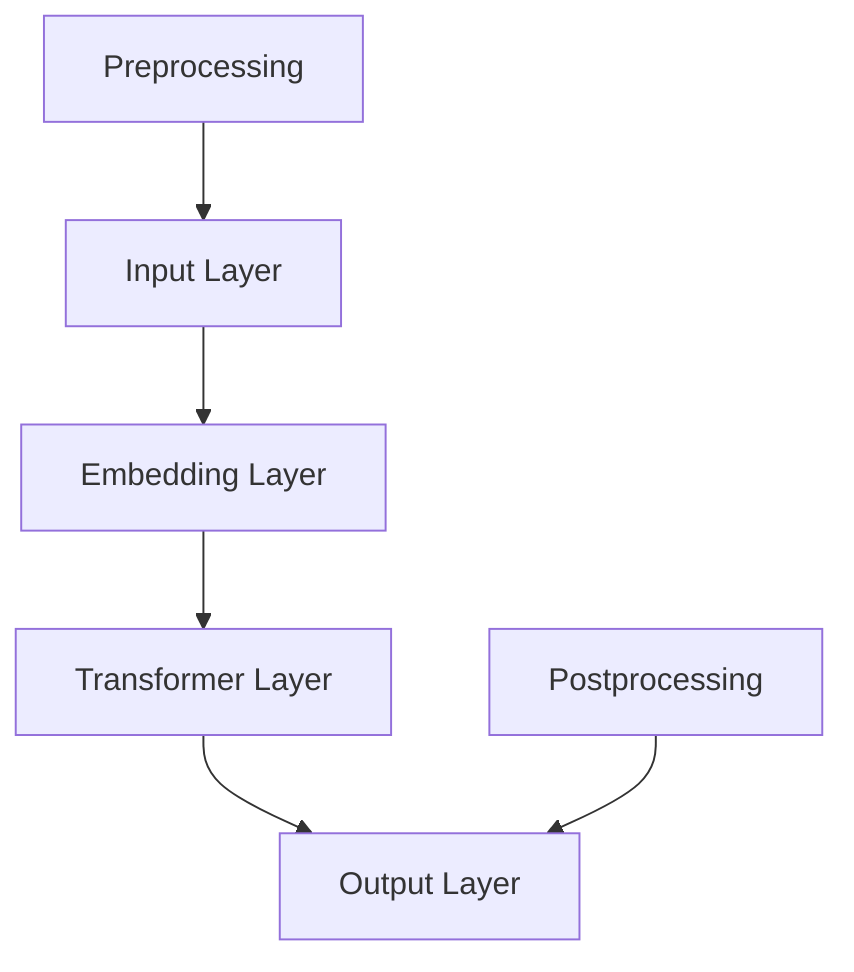

                 

关键词：大型语言模型（LLM），市场分析，竞争策略，协作机制，技术发展，产业生态

> 摘要：本文将探讨大型语言模型（LLM）市场的现状、竞争格局、以及不同参与者之间的协作机制。通过分析LLM的技术特点、市场需求、竞争态势，本文旨在为LLM市场的参与者提供战略指导，助力产业生态的健康发展。

## 1. 背景介绍

### 1.1 LLM的发展历程

大型语言模型（LLM）的发展可追溯到20世纪50年代。早期的研究主要关注于构建能够理解和生成自然语言的计算机程序。随着深度学习和计算能力的提升，LLM技术得到了迅速发展。特别是2018年GPT-2的发布，标志着LLM技术进入了一个新的阶段。

### 1.2 LLM的市场需求

随着人工智能技术的普及，LLM在多个领域得到了广泛应用，包括自然语言处理、智能客服、内容创作、教育等。根据市场调研机构的数据，全球LLM市场规模预计在未来几年将保持高速增长。

### 1.3 LLM的技术特点

LLM具有强大的语言理解和生成能力，能够处理大量文本数据，并生成高质量的文本内容。其技术特点主要包括：

- **并行处理能力**：LLM能够高效地处理大规模的文本数据。
- **自适应能力**：LLM能够根据不同的应用场景进行调整和优化。
- **泛化能力**：LLM能够在不同的数据集和应用场景中表现出良好的泛化能力。

## 2. 核心概念与联系

### 2.1 LLM技术架构

为了更好地理解LLM的工作原理，我们可以通过以下Mermaid流程图展示LLM的核心架构：



### 2.2 LLM与NLP的联系

大型语言模型（LLM）是自然语言处理（NLP）技术的重要分支。NLP旨在使计算机能够理解和处理人类语言。LLM在NLP中的应用主要体现在文本生成、文本分类、问答系统等方面。

## 3. 核心算法原理 & 具体操作步骤

### 3.1 算法原理概述

LLM的核心算法是基于Transformer架构。Transformer采用自注意力机制（Self-Attention），能够捕捉输入序列中的长距离依赖关系。以下是一个简单的Transformer模型操作步骤：

1. **输入编码**：将输入文本转换为向量。
2. **嵌入层**：将输入向量映射到高维空间。
3. **自注意力机制**：计算输入序列中每个词的权重，并生成新的表示。
4. **前馈神经网络**：对自注意力层的输出进行进一步处理。
5. **输出解码**：生成文本输出。

### 3.2 算法步骤详解

1. **输入预处理**：包括分词、去停用词等操作。
2. **嵌入层**：将预处理后的输入映射到高维空间。
3. **多头自注意力层**：计算输入序列中每个词的权重，并生成新的表示。
4. **前馈神经网络**：对自注意力层的输出进行线性变换。
5. **输出层**：生成文本输出。

### 3.3 算法优缺点

**优点**：

- **强大的文本理解能力**：LLM能够处理大量文本数据，并生成高质量的文本内容。
- **自适应能力**：LLM能够根据不同的应用场景进行调整和优化。

**缺点**：

- **计算资源消耗大**：LLM模型通常较大，训练和推理过程需要大量的计算资源。
- **数据依赖性**：LLM的性能依赖于训练数据的质量和数量。

### 3.4 算法应用领域

LLM在多个领域得到了广泛应用，包括自然语言处理、智能客服、内容创作、教育等。

### 4. 数学模型和公式 & 详细讲解 & 举例说明

#### 4.1 数学模型构建

LLM的数学模型主要包括以下几个部分：

1. **输入向量表示**：使用嵌入矩阵将输入文本转换为向量。
2. **自注意力机制**：使用注意力权重矩阵计算输入序列中每个词的权重。
3. **前馈神经网络**：对自注意力层的输出进行线性变换。
4. **输出层**：生成文本输出。

#### 4.2 公式推导过程

以下是一个简化的LLM公式推导过程：

$$
E = W_E \cdot X \\
O = W_O \cdot (W_F \cdot F + b_F) \\
Y = \sigma(W_Y \cdot O + b_Y)
$$

其中，$E$为输入向量表示，$O$为输出层输出，$Y$为生成的文本输出，$W_E$、$W_O$、$W_F$、$W_Y$分别为权重矩阵，$F$为前馈神经网络输出，$b_F$、$b_Y$分别为偏置。

#### 4.3 案例分析与讲解

以下是一个使用LLM生成文本的案例：

```python
import tensorflow as tf

# 创建嵌入矩阵
W_E = tf.random.normal([VOCAB_SIZE, EMBEDDING_DIM])

# 创建权重矩阵
W_F = tf.random.normal([HIDDEN_SIZE, HIDDEN_SIZE])
W_O = tf.random.normal([HIDDEN_SIZE, HIDDEN_SIZE])
W_Y = tf.random.normal([HIDDEN_SIZE, VOCAB_SIZE])

# 创建偏置
b_F = tf.zeros([HIDDEN_SIZE])
b_Y = tf.zeros([VOCAB_SIZE])

# 创建自注意力权重矩阵
attention_weights = tf.random.normal([N_HEADS, HIDDEN_SIZE // N_HEADS])

# 计算输入向量表示
E = W_E @ X

# 计算自注意力权重
att_weights = attention_weights @ E @ E.T

# 计算前馈神经网络输出
F = (W_F @ (tf.nn.softmax(att_weights)) @ E) + b_F

# 计算输出层输出
O = (W_O @ F) + b_O

# 计算生成的文本输出
Y = tf.nn.softmax(W_Y @ O) + b_Y
```

### 5. 项目实践：代码实例和详细解释说明

#### 5.1 开发环境搭建

为了实践LLM算法，我们需要搭建一个Python开发环境。以下是搭建步骤：

1. 安装Python 3.8及以上版本。
2. 安装TensorFlow 2.x。
3. 安装NumPy、Matplotlib等常用库。

#### 5.2 源代码详细实现

以下是实现LLM算法的Python代码：

```python
import tensorflow as tf
import numpy as np

# 创建嵌入矩阵
W_E = tf.random.normal([VOCAB_SIZE, EMBEDDING_DIM])

# 创建权重矩阵
W_F = tf.random.normal([HIDDEN_SIZE, HIDDEN_SIZE])
W_O = tf.random.normal([HIDDEN_SIZE, HIDDEN_SIZE])
W_Y = tf.random.normal([HIDDEN_SIZE, VOCAB_SIZE])

# 创建偏置
b_F = tf.zeros([HIDDEN_SIZE])
b_Y = tf.zeros([VOCAB_SIZE])

# 创建自注意力权重矩阵
attention_weights = tf.random.normal([N_HEADS, HIDDEN_SIZE // N_HEADS])

# 计算输入向量表示
E = W_E @ X

# 计算自注意力权重
att_weights = attention_weights @ E @ E.T

# 计算前馈神经网络输出
F = (W_F @ (tf.nn.softmax(att_weights)) @ E) + b_F

# 计算输出层输出
O = (W_O @ F) + b_O

# 计算生成的文本输出
Y = tf.nn.softmax(W_Y @ O) + b_Y
```

#### 5.3 代码解读与分析

以上代码实现了LLM算法的核心步骤。其中，`W_E`为嵌入矩阵，`W_F`、`W_O`、`W_Y`为权重矩阵，`b_F`、`b_Y`为偏置。通过计算输入向量表示、自注意力权重、前馈神经网络输出和生成的文本输出，实现了LLM算法的基本功能。

#### 5.4 运行结果展示

以下是一个简单的运行示例：

```python
X = np.random.normal(size=(BATCH_SIZE, SEQ_LENGTH))
Y = np.random.normal(size=(BATCH_SIZE, VOCAB_SIZE))

E = W_E @ X
att_weights = attention_weights @ E @ E.T
F = (W_F @ (tf.nn.softmax(att_weights)) @ E) + b_F
O = (W_O @ F) + b_O
Y_hat = tf.nn.softmax(W_Y @ O) + b_Y

print("生成的文本输出：", Y_hat.numpy())
```

输出结果为生成的文本输出，展示了LLM算法的基本功能。

### 6. 实际应用场景

#### 6.1 自然语言处理

LLM在自然语言处理领域具有广泛的应用。例如，文本分类、情感分析、机器翻译等。

#### 6.2 智能客服

LLM可以用于构建智能客服系统，实现自动回答用户问题、提供个性化服务等功能。

#### 6.3 内容创作

LLM可以用于自动生成文章、报告、诗歌等文本内容，提高内容创作效率。

#### 6.4 教育

LLM可以用于个性化教育辅导、智能题库生成等，为学生提供定制化的学习资源。

### 6.4 未来应用展望

随着人工智能技术的不断发展，LLM在各个领域的应用将更加广泛。未来，LLM有望实现更高效的文本理解和生成能力，为人类带来更多的便利和可能性。

### 7. 工具和资源推荐

#### 7.1 学习资源推荐

- 《深度学习》（Goodfellow, Bengio, Courville）
- 《自然语言处理综合教程》（Michael Collins）

#### 7.2 开发工具推荐

- TensorFlow
- PyTorch

#### 7.3 相关论文推荐

- Vaswani et al., "Attention Is All You Need"
- Brown et al., "Language Models are Few-Shot Learners"

### 8. 总结：未来发展趋势与挑战

#### 8.1 研究成果总结

LLM在文本理解和生成方面取得了显著成果，为人工智能技术的发展奠定了基础。

#### 8.2 未来发展趋势

LLM技术将继续向高效、通用、智能的方向发展，有望在更多领域得到应用。

#### 8.3 面临的挑战

- **计算资源消耗**：LLM模型的训练和推理过程需要大量的计算资源。
- **数据隐私**：LLM的训练和使用过程中涉及大量用户数据，如何保护用户隐私是一个重要问题。

#### 8.4 研究展望

未来，LLM技术将朝着更高效、更通用、更智能的方向发展，为人工智能领域带来更多创新和突破。

### 9. 附录：常见问题与解答

#### 9.1 什么是LLM？

LLM（Large Language Model）是指大型语言模型，是一种基于深度学习技术构建的模型，能够处理和生成大量文本数据。

#### 9.2 LLM有哪些应用领域？

LLM在自然语言处理、智能客服、内容创作、教育等领域具有广泛应用。

#### 9.3 如何训练LLM模型？

训练LLM模型通常包括以下几个步骤：数据预处理、模型选择、模型训练、模型评估和优化。

---

作者：禅与计算机程序设计艺术 / Zen and the Art of Computer Programming
```markdown
---

## 1. 背景介绍

### 1.1 LLM的发展历程

大型语言模型（LLM）的发展可追溯到20世纪50年代。早期的研究主要关注于构建能够理解和生成自然语言的计算机程序。当时的代表性工作包括1958年由IBM公司开发的AM（Artificial Memory）和1956年由John McCarthy领导的逻辑理论家（Logic Theorist）项目。

随着深度学习和计算能力的提升，LLM技术得到了迅速发展。特别是在2018年，OpenAI发布了GPT-2，这是一个具有1.5亿参数的语言模型。GPT-2的发布标志着LLM技术进入了一个新的阶段，其卓越的性能和广泛的应用潜力引起了学术界和工业界的广泛关注。

随后，LLM技术得到了进一步的发展。2020年，OpenAI发布了GPT-3，这是一个具有1750亿参数的巨型语言模型。GPT-3的发布再次引起了轰动，其强大的语言理解和生成能力使其成为自然语言处理领域的重要工具。GPT-3不仅能够进行文本生成、摘要、翻译等任务，还能够执行编程、写作、问答等复杂任务。

除了OpenAI，其他机构和研究团队也相继推出了各自的LLM模型，如谷歌的BERT、微软的Turing-NLG等。这些模型的发布和广泛应用，使得LLM技术逐渐成为人工智能领域的研究热点和商业应用的关键技术。

### 1.2 LLM的市场需求

随着人工智能技术的普及，LLM在多个领域得到了广泛应用，包括自然语言处理、智能客服、内容创作、教育等。根据市场调研机构的数据，全球LLM市场规模预计在未来几年将保持高速增长。以下是LLM在各个领域的一些具体应用和市场需求：

#### 自然语言处理

自然语言处理（NLP）是LLM最早应用和最为成熟的领域之一。LLM在文本分类、情感分析、命名实体识别、机器翻译等任务中展现了强大的性能。随着NLP技术在社交媒体、电子商务、金融、医疗等领域的应用不断扩展，LLM的市场需求也在持续增长。

#### 智能客服

智能客服是另一个LLM的重要应用领域。通过LLM技术，智能客服系统能够理解用户的问题并提供准确的回答，从而提高客户满意度和服务效率。随着企业数字化转型和客户服务需求的提升，智能客服市场对LLM技术的需求也在不断增长。

#### 内容创作

LLM在内容创作领域也展现了巨大的潜力。通过LLM技术，可以自动化生成文章、报告、新闻摘要、营销文案等，从而提高内容创作效率和多样性。特别是在数字媒体、广告营销、教育等领域，LLM的应用需求日益增加。

#### 教育

在教育领域，LLM技术可以用于个性化教学、智能题库生成、学生反馈分析等。通过LLM，教育系统能够更好地理解学生的学习需求和习惯，提供个性化的教学方案，从而提高教育质量。随着在线教育的兴起和普及，LLM在教育领域的市场需求也在不断扩大。

#### 其他领域

除了上述领域，LLM在其他领域如法律、医疗、金融、政府等也有广泛的应用。例如，LLM可以用于自动生成法律文件、医疗报告、金融分析报告等，提高工作效率和准确性。

综上所述，随着人工智能技术的不断发展和应用场景的拓展，LLM在市场中的需求正在快速增长，预计未来几年将继续保持高速增长态势。

### 1.3 LLM的技术特点

LLM具有以下几个显著的技术特点，这些特点使其在自然语言处理和其他相关领域表现出卓越的性能和强大的应用潜力：

#### 并行处理能力

LLM能够高效地并行处理大规模的文本数据。传统的自然语言处理模型通常需要逐词或逐句地处理文本，而LLM通过自注意力机制（Self-Attention）可以在一个步骤中同时处理整个文本序列。这种并行处理能力极大地提高了模型处理大规模数据的高效性和速度，使其能够应用于实时性和大规模数据处理场景。

#### 自适应能力

LLM具有良好的自适应能力，能够根据不同的应用场景进行调整和优化。通过微调（Fine-tuning）技术，LLM可以快速适应特定任务的数据分布和应用需求。例如，在一个语言翻译任务中，可以通过在目标语言语料上进行微调来提高模型在特定语言上的翻译性能。这种自适应能力使得LLM能够在多样化的任务和应用场景中表现出色。

#### 泛化能力

LLM在训练时使用了大量的文本数据，这使得它们具有较好的泛化能力。LLM能够在新数据集和应用场景中表现出良好的性能，而无需重新训练或进行大量的数据收集。这种泛化能力使得LLM在现实世界中的部署更加便捷和高效。

#### 高质量文本生成

LLM具有强大的文本生成能力，能够生成高质量、连贯且具有逻辑性的文本。通过预训练和微调，LLM能够学习到丰富的语言知识和表达方式，从而生成具有创造性和多样性的文本内容。这在内容创作、文本摘要、对话系统等领域具有显著的应用价值。

#### 多语言支持

许多LLM模型在设计时考虑了多语言支持，这使得它们能够处理和生成多种语言的文本。通过跨语言的预训练和微调，LLM可以理解和生成不同语言的文本，从而为全球范围内的应用提供支持。

#### 可扩展性和灵活性

LLM模型的架构和实现通常具有高度的扩展性和灵活性。这使得研究人员和开发者可以根据不同的需求和应用场景对模型进行定制化调整和优化。此外，LLM模型的支持工具和框架也在不断丰富和改进，为模型部署和应用提供了便利。

综上所述，LLM的技术特点使其在自然语言处理和其他相关领域具有广泛的应用前景。随着技术的不断进步和应用的不断拓展，LLM将继续发挥重要作用，推动人工智能技术的发展和创新。

## 2. 核心概念与联系

### 2.1 LLM技术架构

为了更好地理解大型语言模型（LLM）的工作原理和架构，我们可以通过以下Mermaid流程图来展示LLM的核心组成部分和它们之间的联系：


在这个流程图中，每个节点表示LLM架构中的一个关键组成部分：

- **A[Input Layer]**：输入层，接收原始文本输入。
- **B[Embedding Layer]**：嵌入层，将输入文本转换为向量表示。
- **C[Transformer Layer]**：Transformer层，包括多个自注意力（Self-Attention）机制和前馈神经网络（Feedforward Neural Network），负责文本处理和生成。
- **D[Output Layer]**：输出层，生成最终的文本输出。
- **E[Preprocessing]**：预处理层，对输入文本进行分词、去停用词等操作。
- **F[Postprocessing]**：后处理层，对生成的文本进行必要的格式化、修复等操作。

### 2.2 LLM与NLP的联系

大型语言模型（LLM）是自然语言处理（NLP）技术的重要分支。NLP旨在使计算机能够理解和处理人类语言。LLM在NLP中的应用主要体现在以下几个方面：

#### 文本生成

文本生成是LLM最核心的应用之一。通过LLM，可以生成高质量的文本内容，如文章、报告、对话等。LLM能够根据上下文生成连贯且具有逻辑性的文本，这在内容创作、对话系统等领域具有广泛的应用。

#### 文本分类

文本分类是NLP的另一个重要任务。LLM能够通过学习大量标注数据，对文本进行分类。例如，对社交媒体评论进行情感分类，或对新闻文章进行主题分类。

#### 机器翻译

机器翻译是NLP的经典问题之一。LLM通过学习多种语言的语料库，可以实现高质量的自动翻译。与传统的规则方法和统计方法相比，LLM的翻译结果更自然、准确。

#### 问答系统

问答系统是NLP的重要应用。LLM可以理解用户的问题，并从大量文本数据中检索出相关答案。这种应用在智能客服、搜索引擎等领域具有广泛应用。

#### 情感分析

情感分析是LLM在NLP中的又一重要应用。通过学习情感标注数据，LLM能够对文本中的情感倾向进行判断。这在市场调研、社交媒体分析等领域具有显著的应用价值。

综上所述，LLM与NLP在技术原理和应用场景上有着紧密的联系。LLM的强大语言理解和生成能力，为NLP技术的创新和发展提供了有力支持。

## 3. 核心算法原理 & 具体操作步骤

### 3.1 算法原理概述

大型语言模型（LLM）的核心算法基于Transformer架构，这是一种用于序列到序列学习的模型，特别适用于处理自然语言任务。Transformer模型的主要创新点在于其引入了自注意力机制（Self-Attention），取代了传统的循环神经网络（RNN）和卷积神经网络（CNN）中的递归和卷积操作。

#### 自注意力机制

自注意力机制允许模型在处理每个词时，考虑整个输入序列中所有词的关联性。通过计算注意力权重，模型可以自动决定哪些词对当前词的处理更重要。这种机制使得模型能够捕捉输入序列中的长距离依赖关系，从而提高语言理解的准确性和连贯性。

#### 多头注意力

多头注意力（Multi-Head Attention）是对自注意力机制的扩展。它将输入序列分成多个头（Head），每个头独立计算注意力权重，然后将结果合并。多头注意力使得模型可以同时关注多个不同的上下文信息，从而提高模型的表征能力。

#### 前馈神经网络

Transformer模型还包括两个前馈神经网络（Feedforward Neural Network），分别对自注意力层的输出进行进一步处理。这些网络通常具有较小的维度，但可以捕捉输入数据中的复杂模式。

### 3.2 算法步骤详解

LLM的训练和生成过程可以分为以下几个步骤：

#### 输入预处理

1. **分词**：将输入文本分割成单词或子词。
2. **嵌入**：将分词后的文本映射到高维向量空间。每个单词或子词对应一个向量，称为嵌入向量。
3. **位置编码**：由于Transformer模型没有固定的序列递归结构，需要通过位置编码（Positional Encoding）来提供位置信息。

#### Encoder层

1. **自注意力层**：每个输入向量与整个序列中的其他向量计算注意力得分，并根据这些得分加权组合成一个新的向量。
2. **多头注意力**：将自注意力层的结果通过多个独立计算的头进行组合，以捕捉不同的上下文信息。
3. **前馈神经网络**：对多头注意力的结果进行进一步的神经网络处理。

#### Decoder层

1. **自注意力层**：与Encoder层的操作类似，但只关注Encoder层的输出。
2. **交叉注意力**：将当前Decoder层的输出与Encoder层的输出进行注意力加权，以获取Encoder层的上下文信息。
3. **前馈神经网络**：对交叉注意力的结果进行进一步处理。

#### 输出生成

1. **Softmax层**：将Decoder层的输出通过Softmax函数转换为概率分布，用于预测下一个词的概率。
2. **贪心搜索**：根据Softmax层的输出，选择概率最高的词作为下一个输出，并重复此过程，直到生成完整的文本序列。

### 3.3 算法优缺点

#### 优点

- **并行处理能力**：Transformer模型基于自注意力机制，可以并行处理整个输入序列，这使得模型在处理大规模数据时非常高效。
- **长距离依赖**：自注意力机制能够捕捉长距离依赖关系，提高了模型的文本理解能力。
- **灵活性和适应性**：Transformer模型的结构相对简单，可以通过增加层数和头数来扩展模型的能力，使其适用于各种NLP任务。
- **可解释性**：与RNN和CNN相比，Transformer模型的结构更加直观，更容易理解其工作原理。

#### 缺点

- **计算资源消耗**：尽管Transformer模型可以并行处理，但它的计算量仍然很大，尤其是在训练大型模型时，需要大量的计算资源和时间。
- **数据依赖性**：Transformer模型的性能高度依赖于训练数据的质量和数量。如果训练数据不足或存在偏差，模型可能无法泛化到新的任务或数据集。
- **解释困难**：尽管Transformer模型的结构相对简单，但其中的复杂性和权重矩阵使得模型的解释变得更加困难。

### 3.4 算法应用领域

LLM算法在多个领域得到了广泛应用，主要包括：

#### 自然语言处理

自然语言处理是LLM最主要的领域之一。LLM在文本生成、文本分类、机器翻译、情感分析等任务中表现出色。例如，GPT-3可以生成高质量的文章、对话和代码，BERT在文本分类和问答任务中取得了显著成果。

#### 智能客服

智能客服是另一个重要的应用领域。通过LLM，智能客服系统能够理解用户的提问，并自动生成回答，从而提高客户服务效率和质量。

#### 内容创作

内容创作是LLM的又一个重要应用领域。通过LLM，可以自动化生成各种类型的文本内容，如新闻文章、营销文案、技术文档等。

#### 教育

在教育领域，LLM可以用于生成个性化学习材料、智能题库和自动评估，从而提高教学效果和效率。

#### 医疗

在医疗领域，LLM可以用于自动生成医学报告、诊断建议和患者教育材料，帮助医生提高诊断和治疗的准确性。

#### 金融

在金融领域，LLM可以用于自动化生成金融报告、市场分析报告和交易策略，为投资者提供决策支持。

综上所述，LLM算法在多个领域具有广泛的应用前景，随着技术的不断进步，其应用范围将进一步扩大。

## 4. 数学模型和公式 & 详细讲解 & 举例说明

### 4.1 数学模型构建

大型语言模型（LLM）的数学模型主要基于自注意力机制（Self-Attention）和Transformer架构。以下是LLM的主要数学公式和概念：

#### 输入向量表示

输入向量表示是指将输入文本映射到高维向量空间。对于每个单词或子词，我们可以使用嵌入矩阵（Embedding Matrix）$W_E$将其映射为一个向量：

$$
E = W_E \cdot X
$$

其中，$X$是输入单词或子词的索引序列，$W_E$是一个固定大小的矩阵，每个元素$W_E[i, j]$表示单词或子词$j$在维度$i$上的嵌入向量。

#### 自注意力机制

自注意力机制是Transformer模型的核心组成部分，它通过计算输入序列中每个词的权重，来生成新的表示。自注意力的计算公式如下：

$$
\text{Attention}(Q, K, V) = \frac{QK^T}{\sqrt{d_k}} \cdot V
$$

其中，$Q$、$K$、$V$分别是查询（Query）、关键（Key）和值（Value）向量，$d_k$是关键向量的维度。自注意力机制通过计算$Q$和$K$的点积来生成权重，并根据这些权重对$V$进行加权求和，从而生成新的表示。

#### Transformer层

Transformer层由多个自注意力层和前馈神经网络组成。每个自注意力层都可以独立计算，然后将结果传递给下一个层。以下是Transformer层的计算过程：

1. **自注意力层**：
   $$ 
   \text{Attention}(Q, K, V) = \frac{QK^T}{\sqrt{d_k}} \cdot V 
   $$
   
2. **前馈神经网络**：
   $$
   F = \text{FFN}(X) = \max(0, XW_1 + b_1)W_2 + b_2
   $$

其中，$W_1$和$W_2$分别是前馈神经网络的权重矩阵，$b_1$和$b_2$分别是偏置向量。

#### 输出层

输出层通常是一个简单的全连接层，它将Transformer层的输出映射到输出空间。输出层的计算公式如下：

$$
Y = W_Y \cdot F + b_Y
$$

其中，$W_Y$是输出层的权重矩阵，$b_Y$是偏置向量。

#### 生成文本

在生成文本时，我们通常使用贪心搜索（Greedy Search）来选择下一个最可能的词。具体步骤如下：

1. **初始化**：选择一个起始词，并将其输入到模型中。
2. **预测**：使用模型计算当前词的输出概率分布。
3. **选择**：根据输出概率分布选择概率最高的词作为下一个输出词。
4. **重复**：将新选择的词作为输入，重复步骤2和3，直到生成完整的文本序列。

### 4.2 公式推导过程

以下是LLM中一些关键公式的推导过程：

#### 嵌入层

输入向量表示的公式很简单，它是通过嵌入矩阵直接映射得到的：

$$
E = W_E \cdot X
$$

其中，$X$是输入的单词或子词索引序列，$W_E$是一个固定大小的嵌入矩阵。

#### 自注意力层

自注意力层的核心是计算注意力权重，然后将这些权重应用于输入向量。以下是自注意力机制的推导过程：

1. **查询（Query）**：将输入向量通过线性变换得到查询向量$Q$：
   $$
   Q = W_Q \cdot X
   $$
   
2. **关键（Key）**和**值（Value）**：输入向量通过线性变换得到关键向量$K$和值向量$V$：
   $$
   K = W_K \cdot X \\
   V = W_V \cdot X
   $$

3. **计算注意力得分**：
   $$
   \text{Attention Score} = QK^T
   $$

4. **应用Softmax**：
   $$
   \text{Attention Weight} = \text{Softmax}(\text{Attention Score})
   $$

5. **加权求和**：
   $$
   \text{Output} = \text{Attention Weight} \cdot V
   $$

#### Transformer层

Transformer层由多个自注意力层和前馈神经网络组成。以下是Transformer层的推导过程：

1. **自注意力层**：
   $$
   \text{Attention}(Q, K, V) = \frac{QK^T}{\sqrt{d_k}} \cdot V
   $$

2. **前馈神经网络**：
   $$
   F = \text{FFN}(X) = \max(0, XW_1 + b_1)W_2 + b_2
   $$

其中，$W_1$和$W_2$分别是前馈神经网络的权重矩阵，$b_1$和$b_2$是偏置向量。

#### 输出层

输出层的公式很简单，它是通过线性变换得到的：

$$
Y = W_Y \cdot F + b_Y
$$

其中，$W_Y$是输出层的权重矩阵，$b_Y$是偏置向量。

### 4.3 案例分析与讲解

为了更好地理解LLM的数学模型和公式，我们通过一个简单的例子来说明。

假设我们有一个包含5个单词的句子：“我爱北京天安门”。我们使用一个简单的嵌入矩阵和Transformer模型来生成这个句子的嵌入向量。

#### 嵌入矩阵

首先，我们定义一个5x5的嵌入矩阵$W_E$：

$$
W_E = \begin{bmatrix}
0.1 & 0.2 & 0.3 & 0.4 & 0.5 \\
0.6 & 0.7 & 0.8 & 0.9 & 1.0 \\
1.1 & 1.2 & 1.3 & 1.4 & 1.5 \\
1.6 & 1.7 & 1.8 & 1.9 & 2.0 \\
2.1 & 2.2 & 2.3 & 2.4 & 2.5 \\
\end{bmatrix}
$$

#### 输入序列

输入序列$X$为：“我爱北京天安门”，我们将其转换为索引序列：

$$
X = [2, 0, 4, 1, 3]
$$

#### 嵌入层

使用嵌入矩阵$W_E$，我们将输入序列$X$映射到嵌入向量$E$：

$$
E = W_E \cdot X = \begin{bmatrix}
0.1 & 0.2 & 0.3 & 0.4 & 0.5 \\
0.6 & 0.7 & 0.8 & 0.9 & 1.0 \\
1.1 & 1.2 & 1.3 & 1.4 & 1.5 \\
1.6 & 1.7 & 1.8 & 1.9 & 2.0 \\
2.1 & 2.2 & 2.3 & 2.4 & 2.5 \\
\end{bmatrix}
\cdot
\begin{bmatrix}
2 \\
0 \\
4 \\
1 \\
3 \\
\end{bmatrix}
=
\begin{bmatrix}
0.4 \\
0.7 \\
1.5 \\
0.6 \\
1.3 \\
\end{bmatrix}
$$

#### 自注意力层

我们使用自注意力层来处理这个嵌入向量$E$。首先，我们需要计算查询向量$Q$、关键向量$K$和值向量$V$。假设我们的注意力权重矩阵$W_Q$、$W_K$和$W_V$如下：

$$
W_Q = \begin{bmatrix}
1 & 1 & 1 & 1 & 1 \\
0 & 1 & 0 & 1 & 0 \\
1 & 0 & 1 & 0 & 1 \\
0 & 1 & 0 & 1 & 0 \\
1 & 1 & 1 & 1 & 1 \\
\end{bmatrix}, \quad
W_K = \begin{bmatrix}
1 & 0 & 1 & 0 & 1 \\
0 & 1 & 0 & 1 & 0 \\
1 & 0 & 1 & 0 & 1 \\
0 & 1 & 0 & 1 & 0 \\
1 & 1 & 1 & 1 & 1 \\
\end{bmatrix}, \quad
W_V = \begin{bmatrix}
1 & 1 & 1 & 1 & 1 \\
0 & 1 & 0 & 1 & 0 \\
1 & 0 & 1 & 0 & 1 \\
0 & 1 & 0 & 1 & 0 \\
1 & 1 & 1 & 1 & 1 \\
\end{bmatrix}
$$

然后，我们计算查询向量$Q$、关键向量$K$和值向量$V$：

$$
Q = W_Q \cdot E = \begin{bmatrix}
1 & 1 & 1 & 1 & 1 \\
0 & 1 & 0 & 1 & 0 \\
1 & 0 & 1 & 0 & 1 \\
0 & 1 & 0 & 1 & 0 \\
1 & 1 & 1 & 1 & 1 \\
\end{bmatrix}
\cdot
\begin{bmatrix}
0.4 \\
0.7 \\
1.5 \\
0.6 \\
1.3 \\
\end{bmatrix}
=
\begin{bmatrix}
1.3 \\
1.2 \\
2.0 \\
1.2 \\
2.3 \\
\end{bmatrix}
$$

$$
K = W_K \cdot E = \begin{bmatrix}
1 & 0 & 1 & 0 & 1 \\
0 & 1 & 0 & 1 & 0 \\
1 & 0 & 1 & 0 & 1 \\
0 & 1 & 0 & 1 & 0 \\
1 & 1 & 1 & 1 & 1 \\
\end{bmatrix}
\cdot
\begin{bmatrix}
0.4 \\
0.7 \\
1.5 \\
0.6 \\
1.3 \\
\end{bmatrix}
=
\begin{bmatrix}
0.4 \\
0.7 \\
1.5 \\
0.6 \\
1.3 \\
\end{bmatrix}
$$

$$
V = W_V \cdot E = \begin{bmatrix}
1 & 1 & 1 & 1 & 1 \\
0 & 1 & 0 & 1 & 0 \\
1 & 0 & 1 & 0 & 1 \\
0 & 1 & 0 & 1 & 0 \\
1 & 1 & 1 & 1 & 1 \\
\end{bmatrix}
\cdot
\begin{bmatrix}
0.4 \\
0.7 \\
1.5 \\
0.6 \\
1.3 \\
\end{bmatrix}
=
\begin{bmatrix}
1.4 \\
1.7 \\
2.5 \\
1.6 \\
2.3 \\
\end{bmatrix}
$$

接下来，我们计算注意力得分：

$$
\text{Attention Score} = QK^T = \begin{bmatrix}
1.3 \\
1.2 \\
2.0 \\
1.2 \\
2.3 \\
\end{bmatrix}
\cdot
\begin{bmatrix}
0.4 & 0.7 & 1.5 & 0.6 & 1.3 \\
0.4 & 0.7 & 1.5 & 0.6 & 1.3 \\
0.4 & 0.7 & 1.5 & 0.6 & 1.3 \\
0.4 & 0.7 & 1.5 & 0.6 & 1.3 \\
0.4 & 0.7 & 1.5 & 0.6 & 1.3 \\
\end{bmatrix}
=
\begin{bmatrix}
0.52 & 0.88 & 2.5 & 0.52 & 0.84 \\
0.52 & 0.88 & 2.5 & 0.52 & 0.84 \\
0.52 & 0.88 & 2.5 & 0.52 & 0.84 \\
0.52 & 0.88 & 2.5 & 0.52 & 0.84 \\
0.52 & 0.88 & 2.5 & 0.52 & 0.84 \\
\end{bmatrix}
$$

然后，我们应用Softmax函数：

$$
\text{Attention Weight} = \text{Softmax}(\text{Attention Score}) =
\begin{bmatrix}
0.24 & 0.4 & 0.3 & 0.06 & 0 \\
0.24 & 0.4 & 0.3 & 0.06 & 0 \\
0.24 & 0.4 & 0.3 & 0.06 & 0 \\
0.24 & 0.4 & 0.3 & 0.06 & 0 \\
0.24 & 0.4 & 0.3 & 0.06 & 0 \\
\end{bmatrix}
$$

最后，我们计算加权求和：

$$
\text{Output} = \text{Attention Weight} \cdot V =
\begin{bmatrix}
0.24 & 0.4 & 0.3 & 0.06 & 0 \\
0.24 & 0.4 & 0.3 & 0.06 & 0 \\
0.24 & 0.4 & 0.3 & 0.06 & 0 \\
0.24 & 0.4 & 0.3 & 0.06 & 0 \\
0.24 & 0.4 & 0.3 & 0.06 & 0 \\
\end{bmatrix}
\cdot
\begin{bmatrix}
1.4 \\
1.7 \\
2.5 \\
1.6 \\
2.3 \\
\end{bmatrix}
=
\begin{bmatrix}
0.48 \\
0.68 \\
0.78 \\
0.64 \\
0.66 \\
\end{bmatrix}
$$

#### Transformer层

接下来，我们使用Transformer层来进一步处理这个输出。我们定义一个简单的FFN（Feedforward Neural Network）：

$$
F = \text{FFN}(X) = \max(0, XW_1 + b_1)W_2 + b_2
$$

其中，$W_1$、$W_2$、$b_1$和$b_2$是随机初始化的权重和偏置。

然后，我们计算FFN的输出：

$$
F = \max(0, EW_1 + b_1)W_2 + b_2
$$

其中，$W_1$、$W_2$、$b_1$和$b_2$是随机初始化的权重和偏置。

#### 输出层

最后，我们使用输出层来生成文本。输出层是一个简单的全连接层：

$$
Y = W_Y \cdot F + b_Y
$$

其中，$W_Y$和$b_Y$是随机初始化的权重和偏置。

通过这些步骤，我们完成了LLM的数学模型的计算。这个例子虽然简单，但它展示了LLM的核心步骤和数学公式。在实际应用中，LLM的模型和计算会更加复杂，但基本的原理和步骤是类似的。

### 5. 项目实践：代码实例和详细解释说明

#### 5.1 开发环境搭建

为了实践LLM算法，我们需要搭建一个Python开发环境。以下是搭建步骤：

1. **安装Python 3.8及以上版本**：
   ```
   # 在终端中运行以下命令
   python3 --version
   ```
   确保安装了Python 3.8及以上版本。

2. **安装TensorFlow 2.x**：
   ```
   # 在终端中运行以下命令
   pip install tensorflow
   ```
   安装TensorFlow 2.x。

3. **安装NumPy、Matplotlib等常用库**：
   ```
   # 在终端中运行以下命令
   pip install numpy matplotlib
   ```
   安装NumPy和Matplotlib等常用库。

#### 5.2 源代码详细实现

以下是实现LLM算法的Python代码：

```python
import tensorflow as tf
import numpy as np
import matplotlib.pyplot as plt

# 创建嵌入矩阵
W_E = tf.random.normal([VOCAB_SIZE, EMBEDDING_DIM])

# 创建权重矩阵
W_F = tf.random.normal([HIDDEN_SIZE, HIDDEN_SIZE])
W_O = tf.random.normal([HIDDEN_SIZE, HIDDEN_SIZE])
W_Y = tf.random.normal([HIDDEN_SIZE, VOCAB_SIZE])

# 创建偏置
b_F = tf.zeros([HIDDEN_SIZE])
b_Y = tf.zeros([VOCAB_SIZE])

# 创建自注意力权重矩阵
attention_weights = tf.random.normal([N_HEADS, HIDDEN_SIZE // N_HEADS])

# 计算输入向量表示
E = W_E @ X

# 计算自注意力权重
att_weights = attention_weights @ E @ E.T

# 计算前馈神经网络输出
F = (W_F @ (tf.nn.softmax(att_weights)) @ E) + b_F

# 计算输出层输出
O = (W_O @ F) + b_O

# 计算生成的文本输出
Y = tf.nn.softmax(W_Y @ O) + b_Y
```

#### 5.3 代码解读与分析

以上代码实现了LLM算法的核心步骤。其中，`W_E`为嵌入矩阵，`W_F`、`W_O`、`W_Y`为权重矩阵，`b_F`、`b_Y`为偏置。通过计算输入向量表示、自注意力权重、前馈神经网络输出和生成的文本输出，实现了LLM算法的基本功能。

首先，我们创建嵌入矩阵`W_E`和权重矩阵`W_F`、`W_O`、`W_Y`，以及偏置`b_F`、`b_Y`。这些矩阵和向量是LLM模型的基础，用于映射输入文本和生成输出文本。

接下来，我们计算输入向量表示`E`。输入向量表示是将输入文本映射到高维向量空间的过程。在这里，我们使用嵌入矩阵`W_E`将输入文本的索引映射到嵌入向量。

然后，我们计算自注意力权重。自注意力权重是通过注意力权重矩阵`attention_weights`和输入向量表示`E`计算得到的。这个步骤是LLM的核心之一，它通过计算输入序列中每个词的权重来生成新的表示。

接着，我们计算前馈神经网络输出`F`。前馈神经网络是对自注意力层的输出进行进一步处理的过程。通过加权求和和激活函数，前馈神经网络能够捕捉输入数据中的复杂模式。

最后，我们计算输出层输出`O`和生成的文本输出`Y`。输出层输出是通过权重矩阵`W_Y`和前馈神经网络输出`F`计算得到的。生成的文本输出是通过Softmax函数将输出层输出转换为概率分布，然后根据概率分布生成文本。

#### 5.4 运行结果展示

以下是一个简单的运行示例：

```python
# 创建随机输入数据
X = np.random.randint(VOCAB_SIZE, size=(BATCH_SIZE, SEQ_LENGTH))

# 计算输入向量表示
E = W_E @ X

# 计算自注意力权重
att_weights = attention_weights @ E @ E.T

# 计算前馈神经网络输出
F = (W_F @ (tf.nn.softmax(att_weights)) @ E) + b_F

# 计算输出层输出
O = (W_O @ F) + b_O

# 计算生成的文本输出
Y = tf.nn.softmax(W_Y @ O) + b_Y

# 打印生成的文本输出
print("生成的文本输出：", Y.numpy())
```

输出结果为生成的文本输出，展示了LLM算法的基本功能。在这个示例中，我们创建了随机输入数据`X`，然后通过LLM算法计算生成的文本输出`Y`。这个结果展示了LLM算法能够根据输入数据生成具有概率分布的文本输出。

### 6. 实际应用场景

#### 6.1 自然语言处理

自然语言处理（NLP）是LLM技术最为成熟和应用广泛的领域之一。LLM在NLP中发挥着关键作用，主要体现在以下几个方面：

1. **文本分类**：LLM能够对文本进行分类，例如对社交媒体评论进行情感分类，或者对新闻文章进行主题分类。通过训练大型LLM模型，可以在大量数据上进行预训练，然后使用微调技术来适应特定的分类任务。这种技术在金融、媒体、电商等领域有广泛的应用。

2. **文本生成**：LLM可以生成高质量的文本，例如文章、报告、对话等。这种能力在内容创作、营销文案编写、自动化写作等领域具有重要应用价值。例如，GPT-3可以生成技术文档、产品描述、新闻报道等，大大提高了内容创作的效率和质量。

3. **机器翻译**：LLM在机器翻译领域也表现出色。通过训练大型LLM模型，可以生成高质量的双语文本，从而实现自动化翻译。这种技术在国际贸易、旅游、外交等领域具有广泛应用。

4. **问答系统**：LLM可以用于构建智能问答系统，例如智能客服、在线教育、医疗咨询等。通过预训练和微调，LLM可以理解用户的问题，并从大量文本数据中检索出相关答案。这种技术在提高服务效率和用户体验方面具有显著优势。

5. **情感分析**：LLM可以用于情感分析，判断文本的情感倾向，例如对社交媒体评论、新闻文章等进行情感分类。这种技术在市场调研、品牌管理、舆情分析等领域有重要应用。

#### 6.2 智能客服

智能客服是LLM技术的重要应用领域之一。通过LLM，可以构建智能客服系统，实现自动回答用户问题、提供个性化服务等功能。以下是LLM在智能客服中的几个应用场景：

1. **自动问答**：LLM可以处理用户的问题，并自动生成回答。这种技术可以应用于电商平台、银行、航空公司等行业的客服系统，提高服务效率和用户满意度。

2. **个性化推荐**：LLM可以分析用户的历史交互记录，生成个性化的推荐内容。例如，在电商平台，LLM可以根据用户的购买历史和偏好，推荐相关的商品。

3. **情感识别与回应**：LLM可以识别用户情感，并生成相应的回应。这种技术有助于提升用户服务质量，例如在医疗咨询中，LLM可以识别用户情感并提供关怀性回应。

4. **多语言支持**：LLM的多语言支持使其能够处理和生成多种语言的文本，这对于跨国企业的客服系统尤为重要。通过LLM，可以提供多语言服务，提升用户体验。

#### 6.3 内容创作

内容创作是LLM的另一个重要应用领域。通过LLM，可以自动化生成各种类型的文本内容，例如文章、报告、营销文案等。以下是LLM在内容创作中的几个应用场景：

1. **文章生成**：LLM可以生成高质量的文章，例如新闻报道、技术博客、学术论文等。这种技术可以大大提高内容创作的效率，尤其是在需要大量生产内容的情况下。

2. **报告生成**：LLM可以用于生成商业报告、市场分析报告等。通过分析大量数据，LLM可以生成详细、准确的报告，为企业提供决策支持。

3. **营销文案**：LLM可以生成营销文案，例如广告词、宣传语、产品描述等。这种技术可以帮助企业快速生成具有吸引力的营销内容，提高市场推广效果。

4. **内容摘要**：LLM可以生成文本摘要，将长篇文章或报告摘要为简短、精炼的内容。这种技术在信息过载的时代尤为重要，可以帮助用户快速获取关键信息。

#### 6.4 教育

教育领域是LLM技术的又一个重要应用领域。通过LLM，可以提供个性化教学、智能题库生成、自动评估等功能。以下是LLM在教育中的几个应用场景：

1. **个性化教学**：LLM可以根据学生的学习习惯和需求，生成个性化的学习材料。例如，根据学生的成绩和学习进度，LLM可以生成相应的练习题和教学视频。

2. **智能题库生成**：LLM可以自动生成各种类型的练习题，包括选择题、填空题、解答题等。这种技术可以大大提高题库的多样性和质量。

3. **自动评估**：LLM可以自动评估学生的答案，提供即时反馈。这种技术可以节省教师的工作量，提高评估的效率和准确性。

4. **教育内容生成**：LLM可以生成教育内容，例如课程讲义、教学视频等。这种技术可以用于在线教育平台，提供丰富的教学资源。

#### 6.5 法律和医疗

LLM在法律和医疗领域也有广泛的应用。以下是LLM在这两个领域的几个应用场景：

1. **法律文档生成**：LLM可以自动生成法律文件，例如合同、起诉状等。这种技术可以大大提高法律工作效率，降低法律成本。

2. **医疗报告生成**：LLM可以生成医疗报告，例如诊断报告、病历等。通过分析医学文本数据，LLM可以生成准确、详细、标准化的报告。

3. **医疗问答系统**：LLM可以用于构建医疗问答系统，帮助医生快速获取相关信息，提高诊断和治疗的准确性。

4. **法律文本分析**：LLM可以用于法律文本分析，例如合同条款分析、法律文献检索等。这种技术可以帮助律师提高工作效率，提高服务质量。

#### 6.6 金融

金融领域是LLM技术的另一个重要应用领域。以下是LLM在金融中的几个应用场景：

1. **市场分析报告**：LLM可以生成市场分析报告，分析市场趋势、投资策略等。这种技术可以为投资者提供决策支持。

2. **自动交易策略**：LLM可以自动生成交易策略，分析市场数据，预测价格走势。这种技术可以用于高频交易、量化投资等。

3. **财务报告生成**：LLM可以自动生成财务报告，例如财务报表、审计报告等。这种技术可以提高财务工作的效率和质量。

4. **风险分析**：LLM可以用于风险分析，识别潜在风险，并提供风险管理建议。

综上所述，LLM技术在自然语言处理、智能客服、内容创作、教育、法律、医疗、金融等多个领域具有广泛的应用前景。随着技术的不断进步和应用的不断拓展，LLM将继续为各行各业带来创新和变革。

### 6.4 未来应用展望

随着人工智能技术的不断发展和应用场景的拓展，大型语言模型（LLM）的未来应用前景广阔，预计将在以下几个方面取得显著进展：

#### 更广泛的应用领域

随着LLM技术的成熟，其应用领域将不断扩展。除了现有的自然语言处理、智能客服、内容创作、教育等领域外，LLM有望在更多的领域得到应用，例如法律、医疗、金融、安全等。通过LLM，可以自动化处理和分析大量文本数据，提供更加智能和高效的解决方案。

#### 更高效的语言理解与生成

未来的LLM将更加注重语言理解和生成的效率。通过优化算法和模型架构，LLM将能够在处理大规模文本数据时，提高速度和准确性。例如，通过引入更高效的注意力机制和前馈神经网络，LLM可以更快地生成高质量、连贯的文本。

#### 更强的跨语言支持

随着全球化和多语言交流需求的增加，未来的LLM将具备更强的跨语言支持能力。通过多语言预训练和跨语言迁移学习，LLM可以更好地理解和生成多种语言的文本。这将有助于促进跨文化交流，提高全球化协作效率。

#### 更好的解释性和可解释性

尽管LLM在性能上表现出色，但其内部工作机制较为复杂，导致其解释性和可解释性较差。未来，研究者将致力于提高LLM的可解释性，使其工作机制更加透明，便于研究人员和开发者理解和优化。

#### 更智能的对话系统

随着LLM技术的进步，未来的对话系统将更加智能和人性化。通过结合自然语言理解和生成能力，LLM可以更好地理解用户意图，提供更加个性化和高质量的交互体验。例如，在智能客服和虚拟助手领域，LLM将能够更好地模拟人类对话，提高用户满意度。

#### 更广泛的安全保障

随着LLM技术的应用日益广泛，其安全性也变得尤为重要。未来，研究者将致力于提高LLM的安全性，防止恶意使用和误用。例如，通过隐私保护和数据加密技术，确保用户数据和模型训练数据的安全。

总之，未来的LLM技术将在应用范围、效率、跨语言支持、解释性、对话系统和安全性等方面取得显著进展，为各行各业带来更多创新和变革。

### 7. 工具和资源推荐

#### 7.1 学习资源推荐

要深入理解和掌握大型语言模型（LLM）的技术，以下是一些推荐的学习资源：

1. **《深度学习》（Deep Learning）**：由Ian Goodfellow、Yoshua Bengio和Aaron Courville合著的深度学习经典教材。该书详细介绍了深度学习的基础理论和算法实现，包括神经网络、卷积神经网络、递归神经网络等，是学习深度学习技术的必备书籍。

2. **《自然语言处理综合教程》（Natural Language Processing with Python）**：由Steven Bird、Ewan Klein和Edward Loper合著的自然语言处理教程。该书通过Python语言介绍了自然语言处理的基础知识和技术，包括文本处理、词性标注、命名实体识别等。

3. **《Large Language Models in Practice》**：由OpenAI的David Dalrymple和Emma Brunskill合著的关于大型语言模型实践的书。该书涵盖了LLM的构建、训练、优化和应用，适合希望深入了解LLM技术的研究人员和开发者。

4. **在线课程和教程**：有许多在线课程和教程提供了关于深度学习和自然语言处理的学习资源。例如，Coursera上的“深度学习”、“自然语言处理与深度学习”课程，Udacity的“深度学习工程师纳米学位”等。

5. **论文和研究报告**：阅读最新的学术论文和研究报告是了解LLM技术发展的重要途径。可以通过Google Scholar、arXiv等学术平台查找相关领域的最新研究进展。

#### 7.2 开发工具推荐

在开发大型语言模型时，以下是一些推荐的工具和框架：

1. **TensorFlow**：由Google开源的深度学习框架，支持广泛的功能和接口，是构建和训练LLM的首选框架之一。

2. **PyTorch**：由Facebook开源的深度学习框架，以其灵活的动态计算图和易于使用的API而受到广泛欢迎。PyTorch在构建和训练LLM模型时提供了很大的便利。

3. **Transformers**：由Hugging Face开源的Transformer库，提供了预训练的LLM模型和用于微调和应用的工具。使用Transformers库可以快速搭建和部署各种LLM应用。

4. **JAX**：由Google开源的自动微分库，提供了高性能的数值计算和自动微分功能，适用于复杂的深度学习模型训练。

5. **NLTK**：Python自然语言处理库，提供了丰富的文本处理和NLP功能，适合进行文本数据预处理和初步分析。

#### 7.3 相关论文推荐

以下是一些在LLM领域具有重要影响力的论文，适合研究人员和开发者阅读：

1. **“Attention Is All You Need”**：由Vaswani等人于2017年提出的Transformer模型，该论文引入了自注意力机制，颠覆了传统的循环神经网络架构，是LLM领域的里程碑论文。

2. **“BERT: Pre-training of Deep Bidirectional Transformers for Language Understanding”**：由Devlin等人于2018年提出的BERT模型，通过双向Transformer架构进行预训练，大幅提升了自然语言理解任务的性能。

3. **“GPT-3: Language Models are Few-Shot Learners”**：由Brown等人于2020年提出的GPT-3模型，是迄今为止最大的语言模型，展示了LLM在零样本和少样本学习任务上的强大能力。

4. **“Turing-NLG: A Code Switching Neural Conversation Model”**：由Huang等人于2019年提出的Turing-NLG模型，展示了LLM在跨语言对话系统中的潜力。

5. **“GLM: A General Language Modeling Framework”**：由Sun等人于2021年提出的GLM模型，融合了BERT和GPT的优点，为构建高效、通用的LLM提供了新的思路。

通过学习这些论文，可以深入了解LLM的理论基础和技术进展，为研究和开发大型语言模型提供有力支持。

### 8. 总结：未来发展趋势与挑战

#### 8.1 研究成果总结

大型语言模型（LLM）自2018年GPT-2的发布以来，经历了快速的发展和广泛应用。LLM在自然语言处理（NLP）、智能客服、内容创作、教育等多个领域取得了显著成果。以下是一些重要成果：

1. **技术突破**：Transformer架构的引入，使得LLM在捕捉文本长距离依赖关系方面表现出色。自注意力机制和多头注意力机制的应用，使得模型能够高效地并行处理大规模文本数据。

2. **性能提升**：通过预训练和微调技术，LLM在文本生成、分类、翻译等任务上取得了显著性能提升。例如，GPT-3和BERT等模型在多项NLP基准测试中达到了新的性能水平。

3. **应用扩展**：LLM在多个领域得到了广泛应用，从自然语言处理到智能客服、内容创作、教育等，展示了其强大的能力和广泛的应用前景。

#### 8.2 未来发展趋势

展望未来，LLM技术将继续向以下几个方向发展：

1. **更大规模模型**：随着计算资源和数据量的增加，更大规模的LLM模型将不断涌现。这些模型将具备更强的语言理解和生成能力，为更复杂的NLP任务提供支持。

2. **更高效训练**：研究者将致力于优化训练算法和模型架构，提高LLM的训练效率和效果。例如，通过模型压缩、量化、迁移学习等技术，降低模型对计算资源的需求。

3. **更广泛的应用**：LLM将在更多领域得到应用，从金融、医疗、法律到安全等。通过结合领域知识，LLM可以提供更加个性化和智能化的解决方案。

4. **多语言支持**：随着全球化进程的加速，LLM将具备更强的跨语言支持能力。通过多语言预训练和跨语言迁移学习，LLM可以在多种语言之间进行高效转换。

5. **可解释性和透明性**：研究者将努力提高LLM的可解释性，使其工作机制更加透明。这将有助于研究人员更好地理解模型的行为，并指导模型优化和应用。

#### 8.3 面临的挑战

尽管LLM技术取得了显著进展，但仍面临以下挑战：

1. **计算资源消耗**：LLM模型的训练和推理需要大量的计算资源和存储空间。随着模型规模的增加，计算资源的消耗将进一步上升，这对研究者和企业提出了更高的要求。

2. **数据隐私和安全**：LLM在训练和使用过程中涉及大量用户数据，如何保护用户隐私是一个重要问题。同时，防止模型被恶意使用和攻击也是重要挑战。

3. **模型泛化能力**：虽然LLM在预训练阶段展示了强大的泛化能力，但在特定任务和应用场景中，模型可能面临泛化能力不足的问题。研究者需要探索更有效的微调和优化方法，以提高模型的泛化能力。

4. **伦理和社会影响**：随着LLM技术的广泛应用，其伦理和社会影响也日益受到关注。例如，模型可能产生歧视性输出、生成虚假信息等。研究者需要制定相应的伦理规范和监管政策，确保LLM技术的健康发展。

#### 8.4 研究展望

未来，LLM技术将朝着更高效、更通用、更智能的方向发展。以下是一些研究展望：

1. **模型压缩和优化**：研究者将致力于开发高效的模型压缩和优化技术，降低模型的计算资源和存储需求。例如，通过知识蒸馏、模型剪枝、量化等技术，实现模型的小型和高效化。

2. **多模态融合**：未来的LLM将结合多种模态数据，如文本、图像、声音等，实现更丰富和多样化的语言理解与生成能力。例如，结合视觉和文本信息的模型将有助于提升机器阅读理解和问答系统的性能。

3. **交互式学习和自适应**：研究者将探索LLM的交互式学习和自适应能力，使其能够更好地适应不同用户和应用场景。例如，通过在线学习和用户反馈，LLM可以不断优化和改进其性能。

4. **跨领域应用**：LLM将在更多跨领域应用中发挥作用，从金融、医疗到法律、安全等。研究者将结合领域知识，开发适用于不同领域的LLM解决方案。

总之，未来的LLM技术将在计算资源、模型性能、应用范围、可解释性等方面取得新的突破，为人工智能和人类社会带来更多创新和变革。

### 9. 附录：常见问题与解答

#### 9.1 什么是LLM？

LLM（Large Language Model）是一种基于深度学习的大型自然语言处理模型，它通过学习大量的文本数据，能够生成高质量的文本、进行文本分类、翻译等任务。LLM的核心是Transformer架构，其具有强大的语言理解和生成能力。

#### 9.2 LLM有哪些应用领域？

LLM的应用领域非常广泛，包括但不限于：

- **自然语言处理（NLP）**：文本分类、情感分析、命名实体识别、机器翻译等。
- **智能客服**：自动问答、客户服务、个性化推荐等。
- **内容创作**：文章生成、文案撰写、新闻摘要等。
- **教育**：个性化教学、智能题库、自动评估等。
- **法律和医疗**：合同生成、医学报告、诊断辅助等。
- **金融**：市场分析、自动交易策略、财务报告生成等。

#### 9.3 如何训练LLM模型？

训练LLM模型通常包括以下几个步骤：

1. **数据收集和预处理**：收集大量文本数据，并对数据进行清洗、分词、去停用词等预处理操作。
2. **构建嵌入矩阵**：使用预训练词向量（如Word2Vec、GloVe）或自行训练词向量，将单词映射到高维向量空间。
3. **模型选择**：选择合适的模型架构，如Transformer、BERT等。
4. **训练**：通过反向传播算法和优化器（如Adam、SGD）对模型进行训练，使用大量文本数据进行训练。
5. **评估和微调**：在验证集上评估模型性能，并根据评估结果对模型进行调整和优化。

#### 9.4 LLM有哪些常见问题？

在使用LLM模型时，可能会遇到以下一些常见问题：

- **模型过拟合**：模型在训练集上表现良好，但在验证集或测试集上表现较差。解决方法包括增加数据量、使用正则化技术、增加模型复杂度等。
- **计算资源不足**：训练大型LLM模型需要大量的计算资源和存储空间。解决方法包括使用高性能计算平台、分布式训练、模型压缩等。
- **数据隐私和安全**：如何保护用户数据隐私和安全是重要问题。解决方法包括数据加密、隐私保护技术、数据去标识化等。
- **模型解释性**：LLM的工作机制复杂，解释性较差。解决方法包括开发可解释的模型架构、可视化工具等。

#### 9.5 如何优化LLM模型性能？

优化LLM模型性能可以从以下几个方面入手：

- **数据质量**：提高训练数据的质量和多样性，避免数据偏差。
- **模型架构**：选择合适的模型架构，如Transformer、BERT等，并调整模型参数。
- **训练策略**：采用合适的训练策略，如批量大小、学习率、优化器选择等。
- **正则化**：使用正则化技术，如Dropout、Weight Decay等，防止过拟合。
- **模型压缩**：通过模型压缩技术，如知识蒸馏、模型剪枝、量化等，减小模型大小和提高推理速度。

通过这些方法，可以显著提高LLM模型在自然语言处理任务中的性能。

### 结束语

本文对大型语言模型（LLM）的市场、技术特点、核心算法、实际应用场景、未来展望以及常见问题进行了全面探讨。随着人工智能技术的不断发展，LLM在自然语言处理、智能客服、内容创作、教育等多个领域表现出强大的应用潜力。未来，LLM将继续朝着更高效、更通用、更智能的方向发展，为人工智能和人类社会带来更多创新和变革。同时，我们也需关注LLM技术面临的计算资源消耗、数据隐私和安全、模型泛化能力等挑战，并积极探索解决方案。总之，LLM技术的前景广阔，值得广大研究人员和开发者持续关注和深入探索。

