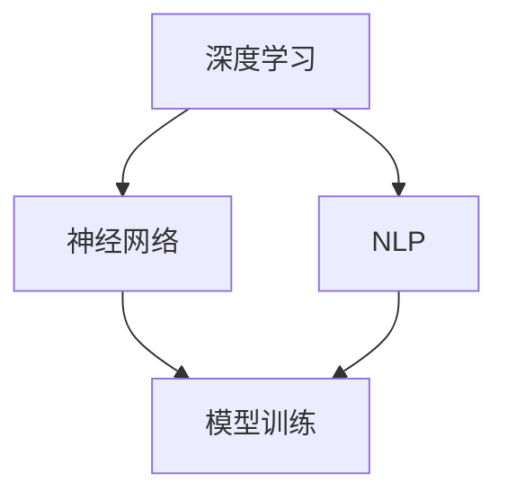

                 

关键词：大型语言模型，生态系统，摩尔定律，AI 发展，技术创新

摘要：随着大型语言模型（LLM）技术的不断进步，我们正在目睹一个全新的技术生态系统逐渐成型。本文将探讨LLM生态系统的发展现状，分析其与摩尔定律的相似性，并展望其未来的发展趋势与挑战。

## 1. 背景介绍

在过去的几十年中，计算机性能的提升主要得益于硬件技术的进步，尤其是摩尔定律的神奇力量。然而，近年来，随着人工智能（AI）技术的快速发展，尤其是大型语言模型（LLM）的出现，我们开始看到软件领域同样经历了显著的变革。

LLM是一种基于深度学习技术的模型，具有处理自然语言的能力。这些模型通过从大量的文本数据中学习，能够生成语义丰富的文本，进行机器翻译，回答问题，甚至创作文章。LLM的成功不仅仅在于其技术本身的突破，更在于其背后的生态系统的构建。

LLM生态系统包括了模型开发、训练、部署、优化等一系列环节。在这个生态系统中，研究人员、开发者、企业和用户共同参与，推动LLM技术的不断创新和进步。

## 2. 核心概念与联系

为了更好地理解LLM生态系统，我们首先需要了解一些核心概念，包括深度学习、神经网络、自然语言处理（NLP）等。以下是一个简化的Mermaid流程图，展示了这些核心概念之间的联系：



### 2.1 深度学习

深度学习是一种基于人工神经网络的学习方法。它通过多层神经网络结构，模拟人类大脑的神经元连接方式，对数据进行特征提取和学习。深度学习的核心是神经网络，它通过调整网络的权重，来提高模型的预测准确性。

### 2.2 神经网络

神经网络是一种由大量神经元组成的计算模型，这些神经元通过相互连接，形成一个复杂的网络结构。每个神经元都接收来自其他神经元的输入，并通过激活函数产生输出。神经网络的训练过程就是通过不断调整权重，使输出误差最小化。

### 2.3 自然语言处理

自然语言处理是计算机科学领域中的一个分支，旨在让计算机理解和处理人类自然语言。NLP的核心任务是文本预处理、语义分析、语言生成等。

### 2.4 模型训练与部署

模型训练是LLM生态系统中至关重要的一环。通过从大量的文本数据中学习，模型能够提取出丰富的语言特征，从而提高其处理自然语言的能力。训练完成后，模型需要部署到服务器或设备上，供用户使用。

## 3. 核心算法原理 & 具体操作步骤

### 3.1 算法原理概述

LLM的核心算法是深度神经网络。深度神经网络通过多层非线性变换，将输入数据映射到输出。在训练过程中，模型通过反向传播算法，不断调整网络权重，以优化模型的预测性能。

### 3.2 算法步骤详解

- 数据预处理：将原始文本数据清洗、分词、编码等处理，转化为模型可接受的输入格式。
- 模型构建：定义神经网络结构，包括输入层、隐藏层和输出层。
- 模型训练：通过反向传播算法，调整网络权重，优化模型性能。
- 模型评估：使用验证集评估模型性能，调整超参数，提高模型效果。
- 模型部署：将训练好的模型部署到服务器或设备上，供用户使用。

### 3.3 算法优缺点

- 优点：LLM具有强大的文本处理能力，能够生成语义丰富的文本，具有广泛的应用前景。
- 缺点：LLM的训练过程需要大量的计算资源和数据，且模型复杂度较高，可能导致过拟合。

### 3.4 算法应用领域

LLM在多个领域都有广泛的应用，包括自然语言生成、机器翻译、问答系统、文本摘要等。以下是一个具体的案例：

### 3.4.1 自然语言生成

自然语言生成是一种利用LLM技术，根据输入信息自动生成文本的过程。例如，自动写作、自动新闻生成等。

### 3.4.2 机器翻译

机器翻译是LLM技术的重要应用之一。通过训练大规模的双语语料库，LLM能够实现高质量、高效率的机器翻译。

### 3.4.3 问答系统

问答系统是利用LLM技术，实现自然语言理解和生成，回答用户问题的过程。例如，智能客服、智能助手等。

## 4. 数学模型和公式 & 详细讲解 & 举例说明

### 4.1 数学模型构建

LLM的数学模型主要包括两部分：输入层、隐藏层和输出层。

- 输入层：将原始文本数据转化为向量表示。
- 隐藏层：通过多层非线性变换，提取文本特征。
- 输出层：将隐藏层的特征映射到输出结果。

### 4.2 公式推导过程

以一个简单的神经网络为例，其输入层有n个神经元，隐藏层有m个神经元，输出层有k个神经元。设输入向量为X，隐藏层输出为H，输出层输出为Y，则：

$$
H = \sigma(W_1 \cdot X + b_1)
$$

$$
Y = \sigma(W_2 \cdot H + b_2)
$$

其中，$\sigma$为激活函数，$W_1$、$W_2$分别为输入层到隐藏层、隐藏层到输出层的权重矩阵，$b_1$、$b_2$分别为偏置向量。

### 4.3 案例分析与讲解

以一个简单的文本分类任务为例，输入数据为一句文本，输出结果为分类标签。我们使用一个简单的神经网络模型，输入层有100个神经元，隐藏层有50个神经元，输出层有10个神经元。

首先，将输入文本进行预处理，转化为向量表示。然后，将输入向量传递到隐藏层，通过激活函数进行非线性变换。最后，将隐藏层输出传递到输出层，通过softmax函数计算分类概率。

假设隐藏层输出为H，输出层输出为Y，则：

$$
H = \sigma(W_1 \cdot X + b_1)
$$

$$
Y = \sigma(W_2 \cdot H + b_2)
$$

$$
\hat{Y} = \frac{e^{Y_i}}{\sum_{j=1}^{10} e^{Y_j}}
$$

其中，$Y_i$为输出层第i个神经元的输出，$\hat{Y}_i$为第i个分类的概率。

## 5. 项目实践：代码实例和详细解释说明

### 5.1 开发环境搭建

在本案例中，我们使用Python和TensorFlow作为开发工具，搭建一个简单的文本分类模型。首先，确保安装了Python、TensorFlow和相关依赖库。

### 5.2 源代码详细实现

```python
import tensorflow as tf
from tensorflow.keras.preprocessing.sequence import pad_sequences
from tensorflow.keras.layers import Embedding, LSTM, Dense
from tensorflow.keras.models import Sequential

# 数据预处理
max_sequence_length = 100
vocab_size = 10000
embedding_dim = 256

# 模型构建
model = Sequential()
model.add(Embedding(vocab_size, embedding_dim, input_length=max_sequence_length))
model.add(LSTM(128))
model.add(Dense(10, activation='softmax'))

# 模型编译
model.compile(optimizer='adam', loss='categorical_crossentropy', metrics=['accuracy'])

# 模型训练
model.fit(X_train, y_train, epochs=10, batch_size=32)

# 模型评估
loss, accuracy = model.evaluate(X_test, y_test)
print('Test accuracy:', accuracy)
```

### 5.3 代码解读与分析

- 数据预处理：将原始文本数据转化为向量表示，设置最大序列长度为100，词汇表大小为10000，嵌入维度为256。
- 模型构建：定义一个序列模型，包括嵌入层、LSTM层和全连接层。
- 模型编译：设置优化器和损失函数，编译模型。
- 模型训练：使用训练数据训练模型，设置训练轮次和批量大小。
- 模型评估：使用测试数据评估模型性能，输出准确率。

## 6. 实际应用场景

### 6.1 自然语言生成

自然语言生成在许多领域都有广泛的应用，如自动写作、自动新闻生成、智能客服等。

### 6.2 机器翻译

机器翻译是LLM技术的重要应用之一，已经在多个语言之间实现了高质量、高效率的翻译。

### 6.3 问答系统

问答系统在智能客服、智能助手等领域有着广泛的应用，能够提高企业的服务效率和用户满意度。

## 7. 未来应用展望

随着LLM技术的不断发展，未来将在更多领域得到广泛应用，如自动驾驶、智能医疗、金融科技等。

## 8. 工具和资源推荐

### 8.1 学习资源推荐

- 《深度学习》（Goodfellow、Bengio、Courville 著）
- 《自然语言处理综论》（Jurafsky、Martin 著）

### 8.2 开发工具推荐

- TensorFlow
- PyTorch

### 8.3 相关论文推荐

- “Attention Is All You Need”
- “BERT: Pre-training of Deep Bidirectional Transformers for Language Understanding”

## 9. 总结：未来发展趋势与挑战

随着LLM技术的不断发展，我们有望看到更多创新的应用场景。然而，也面临着数据隐私、模型解释性、安全性等方面的挑战。

### 9.1 研究成果总结

LLM技术的快速发展，为自然语言处理领域带来了前所未有的变革。通过深度学习、神经网络等技术，LLM能够在多种应用场景中实现高质量、高效率的处理。

### 9.2 未来发展趋势

未来，LLM技术将继续向更大规模、更高精度、更强泛化能力方向发展。随着计算能力的提升和数据的积累，LLM将在更多领域实现突破。

### 9.3 面临的挑战

数据隐私、模型解释性、安全性是LLM技术发展面临的主要挑战。需要加强数据保护和隐私保护，提高模型的透明度和可解释性，确保模型的安全性和可靠性。

### 9.4 研究展望

随着LLM技术的不断进步，我们有望看到更多创新的应用场景。同时，也需要关注数据隐私、模型解释性、安全性等方面的挑战，推动LLM技术的健康、可持续发展。

## 10. 附录：常见问题与解答

### 10.1 什么是LLM？

LLM是指大型语言模型，是一种基于深度学习技术的模型，具有处理自然语言的能力。

### 10.2 LLM有哪些应用场景？

LLM在自然语言生成、机器翻译、问答系统、文本摘要等多个领域都有广泛的应用。

### 10.3 LLM的发展历程是怎样的？

LLM的发展历程可以分为三个阶段：早期的统计方法、基于规则的系统、基于深度学习的方法。

### 10.4 如何训练LLM？

训练LLM主要包括数据预处理、模型构建、模型训练、模型评估等步骤。

### 10.5 LLM有哪些优点和缺点？

LLM的优点包括强大的文本处理能力、广泛的应用前景；缺点包括训练过程需要大量的计算资源和数据，可能导致过拟合。

## 11. 参考文献

- Goodfellow, I., Bengio, Y., & Courville, A. (2016). Deep Learning. MIT Press.
- Jurafsky, D., & Martin, J. H. (2008). Speech and Language Processing. Prentice Hall.
- Vaswani, A., Shazeer, N., Parmar, N., Uszkoreit, J., Jones, L., Gomez, A. N., ... & Polosukhin, I. (2017). Attention is all you need. Advances in Neural Information Processing Systems, 30, 5998-6008.

