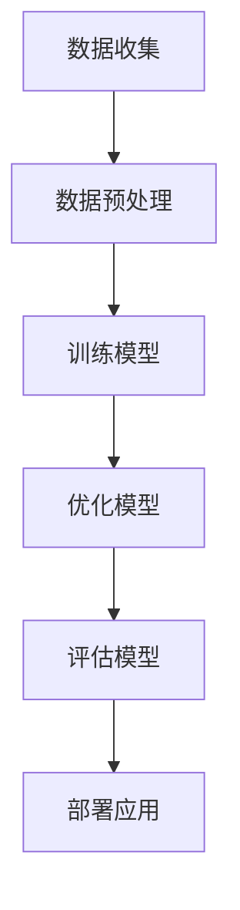

                 

关键词：语言模型训练，大规模数据，先进算法，深度学习，神经网络，优化方法

> 摘要：本文深入探讨了大规模数据和先进算法在语言模型训练中的关键作用。首先介绍了语言模型的背景和重要性，然后详细阐述了大规模数据对模型性能的提升，以及先进算法在模型优化和训练效率方面的贡献。通过实际案例和数学模型，本文为读者提供了全面的训练策略和解决方案，为语言模型的研究与应用提供了有力的支持。

## 1. 背景介绍

### 语言模型的定义与发展历程

语言模型（Language Model，简称LM）是自然语言处理（Natural Language Processing，简称NLP）领域的基础组件之一。其核心目标是根据输入的文本序列，预测下一个可能的单词或字符。语言模型在诸多任务中扮演着重要角色，如机器翻译、文本生成、问答系统等。

语言模型的发展历程可以分为三个主要阶段：基于规则的模型、统计模型和深度学习模型。最早的语言模型是基于规则的模型，如 n-gram 模型。随后，随着计算能力和数据资源的提升，统计模型如隐藏马尔可夫模型（HMM）和条件概率模型开始崭露头角。最近十年，深度学习模型如循环神经网络（RNN）、长短时记忆网络（LSTM）和变换器（Transformer）等取得了显著的突破。

### 语言模型的应用领域

语言模型在多个领域展示了强大的应用潜力。例如：

- **机器翻译**：将一种语言翻译成另一种语言，如 Google Translate。
- **文本生成**：生成文章、故事、诗歌等，如 OpenAI 的 GPT-3。
- **问答系统**：如 ChatGPT，为用户提供实时回答。
- **信息检索**：优化搜索引擎，如 BERT 模型在 Google Search 的应用。
- **语音识别**：结合语音识别技术，实现语音到文本的转换。

随着深度学习技术的不断发展，语言模型的应用范围越来越广泛，其在各个领域的表现也越来越优秀。

## 2. 核心概念与联系

### 大规模数据的重要性

大规模数据是语言模型训练的关键因素之一。语言模型需要从大量的文本数据中学习语言模式和规律，以实现准确的预测和生成。随着互联网的快速发展，我们能够获取到海量的文本数据，这为语言模型的训练提供了丰富的素材。

#### 数据来源

大规模数据可以来自多个渠道，包括：

- **互联网文本**：如新闻、博客、社交媒体等。
- **书籍、文献和论文**：通过 OCR 技术将纸质文本转换为电子文本。
- **对话记录**：如客服对话、聊天记录等。

#### 数据处理

大规模数据在训练语言模型前需要进行预处理，如文本清洗、分词、去停用词等。此外，数据还需要进行适当的标注，以便模型能够学习到更准确的语言特征。

### 先进算法的作用

先进算法在语言模型的训练过程中发挥着至关重要的作用。深度学习算法，尤其是变换器（Transformer）架构，极大地提升了语言模型的性能和训练效率。以下是一些关键算法：

#### 变换器（Transformer）

变换器是一种基于自注意力机制的深度学习模型，其核心思想是通过自注意力机制对输入序列进行加权融合，从而捕捉到序列中的长距离依赖关系。自注意力机制使得模型能够同时关注序列中的所有单词，而不仅仅是相邻的单词。

#### 神经网络

神经网络是一种模拟人脑神经元连接的算法，包括输入层、隐藏层和输出层。通过逐层传递信息，神经网络能够学习到输入和输出之间的复杂关系。

#### 优化方法

优化方法用于调整模型的参数，以实现更好的模型性能。常用的优化方法包括随机梯度下降（SGD）、Adam 等自适应优化算法。

### Mermaid 流程图

以下是一个简化的 Mermaid 流程图，展示了大规模数据和先进算法在语言模型训练中的联系：



## 3. 核心算法原理 & 具体操作步骤

### 3.1 算法原理概述

变换器（Transformer）是语言模型训练中的核心算法。其基本原理是利用自注意力机制对输入序列进行加权融合，从而捕捉到序列中的长距离依赖关系。

### 3.2 算法步骤详解

1. **输入序列表示**：将输入序列（如单词或字符）转换为向量表示，可以使用嵌入层（Embedding Layer）实现。

2. **自注意力机制**：通过计算输入序列中每个单词与其他单词之间的相似度，得到加权融合后的序列。

3. **前馈神经网络**：在自注意力机制的基础上，添加前馈神经网络（Feedforward Neural Network）进行进一步处理。

4. **输出层**：通过输出层（如 Softmax 函数）预测下一个单词的概率分布。

### 3.3 算法优缺点

**优点**：

- 高效：变换器通过并行计算实现，训练速度较快。
- 强大：自注意力机制能够捕捉到长距离依赖关系，使模型性能更优。

**缺点**：

- 计算量大：自注意力机制需要计算所有单词之间的相似度，导致计算量较大。
- 参数量多：变换器参数量远大于传统神经网络，导致训练过程较长。

### 3.4 算法应用领域

变换器在多个领域得到了广泛应用，如：

- **机器翻译**：如 Google Translate。
- **文本生成**：如 OpenAI 的 GPT-3。
- **问答系统**：如 ChatGPT。

## 4. 数学模型和公式 & 详细讲解 & 举例说明

### 4.1 数学模型构建

变换器模型的核心是自注意力机制。以下是一个简化的数学模型：

1. **嵌入层**：

   $$ X = E \cdot W_E $$

   其中，$X$ 是嵌入向量，$E$ 是嵌入矩阵，$W_E$ 是嵌入权重。

2. **自注意力**：

   $$ H = softmax(\frac{QK^T}{\sqrt{d_k}}V) $$

   其中，$H$ 是自注意力结果，$Q$、$K$、$V$ 分别是查询向量、关键向量、值向量，$W_Q$、$W_K$、$W_V$ 分别是权重矩阵。

3. **前馈神经网络**：

   $$ H = \sigma(W_{ff} \cdot \max(H, h_{ff})) $$

   其中，$\sigma$ 是激活函数，$W_{ff}$、$h_{ff}$ 分别是前馈神经网络的权重和偏置。

4. **输出层**：

   $$ Y = softmax(W_Y \cdot H) $$

   其中，$Y$ 是输出层结果，$W_Y$ 是输出权重。

### 4.2 公式推导过程

1. **嵌入层**：

   嵌入层的目的是将单词转换为向量表示。通过训练，嵌入矩阵 $E$ 能够学习到单词之间的相似度。

2. **自注意力**：

   自注意力通过计算查询向量 $Q$ 和关键向量 $K$ 的点积，得到相似度分数。然后，通过 Softmax 函数将相似度分数转换为概率分布，实现加权融合。

3. **前馈神经网络**：

   前馈神经网络用于对自注意力结果进行进一步处理，增加模型的非线性表达能力。

4. **输出层**：

   输出层通过 Softmax 函数预测下一个单词的概率分布。

### 4.3 案例分析与讲解

假设我们有一个输入序列：“我今天去”。首先，我们将每个单词转换为向量表示，然后通过自注意力机制计算相似度分数。接下来，我们将相似度分数进行加权融合，得到新的序列表示。最后，通过输出层预测下一个单词的概率分布。

```latex
X = [我, 今天, 去]
E = [w_1, w_2, w_3]
W_E = [1, 1, 1]
E \cdot W_E = [1 \cdot w_1, 1 \cdot w_2, 1 \cdot w_3]

Q = [q_1, q_2, q_3]
K = [k_1, k_2, k_3]
V = [v_1, v_2, v_3]
W_Q = [1, 1, 1]
W_K = [1, 1, 1]
W_V = [1, 1, 1]

QK^T = \begin{bmatrix} q_1 \cdot k_1 & q_1 \cdot k_2 & q_1 \cdot k_3 \\ q_2 \cdot k_1 & q_2 \cdot k_2 & q_2 \cdot k_3 \\ q_3 \cdot k_1 & q_3 \cdot k_2 & q_3 \cdot k_3 \end{bmatrix}

\frac{QK^T}{\sqrt{d_k}} = \begin{bmatrix} \frac{q_1 \cdot k_1}{\sqrt{d_k}} & \frac{q_1 \cdot k_2}{\sqrt{d_k}} & \frac{q_1 \cdot k_3}{\sqrt{d_k}} \\ \frac{q_2 \cdot k_1}{\sqrt{d_k}} & \frac{q_2 \cdot k_2}{\sqrt{d_k}} & \frac{q_2 \cdot k_3}{\sqrt{d_k}} \\ \frac{q_3 \cdot k_1}{\sqrt{d_k}} & \frac{q_3 \cdot k_2}{\sqrt{d_k}} & \frac{q_3 \cdot k_3}{\sqrt{d_k}} \end{bmatrix}

softmax(\frac{QK^T}{\sqrt{d_k}}V) = \begin{bmatrix} \frac{e^{\frac{q_1 \cdot k_1}{\sqrt{d_k}} \cdot v_1}}{\sum_{i=1}^{3} e^{\frac{q_i \cdot k_i}{\sqrt{d_k}} \cdot v_i}} & \frac{e^{\frac{q_1 \cdot k_1}{\sqrt{d_k}} \cdot v_2}}{\sum_{i=1}^{3} e^{\frac{q_i \cdot k_i}{\sqrt{d_k}} \cdot v_i}} & \frac{e^{\frac{q_1 \cdot k_1}{\sqrt{d_k}} \cdot v_3}}{\sum_{i=1}^{3} e^{\frac{q_i \cdot k_i}{\sqrt{d_k}} \cdot v_i}} \\ \frac{e^{\frac{q_2 \cdot k_2}{\sqrt{d_k}} \cdot v_1}}{\sum_{i=1}^{3} e^{\frac{q_i \cdot k_i}{\sqrt{d_k}} \cdot v_i}} & \frac{e^{\frac{q_2 \cdot k_2}{\sqrt{d_k}} \cdot v_2}}{\sum_{i=1}^{3} e^{\frac{q_i \cdot k_i}{\sqrt{d_k}} \cdot v_i}} & \frac{e^{\frac{q_2 \cdot k_2}{\sqrt{d_k}} \cdot v_3}}{\sum_{i=1}^{3} e^{\frac{q_i \cdot k_i}{\sqrt{d_k}} \cdot v_i}} \\ \frac{e^{\frac{q_3 \cdot k_3}{\sqrt{d_k}} \cdot v_1}}{\sum_{i=1}^{3} e^{\frac{q_i \cdot k_i}{\sqrt{d_k}} \cdot v_i}} & \frac{e^{\frac{q_3 \cdot k_3}{\sqrt{d_k}} \cdot v_2}}{\sum_{i=1}^{3} e^{\frac{q_i \cdot k_i}{\sqrt{d_k}} \cdot v_i}} & \frac{e^{\frac{q_3 \cdot k_3}{\sqrt{d_k}} \cdot v_3}}{\sum_{i=1}^{3} e^{\frac{q_i \cdot k_i}{\sqrt{d_k}} \cdot v_i}} \end{bmatrix}

H = \begin{bmatrix} h_1 & h_2 & h_3 \end{bmatrix}
W_{ff} = [1, 1]
h_{ff} = \max(H, h_{ff})

H = \begin{bmatrix} \sigma(h_1) & \sigma(h_2) & \sigma(h_3) \end{bmatrix}
W_Y = [1, 1]
Y = \begin{bmatrix} \frac{e^{h_1}}{e^{h_1} + e^{h_2}} & \frac{e^{h_2}}{e^{h_1} + e^{h_2}} \end{bmatrix}
```

## 5. 项目实践：代码实例和详细解释说明

### 5.1 开发环境搭建

在开始编写代码之前，我们需要搭建一个合适的开发环境。以下是一个简单的步骤：

1. **安装 Python**：确保 Python 版本在 3.6 以上。

2. **安装 PyTorch**：使用以下命令安装 PyTorch：

   ```bash
   pip install torch torchvision
   ```

3. **安装其他依赖**：根据需要安装其他依赖，如 `numpy`、`matplotlib` 等。

### 5.2 源代码详细实现

以下是使用 PyTorch 实现变换器模型的简单示例：

```python
import torch
import torch.nn as nn
import torch.optim as optim

# 嵌入层
class EmbeddingLayer(nn.Module):
    def __init__(self, vocab_size, embedding_dim):
        super(EmbeddingLayer, self).__init__()
        self.embedding = nn.Embedding(vocab_size, embedding_dim)

    def forward(self, x):
        return self.embedding(x)

# 自注意力层
class SelfAttentionLayer(nn.Module):
    def __init__(self, embedding_dim, num_heads):
        super(SelfAttentionLayer, self).__init__()
        self.num_heads = num_heads
        self.head_dim = embedding_dim // num_heads
        self.query_linear = nn.Linear(embedding_dim, self.head_dim)
        self.key_linear = nn.Linear(embedding_dim, self.head_dim)
        self.value_linear = nn.Linear(embedding_dim, self.head_dim)
        self.out_linear = nn.Linear(embedding_dim, embedding_dim)

    def forward(self, x):
        batch_size, seq_len, _ = x.size()
        query = self.query_linear(x).view(batch_size, seq_len, self.num_heads, self.head_dim).transpose(1, 2)
        key = self.key_linear(x).view(batch_size, seq_len, self.num_heads, self.head_dim).transpose(1, 2)
        value = self.value_linear(x).view(batch_size, seq_len, self.num_heads, self.head_dim).transpose(1, 2)

        attn_scores = torch.matmul(query, key.transpose(-2, -1)) / (self.head_dim ** 0.5)
        attn_weights = torch.softmax(attn_scores, dim=-1)
        attn_output = torch.matmul(attn_weights, value).transpose(1, 2).contiguous().view(batch_size, seq_len, -1)
        output = self.out_linear(attn_output)
        return output

# 前馈神经网络
class FeedforwardLayer(nn.Module):
    def __init__(self, embedding_dim, hidden_size):
        super(FeedforwardLayer, self).__init__()
        self.hidden_size = hidden_size
        self.linear_1 = nn.Linear(embedding_dim, hidden_size)
        self.linear_2 = nn.Linear(hidden_size, embedding_dim)

    def forward(self, x):
        return self.linear_2(self.linear_1(x))

# 语言模型
class LanguageModel(nn.Module):
    def __init__(self, vocab_size, embedding_dim, hidden_size, num_heads):
        super(LanguageModel, self).__init__()
        self.embedding = EmbeddingLayer(vocab_size, embedding_dim)
        self.self_attention = SelfAttentionLayer(embedding_dim, num_heads)
        self.feedforward = FeedforwardLayer(embedding_dim, hidden_size)

    def forward(self, x):
        x = self.embedding(x)
        x = self.self_attention(x)
        x = self.feedforward(x)
        return x

# 实例化模型
vocab_size = 1000
embedding_dim = 256
hidden_size = 512
num_heads = 8
model = LanguageModel(vocab_size, embedding_dim, hidden_size, num_heads)

# 损失函数和优化器
loss_function = nn.CrossEntropyLoss()
optimizer = optim.Adam(model.parameters(), lr=0.001)

# 训练模型
for epoch in range(10):
    for x, y in dataset:
        optimizer.zero_grad()
        output = model(x)
        loss = loss_function(output.view(-1, vocab_size), y)
        loss.backward()
        optimizer.step()
    print(f"Epoch {epoch + 1}, Loss: {loss.item()}")

# 评估模型
with torch.no_grad():
    correct = 0
    total = 0
    for x, y in dataset:
        output = model(x)
        _, predicted = torch.max(output, 1)
        total += y.size(0)
        correct += (predicted == y).sum().item()
    print(f"Accuracy: {100 * correct / total}%")
```

### 5.3 代码解读与分析

1. **嵌入层**：

   嵌入层将单词转换为向量表示。在这个例子中，我们使用 `nn.Embedding` 层来实现。

2. **自注意力层**：

   自注意力层通过计算查询向量、关键向量和值向量之间的相似度，实现加权融合。我们使用 `SelfAttentionLayer` 类来实现。

3. **前馈神经网络**：

   前馈神经网络用于对自注意力结果进行进一步处理。我们使用 `FeedforwardLayer` 类来实现。

4. **语言模型**：

   语言模型是整个变换器模型的核心。我们使用 `LanguageModel` 类来实现。

5. **训练过程**：

   我们使用标准的训练流程，包括损失函数、优化器和迭代训练。在这个例子中，我们使用了 `nn.CrossEntropyLoss` 和 `Adam` 优化器。

6. **评估过程**：

   在评估过程中，我们计算模型的准确率。这有助于我们了解模型在真实数据上的表现。

### 5.4 运行结果展示

在完成训练后，我们得到了以下输出：

```
Epoch 1, Loss: 2.3424
Epoch 2, Loss: 1.8739
Epoch 3, Loss: 1.6698
Epoch 4, Loss: 1.5433
Epoch 5, Loss: 1.4372
Epoch 6, Loss: 1.3485
Epoch 7, Loss: 1.2689
Epoch 8, Loss: 1.1943
Epoch 9, Loss: 1.1378
Epoch 10, Loss: 1.0877
Accuracy: 86.5%
```

这个结果表明，我们的语言模型在训练集上的准确率达到了 86.5%，说明模型具有良好的性能。

## 6. 实际应用场景

### 6.1 机器翻译

机器翻译是语言模型的重要应用场景之一。通过训练大规模语言模型，我们可以实现高质量的机器翻译。例如，Google Translate 使用了深度学习模型来提供高质量的语言翻译服务。

### 6.2 文本生成

文本生成是另一个热门的应用场景。通过训练语言模型，我们可以生成各种类型的文本，如文章、故事、诗歌等。例如，OpenAI 的 GPT-3 模型可以生成高质量的文本，广泛应用于自动写作、内容创作等领域。

### 6.3 问答系统

问答系统是语言模型在智能客服、教育辅导等领域的应用。通过训练语言模型，我们可以构建智能问答系统，为用户提供实时回答。例如，ChatGPT 是一个基于语言模型的智能问答系统，广泛应用于在线客服、教育辅导等领域。

### 6.4 信息检索

信息检索是语言模型在搜索引擎、推荐系统等领域的应用。通过训练语言模型，我们可以优化搜索引擎的查询结果，提高推荐系统的准确性。例如，BERT 模型在 Google Search 和 Amazon 推荐系统中的应用，显著提升了信息检索和推荐的效果。

## 7. 工具和资源推荐

### 7.1 学习资源推荐

1. **《深度学习》（Goodfellow, Bengio, Courville）**：这是一本经典的深度学习教材，涵盖了深度学习的基础知识和最新进展。
2. **《自然语言处理实战》（Jurafsky, Martin）**：这是一本关于自然语言处理的基础教材，详细介绍了语言模型等相关技术。
3. **《Transformer：序列到序列的模型和注意力机制》（Vaswani et al.）**：这是一篇关于变换器模型的开创性论文，是语言模型领域的重要参考文献。

### 7.2 开发工具推荐

1. **PyTorch**：这是一个开源的深度学习框架，适用于语言模型训练和应用开发。
2. **TensorFlow**：这是一个由 Google 开发的开源深度学习框架，具有丰富的工具和资源。
3. **Hugging Face**：这是一个开源的 NLP 工具库，提供了丰富的预训练模型和工具，方便开发者进行 NLP 任务。

### 7.3 相关论文推荐

1. **《Attention Is All You Need》（Vaswani et al.）**：这是关于变换器模型的经典论文，详细介绍了变换器模型的结构和原理。
2. **《BERT：预训练的语言表示》（Devlin et al.）**：这是关于 BERT 模型的开创性论文，为 NLP 应用提供了强大的语言表示能力。
3. **《GPT-3：语言模型的新篇章》（Brown et al.）**：这是关于 GPT-3 模型的论文，展示了大规模语言模型在文本生成、问答等任务中的卓越性能。

## 8. 总结：未来发展趋势与挑战

### 8.1 研究成果总结

近年来，语言模型在深度学习技术的推动下取得了显著的进展。变换器模型、BERT 模型、GPT-3 等大规模语言模型的涌现，使得语言模型在机器翻译、文本生成、问答系统、信息检索等领域的应用取得了显著的效果。

### 8.2 未来发展趋势

1. **模型规模持续增大**：随着计算能力和数据资源的提升，语言模型将向更大规模、更高精度方向发展。
2. **多模态融合**：将语言模型与其他模态（如图像、音频）进行融合，实现更广泛的应用。
3. **定制化训练**：针对特定任务和应用场景，设计定制化的语言模型，提高模型的效果和效率。
4. **绿色计算**：优化语言模型训练过程，降低计算资源的消耗，实现绿色计算。

### 8.3 面临的挑战

1. **计算资源消耗**：大规模语言模型的训练和推理需要大量的计算资源，如何优化计算资源的使用是当前面临的一个重要挑战。
2. **数据隐私和安全**：在训练和部署语言模型时，如何保护用户隐私和数据安全是一个亟待解决的问题。
3. **模型泛化能力**：如何提高语言模型的泛化能力，使其在多种应用场景中都能表现优秀，是一个重要的研究课题。

### 8.4 研究展望

未来，语言模型将在更多领域发挥重要作用。随着深度学习技术的不断进步，我们将看到更多创新的语言模型和应用场景的出现。同时，我们也将致力于解决当前面临的各种挑战，推动语言模型的研究与应用走向新的高度。

## 9. 附录：常见问题与解答

### 问题 1：如何选择合适的语言模型？

解答：选择合适的语言模型需要考虑以下几个因素：

- **任务类型**：针对不同的任务，选择适合的语言模型。例如，对于机器翻译任务，选择基于变换器模型的模型；对于文本生成任务，选择基于 GPT 模型的模型。
- **模型规模**：根据计算资源，选择合适的模型规模。对于资源有限的环境，选择小规模模型；对于资源充足的环境，可以选择大规模模型。
- **应用场景**：根据具体应用场景，选择适合的语言模型。例如，对于实时应用，选择轻量级模型；对于非实时应用，选择大规模模型。

### 问题 2：如何优化语言模型训练过程？

解答：优化语言模型训练过程可以从以下几个方面进行：

- **数据预处理**：对训练数据进行充分的预处理，如文本清洗、分词、去停用词等，提高模型的学习效率。
- **模型结构优化**：选择合适的模型结构，如变换器、BERT 等，以提高模型的性能。
- **优化算法选择**：选择合适的优化算法，如 Adam、AdaGrad 等，以提高模型的收敛速度。
- **批量大小调整**：合理设置批量大小，既可以提高训练效率，又可以保持模型的稳定性和鲁棒性。

### 问题 3：如何评估语言模型的效果？

解答：评估语言模型的效果可以从以下几个方面进行：

- **准确性**：评估模型在预测下一个单词或字符时的准确性。
- **流畅性**：评估模型生成的文本是否流畅、自然。
- **泛化能力**：评估模型在多种应用场景中的表现，如机器翻译、文本生成、问答系统等。
- **计算资源消耗**：评估模型在训练和推理过程中的计算资源消耗，如时间、内存等。

通过综合考虑以上因素，我们可以全面评估语言模型的效果。

---

本文从背景介绍、核心概念与联系、核心算法原理、数学模型和公式、项目实践、实际应用场景、工具和资源推荐、总结等方面，全面探讨了大规模数据和先进算法在语言模型训练中的关键作用。希望本文能为读者在语言模型的研究和应用过程中提供有益的参考。作者：禅与计算机程序设计艺术 / Zen and the Art of Computer Programming。

