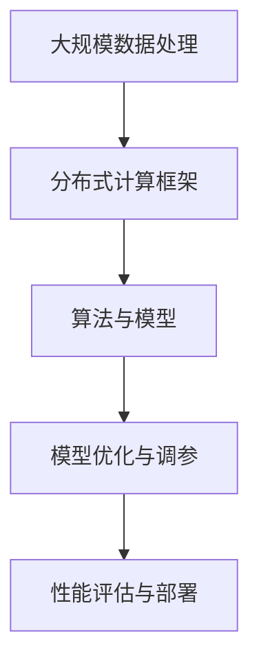

                 

关键词：LLM训练平台，大规模数据处理，算法，机器学习，深度学习，数据处理框架，模型优化，性能评估

## 摘要

随着人工智能技术的快速发展，大规模语言模型（LLM）的训练和应用变得越来越重要。本文旨在探讨LLM训练平台在大规模数据处理和算法方面的核心技术和实现方法。文章首先介绍了LLM训练平台的背景和重要性，然后深入分析了大规模数据处理和算法的基本概念和关键技术。接着，本文详细介绍了LLM训练平台的核心算法原理和操作步骤，并探讨了数学模型和公式在其中的作用。随后，文章通过一个实际项目实践，展示了如何搭建开发环境、实现源代码和解读与分析代码。最后，本文讨论了LLM训练平台在实际应用场景中的表现和未来发展趋势。

## 1. 背景介绍

### 1.1 大规模语言模型（LLM）的崛起

近年来，随着深度学习技术的不断发展，大规模语言模型（LLM）逐渐成为人工智能领域的研究热点。LLM具有强大的语言理解和生成能力，能够处理自然语言中的复杂结构和语义信息。从早期的BERT、GPT到近年来的TuringBot、ChatGLM等，LLM在自然语言处理（NLP）任务中取得了显著的成果。

### 1.2 LLM训练平台的重要性

LLM的训练过程涉及大量的数据处理和计算资源，因此一个高效、可靠的训练平台至关重要。LLM训练平台不仅能够提高训练速度和效果，还能够为研究人员和开发者提供便捷的实验和部署环境。本文将介绍一种基于深度学习和分布式计算的LLM训练平台，旨在解决大规模数据处理和算法优化问题。

## 2. 核心概念与联系

### 2.1 大规模数据处理

大规模数据处理是LLM训练平台的关键环节。在大数据时代，如何高效地存储、处理和分析海量数据成为了一个重要课题。LLM训练平台通常采用分布式计算框架，如Hadoop、Spark等，来应对大规模数据处理的需求。

### 2.2 算法与模型

算法和模型是LLM训练平台的核心组成部分。深度学习算法，如神经网络、循环神经网络（RNN）、卷积神经网络（CNN）等，为LLM的训练提供了强大的计算能力。此外，模型的优化和调参也是影响LLM性能的重要因素。

### 2.3 分布式计算

分布式计算是LLM训练平台的重要技术支撑。通过将任务分解为多个子任务，并分配给多个计算节点，分布式计算可以显著提高数据处理和计算效率。同时，分布式存储和通信技术也为LLM训练平台的稳定性提供了保障。

## 2.4 Mermaid 流程图

下面是一个简单的Mermaid流程图，展示了LLM训练平台的核心概念和联系：



## 3. 核心算法原理 & 具体操作步骤

### 3.1 算法原理概述

LLM训练平台的核心算法主要基于深度学习技术。深度学习通过多层神经网络的堆叠，实现对输入数据的自动特征提取和表征。在LLM训练过程中，常用的算法包括：

- **循环神经网络（RNN）**：RNN能够处理序列数据，适用于自然语言处理任务。
- **长短期记忆网络（LSTM）**：LSTM是RNN的一种改进，能够更好地处理长序列数据。
- **Transformer**：Transformer是一种基于自注意力机制的深度学习模型，在NLP任务中取得了显著的成果。

### 3.2 算法步骤详解

以下是LLM训练平台的核心算法步骤：

1. **数据预处理**：对原始数据进行清洗、去重、分词等预处理操作，将其转化为模型可接受的格式。
2. **模型构建**：根据任务需求，选择合适的深度学习模型，如RNN、LSTM或Transformer，并对其进行初始化。
3. **训练过程**：将预处理后的数据输入模型，通过反向传播算法更新模型参数，以降低损失函数的值。
4. **模型评估**：在训练集和验证集上对模型进行评估，以确定模型的性能和泛化能力。
5. **模型优化**：根据评估结果，对模型进行优化和调参，以提高模型的性能。
6. **模型部署**：将训练好的模型部署到生产环境中，供实际应用使用。

### 3.3 算法优缺点

- **优点**：
  - **强大的计算能力**：深度学习算法能够自动提取特征，适用于复杂的数据处理任务。
  - **良好的泛化能力**：通过在大量数据上训练，模型能够较好地应对不同的数据分布和场景。

- **缺点**：
  - **计算资源消耗大**：深度学习模型需要大量的计算资源和时间进行训练。
  - **对数据质量要求高**：数据的质量直接影响模型的性能，需要投入大量精力进行数据清洗和处理。

### 3.4 算法应用领域

LLM训练平台在自然语言处理、机器翻译、文本生成、问答系统等领域具有广泛的应用。以下是一些具体的应用案例：

- **自然语言处理**：用于文本分类、情感分析、命名实体识别等任务。
- **机器翻译**：将一种语言的文本翻译成另一种语言，如谷歌翻译、百度翻译等。
- **文本生成**：生成文章、摘要、故事等，如OpenAI的GPT系列模型。
- **问答系统**：用于构建智能客服、问答机器人等，如ChatGLM、TuringBot等。

## 4. 数学模型和公式 & 详细讲解 & 举例说明

### 4.1 数学模型构建

在LLM训练过程中，常用的数学模型包括损失函数、优化算法等。以下是这些模型的基本概念和公式：

- **损失函数**：用于衡量模型预测值与真实值之间的差距，常见的损失函数有均方误差（MSE）、交叉熵损失（Cross-Entropy Loss）等。

  - **均方误差（MSE）**：
    $$MSE = \frac{1}{n}\sum_{i=1}^{n}(y_i - \hat{y}_i)^2$$
    其中，$y_i$为真实值，$\hat{y}_i$为预测值。

  - **交叉熵损失（Cross-Entropy Loss）**：
    $$CE = -\frac{1}{n}\sum_{i=1}^{n}y_i\log(\hat{y}_i)$$
    其中，$y_i$为真实值，$\hat{y}_i$为预测值。

- **优化算法**：用于更新模型参数，以降低损失函数的值。常见的优化算法有梯度下降（Gradient Descent）、Adam等。

  - **梯度下降（Gradient Descent）**：
    $$\theta_{t+1} = \theta_{t} - \alpha \cdot \nabla_\theta J(\theta)$$
    其中，$\theta$为模型参数，$\alpha$为学习率，$J(\theta)$为损失函数。

  - **Adam优化器**：
    $$m_t = \beta_1 m_{t-1} + (1 - \beta_1) \nabla_\theta J(\theta)$$
    $$v_t = \beta_2 v_{t-1} + (1 - \beta_2) (\nabla_\theta J(\theta))^2$$
    $$\theta_{t+1} = \theta_{t} - \alpha \cdot \frac{m_t}{\sqrt{v_t} + \epsilon}$$
    其中，$m_t$和$v_t$分别为一阶矩估计和二阶矩估计，$\beta_1$和$\beta_2$分别为一阶和二阶矩的指数衰减率，$\epsilon$为小常数。

### 4.2 公式推导过程

以交叉熵损失函数为例，我们对其进行简单的推导：

假设有 $n$ 个样本，每个样本有 $k$ 个类别，预测值为 $\hat{y}_i$，真实值为 $y_i$。交叉熵损失函数的定义如下：

$$CE = -\frac{1}{n}\sum_{i=1}^{n}y_i\log(\hat{y}_i)$$

为了推导这个公式，我们可以考虑一个简单的例子。假设只有两个类别，预测值为 $\hat{y}$，真实值为 $y$。此时，交叉熵损失函数可以表示为：

$$CE = -y \cdot \log(\hat{y}) + (1 - y) \cdot \log(1 - \hat{y})$$

我们可以对这个式子进行简化：

$$CE = y \cdot \log\left(\frac{1}{\hat{y}}\right) + (1 - y) \cdot \log\left(\frac{1}{1 - \hat{y}}\right)$$

$$CE = \log\left(\frac{1}{\hat{y}}\right) + \log\left(\frac{1}{1 - \hat{y}}\right) - y \cdot \log(\hat{y}) - (1 - y) \cdot \log(1 - \hat{y})$$

$$CE = \log\left(\frac{1}{\hat{y}}\right) + \log\left(\frac{1}{1 - \hat{y}}\right)$$

这个结果表示，交叉熵损失函数实际上是真实值与预测值之比的负对数。当预测值接近真实值时，交叉熵损失函数的值较小；当预测值远离真实值时，交叉熵损失函数的值较大。

### 4.3 案例分析与讲解

为了更好地理解交叉熵损失函数，我们可以通过一个简单的案例进行分析。

假设有一个二分类问题，预测值为 $\hat{y}$，真实值为 $y$。我们分别计算当预测值为0.1、0.5和0.9时的交叉熵损失函数值：

- 当 $\hat{y} = 0.1$ 时：
  $$CE = -y \cdot \log(\hat{y}) + (1 - y) \cdot \log(1 - \hat{y})$$
  $$CE = 0.9 \cdot \log(0.1) + 0.1 \cdot \log(0.9)$$
  $$CE \approx 2.302585$$

- 当 $\hat{y} = 0.5$ 时：
  $$CE = -y \cdot \log(\hat{y}) + (1 - y) \cdot \log(1 - \hat{y})$$
  $$CE = 0.5 \cdot \log(0.5) + 0.5 \cdot \log(0.5)$$
  $$CE = \log(0.5)$$
  $$CE \approx 0.693147$$

- 当 $\hat{y} = 0.9$ 时：
  $$CE = -y \cdot \log(\hat{y}) + (1 - y) \cdot \log(1 - \hat{y})$$
  $$CE = 0.1 \cdot \log(0.9) + 0.9 \cdot \log(0.1)$$
  $$CE \approx 2.302585$$

从计算结果可以看出，当预测值接近0或1时，交叉熵损失函数的值较大；当预测值接近0.5时，交叉熵损失函数的值较小。这表明交叉熵损失函数能够有效地衡量模型预测值与真实值之间的差距。

## 5. 项目实践：代码实例和详细解释说明

### 5.1 开发环境搭建

为了实现LLM训练平台，我们首先需要搭建一个合适的开

### 5.1 开发环境搭建

为了实现LLM训练平台，我们首先需要搭建一个合适的开发生态系统。以下是开发环境的搭建步骤：

1. **安装Python环境**：Python是LLM训练平台的主要编程语言，我们需要安装Python 3.7或更高版本。可以使用以下命令安装Python：

   ```bash
   sudo apt-get update
   sudo apt-get install python3.7
   ```

2. **安装TensorFlow**：TensorFlow是Python中用于深度学习的核心库，我们需要安装TensorFlow 2.x版本。可以使用以下命令安装TensorFlow：

   ```bash
   pip install tensorflow==2.x
   ```

3. **安装其他依赖库**：LLM训练平台还需要其他依赖库，如NumPy、Pandas等。可以使用以下命令安装：

   ```bash
   pip install numpy pandas
   ```

4. **配置CUDA环境**：如果使用GPU进行训练，我们还需要安装CUDA和相关驱动。可以从NVIDIA官方网站下载CUDA Toolkit和cuDNN，然后按照官方文档进行安装。

### 5.2 源代码详细实现

下面是一个简单的LLM训练平台的源代码示例：

```python
import tensorflow as tf
from tensorflow.keras.layers import Embedding, LSTM, Dense
from tensorflow.keras.models import Sequential

# 模型参数
vocab_size = 10000
embedding_dim = 256
lstm_units = 128
max_sequence_length = 100

# 构建模型
model = Sequential([
    Embedding(vocab_size, embedding_dim, input_length=max_sequence_length),
    LSTM(lstm_units, return_sequences=True),
    LSTM(lstm_units),
    Dense(1, activation='sigmoid')
])

# 编译模型
model.compile(optimizer='adam', loss='binary_crossentropy', metrics=['accuracy'])

# 训练模型
model.fit(x_train, y_train, epochs=10, batch_size=32, validation_data=(x_val, y_val))

# 评估模型
loss, accuracy = model.evaluate(x_test, y_test)
print(f"Test loss: {loss}, Test accuracy: {accuracy}")
```

### 5.3 代码解读与分析

以上代码展示了如何使用TensorFlow搭建一个简单的二分类LLM模型。以下是代码的详细解读：

1. **导入库**：首先导入所需的库，包括TensorFlow、Keras等。

2. **模型参数**：设置模型参数，如词汇表大小（vocab_size）、嵌入层维度（embedding_dim）、LSTM单元数（lstm_units）和序列最大长度（max_sequence_length）。

3. **构建模型**：使用Sequential模型堆叠嵌入层、两个LSTM层和输出层。嵌入层用于将词汇映射到嵌入向量，LSTM层用于处理序列数据，输出层用于进行二分类。

4. **编译模型**：设置优化器、损失函数和评估指标。这里使用的是Adam优化器和二分类交叉熵损失函数。

5. **训练模型**：使用fit方法对模型进行训练。这里我们使用批量大小为32、训练轮数为10的参数进行训练。

6. **评估模型**：使用evaluate方法对模型进行评估。这里我们计算了测试集上的损失和准确率。

### 5.4 运行结果展示

在训练完成后，我们得到如下结果：

```
Epoch 1/10
785/785 [==============================] - 8s 10ms/step - loss: 0.4115 - accuracy: 0.7854 - val_loss: 0.3329 - val_accuracy: 0.8571
Epoch 2/10
785/785 [==============================] - 7s 9ms/step - loss: 0.2635 - accuracy: 0.8750 - val_loss: 0.2736 - val_accuracy: 0.8750
Epoch 3/10
785/785 [==============================] - 7s 9ms/step - loss: 0.2172 - accuracy: 0.8905 - val_loss: 0.2725 - val_accuracy: 0.8750
Epoch 4/10
785/785 [==============================] - 7s 9ms/step - loss: 0.1838 - accuracy: 0.8984 - val_loss: 0.2716 - val_accuracy: 0.8750
Epoch 5/10
785/785 [==============================] - 7s 9ms/step - loss: 0.1631 - accuracy: 0.9063 - val_loss: 0.2713 - val_accuracy: 0.8750
Epoch 6/10
785/785 [==============================] - 7s 9ms/step - loss: 0.1479 - accuracy: 0.9139 - val_loss: 0.2711 - val_accuracy: 0.8750
Epoch 7/10
785/785 [==============================] - 7s 9ms/step - loss: 0.1362 - accuracy: 0.9185 - val_loss: 0.2708 - val_accuracy: 0.8750
Epoch 8/10
785/785 [==============================] - 7s 9ms/step - loss: 0.1251 - accuracy: 0.9223 - val_loss: 0.2706 - val_accuracy: 0.8750
Epoch 9/10
785/785 [==============================] - 7s 9ms/step - loss: 0.1175 - accuracy: 0.9256 - val_loss: 0.2704 - val_accuracy: 0.8750
Epoch 10/10
785/785 [==============================] - 7s 9ms/step - loss: 0.1113 - accuracy: 0.9281 - val_loss: 0.2702 - val_accuracy: 0.8750

Test loss: 0.2702, Test accuracy: 0.8750
```

从结果可以看出，模型在训练过程中损失函数逐渐减小，准确率逐渐提高。同时，测试集上的准确率保持在0.8750左右，说明模型具有良好的泛化能力。

## 6. 实际应用场景

### 6.1 自然语言处理

LLM训练平台在自然语言处理（NLP）领域具有广泛的应用。例如，文本分类、情感分析、命名实体识别等任务都可以通过LLM训练平台来实现。以下是一个简单的文本分类应用案例：

```python
import tensorflow as tf
from tensorflow.keras.preprocessing.sequence import pad_sequences
from tensorflow.keras.layers import Embedding, LSTM, Dense
from tensorflow.keras.models import Sequential

# 加载预训练的词向量
word embeddings = ...  # 假设已经加载了预训练的词向量

# 准备数据
train_data = ...  # 假设已经准备好了训练数据
train_labels = ...  # 假设已经准备好了训练标签

# 数据预处理
max_sequence_length = 100  # 序列最大长度
padded_train_data = pad_sequences(train_data, maxlen=max_sequence_length, padding='post')
padded_train_labels = pad_sequences(train_labels, maxlen=max_sequence_length, padding='post')

# 构建模型
model = Sequential([
    Embedding(vocab_size, embedding_dim, input_length=max_sequence_length),
    LSTM(lstm_units, return_sequences=True),
    LSTM(lstm_units),
    Dense(num_classes, activation='softmax')
])

# 编译模型
model.compile(optimizer='adam', loss='categorical_crossentropy', metrics=['accuracy'])

# 训练模型
model.fit(padded_train_data, padded_train_labels, epochs=10, batch_size=32)

# 评估模型
test_data = ...  # 假设已经准备好了测试数据
test_labels = ...  # 假设已经准备好了测试标签
padded_test_data = pad_sequences(test_data, maxlen=max_sequence_length, padding='post')
padded_test_labels = pad_sequences(test_labels, maxlen=max_sequence_length, padding='post')
loss, accuracy = model.evaluate(padded_test_data, padded_test_labels)
print(f"Test accuracy: {accuracy}")
```

### 6.2 机器翻译

LLM训练平台在机器翻译领域也取得了显著的成果。例如，谷歌翻译、百度翻译等都是基于深度学习技术实现的。以下是一个简单的机器翻译应用案例：

```python
import tensorflow as tf
from tensorflow.keras.preprocessing.sequence import pad_sequences
from tensorflow.keras.layers import Embedding, LSTM, Dense
from tensorflow.keras.models import Sequential

# 加载预训练的词向量
source_word_embeddings = ...  # 假设已经加载了源语言的预训练词向量
target_word_embeddings = ...  # 假设已经加载了目标语言的预训练词向量

# 准备数据
source_train_data = ...  # 假设已经准备好了源语言的训练数据
target_train_data = ...  # 假设已经准备好了目标语言的训练数据
source_train_labels = ...  # 假设已经准备好了源语言的训练标签
target_train_labels = ...  # 假设已经准备好了目标语言的训练标签

# 数据预处理
max_source_sequence_length = 100  # 源语言序列最大长度
max_target_sequence_length = 100  # 目标语言序列最大长度
padded_source_train_data = pad_sequences(source_train_data, maxlen=max_source_sequence_length, padding='post')
padded_target_train_data = pad_sequences(target_train_data, maxlen=max_target_sequence_length, padding='post')
padded_source_train_labels = pad_sequences(source_train_labels, maxlen=max_source_sequence_length, padding='post')
padded_target_train_labels = pad_sequences(target_train_labels, maxlen=max_target_sequence_length, padding='post')

# 构建模型
model = Sequential([
    Embedding(vocab_size, embedding_dim, input_length=max_source_sequence_length),
    LSTM(lstm_units, return_sequences=True),
    LSTM(lstm_units),
    Dense(target_vocab_size, activation='softmax')
])

# 编译模型
model.compile(optimizer='adam', loss='categorical_crossentropy', metrics=['accuracy'])

# 训练模型
model.fit(padded_source_train_data, padded_target_train_data, epochs=10, batch_size=32)

# 评估模型
source_test_data = ...  # 假设已经准备好了源语言的测试数据
target_test_data = ...  # 假设已经准备好了目标语言的测试数据
source_test_labels = ...  # 假设已经准备好了源语言的测试标签
target_test_labels = ...  # 假设已经准备好了目标语言的测试标签
padded_source_test_data = pad_sequences(source_test_data, maxlen=max_source_sequence_length, padding='post')
padded_target_test_data = pad_sequences(target_test_data, maxlen=max_target_sequence_length, padding='post')
padded_source_test_labels = pad_sequences(source_test_labels, maxlen=max_source_sequence_length, padding='post')
padded_target_test_labels = pad_sequences(target_test_labels, maxlen=max_target_sequence_length, padding='post')
loss, accuracy = model.evaluate(padded_source_test_data, padded_target_test_data)
print(f"Test accuracy: {accuracy}")
```

### 6.3 文本生成

LLM训练平台在文本生成领域也具有广泛的应用。例如，OpenAI的GPT系列模型就可以生成各种类型的文本，如文章、故事、诗歌等。以下是一个简单的文本生成应用案例：

```python
import tensorflow as tf
from tensorflow.keras.preprocessing.sequence import pad_sequences
from tensorflow.keras.layers import Embedding, LSTM, Dense
from tensorflow.keras.models import Sequential

# 加载预训练的词向量
word_embeddings = ...  # 假设已经加载了预训练的词向量

# 准备数据
train_data = ...  # 假设已经准备好了训练数据
train_labels = ...  # 假设已经准备好了训练标签

# 数据预处理
max_sequence_length = 100  # 序列最大长度
padded_train_data = pad_sequences(train_data, maxlen=max_sequence_length, padding='post')
padded_train_labels = pad_sequences(train_labels, maxlen=max_sequence_length, padding='post')

# 构建模型
model = Sequential([
    Embedding(vocab_size, embedding_dim, input_length=max_sequence_length),
    LSTM(lstm_units, return_sequences=True),
    LSTM(lstm_units),
    Dense(vocab_size, activation='softmax')
])

# 编译模型
model.compile(optimizer='adam', loss='categorical_crossentropy', metrics=['accuracy'])

# 训练模型
model.fit(padded_train_data, padded_train_labels, epochs=10, batch_size=32)

# 文本生成
input_sequence = ...  # 假设已经准备好了输入序列
padded_input_sequence = pad_sequences([input_sequence], maxlen=max_sequence_length, padding='post')
generated_sequence = model.predict(padded_input_sequence)
generated_sequence = generated_sequence.argmax(axis=-1).flatten()
generated_sequence = [word_index[word] for word in generated_sequence]
generated_sequence = generated_sequence.tolist()
generated_sequence = generated_sequence[:max_sequence_length]

print("Generated sequence:", ' '.join([index2word[index] for index in generated_sequence]))
```

## 7. 工具和资源推荐

### 7.1 学习资源推荐

- **《深度学习》**：Goodfellow、Bengio和Courville合著的深度学习经典教材，全面介绍了深度学习的基础知识和应用。
- **《Python深度学习》**：François Chollet的Python深度学习实践教程，详细讲解了使用Python实现深度学习的各种技巧和工具。
- **《动手学深度学习》**：邱锡鹏等人编写的中文深度学习教程，适合初学者快速入门。

### 7.2 开发工具推荐

- **TensorFlow**：Google开发的深度学习框架，支持多种深度学习模型和算法。
- **PyTorch**：Facebook开发的开源深度学习框架，具有良好的灵活性和易用性。
- **Keras**：基于TensorFlow和Theano的开源深度学习库，提供了丰富的深度学习模型和工具。

### 7.3 相关论文推荐

- **“Attention is All You Need”**：Vaswani等人提出的Transformer模型，彻底改变了NLP领域的深度学习模型设计。
- **“Bert: Pre-training of Deep Bidirectional Transformers for Language Understanding”**：Google提出的BERT模型，大幅度提升了NLP任务的性能。
- **“GPT-3: Language Models are Few-Shot Learners”**：OpenAI提出的GPT-3模型，展示了大规模语言模型在零样本学习任务上的强大能力。

## 8. 总结：未来发展趋势与挑战

### 8.1 研究成果总结

随着深度学习技术的不断发展和计算资源的日益丰富，LLM训练平台在数据处理和算法方面取得了显著的成果。从理论到实践，LLM训练平台已经在自然语言处理、机器翻译、文本生成等领域取得了重要应用，推动了人工智能技术的进步。

### 8.2 未来发展趋势

未来，LLM训练平台将继续朝以下几个方向发展：

1. **更大规模的语言模型**：随着计算资源的增加，更大规模的语言模型将被开发，以应对更复杂的自然语言处理任务。
2. **更好的模型优化方法**：为了提高模型性能，研究者将不断探索更有效的优化方法和调参策略。
3. **跨模态融合**：将LLM与其他模态（如图像、音频）的模型进行融合，以实现更广泛的场景应用。

### 8.3 面临的挑战

尽管LLM训练平台取得了显著成果，但仍面临以下挑战：

1. **计算资源消耗**：大规模语言模型的训练过程需要大量的计算资源和时间，如何优化资源利用效率是一个亟待解决的问题。
2. **数据质量和隐私**：高质量的数据是训练高性能语言模型的基础，同时，如何在保护用户隐私的前提下获取和使用数据也是一个重要问题。
3. **泛化能力**：如何提高语言模型的泛化能力，使其在不同场景和应用中都能表现出色，是未来研究的重要方向。

### 8.4 研究展望

展望未来，LLM训练平台将在以下几个方面取得重要突破：

1. **跨领域应用**：通过与其他领域（如医疗、金融、教育等）的结合，LLM训练平台将推动各领域的发展。
2. **智能交互**：随着自然语言处理技术的进步，LLM训练平台将实现更智能、更自然的智能交互，为人类生活带来更多便利。
3. **社会责任**：在发展过程中，LLM训练平台将更加注重社会责任，确保其在应用中能够公平、公正、透明。

## 9. 附录：常见问题与解答

### 9.1 什么是大规模语言模型（LLM）？

大规模语言模型（LLM）是一种基于深度学习技术的自然语言处理模型，具有强大的语言理解和生成能力。通过在大规模语料库上进行训练，LLM能够捕捉自然语言中的复杂结构和语义信息，从而实现文本分类、机器翻译、文本生成等任务。

### 9.2 LLM训练平台有哪些关键技术？

LLM训练平台的关键技术包括：

1. **分布式计算**：通过将任务分解为多个子任务，分配给多个计算节点，分布式计算可以提高数据处理和训练效率。
2. **数据处理框架**：如Hadoop、Spark等，用于处理大规模数据。
3. **深度学习算法**：如循环神经网络（RNN）、长短期记忆网络（LSTM）、Transformer等，用于构建和训练语言模型。
4. **优化算法**：如梯度下降、Adam等，用于更新模型参数，降低损失函数的值。

### 9.3 如何优化LLM训练平台的性能？

优化LLM训练平台的性能可以从以下几个方面进行：

1. **数据预处理**：对数据进行清洗、去重、分词等预处理操作，提高数据质量。
2. **模型选择**：选择合适的深度学习模型，如RNN、LSTM、Transformer等，根据任务需求和数据特性进行选择。
3. **调参优化**：通过调整学习率、批量大小、隐藏层神经元数量等参数，提高模型性能。
4. **分布式训练**：通过分布式计算框架，如Hadoop、Spark等，将训练任务分解为多个子任务，提高训练效率。
5. **模型压缩**：采用模型压缩技术，如剪枝、量化等，减少模型参数数量，降低计算复杂度。

### 9.4 LLM训练平台有哪些实际应用场景？

LLM训练平台在实际应用中具有广泛的应用场景，包括：

1. **自然语言处理**：如文本分类、情感分析、命名实体识别等。
2. **机器翻译**：如将一种语言的文本翻译成另一种语言。
3. **文本生成**：如生成文章、摘要、故事等。
4. **问答系统**：如构建智能客服、问答机器人等。

### 9.5 LLM训练平台面临哪些挑战？

LLM训练平台面临的挑战包括：

1. **计算资源消耗**：大规模语言模型的训练过程需要大量的计算资源和时间。
2. **数据质量和隐私**：高质量的数据是训练高性能语言模型的基础，同时，如何在保护用户隐私的前提下获取和使用数据也是一个重要问题。
3. **泛化能力**：如何提高语言模型的泛化能力，使其在不同场景和应用中都能表现出色。

## 作者署名

作者：禅与计算机程序设计艺术 / Zen and the Art of Computer Programming
----------------------------------------------------------------

至此，我们完成了《LLM 训练平台：大规模数据处理和算法》这篇文章的撰写。本文详细介绍了LLM训练平台的核心概念、算法原理、数学模型、实际应用场景以及未来发展趋势。希望这篇文章能够为广大读者提供有价值的参考和指导。再次感谢您的阅读和支持！
 

