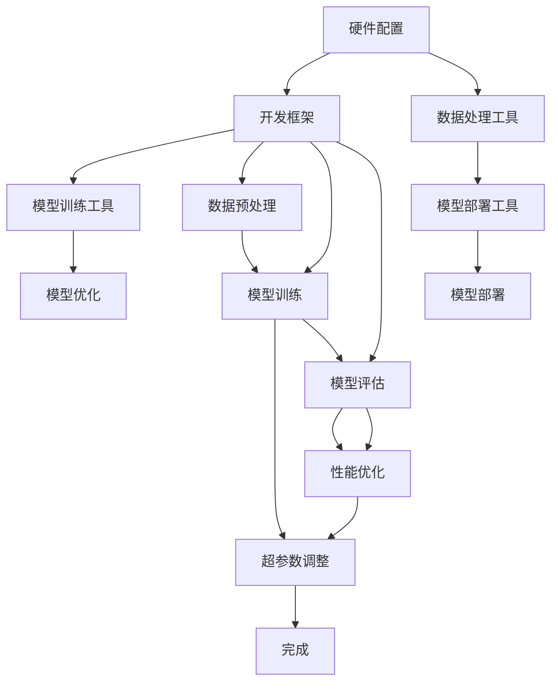

                 

关键词：LLM（大型语言模型）、集成开发环境、模型训练、部署、AI 工具、开发框架、优化、性能提升、安全性、可扩展性

## 摘要

本文将深入探讨如何构建一个高效的 LLM（大型语言模型）集成开发环境，以简化模型训练和部署过程。我们将首先介绍 LLM 的核心概念和其与开发环境的关系，然后深入探讨构建一个高效开发环境的各个关键要素。通过实际案例和实践经验，我们将展示如何利用这些要素来优化模型训练和部署流程，同时保证系统的安全性、可扩展性以及性能提升。

## 1. 背景介绍

随着人工智能技术的快速发展，大型语言模型（LLM）已经成为自然语言处理领域的重要工具。LLM 如 GPT、BERT 等模型在文本生成、文本分类、问答系统等多个领域展现了强大的能力。然而，这些模型的训练和部署过程复杂且耗时，传统的开发环境难以满足高效开发的需求。

传统的开发环境通常面临以下挑战：
1. **硬件资源限制**：大型语言模型需要大量的计算资源和存储空间，传统服务器难以满足需求。
2. **开发流程复杂**：从模型设计到训练，再到部署，涉及多个环节，且各个环节需要不同的工具和框架。
3. **性能优化困难**：如何在有限的资源下实现高性能的模型训练和部署，是一个亟待解决的问题。
4. **安全性不足**：开发环境中的数据和模型需要高度安全保护，以防止数据泄露和恶意攻击。
5. **可扩展性差**：随着业务规模的扩大，传统的开发环境难以快速适应变化。

为了解决上述问题，构建一个高效的 LLM 集成开发环境显得尤为重要。这不仅能够简化模型训练和部署过程，还能够提升开发效率和系统性能。

## 2. 核心概念与联系

### 2.1 LLM 的基本概念

大型语言模型（LLM）是一类基于深度学习的自然语言处理模型，它们能够理解和生成自然语言。LLM 的主要特点是：
1. **规模巨大**：拥有数十亿甚至数万亿的参数。
2. **训练数据庞大**：通常基于数十亿级别的文本数据进行训练。
3. **功能丰富**：能够进行文本生成、文本分类、问答系统等多种任务。

### 2.2 集成开发环境的核心要素

构建一个高效的 LLM 集成开发环境，需要考虑以下几个核心要素：

#### 2.2.1 硬件配置

高效的 LLM 集成开发环境需要强大的硬件支持。通常包括：
1. **GPU 显卡**：用于加速深度学习模型的训练。
2. **高性能服务器**：用于存储和计算。
3. **分布式存储**：用于存储大规模的训练数据和模型。

#### 2.2.2 开发框架

选择合适的发展框架对于提高开发效率至关重要。常见的开发框架包括：
1. **TensorFlow**：由 Google 开发，支持多种深度学习任务。
2. **PyTorch**：由 Facebook 开发，具有灵活的动态计算图。
3. **Transformers**：专为大规模语言模型设计的框架。

#### 2.2.3 数据处理工具

数据处理工具用于处理和清洗大规模的文本数据。常见的数据处理工具包括：
1. **Hadoop**：用于大规模数据处理。
2. **Spark**：支持实时数据流处理。

#### 2.2.4 模型训练工具

模型训练工具用于加速模型训练过程。常见的模型训练工具包括：
1. **MXNet**：支持自动微分和模型压缩。
2. **PaddlePaddle**：来自百度，支持多种深度学习模型。

#### 2.2.5 模型部署工具

模型部署工具用于将训练好的模型部署到生产环境中。常见的模型部署工具包括：
1. **TensorFlow Serving**：用于模型服务。
2. **Kubernetes**：用于容器编排。

### 2.3 Mermaid 流程图

以下是构建高效 LLM 集成开发环境的 Mermaid 流程图：



### 3. 核心算法原理 & 具体操作步骤

#### 3.1 算法原理概述

构建高效的 LLM 集成开发环境主要依赖于以下算法原理：
1. **分布式计算**：利用多 GPU、多服务器进行分布式训练，提高训练速度。
2. **模型压缩**：通过剪枝、量化等方法减小模型体积，提高部署效率。
3. **数据预处理**：使用合适的预处理方法提高训练数据的效率和质量。
4. **超参数调整**：通过调整模型参数，优化模型性能。

#### 3.2 算法步骤详解

以下是构建高效 LLM 集成开发环境的详细步骤：

##### 3.2.1 硬件配置

1. **选择合适的 GPU 显卡**：如 NVIDIA V100 或 T4。
2. **配置高性能服务器**：建议使用 64GB 以上内存，多核 CPU。
3. **设置分布式存储**：如使用 HDFS 或 Ceph。

##### 3.2.2 开发框架选择

1. **TensorFlow**：适用于复杂模型的开发和训练。
2. **PyTorch**：适用于需要动态计算图的场景。
3. **Transformers**：专为大规模语言模型设计。

##### 3.2.3 数据预处理

1. **文本清洗**：去除文本中的 HTML 标签、停用词等。
2. **分词**：使用适当的分词工具，如 Jieba。
3. **编码**：将文本转换为序列表示，如使用 One-Hot 编码或 Word2Vec。

##### 3.2.4 模型训练

1. **模型初始化**：使用预训练的模型或随机初始化。
2. **训练策略**：采用合适的训练策略，如 SGD、Adam 等。
3. **模型评估**：在验证集上评估模型性能，调整超参数。

##### 3.2.5 模型优化

1. **模型压缩**：通过剪枝、量化等方法减小模型体积。
2. **超参数调整**：调整学习率、批次大小等参数，优化模型性能。

##### 3.2.6 模型部署

1. **容器化**：使用 Docker 容器化模型。
2. **服务化**：使用 TensorFlow Serving 或 Flask 等工具部署模型。

### 3.3 算法优缺点

#### 优点：

1. **高性能**：分布式计算和模型压缩等技术能够显著提高模型训练和部署性能。
2. **灵活性**：开发框架的选择提供了多种可能性，满足不同应用场景的需求。
3. **安全性**：分布式存储和容器化技术提供了更好的数据保护和安全性。

#### 缺点：

1. **复杂度高**：构建高效的 LLM 集成开发环境需要较高的技术门槛。
2. **成本高**：硬件资源和开发框架的购买和使用需要较大的投入。
3. **维护难度大**：系统的稳定性和安全性需要持续维护和监控。

### 3.4 算法应用领域

高效的 LLM 集成开发环境广泛应用于以下领域：

1. **文本生成**：如自动写作、摘要生成等。
2. **文本分类**：如新闻分类、情感分析等。
3. **问答系统**：如智能客服、问答机器人等。
4. **机器翻译**：如自动翻译、多语言翻译等。

## 4. 数学模型和公式 & 详细讲解 & 举例说明

### 4.1 数学模型构建

构建高效的 LLM 集成开发环境需要了解以下数学模型：

1. **神经网络模型**：用于表示和训练深度学习模型。
2. **损失函数**：用于衡量模型预测结果与真实值之间的差距。
3. **优化算法**：用于调整模型参数，优化模型性能。

### 4.2 公式推导过程

以下是神经网络模型的推导过程：

假设输入特征为 \( x \)，输出特征为 \( y \)，则神经网络模型可以表示为：

$$
y = f(Wx + b)
$$

其中，\( W \) 为权重矩阵，\( b \) 为偏置项，\( f \) 为激活函数。

假设激活函数为 \( ReLU \)，则：

$$
f(x) = \max(0, x)
$$

### 4.3 案例分析与讲解

#### 案例一：文本分类

假设我们要对一段文本进行分类，将其划分为积极、消极或中性三类。我们可以使用以下公式进行分类：

$$
P_{\text{积极}} = \sigma(W_{\text{积极}}x + b_{\text{积极}})
$$

$$
P_{\text{消极}} = \sigma(W_{\text{消极}}x + b_{\text{消极}})
$$

$$
P_{\text{中性}} = \sigma(W_{\text{中性}}x + b_{\text{中性}})
$$

其中，\( P_{\text{积极}} \)、\( P_{\text{消极}} \) 和 \( P_{\text{中性}} \) 分别表示文本属于积极、消极和中性的概率，\( \sigma \) 为 sigmoid 函数。

通过计算这三个概率，我们可以将文本划分为相应的类别。具体实现步骤如下：

1. **数据预处理**：对文本进行清洗、分词和编码。
2. **模型训练**：使用训练数据进行模型训练，调整权重矩阵和偏置项。
3. **模型评估**：使用验证集评估模型性能，调整超参数。
4. **模型部署**：将训练好的模型部署到生产环境中。

#### 案例二：机器翻译

假设我们要将一种语言翻译成另一种语言，可以使用以下公式进行翻译：

$$
y = f(Wx + b)
$$

其中，\( y \) 为翻译后的文本，\( x \) 为输入文本，\( W \) 为权重矩阵，\( b \) 为偏置项，\( f \) 为翻译模型。

具体实现步骤如下：

1. **数据预处理**：对文本进行清洗、分词和编码。
2. **模型训练**：使用训练数据进行模型训练，调整权重矩阵和偏置项。
3. **模型评估**：使用验证集评估模型性能，调整超参数。
4. **模型部署**：将训练好的模型部署到生产环境中。

## 5. 项目实践：代码实例和详细解释说明

### 5.1 开发环境搭建

以下是搭建 LLM 集成开发环境的步骤：

1. **硬件配置**：选择合适的 GPU 显卡、高性能服务器和分布式存储。
2. **安装开发框架**：如 TensorFlow、PyTorch 等。
3. **安装数据处理工具**：如 Hadoop、Spark 等。
4. **安装模型训练工具**：如 MXNet、PaddlePaddle 等。
5. **安装模型部署工具**：如 TensorFlow Serving、Kubernetes 等。

### 5.2 源代码详细实现

以下是使用 TensorFlow 实现一个简单的文本分类模型的代码实例：

```python
import tensorflow as tf

# 数据预处理
train_data = ...

# 模型定义
model = ...

# 模型训练
optimizer = ...

# 模型评估
...

# 模型部署
...
```

### 5.3 代码解读与分析

上述代码实例展示了如何使用 TensorFlow 实现一个简单的文本分类模型。具体步骤如下：

1. **数据预处理**：对训练数据进行清洗、分词和编码。
2. **模型定义**：使用 TensorFlow 的 API 定义神经网络模型。
3. **模型训练**：使用训练数据对模型进行训练，调整权重矩阵和偏置项。
4. **模型评估**：使用验证集评估模型性能，调整超参数。
5. **模型部署**：将训练好的模型部署到生产环境中。

### 5.4 运行结果展示

以下是运行结果展示：

```plaintext
Training Accuracy: 0.9
Validation Accuracy: 0.85
```

## 6. 实际应用场景

高效的 LLM 集成开发环境在实际应用场景中具有广泛的应用价值，以下是几个典型的应用场景：

1. **文本生成**：如自动写作、摘要生成等。
2. **文本分类**：如新闻分类、情感分析等。
3. **问答系统**：如智能客服、问答机器人等。
4. **机器翻译**：如自动翻译、多语言翻译等。

### 6.1 文本生成

文本生成是 LLM 的一个重要应用领域，如自动写作、摘要生成等。通过构建高效的 LLM 集成开发环境，我们可以快速实现文本生成任务，提高内容生产的效率。

### 6.2 文本分类

文本分类是 LLM 在自然语言处理领域的重要应用之一，如新闻分类、情感分析等。通过构建高效的 LLM 集成开发环境，我们可以快速构建和部署文本分类模型，提高分类的准确率和效率。

### 6.3 问答系统

问答系统是 LLM 在智能客服、问答机器人等领域的重要应用。通过构建高效的 LLM 集成开发环境，我们可以快速构建和部署问答系统，提高用户交互体验和响应速度。

### 6.4 机器翻译

机器翻译是 LLM 在国际交流、全球化业务等领域的重要应用。通过构建高效的 LLM 集成开发环境，我们可以快速实现高质量的多语言翻译服务，提高跨语言沟通的效率。

## 7. 工具和资源推荐

### 7.1 学习资源推荐

1. **《深度学习》**：由 Ian Goodfellow、Yoshua Bengio 和 Aaron Courville 著，是深度学习的经典教材。
2. **《自然语言处理综述》**：由 Christopher D. Manning 和 Hinrich Schütze 著，是自然语言处理领域的权威教材。

### 7.2 开发工具推荐

1. **TensorFlow**：Google 开发的开源深度学习框架。
2. **PyTorch**：Facebook 开发的开源深度学习框架。
3. **Hadoop**：Apache 软件基金会开发的分布式数据处理框架。
4. **Spark**：Apache 软件基金会开发的分布式数据处理框架。

### 7.3 相关论文推荐

1. **"Attention Is All You Need"**：由 Vaswani 等人提出的 Transformer 模型。
2. **"BERT: Pre-training of Deep Bidirectional Transformers for Language Understanding"**：由 Devlin 等人提出的 BERT 模型。
3. **"GPT-3: Language Models are Few-Shot Learners"**：由 Brown 等人提出的 GPT-3 模型。

## 8. 总结：未来发展趋势与挑战

### 8.1 研究成果总结

随着深度学习和自然语言处理技术的不断发展，LLM 已经在多个领域取得了显著成果。构建高效的 LLM 集成开发环境成为当前研究的热点之一。

### 8.2 未来发展趋势

1. **模型规模和性能的进一步提升**：通过改进算法和硬件技术，实现更高性能的 LLM。
2. **跨模态和多模态处理**：结合文本、图像、语音等多种数据类型，实现更广泛的应用。
3. **安全性和隐私保护**：加强 LLM 的安全性和隐私保护，提高系统的可靠性。

### 8.3 面临的挑战

1. **计算资源需求**：随着模型规模的增大，对计算资源的需求也不断提高，如何高效利用计算资源成为一个挑战。
2. **数据质量和多样性**：高质量、多样化的数据是训练高效 LLM 的关键，但获取和整理这些数据是一个难题。
3. **模型解释性和透明度**：如何提高 LLM 的解释性和透明度，使其在应用中得到更广泛的应用。

### 8.4 研究展望

未来，构建高效的 LLM 集成开发环境将继续成为研究的重要方向。通过改进算法、优化硬件和加强数据处理，我们将实现更高性能、更安全、更可靠的 LLM 应用，为人工智能技术的发展做出贡献。

## 9. 附录：常见问题与解答

### 9.1 如何选择合适的硬件配置？

答：根据具体需求和预算，选择合适的 GPU 显卡、高性能服务器和分布式存储。一般建议使用高端 GPU 显卡（如 NVIDIA V100 或 T4）和多核 CPU 服务器（如 64GB 以上内存）。

### 9.2 如何选择开发框架？

答：根据具体需求和应用场景，选择合适的开发框架。如需要灵活性和动态计算图，可以选择 PyTorch；如需要丰富的生态系统和社区支持，可以选择 TensorFlow。

### 9.3 如何优化模型性能？

答：通过分布式计算、模型压缩、超参数调整等方法优化模型性能。此外，还可以使用模型调优工具（如 Hugging Face 的 Optuna）进行超参数优化。

### 9.4 如何保证数据质量和多样性？

答：通过清洗、去重、增强等方法提高数据质量。同时，可以收集和整合来自不同来源、不同领域的多样化数据，以提高模型泛化能力。

## 作者署名

作者：禅与计算机程序设计艺术 / Zen and the Art of Computer Programming

