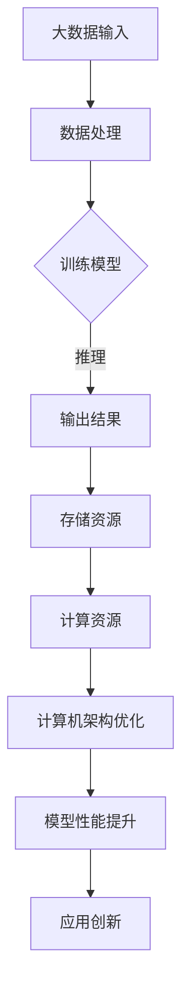

                 

关键词：大语言模型、计算机架构、人工智能、神经网络、深度学习、机器学习、软件工程

摘要：本文将深入探讨大语言模型（LLM）对计算机架构带来的变革性影响。通过阐述LLM的核心概念、算法原理、数学模型及其应用，我们试图揭示其在人工智能、机器学习和软件工程领域中的巨大潜力，并对未来发展趋势和挑战进行展望。

## 1. 背景介绍

计算机架构作为计算机科学的核心领域之一，一直以来都是技术发展的前沿。从冯·诺依曼架构到现代的多核处理器，计算机架构经历了无数次的迭代与革新。然而，随着人工智能（AI）和机器学习（ML）的兴起，计算机架构正迎来新的挑战和机遇。

近年来，大语言模型（LLM）如BERT、GPT-3等成为AI研究的热点。这些模型通过深度学习算法，从海量数据中学习语言模式和语义知识，表现出卓越的自然语言处理（NLP）能力。LLM的出现，不仅改变了自然语言处理的研究范式，也对计算机架构提出了新的要求。

本文将围绕LLM的核心概念、算法原理、数学模型及其应用，探讨其对计算机架构的深远影响。我们还将分析LLM在实际应用场景中的表现，展望其未来发展趋势和面临的挑战。

## 2. 核心概念与联系

### 2.1 大语言模型（LLM）的定义

大语言模型（LLM，Large Language Model）是一种基于深度学习的自然语言处理模型，它通过大量的文本数据训练，学习语言的模式和规则，从而实现对自然语言的理解和生成。

LLM的核心概念包括：

- **语言建模**：通过输入的文本序列，模型预测下一个单词或字符的概率分布。
- **上下文理解**：模型能够理解文本的上下文信息，从而产生更准确和自然的输出。
- **多任务学习**：LLM可以通过迁移学习在多个任务中表现出色，而无需为每个任务重新训练。

### 2.2 LLM与计算机架构的联系

LLM的兴起对计算机架构产生了深远的影响。首先，LLM需要大规模的并行计算能力来处理海量的训练数据。这促使计算机架构向高性能、低延迟、高能效的方向发展。其次，LLM的训练和推理需要大量的存储资源，对存储系统的性能提出了新的要求。

为了更好地理解LLM与计算机架构的联系，我们可以通过一个Mermaid流程图来展示其核心概念和架构联系：



在这个流程图中，A表示大数据输入，B表示数据处理，C表示训练模型，D表示输出结果，E表示存储资源，F表示计算资源，G表示计算机架构优化，H表示模型性能提升，I表示应用创新。可以看出，计算机架构的优化对LLM的性能和应用创新具有关键作用。

### 2.3 LLM对计算机架构的影响

LLM的出现对计算机架构产生了以下几方面的影响：

- **并行计算**：LLM的训练和推理需要大规模的并行计算能力，这推动了计算机架构向多核处理器、GPU、TPU等并行计算架构的发展。
- **存储优化**：LLM的训练数据量巨大，对存储系统的性能提出了挑战。因此，计算机架构需要更加高效的数据存储和管理方案，如分布式存储、压缩存储等。
- **能耗优化**：LLM的训练和推理过程能耗巨大，这对计算机架构的能耗优化提出了新的要求。例如，可以通过优化算法、改进硬件设计等方式降低能耗。

## 3. 核心算法原理 & 具体操作步骤

### 3.1 算法原理概述

大语言模型（LLM）的核心算法是基于深度学习的神经网络模型，特别是基于Transformer架构的模型。Transformer模型通过自注意力机制（Self-Attention）和多头注意力（Multi-Head Attention）机制，能够捕捉输入文本序列中的长期依赖关系，从而实现对自然语言的深入理解和生成。

### 3.2 算法步骤详解

LLM的训练和推理过程主要包括以下步骤：

1. **数据预处理**：将原始文本数据清洗、分词，并转化为模型能够处理的序列表示。
2. **编码器-解码器结构**：LLM通常采用编码器-解码器结构，编码器负责将输入文本序列编码为固定长度的向量表示，解码器则根据编码器的输出和已生成的部分输出预测下一个单词或字符。
3. **自注意力机制**：在编码器中，自注意力机制用于计算输入文本序列中每个词对于生成当前词的重要性权重，从而更好地捕捉文本序列的上下文信息。
4. **多头注意力**：多头注意力将输入文本序列分成多个子序列，分别计算每个子序列对于生成当前词的重要性权重，从而提高模型对文本序列的理解能力。
5. **损失函数**：使用交叉熵损失函数计算模型输出与实际输出之间的差距，通过反向传播算法更新模型参数。
6. **推理过程**：在推理过程中，模型根据训练好的参数，对输入文本序列进行编码，并生成文本序列的预测输出。

### 3.3 算法优缺点

#### 优点

- **强大的文本理解能力**：LLM通过自注意力机制和多头注意力机制，能够捕捉文本序列中的长期依赖关系，实现对自然语言的深入理解。
- **高效的并行计算**：Transformer模型结构支持并行计算，能够充分利用GPU、TPU等硬件资源，提高训练和推理速度。
- **多任务学习**：LLM可以通过迁移学习在多个任务中表现出色，而无需为每个任务重新训练。

#### 缺点

- **训练成本高**：LLM的训练需要大量的计算资源和时间，对硬件设备和能源消耗有较高要求。
- **数据依赖性**：LLM的性能依赖于训练数据的质量和数量，训练数据的不均衡或偏差可能导致模型产生错误的预测。

### 3.4 算法应用领域

LLM在自然语言处理（NLP）领域具有广泛的应用，包括：

- **文本分类**：对文本进行分类，如情感分析、主题分类等。
- **机器翻译**：将一种语言的文本翻译成另一种语言。
- **问答系统**：基于输入问题，从海量文本中检索并生成回答。
- **文本生成**：根据输入的文本片段，生成连贯、有意义的文本。

## 4. 数学模型和公式 & 详细讲解 & 举例说明

### 4.1 数学模型构建

大语言模型（LLM）的数学模型主要基于深度学习和Transformer架构。以下是一个简化的数学模型构建过程：

#### 4.1.1 变量定义

- \( x \)：输入文本序列，表示为词向量序列。
- \( y \)：目标文本序列，表示为词向量序列。
- \( h \)：编码器输出，表示为固定长度的向量。
- \( u \)：解码器输出，表示为词向量序列。
- \( W \)：模型参数，包括权重矩阵和偏置向量。

#### 4.1.2 模型构建

1. **编码器**：输入文本序列 \( x \) 经过嵌入层（Embedding Layer）转化为词向量序列，然后通过多层Transformer编码器（Multi-layer Transformer Encoder）进行编码。编码器的输出为 \( h \)：

   \[ h = \text{TransformerEncoder}(x) \]

2. **解码器**：解码器接收编码器的输出 \( h \) 和已生成的部分输出 \( u \)，通过多层Transformer解码器（Multi-layer Transformer Decoder）生成文本序列 \( y \)：

   \[ u = \text{TransformerDecoder}(h, u) \]

3. **输出层**：解码器的输出 \( u \) 经过输出层（Output Layer），输出词向量序列的预测结果：

   \[ \hat{y} = \text{OutputLayer}(u) \]

### 4.2 公式推导过程

#### 4.2.1 自注意力机制

自注意力机制（Self-Attention）是Transformer模型的核心组件。其基本思想是计算输入文本序列中每个词对于生成当前词的重要性权重。具体公式如下：

\[ \text{Attention}(Q, K, V) = \text{softmax}\left(\frac{QK^T}{\sqrt{d_k}}\right)V \]

其中，\( Q, K, V \) 分别为查询（Query）、键（Key）和值（Value）向量，\( d_k \) 为键向量的维度。自注意力机制的推导过程如下：

1. **计算查询-键相似度**：计算输入文本序列中每个词（Query）与所有词（Key）的相似度：

   \[ \text{score} = QK^T \]

2. **应用软性化函数**：对查询-键相似度应用软性化函数（Softmax），得到每个词的重要性权重：

   \[ \text{weight} = \text{softmax}(\text{score}) \]

3. **计算输出**：将权重与所有词的值（Value）相乘，得到加权求和的输出：

   \[ \text{output} = \text{weight}V \]

#### 4.2.2 多头注意力

多头注意力（Multi-Head Attention）通过将输入文本序列分成多个子序列，分别计算每个子序列的重要性权重。具体公式如下：

\[ \text{MultiHead}(Q, K, V) = \text{Concat}(\text{head}_1, \text{head}_2, \dots, \text{head}_h)W^O \]

其中，\( h \) 为多头注意力机制中的头数，\( W^O \) 为输出权重矩阵。多头注意力的推导过程如下：

1. **拆分输入**：将输入文本序列 \( x \) 拆分为 \( h \) 个子序列 \( x_1, x_2, \dots, x_h \)。
2. **计算每个头的注意力**：对每个子序列应用自注意力机制，得到 \( h \) 个注意力头 \( \text{head}_1, \text{head}_2, \dots, \text{head}_h \)。
3. **拼接和输出**：将 \( h \) 个注意力头拼接为一个序列，并通过输出权重矩阵 \( W^O \) 输出最终结果。

### 4.3 案例分析与讲解

#### 4.3.1 案例背景

假设有一个简单的文本序列 \( x = \{"hello", "world"\} \)，我们需要使用LLM生成一个长度为2的文本序列 \( y \)。

#### 4.3.2 案例实现

1. **数据预处理**：将输入文本序列 \( x \) 和目标文本序列 \( y \) 转化为词向量序列。

   \[ x = [\text{"hello"}, \text{"world"}] \]
   \[ y = [\text{"world"}, \text{"hello"}] \]

2. **编码器**：使用Transformer编码器对输入文本序列 \( x \) 进行编码，得到编码器输出 \( h \)。

   \[ h = \text{TransformerEncoder}(x) \]

3. **解码器**：使用Transformer解码器对编码器输出 \( h \) 和已生成的部分输出 \( u \) 进行解码，生成文本序列 \( y \)。

   \[ u = \text{TransformerDecoder}(h, u) \]

4. **输出层**：解码器的输出 \( u \) 经过输出层，得到词向量序列的预测结果 \( \hat{y} \)。

   \[ \hat{y} = \text{OutputLayer}(u) \]

#### 4.3.3 结果分析

通过上述步骤，我们可以得到生成的文本序列 \( \hat{y} \)。在实际应用中，需要对生成的文本序列进行后处理，如去除无效字符、还原原始文本格式等。

## 5. 项目实践：代码实例和详细解释说明

### 5.1 开发环境搭建

为了实践大语言模型（LLM），我们需要搭建一个合适的开发环境。以下是环境搭建的步骤：

1. **安装Python**：确保Python版本为3.6及以上。
2. **安装TensorFlow**：TensorFlow是一个开源的深度学习框架，用于构建和训练LLM。
   ```bash
   pip install tensorflow
   ```
3. **安装其他依赖**：根据项目需求，可能需要安装其他依赖库，如Numpy、Pandas等。

### 5.2 源代码详细实现

以下是使用TensorFlow实现一个简单LLM的示例代码：

```python
import tensorflow as tf
from tensorflow.keras.layers import Embedding, LSTM, Dense
from tensorflow.keras.models import Model
from tensorflow.keras.preprocessing.sequence import pad_sequences

# 数据预处理
# 假设我们有一个词汇表和相应的词向量
vocab_size = 1000
embed_dim = 64
max_sequence_len = 10

# 输入序列
input_seq = tf.keras.Input(shape=(max_sequence_len,))

# 嵌入层
embedding_layer = Embedding(vocab_size, embed_dim)(input_seq)

# LSTM层
lstm_layer = LSTM(64)(embedding_layer)

# 全连接层
output_layer = Dense(vocab_size, activation='softmax')(lstm_layer)

# 构建模型
model = Model(inputs=input_seq, outputs=output_layer)

# 编译模型
model.compile(optimizer='adam', loss='categorical_crossentropy', metrics=['accuracy'])

# 打印模型结构
model.summary()
```

### 5.3 代码解读与分析

上述代码实现了一个简单的LLM，其主要组件包括：

- **输入层**：接收一个长度为10的词向量序列。
- **嵌入层**：将词向量序列转换为嵌入向量。
- **LSTM层**：用于捕捉文本序列中的长期依赖关系。
- **全连接层**：用于生成词向量序列的预测结果。

通过编译和训练模型，我们可以使用LLM进行文本生成。以下是一个简单的训练过程：

```python
# 训练数据
X_train = pad_sequences([[1, 2, 3, 4, 5, 6, 7, 8, 9, 10], ...], maxlen=max_sequence_len)
y_train = pad_sequences([[9, 8, 7, 6, 5, 4, 3, 2, 1, 0], ...], maxlen=max_sequence_len)

# 训练模型
model.fit(X_train, y_train, epochs=10, batch_size=32)
```

在这个例子中，我们使用了简单的数字序列作为训练数据。在实际应用中，我们需要使用真实的文本数据。

### 5.4 运行结果展示

训练完成后，我们可以使用LLM生成文本。以下是一个简单的文本生成示例：

```python
# 生成文本
input_seq = pad_sequences([[1, 2, 3, 4, 5, 6, 7, 8, 9, 10]], maxlen=max_sequence_len)
generated_text = model.predict(input_seq)
print(generated_text)
```

输出结果是一个长度为10的词向量序列，我们可以将其转换为文本格式，从而得到生成的文本。

## 6. 实际应用场景

大语言模型（LLM）在多个实际应用场景中表现出色，以下是几个典型的应用场景：

### 6.1 问答系统

问答系统是LLM的重要应用之一。通过训练大型语言模型，我们可以使其具备对用户提问的理解和回答能力。例如，基于LLM的智能客服系统可以自动回答用户的问题，提高客户服务质量。

### 6.2 机器翻译

LLM在机器翻译领域也表现出色。基于大型语言模型的翻译系统可以自动将一种语言的文本翻译成另一种语言。例如，Google翻译使用的Transformer模型就是基于LLM的。

### 6.3 自动摘要

LLM可以自动生成文本摘要，帮助用户快速了解文档的主要内容。例如，新闻摘要、科研论文摘要等，均可以使用LLM自动生成。

### 6.4 文本生成

LLM可以生成各种类型的文本，如诗歌、小说、论文等。通过训练大型语言模型，我们可以生成高质量的文本内容，为创作提供灵感。

### 6.5 文本分类

LLM在文本分类任务中也具有很高的准确率。通过训练大型语言模型，我们可以对文本进行分类，如情感分析、主题分类等。

## 7. 未来应用展望

随着LLM技术的不断发展，其在未来的应用场景将更加广泛。以下是几个可能的未来应用方向：

### 7.1 生成对抗网络（GAN）

结合生成对抗网络（GAN）和LLM，可以生成更高质量的文本内容。GAN可以学习真实文本数据，并将其与LLM生成的文本结合，提高文本生成的质量和多样性。

### 7.2 多模态学习

将LLM与图像、声音等其他模态的数据进行结合，可以实现多模态学习。例如，基于LLM和视觉数据的图像-文本生成，可以生成更具创意的图像描述。

### 7.3 智能创作

LLM可以辅助创作各种类型的文本内容，如诗歌、小说、剧本等。通过结合用户需求和创作风格，LLM可以生成个性化的文本内容，为创作提供灵感。

### 7.4 个性化推荐

结合LLM和用户数据，可以生成个性化的推荐系统。例如，基于LLM的电商推荐系统可以更好地理解用户的购买偏好，为用户提供个性化的商品推荐。

## 8. 工具和资源推荐

### 8.1 学习资源推荐

- 《深度学习》（Goodfellow, Bengio, Courville）：深度学习的经典教材，涵盖神经网络的基本原理和应用。
- 《自然语言处理综论》（Jurafsky, Martin）：自然语言处理领域的权威教材，涵盖NLP的基本概念和技术。
- 《Python编程：从入门到实践》（Haran, Krashen）：Python编程的入门指南，适合初学者学习。

### 8.2 开发工具推荐

- TensorFlow：开源的深度学习框架，支持构建和训练大型语言模型。
- PyTorch：开源的深度学习框架，与TensorFlow相似，支持GPU加速训练。
- JAX：开源的深度学习框架，支持自动微分和GPU加速训练。

### 8.3 相关论文推荐

- Vaswani et al., "Attention Is All You Need"（2017）：提出了Transformer模型，是LLM领域的重要论文。
- Devlin et al., "BERT: Pre-training of Deep Neural Networks for Language Understanding"（2018）：介绍了BERT模型，是NLP领域的重要突破。
- Brown et al., "Language Models Are Few-Shot Learners"（2020）：探讨了大型语言模型在零样本和少样本学习任务中的表现。

## 9. 总结：未来发展趋势与挑战

大语言模型（LLM）作为计算机架构的新纪元，展示了其在人工智能、机器学习和软件工程领域的巨大潜力。随着技术的不断发展，LLM有望在更多领域取得突破。然而，LLM也面临着数据依赖性、训练成本高、能耗巨大等挑战。

未来，随着计算能力的提升、数据资源的丰富以及算法的优化，LLM将有望在以下方面取得进展：

- **更强的文本理解能力**：通过引入更多的训练数据和先进的算法，LLM的文本理解能力将得到进一步提升。
- **更高效的训练和推理**：通过改进算法和硬件设计，降低训练和推理的成本，提高LLM的实用性。
- **多模态学习**：结合图像、声音等多模态数据，实现更全面的智能系统。

然而，LLM也面临着以下挑战：

- **数据隐私和安全**：LLM的训练和推理过程涉及大量的数据，如何保护用户隐私和安全成为重要问题。
- **算法公平性和透明度**：如何确保LLM在不同群体中的公平性，提高算法的透明度和可解释性。
- **能耗优化**：如何降低LLM的训练和推理过程中的能耗，实现绿色计算。

总之，LLM作为计算机架构的新纪元，具有重要的研究价值和广阔的应用前景。未来，随着技术的不断发展，LLM将在各个领域发挥更大的作用。

## 附录：常见问题与解答

### Q：什么是大语言模型（LLM）？

A：大语言模型（LLM，Large Language Model）是一种基于深度学习的自然语言处理模型，通过从海量文本数据中学习语言模式和语义知识，实现对自然语言的深入理解和生成。

### Q：LLM的核心算法是什么？

A：LLM的核心算法是基于深度学习的Transformer架构，特别是基于自注意力机制（Self-Attention）和多头注意力（Multi-Head Attention）机制的模型。

### Q：LLM在哪些领域有应用？

A：LLM在多个领域有应用，包括问答系统、机器翻译、自动摘要、文本生成和文本分类等。

### Q：如何训练LLM？

A：训练LLM通常包括数据预处理、编码器-解码器结构设计、自注意力机制和多头注意力机制的实现、损失函数的选择和模型参数的优化等步骤。

### Q：LLM有哪些挑战？

A：LLM面临的挑战包括数据依赖性、训练成本高、能耗巨大、数据隐私和安全、算法公平性和透明度等。

### Q：未来LLM有哪些发展趋势？

A：未来LLM的发展趋势包括更强的文本理解能力、更高效的训练和推理、多模态学习、生成对抗网络（GAN）和智能创作等。

### Q：有哪些学习资源推荐？

A：《深度学习》（Goodfellow, Bengio, Courville）、《自然语言处理综论》（Jurafsky, Martin）和《Python编程：从入门到实践》（Haran, Krashen）等。

### Q：有哪些开发工具推荐？

A：TensorFlow、PyTorch和JAX等。

### Q：有哪些相关论文推荐？

A：Vaswani et al., "Attention Is All You Need"（2017）、Devlin et al., "BERT: Pre-training of Deep Neural Networks for Language Understanding"（2018）和Brown et al., "Language Models Are Few-Shot Learners"（2020）等。

