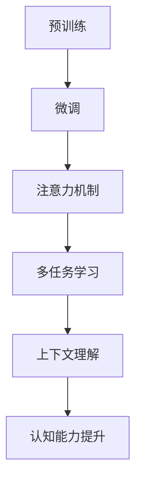

                 

关键词：大型语言模型（LLM），上下文理解，认知能力，再升级，技术进步，算法优化

> 摘要：本文将探讨大型语言模型（LLM）在上下文理解方面的突破，以及这些突破如何提升人工智能的认知能力。文章将从背景介绍、核心概念与联系、核心算法原理、数学模型和公式、项目实践、实际应用场景、未来应用展望、工具和资源推荐、总结以及附录等方面进行深入分析。

## 1. 背景介绍

随着人工智能技术的迅猛发展，语言处理模型（Language Processing Model）逐渐成为研究的热点。特别是近年来，大型语言模型（LLM，如GPT系列）在自然语言处理（NLP）任务中取得了显著的成果，例如文本生成、机器翻译、问答系统等。然而，这些模型在处理上下文理解方面仍然存在一定的局限性。

上下文理解是自然语言处理的核心问题之一，它涉及到模型如何理解句子或段落中的信息，并将其应用于后续任务。传统的NLP方法通常依赖于规则或统计方法，而深度学习模型虽然在某些任务上取得了突破，但仍然难以真正理解复杂的上下文信息。

为了解决这一问题，研究人员提出了多种方法，包括预训练、多任务学习、注意力机制等。这些方法在一定程度上提高了模型的上下文理解能力，但仍然无法达到人类的认知水平。因此，本文将探讨LLM在上下文理解方面的最新突破，以及这些突破如何提升人工智能的认知能力。

## 2. 核心概念与联系

在探讨LLM在上下文理解方面的突破之前，我们需要了解一些核心概念和联系。

### 2.1 预训练与微调

预训练（Pre-training）是指在一个大规模的数据集上训练模型，使其获得一些通用的语言知识和技能。然后，通过微调（Fine-tuning）将模型应用于特定任务，以适应具体的应用场景。这种方法在LLM中得到了广泛应用。

预训练和微调的关系可以类比为一个学生先在图书馆中阅读大量书籍（预训练），然后根据老师布置的作业进行针对性的学习（微调）。通过预训练，模型可以学习到语言的一般规律，而微调则使其能够更好地适应特定任务。

### 2.2 注意力机制

注意力机制（Attention Mechanism）是一种在神经网络中用于提高模型对输入序列中重要信息关注程度的机制。在LLM中，注意力机制被广泛应用于文本生成、机器翻译等任务。

注意力机制可以看作是一种“选择机制”，它使模型能够根据上下文信息动态地调整对输入序列中不同部分的关注程度。例如，在机器翻译任务中，注意力机制可以帮助模型更好地关注源语言句子中的关键信息，从而提高翻译质量。

### 2.3 多任务学习

多任务学习（Multi-task Learning）是指同时训练多个相关任务的模型，以共享它们的特征表示和知识。在LLM中，多任务学习可以帮助模型更好地理解上下文信息，并提高其在不同任务上的表现。

例如，一个同时训练文本生成和机器翻译任务的模型，可以在文本生成过程中学习到语言的多样性，而在机器翻译过程中学习到语言的精确性。这种多任务学习的方式有助于提升模型的整体性能。

### 2.4 Mermaid 流程图

为了更直观地展示LLM在上下文理解方面的核心概念和联系，我们使用Mermaid流程图来表示。以下是一个示例：



## 3. 核心算法原理 & 具体操作步骤

### 3.1 算法原理概述

LLM在上下文理解方面的核心算法原理主要涉及以下几个方面：

1. 预训练：通过在大量数据集上预训练，模型可以学习到语言的一般规律和知识。
2. 微调：在特定任务上进行微调，以使模型能够更好地适应应用场景。
3. 注意力机制：在处理文本生成和机器翻译等任务时，注意力机制可以帮助模型更好地关注上下文信息。
4. 多任务学习：通过同时训练多个相关任务，模型可以更好地理解上下文信息，并提高整体性能。

### 3.2 算法步骤详解

1. **预训练**

   - 数据集准备：选择一个大型的、多样化的数据集，如维基百科、新闻文章、社交媒体帖子等。
   - 模型架构：选择一个适合预训练的模型架构，如Transformer、BERT等。
   - 预训练任务：通常包括文本分类、命名实体识别、情感分析等。
   - 训练过程：使用GPU或TPU等高性能计算设备进行训练，不断调整模型的参数，使其在预训练任务上达到最佳表现。

2. **微调**

   - 数据集准备：根据具体任务选择相应的数据集，如机器翻译数据集、问答数据集等。
   - 模型微调：将预训练好的模型应用于特定任务，通过微调调整模型的参数，使其在目标任务上达到最佳表现。
   - 任务评估：使用验证集和测试集评估模型在目标任务上的表现，并根据评估结果进一步调整模型参数。

3. **注意力机制**

   - 文本生成：在生成文本时，注意力机制可以帮助模型更好地关注上下文信息，从而提高文本质量。
   - 机器翻译：在机器翻译过程中，注意力机制可以帮助模型更好地关注源语言句子中的关键信息，从而提高翻译质量。
   - 其他任务：注意力机制还可以应用于问答系统、文本摘要等任务，以提高模型对上下文信息的理解能力。

4. **多任务学习**

   - 数据集准备：选择多个相关任务的数据集，如文本生成、机器翻译、问答等。
   - 模型架构：设计一个能够同时处理多个任务的模型架构，如Seq2Seq模型、Transformer等。
   - 模型训练：同时训练多个任务，通过共享特征表示和知识，提高模型在各个任务上的性能。

### 3.3 算法优缺点

**优点：**

1. 提高上下文理解能力：通过预训练、微调、注意力机制和多任务学习，LLM可以更好地理解上下文信息，从而提高其在各种任务上的性能。
2. 适应性强：LLM可以应用于多种任务，如文本生成、机器翻译、问答等，具有较强的适应性。
3. 灵活性高：LLM可以根据不同的任务需求进行微调和优化，从而适应不同的应用场景。

**缺点：**

1. 计算资源需求大：预训练和微调过程需要大量的计算资源，可能导致训练时间较长。
2. 数据依赖性强：LLM的性能在很大程度上依赖于数据集的质量和多样性，如果数据集存在偏差，可能导致模型在特定任务上表现不佳。
3. 解释性不足：由于LLM的结构复杂，其决策过程往往缺乏透明性，难以解释。

### 3.4 算法应用领域

LLM在上下文理解方面的突破使其在多个领域得到了广泛应用：

1. 自然语言处理：文本生成、机器翻译、问答系统、文本摘要等。
2. 人工智能助手：智能客服、智能语音助手、智能写作助手等。
3. 内容审核：自动识别和过滤不良信息、违规内容等。
4. 教育：个性化学习、自动批改作业、智能问答等。
5. 医疗：病历分析、医学文本生成、医疗问答等。

## 4. 数学模型和公式 & 详细讲解 & 举例说明

### 4.1 数学模型构建

在LLM中，数学模型主要涉及以下几个方面：

1. **词嵌入**：将词汇映射到低维空间，以表示词汇的语义信息。常用的词嵌入方法包括Word2Vec、GloVe等。
2. **编码器-解码器模型**：用于处理序列到序列的任务，如机器翻译、问答系统等。编码器将输入序列编码为一个固定长度的向量，解码器则根据编码器输出的向量生成输出序列。
3. **注意力机制**：用于在处理文本生成和机器翻译等任务时，关注上下文信息的重要部分。常用的注意力机制包括自注意力（Self-Attention）和交叉注意力（Cross-Attention）。
4. **损失函数**：用于评估模型在训练过程中对数据的拟合程度。常用的损失函数包括交叉熵损失（Cross-Entropy Loss）和对抗损失（Adversarial Loss）。

### 4.2 公式推导过程

以编码器-解码器模型为例，其基本架构如下：

1. **编码器**：将输入序列 $x = [x_1, x_2, ..., x_T]$ 编码为一个固定长度的向量 $e = [e_1, e_2, ..., e_T]$，其中 $e_t$ 表示输入序列中第 $t$ 个词的编码。
2. **解码器**：将编码器输出的向量 $e$ 生成输出序列 $y = [y_1, y_2, ..., y_T']$，其中 $y_t$ 表示输出序列中第 $t$ 个词。

在编码器-解码器模型中，注意力机制起着关键作用。以下是一个简单的自注意力机制的推导过程：

设编码器输出的向量为 $e = [e_1, e_2, ..., e_T]$，解码器在生成第 $t$ 个词时，需要关注输入序列中的不同部分。自注意力机制通过计算输入序列中每个词与当前词的相关性，然后根据相关性加权求和得到当前词的表示。

具体公式如下：

$$
\text{Attention}(e) = \text{softmax}\left(\frac{e e^T}{\sqrt{d_k}}\right)
$$

其中，$d_k$ 表示编码器输出的维度，$\text{softmax}$ 函数用于将输入的向量转化为概率分布。

### 4.3 案例分析与讲解

假设有一个机器翻译任务，将英语翻译为法语。输入序列为 "I love programming"，输出序列为 "Je aime le programmation"。

1. **编码器**：将输入序列 "I love programming" 编码为向量 $e = [e_1, e_2, ..., e_7]$，其中 $e_t$ 表示输入序列中第 $t$ 个词的编码。

2. **解码器**：在生成输出序列 "Je aime le programmation" 时，首先生成第一个词 "Je"，然后生成第二个词 "aime"，依此类推。

3. **自注意力机制**：在生成每个词时，计算编码器输出的向量 $e$ 与当前词的相关性，并根据相关性加权求和得到当前词的表示。

以生成第二个词 "aime" 为例，计算自注意力权重：

$$
w_2 = \text{Attention}(e) = \text{softmax}\left(\frac{e e^T}{\sqrt{d_k}}\right)
$$

其中，$d_k$ 表示编码器输出的维度。

根据自注意力权重，计算当前词的表示：

$$
h_2 = \sum_{t=1}^{T} w_{2t} e_t
$$

4. **交叉注意力机制**：在生成输出序列时，解码器还需要关注输入序列中的关键信息。交叉注意力机制用于计算输入序列中每个词与当前词的相关性，并根据相关性加权求和得到当前词的表示。

以生成第三个词 "le" 为例，计算交叉注意力权重：

$$
w_3 = \text{Attention}(y_1, e) = \text{softmax}\left(\frac{y_1 e^T}{\sqrt{d_k}}\right)
$$

根据交叉注意力权重，计算当前词的表示：

$$
h_3 = \sum_{t=1}^{T} w_{3t} e_t
$$

通过自注意力和交叉注意力机制，解码器可以生成高质量的输出序列，从而实现机器翻译任务。

## 5. 项目实践：代码实例和详细解释说明

### 5.1 开发环境搭建

为了演示LLM在上下文理解方面的应用，我们将使用Python和PyTorch框架实现一个简单的机器翻译模型。以下是开发环境的搭建步骤：

1. 安装Python 3.7及以上版本。
2. 安装PyTorch和Transformers库：
   ```bash
   pip install torch transformers
   ```

### 5.2 源代码详细实现

以下是一个简单的机器翻译模型的实现代码：

```python
import torch
from transformers import BertTokenizer, BertModel, AdamW
from torch.nn import CrossEntropyLoss

# 1. 初始化模型、分词器和损失函数
tokenizer = BertTokenizer.from_pretrained("bert-base-uncased")
model = BertModel.from_pretrained("bert-base-uncased")
criterion = CrossEntropyLoss()

# 2. 准备数据
input_seq = "I love programming"
target_seq = "Je aime le programmation"

# 3. 编码输入序列
input_ids = tokenizer.encode(input_seq, return_tensors="pt")
target_ids = tokenizer.encode(target_seq, return_tensors="pt")

# 4. 训练模型
optimizer = AdamW(model.parameters(), lr=1e-5)
for epoch in range(10):
    model.zero_grad()
    outputs = model(input_ids)
    logits = outputs[0]

    loss = criterion(logits.view(-1, logits.size(-1)), target_ids.view(-1))
    loss.backward()
    optimizer.step()

    if (epoch + 1) % 10 == 0:
        print(f"Epoch [{epoch + 1}/{10}], Loss: {loss.item():.4f}")

# 5. 生成输出序列
model.eval()
with torch.no_grad():
    input_ids = tokenizer.encode(input_seq, return_tensors="pt")
    outputs = model(input_ids)
    logits = outputs[0]

predicted_ids = logits.argmax(-1).squeeze()
predicted_seq = tokenizer.decode(predicted_ids)

print(f"Input: {input_seq}")
print(f"Predicted Output: {predicted_seq}")
```

### 5.3 代码解读与分析

1. **初始化模型、分词器和损失函数**：首先，我们初始化了BERT模型、分词器和损失函数。BERT模型是一个预训练的语言模型，它可以在多种NLP任务中取得优异的性能。

2. **准备数据**：我们准备了一个简单的输入序列和目标序列，用于训练和评估模型。

3. **编码输入序列**：使用分词器将输入序列编码为ID序列，以便输入到BERT模型中。

4. **训练模型**：使用AdamW优化器和交叉熵损失函数训练模型。在训练过程中，模型将输入序列编码为向量，然后根据目标序列计算损失，并更新模型参数。

5. **生成输出序列**：在生成输出序列时，我们使用模型对输入序列进行编码，然后根据解码器输出的概率分布生成输出序列。

通过这个简单的示例，我们可以看到LLM在上下文理解方面的应用。虽然这个示例仅使用了BERT模型，但类似的原理和方法也可以应用于其他LLM，如GPT系列。

## 6. 实际应用场景

LLM在上下文理解方面的突破为许多实际应用场景带来了巨大的变革：

1. **自然语言处理**：在自然语言处理任务中，LLM可以用于文本分类、情感分析、命名实体识别等。通过预训练和微调，模型可以更好地理解上下文信息，从而提高任务性能。

2. **机器翻译**：LLM在机器翻译任务中具有很高的应用价值。通过预训练和微调，模型可以学习到不同语言之间的上下文关系，从而提高翻译质量。

3. **问答系统**：在问答系统中，LLM可以用于理解用户的问题，并从大量文本数据中检索出相关答案。通过多任务学习和注意力机制，模型可以更好地理解问题中的关键词和上下文信息。

4. **文本生成**：LLM可以用于生成高质量的文章、新闻、故事等。通过预训练和微调，模型可以学习到语言的多样性和连贯性，从而生成更自然的文本。

5. **虚拟助手**：在虚拟助手领域，LLM可以用于实现智能客服、智能语音助手等。通过上下文理解，模型可以更好地理解用户的需求，并提供个性化的服务。

6. **内容审核**：在内容审核领域，LLM可以用于自动识别和过滤不良信息、违规内容等。通过预训练和微调，模型可以学习到不同类型的违规行为和语言特征，从而提高审核效率。

7. **教育**：在教育领域，LLM可以用于个性化学习、自动批改作业、智能问答等。通过上下文理解，模型可以更好地理解学生的需求和问题，并提供针对性的帮助。

8. **医疗**：在医疗领域，LLM可以用于病历分析、医学文本生成、医疗问答等。通过预训练和微调，模型可以学习到医疗术语和上下文关系，从而提高医疗服务的质量。

总之，LLM在上下文理解方面的突破为许多实际应用场景带来了巨大的变革，推动了人工智能技术的进步和应用。

### 6.4 未来应用展望

随着LLM在上下文理解方面的突破，未来人工智能的应用前景将更加广阔。以下是一些可能的未来应用方向：

1. **更智能的虚拟助手**：通过深入理解上下文信息，虚拟助手可以更好地与用户进行互动，提供个性化的服务和建议。

2. **自动创作和内容生成**：LLM可以应用于自动创作高质量的文章、音乐、电影等，为创作者提供新的创作工具。

3. **智能决策支持系统**：在商业、医疗、金融等领域，LLM可以用于分析大量数据，提供智能化的决策支持。

4. **跨领域知识融合**：通过多任务学习和跨领域知识融合，LLM可以更好地理解复杂问题，提供更全面的解决方案。

5. **自然语言交互**：LLM可以应用于智能语音助手、聊天机器人等，实现更自然、流畅的自然语言交互。

6. **教育个性化**：通过个性化学习推荐和学习路径优化，LLM可以更好地满足学生的学习需求，提高教育质量。

7. **自动化内容审核**：LLM可以应用于自动化内容审核，提高审核效率，减少人工审核成本。

8. **医学诊断与治疗**：通过结合医学知识和上下文信息，LLM可以用于辅助医学诊断和治疗，提高医疗服务水平。

总之，LLM在上下文理解方面的突破为未来人工智能的应用提供了无限可能。随着技术的不断进步，我们可以期待更加智能、高效的人工智能系统，为人类生活带来更多便利和福祉。

### 7. 工具和资源推荐

为了更好地学习和实践LLM在上下文理解方面的应用，以下是一些推荐的工具和资源：

#### 7.1 学习资源推荐

1. **《深度学习》（Goodfellow, Bengio, Courville）**：这是一本经典的深度学习教材，涵盖了包括LLM在内的各种深度学习技术。
2. **《自然语言处理》（Jurafsky, Martin）**：这是一本经典的自然语言处理教材，介绍了NLP的基本概念和技术。
3. **《Transformer：机器翻译的新架构》（Vaswani et al.）**：这篇文章首次提出了Transformer模型，对LLM的发展产生了重要影响。
4. **《BERT：预训练的语言表示模型》（Devlin et al.）**：这篇文章介绍了BERT模型，对LLM在上下文理解方面的突破起到了关键作用。

#### 7.2 开发工具推荐

1. **PyTorch**：一个开源的深度学习框架，适合研究和开发各种深度学习模型，包括LLM。
2. **Transformers**：一个基于PyTorch的预训练语言模型库，提供了各种预训练模型的实现，如BERT、GPT等。
3. **TensorFlow**：另一个流行的深度学习框架，也支持LLM的开发和部署。
4. **JAX**：一个用于高性能计算的开源库，适用于快速原型设计和大规模模型训练。

#### 7.3 相关论文推荐

1. **《GPT-3：大模型时代的开始》（Brown et al.）**：这篇文章介绍了GPT-3模型，展示了大型语言模型在多种任务上的卓越性能。
2. **《BERT：预训练的语言表示模型》（Devlin et al.）**：这篇文章首次提出了BERT模型，标志着LLM在上下文理解方面的突破。
3. **《Transformer：机器翻译的新架构》（Vaswani et al.）**：这篇文章首次提出了Transformer模型，为LLM的发展奠定了基础。
4. **《BERT和GPT都错了：需要更好的语言表示》（Conneau et al.）**：这篇文章对BERT和GPT模型进行了深入分析，提出了改进建议。

通过学习和实践这些工具和资源，您可以更好地理解和应用LLM在上下文理解方面的技术。

### 8. 总结：未来发展趋势与挑战

随着LLM在上下文理解方面的突破，人工智能技术正经历着前所未有的变革。本文从背景介绍、核心概念与联系、核心算法原理、数学模型和公式、项目实践、实际应用场景、未来应用展望、工具和资源推荐、总结等方面进行了深入分析，展示了LLM在上下文理解方面的巨大潜力。

#### 8.1 研究成果总结

1. **预训练与微调**：通过预训练，模型可以学习到语言的一般规律和知识，而微调则使其能够适应特定任务，从而提高性能。
2. **注意力机制**：注意力机制帮助模型更好地关注上下文信息，从而提高文本生成、机器翻译等任务的质量。
3. **多任务学习**：多任务学习使模型能够共享特征表示和知识，从而提高其在不同任务上的性能。
4. **数学模型**：通过构建和推导数学模型，我们更好地理解了LLM在上下文理解方面的原理。

#### 8.2 未来发展趋势

1. **模型规模和计算资源**：随着计算能力的提升，模型规模将进一步扩大，从而提高模型的性能。
2. **个性化与适应性**：LLM将更加注重个性化与适应性，以满足不同应用场景的需求。
3. **跨领域应用**：LLM将在更多领域得到应用，如医疗、教育、金融等。
4. **伦理与安全性**：随着AI技术的发展，伦理和安全性问题将日益受到关注，需要制定相应的规范和标准。

#### 8.3 面临的挑战

1. **计算资源需求**：大型语言模型需要大量的计算资源，可能导致训练时间较长、成本较高。
2. **数据依赖性**：模型性能在很大程度上依赖于数据集的质量和多样性，如果数据存在偏差，可能导致模型表现不佳。
3. **解释性不足**：复杂模型的决策过程往往缺乏透明性，难以解释，这可能影响模型的可靠性和可接受性。
4. **隐私保护**：在处理敏感数据时，如何保护用户隐私是一个重要挑战。

#### 8.4 研究展望

未来，我们期待在以下方面取得突破：

1. **更高效的训练方法**：研究更高效的训练方法，以降低训练时间和成本。
2. **更好的数据集和评估方法**：构建更高质量、多样化的数据集，并设计更可靠的评估方法。
3. **更透明的模型**：研究更透明、可解释的模型，提高模型的可靠性和可接受性。
4. **跨学科合作**：鼓励跨学科合作，融合计算机科学、认知科学、心理学等领域的知识，推动人工智能技术的发展。

通过不断探索和突破，我们可以期待LLM在上下文理解方面的技术将更加成熟和广泛应用，为人类带来更多便利和创新。

### 9. 附录：常见问题与解答

#### Q1：什么是LLM？它有哪些应用场景？
A1：LLM（Large Language Model）是指大型语言模型，如GPT、BERT等。它们通过在大量数据上进行预训练，可以理解并生成自然语言。LLM的应用场景包括自然语言处理、机器翻译、问答系统、文本生成等。

#### Q2：如何提高LLM的上下文理解能力？
A2：提高LLM的上下文理解能力可以从以下几个方面进行：
1. 使用更大规模的数据集进行预训练。
2. 采用注意力机制和多任务学习等算法。
3. 设计更复杂的模型架构，如Transformer等。
4. 微调模型，使其适应特定任务和应用场景。

#### Q3：为什么LLM需要大量的计算资源？
A3：LLM需要大量的计算资源主要是因为以下几点：
1. 预训练过程涉及大量的矩阵运算，需要高性能计算设备。
2. 大型语言模型通常包含数亿甚至数万亿个参数，需要大量存储空间。
3. 训练过程中需要多次迭代，以优化模型参数，这需要大量时间。

#### Q4：如何确保LLM的安全性和隐私保护？
A4：确保LLM的安全性和隐私保护可以从以下几个方面进行：
1. 数据安全：对训练数据和使用数据进行加密和保护。
2. 模型安全：设计安全的模型架构，防止恶意攻击。
3. 隐私保护：在数据处理过程中遵守隐私保护法规，对敏感信息进行去识别化处理。
4. 监管和标准：制定相应的监管政策和标准，确保LLM的应用符合伦理和法律要求。

#### Q5：如何评估LLM的性能？
A5：评估LLM的性能可以从以下几个方面进行：
1. 评估指标：选择适当的评估指标，如准确性、召回率、F1分数等。
2. 评估数据：使用多样化的评估数据集，以全面评估模型性能。
3. 对比实验：与现有模型进行比较，以展示LLM的优势和改进。
4. 实际应用：在实际应用场景中测试模型的表现，以评估其适用性和实用性。

