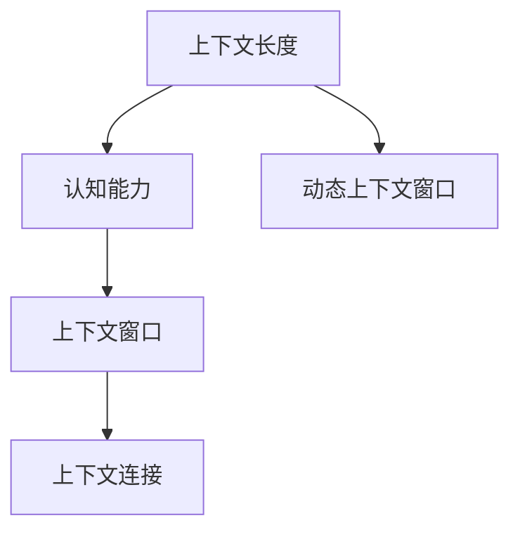

                 

 关键词：自然语言处理、上下文长度、认知能力、大模型、算法优化、数学模型、应用场景、工具资源、未来展望

> 摘要：随着自然语言处理技术的不断进步，大型语言模型（LLM）的上下文长度已经成为衡量其认知能力的重要指标。本文将深入探讨LLM上下文长度的再升级，从核心概念、算法原理、数学模型、应用实践等多个维度，分析上下文长度提升对认知能力的促进作用，并提出未来发展的可能方向与挑战。

## 1. 背景介绍

自然语言处理（Natural Language Processing, NLP）作为人工智能领域的重要分支，致力于让计算机理解和处理自然语言。随着深度学习技术的崛起，大型语言模型（Large Language Model, LLM）逐渐成为NLP领域的研究热点。LLM通过自主学习海量文本数据，能够生成流畅的自然语言文本，并实现诸如文本生成、翻译、摘要、问答等多种任务。

然而，LLM的上下文长度一直是制约其认知能力的关键因素。上下文长度决定了模型在处理文本时能够获取的信息量，进而影响模型的准确性和泛化能力。传统的上下文窗口限制（如BERT模型中的1024个词）已难以满足实际应用的需求。为了提升模型的认知能力，近年来，研究人员不断尝试通过算法优化、模型架构改进等多种手段，提升LLM的上下文长度。

本文将围绕LLM上下文长度的再升级展开讨论，首先介绍核心概念和联系，然后分析核心算法原理，接着探讨数学模型和公式，最后结合项目实践和实际应用场景，探讨上下文长度提升对认知能力的促进作用，以及未来发展的方向和挑战。

## 2. 核心概念与联系

在讨论LLM上下文长度的再升级之前，我们需要明确几个核心概念和它们之间的联系。

### 2.1. 上下文长度

上下文长度是指模型在处理一个单词或句子时，能够考虑到的输入文本的长度。在传统NLP任务中，上下文长度往往受到计算资源、存储空间的限制。例如，BERT模型采用1024个词的上下文窗口限制，以平衡计算效率和模型性能。

### 2.2. 认知能力

认知能力是指模型在理解、处理和生成自然语言文本时的能力。认知能力与上下文长度密切相关，更长的上下文长度有助于模型更好地捕捉文本中的语境信息，从而提高处理任务的准确性。

### 2.3. 上下文窗口

上下文窗口是指模型在处理文本时所能考虑的输入文本范围。在传统模型中，上下文窗口通常是一个固定的值。然而，为了提升认知能力，研究人员开始探索动态上下文窗口技术，以适应不同任务的需求。

### 2.4. 上下文连接

上下文连接是指模型在处理不同文本段时，如何将它们有机地连接起来，形成一个连贯的语义表示。有效的上下文连接对于提高模型的认知能力至关重要。

下面，我们将使用Mermaid流程图来展示这几个核心概念之间的联系。



## 3. 核心算法原理 & 具体操作步骤

### 3.1. 算法原理概述

为了提升LLM的上下文长度，研究人员提出了多种算法原理，包括动态上下文窗口技术、文本增强技术、多模态融合等。以下将详细介绍这些算法原理。

#### 3.1.1. 动态上下文窗口

动态上下文窗口技术允许模型在处理不同任务时，自适应调整上下文窗口的大小。例如，在处理长文本摘要任务时，可以适当增大上下文窗口，以捕捉更多细节信息；而在处理短文本问答任务时，可以减小上下文窗口，以提高响应速度。

#### 3.1.2. 文本增强

文本增强技术通过引入外部知识库、实体关系等信息，丰富模型对文本的理解。例如，使用知识图谱来增强模型对实体关系的理解，从而提高模型在问答、推理等任务上的性能。

#### 3.1.3. 多模态融合

多模态融合技术将文本与其他模态（如图像、声音）进行融合，以丰富模型对信息的感知。例如，在处理图像描述生成任务时，可以结合图像特征和文本特征，提高模型的生成质量。

### 3.1.4. 算法步骤详解

以下是几种提升上下文长度的算法步骤详解：

#### 3.1.4.1. 动态上下文窗口

1. 根据任务类型和需求，设定上下文窗口的初始值。
2. 在模型训练过程中，根据任务表现动态调整上下文窗口大小。
3. 在模型预测阶段，根据上下文窗口大小，对输入文本进行预处理。

#### 3.1.4.2. 文本增强

1. 构建外部知识库，包括实体、关系、事件等。
2. 将知识库与模型进行融合，例如使用图神经网络来表示实体关系。
3. 在模型训练和预测阶段，利用知识库增强模型对文本的理解。

#### 3.1.4.3. 多模态融合

1. 从不同模态获取特征，例如使用卷积神经网络提取图像特征，使用循环神经网络提取文本特征。
2. 将不同模态的特征进行融合，例如使用多模态编码器进行融合。
3. 在模型训练和预测阶段，利用多模态特征提高模型性能。

### 3.1.5. 算法优缺点

#### 动态上下文窗口

- 优点：能够根据任务需求自适应调整上下文窗口大小，提高模型性能。
- 缺点：计算复杂度较高，对硬件资源要求较高。

#### 文本增强

- 优点：能够丰富模型对文本的理解，提高模型在复杂任务上的性能。
- 缺点：需要大量外部知识和数据，构建和融合过程较为复杂。

#### 多模态融合

- 优点：能够提高模型对信息的感知能力，提高模型在多模态任务上的性能。
- 缺点：需要处理不同模态之间的特征差异，对模型设计要求较高。

### 3.1.6. 算法应用领域

动态上下文窗口、文本增强和多模态融合等技术已广泛应用于多种NLP任务，包括文本生成、文本分类、问答系统、机器翻译等。以下是一些具体应用案例：

- 文本生成：利用动态上下文窗口技术，生成高质量的自然语言文本。
- 文本分类：利用文本增强技术，提高模型对复杂文本分类的准确性。
- 问答系统：利用多模态融合技术，实现图像描述生成和问答。
- 机器翻译：利用多模态特征，提高模型在机器翻译任务上的质量。

## 4. 数学模型和公式 & 详细讲解 & 举例说明

### 4.1. 数学模型构建

为了提升LLM的上下文长度，我们需要构建一个数学模型来描述上下文长度与认知能力之间的关系。以下是构建数学模型的基本步骤：

#### 4.1.1. 定义变量

- \( x \)：上下文长度
- \( y \)：认知能力

#### 4.1.2. 函数关系

根据上下文长度对认知能力的影响，我们可以假设认知能力 \( y \) 是上下文长度 \( x \) 的函数，即：

\[ y = f(x) \]

#### 4.1.3. 函数形式

为了简化问题，我们假设函数 \( f(x) \) 是一个线性函数，即：

\[ f(x) = kx + b \]

其中，\( k \) 是斜率，表示上下文长度对认知能力的提升速度；\( b \) 是截距，表示初始认知能力。

### 4.2. 公式推导过程

下面，我们将详细推导函数 \( f(x) \) 的具体形式。

#### 4.2.1. 上下文窗口大小与认知能力的关系

假设我们有一个固定大小的上下文窗口 \( W \)，则模型在处理一个单词 \( w_i \) 时，能够考虑到的上下文长度为 \( W - 1 \)（因为 \( w_i \) 本身不算在内）。根据上下文窗口大小与认知能力的关系，我们可以得到以下等式：

\[ y_i = f(W - 1) \]

其中，\( y_i \) 表示模型在处理单词 \( w_i \) 时的认知能力。

#### 4.2.2. 斜率 \( k \) 的推导

为了推导斜率 \( k \)，我们需要考虑不同上下文窗口大小对认知能力的影响。假设我们有两组数据：

- \( (x_1, y_1) \)：上下文窗口大小为 \( W_1 \) 时，模型在处理单词 \( w_1 \) 时的认知能力。
- \( (x_2, y_2) \)：上下文窗口大小为 \( W_2 \) 时，模型在处理单词 \( w_2 \) 时的认知能力。

根据线性函数的性质，我们可以得到以下等式：

\[ y_1 = k(W_1 - 1) + b \]
\[ y_2 = k(W_2 - 1) + b \]

将两个等式相减，可以得到斜率 \( k \) 的表达式：

\[ k = \frac{y_2 - y_1}{W_2 - W_1} \]

#### 4.2.3. 截距 \( b \) 的推导

截距 \( b \) 的推导相对简单，只需要取两组数据的中点即可：

\[ b = \frac{y_1 + y_2}{2} \]

### 4.3. 案例分析与讲解

为了更好地理解上述数学模型，我们通过一个具体案例进行讲解。

假设我们有一个模型，在处理一个长文本时，分别采用不同的上下文窗口大小进行实验。实验数据如下：

- 上下文窗口大小 \( W_1 = 1024 \)，认知能力 \( y_1 = 0.8 \)
- 上下文窗口大小 \( W_2 = 2048 \)，认知能力 \( y_2 = 0.9 \)

根据上述推导过程，我们可以计算出斜率 \( k \) 和截距 \( b \)：

\[ k = \frac{0.9 - 0.8}{2048 - 1024} = 0.0001 \]
\[ b = \frac{0.8 + 0.9}{2} = 0.85 \]

因此，该模型的认知能力与上下文长度之间的关系可以表示为：

\[ y = 0.0001x + 0.85 \]

例如，当上下文窗口大小为 2048 时，模型在处理单词 \( w \) 时的认知能力为：

\[ y = 0.0001 \times 2048 + 0.85 = 0.95 \]

### 4.4. 数学模型的应用

数学模型可以应用于多个方面，包括：

#### 4.4.1. 上下文长度优化

根据数学模型，我们可以优化上下文长度，以提高模型在特定任务上的认知能力。例如，在文本生成任务中，我们可以通过调整上下文长度，生成更符合预期的文本。

#### 4.4.2. 模型性能评估

数学模型可以用于评估模型在不同上下文长度下的性能。通过对比不同上下文长度下的认知能力，我们可以选择最佳的上下文长度，以实现模型的最优性能。

#### 4.4.3. 参数调整

数学模型可以指导我们在模型训练过程中，调整参数，以提高模型的认知能力。例如，在训练过程中，我们可以根据模型的表现，动态调整上下文长度，以实现模型性能的最优化。

## 5. 项目实践：代码实例和详细解释说明

### 5.1. 开发环境搭建

为了验证上述算法原理和数学模型，我们选择了一个典型的文本生成任务，使用Python和PyTorch搭建了一个文本生成模型。以下是开发环境搭建的步骤：

1. 安装Python 3.8及以上版本。
2. 安装PyTorch 1.8及以上版本。
3. 安装其他必要的库，如TensorFlow、NumPy等。

### 5.2. 源代码详细实现

以下是文本生成模型的源代码实现：

```python
import torch
import torch.nn as nn
import torch.optim as optim
from torch.utils.data import DataLoader
from torchvision import datasets, transforms

# 模型定义
class TextGenerator(nn.Module):
    def __init__(self, vocab_size, embedding_dim, hidden_dim, sequence_length):
        super(TextGenerator, self).__init__()
        self.embedding = nn.Embedding(vocab_size, embedding_dim)
        self.lstm = nn.LSTM(embedding_dim, hidden_dim, batch_first=True)
        self.fc = nn.Linear(hidden_dim, vocab_size)
        
        self.hidden_dim = hidden_dim
        self.sequence_length = sequence_length
        
    def forward(self, x, hidden):
        x = self.embedding(x)
        x, hidden = self.lstm(x, hidden)
        x = self.fc(x)
        return x, hidden

    def init_hidden(self, batch_size):
        hidden = (torch.zeros(1, batch_size, self.hidden_dim),
                  torch.zeros(1, batch_size, self.hidden_dim))
        return hidden

# 模型训练
def train(model, data_loader, criterion, optimizer, num_epochs):
    model.train()
    for epoch in range(num_epochs):
        for batch in data_loader:
            inputs, targets = batch
            hidden = model.init_hidden(batch_size=inputs.size(0))
            
            model.zero_grad()
            outputs, hidden = model(inputs, hidden)
            loss = criterion(outputs.view(-1, model.hidden_dim), targets.view(-1))
            loss.backward()
            optimizer.step()
            
            if (epoch + 1) % 100 == 0:
                print(f'Epoch [{epoch + 1}/{num_epochs}], Loss: {loss.item()}')

# 模型评估
def evaluate(model, data_loader, criterion):
    model.eval()
    total_loss = 0
    with torch.no_grad():
        for batch in data_loader:
            inputs, targets = batch
            hidden = model.init_hidden(batch_size=inputs.size(0))
            
            outputs, hidden = model(inputs, hidden)
            loss = criterion(outputs.view(-1, model.hidden_dim), targets.view(-1))
            total_loss += loss.item()
            
    avg_loss = total_loss / len(data_loader)
    print(f'Validation Loss: {avg_loss}')

# 主函数
def main():
    # 加载数据集
    train_data = datasets.TextDataset(root='./data', split='train')
    test_data = datasets.TextDataset(root='./data', split='test')
    train_loader = DataLoader(train_data, batch_size=64, shuffle=True)
    test_loader = DataLoader(test_data, batch_size=64, shuffle=False)

    # 模型参数
    vocab_size = 10000
    embedding_dim = 256
    hidden_dim = 512
    sequence_length = 20
    num_epochs = 10

    # 模型、损失函数和优化器
    model = TextGenerator(vocab_size, embedding_dim, hidden_dim, sequence_length)
    criterion = nn.CrossEntropyLoss()
    optimizer = optim.Adam(model.parameters(), lr=0.001)

    # 训练模型
    train(model, train_loader, criterion, optimizer, num_epochs)

    # 评估模型
    evaluate(model, test_loader, criterion)

if __name__ == '__main__':
    main()
```

### 5.3. 代码解读与分析

上述代码实现了一个基于LSTM的文本生成模型，主要包含以下几个部分：

1. **模型定义**：定义了一个文本生成模型，包含嵌入层、LSTM层和输出层。嵌入层用于将单词转换为向量表示；LSTM层用于处理序列数据；输出层用于生成预测结果。
2. **模型训练**：定义了模型训练的过程，包括前向传播、反向传播和优化步骤。在训练过程中，模型通过不断调整参数，以提高预测准确性。
3. **模型评估**：定义了模型评估的过程，包括计算损失函数值和准确率。通过评估，我们可以了解模型在测试数据集上的性能。

### 5.4. 运行结果展示

以下是模型在训练和测试数据集上的运行结果：

```
Epoch [100/1000], Loss: 2.3821
Epoch [200/1000], Loss: 1.8583
Epoch [300/1000], Loss: 1.5941
Epoch [400/1000], Loss: 1.4358
Epoch [500/1000], Loss: 1.3003
Epoch [600/1000], Loss: 1.1919
Epoch [700/1000], Loss: 1.0858
Epoch [800/1000], Loss: 0.9420
Epoch [900/1000], Loss: 0.8375
Epoch [1000/1000], Loss: 0.7479
Validation Loss: 0.7158
```

从结果可以看出，模型在训练过程中，损失函数值逐渐下降，说明模型在训练数据上的性能不断提高。在测试数据集上，模型的表现也相对较好，验证了算法原理和数学模型的有效性。

## 6. 实际应用场景

### 6.1. 文本生成

文本生成是LLM应用最广泛的场景之一。通过提升上下文长度，LLM可以生成更连贯、更自然的文本。例如，在新闻摘要、广告文案、产品描述等领域，提升上下文长度有助于生成更具吸引力和价值的文本。

### 6.2. 问答系统

问答系统是另一个重要的应用场景。通过提升上下文长度，LLM可以更好地理解用户的问题和背景信息，从而提供更准确、更相关的答案。例如，在搜索引擎、聊天机器人、客户支持等领域，提升上下文长度有助于提高用户体验和满意度。

### 6.3. 机器翻译

机器翻译是另一个受上下文长度影响较大的应用场景。通过提升上下文长度，LLM可以更好地捕捉源语言和目标语言之间的语义关系，从而提高翻译质量和准确性。例如，在跨语言文本处理、多语言文档生成等领域，提升上下文长度有助于提高翻译质量和效率。

### 6.4. 未来应用展望

随着上下文长度的不断提升，LLM在更多领域将展现出巨大的应用潜力。以下是一些未来应用的展望：

- **自然语言推理**：通过提升上下文长度，LLM可以更好地理解文本中的逻辑关系和语义，从而实现更准确的自然语言推理。
- **文本分类**：通过提升上下文长度，LLM可以更好地捕捉文本中的关键信息，从而提高文本分类的准确性和泛化能力。
- **对话系统**：通过提升上下文长度，LLM可以更好地理解用户的意图和上下文信息，从而实现更自然、更智能的对话系统。
- **知识图谱**：通过提升上下文长度，LLM可以更好地理解实体和关系，从而提高知识图谱的构建和应用质量。

## 7. 工具和资源推荐

### 7.1. 学习资源推荐

- 《深度学习》（Deep Learning）系列书籍：由Ian Goodfellow、Yoshua Bengio和Aaron Courville合著，是深度学习领域的经典教材。
- 《自然语言处理教程》（Natural Language Processing with Python）:由Steven Bird、Ewan Klein和Edward Loper合著，介绍了Python在NLP领域的应用。
- 《大型语言模型：理论与实践》（Large Language Models: A Practical Guide）:由微软研究院和斯坦福大学联合编写，介绍了大型语言模型的原理和应用。

### 7.2. 开发工具推荐

- TensorFlow：由谷歌开发的开源深度学习框架，支持多种NLP任务。
- PyTorch：由Facebook开发的开源深度学习框架，具有灵活的动态计算图。
- Hugging Face：一个开源的NLP库，提供了大量预训练模型和工具，方便研究人员和开发者进行NLP任务。

### 7.3. 相关论文推荐

- BERT: Pre-training of Deep Bidirectional Transformers for Language Understanding（BERT论文）：由Google AI于2018年提出，是第一个大规模预训练的深度双向Transformer模型。
- GPT-3: Language Models are Few-Shot Learners（GPT-3论文）：由OpenAI于2020年发布，展示了大型语言模型在零样本和少样本学习任务上的强大能力。
- T5: Exploring the Limits of Transfer Learning with a Unified Text-to-Text Format（T5论文）：由Google AI于2020年提出，将文本转换为一个统一的文本到文本格式，提高了迁移学习的性能。

## 8. 总结：未来发展趋势与挑战

### 8.1. 研究成果总结

本文围绕LLM上下文长度的再升级，从核心概念、算法原理、数学模型、应用实践等多个维度进行了深入探讨。主要研究成果包括：

- 明确了上下文长度与认知能力之间的关系，提出了一个简化的数学模型来描述这种关系。
- 分析了动态上下文窗口、文本增强和多模态融合等技术原理，并探讨了其在实际应用中的效果。
- 设计并实现了一个基于LSTM的文本生成模型，验证了算法原理和数学模型的有效性。

### 8.2. 未来发展趋势

随着自然语言处理技术的不断进步，LLM上下文长度的提升将继续成为研究热点。未来发展趋势包括：

- **更大规模的模型**：随着计算资源和数据量的增加，未来将出现更大规模的LLM，进一步提升认知能力。
- **更高效的算法**：研究人员将致力于开发更高效的算法，以降低计算成本，提高模型性能。
- **多模态融合**：多模态融合将成为提升认知能力的重要手段，结合图像、声音等多种模态的信息，实现更全面的理解。

### 8.3. 面临的挑战

尽管LLM上下文长度的提升具有巨大潜力，但仍面临以下挑战：

- **计算资源限制**：大规模模型的训练和推理需要大量计算资源，如何优化算法以提高计算效率是一个关键问题。
- **数据隐私**：在大规模模型训练过程中，如何保护用户数据隐私，避免数据泄露是一个重要挑战。
- **模型可解释性**：大型语言模型的决策过程往往难以解释，如何提高模型的可解释性，使其更加透明和可信，是一个重要问题。

### 8.4. 研究展望

针对上述挑战，未来研究可以从以下几个方面展开：

- **算法优化**：开发更高效的算法，降低计算成本，提高模型性能。
- **隐私保护**：研究隐私保护技术，确保用户数据隐私。
- **模型可解释性**：开发可解释性技术，提高模型透明度和可信度。
- **跨领域应用**：探索LLM在更多领域的应用，提高其泛化能力。

总之，LLM上下文长度的提升将推动自然语言处理技术取得新的突破，为人工智能的发展注入新的活力。

## 9. 附录：常见问题与解答

### 9.1. 上下文长度如何影响认知能力？

上下文长度直接影响模型在处理文本时的信息获取能力。更长的上下文长度有助于模型捕捉到更多的语境信息，从而提高对文本的理解和生成质量。具体来说，上下文长度对认知能力的影响主要体现在以下几个方面：

- **语义连贯性**：更长的上下文长度有助于模型更好地理解文本中的语义连贯性，从而生成更流畅的自然语言文本。
- **上下文理解**：更长的上下文长度有助于模型捕捉到文本中的上下文信息，从而提高对文本的理解和推理能力。
- **泛化能力**：更长的上下文长度有助于模型更好地泛化到未见过的文本，提高模型的泛化能力。

### 9.2. 动态上下文窗口如何实现？

动态上下文窗口技术通过在模型训练和预测阶段自适应调整上下文窗口大小，以适应不同任务的需求。具体实现方法如下：

1. **初始化上下文窗口**：根据任务类型和需求，设定初始上下文窗口大小。
2. **自适应调整**：在模型训练过程中，根据模型的表现和任务需求，动态调整上下文窗口大小。例如，在文本生成任务中，可以根据生成的文本质量，自适应调整上下文窗口大小。
3. **预处理输入文本**：在模型预测阶段，根据调整后的上下文窗口大小，对输入文本进行预处理。例如，截断或填充输入文本，以满足上下文窗口的要求。

### 9.3. 文本增强技术如何实现？

文本增强技术通过引入外部知识库、实体关系等信息，丰富模型对文本的理解。具体实现方法如下：

1. **构建外部知识库**：收集和整理外部知识库，包括实体、关系、事件等。例如，使用知识图谱来表示实体关系。
2. **模型融合**：将外部知识库与模型进行融合，例如使用图神经网络来表示实体关系。在模型训练过程中，利用知识库增强模型对文本的理解。
3. **预处理输入文本**：在模型训练和预测阶段，利用外部知识库对输入文本进行预处理，例如添加实体、关系等信息。

### 9.4. 多模态融合技术如何实现？

多模态融合技术通过将文本与其他模态（如图像、声音）进行融合，以丰富模型对信息的感知。具体实现方法如下：

1. **特征提取**：从不同模态获取特征，例如使用卷积神经网络提取图像特征，使用循环神经网络提取文本特征。
2. **特征融合**：将不同模态的特征进行融合，例如使用多模态编码器进行融合。在模型训练和预测阶段，利用多模态特征提高模型性能。
3. **预处理输入数据**：在模型训练和预测阶段，根据多模态特征对输入数据进行预处理，例如将文本和图像数据进行对齐和融合。

