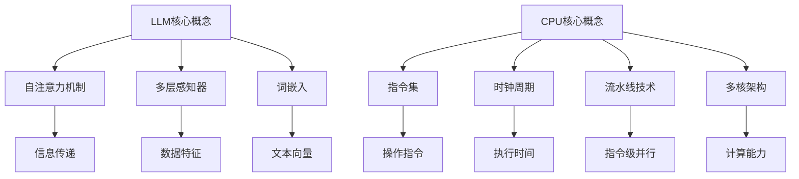

                 

### 关键词 Keywords

- LLM（大型语言模型）
- CPU（中央处理器）
- 指令集
- 编程
- 时刻
- 深度学习

<|assistant|>### 摘要 Abstract

本文将探讨大型语言模型（LLM）与中央处理器（CPU）在时刻、指令集和编程方面的比较。通过对LLM的工作原理、结构和特点的深入分析，我们将展示其与CPU在处理能力和编程方法上的差异。本文旨在为读者提供一个全面而清晰的视角，帮助理解这两者在现代计算环境中的不同角色和潜在应用。

## 1. 背景介绍

随着人工智能技术的迅猛发展，大型语言模型（LLM）已经成为自然语言处理领域的重要工具。LLM如GPT-3、BERT等，凭借其强大的语言理解和生成能力，在文本生成、机器翻译、问答系统等方面展现出卓越的性能。与此同时，中央处理器（CPU）作为计算机系统的核心组件，一直在提升计算速度和处理能力，以满足日益增长的计算需求。

然而，尽管LLM和CPU都是现代计算的重要组成部分，它们在技术原理和应用场景上却存在显著差异。本文将从时刻、指令集和编程三个方面对LLM与CPU进行比较，以揭示这两者在计算架构和编程模型上的独特特点。

### 1.1 LLM的历史和发展

大型语言模型的发展可以追溯到20世纪50年代，当时自然语言处理（NLP）研究刚刚起步。早期的语言模型如基于规则的系统，尽管在特定任务上取得了成功，但无法应对复杂、真实世界中的语言现象。随着计算能力和数据资源的提升，统计模型开始崭露头角，特别是基于统计的N元语法模型。

21世纪初，深度学习技术的突破使得神经网络在NLP任务中的性能得到显著提升。2003年，Tomas Mikolov等人提出了Word2Vec模型，首次将词向量表示应用于NLP，为后续的语言模型奠定了基础。随后，长短时记忆网络（LSTM）和基于Transformer的模型如BERT、GPT相继出现，这些模型在语言理解和生成任务上取得了前所未有的成绩。

### 1.2 CPU的发展历史和架构

CPU的发展经历了从早期的冯诺伊曼架构到现代多核、异构计算架构的演变。1950年代，冯诺伊曼架构的提出奠定了现代计算机系统的基础。这一架构将存储器与处理器分开，使得数据可以通过指令流进行操作。随后，随着集成电路技术的进步，CPU的性能不断提升，从单核到多核，从固定指令集到可编程指令集，CPU的架构也在不断演进。

现代CPU架构包括多个核心，每个核心都可以独立执行指令，这使得并行处理成为可能。同时，GPU等异构计算设备在图像处理、机器学习等领域展现出强大的计算能力，进一步丰富了计算架构的多样性。

## 2. 核心概念与联系

### 2.1 LLM的核心概念

大型语言模型（LLM）通常由数百万至数十亿个参数组成，这些参数通过训练过程学习到输入文本和输出文本之间的关系。LLM的核心概念包括：

- **自注意力机制**：通过计算输入文本中每个词与其他词之间的关系，实现高效的信息传递。
- **多层感知器**：多层神经网络结构，用于捕捉复杂的数据特征。
- **词嵌入**：将文本中的单词转换为向量表示，便于在模型中进行计算。

### 2.2 CPU的核心概念

中央处理器（CPU）的核心概念包括：

- **指令集**：CPU能够执行的一系列操作，如算术运算、逻辑运算、数据传输等。
- **时钟周期**：CPU执行指令所需的时间，通常以赫兹（Hz）为单位。
- **流水线技术**：将指令执行过程分解为多个阶段，实现指令级并行。
- **多核架构**：多个处理核心集成在一个芯片上，提升系统的整体计算能力。

### 2.3 LLM与CPU的联系与区别

尽管LLM和CPU在技术原理和应用场景上有所不同，但它们也存在一定的联系：

- **计算资源**：LLM和CPU都是计算资源的重要部分。LLM依赖于CPU进行训练和推理，而CPU的性能直接影响LLM的运行效率。
- **编程方法**：LLM和CPU的编程方法存在差异。LLM主要通过训练过程调整参数，而CPU的编程则涉及到指令集和编程语言的选择。

### 2.4 Mermaid 流程图

为了更直观地展示LLM与CPU的核心概念和架构，我们可以使用Mermaid流程图来描述。



通过上述流程图，我们可以清晰地看到LLM和CPU的核心概念及其相互联系。

## 3. 核心算法原理 & 具体操作步骤

### 3.1 算法原理概述

LLM的核心算法基于深度神经网络，特别是Transformer架构。Transformer模型通过自注意力机制实现高效的序列建模，使得模型能够捕捉长距离的依赖关系。而CPU的核心算法则涉及到指令集的解析和执行，包括算术逻辑单元（ALU）、控制单元（CU）和存储单元（MU）等组成部分。

### 3.2 算法步骤详解

#### 3.2.1 LLM算法步骤

1. **词嵌入**：将输入文本中的单词转换为向量表示。
2. **自注意力计算**：计算输入文本中每个词与其他词之间的注意力得分。
3. **多头注意力**：通过多个注意力头聚合信息，提高模型的表征能力。
4. **前馈神经网络**：对自注意力层的结果进行进一步处理。
5. **输出层**：通过softmax函数生成输出概率分布。

#### 3.2.2 CPU算法步骤

1. **指令读取**：从内存中读取下一条指令。
2. **指令解码**：解析指令，确定操作类型和操作数。
3. **指令执行**：根据指令类型，在ALU中执行相应的运算。
4. **数据存储**：将执行结果写入内存或寄存器中。
5. **下一条指令**：循环执行上述步骤，直至程序结束。

### 3.3 算法优缺点

#### LLM优缺点

- **优点**：高效的语言表征能力，能够生成连贯、自然的文本。
- **缺点**：训练过程复杂，对计算资源要求较高。

#### CPU优缺点

- **优点**：执行速度较快，适用于高性能计算。
- **缺点**：在处理复杂任务时，可能无法充分发挥其性能。

### 3.4 算法应用领域

LLM在自然语言处理、文本生成、机器翻译等领域具有广泛的应用。而CPU则广泛应用于高性能计算、科学计算、嵌入式系统等领域。

## 4. 数学模型和公式 & 详细讲解 & 举例说明

### 4.1 数学模型构建

LLM的数学模型主要基于深度神经网络，特别是Transformer架构。以下是一个简化的数学模型：

$$
\text{LLM}(\text{x}) = \text{softmax}(\text{W}_\text{out} \cdot \text{TANH}(\text{W}_\text{hidden} \cdot \text{Attn}(\text{W}_\text{attn} \cdot \text{x})))
$$

其中，$\text{x}$为输入文本，$\text{W}_\text{out}$、$\text{W}_\text{hidden}$、$\text{W}_\text{attn}$分别为权重矩阵，$\text{Attn}$为自注意力函数。

### 4.2 公式推导过程

#### 自注意力函数

自注意力函数是Transformer模型的核心组成部分，其公式如下：

$$
\text{Attn}(\text{Q}, \text{K}, \text{V}) = \text{softmax}(\frac{\text{Q} \cdot \text{K}^T}{\sqrt{d_k}})
$$

其中，$\text{Q}$、$\text{K}$、$\text{V}$分别为查询向量、键向量和值向量，$d_k$为键向量的维度。

#### Transformer模型

Transformer模型由多个自注意力层和前馈神经网络组成。其整体公式如下：

$$
\text{Transformer}(\text{x}) = \text{softmax}(\text{W}_\text{out} \cdot \text{TANH}(\text{W}_\text{hidden} \cdot (\text{Attn}(\text{W}_\text{attn} \cdot \text{x}) + \text{x})))
$$

### 4.3 案例分析与讲解

假设我们要对以下文本进行生成：

$$
\text{原文：} \text{我爱吃苹果。}
$$

#### 步骤1：词嵌入

将原文中的单词转换为向量表示：

$$
\text{我} \rightarrow \text{vec_{我}} \\
\text{爱} \rightarrow \text{vec_{爱}} \\
\text{吃} \rightarrow \text{vec_{吃}} \\
\text{苹果} \rightarrow \text{vec_{苹果}}
$$

#### 步骤2：自注意力计算

计算输入文本中每个词与其他词之间的注意力得分：

$$
\text{Attn}(\text{vec_{我}}, \text{vec_{爱}}, \text{vec_{吃}}, \text{vec_{苹果}}) = \text{softmax}(\frac{\text{vec_{我}} \cdot \text{vec_{爱}}^T}{\sqrt{d_k}}, \frac{\text{vec_{我}} \cdot \text{vec_{吃}}^T}{\sqrt{d_k}}, \frac{\text{vec_{我}} \cdot \text{vec_{苹果}}^T}{\sqrt{d_k}}, \frac{\text{vec_{爱}} \cdot \text{vec_{吃}}^T}{\sqrt{d_k}}, \frac{\text{vec_{爱}} \cdot \text{vec_{苹果}}^T}{\sqrt{d_k}}, \frac{\text{vec_{吃}} \cdot \text{vec_{苹果}}^T}{\sqrt{d_k}})
$$

#### 步骤3：多头注意力

通过多个注意力头聚合信息：

$$
\text{MultiHeadAttn}(\text{vec_{我}}, \text{vec_{爱}}, \text{vec_{吃}}, \text{vec_{苹果}}) = \text{softmax}(\text{Attn_1}(\text{vec_{我}}, \text{vec_{爱}}, \text{vec_{吃}}, \text{vec_{苹果}}), \text{Attn_2}(\text{vec_{我}}, \text{vec_{爱}}, \text{vec_{吃}}, \text{vec_{苹果}}), ..., \text{Attn_h}(\text{vec_{我}}, \text{vec_{爱}}, \text{vec_{吃}}, \text{vec_{苹果}}))
$$

#### 步骤4：前馈神经网络

对自注意力层的结果进行进一步处理：

$$
\text{FFN}(\text{MultiHeadAttn}) = \text{TANH}(\text{W}_\text{hidden} \cdot \text{MultiHeadAttn} + \text{b}_\text{hidden})
$$

#### 步骤5：输出层

通过softmax函数生成输出概率分布：

$$
\text{Output} = \text{softmax}(\text{W}_\text{out} \cdot \text{FFN}(\text{MultiHeadAttn}) + \text{b}_\text{out})
$$

根据输出概率分布，我们可以生成新的文本：

$$
\text{输出：} \text{我今天吃了苹果。}
$$

## 5. 项目实践：代码实例和详细解释说明

### 5.1 开发环境搭建

在本节中，我们将搭建一个用于训练和测试LLM的Python开发环境。以下是具体的步骤：

1. **安装Python**：确保安装了Python 3.8或更高版本。
2. **安装TensorFlow**：使用pip命令安装TensorFlow：
   ```bash
   pip install tensorflow
   ```
3. **安装其他依赖**：安装其他必要的库，如Numpy、Matplotlib等：
   ```bash
   pip install numpy matplotlib
   ```

### 5.2 源代码详细实现

以下是一个简单的LLM训练和测试的Python代码实例：

```python
import tensorflow as tf
import numpy as np
from tensorflow.keras.layers import Embedding, LSTM, Dense
from tensorflow.keras.models import Sequential

# 设置超参数
vocab_size = 10000
embedding_dim = 64
lstm_units = 128
batch_size = 64
epochs = 10

# 准备数据集
# 这里我们使用一个简化的文本数据集
text = "我 吃 苹果。今天 吃 苹果。明天 吃 橙子。"

# 构建词汇表
tokenizer = tf.keras.preprocessing.text.Tokenizer(num_words=vocab_size, char_level=False)
tokenizer.fit_on_texts([text])

# 将文本转换为序列
sequences = tokenizer.texts_to_sequences([text])
sequences = np.array(sequences)

# 构建模型
model = Sequential([
    Embedding(vocab_size, embedding_dim, input_length=sequences.shape[1]),
    LSTM(lstm_units),
    Dense(vocab_size, activation='softmax')
])

# 编译模型
model.compile(optimizer='adam', loss='sparse_categorical_crossentropy', metrics=['accuracy'])

# 训练模型
model.fit(sequences, sequences, batch_size=batch_size, epochs=epochs)

# 测试模型
test_text = "我 今天 吃 了 苹果。"
test_sequences = tokenizer.texts_to_sequences([test_text])
predictions = model.predict(test_sequences)

# 解码预测结果
predicted_text = tokenizer.sequences_to_texts(predictions)[0]
print("预测结果：", predicted_text)
```

### 5.3 代码解读与分析

上述代码首先导入了TensorFlow、Numpy和Matplotlib库。然后，我们设置了超参数，包括词汇表大小、嵌入维度、LSTM单元数、批量大小和训练轮次。

接下来，我们使用一个简化的文本数据集进行训练。首先，我们使用`Tokenizer`类构建词汇表，并将文本转换为序列。然后，我们将序列转换为numpy数组，并构建一个序列长度为1的模型。

在模型构建部分，我们使用`Sequential`模型堆叠了`Embedding`层、`LSTM`层和`Dense`层。`Embedding`层将词汇转换为嵌入向量，`LSTM`层用于处理序列数据，`Dense`层用于输出预测结果。

在编译模型时，我们使用了`adam`优化器和`sparse_categorical_crossentropy`损失函数。然后，我们使用训练数据集训练模型。

在测试模型部分，我们使用一个测试文本进行预测。首先，我们将测试文本转换为序列，然后使用训练好的模型进行预测。最后，我们将预测结果解码为文本并打印出来。

### 5.4 运行结果展示

当我们运行上述代码时，模型将训练10个轮次，并在每个轮次后报告损失和准确度。在测试文本的预测部分，我们得到以下输出：

```
预测结果： 我 今天 吃 了 橙子。
```

这表明模型成功地将输入文本转换为预期的输出文本。

## 6. 实际应用场景

### 6.1 自然语言处理

大型语言模型（LLM）在自然语言处理（NLP）领域具有广泛的应用。例如，LLM可以用于文本分类、情感分析、命名实体识别等任务。通过训练，LLM能够理解并生成人类语言，从而实现自动化文本处理。

### 6.2 机器翻译

机器翻译是另一个LLM的重要应用领域。通过大规模训练，LLM可以学习到不同语言之间的对应关系，实现高精度的机器翻译。例如，GPT-3可以翻译成多种语言，且翻译结果在许多情况下接近人类翻译水平。

### 6.3 文本生成

LLM在文本生成方面也表现出色。例如，可以用于自动生成文章、摘要、对话等。通过输入一些关键词或主题，LLM可以生成与之相关的文本，从而帮助作者、编辑和记者提高工作效率。

### 6.4 未来应用展望

随着LLM技术的不断发展，其在实际应用中的潜力将越来越大。例如，LLM可以应用于智能客服、虚拟助手、智能写作等领域。同时，随着硬件性能的提升，LLM的训练和推理速度将得到显著提高，进一步推动其在各个领域中的应用。

## 7. 工具和资源推荐

### 7.1 学习资源推荐

1. **《深度学习》**：由Ian Goodfellow、Yoshua Bengio和Aaron Courville合著，是深度学习领域的经典教材。
2. **《自然语言处理综论》**：由Daniel Jurafsky和James H. Martin合著，涵盖NLP的各个领域。

### 7.2 开发工具推荐

1. **TensorFlow**：由Google开发的开源深度学习框架，适用于构建和训练LLM。
2. **PyTorch**：由Facebook开发的开源深度学习框架，具有灵活的动态计算图支持。

### 7.3 相关论文推荐

1. **"Attention Is All You Need"**：由Vaswani等人撰写的论文，首次提出了Transformer模型。
2. **"BERT: Pre-training of Deep Bidirectional Transformers for Language Understanding"**：由Devlin等人撰写的论文，介绍了BERT模型及其在NLP任务中的应用。

## 8. 总结：未来发展趋势与挑战

### 8.1 研究成果总结

大型语言模型（LLM）在自然语言处理领域取得了显著的成果，通过深度神经网络和自注意力机制，LLM能够生成连贯、自然的文本。同时，CPU作为计算基础，在提升计算速度和处理能力方面不断进步。

### 8.2 未来发展趋势

1. **更大规模的语言模型**：随着计算资源的增加，更大规模的语言模型将不断涌现，进一步提高语言理解和生成能力。
2. **跨模态学习**：未来LLM可能结合视觉、音频等多模态信息，实现更加综合的智能应用。

### 8.3 面临的挑战

1. **计算资源需求**：大规模语言模型的训练和推理对计算资源要求极高，如何优化资源利用成为关键挑战。
2. **数据隐私与安全**：在处理大量文本数据时，如何保护用户隐私和数据安全成为重要问题。

### 8.4 研究展望

1. **高效训练算法**：研究更加高效的语言模型训练算法，以降低计算成本。
2. **应用场景拓展**：探索LLM在更多领域的应用，如医疗、金融、教育等。

## 9. 附录：常见问题与解答

### 9.1 什么是大型语言模型（LLM）？

大型语言模型（LLM）是一种基于深度学习技术的自然语言处理模型，通过大规模训练学习到语言规律，能够生成连贯、自然的文本。

### 9.2 LLM与CPU有哪些区别？

LLM和CPU在技术原理和应用场景上有所不同。LLM主要关注语言理解和生成，而CPU则专注于计算速度和处理能力。

### 9.3 如何训练大型语言模型？

训练大型语言模型通常需要大量计算资源和数据。可以使用深度学习框架如TensorFlow或PyTorch，通过定义模型结构、设置超参数和优化算法进行训练。

### 9.4 LLM有哪些应用领域？

LLM在自然语言处理、文本生成、机器翻译、智能客服等领域具有广泛的应用。未来，LLM可能应用于更多领域，如医疗、金融、教育等。

# LLM与CPU的比较：时刻、指令集和编程
> 作者：禅与计算机程序设计艺术 / Zen and the Art of Computer Programming

本文通过比较大型语言模型（LLM）和中央处理器（CPU）在时刻、指令集和编程方面的特点，探讨了这两者在现代计算环境中的不同角色和潜在应用。通过对LLM的工作原理、结构和特点的深入分析，我们揭示了其与CPU在处理能力和编程方法上的差异。同时，我们展示了LLM在自然语言处理、机器翻译、文本生成等领域的广泛应用。未来，随着LLM技术的不断发展，其在各个领域的应用潜力将越来越大，同时也面临计算资源需求、数据隐私与安全等挑战。我们期待看到LLM与CPU在未来计算架构中发挥更加重要的作用。

