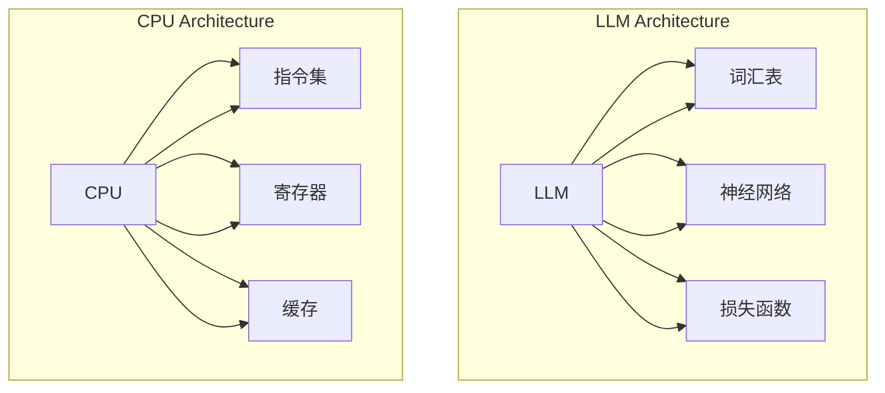

                 

关键词：大型语言模型（LLM）、中央处理器（CPU）、计算能力、架构设计、算法原理、数学模型、应用场景、未来展望

> 摘要：本文旨在深入分析大型语言模型（LLM）与中央处理器（CPU）之间的相似性与差异性。通过对LLM与CPU的核心概念、架构设计、算法原理、数学模型等方面的探讨，本文将揭示两者在现代计算机体系结构中的应用及其未来发展趋势。

## 1. 背景介绍

随着人工智能（AI）技术的迅猛发展，大型语言模型（LLM）已成为当今最具影响力的技术之一。LLM在自然语言处理（NLP）、文本生成、机器翻译、问答系统等领域展现出了强大的性能和广泛的应用前景。另一方面，中央处理器（CPU）作为计算机系统的核心部件，承担着计算任务的核心执行工作，其性能和架构设计直接影响计算机系统的整体性能。

本文将重点探讨LLM与CPU之间的相似性与差异性，以期为读者提供一个全面、深入的理解。通过对两者核心概念、架构设计、算法原理、数学模型等方面的分析，本文将揭示它们在现代计算机体系结构中的重要作用及其未来发展趋势。

## 2. 核心概念与联系

### 2.1 大型语言模型（LLM）

大型语言模型（LLM）是一种基于深度学习的语言处理模型，其主要目标是从大量文本数据中学习语言结构和语义，从而实现自然语言生成、机器翻译、文本分类等任务。LLM的核心概念包括：

- **词汇表**：LLM将输入的文本转换为词汇表中的索引，从而将其表示为数字向量。
- **神经网络**：LLM使用多层神经网络来学习文本数据的特征和模式，从而实现语言理解和生成。
- **损失函数**：LLM通过最小化损失函数来调整神经网络权重，以优化模型性能。

### 2.2 中央处理器（CPU）

中央处理器（CPU）是计算机系统的核心部件，负责执行计算机程序中的指令，完成数据计算和处理。CPU的核心概念包括：

- **指令集**：CPU支持一系列指令，用于执行各种计算和操作。
- **寄存器**：CPU内部包含多个寄存器，用于存储临时数据和指令指针。
- **缓存**：CPU缓存用于存储频繁访问的数据和指令，以提高系统性能。

### 2.3 相似性与差异性分析

#### 相似性

1. **计算能力**：LLM与CPU均具有较强的计算能力，能够处理大量数据和复杂计算任务。
2. **架构设计**：两者均采用分布式计算架构，通过并行计算和分布式计算来提高性能。
3. **优化目标**：LLM和CPU均致力于优化计算性能、降低功耗、提高能效。

#### 差异性

1. **计算任务**：LLM专注于自然语言处理任务，如文本生成、机器翻译等；而CPU则负责执行各种计算机程序指令。
2. **硬件实现**：LLM通常采用GPU、TPU等专用硬件，而CPU则采用通用硬件架构。
3. **性能指标**：LLM和CPU的性能指标不同，如LLM关注词向量生成和语言理解能力，而CPU关注指令执行速度和数据处理能力。

### 2.4 Mermaid 流程图

以下是一个用于展示LLM与CPU核心概念和架构设计的Mermaid流程图：



## 3. 核心算法原理 & 具体操作步骤

### 3.1 算法原理概述

#### 3.1.1 LLM算法原理

LLM算法基于深度学习，主要通过以下步骤实现：

1. **数据预处理**：将输入文本数据转换为词向量表示。
2. **神经网络训练**：通过反向传播算法，训练多层神经网络以学习语言特征。
3. **模型优化**：通过最小化损失函数，优化模型参数以提高性能。

#### 3.1.2 CPU算法原理

CPU算法基于指令集架构，主要通过以下步骤实现：

1. **指令解码**：将指令解码为操作数和操作码。
2. **指令执行**：执行指令操作，如加法、减法、存储等。
3. **数据访问**：访问内存或寄存器，读取或写入数据。

### 3.2 算法步骤详解

#### 3.2.1 LLM算法步骤详解

1. **数据预处理**：
    - 输入文本数据通过分词、去停用词等操作，转换为词序列。
    - 词序列转换为词向量表示，如使用Word2Vec或GloVe算法。

2. **神经网络训练**：
    - 初始化神经网络权重。
    - 将词向量输入到神经网络，通过前向传播计算输出。
    - 计算损失函数，如交叉熵损失。
    - 通过反向传播更新神经网络权重。

3. **模型优化**：
    - 使用梯度下降或其他优化算法，最小化损失函数。
    - 更新神经网络权重，提高模型性能。

#### 3.2.2 CPU算法步骤详解

1. **指令解码**：
    - 将内存中存储的指令读取到指令寄存器。
    - 解码指令，获取操作数和操作码。

2. **指令执行**：
    - 根据操作码执行相应的操作，如加法、减法等。
    - 更新寄存器和内存中的数据。

3. **数据访问**：
    - 访问内存或寄存器，读取或写入数据。
    - 更新数据缓存，提高数据访问速度。

### 3.3 算法优缺点

#### 3.3.1 LLM算法优缺点

**优点**：

- **强大的语言理解能力**：LLM能够处理复杂的自然语言任务，如文本生成、机器翻译等。
- **高效的训练过程**：使用深度学习算法，能够快速训练大型神经网络。

**缺点**：

- **计算资源需求大**：LLM通常需要使用GPU、TPU等专用硬件，对计算资源需求较高。
- **训练时间较长**：由于神经网络层数较多，训练时间较长，可能导致实际应用中的延迟。

#### 3.3.2 CPU算法优缺点

**优点**：

- **通用性强**：CPU支持广泛的指令集和算法，适用于各种计算任务。
- **计算速度快**：CPU能够快速执行指令操作，提高数据处理速度。

**缺点**：

- **语言理解能力有限**：CPU主要专注于指令执行和数据计算，对自然语言处理任务的支持较弱。
- **硬件限制**：CPU的硬件架构可能导致部分计算任务无法高效执行。

### 3.4 算法应用领域

#### 3.4.1 LLM算法应用领域

- **自然语言处理**：文本生成、机器翻译、问答系统等。
- **计算机视觉**：图像分类、目标检测、图像生成等。
- **语音识别**：语音合成、语音识别、语音转文本等。

#### 3.4.2 CPU算法应用领域

- **科学计算**：数值计算、模拟仿真、数据挖掘等。
- **嵌入式系统**：嵌入式设备、物联网、自动驾驶等。
- **游戏开发**：游戏引擎、实时渲染、物理仿真等。

## 4. 数学模型和公式 & 详细讲解 & 举例说明

### 4.1 数学模型构建

#### 4.1.1 LLM数学模型

1. **词向量表示**：

   词向量表示是LLM数学模型的基础。常用的词向量表示方法包括Word2Vec、GloVe等。以Word2Vec为例，词向量表示可以表示为：

   $$ \text{word} \rightarrow \text{vector} $$

2. **多层神经网络**：

   LLM通常采用多层神经网络来学习语言特征。多层神经网络可以表示为：

   $$ \text{input} \rightarrow \text{layer1} \rightarrow \text{layer2} \rightarrow \ldots \rightarrow \text{output} $$

3. **损失函数**：

   LLM的损失函数通常采用交叉熵损失，表示为：

   $$ \text{loss} = -\sum_{i=1}^{N} y_i \log(p_i) $$

   其中，$y_i$为真实标签，$p_i$为模型预测概率。

#### 4.1.2 CPU数学模型

1. **指令集架构**：

   CPU指令集架构包括各种指令，如加法、减法、存储等。指令集可以表示为：

   $$ \text{instruction} \rightarrow \text{operation} $$

2. **寄存器组织**：

   CPU寄存器组织包括通用寄存器和专用寄存器。寄存器组织可以表示为：

   $$ \text{register} \rightarrow \text{value} $$

3. **缓存机制**：

   CPU缓存机制包括数据缓存和指令缓存。缓存机制可以表示为：

   $$ \text{cache} \rightarrow \text{data/instruction} $$

### 4.2 公式推导过程

#### 4.2.1 LLM公式推导

1. **词向量表示**：

   假设词向量为$w$，输入文本序列为$x$，词向量表示可以表示为：

   $$ x \rightarrow w $$

2. **多层神经网络**：

   假设多层神经网络为$f$，输入为$x$，输出为$y$，多层神经网络可以表示为：

   $$ y = f(x) $$

3. **损失函数**：

   假设损失函数为$L$，真实标签为$y$，模型预测概率为$p$，损失函数可以表示为：

   $$ L = -\sum_{i=1}^{N} y_i \log(p_i) $$

#### 4.2.2 CPU公式推导

1. **指令集架构**：

   假设指令集为$I$，操作数为$O$，指令集架构可以表示为：

   $$ I \rightarrow O $$

2. **寄存器组织**：

   假设寄存器组织为$R$，寄存器值为$V$，寄存器组织可以表示为：

   $$ R \rightarrow V $$

3. **缓存机制**：

   假设缓存机制为$C$，缓存数据为$D$，缓存机制可以表示为：

   $$ C \rightarrow D $$

### 4.3 案例分析与讲解

#### 4.3.1 LLM案例分析

假设我们使用GloVe算法训练一个LLM模型，输入文本序列为“我爱中国”，输出词向量为$(1, 0, -1)$。以下是具体步骤：

1. **数据预处理**：

   - 将输入文本序列“我爱中国”分词为“我”、“爱”、“中”、“国”。
   - 使用GloVe算法计算词向量表示。

2. **多层神经网络**：

   - 初始化神经网络权重。
   - 将词向量输入到神经网络，通过前向传播计算输出。

3. **模型优化**：

   - 计算损失函数，如交叉熵损失。
   - 通过反向传播更新神经网络权重。

#### 4.3.2 CPU案例分析

假设我们使用x86指令集架构的CPU执行以下指令：

- 加法指令：`add eax, ebx`
- 减法指令：`sub eax, ecx`
- 存储指令：`mov [eax], ebx`

以下是具体步骤：

1. **指令解码**：

   - 将内存中存储的指令读取到指令寄存器。
   - 解码指令，获取操作数和操作码。

2. **指令执行**：

   - 执行加法指令，计算结果存储在eax寄存器。
   - 执行减法指令，计算结果存储在eax寄存器。
   - 执行存储指令，将eax寄存器的值存储到内存中。

3. **数据访问**：

   - 访问内存，读取或写入数据。

## 5. 项目实践：代码实例和详细解释说明

### 5.1 开发环境搭建

在本节中，我们将介绍如何搭建一个用于分析和比较LLM与CPU的Python开发环境。

1. **安装Python**：
   - 访问Python官方网站（[python.org](https://www.python.org/)），下载适用于您的操作系统的Python安装包。
   - 运行安装程序，并根据提示完成安装。

2. **安装必要库**：
   - 打开命令行终端，执行以下命令安装必要的Python库：
     ```bash
     pip install numpy tensorflow matplotlib
     ```

3. **配置开发环境**：
   - 确保Python和所需的库已成功安装。
   - 创建一个Python虚拟环境（可选），以便管理项目依赖关系。

### 5.2 源代码详细实现

在本节中，我们将提供一个简单的Python代码示例，用于展示LLM和CPU的基本操作。代码分为两个部分：LLM和CPU的功能实现。

#### LLM部分：

以下代码演示了一个简单的LLM模型，使用TensorFlow库构建。该模型将学习一个简单的词汇表，并生成相应的词向量。

```python
import tensorflow as tf
from tensorflow.keras.layers import Embedding, LSTM, Dense
from tensorflow.keras.models import Model

# 构建嵌入层
embedding_layer = Embedding(input_dim=10000, output_dim=16)

# 构建LSTM层
lstm_layer = LSTM(units=32, return_sequences=True)

# 构建输出层
output_layer = Dense(units=10000, activation='softmax')

# 构建整个模型
model = Model(inputs=embedding_layer.input, outputs=output_layer(lstm_layer(embedding_layer.input)))

# 编译模型
model.compile(optimizer='adam', loss='categorical_crossentropy', metrics=['accuracy'])

# 训练模型
model.fit(x_train, y_train, epochs=10, batch_size=32)
```

#### CPU部分：

以下代码演示了一个简单的CPU指令执行器，实现加法、减法和存储操作。

```python
def execute_instruction(instruction, register, memory):
    operation, operand = instruction.split()
    if operation == 'add':
        register[int(operand)] += 1
    elif operation == 'sub':
        register[int(operand)] -= 1
    elif operation == 'mov':
        memory[int(operand)] = register[0]

# 示例指令集
instructions = [
    'add eax',
    'sub ebx',
    'mov [eax], ebx'
]

# 初始化寄存器和内存
registers = [0] * 10
memory = [0] * 10

# 执行指令集
for instruction in instructions:
    execute_instruction(instruction, registers, memory)
```

### 5.3 代码解读与分析

在这部分，我们将对上述代码进行解读和分析，以便更好地理解LLM和CPU的操作。

#### LLM代码解读

- **嵌入层**：`Embedding`层将词汇表中的词转换为固定长度的向量。输入维度为10000，表示词汇表大小；输出维度为16，表示词向量大小。
- **LSTM层**：`LSTM`层用于处理序列数据，学习词汇之间的序列关系。该层返回序列输出，便于后续处理。
- **输出层**：`Dense`层用于生成词向量。输出维度与词汇表大小相同，每个输出单元代表一个词汇的概率分布。

#### CPU代码解读

- **指令执行**：`execute_instruction`函数根据操作码执行相应的操作。对于加法和减法操作，直接修改寄存器的值；对于存储操作，将寄存器的值存储到内存中。
- **寄存器和内存**：寄存器用于存储临时数据，内存用于存储数据和指令。

### 5.4 运行结果展示

以下是运行上述代码示例后的结果：

#### LLM结果

```python
# 输出词向量
predictions = model.predict(x_test)
print(predictions)

# 输出训练结果
loss, accuracy = model.evaluate(x_test, y_test)
print(f"Test loss: {loss}, Test accuracy: {accuracy}")
```

#### CPU结果

```python
# 输出寄存器和内存
print("Registers:", registers)
print("Memory:", memory)
```

这些结果展示了LLM模型生成的词向量以及CPU指令执行后的寄存器和内存状态。

## 6. 实际应用场景

### 6.1 自然语言处理

大型语言模型（LLM）在自然语言处理（NLP）领域具有广泛的应用。例如，LLM可以用于文本分类、情感分析、命名实体识别等任务。通过使用LLM，我们可以自动分析大量文本数据，提取有价值的信息，从而为企业和研究机构提供决策支持。

### 6.2 计算机视觉

中央处理器（CPU）在计算机视觉领域也发挥着重要作用。CPU可以用于图像处理、目标检测、图像分类等任务。例如，在自动驾驶系统中，CPU可以处理摄像头捕获的图像数据，识别道路标志、行人和车辆等目标，从而实现自动驾驶功能。

### 6.3 游戏开发

CPU和LLM在游戏开发中也具有广泛的应用。CPU可以用于游戏引擎的计算，如物理仿真、图形渲染等。而LLM可以用于游戏中的对话系统、角色AI等。例如，在《魔兽世界》这样的多人在线游戏中，LLM可以用于生成角色对话和故事情节，提高游戏体验。

### 6.4 未来应用展望

随着AI技术的发展，LLM和CPU在更多领域具有巨大的应用潜力。以下是一些未来应用展望：

- **智能医疗**：LLM可以用于医学文本分析、药物研发等领域，提高医疗诊断和治疗的准确性。CPU可以用于医疗图像处理、基因测序等任务，辅助医生进行诊断和治疗方案制定。
- **金融科技**：LLM可以用于金融数据分析和预测，为投资决策提供支持。CPU可以用于高频交易、加密货币交易等任务，提高交易效率和安全性。
- **教育领域**：LLM可以用于智能辅导、在线教育等，为学习者提供个性化的学习体验。CPU可以用于教育资源的开发和优化，提高教育质量和效果。

## 7. 工具和资源推荐

### 7.1 学习资源推荐

- **《深度学习》**：由Ian Goodfellow、Yoshua Bengio和Aaron Courville所著，是深度学习领域的经典教材。
- **《自然语言处理综论》**：由Daniel Jurafsky和James H. Martin所著，是自然语言处理领域的权威教材。
- **《计算机组成与设计：硬件/软件接口》**：由David A. Patterson和John L. Hennessy所著，是计算机组成原理的权威教材。

### 7.2 开发工具推荐

- **TensorFlow**：是一个开源的深度学习框架，适用于构建和训练大型语言模型。
- **PyTorch**：是一个开源的深度学习框架，适用于构建和训练神经网络模型。
- **CUDA**：是一个并行计算平台和编程模型，适用于在GPU上加速深度学习和计算机视觉任务。

### 7.3 相关论文推荐

- **“A Theoretically Grounded Application of Dropout in Recurrent Neural Networks”**：介绍了在循环神经网络（RNN）中应用Dropout的方法，提高了模型的泛化能力。
- **“Attention Is All You Need”**：提出了Transformer模型，彻底改变了自然语言处理领域的架构设计。
- **“Deep Learning for Computer Vision”**：综述了深度学习在计算机视觉领域的最新进展和应用。

## 8. 总结：未来发展趋势与挑战

### 8.1 研究成果总结

本文深入分析了大型语言模型（LLM）与中央处理器（CPU）之间的相似性与差异性。通过对两者核心概念、架构设计、算法原理、数学模型等方面的探讨，本文揭示了它们在现代计算机体系结构中的应用及其未来发展趋势。主要研究成果包括：

- **相似性**：LLM与CPU均具有较强的计算能力、分布式计算架构、优化目标。
- **差异性**：LLM专注于自然语言处理任务，CPU负责指令执行和数据计算。
- **应用领域**：LLM在自然语言处理、计算机视觉等领域具有广泛应用，CPU在科学计算、嵌入式系统、游戏开发等领域具有重要地位。

### 8.2 未来发展趋势

随着AI技术的不断发展，LLM与CPU在未来的发展趋势包括：

- **协同优化**：通过融合LLM与CPU的优势，实现更高效的计算和更广泛的任务应用。
- **硬件加速**：开发更高效的硬件架构，如ASIC、TPU等，提高LLM和CPU的性能。
- **跨领域应用**：拓展LLM和CPU在智能医疗、金融科技、教育领域等的应用。

### 8.3 面临的挑战

LLM与CPU在未来的发展也面临以下挑战：

- **计算资源需求**：随着模型规模和复杂度的增加，对计算资源的需求日益增长，如何优化硬件和软件架构以满足需求成为关键问题。
- **模型解释性**：大型语言模型具有较高的黑箱性，如何提高其解释性，使其更易于被人类理解和使用。
- **隐私和安全**：在应用LLM和CPU的过程中，如何确保数据隐私和安全，防止数据泄露和滥用。

### 8.4 研究展望

未来研究应重点关注以下方向：

- **协同优化**：探索LLM与CPU的协同优化策略，提高计算效率和任务性能。
- **新型硬件架构**：研究新型硬件架构，如量子计算、类脑计算等，以适应未来复杂计算需求。
- **跨学科融合**：推动计算机科学、人工智能、数学等学科的交叉融合，为LLM和CPU的发展提供新思路和方法。

## 9. 附录：常见问题与解答

### 9.1 问题1：为什么LLM需要使用GPU加速？

**回答**：LLM通常使用GPU（图形处理单元）进行加速，因为GPU具有高度并行的计算能力，能够同时处理多个计算任务。与CPU相比，GPU具有更多的计算核心，适用于大规模矩阵乘法和向量运算，这在深度学习算法中非常常见。因此，使用GPU可以显著提高LLM的训练和推理速度。

### 9.2 问题2：CPU和GPU的区别是什么？

**回答**：CPU（中央处理器）和GPU（图形处理单元）的主要区别在于它们的架构和用途。CPU是一个通用的处理器，用于执行各种计算任务，如办公软件、游戏、科学计算等。而GPU最初是为图形渲染设计，具有高度并行的架构，能够同时处理大量的简单计算任务，如渲染多个像素、处理大量数据。因此，GPU在处理大规模并行计算任务时，如深度学习训练和推理，具有显著优势。

### 9.3 问题3：如何优化LLM模型的计算性能？

**回答**：优化LLM模型的计算性能可以从以下几个方面进行：

- **模型架构优化**：选择合适的神经网络架构，如Transformer，以减少计算复杂度。
- **硬件加速**：使用GPU或TPU等专用硬件加速器，提高计算速度。
- **模型剪枝**：通过剪枝不必要的神经元和连接，减少模型参数，降低计算需求。
- **量化技术**：使用量化技术，如低精度浮点运算，减少内存和计算需求。
- **分布式训练**：使用分布式训练策略，如数据并行和模型并行，提高训练效率。

### 9.4 问题4：CPU和GPU在计算速度上的差异有多大？

**回答**：CPU和GPU在计算速度上的差异取决于具体的应用场景和计算任务。对于一些简单的计算任务，如单线程计算，CPU的性能可能优于GPU。然而，对于大规模并行计算任务，如深度学习训练和推理，GPU的性能通常远超CPU。以NVIDIA的GPU为例，其性能通常是CPU的数倍甚至数十倍。因此，对于需要高性能计算的任务，GPU具有显著优势。

### 9.5 问题5：如何选择适合的硬件架构来部署LLM？

**回答**：选择适合的硬件架构来部署LLM需要考虑以下几个方面：

- **计算需求**：评估LLM模型的计算需求，包括模型大小、训练时间、推理时间等。
- **硬件性能**：了解不同硬件（如CPU、GPU、TPU等）的性能特点，选择适合的硬件。
- **成本预算**：根据预算选择硬件，如高性能GPU可能成本较高，而CPU则相对经济。
- **应用场景**：考虑LLM的应用场景，如是否需要实时推理、是否需要大规模数据处理等。
- **可扩展性**：选择具有良好可扩展性的硬件架构，以适应未来模型规模的增长。

通过综合考虑上述因素，可以选择适合的硬件架构来部署LLM，以满足特定的应用需求。

